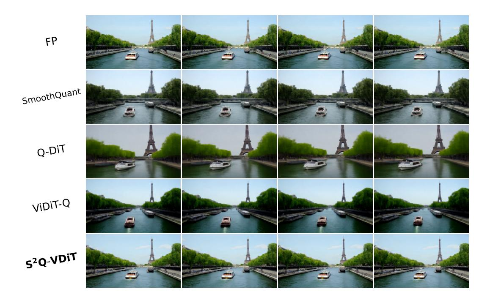
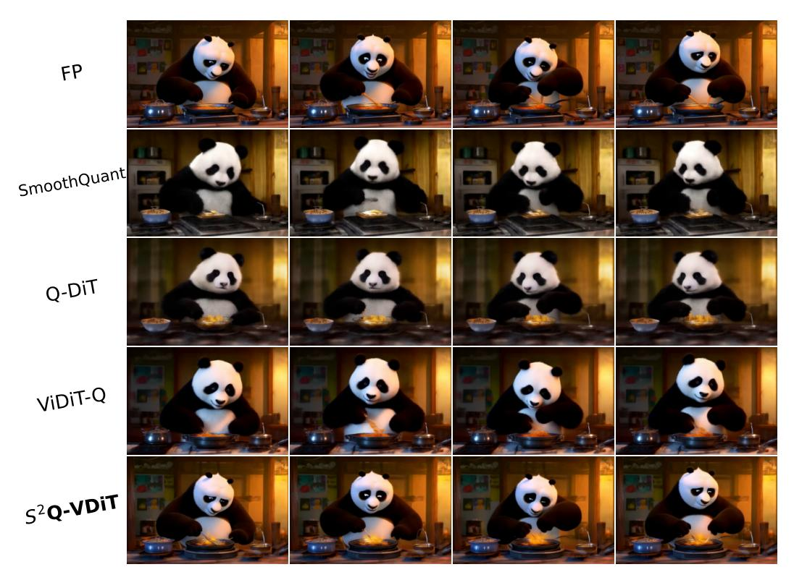
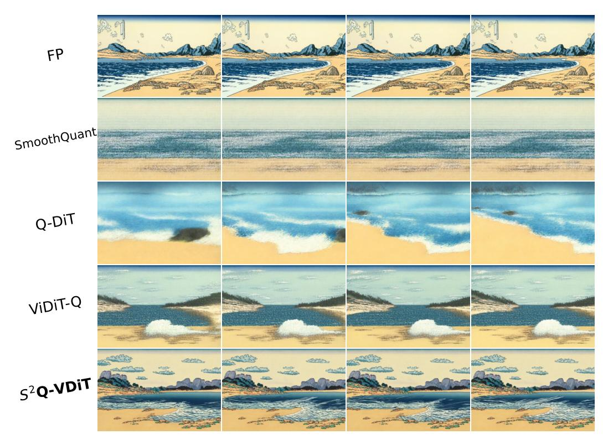
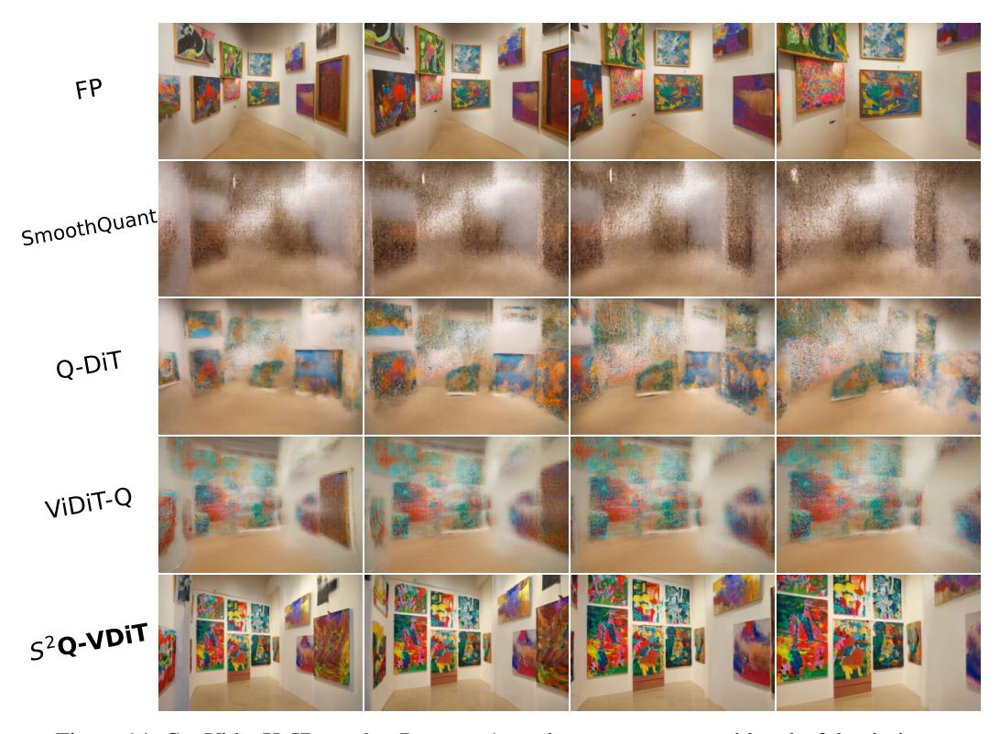
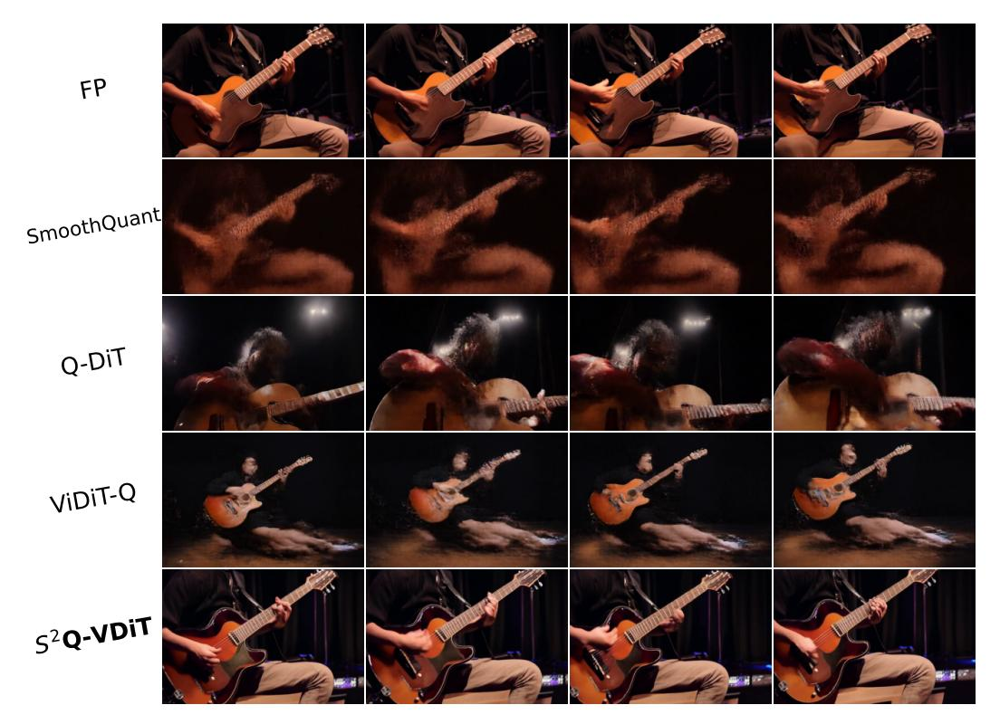
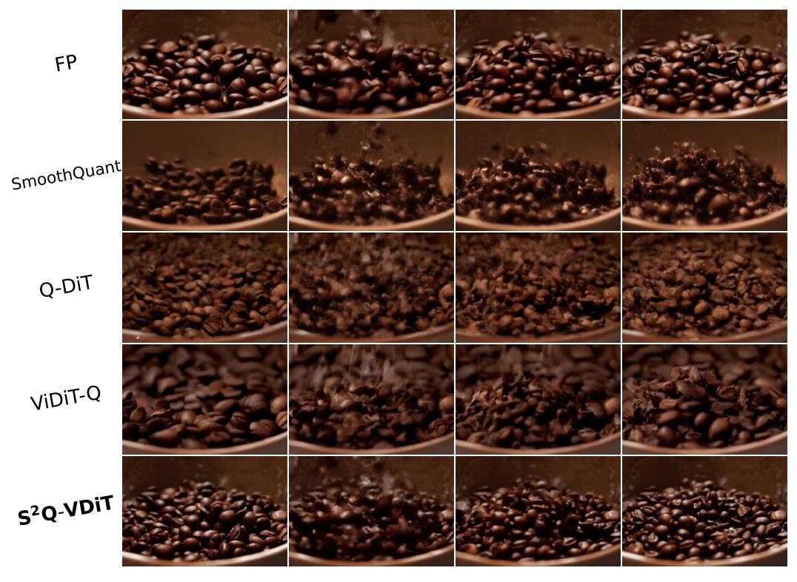
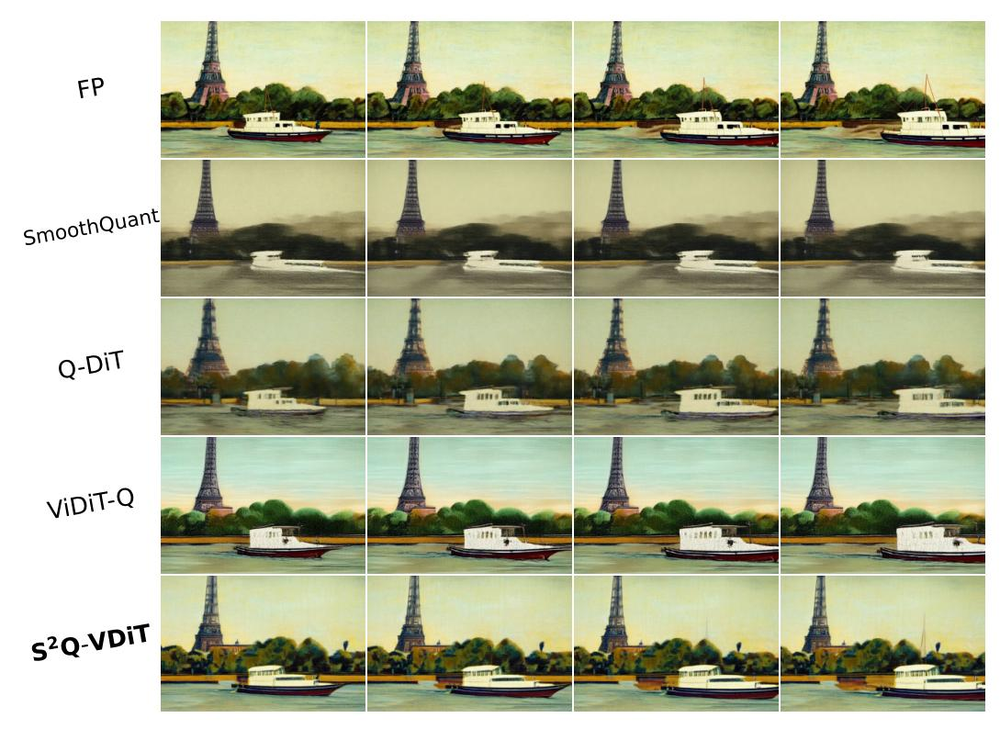

# **F** More Experiments on Deployment Efficiency

Figure 7: Deployment latency comparison under different batch size.

We further expanded the experiments provided in Sec. 4.5. We compared the deployment efficiency of different models under different batch sizes in Fig. 7. Our  $S^2Q$ -VDiT can bring consistent inference acceleration to different models under different batch sizes. Under the 50-step inference setting of CogVideoX-5B with a batch size of 4, our  $S^2Q$ -VDiT can reduce the inference latency from 945.4s to 782.5s, achieving a significant acceleration of 163 seconds and outperforming the baseline method PTQ4DiT [54].

Table 9: Calibration cost about each component.

| Hess         | sian Approximation    | n                  | Attention Computation |                          |                    |  |  |  |  |
|--------------|-----------------------|--------------------|-----------------------|--------------------------|--------------------|--|--|--|--|
| Method       | Construct Time (mins) | Imaging Quality | Method                | Calibration Time (hours) | Imaging Quality |  |  |  |  |
| CogVideoX-2B |                       |                    |                       |                          |                    |  |  |  |  |
| FP           | -                     | 58.69              | FP                    | -                        | 58.69              |  |  |  |  |
| w/o Hessian  | 7.708                 | 53.16              | w/o Attention         | 2.82                     | 52.16              |  |  |  |  |
| w Hessian    | 7.717                 | 55.49              | w Attention           | 2.84                     | 55.49              |  |  |  |  |
|              |                       | CogV               | ideoX-5B              |                          |                    |  |  |  |  |
| FP           | -                     | 61.80              | FP                    | -                        | 61.80              |  |  |  |  |
| w/o Hessian  | 20.719                | 58.91              | w/o Attention         | 3.97                     | 58.23              |  |  |  |  |
| w Hessian    | 20.734                | 60.75              | w Attention           | 4.00                     | 60.75              |  |  |  |  |
|              | Hunyuan Video-13B     |                    |                       |                          |                    |  |  |  |  |
| FP           | -                     | 62.30              | FP                    | -                        | 62.30              |  |  |  |  |
| w/o Hessian  | 19.505                | 57.25              | w/o Attention         | 5.70                     | 56.94              |  |  |  |  |
| w Hessian    | 19.508                | 58.83              | w Attention           | 5.73                     | 58.83              |  |  |  |  |

### **G** More Detailed Calibration Resource Cost

We reported the time increase caused by using the Hessian approximation when constructing the calibration dataset and the attention scores calculation across different scale video generation models in Tab. 9.

It can be seen that the computational burden of using Hessian approximation is minor, but it can bring significant performance improvement. We use the Levenberg-Marquardt approximation [13] to calculate the Hessian approximation, which requires only one step matrix multiplication to obtain the approximate result, and is very efficient.

Also, during the calibration process, we only need to use the Full-Precision model to conduct a single forward calculation of attention scores for all data in advance. When optimizing the quantization model, we can directly get the pre-computed attention scores by the data index, which brings minimal burden.

### **H** More Visualization about Sparse Attention Pattern

Figure 8: Visualization of attention heatmaps in CogVideoX-2B.

Figure 9: Visualization of token-wise attention distribution in CogVideoX-2B.

We demonstrate the sparse attention patterns existing in V-DMs that we mentioned in Sec 3.3. We present more visualization results of different blocks of CogVideoX-2B in Fig. 8 and Fig. 9. There is a considerable degree of sparse attention patterns in the most layers of the model, and almost all 90% tokens have significantly lower attention weights than the top 10% tokens. This indicates that

Figure 10: HunyuanVideo-13B results. Prompt: A cat wearing sunglasses on a beach.

sparse attention is commonly present in V-DMs, and almost every layer only has a small portion of tokens that play an important role in the final output. This proves the universality of our observations in Sec. 3.3 and the effectiveness of our Attention-guided Sparse Token Distillation.

### I More Visualization Results

We present more visual comparison results on HunyuanVideo-13B [24], CogVideoX-5B, and CogVideoX-2B [58] under W4A6 quantization in the following figures. Compared with current methods SmoothQuant [55], Q-DiT [2], ViDiT-Q [62], our  $S^2Q$ -VDiT made notable visual improvement on different scale video diffusion models. This proves that our  $S^2Q$ -VDiT not only surpasses existing methods in terms of evaluation metrics but also shows significant improvement in visual effects, demonstrating the effectiveness of our  $S^2Q$ -VDiT.

### J Limitations

Although our S2Q-VDiT outperforms existing methods, it cannot achieve completely lossless performance under the most difficult fully 4-bit quantization. We hope to optimize the quantization performance under low bit settings in the future.

### **K** Broader Impacts

Our quantized model may be used by people to generate false content, and we will require users to apply our model in legitimate and reasonable scenarios and label it as AI-generated.

Figure 11: HunyuanVideo-13B results. Prompt: A boat sailing leisurely along the Seine River with the Eiffel Tower in background.

Figure 12: HunyuanVideo-13B results. Prompt: A panda cooking in the kitchen.

Figure 13: CogVideoX-5B results. Prompt: A beautiful coastal beach in spring, waves lapping on sand by Hokusai, in the style of Ukiyo.

Figure 14: CogVideoX-5B results. Prompt: A modern art museum, with colorful paintings.

Figure 15: CogVideoX-5B results. Prompt: Yoda playing guitar on the stage.

Figure 16: CogVideoX-2B results. Prompt: Macro slo-mo. Slow motion cropped closeup of roasted coffee beans falling into an empty bowl.

Figure 17: CogVideoX-2B results. Prompt: A boat sailing leisurely along the Seine River with the Eiffel Tower in background by Vincent van Gogh.

