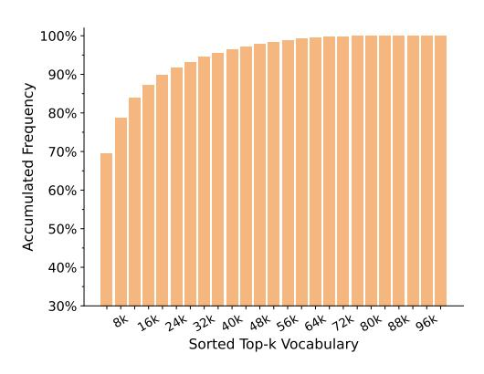
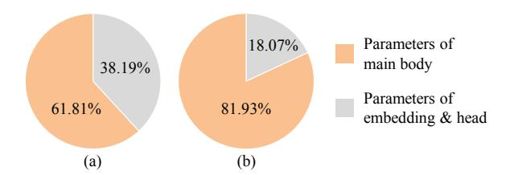
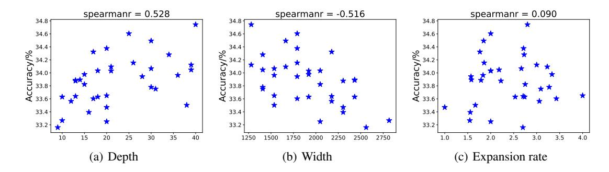
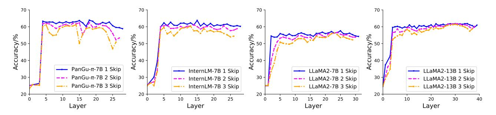
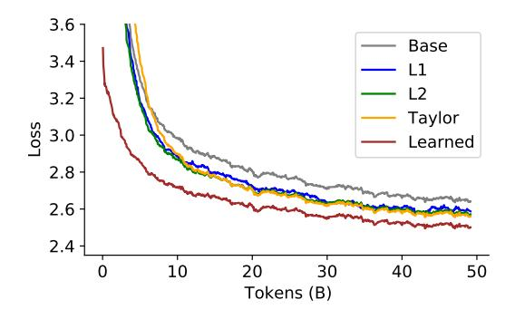
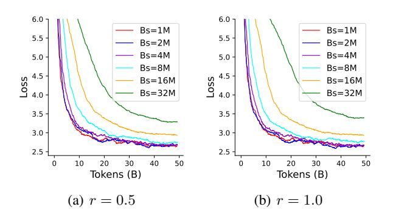
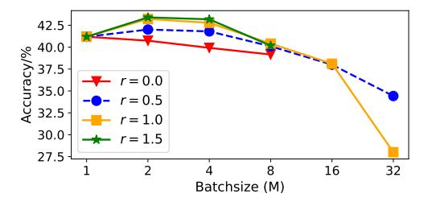
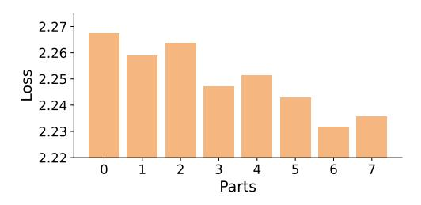
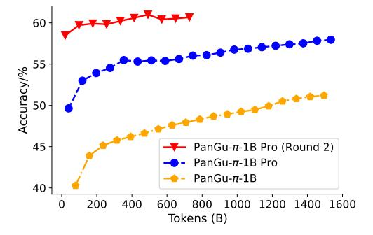

# 2. Neural Architecture

In this section, we investigate the architecture design of tiny language models. The experiments are conducted on 50B tokens randomly sampled from the pre-trained dataset, with equal proportions of Chinese and English corpus. The baseline is a 1B parameter model with LLaMA-like architecture unless specified. The models constructed with different strategies are compared on ARC Easy [\(Clark et al.,](#page-9-0) [2018\)](#page-9-0), HellaSwag [\(Zellers et al.,](#page-11-1) [2019\)](#page-11-1) and C3 [\(Sun et al.,](#page-10-7) [2020\)](#page-10-7).

## 2.1. Compact Tokenizer

The tokenizer serves to map original natural language into tokens suitable for processing by large language models, with each token representing a word, subword, character, or symbol. A multilingual tokenizer typically has a large vocabulary to cover various corpora. However, in the context of a tiny language model, an overly large vocabulary can significantly occupy a substantial portion of the model's parameters. For instance, Qwen-7B [\(Bai et al.,](#page-8-0) [2023\)](#page-8-0), Baichuan2- 7B [\(Yang et al.,](#page-10-3) [2023\)](#page-10-3), and PanGu-π-7B [\(Wang et al.,](#page-10-0) [2023\)](#page-10-0) have vocabulary sizes of 151936, 125696, 100883, respectively. The parameters of their heads and embedding layers account for 16.12% ,13.72%, 10.91% of the overall parameters. While the PanGu-π-1B model with 12 layers and a width of 2048, using the same tokenizer, sees the head and embedding layers' parameters comprising a substantial 36.8% of the total (Figure [3\)](#page-2-0). This distribution leads to a significant allocation of parameters to vocabulary representation rather than the main body, potentially limiting the model's overall representation capacity. Therefore, compressing the tokenizer becomes essential for a tiny language model to reduce its parameter proportion.

Actually, we discover that substantial redundancy exists in the tokenizer. By initializing the tokenizers with the 100k

Figure 2. Accumulative frequency of the top-k vocabularies, where 97.86% data can be represented by a small 48k tokenizer.

vocabularies inherited from the PanGu- $\pi$  model, we conducted a frequency analysis across a vast corpus comprising approximately 1.6T tokens. As depicted in Figure 2, it is evident that tokens exhibit a long-tail effect, where the top 48k vocabularies accounting for 97.86% of all the training corpus. We conduct experiments with six vocabulary sizes {8k, 16k, 32k, 48k, 72k, 100k}, which account for 78.68%, 87.24%, 94.49%, 97.86%, 99.84% and 100% accumulated frequency respectively. Over 50% vocabularies may be redundant as they cater to less than 3% of the corpus.

We advocate for the removal of low-frequency vocabularies to reduce their parameters. Table 1 illustrates the performance variations concerning tokenizer size2. The embedding and head layers constitute 18.07% of the 1B model's parameters when using a vocabulary of 48k, showcasing the best average performance followed by the model with a vocabulary of 32k. It is noteworthy that employing an excessively small vocabulary can result in performance degradation. For instance, with an 8k tokenizer covering less than 70% of the corpus, the model exhibits subpar performance on C3 and ARC-E datasets. The tokenizer with a size of 48k also exhibits a similar compression rate to that of the original 100k size tokenizer, which is evaluated across the entire training corpus. Therefore, we recommend using a compact tokenizer covering over 90% of the corpus, while ensuring the parameter proportion of embedding and head layers remains below 20%.

#### 2.2. Architecture Tweak

In this part, we focus on the neural architecture design of LLM for edge devices by exploring the impact of depth, width and the expanding rate of Feed-Forward Networks (FFN) on the performance of a 1B-size language model. Besides accuracy on downstream tasks, decoding speed is

Figure 3. The parameter proportions of model's main body and tokenizer. (a) The large tokenizer inherited from large multilingual models (Wang et al., 2023). (b) Compact tokenizer by removing low-frequency vocabularies.

Table 1. Performance varies w.r.t. tokenizer size. PEHF stands for the proportion of embedding and head layers over the whole model.

| Tokenizer | PEHL (%) | ARC-E | HellaSwag | C3    | Avg.  |
|-----------|----------|-------|-----------|-------|-------|
|           | 2.97     | 31.39 | 40.19     | 42.25 | 37.94 |
| 16k       | 6.01     | 30.34 | 40.10     | 45.64 | 38.69 |
| 32k       | 11.79    | 34.45 | 40.23     | 46.77 | 40.48 |
| 48k       | 18.07    | 34.39 | 41.48     | 47.70 | 41.19 |
| 72k       | 26.88    | 34.39 | 39.21     | 46.58 | 40.06 |
| 100k      | 38.19    | 34.98 | 39.11     | 47.10 | 40.40 |

another important aspect for tiny language models. We test the end-to-end inference speed (tokens per second) when generating 510 new tokens under two prefix tokens using a randomly initialized model. The speed is tested on a single NVIDIA V100 GPU with batch size 20 using FP16. We fix the vocabulary size to 48k as suggested in Section 2.1. By constraining the model's size to 1B parameters, we explore the effects of varying the model's depth, width, and expansion rate individually. Firstly, we investigate the impact of adjusting two among the three components, while maintaining the third variable at a constant level, on the model's overall performance.

The impact of the depth and width. We thoroughly investigate representative configurations as outlined in Table 2, where we can conclude that *deeper tiny language models exhibit better performance, however, at the cost of inference speed.* As the depth of the model increases, the performance increases for almost all the three benchmarks. Meanwhile, we observed that when the depth is already 20, the performance improvement (41.19  $\rightarrow$  42.02) by designing deeper architectures is minimal compared to the decrease of the inference speed (29.49  $\rightarrow$  12.81). Therefore, we recommend setting the number of layers to around 20 for 1B-parameter model with a 48k tokenizer.

As shown in Table 3, we observe close inference speed for different expanding rates when the depth is fixed. It's obviously that the 1:1 setting gets significantly worse performance. To further investigate the interplay among depth,

&lt;sup>2All model's sizes are controlled to 1B by adjusting depth.

Figure 4. Performance varies w.r.t. model's width, depth and expansion rate. The experiments are conducted on a streamlined dataset comprising 5B tokens. The accuracy is averaged among ARC Easy, HellaSwag and C3. Spearman coefficient is used to measure the correlation between performance and model's configure.

*Table 2.* Varying the depth and width of a 1B-size model with fixed vocabulary size and expanding rate. The speed is measured by tokens per second.

| Depth | Width | Speed | ARC-E | HellaSwag | C3    | Avg.  |
|-------|-------|-------|-------|-----------|-------|-------|
| 40    | 1280  | 12.81 | 37.01 | 41.00     | 48.05 | 42.02 |
| 30    | 1536  | 17.71 | 36.16 | 40.32     | 47.84 | 41.44 |
| 20    | 1792  | 29.49 | 34.39 | 41.48     | 47.70 | 41.19 |
| 15    | 2048  | 36.79 | 32.45 | 40.22     | 40.05 | 37.57 |
| 9     | 2560  | 57.53 | 32.63 | 31.06     | 42.68 | 35.46 |

*Table 3.* Varying the expanding rate and width of a 1B-size model with fixed vocabulary size and depth.

| EP Rate | Width | Speed | ARC-E | HellaSwag | C3                    | Avg.  |
|---------|-------|-------|-------|-----------|-----------------------|-------|
| 1.00    | 2304  | 28.39 | 31.75 | 38.71     | 42.68 <b>48.55</b> | 37.71 |
| 2.00    | 2048  | 28.68 | 33.33 | 41.34     | 48.55                 | 41.07 |
| 2.77    | 1792  | 28.40 | 34.39 | 41.48     | 47.70                 | 41.19 |
| 4.00    | 1536  | 28.53 | 35.27 | 39.36     | 47.18                 | 40.60 |

width and expansion rate, we sample about 30 different parameter configurations while maintaining the model size at 1B parameters and conduct training on a further streamlined dataset comprising 5B tokens. As illustrated in Figure 4, the correlation between the depth (width) and the downstream task's average performance is notably higher, with a Spearmanr correlation coefficient reaching up to 0.528. In contrast, there is no apparent linear relationship between the expansion rate and the model's ultimate performance.

**Discussion.** A compact tokenizer holds particular significance for a tiny language model, as it strikes a crucial balance between representation ability and implementation cost. The removal of low-frequency vocabularies enables the efficient elimination of substantial redundancy without significantly compromising representation capacity. Additionally, the architecture's configurations, such as width, depth, and expanding rate, exert a considerable influence on the final performance of a tiny model. Among them, depth

Table 4. Performance under different random initialization strategies, where the constant standard deviation method performs best.

| Initialization Method       | ARC-E | HellaSwag | C3    | Avg.  |
|-----------------------------|-------|-----------|-------|-------|
| Constant                    | 37.57 | 41.16     |       | 42.59 |
| GPT2 (Radford et al., 2019) | 38.62 | 39.34     | 48.44 | 42.13 |
| InternLM (Team, 2023)       | 34.39 | 41.48     | 47.70 | 41.19 |

is the primary factor for tiny language models, and deeper models usually achieve high performance at the expense of lower speed. Following the above observations, we design the architecture of PanGu- $\pi$  Pro as detailed in Table 9.

## 3. Parameter Initialization

In this section, we investigate how to initialize model's parameters with a given neural architecture, including random initialization and inheriting parameters from a large model.

#### 3.1. Random Initialization

When training model from scratch, the parameters are usually initialized with random numbers obeying normal distribution  $N(0, \sigma^2)$  with zero mean and standard deviation  $\sigma$ . A series of well-known large language models carefully design the value of  $\sigma$ , especially changing it w.r.t.layers. For example, GPT2 (Radford et al., 2019) applies a scale of  $1/\sqrt{N}$  to all linear layer parameters, where N is the number of residual layers. InternLM (Team, 2023) only applies the same scale to some special linear layer parameters, namely the out projection in MHA layers and the gate projection in MLP layers. We investigate these different initialization strategies for training tiny language model, whose results are shown in Table 4. We note that different strategies result in similar results. For simplicity and generalization, we recommend using a constant value for all layers when training tiny language models. More analyses are presented in Appendix B.

Figure 5. Performance of large language models when skipping a few layers. "x Skip" denotes adjacent x layers are discarded. Redundancies are observed within intermediate layers while the layers situated near the beginning and end are crucial for maintaining performance.

Figure 6. Training loss with different pruning strategies. "Base" denotes training from scratch without inheritance. Inheriting the model parameters with pruning yields a lower loss.

#### 3.2. Parameter Inheritance

Besides random initialization, the initial parameter of this tiny language model can also inherit from a large language model. The strong generalization ability of large model is expected to transfer to the tiny model. Compared the tiny model, the large model usually has more layers with more neurons. We firstly select important layers and then recognize critical neurons in the selected layers.

**Important layers selection.** Considering that the tiny model usually has fewer layers than the large language model, the most important layers that contribute to the final performance are required to recognize. Consequently, we conduct ablation experiments to assess the impact of individual layers on the overall performance.

To uncover general principles regarding layer importance, we conduct a variety of experiments on multiple widely-used large language models, including LLaMA2-7B, LLaMA2-13B, InternLM-7B and PanGu- $\pi$ -7B. During the inference phase, we skip specific layers and assess the resulting performance drop. Three types of layer skipping

experiments are conducted for each model, involving skipping one layer, two neighboring layers, and three contiguous layers. The outcomes are depicted in Figure 5, where we analyze the average performance of large language models on three downstream tasks, *i.e.*, ARC-E, HellaSwag, and C3. The *x*-axis represents the skipped layer index, while the *y*-axis signifies performance accuracy.

Some interesting common phenomenons are identified in these models. The shallow layers, especially the initial two to three layers, play a pivotal role in extracting features from input sequences. Removing these layers will incur significant performance drop on downstream tasks. Similarly, deep layers is also crucial, and removing them results in a deterioration of performance. Conversely, when the intermediate layers are removed, the performance is less affected, indicating that redundancy occurs within these layers. These layers are tend to be removed when inheriting parameters.

**Intra-layer parameters selection.** Within a layer, important parameters can be recognized by various metrics. How to recognizing essential parameters has well been discovered in the model pruning area (Frantar & Alistarh, 2023; Ma et al., 2023). The importance of neurons can be measured by various criteria and the most significant neurons are used as the initialization of tiny models. Weight norms, such as  $\ell_1$  and  $\ell_2$ -norm, are commonly employed to measure importance, indicating that larger weights encapsulate more crucial information (Han et al., 2015; Guo et al., 2016; Lee et al., 2021; Tang et al., 2024). The first-order Taylor expansion (Lee et al., 2019; Tanaka et al., 2020), which incorporates both weight values and gradients, is regarded as a more accurate estimation of the output. In addition to empirical criteria, essential weights can also be identified through binary masks, which are automatically learned during the training process (Xia et al., 2023; Tang et al., 2020). In the subsequent sections, we adopt these methodologies to select vital parameters from the PanGu- $\pi$ -7B (Wang et al., 2023) model as initial values for a 1B model with smaller

*Table 5.* Comparison between different parameter inheritance strategies. "Base" denotes training without inheritance.

| Inheritance Strategy                          | ARC-E | HellaSwag | C3    | Avg.  |
|-----------------------------------------------|-------|-----------|-------|-------|
| Base                                          | 36.68 | 40.34     | 49.15 | 42.06 |
| L1 (Ma et al., 2023)                          | 39.51 | 47.70     | 50.96 | 46.06 |
| L2 (Ma et al., 2023)                          | 41.98 | 48.33     | 50.68 | 47.00 |
| Taylor (Ma et al., 2023)                      | 43.21 | 48.43     | 52.05 | 47.90 |
| Learned (Xia et al., 2023; Tang et al., 2020) | 40.74 | 51.77     | 51.73 | 48.08 |

Figure 7. Training losses under different batchsize & learning rate.

weight dimensions.

Training loss curves and evaluation results are presented in Figure 6 and Table 5. In comparison to the baseline model initialized randomly, each of the small models initialized with the pruning strategy converges to a lower loss. Among the empirical criteria, the Taylor expansion yields superior results, primarily attributed to its accurate estimation of neuron importance. The model pruned using learnable masks starts with a significantly lower initial loss than the other models and ultimately converging to the lowest loss. Evaluation results across the three datasets validate the effectiveness of parameter inheritance. We recommend inheriting model parameters with the learnable strategies.

**Discussion.** The aforementioned observation confirms that the initial parameters of a model exert a substantial influence on both the convergence rate and ultimate performance of a tiny language model. Opting to inherit parameters from a larger model is generally a more favorable choice, as it allows the smaller model to assimilate the robust representation abilities of its larger models. The process of selecting significant parameters is a crucial step in this regard. Through thorough empirical investigation, we have observed that intermediate layers tend to exhibit more redundancy, and data-driven learnable masks proves effective in excavating these redundant parameters.

### 4. Model Optimization

In this section, we investigate the optimization strategies with given neural architecture and initial parameters. Firstly,

the scaling rule between learning rate and batch size is analyzed. Besides, we observe substantial performance improvement from continuing multiple rounds of training.

## 4.1. Batchsize & Learning Rate

In practical language model training, the choice of batch size is frequently tailored to the computational resources at hand. When dealing with a limited number of GPUs, opting for a smaller batch size becomes necessary. Conversely, in scenarios where a substantial number of GPUs is at our disposal, enlarging the batch size can effectively diminish the number of iterations, thereby expediting the overall training process.

However, adjusting the batch size typically has a notable impact on the final performance of the model. When increasing the batch size, it is common for the learning rate to be adjusted proportionally. We explore their combined effects in Figure 7 and Figure 8, using the formula  $lr = (bs/bs_0)^r \times lr_0$ , where the default batchsize  $bs_0$  and learning rate  $lr_0$  are set to 1M and  $1 \times 10^{-4}$ , respectively. r denotes the increment rate, which is usually set as 0.5 or 1.0 (Krizhevsky, 2014; Goyal et al., 2017). When the batchsize is smaller than 4M, the convergence speeds with different learning rates remain consistent. When the batchsize further increases, a moderate increment rate (r = 0.5)is preferable. With the same training tokens, employing an excessively large batchsize (>16M) adversely affects the convergence speed. In the majority of cases, a batch size smaller than 4M is considered the safe range for optimizing model performance. Otherwise, optimization strategies need to be specifically tailored for large batch sizes (Keskar et al., 2016; You et al., 2017; 2019).

## 4.2. Multiple-Round Training

The existing methods usually train the language model with only one round, *i.e.*, all the data are only used for one time to update the model, leaving the model's parameters unconverged. Besides, learning on large corpora may suffer from the catastrophic forgetting (Toneva et al., 2018; Winata et al., 2023) issue, *i.e.*, the model performance drops for data seen before. For tiny models, the limited model capacity makes the forgetting problem more serious. Continuing training the model can further reduce the training loss.

We conduct a simple experiment to validate the forgetting problem. As the training loss is calculated by the model parameters at the corresponding timestamp and the model parameters are updated as the training continues, the later data tend to have low loss values. Therefore, We recompute the batch-wise loss on the previous data using a PanGu- $\pi$ -1B model trained on 1.6T tokens. The training data is evenly and randomly divided into eight parts before training. Figure 9 shows how loss value varies *w.r.t.* data on each

Figure 8. Performance under different batchsize & learning rate.

Figure 9. Loss value varies w.r.t. data on different iterations using a pretrained PanGu-π-1B model. The loss is averaged among batches in each part.

part. The high loss indicate previous knowledge have been seriously forgot. Therefore, it is necessary to train the model for multiple rounds to fit the forgotten data.

To reduce the training cost, we propose a simple data refining strategy for the multiple-round training. Considering some examples are hard to fit, they should be used for further training with a high probability. Denoting the loss values in certain part as  $L = \{l_1, l_2, \cdots, l_N\}$ , where N is the total batches in this part. Note that data are randomly shuffled in the training process, and thus each batch contains various type data. In each part, the loss values are normalized, denoting the sampling probability, *i.e.*,  $p_i = \frac{\exp(l_i)}{\sum_{j=1}^N \exp(l_j)}$ . In the next round training we sample  $N_0$  batches out of N according to the sampling probability p. The impact of sampling rate  $(r = \frac{N_0}{N})$  is shown in Table 6. It shows that a higher sampling rate tends to achieve high performance. The performance improvement is marginal when the sampling rate r exceeds 50%. We plot how the evaluation metric on HellaSwag evolves during training in Figure 10. As the secondround training goes ahead, the accuracy on HellaSwag keeps rising but get converged in the later phase. In Table 7, we also try to train the models with more rounds. However, the performance also saturate gradually. To achieve a balance between performance and training efficiency, we recommend to train the model with two rounds and set sampling rate to 50%.

Table 6. Sampling rate for the next round training. The model is training with two rounds. r = 0 denotes training with one round.

| Sampling Rate $r$ | ARC-E | HellaSwag | C3    | Average |
|-------------------|-------|-----------|-------|---------|
| 0%                | 42.68 | 57.95     | 54.19 | 51.61   |
| 25%               | 43.95 | 59.55     | 56.01 | 53.17   |
| 50%               | 45.33 | 60.67     | 57.37 | 54.46   |
| 75%               | 45.52 | 60.34     | 58.16 | 54.67   |
| 100%              | 44.98 | 60.88     | 58.74 | 54.87   |

Table 7. The impact of number of training rounds. The sampling rate r is set to 50%.

| Training round | ARC-E | HellaSwag | C3    | Average |
|----------------|-------|-----------|-------|---------|
| Single round   | 42.68 | 57.95     | 54.19 | 51.61   |
| Two round      | 45.33 | 60.67     | 57.37 | 54.46   |
| Three round    | 45.11 | 61.32     | 56.88 | 54.44   |

**Discussion.** In contrast to larger models, tiny language models face a significant challenge of data forgetting due to their limited capacity. As a result, adopting a multi-round training approach becomes crucial to enhance performance. Employing data sampling proves effective in improving learning on challenging examples while simultaneously reducing training costs. Additionally, the choice of batch size and learning rate plays a pivotal role in model performance. For optimal results, it is advisable to use a batch size smaller than 4M, unless a specialized large batch optimizer is employed for a tailored approach.

#### 5. PanGu- $\pi$ Pro

Based on the above extensive and rigorous set of experiments, we make a significant improvement on our previous PanGu- $\pi$ -1B and meanwhile construct a larger and more powerful PanGu- $\pi$ -1.5B Pro. In this section, we make a comparison with the existing open-source tiny language models, where our result establishes a new SOTA. Specifically, PanGu- $\pi$ -1.5B Pro outperforms the recent proposed Qwen-1.8B (Bai et al., 2023) and Phi2-2.7B (Li et al., 2023b), which is 1.8x larger, in average performance.

Implementation details. The pre-training data, which consists of 1.6T tokens, is gathered from diverse sources from the Internet, covering English and Chinese corpus with around 1:1 scale. The used 48k tokenizer is built by byte-pair encoding (BPE, Shibata et al. (1999)) from SentencePiece (Kudo & Richardson, 2018) upon our data. Our models are trained using the AdamW optimizer (Loshchilov & Hutter, 2017) with  $\beta_1 = 0.9$ ,  $\beta_2 = 0.95$  utilizing the cosine learning rate decay (Loshchilov & Hutter, 2016) with an initial learning rate  $2 \times 10^{-4}$ . The total batch size for the training process is 2M. We follow the PanGu- $\pi$  (Wang et al.,

Table 8. Comparison with SOTA open-source tiny language models. The best model is listed in bold and second-best is listed in underlined.

|                                             | Examination  |              | Knowledge | Reasoning |       | Understanding |       |         |              |              |         |
|---------------------------------------------|--------------|--------------|-----------|-----------|-------|---------------|-------|---------|--------------|--------------|---------|
| Models                                      | C-Eval       | CMMLU        | MMLU      | AGI-Eval  | BoolQ | AX-b          | PIQA  | EPRSTMT | XSum         | C3           | Average |
| MobileLLaMA-1.4B                            | 23.93        | 25.10        | 25.05     | 18.53     | 58.75 | 45.20         | 71.27 | 46.25   | 18.19        | 37.42        | 36.97   |
| Sheared-LLaMA-1.3B                          | 24.28        | 25.10        | 25.77     | 18.01     | 62.39 | 43.57         | 72.91 | 46.25   | 16.44        | 35.45        | 37.02   |
| TinyLLaMA-1.1B                              | 27.85        | 24.64        | 25.75     | 18.54     | 56.06 | 45.47         | 70.62 | 46.25   | 20.15        | 36.71        | 37.20   |
| MobileLLaMA-2.7B                            | 23.53        | 25.55        | 26.63     | 18.43     | 54.74 | 55.80         | 72.85 | 46.25   | 16.96        | 36.11        | 37.69   |
| Chinese-LLaMA2-1.3B                         | 28.70        | 24.78        | 24.55     | 19.40     | 56.79 | 47.46         | 56.91 | 72.50   | 8.90         | 43.12        | 38.31   |
| RWKV-5-1.5B                                 | 25.92        | 25.14        | 25.66     | 19.01     | 62.29 | 54.05         | 71.22 | 46.25   | 20.67        | 49.15        | 39.94   |
| Phi-1.3B                                    | 27.78        | 25.85        | 44.32     | 23.42     | 73.52 | 44.20         | 76.99 | 50.00   | 14.90        | 38.96        | 41.99   |
| PanGu-π-1B                                  | 36.85        | 35.90        | 35.96     | 30.77     | 58.44 | 43.48         | 61.92 | 55.62   | 15.92        | 49.21        | 42.41   |
| Open-LLaMA-3B                               | 27.50        | 25.42        | 27.09     | 20.68     | 60.58 | 52.72         | 77.09 | 82.50   | 19.75        | 43.23        | 43.66   |
| Phi2-2.7B                                   | 31.86        | 32.18        | 58.49     | 28.51     | 77.40 | 43.57         | 78.89 | 46.25   | 13.66        | 40.11        | 45.09   |
| Gemma-2.5B                                  | 31.34        | 31.08        | 41.92     | 24.27     | 62.13 | 51.89         | 78.16 | 55.61   | 19.25        | 50.38        | 44.60   |
| PanGu-π-1B Pro (Ours)                       | 46.50        | 46.56        | 50.38     | 41.58     | 63.43 | 53.99         | 64.96 | 74.38   | 18.40        | 52.66        | 51.28   |
| Qwen-1.8B                                   | 53.60        | 52.12        | 46.43     | 35.83     | 64.31 | 57.79         | 73.83 | 88.12   | 20.03        | 58.30        | 55.04   |
| Qwen2-1.5B                                  | 70.66        | 70.63        | 57.49     | 40.31     | 73.15 | 50.22         | 69.57 | 82.14   | 13.78        | 76.80        | 60.47   |
| PanGu-π-1.5B Pro (Ours)                     | 52.39        | 48.51        | 62.54     | 44.89     | 70.61 | 67.93         | 79.55 | 86.12   | 24.61        | 69.24        | 60.64   |
| Qwen2.5-1.5B                                | <u>68.01</u> | 64.96        | 62.23     | 42.75     | 76.98 | 55.07         | 74.24 | 85.09   | 13.02        | <u>75.81</u> | 61.81   |
| PanGu- $\pi$ -1.5B Pro* (Ours) 3 | 65.93        | <u>68.82</u> | 64.26     | 47.94     | 80.85 | <u>63.37</u>  | 80.08 | 90.21   | <u>23.49</u> | 69.36        | 65.43   |

Figure 10. Accuracies of PanGu- $\pi$ -1B and PanGu- $\pi$ -1B Pro on HellaSwag during training.

2023) architecture while making PanGu- $\pi$ -1B much deeper. The detailed configuration can be found in Table 9. We set the expansion rate to 2.77 as suggested in Table 3. For the parameters initialization method, we inherit parameters from PanGu- $\pi$ -7B via learnable binary mask after removing intermediate redundant layers. We use the Huawei Ascend 910 card to train and evaluate the proposed PanGu- $\pi$  Pro.

Table 9. Model configuration.

| Width | Depth        | Vocabulary         | Initialization                  |
|-------|--------------|--------------------|---------------------------------|
| 2048  | 12           | 100883             | Random                          |
| 1792  | 21           | 48000              | PanGu- $\pi$ -7B                |
| 2048  | 22           | 48000              | PanGu- $\pi$ -7B                |
|       | 2048 1792 | 2048 12 1792 21 | 2048 12 100883 1792 21 48000 |

**Benchmarks.** We use OpenCompass (Contributors, 2023) to evaluate on an extensive suite of downstream tasks, cov-

ering examination, knowledg, reasoning, and understanding abilities for a comprehensive comparison. C-Eval (Huang et al., 2023) is a Chinese benchmark to evaluate the knowledge and reasoning abilities. CMMLU (Li et al., 2023a) covers 67 topics including science, engineering, and humanities. MMLU (Hendrycks et al., 2021) proposes an English benchmark for measuring LLM's multitask accuracy by covering 57 tasks including mathematics, history, computer science, and law. AGI-Eval (Zhong et al., 2023) is a benchmark specifically designed to evaluate the general abilities in tasks pertinent to human cognition and problemsolving. BoolQ (Clark et al., 2019) is a reading comprehension dataset to evaluate the difficult entailment-like inference ability of LLMs. AX-b (Wang et al., 2020) is a broadcoverage diagnostic task and PIQA (Bisk et al., 2020) is a physical interaction question-answering task. EPRSTM (Xu et al., 2021) is a binary sentiment analysis dataset based on product reviews. XSum (Narayan et al., 2018) is a summarization task collected from the British Broadcasting Corporation and C3 (Sun et al., 2020) contains 13,369 documents and their associated 19,577 multiple-choice questions.

Comparison with tiny language models. We collect multiple tiny language models with different sizes, ranging from 1B to 3B. These include TinyLLaMA-1.1B (Peiyuan Zhang & Lu, 2023), Chinese-LLaMA2-1.3B (Cui et al., 2023), Sheared-LLaMA-1.3B (Xia et al., 2023), and Open-LLaMA-3B (Geng & Liu, 2023). Meituan (Chu et al., 2023) released MobileLLaMA-1.4B and MobileLLaMA-2.7B that were trained from scratch on the RedPajama dataset (Computer, 2023). Microsoft developed the series of Phi (Li et al., 2023b) that focusing on using "textbook-quality" data with small language models. RWKV-5-1.5B (Peng et al., 2023) is a parallelizable RNN with Transformer-level LLM Performance. Qwen-1.8B (Bai et al., 2023) is pretrained on 2.2

&lt;sup>3The performance is further improved by training model with 6T data.

trillion tokens including web texts, books, codes, *etc*.

Extensive experiments in Table [8](#page-7-3) show that PanGu-π-1.5B Pro significantly outperforms existing LLMs of similar or even larger sizes, *e.g.*, Phi2-2.7B and Open-LLaMA-3B. We observe a notable improvement of 8.77 on average performance from PanGu-π-1B to PanGu-π-1B Pro. With 16.67% fewer parameters, PanGu-π-1.5B Pro outperforms Qwen-1.8B [\(Bai et al.,](#page-8-0) [2023\)](#page-8-0) and exhibits the best or second-best performance in the vast majority of the benchmarks. Overall, our model exhibits consistently better average performance compared to the current state-of-the-art models.

From PanGu-π-1B, we gradually add the core components to validate the effectiveness of our methodology. As shown in Figure [1,](#page-0-1) the removal of low-frequency vocabularies leads to an improvement of average performance from 42.41 to 44.11 while the architecture tweak contributes another 2.42 improvement. Parameter inheritance, the most effective approach, pushes the average performance to 49.79. Multipleround training further enhances the average performance of PanGu-π-1B Pro.

