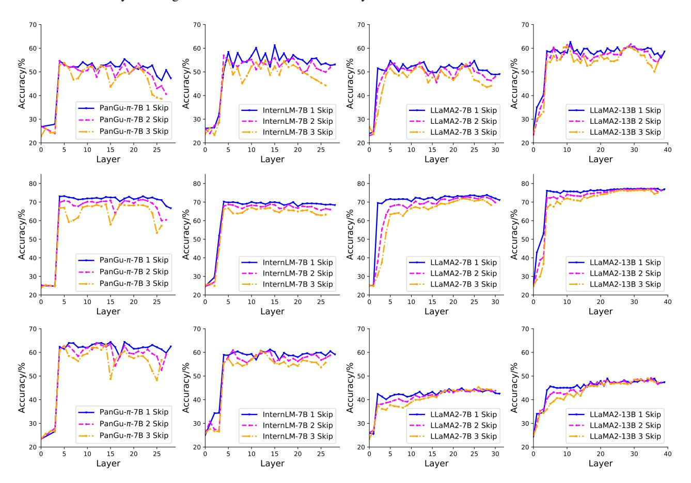

# D. Weight Decay

Weight decay [\(Loshchilov & Hutter,](#page-9-12) [2017\)](#page-9-12) is a commonly employed regularization method aimed at mitigating overfitting on the training set. We delve into its impact in Table [13.](#page-13-2) Elevating the weight decay imparts more robust regularization, albeit at the expense of constraining the model's representation capacity. Through empirical experiments, we observe that the model attains optimal performance when the weight decay is set at 0.1.

Table 13. Performance under different weight decay. The model achieved the best performance with a weight decay of 0.1.

| Weight Decay | ARC-E | HellaSwag | C3    | Average |
|--------------|-------|-----------|-------|---------|
| 0.2          | 34.68 | 36.15     | 45.31 | 38.71   |
| 0.1          | 34.39 | 41.48     | 47.70 | 41.19   |
| 0.01         | 34.74 | 36.76     | 45.26 | 38.92   |
| 0.001        | 33.59 | 37.07     | 44.93 | 38.53   |
| 0.0001       | 31.22 | 37.76     | 44.11 | 37.70   |

## E. Additional Results of Layer Selection

The layer skipping results of single downstream tasks are released in Figure 12. The performance trend of single downstream tasks are consistent to the average results shown Figure 5 of the main paper. Layers situated near the beginning and end of the model often carry more significance than the intermediate layers.

Figure 12. Layer-skipped performance of large language models on single downstream tasks. From top to bottom, the tasks are ARC-E, HellaSwag, and C3, respectively.