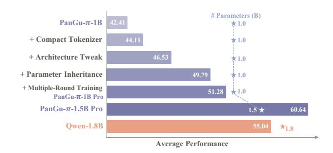

# PanGu- $\pi$ Pro: Rethinking Optimization and Architecture for Tiny Language Models

Yehui Tang 1 Kai Han 1 Fangcheng Liu 1 Yunsheng Ni 1 Yuchuan Tian 2 Zheyuan Bai 1 Yi-Qi Hu 3 Sichao Liu 3 Shangling Jui 4 Yunhe Wang 1

#### **Abstract**

The power of large language models (LLMs) has been demonstrated through numerous data and computing resources. However, the application of language models on mobile devices is facing huge challenge on the computation and memory costs, that is, tiny language models with high performance are urgently required. Limited by the highly complex training process, there are many details for optimizing language models that are seldom studied carefully. In this study, based on a tiny language model with 1B parameters, we carefully design a series of empirical study to analyze the effect of each component. Three perspectives are mainly discussed, i.e., neural architecture, parameter initialization, and optimization strategy. Several design formulas are empirically proved especially effective for tiny language models, including tokenizer compression, architecture tweaking, parameter inheritance and multiple-round training. Then we train PanGu- $\pi$ -1B Pro and PanGu- $\pi$ -1.5B Pro on 1.6T multilingual corpora, following the established formulas. Experimental results demonstrate the improved optimization and architecture yield a notable average improvement of 8.87 on benchmark evaluation sets for PanGu- $\pi$ -1B Pro. Besides, PanGu- $\pi$ -1.5B Pro surpasses a range of SOTA models with larger model sizes, validating its superior performance. The code is available1.

Proceedings of the 41st International Conference on Machine Learning, Vienna, Austria. PMLR 235, 2024. Copyright 2024 by the author(s).

Figure 1. PanGu- $\pi$  Pro with improved architecture and optimization methods. PanGu- $\pi$ -1B (Wang et al., 2023) directly use the developing strategies of LLMs while PanGu- $\pi$ -1B Pro achieves an average performance improvement of 8.87 with our methodology. It is worth mentioning that PanGu- $\pi$ -1.5B Pro outperforms Qwen-1.8B (Bai et al., 2023) with 16.67% fewer parameters.

## 1. Introduction

Large language models (LLMs), trained on extensive corpora, have demonstrated impressive performance across diverse natural language tasks. The release of ChatGPT, with its robust generalization capabilities, has captured global attention and holds the potential to revolutionize the interaction between humans and computers.

In addition to the GPT-series models (Radford et al., 2018; Brown et al., 2020; Achiam et al., 2023), various large language models have emerged. PaLM (Chowdhery et al., 2023) trains a model with an impressive 540B parameters across 6144 TPU v4 chips. LLaMA (Touvron et al., 2023) releases a series of foundational language models, ranging from 7B to 70B parameters. Both the model architecture and trained weights are open-source, fostering collaboration within the AI community. Most of the following large models leverage similar architectures and training methodologies. For instance, Baichuan teams (Yang et al., 2023) train 7B and 13B parameter models on a 2.6T token dataset encompassing both Chinese and English corpora. Qwen (Bai et al., 2023), Yi (Yi, 2023), and Skywork (Wei et al., 2023) pursue similar paths, training models with 2.4T, 3T, and 3.2T tokens, respectively. Primarily attributed to the increas-

&lt;sup>1Huawei Noah's Ark Lab 2Peking University 3Consumer Business Group, Huawei 4Huawei Kirin Solution. Correspondence to: Yunhe Wang <yunhe.wang@huawei.com>.

https://github.com/YuchuanTian/
RethinkTinyLM

ing accumulation of cleaned data, the performance of LLMs improves rapidly.

While numerous studies have successfully trained various high-performance language models [\(Ren et al.,](#page-10-6) [2023;](#page-10-6) [Zeng](#page-11-0) [et al.,](#page-11-0) [2022\)](#page-11-0), the methodologies employed in training such models remain insufficiently analyzed. On one hand, a substantial body of work concentrates on collecting and cleaning data, with less emphasis on researching effective training strategies. On the other hand, the training of large models demands an exceedingly high computational resource investment, making it impractical to explore a wide range of optimization strategies. As a result, recent works often adopt similar training recipes when constructing LLMs [\(Touvron](#page-10-2) [et al.,](#page-10-2) [2023;](#page-10-2) [Yi,](#page-10-4) [2023;](#page-10-4) [Bai et al.,](#page-8-0) [2023;](#page-8-0) [Wei et al.,](#page-10-5) [2023\)](#page-10-5).

Moreover, the implementation of these large models demands prohibitively high memory and computational resources, constraining their practical applicability in various scenarios. For example, the GPT-3 with 175B parameters necessitates approximately 700GB of memory when stored with FP32 datatype. Although the 7B parameter models are relatively more efficient, their resource requirements still render them impractical for deployment on edge devices, such as mobile phones.

In this paper, we systematically rethink the methodology for constructing a tiny language model, including neural architecture, parameter initialization, and optimization strategy:

- Neural architecture: Adopting the tokenizer directly from larger models introduces redundant parameters, resulting in increased computational overhead. Streamlining the tokenizer by removing low-frequency vocabularies enhances the model's representational efficiency. Moreover, we observe that the configuration of the model's architecture (depth, width, and expanding rate in FFN) has a significant impact on the final performance. Depth is the primary factor for tiny language models, and deeper models usually achieve high performance at the expense of lower inference speed.
- Parameter initialization: Inheriting parameters from the large model proves effective in boosting performance and expediting convergence. The identification of crucial parameters is imperative in this context. We have observed that layers situated near the beginning and end of the model often carry more significance than the intermediate layers. Furthermore, within each layer, the adoption of data-driven learnable criteria has demonstrated greater efficacy compared to heuristic methods.
- Model optimization: In comparison to larger models, tiny models face more severe data forgetting issues, and multiple-round training proves beneficial for memory

enhancement. We propose a straightforward sample selection strategy to mitigate the training cost associated with multiple-round training. Besides, we also delve into the relationship between batch size and learning rate specifically for tiny models.

Drawing from the aforementioned insights, we develop PanGu-π-1B Pro and PanGu-π-1.5B Pro with enhanced architecture and optimization methods. From the developing strategies of LLMs, we gradually add four core components to improve performance (see Figure [1\)](#page-0-1). The models are evaluated on various benchmarks including examination, knowledge, reasoning, and understanding, where our models achieve SOTA performance when compared with models of similar sizes. For instance, with 16.67% fewer parameters, PanGu-π-1.5B Pro achieves an average score of 60.64, outperforming Qwen-1.8B which achieves a score of 55.04.

