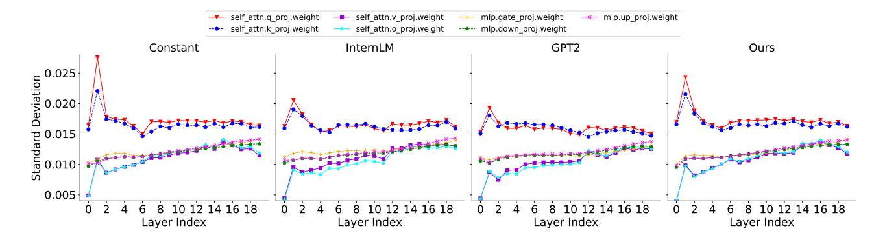

# References

- Achiam, J., Adler, S., Agarwal, S., Ahmad, L., Akkaya, I., Aleman, F. L., Almeida, D., Altenschmidt, J., Altman, S., Anadkat, S., et al. Gpt-4 technical report. *arXiv preprint arXiv:2303.08774*, 2023.
- Ainslie, J., Lee-Thorp, J., de Jong, M., Zemlyanskiy, Y., Lebron, F., and Sanghai, S. Gqa: Training generalized ´ multi-query transformer models from multi-head checkpoints. *arXiv preprint arXiv:2305.13245*, 2023.
- Bai, J., Bai, S., Chu, Y., Cui, Z., Dang, K., Deng, X., Fan, Y., Ge, W., Han, Y., Huang, F., Hui, B., Ji, L., Li, M., Lin, J., Lin, R., Liu, D., Liu, G., Lu, C., Lu, K., Ma, J., Men, R., Ren, X., Ren, X., Tan, C., Tan, S., Tu, J., Wang, P., Wang, S., Wang, W., Wu, S., Xu, B., Xu, J., Yang, A., Yang, H., Yang, J., Yang, S., Yao, Y., Yu, B., Yuan, H., Yuan, Z., Zhang, J., Zhang, X., Zhang, Y., Zhang, Z., Zhou, C., Zhou, J., Zhou, X., and Zhu, T. Qwen technical report. *arXiv preprint arXiv:2309.16609*, 2023.
- Bisk, Y., Zellers, R., Bras, R. L., Gao, J., and Choi, Y. Piqa: Reasoning about physical commonsense in natural language. In *Thirty-Fourth AAAI Conference on Artificial Intelligence*, 2020.
- Brown, T., Mann, B., Ryder, N., Subbiah, M., Kaplan, J. D., Dhariwal, P., Neelakantan, A., Shyam, P., Sastry, G., Askell, A., et al. Language models are few-shot learners. *Advances in neural information processing systems*, 33: 1877–1901, 2020.
- Chowdhery, A., Narang, S., Devlin, J., Bosma, M., Mishra, G., Roberts, A., Barham, P., Chung, H. W., Sutton, C., Gehrmann, S., et al. Palm: Scaling language modeling with pathways. *Journal of Machine Learning Research*, 24(240):1–113, 2023.
- Chu, X., Qiao, L., Lin, X., Xu, S., Yang, Y., Hu, Y., Wei, F., Zhang, X., Zhang, B., Wei, X., and Shen, C. Mobilevlm: A fast, strong and open vision language assistant for mobile devices, 2023.
- Clark, C., Lee, K., Chang, M.-W., Kwiatkowski, T., Collins, M., and Toutanova, K. Boolq: Exploring the surprising difficulty of natural yes/no questions. In *NAACL*, 2019.

- Clark, P., Cowhey, I., Etzioni, O., Khot, T., Sabharwal, A., Schoenick, C., and Tafjord, O. Think you have solved question answering? try arc, the ai2 reasoning challenge, 2018.
- Computer, T. Redpajama: An open source recipe to reproduce llama training dataset, 2023. URL [https://github.com/togethercomputer/](https://github.com/togethercomputer/RedPajama-Data) [RedPajama-Data](https://github.com/togethercomputer/RedPajama-Data).
- Contributors, O. Opencompass: A universal evaluation platform for foundation models. [https://github.](https://github.com/open-compass/opencompass) [com/open-compass/opencompass](https://github.com/open-compass/opencompass), 2023.
- Cui, Y., Yang, Z., and Yao, X. Efficient and effective text encoding for chinese llama and alpaca. *arXiv preprint arXiv:2304.08177*, 2023. URL [https://](https://arxiv.org/abs/2304.08177) [arxiv.org/abs/2304.08177](https://arxiv.org/abs/2304.08177).
- Frantar, E. and Alistarh, D. Sparsegpt: Massive language models can be accurately pruned in one-shot. In *International Conference on Machine Learning*, pp. 10323– 10337. PMLR, 2023.
- Geng, X. and Liu, H. Openllama: An open reproduction of llama, May 2023. URL [https://github.com/](https://github.com/openlm-research/open_llama) [openlm-research/open\\_llama](https://github.com/openlm-research/open_llama).
- Goyal, P., Dollar, P., Girshick, R., Noordhuis, P., ´ Wesolowski, L., Kyrola, A., Tulloch, A., Jia, Y., and He, K. Accurate, large minibatch sgd: Training imagenet in 1 hour. *arXiv preprint arXiv:1706.02677*, 2017.
- Guo, Y., Yao, A., and Chen, Y. Dynamic network surgery for efficient dnns. In Lee, D. D., Sugiyama, M., von Luxburg, U., Guyon, I., and Garnett, R. (eds.), *Advances in Neural Information Processing Systems 29: Annual Conference on Neural Information Processing Systems 2016, December 5-10, 2016, Barcelona, Spain*, pp. 1379– 1387, 2016.
- Han, S., Pool, J., Tran, J., and Dally, W. J. Learning both weights and connections for efficient neural networks. *CoRR*, abs/1506.02626, 2015. URL [http://arxiv.](http://arxiv.org/abs/1506.02626) [org/abs/1506.02626](http://arxiv.org/abs/1506.02626).
- Hendrycks, D., Burns, C., Basart, S., Zou, A., Mazeika, M., Song, D., and Steinhardt, J. Measuring massive multitask language understanding. *Proceedings of the International Conference on Learning Representations (ICLR)*, 2021.
- Huang, Y., Bai, Y., Zhu, Z., Zhang, J., Zhang, J., Su, T., Liu, J., Lv, C., Zhang, Y., Lei, J., Fu, Y., Sun, M., and He, J. C-eval: A multi-level multi-discipline chinese evaluation suite for foundation models. *arXiv preprint arXiv:2305.08322*, 2023.

- Keskar, N. S., Mudigere, D., Nocedal, J., Smelyanskiy, M., and Tang, P. T. P. On large-batch training for deep learning: Generalization gap and sharp minima. *arXiv preprint arXiv:1609.04836*, 2016.
- Krizhevsky, A. One weird trick for parallelizing convolutional neural networks. *arXiv preprint arXiv:1404.5997*, 2014.
- Kudo, T. and Richardson, J. Sentencepiece: A simple and language independent subword tokenizer and detokenizer for neural text processing. *arXiv preprint arXiv:1808.06226*, 2018.
- Lee, J., Park, S., Mo, S., Ahn, S., and Shin, J. Layer-adaptive sparsity for the magnitude-based pruning. In *9th International Conference on Learning Representations, ICLR 2021, Virtual Event, Austria, May 3-7, 2021*. OpenReview.net, 2021. URL [https://openreview.net/](https://openreview.net/forum?id=H6ATjJ0TKdf) [forum?id=H6ATjJ0TKdf](https://openreview.net/forum?id=H6ATjJ0TKdf).
- Lee, N., Ajanthan, T., and Torr, P. H. S. Snip: singleshot network pruning based on connection sensitivity. In *7th International Conference on Learning Representations, ICLR 2019, New Orleans, LA, USA, May 6-9, 2019*. OpenReview.net, 2019. URL [https://openreview.](https://openreview.net/forum?id=B1VZqjAcYX) [net/forum?id=B1VZqjAcYX](https://openreview.net/forum?id=B1VZqjAcYX).
- Li, H., Zhang, Y., Koto, F., Yang, Y., Zhao, H., Gong, Y., Duan, N., and Baldwin, T. Cmmlu: Measuring massive multitask language understanding in chinese, 2023a.
- Li, Y., Bubeck, S., Eldan, R., Del Giorno, A., Gunasekar, S., and Lee, Y. T. Textbooks are all you need ii: phi-1.5 technical report. *arXiv preprint arXiv:2309.05463*, 2023b.
- Loshchilov, I. and Hutter, F. Sgdr: Stochastic gradient descent with warm restarts. *arXiv preprint arXiv:1608.03983*, 2016.
- Loshchilov, I. and Hutter, F. Decoupled weight decay regularization. *arXiv preprint arXiv:1711.05101*, 2017.
- Ma, X., Fang, G., and Wang, X. Llm-pruner: On the structural pruning of large language models. *arXiv preprint arXiv:2305.11627*, 2023.
- Narayan, S., Cohen, S. B., and Lapata, M. Don't give me the details, just the summary! topic-aware convolutional neural networks for extreme summarization, 2018.
- Peiyuan Zhang, Guangtao Zeng, T. W. and Lu, W. Tinyllama, Sep 2023. URL [https://github.com/](https://github.com/jzhang38/TinyLlama) [jzhang38/TinyLlama](https://github.com/jzhang38/TinyLlama).
- Peng, B., Alcaide, E., Anthony, Q., Albalak, A., Arcadinho, S., Cao, H., Cheng, X., Chung, M., Grella, M., GV, K. K.,

- et al. Rwkv: Reinventing rnns for the transformer era. *arXiv preprint arXiv:2305.13048*, 2023.
- Radford, A., Narasimhan, K., Salimans, T., Sutskever, I., et al. Improving language understanding by generative pre-training. 2018.
- Radford, A., Wu, J., Child, R., Luan, D., Amodei, D., Sutskever, I., et al. Language models are unsupervised multitask learners. *OpenAI blog*, 1(8):9, 2019.
- Ren, X., Zhou, P., Meng, X., Huang, X., Wang, Y., Wang, W., Li, P., Zhang, X., Podolskiy, A., Arshinov, G., et al. Pangu-Σ: Towards trillion parameter language model with sparse heterogeneous computing. *arXiv preprint arXiv:2303.10845*, 2023.
- Shazeer, N. Fast transformer decoding: One write-head is all you need. *arXiv preprint arXiv:1911.02150*, 2019.
- Shibata, Y., Kida, T., Fukamachi, S., Takeda, M., Shinohara, A., Shinohara, T., and Arikawa, S. Byte pair encoding: A text compression scheme that accelerates pattern matching. 1999.
- Sun, K., Yu, D., Yu, D., and Cardie, C. Investigating prior knowledge for challenging chinese machine reading comprehension. *Transactions of the Association for Computational Linguistics*, 2020. URL [https:](https://arxiv.org/abs/1904.09679v3) [//arxiv.org/abs/1904.09679v3](https://arxiv.org/abs/1904.09679v3).
- Tanaka, H., Kunin, D., Yamins, D. L. K., and Ganguli, S. Pruning neural networks without any data by iteratively conserving synaptic flow. In Larochelle, H., Ranzato, M., Hadsell, R., Balcan, M., and Lin, H. (eds.), *Advances in Neural Information Processing Systems 33: Annual Conference on Neural Information Processing Systems 2020, NeurIPS 2020, December 6-12, 2020, virtual*, 2020.
- Tang, Y., Wang, Y., Xu, Y., Tao, D., Xu, C., Xu, C., and Xu, C. Scop: Scientific control for reliable neural network pruning. *Advances in Neural Information Processing Systems*, 33:10936–10947, 2020.
- Tang, Y., Wang, Y., Guo, J., Tu, Z., Han, K., Hu, H., and Tao, D. A survey on transformer compression. *arXiv preprint arXiv:2402.05964*, 2024.
- Team, I. Internlm: A multilingual language model with progressively enhanced capabilities, 2023.
- Toneva, M., Sordoni, A., Combes, R. T. d., Trischler, A., Bengio, Y., and Gordon, G. J. An empirical study of example forgetting during deep neural network learning. *arXiv preprint arXiv:1812.05159*, 2018.
- Touvron, H., Lavril, T., Izacard, G., Martinet, X., Lachaux, M.-A., Lacroix, T., Roziere, B., Goyal, N., Hambro, E., `

- Azhar, F., et al. Llama: Open and efficient foundation language models. *arXiv preprint arXiv:2302.13971*, 2023.
- Vaswani, A., Shazeer, N., Parmar, N., Uszkoreit, J., Jones, L., Gomez, A. N., Kaiser, Ł., and Polosukhin, I. Attention is all you need. *Advances in neural information processing systems*, 30, 2017.
- Wang, A., Pruksachatkun, Y., Nangia, N., Singh, A., Michael, J., Hill, F., Levy, O., and Bowman, S. R. Superglue: A stickier benchmark for general-purpose language understanding systems, 2020.
- Wang, Y., Chen, H., Tang, Y., Guo, T., Han, K., Nie, Y., Wang, X., Hu, H., Bai, Z., Wang, Y., et al. Pangu-π: Enhancing language model architectures via nonlinearity compensation. *arXiv preprint arXiv:2312.17276*, 2023.
- Wei, T., Zhao, L., Zhang, L., Zhu, B., Wang, L., Yang, H., Li, B., Cheng, C., Lu, W., Hu, R., Li, C., Yang, L., Luo, ¨ X., Wu, X., Liu, L., Cheng, W., Cheng, P., Zhang, J., Zhang, X., Lin, L., Wang, X., Ma, Y., Dong, C., Sun, Y., Chen, Y., Peng, Y., Liang, X., Yan, S., Fang, H., and Zhou, Y. Skywork: A more open bilingual foundation model, 2023.
- Winata, G. I., Xie, L., Radhakrishnan, K., Wu, S., Jin, X., Cheng, P., Kulkarni, M., and Preotiuc-Pietro, D. Overcoming catastrophic forgetting in massively multilingual continual learning. *arXiv preprint arXiv:2305.16252*, 2023.
- Xia, M., Gao, T., Zeng, Z., and Chen, D. Sheared llama: Accelerating language model pre-training via structured pruning. 2023.
- Xu, L., Lu, X., Yuan, C., Zhang, X., Xu, H., Yuan, H., Wei, G., Pan, X., Tian, X., Qin, L., et al. Fewclue: A chinese few-shot learning evaluation benchmark. *arXiv preprint arXiv:2107.07498*, 2021.
- Yang, A., Xiao, B., Wang, B., Zhang, B., Bian, C., Yin, C., Lv, C., Pan, D., Wang, D., Yan, D., et al. Baichuan 2: Open large-scale language models. *arXiv preprint arXiv:2309.10305*, 2023.
- Yi. A series of large language models trained from scratch by developers at 01-ai. [https://github.com/](https://github.com/01-ai/Yi) [01-ai/Yi](https://github.com/01-ai/Yi), 2023.
- You, Y., Gitman, I., and Ginsburg, B. Large batch training of convolutional networks. *arXiv preprint arXiv:1708.03888*, 2017.
- You, Y., Li, J., Reddi, S., Hseu, J., Kumar, S., Bhojanapalli, S., Song, X., Demmel, J., Keutzer, K., and Hsieh, C.-J. Large batch optimization for deep learning: Training bert in 76 minutes. *arXiv preprint arXiv:1904.00962*, 2019.

- Zellers, R., Holtzman, A., Bisk, Y., Farhadi, A., and Choi, Y. Hellaswag: Can a machine really finish your sentence?, 2019.
- Zeng, A., Liu, X., Du, Z., Wang, Z., Lai, H., Ding, M., Yang, Z., Xu, Y., Zheng, W., Xia, X., et al. Glm-130b: An open bilingual pre-trained model. *arXiv preprint arXiv:2210.02414*, 2022.
- Zhong, W., Cui, R., Guo, Y., Liang, Y., Lu, S., Wang, Y., Saied, A., Chen, W., and Duan, N. Agieval: A human-centric benchmark for evaluating foundation models, 2023.

## A. Multi-head Attention v.s. Group-query Attention

Current mainstream LLaMA architectures, such as Qwen (Bai et al., 2023) and InternLM (Team, 2023), commonly employ multi-head attention (MHA) mechanisms (Vaswani et al., 2017). However, storing a large amount of KV (key and value) cache in memory-constrained edge devices poses a significant challenge, especially in long text input scenarios. Group query attention (Ainslie et al., 2023) is recently proposed to seek a balance between multi-head attention and multi-query attention (Shazeer, 2019). By sharing the same key-value heads for all queries in each group, the RAM requirement for the KV cache can be largely reduced in edge devices. We convert our pretrained PanGu- $\pi$ -1.5B Pro to its GQA version by mean-pooling (Ainslie et al., 2023) the KV heads in each group and then continually training on only 5% of the origin dataset. The number of groups is set to 8. As shown in Table 10, the converted GQA version model exhibits comparable performance to the MHA counterpart with fewer parameters.

| Table 10. Comparison between MHA and GOA | Table 10. | Comparison | between | MHA aı | nd GOA |
|------------------------------------------|-----------|------------|---------|--------|--------|
|------------------------------------------|-----------|------------|---------|--------|--------|

| Attn. | Size | C-Eval | CMMLU | MMLU  | AGI-Eval |
|-------|------|--------|-------|-------|----------|
| MHA   | 1.5B | 52.91  | 49.51 | 53.76 | 44.42    |
| GQA   | 1.4B | 48.75  | 46.94 | 51.97 | 43.59    |

## **B. Improved Random Initialization**

When training the model from scratch, we typically initialise the weight of linear layers using a normal distribution  $N(0, \sigma^2)$  with zero mean and standard deviation  $\sigma$ . Some methods (Radford et al., 2019; Team, 2023) use different standard deviations for different layers. Figure 11 shows the standard deviations of different layers after pretraining, indicating that the parameter distributions will be similar from different initialisation values. In particular, the variance of the four linear layers within the MHA layer varies with the depth, while the variance of the linear layers within the MLP layers remains almost constant.

We introduce an improved initialization method that adapts the standard deviation of different linear weights to the depth of the model. In the MHA, the initial standard deviation of the query and key projection parameters decreases from  $\sqrt{2}\sigma$  to  $\sigma$ , while that of the value and out projection parameters increases from  $\sigma/\sqrt{2}$  to  $\sigma$ , as the layer index increases. In the MLP, we keep the initial standard deviation of the linear weights constant at  $\sigma$  for all layers. As demonstrated in Table 11, our approach exhibits a marginal superiority over the constant initialization approach.

### C. The Impact of Attention Head

Table 12 shows how performance varies w.r.t. the number of attention heads. The results show that it does not affect the inference speed or the model performance significantly, as long as the hidden size is fixed. The head dimension is set to 128 in PanGu- $\pi$ -1B Pro and PanGu- $\pi$ -1.5B Pro.

Figure 11. The standard deviations of different layers after pretraining.

Table 11. Performance under different initialization strategies. Our method exhibits a slight edge over the constant standard deviation approach.

| Initialization Method       | ARC-E | HellaSwag | C3    | Avg.  |
|-----------------------------|-------|-----------|-------|-------|
| Constant                    | 37.57 | 41.16     | 49.04 | 42.59 |
| GPT2 (Radford et al., 2019) | 38.62 | 39.34     | 48.44 | 42.13 |
| InternLM (Team, 2023)       | 34.39 | 41.48     | 47.70 | 41.19 |
| Ours                        | 37.57 | 42.00     | 49.26 | 42.94 |

Table 12. Varying the number of attention heads.

| Heads | Head Dimension | Speed | ARC-E | HellaSwag | C3    | Avg.  |
|-------|----------------|-------|-------|-----------|-------|-------|
| 14    | 128            | 29.49 | 34.39 | 41.48     | 47.70 | 41.19 |
| 28    | 64             | 30.11 | 35.39 | 41.63     | 48.09 | 41.70 |
| 56    | 32             | 30.49 | 33.16 | 41.36     | 48.17 | 40.90 |

