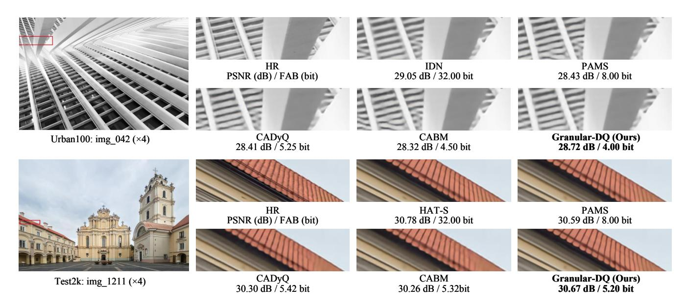

# Experiments

## Experimental Settings

Baseline SR Models. The proposed Granular-DQ is applied directly to existing CNN-based SR models including SRResNet (Ledig et al. 2017), EDSR (Lim et al. 2017), and IDN (2018) as well as transformer-based models including SwinIR-light (Liang et al. 2021) and HAT-S (Chen et al. 2023). Following CADyQ (Hong et al. 2022a) and CABM (Tian et al. 2023), we implement quantization on the weights and feature maps within the high-level feature extraction part, which is the focal point for the majority of computationally intensive operations. Notably, for SwinIRlight and HAT-S, the attention blocks are computed with full precision due to severe quantization errors, where more details are provided in the supplementary material.

In Granular-DQ, the first step for bit allocation by GBC designates 4/6/8-bit as the candidate bits to quantize the patches. Subsequently, the second step by E2B adapts the patches allocated with 8 bits in GBC are further adapted using 4/5/8-bit as the candidates for fine-grained bit-width adjustment. The initial entropy thresholds, denoted as t1 and t2, are set to 0.5 and 0.9 respectively and then gradually calibrated according to the entropy statistic on the training set, for all models. In this work, we employ QuantSR (Qin et al. 2024) for all the quantization candidates and uniformly apply 8-bit linear quantization for weights.

Datasets and Metrics. In our experiments, all the models are trained on DIV2K (Agustsson and Timofte 2017) dataset which contains 800 training samples for ×2 and ×4 SR. We evaluate the model and compare it with existing methods on three benchmarks: Urban100 (Huang, Singh, and Ahuja 2015), Test2K and Test4K (Kong et al. 2021) derived from DIV8K dataset (Gu et al. 2019) by bicubic downsampling. We quantitatively measure the SR performance using two metrics: peak signal-to-noise ratio (PSNR) and the structural similarity index (SSIM) for reconstruction accuracy. Besides, we also compute the feature average bit-width (FAB)

| Method        | FAB          | Params (K) (↓ Ratio)          | BitOPs (G) (↓ Ratio)             |
|---------------|--------------|----------------------------------|-------------------------------------|
| EDSR          | 32.00        | 1518K (0.0%)                     | 527.0T (0.0%)                       |
| PAMS CADyQ | 8.00 6.09 | 631K (↓ 58.4%) 489K (↓ 67.8%) | 101.9T (↓ 80.7%) 82.6T (↓ 84.3%) |
| CABM Ours  | 5.80 4.97 | 486K (↓ 68.0%) 486K (↓ 68.0%) | 82.4T (↓ 84.4%) 73.6T (↓ 86.0%)  |

Table 2: Model complexity and compression ratio of EDSR for different quantization methods. We calculate the average BitOPs for generating SR images on the Urban100 dataset.

which represents the average bit-width across all features within the test dataset to measure the quantization efficiency. Implementation details. During training, we randomly crop each LR RGB image into a 48 × 48 patch with a batch size of 16. All the models are trained for 300K iterations on NVIDIA RTX 4090 GPUs with Pytorch. The learning rate is set to 2×10−4 and is halved after 250K iterations. During testing, the input image is split into 96 × 96 LR patches.

## Comparing with the State-of-the-Art

Quantitative Comparison. Table 1 reports the quantitative results on benchmarks. The proposed Granular-DQ is compared with original full-precision models, PAMS (Li et al. 2020), CADyQ, CABM, AdaBM (Hong and Lee 2024), and RefQSR (2024). One can see that Granular-DQ demonstrates the minimum performance sacrifice relative to the full-precision SRResNet and EDSR models while attaining the lowest FAB against other methods on all benchmarks. For IDN, Granular-DQ even exceeds its full-precision model by about 0.2dB on Urban100 and Test4K datasets, whereas other methods show lower PSNR and SSIM improvements with obviously higher FAB. Moreover, when implementing these methods on transformer-based baselines, it can be observed that Granular-DQ significantly outperforms other methods in terms of reconstruction accuracy and quantization efficiency. The results validate the superior effectiveness and generalization ability of Granular-DQ.

Qualitative Comparison. Figure 5 shows the qualitative results on the Urban100 dataset. As one can see, Granular-DQ produces SR images with sharper edges and clearer details, sometimes even better than the original unquantized IDN. By comparison, despite the lower PSNR and more FAB consumption, existing methods also suffer from obvious blurs and misleading textures.

Complexity Analysis. To further investigate the complexity of our method for quantizing SR models, we calculate the number of operations weighted by the bit-widths (BitOPs) (Van Baalen et al. 2020) as the metric and compare it with existing methods. As shown in Table 2, Granular-DQ leads to significant computational complexity reduction of the baseline model, which decreases the BitOPs from 527.0T to 73.6T and sustains a competitive FAB. Coupled with the decrease in the model parameters to 68.0% (486K) of the full-precision model, the results demonstrate that Granular-DQ can ensure optimal trade-off between reconstruction accuracy and quantization efficiency.

Figure 5: Qualitative comparison  $(\times 4)$  on Urban100 and Test2K based on IDN and HAT-S models. Granular-DQ reconstructs SR images with better details and quantitative results

| GBC | E2B | ATC |      | Urban100 |       |
|-----|-----|-----|------|----------|-------|
|     |     |     | FAB  | PSNR     | SSIM  |
| ×   | Х   | Х   | 8.00 | 26.01    | 0.783 |
| ✓   | Х   | ×   | 5.86 | 25.97    | 0.782 |
| ✓   | ✓   | ×   | 5.51 | 26.02    | 0.784 |
| ✓   | ✓   | ✓   | 4.97 | 26.01    | 0.784 |

Table 3: Ablation study on individual proposed components in Granular-DQ including GBC, E2B, and ATC.

| $b^*$     |      | Set14 |       |      | Urban100 | )     |
|-----------|------|-------|-------|------|----------|-------|
| Ü         | FAB  | PSNR  | SSIM  | FAB  | PSNR     | SSIM  |
| [4, 5, 6] | 5.29 | 28.52 | 0.780 | 4.85 | 25.98    | 0.783 |
| [4, 5, 7] | 5.50 | 28.54 | 0.780 | 4.98 | 25.99    | 0.782 |
| [4, 6, 7] | 5.79 | 28.55 | 0.781 | 5.22 | 25.97    | 0.783 |
| [4, 6, 8] | 5.64 | 28.57 | 0.781 | 5.38 | 26.01    | 0.784 |
| [4, 7, 8] | 5.64 | 28.55 | 0.780 | 5.64 | 25.99    | 0.783 |
| [4, 5, 8] | 5.54 | 28.58 | 0.781 | 4.97 | 26.01    | 0.784 |

Table 4: Ablation study on the influence of the bit configuration (denoted by  $b^*$ ) in E2B with EDSR baseline.

#### **Ablation Study**

Effects of Individual Components. We study the effects of the proposed components including GBC, E2B, and ATC in Table 3, where the results are evaluated on the Urban100 dataset. We can see that quantization with only GBC leads to a performance drop. Based on GBC, when we introduce E2B to conduct fine-grained bit-width adaption, the resultant quantizer can enhance the reconstruction accuracy and a small improvement in efficiency. Moreover, E2B and ATC in conjunction effectively reduce the FAB by a considerable margin (over 0.5 FAB) with almost the same PSNR/SSIM.

Influence of the Candidate Bits in E2B. We conduct ex-

periments to investigate the influence of the bit configuration in E2B. For 3 candidate bits, we set the lowest bit-width as 4 and randomly change the other two, resulting in 6 variants. As reported in Table 4, the configuration of [4, 5, 6] performs worst on both Set14 and Urban100 with relatively lower FAB. Surprisingly, although we allocate higher bitwidth to patches ([4, 7, 8]), the model incurs the most FAB but acquires negligible performance gains. By comparison, the model with [4, 5, 8] achieves the best trade-off on the two datasets, which is selected as our final configuration. **More ablations are provided in the supplementary material**.

## Conclusion

In this paper, we propose Granular-DQ, a patch-wise and layer-invariant approach that conducts low-bit dynamic quantization for SISR by harnessing the multi-granularity clues of diverse image contents. Granular-DQ constructs a hierarchy of coarse-to-fine granularity representations for each patch and performs granularity-aware bit allocation by a granularity-bit controller (GBC). Then, an entropy-to-bit (E2B) mechanism is introduced to fine-tune bit-width adaption for the patches with high bits in GBC. Extensive experiments indicate that our Granular-DQ outperforms recent state-of-the-art methods in both effectiveness and efficiency.

#### Acknowledgments

This work is supported by the National Natural Science Foundation of China (62472137, 62072151, 62302141, 62331003, 62206003), Anhui Provincial Natural Science Fund for the Distinguished Young Scholars (2008085J30), Open Foundation of Yunnan Key Laboratory of Software Engineering (2023SE103), CCF-Baidu Open Fund (CCF-BAIDU202321), CAAI-Huawei MindSpore Open Fund (CAAIXSJLJJ-2022-057A) and the Fundamental Research Funds for the Central Universities (JZ2024HGTB0255).

