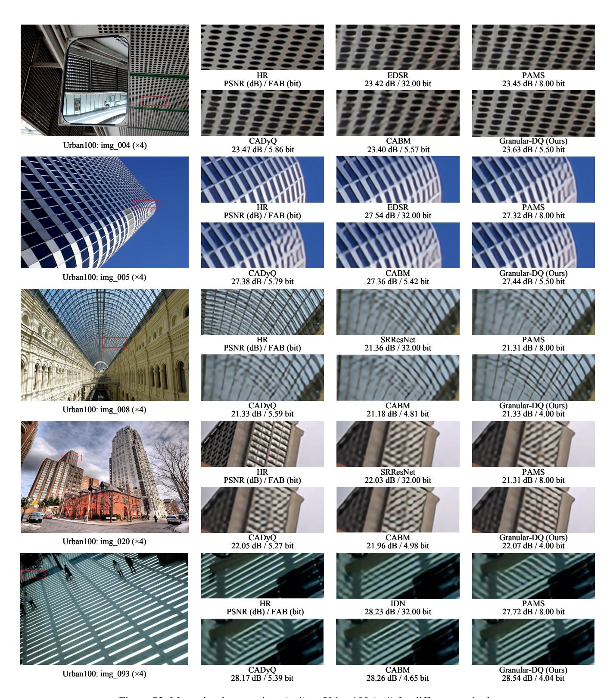
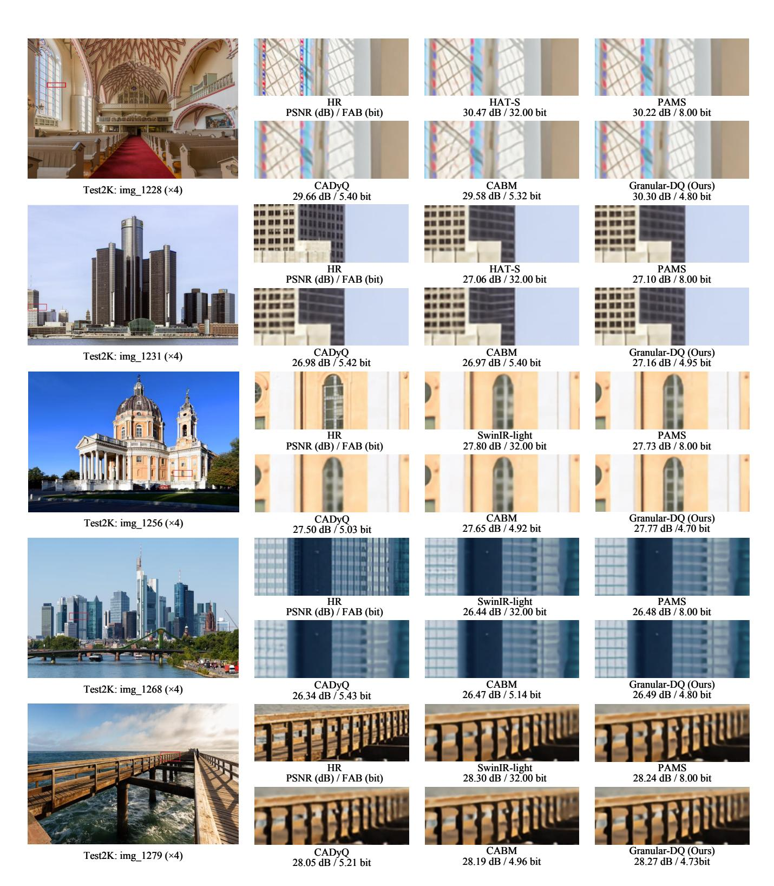

# Implementation Details on Transformer-based Baselines

For the transformer-based models, the linear layers of the MLPs in both SwinIR-light (Liang et al. 2021) and HAT-S (Chen et al. 2023) are all quantized using the QuantSR scheme (Qin et al. 2024). Surprisingly, despite all our efforts, we still encountered the gradient explosion issue when implementing the quantization scheme for CADyQ (Hong et al. 2022a) and CABM (Tian et al. 2023) in HAT-S. As a result, these two retained full precision for channel attention in the experiments. During the training phase, we randomly cropped the LR image into 64 × 64 with a total batch size of 16 for all scale factors, following the settings of the original model. The learning rate was initially set to 2 × 10−4 and halved after 250K iterations.

## Comparison with the State-of-the-Art

Quantitative Comparison for ×2 SR. We further conduct experiments for ×2 SR, where the quantitative results are illustrated in Table S4. Obviously, Granular-DQ demonstrates competitive trade-offs in terms of FAB and PSNR/SSIM compared to other quantization methods across all CNN models. Additionally, for SwinIR-light and HAT-S, Granular-DQ also achieves remarkably superior reconstruction accuracy to full precision than others while maintaining the lowest FAB.

More Qualitative Comparison. In Figure S2 and S3, we provide more ×4 SR visual results produced by recent state-of-the-art methods and our Granular-DQ. Regardless of whether the models are CNN-based or transformer-based,

| Methods               | Scale |       | Urban100 |       |       | Test2K |       |       |       |       |
|-----------------------|-------|-------|----------|-------|-------|--------|-------|-------|-------|-------|
|                       |       | FAB↓  | PSNR↑    | SSIM↑ | FAB↓  | PSNR↑  | SSIM↑ | FAB↓  | PSNR↑ | SSIM↑ |
| SRResNet              | ×2    | 32.00 | 32.11    | 0.928 | 32.00 | 32.81  | 0.930 | 32.00 | 34.53 | 0.944 |
| PAMS                  | ×2    | 8.00  | 31.96    | 0.927 | 8.00  | 32.72  | 0.928 | 8.00  | 34.33 | 0.943 |
| CADyQ                 | ×2    | 6.46  | 31.58    | 0.923 | 6.10  | 32.61  | 0.926 | 6.02  | 34.19 | 0.942 |
| CABM                  | ×2    | 5.46  | 31.54    | 0.923 | 5.33  | 32.55  | 0.925 | 5.23  | 34.16 | 0.942 |
| Granular-DQ (Ours) ×2 |       | 4.11  | 31.94    | 0.927 | 4.17  | 32.52  | 0.925 | 4.12  | 34.52 | 0.944 |
| EDSR                  | ×2    | 32.00 | 31.97    | 0.927 | 32.00 | 32.75  | 0.928 | 32.00 | 34.38 | 0.943 |
| PAMS                  | ×2    | 8.00  | 31.96    | 0.927 | 8.00  | 32.72  | 0.928 | 8.00  | 34.33 | 0.943 |
| CADyQ                 | ×2    | 6.15  | 31.95    | 0.927 | 5.68  | 32.70  | 0.928 | 5.59  | 34.30 | 0.943 |
| CABM                  | ×2    | 5.59  | 31.92    | 0.927 | 5.39  | 32.74  | 0.927 | 5.31  | 34.33 | 0.943 |
| Granular-DQ (Ours) ×2 |       | 4.60  | 32.01    | 0.928 | 4.40  | 32.57  | 0.925 | 4.27  | 34.42 | 0.944 |
| IDN                   | ×2    | 32.00 | 31.29    | 0.920 | 32.00 | 32.42  | 0.924 | 32.00 | 34.02 | 0.940 |
| PAMS                  | ×2    | 8.00  | 31.39    | 0.921 | 8.00  | 32.46  | 0.925 | 8.00  | 34.05 | 0.941 |
| CADyQ                 | ×2    | 5.22  | 31.54    | 0.923 | 4.67  | 32.51  | 0.925 | 4.57  | 34.10 | 0.941 |
| CABM                  | ×2    | 4.21  | 31.40    | 0.921 | 4.19  | 32.50  | 0.925 | 4.19  | 34.10 | 0.941 |
| Granular-DQ (Ours) ×2 |       | 4.01  | 31.63    | 0.924 | 4.05  | 32.36  | 0.922 | 4.05  | 34.35 | 0.942 |
| SwinIR-light          | ×2    | 32.00 | 32.71    | 0.934 | 32.00 | 32.81  | 0.928 | 32.00 | 34.81 | 0.946 |
| PAMS                  | ×2    | 8.00  | 32.40    | 0.931 | 8.00  | 32.68  | 0.927 | 8.00  | 34.68 | 0.945 |
| CADyQ                 | ×2    | 5.29  | 31.88    | 0.926 | 5.07  | 32.50  | 0.924 | 5.06  | 34.48 | 0.943 |
| CABM                  | ×2    | 5.14  | 31.93    | 0.927 | 4.98  | 32.52  | 0.925 | 4.97  | 34.50 | 0.944 |
| Granular-DQ (Ours) ×2 |       | 4.76  | 32.54    | 0.932 | 4.73  | 32.73  | 0.927 | 4.12  | 34.52 | 0.944 |
| HAT-S                 | ×2    | 32.00 | 34.19    | 0.945 | 32.00 | 33.28  | 0.934 | 32.00 | 35.30 | 0.950 |
| PAMS                  | ×2    | 8.00  | 33.63    | 0.941 | 8.00  | 33.12  | 0.932 | 8.00  | 35.12 | 0.949 |
| CADyQ                 | ×2    | 5.43  | 33.13    | 0.938 | 5.32  | 32.95  | 0.930 | 5.22  | 34.95 | 0.947 |
| CABM                  | ×2    | 5.34  | 33.09    | 0.937 | 5.26  | 32.94  | 0.930 | 5.18  | 34.95 | 0.947 |
| Granular-DQ (Ours) ×2 |       | 4.80  | 33.71    | 0.942 | 4.78  | 33.12  | 0.932 | 4.77  | 35.12 | 0.949 |

Table S4: Quantitative comparison (FAB, PSNR (dB)/SSIM) with full precision models, PAMS, CADyQ, CABM and our method on Urban100, Test2K, Test4K for ×2.

Granular-DQ consistently achieves superior reconstruction details at the lowest FAB compared to other quantization methods in most instances. In each case, minimal discrepancies can be observed between Granular-DQ and its corresponding full-precision model. These findings further validate that Granular-DQ ensures an optimal trade-off between reconstruction accuracy and quantization efficiency.

## Limitation

While Granular-DQ effectively maintains promising SR performance with dramatic computational overhead reduction, it still has several limitations. First, the mixed-precision solution of Granular-DQ makes it require specific hardware design and operator support to achieve true compression acceleration. Second, its efficacy in accelerating processing for super-resolving large-size images is modest at best. In future work, we will design more efficient and effective quantization approaches to overcome these limitations.

Figure S2: More visual comparison (×4) on Urban100 (×4) for different methods.

Figure S3: More visual comparison (×4) on Test2K (×4) for different methods.