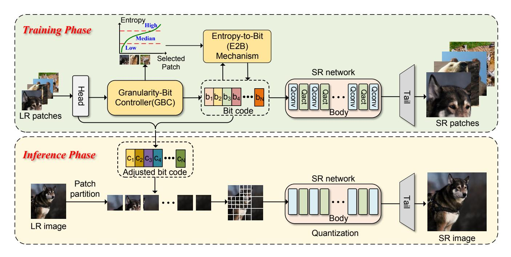

# Related Work

## Single Image Super-Resolution.

Recent progress in CNNs has critically advanced the field of SISR, enhancing image quality and detail restoration significantly (Dong et al. 2014; Lim et al. 2017). However, the intensive computational demands of CNNs (Dong et al. 2014; Shi et al. 2016; Zhang et al. 2018; Hui, Wang, and Gao 2018; Li, Bai, and Zhao 2020), transformer-based (Liang et al. 2021; Lu et al. 2022; Chen et al. 2023) and diffusion-based models (Rombach et al. 2022; Saharia et al. 2023) limit their use in mobile and embedded systems. Efforts to mitigate computational complexity have spanned several dimensions, research has focused on several strategies, including lightweight architecture implementation (Chu et al. 2021; Wang et al. 2021b), knowledge distillation (Hui et al. 2019; Zhang et al. 2021a), network pruning (Zhang et al. 2021b), re-parameterization (Wang, Dong, and Shan 2022), and parameter sharing (Chen et al. 2022). Additionally, some adaptive networks have been investigated to refine both performance and efficiency dynamically (Chen et al. 2022; Wang et al. 2022), highlighting the ongoing pursuit of an optimal balance between resource occupation and SR performance. However, apart from the computational complexity, the obstacle of memory storage imposed by floating-point operations also limits the usage of existing SR models. This work applies the network quantization technique for this purpose.

## Network Quantization

Network quantization has emerged as an effective solution that transforms 32-bit floating point values into lower bits (Zhou et al. 2016; Choi et al. 2018; Zhuang et al. 2018; Esser et al. 2019; Bhalgat et al. 2020; Li et al. 2021) to improve the network efficiency, which can be divided into quantization-aware training (QAT) and post-training quantization (PTQ) methods. QAT (Zhou et al. 2016; Choi et al. 2018; Esser et al. 2019; Bhalgat et al. 2020) integrates the quantization process into the training of networks, performing quantization adaption with complete datasets. PTQ methods (Li et al. 2021; Wei et al. 2022) often require a small calibration dataset to determine quantization parameters without retraining, which enables fast deployment on various devices. Recently, some methods introduce mixedprecision (2019) or dynamic quantization (2022) into the

Figure 2: The schematic of the proposed Granular-DQ for SR networks. Granular-DQ is a patch-wise and layer-invariant quantization pipeline, which contains two key steps: 1) granularity-aware bit allocation by the granularity-bit controller (GBC) and 2) entropy-based fine-grained bit-width adaption on the patches allocated with high bits in GBC based on an entropy-to-bit (E2B) mechanism. During the inference phase, the input image is partitioned into serial patches mapped to the adapted bit code, which forces the SR network to be specifically quantized for each patch.

above two paradigms, which allows for the automatic selection of the quantization precision of each layer. Though network quantization has been predominantly applied in various high-level tasks, its potential in SISR has not been fully exploited.

#### **Quantization for Super-Resolution Networks**

Unlike high-level vision tasks, SISR presents unique challenges due to its high sensitivity to precision loss (Li et al. 2020; Wang et al. 2021a; Hong et al. 2022b; Hong and Lee 2023). PAMS (Li et al. 2020) introduces the parameterized max scale scheme, which quantizes both weights and activations of the full-precision SR networks to fixed low-bit ones. DDTB (Zhong et al. 2022) tackles the quantization of highly asymmetric activations by a layer-wise quantizer with dynamic upper and lower trainable bounds. DAQ (Hong et al. 2022b) and QuantSR (Qin et al. 2024) study the influence of the parameter distribution in quantization, continuing to narrow the performance gap to fullprecision networks. Recently, some attempts adopt dynamic quantization, which exploits the quantization sensitivity of layers and images, e.g. gradient magnitude (Hong et al. 2022a), edge score (Tian et al. 2023), or cross-patch similarity (Lee, Yoo, and Jung 2024), have demonstrated promising achievements. AdaBM (Hong and Lee 2024) accelerates the adaptive quantization by separately processing imagewise and layer-wise bit-width adaption on the fly. In contrast, our method exploits the granularity and information density inherent in images to conduct dynamic quantization. It dispenses with the conventional need for layer sensitivity while being responsive to local contents, devising a distinctive patch-wise and layer-invariant dynamic quantization principle, which achieves superior performance and generalization ability for both CNN and transformer models.

#### **Proposed Method**

#### **Preliminaries**

In most cases, converting the extensive floating-point calculations into operations that use fewer bits within CNNs involves quantizing the input features and weights at convolutional layers (Krishnamoorthi 2018). In the quantized SR network, given a quantizer  $\mathcal{Q}$  in a symmetric mode, the function  $\mathcal{Q}_b(\cdot)$  is applied to the input  $\hat{x}_k$  of the k-th convolutional layer, transforming  $x_k$  into its quantized counterpart  $\hat{x}_k$  with a lower bit-width b, as expressed in the following formula

$$\hat{x}_k = \mathcal{Q}_b(x_k) = \text{round}\left(\frac{\text{clip}(\boldsymbol{x_k})}{r_b}\right) r_b,$$
 (1)

where  $\operatorname{clip}(\cdot) = \max(\min(x_k, a), -a)$  confines  $x_k$  within [-a, a]. a denotes the maximum of the absolute value of x (Wu et al. 2020) or derived from the moving average of max values across batches (Wang et al. 2021a). Additionally,  $r_b$  serves as the mapping function that scales inputs of higher precision down to their lower bit equivalents, defined as  $r_b = \frac{a}{2^b-1}$ . Specially, the non-negative values after ReLU are truncated to [0,a] and  $r_b = \frac{a}{2^b-1}$ . For weight quantization, given the k-th convolutional layer weight  $w_k$ ,

Figure 3: The structure of granularity-bit controller (GBC). It constructs hierarchical coarse-to-fine granularity representations for each patch. Then, it measures the granularity level of the patch upon its desired contribution percentage to the entire image, and maps this to quantization bit codes, finally achieving a tailored bit allocation.

the quantized weight  $\hat{w}_i$  can be formulated as follows

$$\hat{w}_k = \mathcal{Q}_b(w_k) = \text{round}\left(\frac{\text{clip}(w_k)}{r_b}\right) r_b.$$
 (2)

Different from activations, the weights are quantized with fixed bit-width following (Li et al. 2020; Hong et al. 2022a).

