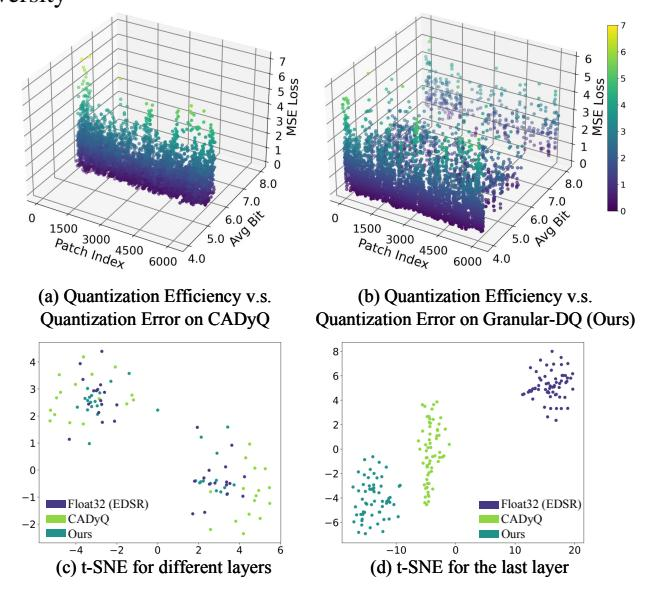

# Thinking in Granularity: Dynamic Quantization for Image Super-Resolution by Intriguing Multi- Granularity Clues

Mingshen Wang1, Zhao Zhang1,2\*, Feng Li1\*, Ke Xu3, Kang Miao1, Meng Wang1

1Hefei University of Technology 2Yunnan Key Laboratory of Software Engineering 3Anhui University

## **Appendix**

The supplementary material mainly includes the following contents:

- The motivation of Granular-DQ.
- Ablation studies involve the thresholds (quantile *t*) number in E2B, and the combination with different weight quantization patterns, *i.e.* PAMS (Li et al. 2020) and QuantSR (Qin et al. 2024).
- More implementation details on the transformer-based baseline models including SwinIR-light (Liang et al. 2021) and HAT-S (Chen et al. 2023).
- More experimental results consist of  $\times 2$  SR performance and additional qualitative visualization.
- Limitations in Granular-DQ.

#### Motivation

Recent advances (Tu et al. 2023; Hong et al. 2022a; Tian et al. 2023; Lee, Yoo, and Jung 2024; Hong and Lee 2024) have demonstrated the benefits of considering the quantization sensitivity of layers and image contents in SR quantization. Taking CADyQ (Hong et al. 2022a) for example, it applies a trainable bit selector to determine the proper bitwidth and quantization level for each layer and a given local image patch based on the feature gradient magnitude. In our analysis, we compute the average bit-width and the quantization error measured by MSE between the reconstructions of the quantized model (via CADyQ) and the original highprecision model (EDSR) on the Test2K dataset. Figure S1 (a) reveals that the majority of patches fall within a 6-bit to 8-bit range, accompanied by a relatively elevated MSE. Furthermore, we present t-SNE maps for various quantized layers and the final layer in Figure S1 (c)-(d). Firstly, it is evident that the distribution of different layers quantized by CADyQ is markedly more scattered than that of the original model, as depicted in Figure S1 (c). Secondly, on the final layer, the features from the CADyQ-quantized model exhibit a distinct vertical pattern, which is notably at odds with the structure of the original model's feature points (Figure S1 (d)). In our investigation, CABM actually exhibited similar findings, although it fine-tunes the CADyQ model based on edge scores. These results indicate that: 1) Simply relying on image edge information is suboptimal for the trade-off between quantization efficiency and error; 2) The bit allocation for each layer in response to varying patches can introduce disturbances to the inter-layer relations within original models leading to disparities in the representations.

Based on the above analysis, this work aims to design a dynamic quantization approach for diverse image contents

Figure S1: Analysis of the quantization efficiency, quantization error, and feature distribution in t-SNE on CADyQ and our Granular-DQ. (a) and (b) illustrate the quantization efficiency v.s. quantization error trade-off; (c) and (d) visualize the feature distribution of two resultant models and compare with the corresponding original one (Float32: EDSR).

while maintaining the representation ability of the original model. To this end, we rethink the image characteristics related to image quality from the granularity and information density. As we know, the fine-granularity representations reveal the texture complexity of local regions, while coarse ones express structural semantics of the overall scene. Besides, according to Shannon's Second Theorem (Shannon 1948), the entropy statistic reflects the average information density and the complexity of pixel distributions given patches, which is directly correlated to the image quality. Therefore, we propose Granular-DQ, a markedly different method that fully explores the granularity and entropy statistic of images to quantization adaption. Granular-DQ contains two sequential steps: 1) granularity-aware bit allocation for all the patches and 2) entropy-based fine-grained bit-width adaption for the patches less quantized by 1). In this way, we can see that the bit-width allocation by Graular-DQ is sparser than CADyQ, where a majority of patches are lower than 5bit with only a few patches at high bit-width (Figure S1 (b)). Moreover, the feature distribution of the layers quantized by our method is closer to that of the original

| t1 t2 |     | Set14 |       |       | Urban100 |       |       |  |  |
|----------|-----|-------|-------|-------|----------|-------|-------|--|--|
|          |     | FAB   | PSNR  | SSIM  | FAB      | PSNR  | SSIM  |  |  |
| 0.4      | 0.7 | 5.86  | 28.53 | 0.780 | 5.28     | 25.96 | 0.783 |  |  |
| 0.4      | 0.8 | 5.86  | 28.50 | 0.779 | 5.04     | 25.99 | 0.783 |  |  |
| 0.4      | 0.9 | 5.54  | 28.56 | 0.780 | 4.99     | 25.98 | 0.782 |  |  |
| 0.5      | 0.7 | 5.86  | 28.53 | 0.780 | 5.25     | 25.97 | 0.784 |  |  |
| 0.5      | 0.8 | 5.82  | 28.57 | 0.780 | 5.02     | 26.00 | 0.782 |  |  |
| 0.5      | 0.9 | 5.54  | 28.58 | 0.781 | 4.97     | 26.01 | 0.784 |  |  |

Table S1: Ablation study on the impact of the thresholds in ATC with EDSR baseline.

| ∗ t                       | ∗ b    |      | Set14            | Urban100 |             |  |
|------------------------------|-----------|------|------------------|----------|-------------|--|
|                              |           | FAB  | PSNR SSIM FAB    |          | PSNR SSIM   |  |
| [0.5]                        | [4, 8]    | 6.57 | 28.57 0.780 5.75 |          | 25.97 0.781 |  |
| [0.5, 0.9]                   | [4, 5, 8] | 5.54 | 28.58 0.781 4.97 |          | 26.01 0.784 |  |
| [0.4, 0.6, 0.9] [4, 5, 6, 8] |           | 6.07 | 28.58 0.779 5.41 |          | 25.93 0.781 |  |
| [0.4, 0.6, 0.9] [4, 5, 7, 8] |           | 6.21 | 28.54 0.780 5.61 |          | 25.93 0.782 |  |

Table S2: Ablation study on the influence of a different number of thresholds (quantile, denoted by t ∗ ) and corresponding bit configuration (denoted by b ∗ ) in E2B with EDSR.

model (Figure S1(c)-(d)). These validate that our Granular-DQ enables low-bit and layer-invariant quantization.

## Ablation Study

Impact of the Threshold t in ATC. In this work, we set two thresholds t1 and t2 in ATC, which divide the entropy of input patches into 3 subintervals and then map them to the bit codes ([4, 5, 8] in Table S1), whitch facilitates the bit-width adjustment in E2B. As in Table S1, according to the results on Set14 and Urban100, we can empirically set the combination of [t1 = 0.5, t2 = 0.9] as it achieves the best balance in quantization.

Impact of the Threshold Number in E2B. We further experimentally investigated the effect of different numbers of thresholds in E2B and their corresponding candidate bit configuration. Firstly, we assume that there is only one quantile for all the input patches, which means the entropy statistic H is divided into two subintervals. As shown in Table S2, when we adjust the bit-widths of patches using 4/8bit, the model performs worst on both Set14 and Urban100 datasets. Similarly, when we incorporate three thresholds of t with [0.4, 0.6, 0.9] to divide H into four subintervals, it can be seen that whether using the bit configurations of [4, 5, 6, 8] or [4, 5, 7, 8], the model cannot obtain satisfied quantization efficiency. In contrast, the model with two thresholds [0.5, 0.9] and corresponding candidate bit-widths of [4, 5, 8] achieved the best trade-off on both datasets, making it our final choice. Influence of Different Quantization Patterns. To investigate the compatibility of our method on different quantization patterns, we conduct experiments by combining Granular-DQ with PAMS (Li et al. 2020) and QuantSR (Qin et al. 2024), where the results on Urban100 are reported in Table S3. Notably, different from existing dynamic meth-

| Methods             | Urban100 |       |       |  |  |  |  |
|---------------------|----------|-------|-------|--|--|--|--|
|                     | FAB↓     | PSNR↑ | SSIM↑ |  |  |  |  |
| EDSR                | 32.00    | 26.03 | 0.784 |  |  |  |  |
| PAMS                | 8.00     | 26.01 | 0.784 |  |  |  |  |
| CADyQ+PAMS          | 6.09     | 25.94 | 0.782 |  |  |  |  |
| Granular-DQ+PAMS    | 5.69     | 25.95 | 0.782 |  |  |  |  |
| Granular-DQ+QuantSR | 4.97     | 26.01 | 0.784 |  |  |  |  |
| IDN                 | 32.00    | 25.42 | 0.763 |  |  |  |  |
| PAMS                | 8.00     | 25.56 | 0.768 |  |  |  |  |
| CADyQ+PAMS          | 5.78     | 25.65 | 0.771 |  |  |  |  |
| Granular-DQ+PAMS    | 4.73     | 25.62 | 0.770 |  |  |  |  |
| Granular-DQ+QuantSR | 4.18     | 25.68 | 0.772 |  |  |  |  |

Table S3: Investigation of the compatibility of our Granular-DQ with different quantization patterns. We observe the ×4 SR results on Urban100 based on EDSR and IDN.

ods (Hong et al. 2022a; Tian et al. 2023), our Granular-DQ does not require the pre-trained models of PAMS or QuantSR. We can see that Granular-DQ+PAMS gets 0.07dB PSNR gains with 0.4 FAB reduction for EDSR compared to CADyQ+PAMS. When applying the QuantSR scheme on Granular-DQ, the model can achieve the best trade-off between FAB and PSNR/SSIM for both EDSR and IDN models, where even the latter surpasses the original model by 0.26dB in PSNR.

