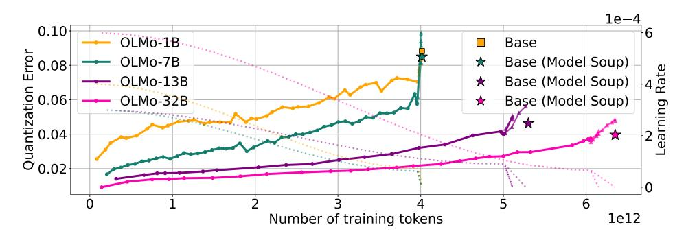

# 2.3 MODEL BRITTLENESS TO POST-TRAINING QUANTIZATION

How well will a certain quantization algorithm work for a given, already trained, LLM, and does this depend on the size of the model, or the amount of training data? Recently [Kumar et al.](#page-13-1) [\(2024\)](#page-13-1) and [Ouyang et al.](#page-14-1) [\(2024\)](#page-14-1) developed scaling laws for quantization error, in which they relate the scale of training dataset with the degradation induced by quantization. In summary, they reach a similar conclusion, as models are trained on more data, they exhibit higher quantization induced degradation. However, scaling up the training dataset is one of the primary levers to improve model performance, and small overtrained models are becoming increasingly popular [\(Gadre et al.,](#page-11-3) [2024\)](#page-11-3).

Figure 2: 3-bit quantization error along the training trajectories of OLMo2 models. Error grows gradually during cosine decay but spikes under the steep linear decay phase. Model souping  $(\star)$  reduces degradation, achieving lower PTQ error than any individual run.

Yet, these studies overlook the role of the training dynamics in model robustness to post-training quantization. In fact, we find that on open sourced LLMs, quantization degradation abruptly increases as learning rates decays, regardless of training data size. In Section 4 we investigate these contradicting results and we find that their characterization of the effect of training dataset scale and quantization performance is mostly confounded by the learning rate hyperparameters used in their experiments. Overall, we identify this gap in the literature and address this crucial question: what is the relationship between the training dynamics and quantization performance?

### 3 Post-training quantization of models in the wild

In this section, we analyze training trajectories of the following models: OLMo model family (1B, 7B parameters; trained on 2.5T-3T tokens) (Groeneveld et al., 2024); OLMo2 family suite (1B, 7B, 13B, 32B; 4TT-6TT) (OLMo et al., 2025); SmolLM3 (3B, 11TT) (Bakouch et al., 2025); Apertus (8B, 15TT) (Apertus Team, 2025); Open-science (1.3B, 1TT) (Nezhurina et al., 2025), for which we consider the Nemotron-cc release (Su et al., 2025); and Amber (7B, 1.3TT) (Liu et al., 2023). We use GPTQ (Frantar et al., 2023) to post-train quantize them to 3 and 4 bits. We detail the quantization process in Appendix A, and share the complete set of results for all model families in Appendix B.

We evaluate PTQ robustness by first examining quantization error in validation loss and later by assessing its impact on downstream tasks.

