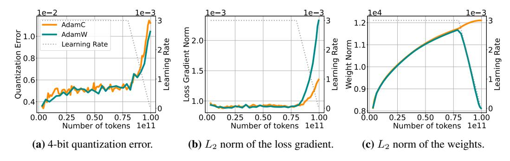
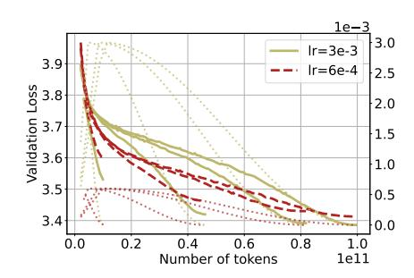
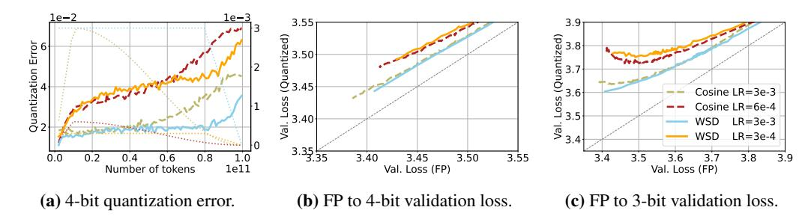
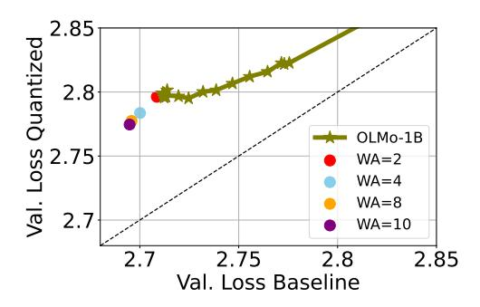
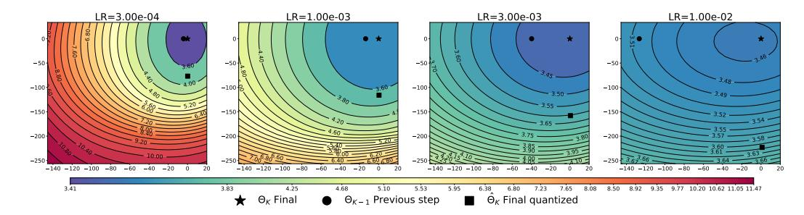
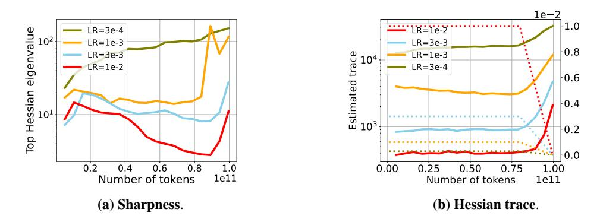

# E ADDITIONAL RESULTS

In this section we provide additional figures for Section 5.

#### E.1 WEIGHT DECAY

We show Figure 19.

### E.2 GRADIENT OF THE LOSS

Recent work has shown that the gradient of the loss increases during the end of training (Defazio, 2025). We have observed that this phenomenon coincides with the decay phase of WSD, to this end, we analyze whether this change in the training dynamics is driving quantization degradation in Figure 20. Fixing all other hyperparameters (more details in Appendix C) we train with AdamW (Loshchilov & Hutter, 2019) (in cyan), and AdamC (Defazio, 2025) (in orange) which aims to correct this behavior. We observe that AdamC reduces the spike of the norm of the loss gradient in Figure 20b while simultaneously changing the norm of the weights in Figure 20c. However, despite modulating different actors of the training dynamics, both optimizers demonstrate almost identical quantization degradation in Figure 20b, suggesting that the norm of the gradient of the loss does not impact quantization performance as a standalone factor, indicating a more complex relationship.

Figure 20: Loss gradient norm does not directly modulate quantization error. Quantization error,  $L_2$  norm of the loss gradient, and  $L_2$  norm of the weights for a 160M model trained with AdamW (Loshchilov & Hutter, 2019) (in cyan) and AdamC (Defazio, 2025). In Figure 20b we observe that the gradient of the loss spikes during the later iterations when using AdamW, whereas AdamC reduces the spike at the end of training. Furthermore, in Figure 20c we observe that AdamC affects the norm of the weights.

#### E.3 COSINE DECAY VS WSD

In Figure 21 we present the quantization error and validation loss for 160M parameter models trained on different token budgets with the same learning rate with cosine decay and with WSD learning rate schedules. We observe that even though quantization error appears to be related to training data

budget for cosine decay learning rate schedule, on WSD quantization error and training data budget appear to be less entangled.

(a) Quantization error vs training tokens.

**(b)** Validation loss vs training tokens.

**Figure 21: PTQ error at different training durations with cosine decay.** We repeat the experiment in 4.1 and Figure 4 with a cosine learning rate schedule. PTQ error (left) varies with training horizon, but peak learning rate and scheduler shape have a larger impact.

#### E.4 LEARNING RATE

We repeat the experiment in Section 5.1 on a larger scale, using OLMo2-7B evaluating quantization error during a learning rate annealing run of 50B tokens after the model was pretrained for 250B tokens on 4 different learning rate values. In Figure 23 we observe that, even though the quantization degradation is lower, the same patter arises, where larger learning rates lead to lower quantization degradation, even at the same validation loss.

### F ADDITIONAL DETAILS AND RESULTS FOR LOSS LANDSCAPES

Given a parametric model  $\Theta \in \mathbb{R}^{n3}$ , a set  $\mathcal{D} := \{(x_i, y_i)\}_{i=1}^m$  of feature vectors with corresponding labels pairs, and a loss function  $\mathcal{L}(\Theta) = \frac{1}{m} \sum_{i=1}^m \ell(x_i, y_i; \Theta)$ , we adapt Goodfellow et al. (2015); Li et al. (2018) to visualize a 2D slice of the loss. Our aim is to interpolate the loss between three checkpoints of particular interest,  $\Theta_K$  the model at the end of training,  $\Theta_{K-1}$  the model at a previous step of training4, and  $\hat{\Theta}_K$ , the model at the end of training quantized. Setting v and v as the direction vectors from v0 to v1 and v2 to v3 to v4 to v4 to v5 to v6 to v6 to v8 to v9 to v9 to v9 to v9 to v9 to v9 to v9 to v9 to v9 to v9 to v9 to v9 to v9 to v9 to v9 to v9 to v9 to v9 to v9 to v9 to v9 to v9 to v9 to v9 to v9 to v9 to v9 to v9 to v9 to v9 to v9 to v9 to v9 to v9 to v9 to v9 to v9 to v9 to v9 to v9 to v9 to v9 to v9 to v9 to v9 to v9 to v9 to v9 to v9 to v9 to v9 to v9 to v9 to v9 to v9 to v9 to v9 to v9 to v9 to v9 to v9 to v9 to v9 to v9 to v9 to v9 to v9 to v9 to v9 to v9 to v9 to v9 to v9 to v9 to v9 to v9 to v9 to v9 to v9 to v9 to v9 to v9 to v9 to v9 to v9 to v9 to v9 to v9 to v9 to v9 to v9 to v9 to v9 to v9 to v9 to v9 to v9 to v9 to v9 to v9 to v9 to v9 to v9 to v9 to v9 to v9 to v9 to v9 to v9 to v9 to v9 to v9 to v9 to v9 to v9 to v9 to v9 to v9 to v9 to v9 to v9 to v9 to v9 to v9 to v9 to v9 to v9 to v9 to v9 to v9 to v9 to v9 to v9 to v9 to v9 to v9 to v9 to v9 to v9 to v9 to v9 to v9 to v9 to v9 to v9 to v9 to v9 to v9 to v9 to v9 to v9 to v9 to v9 to v9 to v9 to v9 to v9 to v9 to v9 to v9 to v9 to v9 to v9 to v9 to v9 to v9 to v9 to v9 to v9 to v9 to v9 to v9 to v9 to v9 t

$$f(\alpha, \beta) = \mathcal{L}(\mathcal{D}; \Theta_K + \alpha v + \beta u) \tag{1}$$

To populate the contour plots we simply sample 1000 points on a regular grid contained by largest bound from the set that we are comparing, and then reconstruct a model from the vectorized definition that we sampled.

To vectorize a quantizaed model, we first "dequantize" by explicitly multiplying the scales and lowbit primitives, and we retrieve a high-precision approximation of the quantized model that we can use.

**3-bit GPTQ Loss Landscape** Analogous to Figure 8, we show the loss landscape for 3-bit GPTQ quantization on Figure 25. We observe that the same pattern occurs, with larger weight perturbations, where the flatness of the basin of the loss is more relevant.

### G SECOND ORDER STATISTICS

**Trace.** In order to approximate the Hessian trace, we can exploit the following result. Let  $A \in \mathbb{R}^{n \times n}$  be a symmetric matrix, let z be a multivariate random variable in  $\mathbb{R}^n$  with mean  $\mu$ 

&lt;sup>3We visualize 160M parameter models where  $n = 1.6e^8$ .

 $^4$ We visualize checkpoints that are trained for 100 billion tokens during K=190000 steps. We save the checkpoints every 2000 tokens, therefore K-1=188000.

**Figure 22: Warm up-Stable-Decay and Cosine decay.** Figure 22a shows the quantization degradation that results from changing the learning rate magnitude and schedule. We observe that learning rate modulates quantization error regardless of the schedule. Finally, in Figure 22c we observe that cosine schedules have a sharper trade-off in the validation loss of the full precision to the quantized weights.

**Figure 23:** Larger learning rates lead to lower quantization error. Figure 23a displays the quantization error achieved by fixing the training recipe and varying the learning rate of OLMo2-7B. We observe that quantization error decreases when employing higher learning rates. Furthermore, Figure 23b and 23c show that, at similar validation loss, larger learning rates achieve better low-bit quantization at no apparent cost.

and covariance  $\Sigma$ , then:

$$\mathbb{E}[z^T A z] = tr(A\Sigma) + \mu^T \Sigma \mu,$$

where  $\mathbb E$  indicates the expectation and tr the trace operator. Therefore, for a random vector z with zero-mean and identity covariance matrix,  $z^TAz$  is an *unbiased* estimator of tr(A). Hutchinson (1989) showed that when z is distributed accordingly to a multivariate Rademacher distribution, the estimator achieves *lower variance* than choosing z to be a multivariate Gaussian random vector.

We can leverage this property to estimate the Hessian trace of the loss function by drawing samples from a Rademacher distribution and computing Hessian vector products, which can be easily com-

Figure 24: Weight Averaging improves OLMo performance before and after quantization. We use LAWA, averaging weights along the OLMo-1B training trajectory. We measure and report validation loss in full precision and after 4-bit quantization. Compared to individual checkpoints on the full trajectory, LAWA yields lower validation loss both before and after quantization, with larger averaging windows performing best.

**Figure 25: Landscape of the loss**. We visualize the landscape of the loss in the plane spanned by the weights  $\{\Theta_K, \Theta_{K-1}, \hat{\Theta}_K\}$  for learning rates corresponding to the experiment in Figure 6. We observe that flatness of the loss basin is proportional to learning rate magnitude.

**Figure 26: Second order statistics across learning rates.** We train using WSD, varying the maximum learning rate, but always decaying it to zero. Higher learning rates lead to lower sharpness and smaller trace estimates, suggesting that the model may have converged to a wider minima. Interestingly, larger learning rate also lead to lower quantization error (Figure 6).

puted with an extra pass over the computational graph. We use PyHessian (Yao et al., 2019) for such Monte Carlo estimation in PyTorch.

**Sharpness and spectrum.** Furthermore, we measure the largest eigenvalue  $\lambda_{max}$  of the Hessian, also referred to as *sharpness*. In order to estimate  $\lambda_{max}$  we use power iterations, once again leveraging Hessian vector products computation in PyHessian. In some cases we further compute the first 25 hessian eigenvalues.

We measure both summary statistics on in house trained Pythia-160M models. We compute the trace and sharpness of the *validation loss*, computed on an held-out set of 100 text sequences from FineWedEdu, each of length 2048.

### H LIMITATIONS

Our analysis focuses primarily on the effect of learning rate, schedules, and weight decay leaving other parts of the optimization pipeline unexplored. Factors such as optimizer choice may also affect quantization performance, and we leave the exploration of schedule-free methods (Defazio et al., 2024) to follow-up work. Moreover, although we limit our analysis to dense quadratic model, we expect similar conclusions for sparse (Shazeer et al., 2017) and sub-quadratic architectures (Gu & Dao, 2024).

