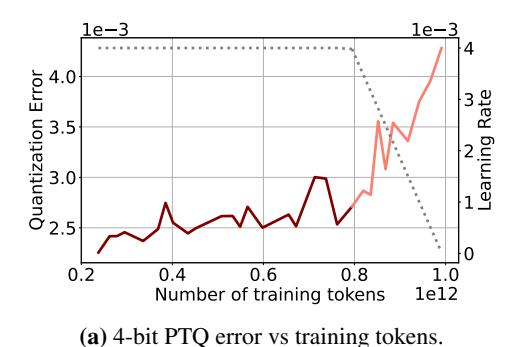
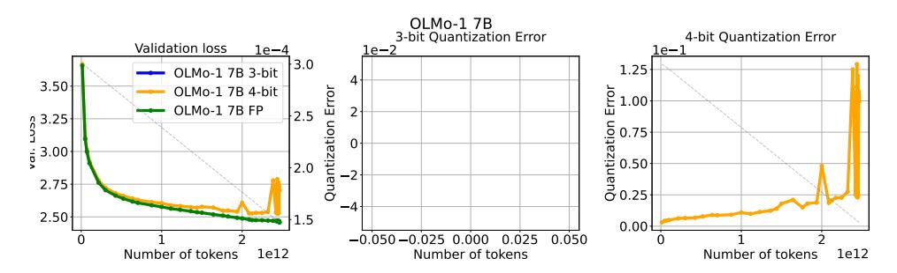

# B PTQ ROBUSTNESS ON ADDITIONAL MODELS IN THE WILD

In this section we report the quantization degradation for additional model families. Although most models follow a regular pattern, some exhibit unpredictable behaviors. Amber (Liu et al., 2023) in Figure 12 displays a brief spike in full-precision validation loss, while the full-precision model recovers, 4-bit PTQ degradation rises sharply, hinting at a change in the training dynamics whose cause we cannot identify. Additionally, Apertus (Apertus Team, 2025) in Figure 15 exhibits very large, fluctuating quantization errors from the beginning, which may indicate numerical issues either in the quantization process or in the weights. However, we note that, even for these models, quantization degradation increases as the learning rates decays, consistent with our previous findings.

(b) Validation loss vs training tokens.

Figure 11: Evolution of quantization error and validation loss on OpenSci-1.3B model (Nezhurina et al., 2025) trained on 1T tokens from Nemotron-cc (Su et al., 2025).

Figure 12: Quantization degradation for Amber-7B. 3 and 4-bit quantization with GPTQ.

Figure 13: Quantization degradation for Apertus-8B. 3 and 4-bit quantization with GPTQ.

Figure 14: Quantization degradation for OLMo-1 1B. 3 and 4-bit quantization with GPTQ.

Figure 15: Quantization degradation for OLMo-1 7B. 3 and 4-bit quantization with GPTQ.

