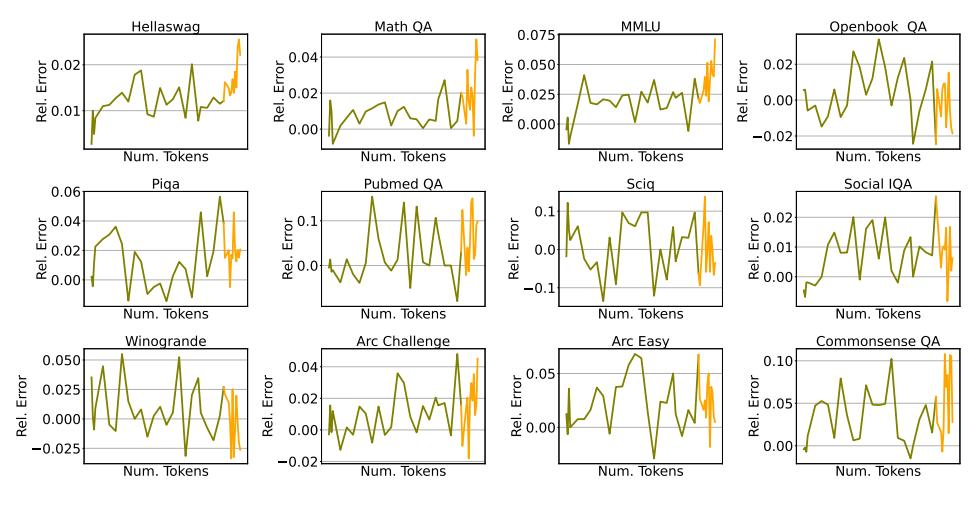

# D EVALUATION

Evaluating model performance is influenced by many factors, and quantization methods add another: the calibration dataset. For example, a model quantized using web data for calibration, may perform better on web-based tasks. In general, interactions between training data, calibration sets, and validation sets may create complex effects that affect the reliability of results.

To address this problem, we evaluate using two approaches:

- A held-out split of RefinedWeb [\(Penedo et al.,](#page-14-5) [2024\)](#page-14-5), to gather validation loss performance.
- Downstream performance on the following tasks:
  - ARC-Challenge (ARC C) [\(Clark et al.,](#page-11-9) [2018\)](#page-11-9)
  - ARC-Easy (ARC E) [\(Clark et al.,](#page-11-9) [2018\)](#page-11-9)
  - OpenbookQA (OBQA) [\(Mihaylov et al.,](#page-13-13) [2018\)](#page-13-13)
  - PIQA [\(Bisk et al.,](#page-10-10) [2020\)](#page-10-10)
  - HellaSwag (HSwag) [\(Zellers et al.,](#page-16-3) [2019\)](#page-16-3)
  - WinoGrande (WinoG) [\(Sakaguchi et al.,](#page-14-10) [2019\)](#page-14-10)
  - MathQA [\(Amini et al.,](#page-10-11) [2019\)](#page-10-11)
  - PubMedQA [\(Jin et al.,](#page-13-14) [2019\)](#page-13-14)
  - SciQ [\(Welbl et al.,](#page-15-11) [2017\)](#page-15-11)
  - Social IQa (SIQA) [\(Sap et al.,](#page-14-11) [2019\)](#page-14-11)
  - CommonsenseQA (CSQA) [\(Talmor et al.,](#page-15-12) [2019\)](#page-15-12)
  - MMLU [\(Hendrycks et al.,](#page-12-10) [2021\)](#page-12-10)

We evaluate models using LM-eval-harness [\(Gao et al.,](#page-11-10) [2021\)](#page-11-10) and vLLM [\(Kwon et al.,](#page-13-10) [2023\)](#page-13-10). We report per-task accuracy of SmolLM3 in Figures [16,](#page-20-2) [17,](#page-20-0) ?? for the full-precision, 3-bit GPTQ quantzied and 4-bit GPTQ quantized weights respectively.

Figure 16: SmolLM3 per-task full-precision accuracy, measured throughout training.

Figure 17: SmolLM3 per-task relative accuracy degradation under 3-bit GPTQ, measured throughout training.

Figure 18: SmolLM3 per-task accuracy degradation under 4-bit GPTQ, measured throughout training.

Figure 19: Weight decay promotes PTQ robustness. With fixed learning rate  $3e^{-3}$  and WSD we train several models changing the weight decay parameter  $\lambda$  only. We observe that larger  $\lambda$  parameters lead to models with higher PTQ robustness. The dashed line represents the  $\lambda$  parameter chosen for all prior experiments.

