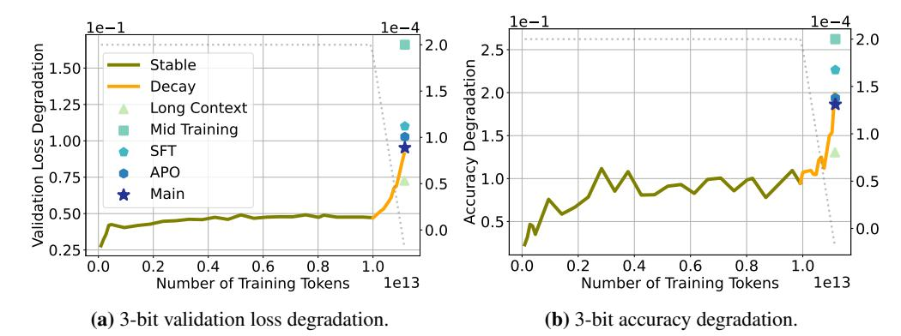

# 3.1 QUANTIZATION-INDUCED DEGRADATION ON VALIDATION LOSS

To more accurately represent the intuition that increases in cross-entropy loss are more expensive the lower the cross-entropy is (as loss decrease is roughly logarithmic in compute), we show relative cross-entropy loss, defined as  $(\frac{CE(\hat{W})}{CE(W)}) - 1$ .

We decouple the effect of learning rate decay from the amount of training data consumed, we first focus on models trained with a **Warm up–Stable–Decay** schedule. We begin by examining Figure 1a, which shows quantization error alongside the learning rate during the training trajectory of **SmolLM3**. We observe that, while quantization error increases rapidly in the beginning of training, it stays relatively constant during the 11 trillion tokens of stable phase, and only as the learning rate decays does quantization error spike. Figure 1b shows how the validation loss follows a similar—albeit inverse—curve than that of the quantization error. Similarly, **OpenSci** training runs from Nezhurina et al. (2025) in Figure 11 display an analogous pattern: quantization error surges sharply as the learning rate decreases, for the different models on vastly different token budgets.

Next, we consider the **OLMo2** model family, which includes four language models with 1, 7, 13, and 32 billion parameters, all developed using a consistent training methodology. Training occurs in two phases: an initial general pretraining phase using 4-6 trillion tokens with **cosine** learning rate decay, followed by a second phase that applies a short and sheer linear decay schedule across different orders of high-quality data configurations, also referred to as "ingredients". The final

than both individual components.

**Figure 3: 3-bit quantization effects across SmolLM3 post-training stages.** Degradation in validation loss (left) and downstream accuracy (right) show that PTQ effects differ across stages and appear sensitive to post-training interventions. The final model, a weighted average of mid-training and APO, shows better robustness

model weights are obtained through model souping (Wortsman et al., 2022), averaging models trained with different ingredients, except for the 1B parameter model, which retains weights from a single decay trajectory. Figure 2 presents quantization error and learning rate trajectories for the four models. The quantization error shows a different trend across the two phases, increasing gradually during slow cosine decay, but rising sharply under steep linear annealing. Although the learning rate itself *may not directly cause this degradation*, this observation once again suggests a deeper connection between optimization dynamics and quantization performance. Finally, we report the quantization error for the model soup, and find that averaging substantially reduces degradation, with the model soup achieving lower PTQ error than any of the individual ingredients. We will return to this observation later in Section 4 and 5.

### 3.2 QUANTIZATION-INDUCED DEGRADATION ON DOWNSTREAM TASKS

While cross-entropy loss serves as a convenient proxy for model performance, downstream evaluation better reflects the practical utility of a model. Following OLMo et al. (2025), we evaluate performance across 12 established benchmarks and report the average 5-shot accuracy across all tasks (see Appendix D for additional details on the evaluation pipeline).

In Figure 3 we show the performance degradation induced by 3-bit quantization on SmolLM3. Alongside the validation loss (Figure 3a), we present the relative accuracy drop, defined as  $\frac{Acc(W)-Acc(\hat{W})}{1-Acc(W)}$  (Figure 3b). Despite fluctuations, a similar pattern can be identified in both curves: performance degradation increases as the learning rate decays. We observe similar results across individual tasks and report them in Appendix D (Figure 17, Figure 18).

Modern LLMs are optimized beyond general pretraining stages to promote alignment, extend context, incorporate supervised fine-tuning, and perform instruction tuning (Tie et al., 2025). Here, we study the effect of quantization across **post-pretraining** stages. In SmolLM3, these include *long context* training, a *mid-training* phase to incorporate general reasoning capabilities, *supervised fine-tuning (SFT)* for domain-specific skills, and *anchored preference optimization (APO)* (D'Oosterlinck et al., 2024) to promote alignment. Finally, the released (*main*) model is a linear merge with weights of 0.9 and 0.1 of the APO model and a mid-training checkpoint. Figure 3 reports the performance degradation under 3-bit quantization after each stage in SmolLM3. Interestingly, context extension sensibly reduces quantization degradation, while mid-training largely amplifies it. PTQ degradation then decreases through SFT and APO. Remarkably, although the main model is obtained by averaging the mid-training and APO weights, it exhibits lower quantization degradation than either of them individually. We recall similar results from the previous analysis on OLMo-2 (Figure 2), where model soups across data mixtures exhibited lower quantization degradation than any of the individual components. These results suggest that averaging benefits quantization, a novel finding we investigate further in Section 5.

- (a) 4-bit quantization error vs training tokens.
- (b) Validation loss vs training tokens.

**Figure 4: 4-bit quantization error at different training durations.** We use WSD, training a 160M-parameter transformer up to 100B tokens and performing additional cooldowns at 12B, 28B, 46B, 64B, 82B tokens. Figure 4a shows quantization error during training with different token budgets, and Figure 5b the corresponding validation loss. Despite varying the amount of training data, all runs show comparable quantization error after cooldown, highlighting that error spikes are associated with training dynamics rather than token budget.

