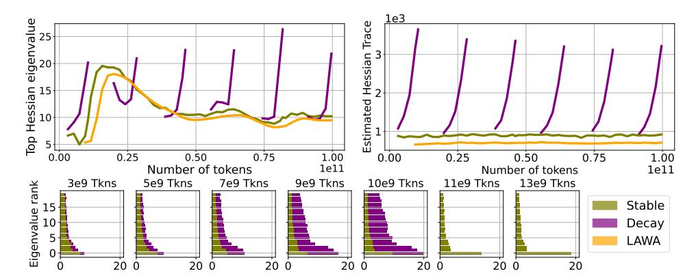

# 5 Interventions on the training dynamics

Having explored the connection between training dynamics and quantization degradation we investigate how simple interventions can modulate PTQ robustness and achieve better quantized models.

#### 5.1 Learning rate

In Figure 6, we demonstrate how different peak learning rates impact quantization. Figure 6a shows that higher learning rates consistently lead to smaller errors, with curves inversely ordered by rate magnitude. Figures 6b and 6c report full-precision versus 4-bit and 3-bit quantized validation losses. These parametric curves capture quantization error relative to total validation loss: perfect quantization would lie on the x=y bisector, with deviations measuring the error. Comparing curves with LR  $1\mathrm{e}{-3}$  and  $3\mathrm{e}{-3}$  shows that, at similar validation loss, the larger rate achieves better low-bit quantization, at no apparent cost. This suggests that, for comparable full-precision performance, employing a larger learning rate might be preferable, as it enhances low-bit quantization performance. We replicate this experiment on a 300B token pretraining run of OLMo2-7B in Figure 23.

Learning rate schedules designate the magnitude of the learning rate throughout training, represented as dotted lines in Figure 22a. On one hand, while the cosine schedule (green) has a much higher peak learning rate, its profile is dominated by the one of WSD decay phase (yellow and blue). Despite this rapid decay, the cosine schedule still achieves lower quantization error and better validation loss than the WSD schedule. This indicates that quantization performance depends on training dynamics beyond just the learning rate magnitude at any single point. On the other hand, examining 3-bit quantization in Figure 22c reveals that cosine schedules experience sharp upward curvature near the end of training, likely due to very small learning rates in the final steps. This suggests that cosine schedules' inability to control end-of-training learning rates, where the rate becomes small regardless of the initial peak, may hurt quantization performance compared to schedules like WSD that maintain better control throughout training.

**Figure 6:** Larger learning rates lead to lower quantization error. Figure 6a displays the quantization error achieved by fixing the training recipe and varying the learning rate. We observe that quantization error decreases when employing higher learning rates. Furthermore, Figure 6b and 6c show that, at similar validation loss, larger learning rates achieve better low-bit quantization, at no apparent cost.

**Figure 7:** Weight averaging as an alternative to LR decay for PTQ. Validation performance and quantization error for a 160M model trained on 100B tokens at constant learning rate. We compare intermediate learning rate cooldowns with weight averaging of checkpoints collected from the stable phase. We report the validation performance of the full-precision model (Figure 7a), the 3-bit quantized model (Figure 7b), and their difference (Figure 7c). Whereas LAWA falls short of learning-rate decay in the full-precision setting, its 3-bit PTQ performance yields lower validation loss than all cooldowns, demonstrating a successful setting for LAWA.

#### 5.2 Weight Averaging

Given the encouraging results on quantizing model soups in Section 3.1, and the detrimental effect of learning rate decay on quantization performance, a natural question is whether weight averaging could serve as an alternative and mitigate its negative impact1. Intuitively, averaging parameters along the training trajectory reduces noise and can approximate the effect of learning rate decay. Prior work derived equivalent averaging schemes for common LR schedules under SGD (Sandler et al., 2023), and later studies showed that averaging improves performance over constant learning rate training (Haegele et al., 2024), though still falling short of LR decay. Nevertheless, its effect on PTQ robustness remains unexplored, despite its simplicity, and compatibility with existing pipelines.

Therefore, we pretrain a 160M-parameter transformer on 100B tokens with a constant learning rate and compare LAtest Weight Averaging (LAWA) (Kaddour, 2022) against several intermediate learning rate cooldowns, with averaging configuration described in Appendix C. As observed in prior work (Ajroldi et al., 2025), in the full-precision setting (Figure 7a), LAWA yields better checkpoints than constant learning rate but does not reach the performance of intermediate cooldowns. In contrast, for 3-bit quantized models (Figure 7b), we find that checkpoints obtained through weight averaging *can match or even surpass* the performance of those trained with learning rate decay.

Finally, we apply the same technique to training trajectories of open-source models. Specifically, we consider OLMo-1B (Groeneveld et al., 2024), averaging checkpoints during training and using LAWA as aggregation scheme (Figure 24). Despite the lack of control over checkpoint saving frequency, the averaged model still improves upon the final one, performing better both in full-precision and after quantization, confirming averaging as a promising direction to improve PTQ robustness.

#### 5.3 WEIGHT DECAY

Learning rate and weight decay are coupled in popular AdamW implementations (Paszke et al., 2019). We analyze the impact of changing the weight decay  $\lambda$  on the quantization error for a fixed training recipe, with an implementation where learning rate and weight decay  $\lambda$  are decoupled (Schaipp, 2024). In Figures 19b and 19c we observe that among models that achieve a comparable performance (seen in the x-axis) in full-precision quantized validation loss, those with larger weight decay  $\lambda$  exhibit lower 4- and 3-bit quantization error. This shows that, for  $\lambda$  configurations that achieve comparable loss, higher values are preferable to reduce PTQ errors, which confirms Ahmadian et al. (2023) observations. Moreover, compared to Figure 6 we see that changes in  $\lambda$  have smaller effect on quantization error than learning rate.

### 6 GEOMETRIC PROPERTIES OF THE LOSS

The findings presented in Section 5 reveal several important relationships between interventions and downstream performance, but is there an underlying, unifying mechanism? To investigate, we

&lt;sup>1We distinguish between *model soups* (Wortsman et al., 2022), which average models from different training runs, and *weight averaging* (Izmailov et al., 2018), which aggregates checkpoints along a single trajectory.

analyze the geometric properties of the loss landscape to illustrate the interaction between these seemingly disconnected phenomena.

#### 6.1 LOSS LANDSCAPE

We visualize a 2D slice of the loss landscape (Goodfellow et al., 2015; Li et al., 2018) defined by three checkpoints of interest,  $\Theta_K$  the model at the end of training,  $\Theta_{K-1}$  the model at a previous step of training, and  $^2$   $\hat{\Theta}_K$ , the model at the end of training quantized. We refer to Section F for additional details.

Our goal is to analyze how hyperparameter decisions during pretraining result in different local neighborhoods  $\operatorname{around} \Theta_K$  and  $\hat{\Theta}_K$  in the landscape of the loss via the 2D slice they span. In Figure 8 we present four different landscapes, corresponding to pretraining our usual 160M parameter model with different learning rates, as shown in Figure 6. In Figure 8,  $\hat{\Theta}_K$  is the result of 4-bit GPTQ quantization, we refer to Figure 25 for analogous results on 3-bit GPTQ quantization. We begin by observing that, as expected, the smaller the learning rate, the closer  $\Theta_{K-1}$  and  $\Theta_K$  are. Perhaps more interestingly, the distance between  $\Theta_K$  and  $\hat{\Theta}_K$  follows the same trend, it is larger for larger learning rates. All the slices depict a local minimum around  $\Theta_K$ .

What is interesting is that we see that in all examples, the landscape is structured similarly in the y-axis, the quantization direction, to the x-axis, the direction to the previous optimization step. In this sense, the geometry of the quantized model seems closely related to the geometry induced by training. Furthermore, the learning rate magnitude is proportional to the flatness of the basin of the loss, where, even though  $\Theta_K$  and  $\hat{\Theta}_K$  are closer for smaller learning rates, the sharpness of the basin is such that  $\hat{\Theta}_K$  falls in a higher loss level, a phenomenon which is exacerbated further for larger weight perturbations e.g. for even lower bit quantization Figure 25.

#### 6.2 Curvature

To better understand the topology of the loss landscape and the dramatic effect of learning rate decay on quantization robustness, we further examine the second order information of the loss. We estimate the *trace* of the Hessian via Hutchinson estimator (Hutchinson, 1989), and the *sharpness* (maximum eigenvalue) via power iterations, using PyHessian (Yao et al., 2019). We refer to Appendix G for details on the estimation procedure and additional results.

In Figure 9 we report the sharpness and trace evolution during the stable and decay phases when training a 160M transformer on 100BT. The maximum eigenvalue shows a consistent rapid surge whenever the learning rate decays. Although we also observe an initial increase in sharpness under a constant step size, a more detailed analysis shows a clear distinction between the two regimes: in the stable phase, only the top eigenvalue initially rises while the others remain small, whereas in the decay phase all eigenvalues increase, underscoring a notable difference between these training dynamics. The trace presents a similar pattern, remaining stable under a constant learning rate, and rising abruptly as it decays, remarkably mirroring the evolution of quantization error in Figure 4.

 $^2$ We visualize checkpoints that are trained for 100 billion tokens during K=190000 steps. We save the checkpoints every 2000 tokens, therefore K-1=188000.

**Figure 8:** Landscape of the loss. We visualize the landscape of the loss in the plane spanned by the weights  $\{\Theta_K, \Theta_{K-1}, \hat{\Theta}_K\}$  for learning rates corresponding to the experiment in Figure 6. We observe that flatness of the loss basin is proportional to learning rate magnitude.

Figure 9: Sharpness (top left), Hessian trace (top right) and first 25 eigenvalues (bottom) estimated on the training trajectory of a 160M transformer model (training runs in Figure 4). Sharpness consistently increases when the learning rate decays. Under a constant learning rate, only the top eigenvalue briefly increases while the rest of the spectrum remains low; the second row shows the distribution during this early increase. The trace shows a clearer trend, although it is confounded by being the sum of all eigenvalues.

Although learning rate dynamics are known to affect the Hessian spectrum in simpler settings (Cohen et al., 2025), there is limited understanding of any causal structure in more complex training setups. Based on the observed phenomena, we hypothesize that, as the learning rate decays, the model traverses a sharper region of the loss landscape, *making it more sensitive to perturbations such as quantization*.

Our analysis also indicates that averaging weights during training leads to wider minima, in line with Izmailov et al. (2019). Such improved conditioning of the Hessian might explain the superior quantization robustness of LAWA in Figure 7, but also offers a new perspective on weight averaging: whereas prior work linked it theoretically and empirically to learning rate decay (Sandler et al., 2023), we show that the two methods produce solutions with substantially different curvature properties. We believe that the improved quantization robustness of model soups in Figure 2 may be explained by similar curvature properties induced by souping.

Finally, the benefit of larger learning rates on stochastic gradient descent is well documented (Barrett & Dherin, 2020; Lewkowycz et al., 2020; Gilmer et al., 2022), and it has been suggested that the additional noise leads to *flatter minima*, which should generalize better (Hochreiter & Schmidhuber, 1997; Chaudhari et al., 2017), and require fewer bits to be specified (Hochreiter & Schmidhuber, 1994). When considering training trajectories under different maximum LR (Figure 6), we indeed find that larger ones produce lower sharpness (Figure 26a) and smaller trace estimates (Figure 26b), suggesting the presence of flatter minima, yet interestingly also leading to lower quantization error.

### 7 DISCUSSION

We conduct a systematic investigation of how training interventions affect quantization degradation in language models under controlled experimental configurations. First, we observe that the magnitude of the learning rate determines quantization robustness when all other hyperparameters remain fixed. Second, we identify that averaging checkpoints, either across different data configurations via model souping or along the training trajectory, promotes robustness to quantization. These concrete examples, where quantization degradation noticeably shifts with training dynamics, lead us to advocate studying quantization robustness during routine hyperparameter tuning. We then study geometric properties of the loss to investigate how learning rate and weight averaging affect quantization performance, finding that these interventions coincide with convergence to flatter minima, which we argue might benefit quantization robustness.

Overall, we end on an optimistic note. Our findings indicate that quantization degradation stems from an intricate relationship between training dynamics alluding to general model robustness. As a result, we find that, rather than being an unavoidable consequence of training data scale, it can be acted upon with existing tools, which are especially beneficial for low-bit quantization.

