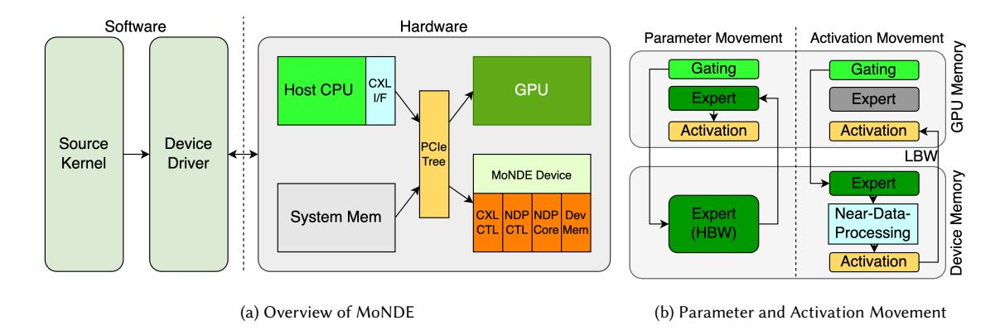

# 4.2 Expert Offloading

When deploying MoE models on edge devices, parameter-offloading techniques offer a potential solution to mitigate the challenge of insufficient GPU memory for storing all model parameters. However, traditional parameter-offloading methods load model parameters layer by layer from CPU memory or SSD, neglecting the sparse activation characteristics of MoE models. This oversight incurs significant overhead in parameter loading, leading to suboptimal inference Manuscript submitted to ACM

performance. To address this limitation, many studies have proposed expert-offloading techniques, which take advantage of MoE sparse activation patterns. Instead of loading all experts for a given layer, expert-offloading selectively loads only the required experts, thereby significantly reducing loading latency.

As Figure [7-](#page-14-0)(b) shown[\[173\]](#page-32-7), expert-offloading operates by storing all non-expert weights and a subset of critical experts in GPU memory (referred to as the "expert cache") while offloading less frequently used experts to CPU memory or SSD (referred to as "next-level memory"). When required experts are missing from the expert cache, they are fetched from next-level memory and loaded into the cache, potentially replacing some existing experts. Various studies have optimized this process using different strategies to achieve superior inference performance.

4.2.1 Expert Prefetching. To minimize the waiting time for the required experts, some studies focus on optimizing prefetching techniques that overlap expert loading with GPU computation. Many works predict the experts needed for subsequent layers. For example, Mixtral-Offloading [\[40\]](#page-27-22), AdapMoE [\[226\]](#page-34-4), and HOBBIT [\[173\]](#page-32-7) use current gating inputs to feed the gating module for the following layers, predicting the required experts and prefetching them in advance. This prediction is based on the key observation that the inputs to the gating function in the MoE module share high similarity across successive layers, due to the residual structure of LLMs. As reported in these works, the prediction accuracy can reach about 90%, significantly enhancing the effectiveness of this approach. Pre-gated MoE [\[69\]](#page-28-4) introduces a pre-gated MoE structure, which identifies the experts required by the next layer during the computation of the current layer and preloads them accordingly. Although this new structure is suitable for prefetching, it may cause a decrease in model accuracy. EdgeMoE [\[208\]](#page-33-3) constructs a prediction table using a calibrated dataset, leveraging the experts from the current layer to predict the experts for the next layer. This table is built on the observation that the expert activations of sequential layers are statistically correlated. This means that given prior knowledge of the expert activations from layers 1 to n-1, we can estimate the activation probability of each expert at the n-th layer with high confidence. DyNN-Offload [\[144\]](#page-31-13) trains a pilot model for each layer to predict the required experts for the next layer. MoE-Infinity [\[201\]](#page-33-17) tracks the request-level usage frequency of each expert and prefetches high-priority experts based on this frequency. It prefetches experts across multiple layers concurrently, rather than just the next layer, but prioritizes the experts closest to the currently executed layer. ProMoE [\[167\]](#page-32-17) uses a learned predictor to prefetch experts in a sliding-window manner. This predictor, a small neural network (a two-layer MLP), learns the correlation between layer inputs and expert selections. It can use the inputs of the i-th layer to predict the expert selections of the (i+k)-th layer, where k is the sliding window size (e.g., 4 or 8). ProMoE runs LLM inference for multiple iterations to collect training data for the predictor in the offline stage and runs the predictor on the CPU to hide its execution latency by overlapping it with the LLM inference during the online stage. Additionally, some works aim to predict all the required experts for the current forward pass at the start of the forward iteration. For example, ExpertFlow [\[60\]](#page-28-18) trains a transformer-based predictor, which is particularly well-suited for this task due to its exceptional capabilities in contextual modeling, to predict all the required experts for the current forward pass and prefetch them in advance. This predictor is trained as a classification task, outputting the state of each expert as either active or idle. SiDA [\[38\]](#page-27-21) employs a network-based hash function to predict the activated experts for each token at each layer for the current incoming batch of data. This predictor is constructed with an LSTM and trained using truncated knowledge distillation. Similarly, Read-ME [\[11\]](#page-26-10) constructs a pre-gating router decoupled from the MoE backbone to predict all the required experts at once.

4.2.2 Expert Caching. Since GPU memory can only hold a subset of experts (the expert cache), optimizing the cache management policy is crucial for improving the cache hit ratio and reducing transfer time. Several works [\[40,](#page-27-22) [63,](#page-28-16) [69,](#page-28-4) [208,](#page-33-3) Manuscript submitted to ACM

[212\]](#page-33-18) adopt the Least Recently Used (LRU) policy, based on the assumption that recently used experts are more likely to be accessed again. According to Mixtral-8x7B [\[74\]](#page-28-2), when an expert is selected for the i-th token, it has a significantly higher probability (more than 10% in most layers) of being selected again for the (i+1)-th token compared to a random selection. In contrast, MoE-Infinity [\[201\]](#page-33-17) employs a variant of the Least Frequently Used (LFU) policy to define the caching priority of experts, leveraging its request-level tracking capability. Fiddler [\[77\]](#page-29-18) maintains a set of important experts in GPU memory using a static dataset to profile the active times of experts, treating these times as a measure of their importance. This method demonstrates an improvement of approximately 3 percentage points in hit rate compared to random placement. Similarly, SwapMoE [\[84\]](#page-29-19) stores a set of important experts in GPU memory based on a defined expert importance score, but it dynamically updates the cached experts at a suitable frequency. AdapMoE [\[226\]](#page-34-4) introduces a dynamic cache size for different model layers, which is driven by its adaptive gating algorithm. This algorithm selects a varying number of experts for different layers, thus adjusting the cache size accordingly. Specifically, it assigns a larger cache size to layers that select more experts or experience lower prediction accuracy. HOBBIT [\[173\]](#page-32-7) proposes a multidimensional cache policy that combines LRU, LFU, and a novel Least High Precision Used (LHU) strategy for its mixed-precision expert cache. Since high-precision experts incur higher loading latencies than low-precision experts, the LHU policy prioritizes high-precision experts to reduce loading costs. Additionally, CacheMoE [\[165\]](#page-32-18) employs a cache-aware strategy that adjusts the router logits = () to enhance the likelihood of selecting experts already present in the cache. This approach effectively increases the expert cache hit ratio, thereby reducing the costs associated with expert loading.

4.2.3 Expert Loading. Expert loading time often constitutes the primary bottleneck in expert-offloading inference. As reported in HOBBIT [\[173\]](#page-32-7), expert loading consumes more than 80% of the total inference time. To address this, several works aim to directly reduce loading costs. For instance, EdgeMoE [\[208\]](#page-33-3) and HOBBIT [\[173\]](#page-32-7) reduce loading times by using low-precision experts instead of high-precision ones. Low-precision expert loading requires significantly less time than high-precision experts and can still maintain model accuracy, provided that only the less important experts are replaced. EdgeMoE determines the precision of each expert by profiling its importance using a static dataset. However, this method is highly dependent on the profiled dataset, which reduces its flexibility across different environments and may negatively affect accuracy. To address this limitation, HOBBIT introduces a token-level dynamic expert loading mechanism. This mechanism dynamically selects the appropriate precision for cache-missing experts based on the current inputs, ensuring both accuracy and flexibility. Specifically, it computes the importance score of a cache-missing expert based on the outputs of the gating module. If the score is below a predefined threshold, the system fetches a low-precision version; otherwise, it retrieves the high-precision version to preserve model accuracy. Additionally, AdapMoE [\[226\]](#page-34-4) employs an adaptive gating algorithm that skips less important experts. This algorithm uses the Fisher information matrix to compute the importance of each expert, further lowering expert loading costs.

4.2.4 CPU Assisting. Beyond relying solely on the GPU for computation, some approaches leverage the CPU to assist in the process. Fiddler [\[77\]](#page-29-18) performs MoE computation on the CPU by copying intermediate activation values from GPU memory to CPU memory when the required experts are unavailable in GPU memory and then transferring the outputs back to the GPU. This method eliminates the need to load missing experts into GPU memory. As measured, the latency for loading an expert from CPU memory to GPU memory is significantly higher than the combined latency of copying activation values to the CPU, performing expert computation on the CPU, and then copying the results back to the GPU. HOBBIT [\[173\]](#page-32-7) follows a similar pattern, using the CPU for computation with low-precision experts. Additionally, MoE-Lightning [\[15\]](#page-26-4) introduces an innovative CPU-GPU-I/O pipelining strategy that enables the simultaneous utilization Manuscript submitted to ACM

| Method                  | Speedup | Metric             | Baseline                | Main Techniques                          |
|-------------------------|---------|--------------------|-------------------------|------------------------------------------|
| ProMoE [167]            | 1.16x   | Tokens per second  | LRU-MoE [167]           | Train a predictor to prefetch experts    |
| Fiddler [77]            | 8.20x   | Tokens per second  | Mixtral-Offloading [40] | Use CPU to help computation              |
| HOBBIT [173]            | 2.30x   | Tokens per second  | MoE-Infinity [201]      | Load adaptive precision experts          |
| AdapMoE [226]           | 1.36x   | Latency per sample | Mixtral-Offloading [40] | Skip unimportant experts dynamically     |
| ExpertFlow [60]         | 1.99x   | Tokens per second  | Cache-MoE [60]          | Train a predictor to prefetch experts    |
| MoE-Infinity [201]      | 1.96x   | Latency per token  | Mixtral-Offloading [40] | Fetch experts with request-level tracing |
| MoE-Lightning [15]      | 3.50x   | Tokens per second  | FlexGen [160]           | Schedule CPU-GPU-I/O pipeline            |
| Mixtral-Offloading [40] | 2.28x   | Tokens per second  | Accelerate [67]         | Use LRU to cache important experts       |

Table 8. Speedup of offloading systems evaluated on Mixtral-8x7B model [\[74\]](#page-28-2).

| Method             | Speedup | Metric             | Baseline          | Main Techniques                             |
|--------------------|---------|--------------------|-------------------|---------------------------------------------|
| EdgeMoE [208]      | 2.82x   | Latency per token  | IO-EXP [208]      | Quantize experts into different precisions  |
| SwapMoE [84]       | 2.00x   | Latency per sample | Original-MoE [84] | Update cached experts dynamically           |
| SIDA [38]          | 3.93x   | Samples per second | DeepSpeed [117]   | Prefetch experts with a hash function       |
| ExpertFlow [60]    | 5.23x   | Tokens per second  | SE-MoE [157]      | Train a predictor to prefetch experts       |
| MoE-Infinity [201] | 4.53x   | Latency per token  | Accelerate [67]   | Prefetch experts with request-level tracing |
| Pre-gated MoE [69] | 1.50x   | Tokens per second  | MoE-OnDemand [69] | Design a pre-gate MoE structure             |

Table 9. Speedup of offloading systems evaluated on Switch Transformer model [\[44\]](#page-27-17).

|                    | Pytorch [4] | Transformers [67] | DeepSpeed [117] | Fairseq [145] | Llama.cpp [51] | vLLM [86] | FasterTransformer [126] |
|--------------------|-------------|-------------------|-----------------|---------------|----------------|-----------|-------------------------|
| Parallelism System | 12          | 5                 | 9               | 2             | 0              | 0         | 0                       |
| Offloading System  | 4           | 7                 | 1               | 0             | 2              | 1         | 1                       |

Table 10. Statistics of the number of systems built on popular current frameworks.

of both CPU and GPU resources, thus enhancing overall system efficiency. However, this approach is only applicable when CPU resources are sufficiently available. It may not be suitable for platforms with limited CPU resources or shared memory devices, such as the Jetson Orin.

4.2.5 Performance Summarization. Mixtral-8x7B [\[74\]](#page-28-2) and the Switch Transformer [\[44\]](#page-27-17) are popular MoE models, and most offloading systems use them as evaluation workloads. We extract relevant performance data from various papers to assess their effectiveness. Table [8](#page-20-0) shows that many studies use Mixtral-Offloading as the baseline when evaluating the Mixtral-8x7B model. From the table, it is evident that Fiddler achieves a significant speedup compared to other systems, as it effectively utilizes the CPU to assist computation in GPU-limited environments. However, Table [9](#page-20-1) shows that the methods when evaluated on Switch Transformer use different baselines, making direct comparisons difficult. Therefore, for our own studies on this topic, Mixtral-8x7B should stand out as a more suitable workload to consider.

#### 4.3 Framework

Most of the systems mentioned above are built on top of popular deep learning frameworks such as PyTorch [\[4\]](#page-26-13), Transformers [\[67\]](#page-28-24), and DeepSpeed [\[117\]](#page-30-20). The data is summarized in Table [10.](#page-20-2) From the table, it is evident that most works in the expert parallelism category implement their systems based on PyTorch, DeepSpeed, and Transformers. PyTorch serves as the foundational deep learning framework, with other libraries like Transformers and DeepSpeed built on top of it. As a result, directly building a system based on PyTorch offers greater flexibility in designing custom

Fig. 8. (a) MoNDE [\[81\]](#page-29-20) system design integrating software and hardware. (b) the data flow between AM and PM.

functions, though it lacks some popular techniques found in other libraries, such as model parallelism. DeepSpeed provides numerous features to assist in model training, particularly in distributed environments. Transformers, on the other hand, offers many pretrained models, allowing developers to easily modify the model structure within the library. While this is very convenient for quickly testing ideas, it may not provide the best performance in terms of throughput and latency.

In the expert offloading category, most works still rely on Transformers due to its ease of use. However, some works also utilize Llama.cpp [\[51\]](#page-28-25), vLLM [\[86\]](#page-29-27), and FasterTransformers [\[126\]](#page-30-21). These three frameworks are optimized for deploying LLMs and offer great performance, but they tend to be more complex to use.

In conclusion, if you are looking to quickly verify an idea, Transformers is an excellent choice. For training models in distributed environments, DeepSpeed is the better option. If your focus is on designing an inference system with high performance, Llama.cpp and vLLM are good starting points. Otherwise, PyTorch remains a solid choice.

