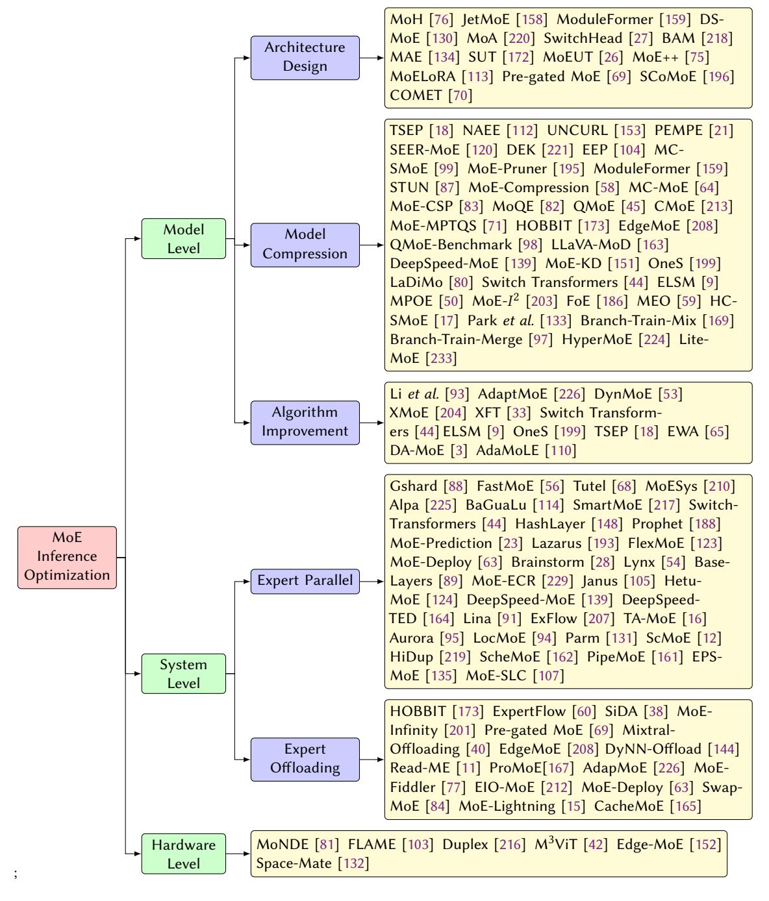
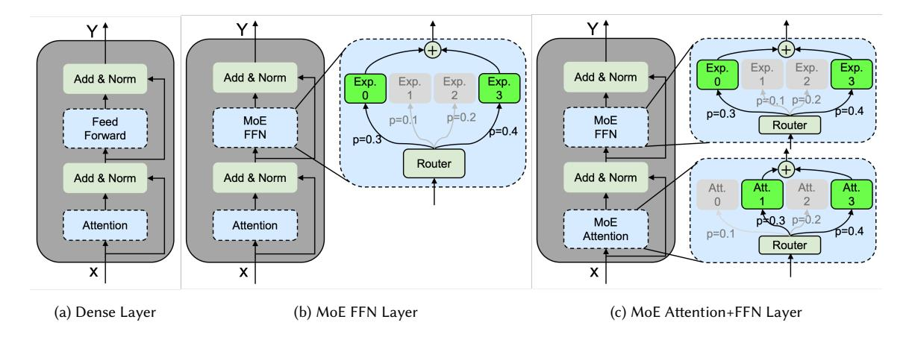
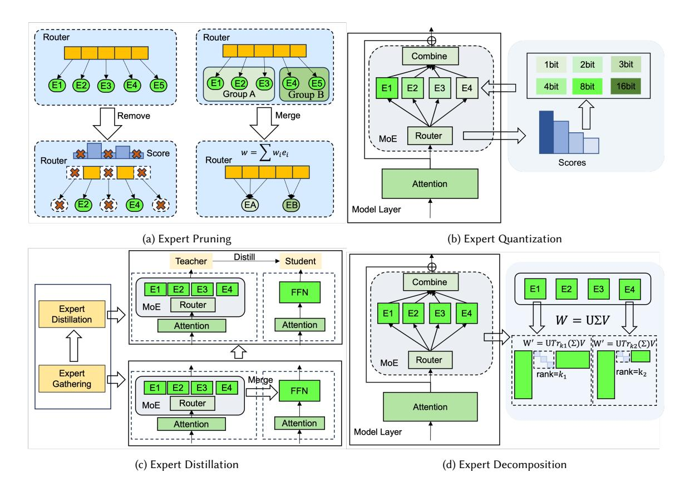

# A Survey on Inference Optimization Techniques for Mixture of Experts Models

JIACHENG LIU∗ , Chinese University of Hong Kong, China PENG TANG∗ , Shanghai Jiao Tong Universtiy, China WENFENG WANG, Shanghai Jiao Tong Universtiy, China YUHANG REN, Shanghai Jiao Tong Universtiy, China XIAOFENG HOU† , Shanghai Jiao Tong Universtiy, China

PHENG-ANN HENG, Chinese University of Hong Kong, China

MINYI GUO, Shanghai Jiao Tong Universtiy, China

CHAO LI† , Shanghai Jiao Tong Universtiy, China

The emergence of large-scale Mixture of Experts (MoE) models represents a significant advancement in artificial intelligence, offering enhanced model capacity and computational efficiency through conditional computation. However, deploying and running inference on these models presents significant challenges in computational resources, latency, and energy efficiency. This comprehensive survey analyzes optimization techniques for MoE models across the entire system stack. We first establish a taxonomical framework that categorizes optimization approaches into model-level, system-level, and hardware-level optimizations. At the model level, we examine architectural innovations including efficient expert design, attention mechanisms, various compression techniques such as pruning, quantization, and knowledge distillation, as well as algorithm improvement including dynamic routing strategies and expert merging methods. At the system level, we investigate distributed computing approaches, load balancing mechanisms, and efficient scheduling algorithms that enable scalable deployment. Furthermore, we delve into hardware-specific optimizations and co-design strategies that maximize throughput and energy efficiency. This survey provides both a structured overview of existing solutions and identifies key challenges and promising research directions in MoE inference optimization. To facilitate ongoing updates and the sharing of cutting-edge advances in MoE inference optimization research, we have established a repository accessible at [https://github.com/MoE-Inf/awesome-moe-inference/.](https://github.com/MoE-Inf/awesome-moe-inference/)

CCS Concepts: • Computing methodologies → Neural networks; • Computer systems organization → Neural networks; Embedded and cyber-physical systems.

Additional Key Words and Phrases: Mixture of Experts, Large Language Models, Inference Optimization

Authors' Contact Information: Jiacheng Liu, jcliu@cse.cuhk.edu.hk, Chinese University of Hong Kong, Hong Kong, China; Peng Tang, Shanghai Jiao Tong Universtiy, Shanghai, China; Wenfeng Wang, Shanghai Jiao Tong Universtiy, Shanghai, China; Yuhang Ren, Shanghai Jiao Tong Universtiy, Shanghai, China; Xiaofeng Hou, Shanghai Jiao Tong Universtiy, Shanghai, China; Pheng-Ann Heng, Chinese University of Hong Kong, Hong Kong, China; Minyi Guo, Shanghai Jiao Tong Universtiy, Shanghai, China; Chao Li, Shanghai Jiao Tong Universtiy, Shanghai, China.

Permission to make digital or hard copies of all or part of this work for personal or classroom use is granted without fee provided that copies are not made or distributed for profit or commercial advantage and that copies bear this notice and the full citation on the first page. Copyrights for components of this work owned by others than the author(s) must be honored. Abstracting with credit is permitted. To copy otherwise, or republish, to post on servers or to redistribute to lists, requires prior specific permission and/or a fee. Request permissions from permissions@acm.org.

© 2018 Copyright held by the owner/author(s). Publication rights licensed to ACM. Manuscript submitted to ACM

∗Both authors contributed equally to this research.

†Corresponding authors.

#### ACM Reference Format:

Jiacheng Liu, Peng Tang, Wenfeng Wang, Yuhang Ren, Xiaofeng Hou, Pheng-Ann Heng, Minyi Guo, and Chao Li. 2018. A Survey on Inference Optimization Techniques for Mixture of Experts Models. In Proceedings of Make sure to enter the correct conference title from your rights confirmation emai (Conference acronym 'XX). ACM, New York, NY, USA, [35](#page-34-0) pages. <https://doi.org/XXXXXXX.XXXXXXX>

### 1 Introduction

Large language models (LLMs) have revolutionized artificial intelligence, demonstrating unprecedented capabilities across various domains including natural language processing [\[20,](#page-27-0) [128,](#page-30-0) [181\]](#page-32-0), computer vision [\[32,](#page-27-1) [35,](#page-27-2) [222\]](#page-34-1), and multimodal tasks [\[92,](#page-29-0) [136,](#page-31-0) [187\]](#page-32-1). Models like GPT-4 [\[127\]](#page-30-1), Claude [\[8\]](#page-26-0), and Gemini [\[175\]](#page-32-2) have achieved remarkable performance in tasks ranging from natural language understanding to complex reasoning and code generation. The impressive capabilities of these models are largely attributed to their massive scale, both in terms of model parameters and computational resources invested in training. This scaling trend is supported by empirical evidence showing consistent improvements in model performance with increased size, as demonstrated by various scaling laws in language modeling and other domains [\[5,](#page-26-1) [19,](#page-27-3) [78\]](#page-29-1). However, this trajectory presents significant challenges in terms of computational efficiency and resource utilization, particularly during inference, where real-world deployment constraints become critical [\[10,](#page-26-2) [198,](#page-33-0) [215,](#page-33-1) [230\]](#page-34-2).

Mixture of Experts (MoE) has emerged as a promising architectural solution to address scaling challenges in machine learning [\[156\]](#page-31-1). Originally introduced by Jacobs et al.[\[72\]](#page-28-0) in the early 1990s as a method for learning subtasks in neural networks. Numerous MoE-based models [\[39,](#page-27-4) [55,](#page-28-1) [179\]](#page-32-3) have been developed over the years. In the era of large language models, MoE has again experienced a renaissance [\[1,](#page-26-3) [29,](#page-27-5) [74,](#page-28-2) [171\]](#page-32-4). The core principle of MoE is to distribute the model's capacity across multiple specialized sub-networks, or experts, with a learned routing mechanism that selectively activates only the relevant experts for each input. This approach allows models to maintain a large parameter count while keeping computational costs manageable through sparse activation. Recent implementations, such as Mixtral 8x7B [\[74\]](#page-28-2), DeepSeek-V3 [\[31\]](#page-27-6) and DBRX [\[178\]](#page-32-5), have demonstrated the effectiveness of this strategy in scaling language models to trillions of parameters while maintaining reasonable computational requirements.

The success of MoE in scaling models has led to its adoption in various state-of-the-art systems. For example, Google's GLaM [\[37\]](#page-27-7) outperforms GPT-3 while using significantly fewer computational resources during inference. Similarly, Mixtral 8x7B [\[74\]](#page-28-2) has demonstrated competitive performance compared to much larger dense models, while maintaining efficient inference characteristics. DeepSeek-V3 [\[31\]](#page-27-6), a recent open-source MoE model, has surpassed other open-source alternatives and demonstrated performance comparable to prominent closed-source models such as GPT4-o and Claude-3.5-Sonnet. Table [1](#page-2-0) summarizes recent state-of-the-art open-source MoE models that have garnered significant attention, showcasing their rapid evolution and widespread adoption across major tech companies and research institutions. The models range in size from 6.7B to 671B parameters, with varying architectures characterized by different numbers of experts, hidden layers, and attention heads. The chronological progression from 2022 to late 2024 demonstrates increasing model sizes and architectural sophistication, with recent models like DeepSeek-V3 pushing the boundaries in terms of parameter count and model performance. This trend further highlights the strong potential of the MoE architecture in advancing the field of large language models. These successes have sparked widespread interest in MoE across both academia and industry, leading to innovations in model design [\[22,](#page-27-8) [189,](#page-32-6) [220\]](#page-34-3), training techniques [\[36,](#page-27-9) [49,](#page-28-3) [108\]](#page-30-2), and deployment strategies [\[15,](#page-26-4) [16,](#page-26-5) [210\]](#page-33-2).

However, the efficient deployment of MoE models for inference presents unique and significant challenges [\[69,](#page-28-4) [173,](#page-32-7) [208,](#page-33-3) [226\]](#page-34-4). The dynamic nature of expert activation patterns introduces complexity in resource management and Manuscript submitted to ACM

| Reference             | Para. | Experts | #L | #H  | 𝑑𝑚𝑜𝑑𝑒𝑙 | 𝑑𝑓 𝑓 𝑛 | 𝑑𝑒𝑥𝑝𝑒𝑟𝑡 | Affiliation | Time    |
|-----------------------|-------|---------|----|-----|--------|--------|---------|-------------|---------|
| NLLB [24]             | 54B   | 2/64/0  | 24 | 16  | 1024   | 8192   | 8192    | FaceBook    | 2022.07 |
| Qwen2-57B-A14B [202]  | 57.4B | 8/64/0  | 28 | 28  | 3584   | 18944  | 2560    | Alibaba     | 2023.05 |
| Mixtral-8x7B [74]     | 46.7B | 2/8/0   | 32 | 32  | 4096   | 14336  | 14336   | Mistral AI  | 2023.12 |
| OpenMoE [200]         | 34B   | 2/16/0  | 12 | 12  | 768    | 2048   | 2048    | NUS et al.  | 2023.12 |
| DeepSeekMoE [29]      | 16.4B | 6/64/2  | 28 | 16  | 2048   | 10944  | 1408    | DeepSeek-AI | 2024.01 |
| Qwen1.5-MoE [177]     | 14.3B | 4/60/0  | 24 | 16  | 2048   | 5632   | 1408    | Alibaba     | 2024.02 |
| JetMoE [158]          | 8.52B | 2/8/0   | 24 | 32  | 2048   | 5632   | 5632    | MIT et al.  | 2024.03 |
| Jamba [102]           | 51.6B | 2/16/0  | 32 | 32  | 4096   | 14336  | 14336   | ai21labs    | 2024.03 |
| DBRX [178]            | 132B  | 4/16/0  | 40 | 48  | 6144   | 10752  | 10752   | Databricks  | 2024.03 |
| Grok-1 [194]          | 314B  | 2/8/0   | 64 | 48  | 6144   | UNK    | UNK     | xAI         | 2024.03 |
| Arctic [146]          | 482B  | 2/128/0 | 35 | 56  | 7168   | 4864   | 4864    | Snowflake   | 2024.04 |
| Mixtral-8x22B [74]    | 141B  | 2/8/0   | 56 | 48  | 6144   | 16384  | 16384   | Mistral AI  | 2024.04 |
| DeepSeek-V2 [30]      | 236B  | 6/160/2 | 60 | 128 | 5120   | 12288  | 1536    | DeepSeek-AI | 2024.04 |
| Skywork-MoE [191]     | 13B   | 2/16/0  | 52 | 36  | 4608   | 12288  | 12288   | Kunlun Tech | 2024.05 |
| Yuan2 [192]           | 40B   | 2/32/0  | 24 | 16  | 2048   | 8192   | 8192    | IEIT-Yuan   | 2024.05 |
| LLaMA-MoE [232]       | 6.7B  | 2/8/0   | 32 | 32  | 4096   | 11008  | 11008   | Zhu et al.  | 2024.06 |
| OLMoE [119]           | 6.92B | 8/64/0  | 16 | 16  | 2048   | 1024   | 1024    | AllenAI     | 2024.07 |
| Phi-3 [1]             | 41.9B | 2/16/0  | 32 | 32  | 4096   | 6400   | 6400    | MicroSoft   | 2024.08 |
| GRIN-MoE [106]        | 41.9B | 2/16/0  | 32 | 32  | 4096   | 6400   | 6400    | MicroSoft   | 2024.09 |
| Hunyuan-Large [171]   | 389B  | 1/16/1  | 64 | 80  | 6400   | 18304  | 18304   | Tencent     | 2024.11 |
| DeepSeek-V3 [31]      | 671B  | 8/256/1 | 61 | 128 | 7168   | 18432  | 2048    | DeepSeek-AI | 2024.12 |
| MiniMax-Text-01 [118] | 456B  | 2/32/0  | 80 | 64  | 6144   | 9216   | 9216    | MiniMax-AI  | 2025.1  |

Table 1. A List of SoTA MoEs. Param. represents the number of total parameters. Experts are listed according to the format of the number of activation experts, total experts, and shared experts. #L represents the number of hidden layers, #H represents the number of attention heads. is the hidden size, is the intermediate size of FFNs, is the intermediate size of FFN experts.

scheduling that is not present in traditional dense models. At the model level, the design of efficient expert architectures faces challenges in balancing model capacity with computational efficiency, while routing mechanisms must optimize expert selection and load distribution. The system-level challenges are particularly complex: distributed computation requires sophisticated scheduling algorithms to manage expert placement and activation, load balancing must handle dynamic workload variations across experts, and memory management needs to efficiently handle the loading and unloading of expert parameters. Hardware-level challenges stem from the fundamental mismatch between traditional hardware architectures optimized for dense computation and the sparse, dynamic nature of MoE inference. This necessitates specialized acceleration techniques to handle sparse computation patterns, manage memory bandwidth efficiently, and provide flexible computation capabilities for dynamic expert switching. Communication overhead in distributed settings presents another significant challenge, particularly when experts are distributed across different devices or nodes, requiring careful optimization of data movement and synchronization.

Numerous methods have been developed to address these challenges in MoE deployment and inference [\[76,](#page-29-3) [139,](#page-31-4) [152,](#page-31-5) [195\]](#page-33-9). While the rapid growth of research in this field demonstrates its importance, it can also make it difficult to identify key trends and best practices. A critical gap in the existing literature is the absence of a systematic framework for analyzing and developing comprehensive inference optimization solutions for MoE models. To bridge this gap, our work offers a comprehensive survey of inference optimization techniques for MoE models. We propose a taxonomical framework that categorizes optimization approaches into model-level, system-level, and hardware-level optimizations,

Fig. 1. Taxonomy of MoE inference optimization.

Fig. 2. Architectural comparison of dense layer with MoE layers: (a) conventional dense transformer layer, (b) transformer layer with MoE-based feed-forward network, and (c) transformer layer with both MoE-based attention and feed-forward networks.

as illustrated in Figure [1.](#page-3-0) This framework provides a structured approach to understanding and comparing different optimization techniques. While there are related surveys on LLM efficiency [\[10,](#page-26-2) [90,](#page-29-22) [96,](#page-29-23) [180,](#page-32-19) [183,](#page-32-20) [198,](#page-33-0) [215,](#page-33-1) [230\]](#page-34-2) and MoE architectures [\[13,](#page-26-11) [43,](#page-27-24) [182\]](#page-32-21), our work is the first to specifically focus on inference optimization techniques for MoE models. We systematically analyze optimization approaches at different abstraction levels, from model architecture to hardware acceleration, providing a valuable resource for researchers and practitioners working deploy MoE models for different real-world applications.

The remainder of this survey is organized as follows: Section [2](#page-4-0) provides background on MoE models and their inference characteristics. Sections 3-5 detail optimization techniques at the model, system, and hardware levels respectively. Section [6](#page-22-0) discusses future challenges and opportunities, and Section [7](#page-25-0) concludes the survey.

### 2 Fundamentals of Mixture of Experts

MoE represents a significant architectural paradigm in neural networks, particularly in large language models, where it enables conditional computation through sparse activation mechanisms [\[13\]](#page-26-11). At its core, an MoE architecture consists of a routing network () and a set of expert networks 1, 2, ..., , where denotes the total number of experts. The fundamental principle of MoE can be expressed as = Í =1 () · (), where () represents the gating function for expert , and () is the output of expert .

As illustrated in Figure [2,](#page-4-1) existing studies typically use the MoE module to replace part of the traditional dense layer, thereby forming a sparse MoE layer. While most research focuses on substituting the FFN module with the MoE module [\[1,](#page-26-3) [30,](#page-27-11) [74,](#page-28-2) [75,](#page-28-5) [177\]](#page-32-8), some have also explored replacing the Attention module [\[76,](#page-29-3) [158,](#page-31-2) [159,](#page-31-6) [220\]](#page-34-3).

The typical MoE model inference procedure follows a sequence of expert selection, parallel computation, and output aggregation. First, the router computes expert selection probabilities:

$$\theta = \operatorname{Softmax}(R(x)) \tag{1}$$

where ∈ R is the input token embedding, (·) is the routing function, and ∈ R represents the expert selection probabilities for total experts. Next, the top-k experts are selected based on these probabilities:

$$E_{\text{selected}} = \text{TopK}(\theta, K)$$
 (2)

where selected contains the indices of the K selected experts, ≤ . The selected experts then process the input in parallel:

$$y_i = E_i(x), \quad \forall i \in E_{\text{selected}}$$
 (3)

where (·) represents the computation of expert , and is its output. Finally, the expert outputs are combined through weighted aggregation:

$$y = \sum_{i \in E_{\text{selected}}} \frac{\theta_i}{\sum_{j \in E_{\text{selected}}} \theta_j} \cdot y_i \tag{4}$$

The MoE architecture offers several compelling advantages that have contributed to its growing adoption in modern neural networks. First, the conditional computation mechanism enables significant computational savings compared to dense models of similar capacity. By activating only a subset of experts for each input token, MoE models can process information more efficiently while maintaining high performance levels. This is particularly valuable in resource-constrained environments or when scaling to larger model sizes.

Second, the specialization of individual experts allows for more nuanced and accurate processing of different input patterns. Each expert can develop specialized knowledge for specific aspects of the input space, leading to more refined and targeted computations. This specialization is particularly beneficial in language models, where different experts can focus on various linguistic patterns, domains, or tasks.

Third, the dynamic routing mechanism enables adaptive computation based on input complexity. More challenging or nuanced inputs can engage multiple experts with complementary specializations, while simpler inputs might require only a small subset of experts. This adaptive resource allocation helps optimize the computation-performance trade-off and potentially improves both efficiency and effectiveness.

By partitioning dense models into relatively independent expert models and dynamically activating specific subsets (or the entire set) of experts based on each input token, the model's overall performance can be significantly enhanced with only a marginal increase in inference computation. This approach clearly demonstrates the MoE model's exceptional flexibility and scalability.

### 3 Model-level Optimizations

Model-level optimizations aim to enhance the inherent structure and efficiency of MoE models through systematic improvements in architecture, parameter optimization, and algorithmic design. These optimizations can be broadly categorized into three main areas: efficient model architecture design, model compression techniques, and algorithmic improvements. Architecture design focuses on developing more efficient expert and attention structures, while compression techniques aim to reduce model size and memory footprint through methods such as pruning, quantization, and knowledge distillation. Algorithmic improvements concentrate on enhancing the dynamic aspects of MoE models, including routing mechanisms and expert combination strategies. Figure [3](#page-6-0) illustrates the detailed taxonomy of model-level optimization that is described in this section.

Fig. 3. Model-level inference optimization techniques for MoE.

#### 3.1 Efficient Model Architecture Design

A transformer block typically consists of two main components: the attention module and the FFN module. To build better MoE models, many studies focus on designing improved versions of both the attention and FFN modules, aiming to achieve strong performance while maintaining high efficiency.

3.1.1 MoE-based Attention Design. In addition to the typical application of the MoE structure in the FFN module of the transformer layer, current studies explore how to incorporate MoE into the Attention module for improved performance. MAE [134] was the first to explain the multi-head attention mechanism from the MoE perspective, using a learned gating function to activate different experts for different inputs, with each expert consisting of n-1 heads. To further optimize MoE-based attention modules, existing research proposes various structures. MoA [220] and BAM [218] select k heads for a given input and share key projection and value projection weights among all heads, while SwitchHead [27] shares key projection and query projection weights to enhance computational efficiency. MoH [76] introduces shared heads and a two-stage routing process to further improve the standard MoE method, offering an advantage over MoA. Building upon MoA, ModuleFormer [159] extends sparse modules to both the attention and feed-forward layers,

|                      | Sparsity | TSA | Datasets of Fine-tuning                |   | Structured | Unstructured |  |
|----------------------|----------|-----|----------------------------------------|---|------------|--------------|--|
|                      |          |     |                                        |   | Merge      |              |  |
| TSEP [18]            | 96.875%  | S   | GLUE [184] SQuAD [141]                 | ✓ |            |              |  |
| NAEE [112]           | 50%      | S   | MetaMathQA [211]                       | ✓ |            |              |  |
| UNCURL [153]         | 75%      | S   | FLAN [111]                             | ✓ |            |              |  |
| PEMPE [21]           | 75%      | A   | CIFAR-10 CIFAR-100 [85] ImageNet [149] | ✓ |            |              |  |
| SEER-MoE [120]       | 25%      | S   | MMLU [61] SST5 [166]                   | ✓ |            |              |  |
| 2 MoE-𝐼 [203]  | 53.98%   | A   | Alpaca [174]                           | ✓ |            |              |  |
| DEK [221]            | 75%      | S   | C4 [138]                               |   | ✓          |              |  |
| EEP [104]            | 75%      | A   | NA                                     | ✓ | ✓          |              |  |
| MC-SMoE [99]         | 75%      | S   | eight datasets                         |   | ✓          |              |  |
| MoE-Pruner [195]     | 50%      | A   | C4 [138]                               |   |            | ✓            |  |
| STUN [87]            | 70%      | A   | C4 [138]                               |   |            | ✓            |  |
| MoE-compression [58] | 50%      | A   | Lima [227] MetaMathQA [211]            | ✓ |            | ✓            |  |

Table 2. A comparison of pruning methods. Sparsity indicates the max ratio of pruning. TSA represents task specific or agnostic. EEP [\[104\]](#page-29-4) does not require additional fine-tuning. Finetuning datasets of MS-SMoE [\[99\]](#page-29-5) are SST2 [\[166\]](#page-32-23) MRPC [\[34\]](#page-27-25) MultiRC [\[79\]](#page-29-25) COPA [\[147\]](#page-31-18) WinoGrande [\[150\]](#page-31-19) SQuAD [\[141\]](#page-31-15) WikiQA [\[205\]](#page-33-21)and HotpotQA [\[206\]](#page-33-22).

allowing for the easy addition and removal of modules. Inspired by MoA and ModuleFormer, JetMoE-8B [\[158\]](#page-31-2) develops a powerful open-source model featuring sparse attention and sparse feed-forward layers, while DS-MoE [\[130\]](#page-30-6) proposes a hybrid dense training and sparse inference framework for efficient training and inference. Additionally, SUT [\[172\]](#page-32-9) and MoEUT [\[26\]](#page-27-13) use sparse attention and sparse feed-forward layers to construct the efficient Sparse Universal Transformer model, which shares parameters across all layers.

3.1.2 MoE-based FFN Design. To enhance the efficiency of MoE-based models, current research explores various variants of the standard MoE module. MoE++ [\[75\]](#page-28-5) introduces three types of zero-computation experts based on standard experts, aimed at reducing computational overhead. SCoMoE [\[196\]](#page-33-10) leverages a structured all-to-all communication approach, inspired by hierarchical communication topologies, to reduce communication costs during parallel MoE computation. Pre-gated MoE [\[69\]](#page-28-4) proposes a pre-gated MoE module that prefetches the required experts to improve inference speed on memory-constrained devices. COMET [\[70\]](#page-28-6) introduces a tree-based sparse expert selection mechanism to optimize the traditional gating module, which typically relies on a linear approach. Additionally, MoELoRA [\[113\]](#page-30-7) reimagines LoRA as a MoE for more parameter-efficient fine-tuning.

### 3.2 Model Compression Techniques

Model compression is a popular area of research for reducing model size in current LLM studies, with techniques such as pruning [\[100,](#page-29-26) [116\]](#page-30-18), quantization [\[46,](#page-28-20) [185\]](#page-32-25), knowledge distillation [\[2,](#page-26-12) [52\]](#page-28-21), and low-rank decomposition [\[190,](#page-33-23) [214\]](#page-33-24). Since experts constitute the majority of the weights in MoE models (e.g., 96% for Mixtral-8x7B [\[74\]](#page-28-2)), most MoE-related compression efforts focus on applying these common techniques specifically to the experts.

3.2.1 Expert Pruning. Due to the large number of parameters in MoE-based models, current research explores pruning methods to reduce the number of parameters in MoE experts. These methods are generally divided into structured and unstructured pruning. Most studies focus on structured expert pruning, which aims to reduce the number of experts in the MoE layer while maintaining model accuracy. As shown in Figure [4-](#page-8-0)(a), some approaches directly remove unimportant experts (left side), while others merge groups of experts into a single expert (right side). TSEP [\[18\]](#page-27-14) removes non-professional experts for the target downstream task while fine-tuning professional experts to preserve model Manuscript submitted to ACM

Fig. 4. Compression techniques for MoE models.

performance. They also demonstrate the superiority of the eager expert pruning paradigm over other possible solutions like two-pass optimization or staged expert pruning. NAEE [\[112\]](#page-30-8) eliminates unimportant experts by evaluating expert combinations on a small calibration dataset to minimize accuracy loss, simultaneously reduce model sizes and increase inference speed. while UNCURL [\[153\]](#page-31-8) reduces the number of experts based on MoE router logits. Some insights useful to model design choices considering task-specific inference optimization can give guidance for later stages. PEMPE [\[21\]](#page-27-15) prunes experts that have smaller changes in the router's 2 norm between the pre-trained and fine-tuned models, and will conduct experiments with other compression techniques on SOTA vision MoEs. SEER-MoE [\[120\]](#page-30-9) employs a heavy-hitters counting method for expert pruning, then with regularization-based fine-tuning reaches further expert pruning. MoE- 2 [\[203\]](#page-33-13) proposes the Layer-wise Genetic Search and Block-wise KT-Reception Field with the non-uniform pruning ratio to prune unimportant experts.

In addition to direct pruning, some studies utilize expert merging to reduce the number of experts. For unstructured pruning, MoE-Pruner [\[195\]](#page-33-9) prunes weights with the smallest magnitudes, weighted by the corresponding input activations and router weights. The pruned MoE models can benefit from a pre-trained teacher model through expertwise knowledge distillation and have compatibility with structured pruning. Moreover, STUN [\[87\]](#page-29-6) combines structured and unstructured pruning to achieve better performance than unstructured pruning alone, utilizing the sparse character of MoEs based on behavior similarity in a greedy manner. MoE-Compression [\[58\]](#page-28-7) proposes a unified framework for

| Method         | Quantization Type |            | Memory             | Accuracy  | Inference           | Quantization |
|----------------|-------------------|------------|--------------------|-----------|---------------------|--------------|
| Method         | Weight            | Activation | Reduction          | Drop      | Speedup             | Bits         |
| MC-MoE [99]    | ✓                 |            | 4.27x              | 3.8%      | 1.80x               | 1, 2, 3      |
| MoE-CSP [83]   | ✓                 |            | 4.00x              | -         | 26.00x              | 4, 8         |
| MoQE [82]      | ✓                 |            | 4.90x              | 0.97%     | -                   | 2, 3, 4      |
| QMoE [45]      | ✓                 |            | 20x                | 6.7%      | 0.95x               | 1, 2         |
| CMoE [213]     | ✓                 | ✓          | 150x               | 23.81%    | -                   | 1, 2, 4      |
| MoE-MPTQS [71] | ✓                 |            | -                  | 0 ~ 4.98% | $1.00x \sim 20.63x$ | 4, 8         |
| HOBBIT [173]   | ✓                 |            | -                  | 1%        | 1.35x               | 2, 4         |
| EdgeMoE [208]  | ✓                 |            | $1.05x \sim 1.18x$ | 5%        | $1.11x \sim 2.78x$  | 2, 4, 8      |

Table 3. A comparison of quantization methods.

MoE compression, using both structured and unstructured pruning methods to achieve significant inference speedup with minimal accuracy loss.

Another potential approach is merging outdated experts based on their parameters to achieve better performance. Branch-Train-Merge [97] independently trains different parts of the model on distinct subsets of data, eliminating the need for large-scale multi-node synchronization typically required in traditional LLM training. Building on this, Branch-Train-Mix [169] trains multiple copies of a seed LLM to specialize in multiple domains in an asynchronous and parallel fashion, then merges the parameters of the MoE layer to create a unified model that can be further trained. The second finetuning stage makes the final LLM more performant. They also find that their approach is more computing efficient compared to the dense model or specialized MoE model on training. Park et al. [133] observed that introducing a shared layer in the MoE could lead to performance degradation. To address this, they trained merged experts that learned the same features in different ways, improving their ability to generalize and mitigating catastrophic forgetting during incremental learning of multi-domain tasks. MC-SMoE [99] divides experts into different groups based on routing policies and then merges each group into one expert. HC-SMoE [17] is a framework that uses hierarchical clustering to merge experts without requiring retraining and can be applied in a task-agnostic manner. During inference, MEO [59] systematically investigates the computational cost of MoE. In the drop-in replacement algorithm, they first merge the selected expert parameters and then perform efficient computation. FoE [186] fuses the outputs of expert models by leveraging their complementary knowledge of the data distribution, framing it as a supervised learning instance. DEK [221] identifies and groups similar experts in feature space, then merges experts within the same group in weight space to reduce the expert count. EEP [104] introduces a two-stage approach to both prune and merge experts, reducing the total number of experts (saving GPU memory) and the number of active experts (accelerating inference). Inspired by the concept of knowledge transfer in multi-task learning, HyperMoE [224] proposes a novel expert network that further increases sparsity while utilizing information from unselected experts as supplementary input. In practice, they capture the contextual information of experts to compensate for the performance loss of transferring knowledge to specific experts. LiteMoE [233] retains the most critical experts based on the application's characteristics, merges secondary experts, and obtains the final sparse model without retraining. This approach enables efficient deployment of lightweight submodels on resource-constrained mobile devices.

3.2.2 Expert Quantization. In addition to model pruning, quantization is an effective technique for reducing model size by converting high-precision weights into low-precision. Given the redundancy of experts in MoE models, current research primarily focuses on quantizing the weights of the experts in MoE. As illustrated in Figure 4-(b), experts Manuscript submitted to ACM

are quantized into appropriate low-precision versions using various methods. MC-MoE [64] leverages the access frequency and activation weight to assess the importance of each expert. Along with the associated quantization loss, these metrics are used to determine the optimal quantization configuration for experts via the Integer Programming model. Specifically, the *i*-th expert's access frequency is defined as  $\phi_i = \frac{n_i}{N}$ , and the activation weight is defined as  $w_i = \frac{\sum_{j=1}^{N} \sigma_j}{N}$ , where  $n_i$  is the usage frequency,  $\sigma_i$  is the routing weight, and N represents the size of the calibration dataset. The quantization loss,  $\epsilon_{ij}$  (computed using the Frobenius norm), is then determined for quantizing expert i to jbits  $(j \in 1, 2, 3)$ . Using these metrics, MC-MoE defines the objective function as  $\sum_{i=1}^{n} \sum_{j=1}^{3} \phi_i^{\alpha} \cdot w_i^{\beta} \cdot (\epsilon_{ij} \cdot x_{ij})^{\gamma}$ , which is minimized using Integer Programming to determine the optimal bit-width for each expert. MoE-CSP [83] quantizes expert weights to either 4 or 8 bits to reduce memory consumption in MoE models. Additionally, it designs specific CUDA kernels that handle the 4-bit/8-bit quantized weights and perform floating-point calculations to accelerate computations. MoQE [82] quantizes expert weights to 2 bits to address the memory and latency challenges of MoE models based on its observations that quantizing expert FFN layers to 2 bits does not significantly affect model quality, while quantizing other components, like self-attention, significantly hurts performance. Further advancements include QMoE [45] and CMoE [213], which aggressively compress MoE model into just 1 bit. QMoE implements a highly scalable compression algorithm for large models and introduces a custom compression format along with bespoke GPU kernels for efficient on-the-fly computation. On the other hand, CMoE uses binary-weight networks to quantize model weights to 1 bit and applies learned step-size quantization to activations, quantizing them to 4 bits for MoE-based ASR models, enabling deployment on embedded devices. Moreover, some MoE-optimized systems leverage quantization for better system efficiency. MoE-MPTQS [71] and HOBBIT [173] dynamically select quantized experts to replace original experts based on the current inputs, thereby reducing the expert loading cost on memory-limited devices. EdgeMoE [208] statistically determines the appropriate expert bit-width by profiling expert importance on a calibration dataset. Furthermore, QMoE-Benchmark [98] provides a benchmark for exploring various MoE structure-aware quantization heuristics, from coarse to fine granularity. The study reveals that different MoE structures (e.g., blocks, experts, linear layers) require different numbers of weight bits for effective and efficient quantization.

We summarize the main results reported by the methods discussed above in Table 3. From the table, we observe that quantization primarily benefits memory reduction, with most methods achieving more than a 4x reduction in memory usage. Some methods also lead to actual inference speedup, while others do not. For instance, QMoE even incurs a 5% overhead due to the absence of a dedicated 1-bit inference CUDA kernel implementation and hardware support. Furthermore, quantization typically causes some accuracy loss, with lower bit widths resulting in greater accuracy degradation. Therefore, when applying quantization to a model, it is crucial to strike a balance between memory consumption, accuracy, and inference speedup, taking into account the specific requirements and available hardware resources.

3.2.3 Expert Distillation. Knowledge distillation is another effective method for creating smaller, yet powerful models from larger ones. As shown in Figure 4-(c), knowledge distillation presents a promising solution to generate a compact, high-performance model from the original MoE model. LLaVA-MoD [163] combines the MoE structure with knowledge distillation to efficiently train small multimodal large language models (s-MLLMs) from large ones (l-MLLMs). It first incorporates the MoE structure into the s-MLLM to balance computational efficiency and model performance. Then, it introduces two consecutive distillation stages, mimic distillation and preference distillation, to train the s-MLLM. Mimic distillation minimizes the Kullback-Leibler (KL) divergence between the output distributions of the s-MLLM and l-MLLM, enabling the s-MLLM to emulate the l-MLLM's understanding. Preference distillation further refines the

s-MLLM using Preference Optimization with additional datasets. DeepSpeed-MoE [139] employs staged knowledge distillation to create a distilled version of its proposed PR-MoE model, called MoS. This method reduces model size while maintaining performance. Additionally, some studies focus on transferring the power of sparse models to dense models through knowledge distillation for more efficient deployment. For example, OneS [199] generates a dense model from a MoE model in two steps: knowledge gathering and knowledge distillation. Knowledge gathering merges experts into a single expert using four aggregation methods, including summation, averaging, top-k knowledge gathering, and Singular Value Decomposition (SVD) knowledge gathering. In the second step, knowledge distillation distills the merged model using the original MoE model. What's more, MoE-KD [151] and CMoE [213] distill MoE-based speech recognition models into dense models, accelerating the speech recognition process. Specifically, MoE-KD initializes the FFN module of the student dense model with the most frequently used expert from the teacher MoE model, then trains the FFN modules of the student model through layer-wise distillation. CMoE distills a binary dense model from the original model using quantization techniques. Switch Transformers [44] and ELSM [9] also explore distillation techniques to convert their sparse models into dense models. Additionally, to simplify the construction of MoE models, LaDiMo [80] converts a dense model into a sparse MoE model via layer-wise distillation, where each expert learns to approximate the results of the original dense layers.

3.2.4 Expert Decomposition. As shown in Figure 4-(d), low-rank decomposition is an effective method for reducing model size by decomposing a large weight matrix into smaller matrices. MPOE [50] employs the matrix product operator (MPO), a tensor decomposition technique derived from quantum many-body physics, to decompose the expert weight matrix into a central tensor and several auxiliary tensors. The central tensor retains most of the parameters and core information of the original weight matrix, while the auxiliary tensors are much smaller and serve as complements to the central tensor. After decomposition, all experts in a layer share the same central tensor, thereby significantly reducing the total number of parameters in that layer. MC-SMoE [99] first groups the experts into several clusters and then merges each group into a single expert using a weighted sum. Low-rank decomposition is then applied to the merged experts to further reduce the model size. This approach is based on the observation that the merged experts have a lower rank compared to the original experts, making them more suitable for decomposition. MoE- $I^2$  [203] identifies the importance of each expert and assigns higher ranks to more important experts while assigning lower ranks to less important ones for low-rank decomposition. The importance,  $I_{i,j}$ , of the j-th expert in the i-th layer,  $e_{i,j}$ , is determined by removing  $e_{i,j}$  and calculating the performance loss compared to the original model. The SVD rank,  $r_{i,j}$ , for  $e_{i,j}$  is then computed as  $r_{i,j} = \left\lfloor \frac{(I_{i,j} + \epsilon)^{\alpha}}{\sum_{j=1}^{M_i} (I_{i,j} + \epsilon)^{\alpha}} \right\rfloor \cdot R_a \cdot M_i$ , where  $\epsilon$  and  $\alpha$  are hyperparameters,  $R_a$  is the compression ratio, and  $M_i$  is the number of experts in layer i.

### 3.3 Algorithm Improvement

In this part, we conduct an in-depth exploration of two other strategies for improving the MoE model inference algorithm.

3.3.1 Dynamic Gating. Given the significant progress made in utilizing the sparsity of MoE models, specific strategies can be employed to further exploit this sparsity in the inference process. Due to the vertical parallel structure of MoE experts, dynamically reducing the number of experts activated for each token clearly presents an effective strategy. Figure 5-(a) illustrates the MoE layer's calculation process after the skip mechanism is applied, in contrast to the original process.

Fig. 5. Algorithm improvement on expert layers.

| Method             | FLOPs Reduction | Speedup | Threshold Strategy        | Load Balance  | PR. |
|--------------------|-----------------|---------|---------------------------|---------------|-----|
| Fixed top-k gating | 0%              | 1.0x    | ✗                         | ✗             | ✓   |
| Li et al.[93]      | 38.2%           | 1.32x   | accumulative probability  | soft on top-1 | ✓   |
| DynMoE[53]         | 9%              | 1.37x   | single expert probability | ✓             | ✗   |
| XMoE[204]          | 75%             | -       | accumulative probability  | ✓             | ✓   |
| AdapMoE[226]       | 25% of experts  | 1.35x   | performance perturbation  | ✗             | ✓   |

Table 4. A comparison of dynamic gating methods. PR. indicates performance Retention. Specially, Li et al. [\[93\]](#page-29-12) only uses soft load balance constraints on top-1 gating. No specific acceleration ratio was provided in XMoE [\[204\]](#page-33-14).

Li et al. [\[93\]](#page-29-12) proposes a self-adaptive gating mechanism that dynamically determines the number of experts required for each token, based on the expert probability distribution. This method enhances training efficiency while preserving the sparsity of the MoE model and further reduces training time through curriculum learning. DynMoE [\[53\]](#page-28-12) introduces two innovative methods for expert activation: a top-down gating approach that enables flexible per-token expert allocation, and an adaptive mechanism that dynamically determines the number of experts needed for each token based on computational requirements. XMoE [\[204\]](#page-33-14) employs a strategy of using smaller, but more experts, with dynamic expert activation based on threshold values to balance computational efficiency and model performance. AdapMoE [\[226\]](#page-34-4) is a co-design framework aimed at improving inference efficiency on edge devices. It adaptively applies three techniques: expert activation, expert prefetching, and GPU cache allocation. The comprehensive comparison of performance and methods of these works is presented in Table [4.](#page-12-1) DA-MoE [\[3\]](#page-26-8) introduces a token importance prediction method derived from attention mechanisms to guide expert allocation. By assigning experts based on token importance scores, their approach achieves strong performance on the GLUE benchmark while demonstrating effective scaling with increased expert count.

3.3.2 Sparse to Dense. In certain scenarios, dense models offer unique advantages due to their smaller number of parameters. Therefore, transforming MoE models into dense target models all at once can achieve maximum sparsity while maintaining model performance. Most approaches use knowledge distillation to achieve this sparse-to-dense conversion, as illustrated in Figure [5-](#page-12-0)(b).

XFT [\[33\]](#page-27-18) proposes a novel method to supervise fine-tune dense LLMs. They first generate a sparse-upcycled MoE model, and then transform it back into an efficient dense LLM of the same size and structure through a learnable merging mechanism. Switch Transformers [\[44\]](#page-27-17) explores distillation techniques to convert a sparse model into a dense one, demonstrating that the dense model can retain over 30% of its performance even after compressing 97% of the Manuscript submitted to ACM

Fig. 6. System-level inference optimization techniques for MoE.

parameters from the sparse MoE model. ELSM (Artetxe et al., 2021) demonstrates that dense student models distilled from sparse MoE teachers can match and even surpass the teacher's performance. OneS [\[199\]](#page-33-12) employs four distinct methods to generate the dense model, including summation, averaging, top-k Knowledge Gathering, and Singular Value Decomposition Knowledge Gathering. The model is then refined to reduce noise by gathering sparse knowledge. TSEP [\[18\]](#page-27-14) progressively eliminates non-expert components based on specific downstream tasks, ultimately converting the sparse MoE model into a dense counterpart. EWA [\[65\]](#page-28-13) replaces FFNs with specially designed MoEs during training before reverting to dense ViT for inference. AdaMoLE [\[110\]](#page-30-10) combining the Low-Rank Adaptation (LoRA) structure, a dedicated network is used to adjust the activation threshold for different task complexities. It has shown superior performance to baseline in many natural language processing tasks, especially in some commonsense reasoning tasks.

Fig. 7. Expert parallelism and expert offloading techniques.

