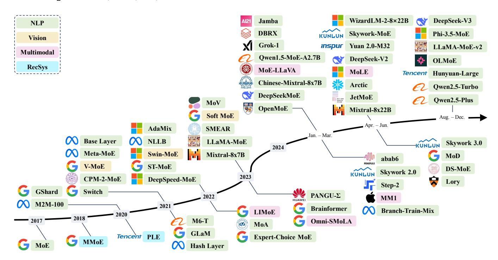

# **1 INTRODUCTION**

I N the current landscape of artificial general intelligence (AGI), the transformative impact of transformer-based large language models (LLMs) has permeated diverse fields such as natural language processing [\[1\]](#page-22-0), [\[2\]](#page-23-0), [\[3\]](#page-23-1), [\[4\]](#page-23-2), [\[5\]](#page-23-3), computer vision [\[6\]](#page-23-4), [\[7\]](#page-23-5), and multimodality [\[8\]](#page-23-6), [\[9\]](#page-23-7), [\[10\]](#page-23-8). Building upon the foundational transformer architecture, LLMs demonstrate extraordinary capabilities, which are attributed to their sheer size, the breadth of data they are trained on, and the significant computational resources invested in their development [\[11\]](#page-23-9), [\[12\]](#page-23-10), [\[13\]](#page-23-11). Recognizing a scaling law [\[11\]](#page-23-9), [\[14\]](#page-23-12) that underpins their evolution, it is imperative to identify and implement efficient methodologies for the sustainable scaling of LLMs.

- *The work of Weilin Cai and Jiayi Huang was supported in part by the National Natural Science Foundation of China (No. 62402411), the Guangdong Provincial Project (No. 2023QN10X252), the Guangdong Basic and Applied Basic Research Foundation (No. 2023A1515110353), the Guangzhou Municipal Science and Technology Project (No. 2024A04J4528), and the Guangzhou-HKUST(GZ) Joint Funding Program (No. 2024A03J0624). Jing Tang's work is partially supported by National Key R&D Program of China under Grant No. 2023YFF0725100 and No. 2024YFA1012701, by the National Natural Science Foundation of China (NSFC) under Grant No. 62402410 and No. U22B2060, by Guangdong Provincial Project (No. 2023QN10X025), by Guangdong Basic and Applied Basic Research Foundation under Grant No. 2023A1515110131, by Guangzhou Municipal Science and Technology Bureau under Grant No. 2023A03J0667 and No. 2024A04J4454, by Guangzhou Municipal Education Bureau (No. 2024312263), and by Guangzhou Municipality Big Data Intelligence Key Lab (No. 2023A03J0012), Guangzhou Industrial Information and Intelligent Key Laboratory Project (No. 2024A03J0628) and Guangzhou Municipal Key Laboratory of Financial Technology Cutting-Edge Research (No. 2024A03J0630).*
- *The authors are with The Hong Kong University of Science and Technology (Guangzhou), Guangzhou, China.*
- *Weilin Cai, Juyong Jiang, and Fan Wang are the Equal Contributions (e-mail:* {*wcai738, jjiang472, fwang380*}*@connect.hkust-gz.edu.cn).*
- *Jing Tang, Sunghun Kim, and Jiayi Huang are the Corresponding Authors (e-mail:* {*jingtang, hunkim, hjy*}*@hkust-gz.edu.cn).*

The concept of mixture of experts (MoE), initially introduced in [\[15\]](#page-23-13), [\[16\]](#page-23-14), has undergone extensive exploration and advancement as evidenced by subsequent studies [\[17\]](#page-23-15), [\[18\]](#page-23-16), [\[19\]](#page-23-17), [\[20\]](#page-23-18), [\[21\]](#page-23-19), [\[22\]](#page-23-20), [\[23\]](#page-23-21). The emergence of sparsely-gated MoE [\[24\]](#page-23-22), particularly within the integration of transformerbased large language models [\[25\]](#page-23-23), has brought new vitality to this three-decade-old technology. The MoE framework is based on a simple yet powerful idea: different parts of a model, known as experts, specialize in different tasks or aspects of the data. With this paradigm, only pertinent experts are engaged for a given input, keeping the computational cost in check while still benefiting from a large pool of specialized knowledge. This scalable and flexible innovation has offered an effective approach for adhering to the scaling law, allowing for increased model capacity without a corresponding surge in computational demands. As depicted in Figure [1,](#page-1-0) MoE has maintained a robust trajectory of growth, particularly notable in 2024 with the advent of Mixtral-8x7B [\[26\]](#page-23-24) and a variety of subsequent industrial-scale LLMs such as Grok-1 [\[27\]](#page-23-25), DBRX [\[28\]](#page-23-26), Arctic [\[29\]](#page-23-27), DeepSeek-V2 [\[30\]](#page-23-28), etc.

Despite the growing popularity and application of mixture of experts (MoE) models across various domains, comprehensive reviews that thoroughly examine and categorize advancements, particularly in the context of MoE in LLMs, remain scarce. Specifically, we identified two surveys preceding our work: the first, published in August 2012 [\[31\]](#page-23-29), provides a comprehensive review of early studies on dense MoE, which significantly differ from the current mainstream focus on sparse MoE; the second, released in September 2022 [\[32\]](#page-23-30), predates the major developments following the "ChatGPT moment" and, as a result, does not cover the substantial advancements and increased interest from academia and industry that have since emerged. This gap in the litera-

Fig. 1. A chronological overview of several representative mixture-of-experts (MoE) models in recent years. The timeline is primarily structured according to the release dates of the models. MoE models located above the arrow are open-source, while those below the arrow are proprietary and closed-source. MoE models from various domains are marked with distinct colors: Natural Language Processing (NLP) in green , Computer Vision in yellow , Multimodal in pink , and Recommender Systems (RecSys) in cyan .

ture not only hinders the progress of MoE research but also limits the broader dissemination of knowledge on this topic. Our survey aims to address this deficit by providing a clear and comprehensive overview of MoE in LLMs, introducing a novel taxonomy that organizes recent progress into three categories: algorithm, system, and application.

Under this taxonomy, we first delve into MoE algorithmic advancements, particularly the prevalent substitution of feed-forward network (FFN) layers with MoE layers in transformer-based LLMs [\[25\]](#page-23-23), [\[26\]](#page-23-24), [\[30\]](#page-23-28), [\[33\]](#page-23-31), [\[34\]](#page-23-32), [\[35\]](#page-23-33), [\[36\]](#page-23-34). As each MoE layer integrates multiple FFNs—each designated as an expert—and employs a gating function to activate a selected subset of these experts, we explore the design choices of gating function and expert network, alongside collections of available open-source implementations, hyperparameter configurations, and empirical evaluations. Furthermore, to underscore the flexibility and versatility of MoE, we extend our analysis beyond the standard integration of MoE into model backbone, and discuss an array of novel MoE-related designs, such as soft MoE with token or expert merging [\[37\]](#page-23-35), [\[38\]](#page-23-36), [\[39\]](#page-23-37), [\[40\]](#page-23-38), [\[41\]](#page-23-39), mixture of parameter-efficient experts (MoPEs) [\[40\]](#page-23-38), [\[42\]](#page-23-40), [\[43\]](#page-23-41), [\[44\]](#page-23-42), [\[45\]](#page-23-43), [\[46\]](#page-24-0), training and inference schemes with model transition between dense and sparse [\[47\]](#page-24-1), [\[48\]](#page-24-2), [\[49\]](#page-24-3), [\[50\]](#page-24-4), [\[51\]](#page-24-5), [\[52\]](#page-24-6), and various derivatives [\[53\]](#page-24-7), [\[54\]](#page-24-8), [\[55\]](#page-24-9), [\[56\]](#page-24-10), [\[57\]](#page-24-11), [\[58\]](#page-24-12).

With the gradual convergence of model architecture design in industrial products, system design has emerged as a pivotal factor in enhancing the quality of LLM services. Given the close association of MoE models with machine learning system design, we provide a comprehensive overview of MoE system design, including computation, communication, and storage enhancements tailored to address the unique challenges posed by the sparse and dynamic nature of its computational workload. Additionally, we overview the applications of MoE across various domains, including natural language processing, computer vision, recommender system, and multimodal contexts.

The remainder of this survey is organized as follows. Section [2](#page-1-1) provides a foundational understanding of MoE, contrasting sparse and dense activation of experts. Section [3](#page-3-0) introduces our proposed taxonomy for categorizing MoE advancements. Sections [4,](#page-3-1) [5,](#page-17-0) and [6](#page-20-0) delve into the algorithmic designs, computing system support, and various applications of MoE models, respectively, following the structure outlined in our taxonomy in Figure [3.](#page-4-0) Finally, in Section [7,](#page-21-0) we highlight the critical challenges and opportunities for bridging the research-practicality gap, culminating in Section [8](#page-22-1) with our conclusions.

## **2 BACKGROUND ON MIXTURE OF EXPERTS**

In transformer-based large language models (LLMs), each mixture-of-experts (MoE) layer typically consists of a set of N "expert networks" {f1, . . . , fN }, alongside a "gating network" G. The role of the gating network, which often takes the form of a linear network with a softmax activation function, is to direct the input to the appropriate expert networks [\[24\]](#page-23-22), [\[34\]](#page-23-32). The MoE layer is strategically placed to select the feed-forward network (FFN) within each Transformer block, typically following the self-attention (SA) sublayer. This positioning is crucial because the FFN become increasingly computationally demanding as the model scales up. For instance, in the PaLM [\[3\]](#page-23-1) model with the parameter number of 540B, the 90% of these parameters are within its FFN layers.

Fig. 2. An illustration of an MoE layer in Transformer-based models. For each input X, the linear-softmax gating will select all experts namely **(a) Dense MoE** or top-k experts namely **(b) Sparse MoE** to perform conditional computation. The expert layer returns the output of the selected expert multiplied by the gate value (softmax of the gating function output).

Formally, each expert network fi , usually a linear-ReLUlinear network, is parameterized by Wi , accepting the same input x and generating an output fi(x;Wi). In parallel, the gating network G, parameterized by Θ and typically consisting of a linear-softmax network, yields the output G(x; Θ). Based on the design of gating function, MoE layers can be broadly classified into two categories: dense MoE and sparse MoE, which are described in detail in the following subsections.

#### **2.1 Dense MoE**

The dense mixture-of-experts layer activates all expert networks {f1, . . . , fN } during each iteration. This strategy has been extensively employed in a range of early proposals [\[15\]](#page-23-13), [\[16\]](#page-23-14), [\[17\]](#page-23-15), [\[18\]](#page-23-16), [\[19\]](#page-23-17), [\[20\]](#page-23-18), [\[21\]](#page-23-19), [\[22\]](#page-23-20), [\[23\]](#page-23-21), [\[59\]](#page-24-13). Most recently, the dense MoE concept has been revisited by studies such as EvoMoE [\[60\]](#page-24-14), MoLE [\[61\]](#page-24-15), LoRAMoE [\[43\]](#page-23-41), and DS-MoE [\[62\]](#page-24-16). The structure of the dense MoE layer is depicted in Figure [2\(](#page-2-0)a). Consequently, the output of the dense MoE layer can be formulated as

$$\mathcal{F}_{\text{dense}}^{\text{MoE}}(\mathbf{x}; \mathbf{\Theta}, \{\mathbf{W}_i\}_{i=1}^N) = \sum_{i=1}^N \mathcal{G}(\mathbf{x}; \mathbf{\Theta})_i f_i(\mathbf{x}; \mathbf{W}_i),$$
(1)

$$\mathcal{G}(\mathbf{x}; \mathbf{\Theta})_i = \operatorname{softmax}(g(\mathbf{x}; \mathbf{\Theta}))_i = \frac{\exp(g(\mathbf{x}; \mathbf{\Theta})_i)}{\sum_{j=1}^N \exp(g(\mathbf{x}; \mathbf{\Theta})_j)},$$
(2)

where g(x; Θ) represents the gating value prior to the softmax operation.

#### **2.2 Sparse MoE**

While dense MoE typically yields higher prediction accuracy [\[6\]](#page-23-4), it also incurs a significant increase in computational overhead. To address this, Shazeer *et al.* [\[24\]](#page-23-22) introduced the sparsely-gated MoE layer, which is designed to activate only a selected subset of experts during each forward pass. This strategy achieves sparsity by computing a weighted sum of the outputs from only the top-k experts, rather than aggregating the outputs from all the experts. The structure of the sparse MoE layer is illustrated in Figure [2\(](#page-2-0)b). Building

on the framework established by [\[24\]](#page-23-22), Equation [\(2\)](#page-2-1) can be modified to reflect the sparsely-gated mechanism as follows:

$$G(\mathbf{x}; \mathbf{\Theta})_i = \operatorname{softmax}(\operatorname{TopK}(g(\mathbf{x}; \mathbf{\Theta}) + \mathcal{R}_{\text{noise}}, k))_i,$$
 (3)

$$\operatorname{TopK}(g(\mathbf{x}; \mathbf{\Theta}), k)_i = \begin{cases} g(\mathbf{x}; \mathbf{\Theta})_i, & \text{condition,} \\ -\infty, & \text{otherwise.} \end{cases}$$
(4)

condition : if 
$$g(\mathbf{x}; \mathbf{\Theta})_i$$
 is in the top- $k$  elements of  $g(\mathbf{x}; \mathbf{\Theta})$ . (5)

To explain, TopK(·, k) function retains only the top-k entries of a vector at their original values, while setting all other entries to −∞. Following the softmax operation, those entries assigned −∞ become approximately zero. The hyperparameter k is selected based on the specific application, with common choices being k = 1 [\[34\]](#page-23-32), [\[63\]](#page-24-17) or k = 2 [\[25\]](#page-23-23), [\[26\]](#page-23-24), [\[33\]](#page-23-31), [\[35\]](#page-23-33), [\[64\]](#page-24-18), [\[65\]](#page-24-19). The addition of a noise term Rnoise is a prevalent strategy for training a sparsely-gated MoE layer, fostering exploration among experts and enhancing the stability of MoE training [\[24\]](#page-23-22), [\[34\]](#page-23-32).

Although the sparse gate G(x; Θ) substantially expands the model's parameter space without a corresponding increase in computational cost, it can lead to a load balancing issue. Such an issue refers to the uneven distribution of workload across experts, with some being frequently utilized and others seldom engaged. To address this, each MoE layer incorporates an auxiliary loss function that promotes an even distribution of tokens across experts within each batch, as described in many studies [\[25\]](#page-23-23), [\[26\]](#page-23-24), [\[33\]](#page-23-31), [\[34\]](#page-23-32), [\[65\]](#page-24-19), [\[66\]](#page-24-20), [\[67\]](#page-24-21). To formulate this concept, consider a batch of queries B = {xi , x2, . . . , xT }, comprising T tokens, and N experts indexed from i = 1 to N. Following [\[25\]](#page-23-23), [\[34\]](#page-23-32), the auxiliary load balancing loss for the batch is defined as

$$\mathcal{L}_{\text{load-balancing}} = N \sum_{i=1}^{N} \mathcal{D}_{i} \mathcal{P}_{i}, \tag{6}$$

$$\mathcal{D}_{i} = \frac{1}{T} \sum_{x \in \mathcal{B}} \mathbb{1}\{\operatorname{argmax} \mathcal{G}(\mathbf{x}; \mathbf{\Theta}) = i\}, \tag{7}$$

$$\mathcal{P}_i = \frac{1}{T} \sum_{x \in \mathcal{B}} \mathcal{G}(\mathbf{x}; \mathbf{\Theta})_i, \tag{8}$$

where  $\mathcal{D}_i$  represents the proportion of tokens distributed to expert i, while  $\mathcal{P}_i$  denotes the proportion of the gating probability assigned to expert i. To ensure an even distribution of the batch of tokens across the N experts, the load-balancing loss function  $\mathcal{L}_{\text{load-balancing}}$  should be minimized. The optimal condition, i.e.,  $\min(\mathcal{L}_{\text{load-balancing}}) = N \sum_{i=1}^N \mathcal{D}_i \mathcal{P}_i = N \sum_{i=1}^N \frac{1}{N} \frac{1}{N} = 1$ , is achieved when each expert receives an equal number of dispatched tokens  $\mathcal{D}_i = \frac{1}{N}$ , and an equal proportion of the gating probability  $\mathcal{P}_i = \frac{1}{N}$ . The balance is thus maintained across all the experts, ensuring that the workload is uniformly distributed at all times. Throughout the subsequent sections, unless explicitly stated otherwise, the term "MoE" refers to "sparse MoE".

#### 3 TAXONOMY OF MIXTURE OF EXPERTS

To effectively scale model parameters without a corresponding increase in computational demand, the mixture of experts (MoE) architecture has emerged as a viable solution. MoE leverages a collection of specialized models and a gating mechanism to dynamically select the appropriate "expert networks" for processing a given input. This enables the model to allocate computational resources on an asneeded basis, a concept known as conditional computation. The incorporation of MoE architectures into large language models (LLMs) is now a prevalent practice, allowing these models to achieve significant parameter scale-ups and consequent enhancements in capabilities [25], [26], [32], [34], [65].

For example, the Mixtral 8x7B [26], introduced by Mixtral AI, shares its foundational architecture with the earlier Mistral 7B [158], but with a notable difference: each layer comprises eight feed-forward networks (FFN) (i.e., experts). Despite utilizing only 13 billion active parameters, the Mixtral-8x7B demonstrates superior or equivalent performance to the Llama-2-70B [159] and GPT-3.5 [160] across various benchmarks. Similarly, the DeepSeek LLM [161], developed by DeepSeek, has been extended with an MoE variant known as DeepSeekMoE [67]. The DeepSeekMoE 16B, while requiring approximately 40% less computation, attains performance on par with the Llama 2 7B [159]. The Qwen team has also contributed to this innovative field by developing the Qwen1.5-MoE [102], a smaller MoE model with only 2.7B active parameters that rivals the performance of leading 7B parameter models such as the Mistral 7B [158] and the Owen1.5-7B [162].

To assist researchers in navigating the rapidly evolving landscape of LLMs equipped with MoE architectures, we have developed a taxonomy that categorizes these models from three perspectives: algorithm design, system design, and application. Figure 3 showcases our taxonomy alongside several representative studies. In the following sections, we provide a comprehensive and in-depth analysis of each category within our taxonomy.

