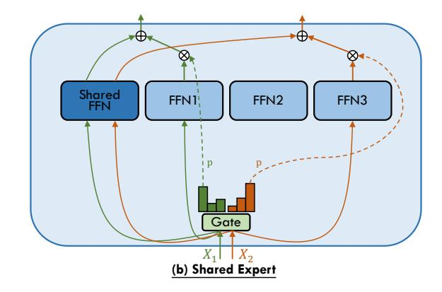
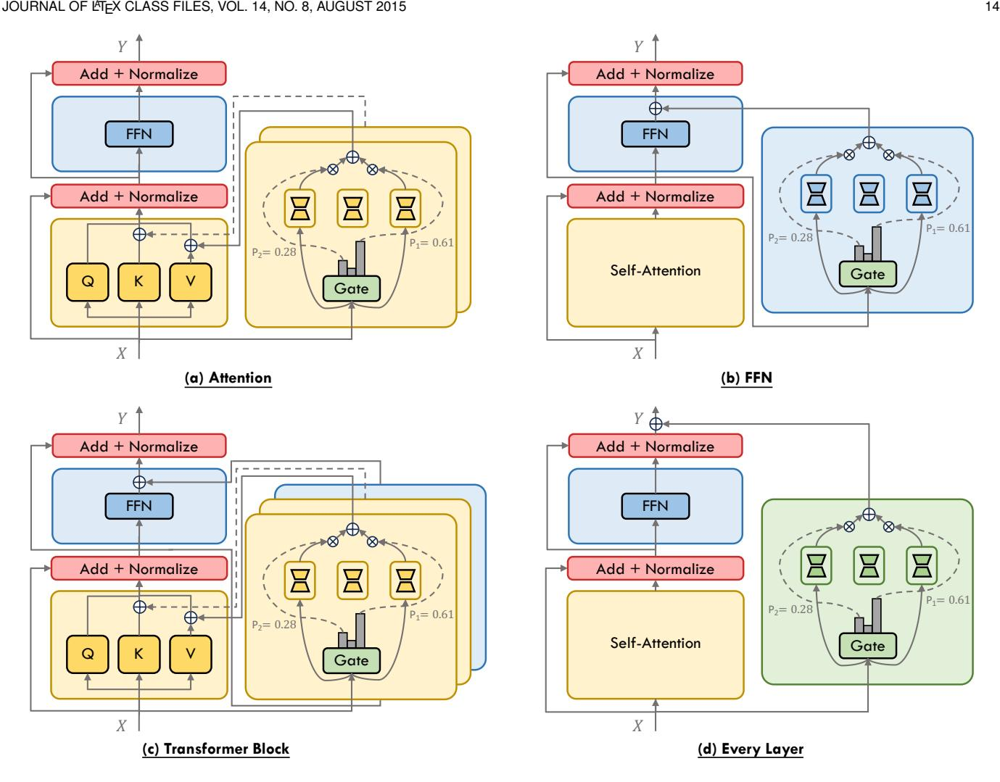

# **4.2 Experts**

In this section, we delineate the architecture of expert networks within MoE framework, following our discussion on the gating function that orchestrates the activation of these experts.

#### *4.2.1 Network Types*

Since the initial integration of MoE into transformer architectures [\[25\]](#page-23-23), [\[34\]](#page-23-32), [\[35\]](#page-23-33), MoE has served as a substitute for Feed-Forward Network (FFN) modules within these models. Typically, each expert within a MoE layer replicates the architecture of the FFN it replaces. This paradigm, wherein FFNs are utilized as experts, remains predominant, and subsequent refinements will be expounded upon in Sections [4.2.2](#page-9-1) to [4.2.4.](#page-11-0)

**Feed-Forward Network.** As discussed in existing work [\[52\]](#page-24-6), the predilection for leveraging MoE in the context of FFNs is rooted in the hypothesis that self-attention layers exhibit lower sparsity and less domain specificity than FFN layers. Pan *et al.* [\[62\]](#page-24-16) provide empirical support for this, revealing marked sparsity in FFN layers compared to self-attention layers, through their analysis of downstream Wikitext tasks using their pretrained DS-MoE models. Their results indicate a mere 20% active expert engagement in FFN layers, in contrast to the 80% observed within selfattention layers. In earlier investigation of FFN computational patterns, Zhang *et al.* [\[48\]](#page-24-2) and Li *et al.* [\[170\]](#page-27-0) observe that most inputs only activate a small proportion of neurons of FFNs, highlighting the inherent sparsity of FFNs. Subsequently, Zhang *et al.* [\[96\]](#page-25-12) observe the Emergent Modularity (EM) phenomenon within pretrained Transformers, revealing a significant correlation between neuron activation and specific tasks (evidenced by the functional specialization of neurons and function-based neuron grouping). This discovery supports the proposition that the MoE structure reflects the modularity of pre-trained Transformers.

**Attention.** While the focus of MoE research has predominantly been on FFN layers within the Transformer architecture, Zhang *et al.* [\[80\]](#page-24-34) introduce the Mixture of Attention Heads (MoA), an innovative architecture that combines multi-head attention layers with MoE to further enhance performance and restrain computational cost. As delineated in Figure [5](#page-9-0) (a), MoA employs two sets of experts, one for query projection and one for output projection. Both sets select the experts with the same indices through a common gating network. To reduce computational complexity, MoA shares the key (Wk) and value (Wv) projection weights

Fig. 5. The illustration of Mixture of Attention Heads [80] (a) and Shared Expert [64] (b) architectures.

across attention experts, with experts differentiated only by their respective query  $(q_tW_i^q)$  and output  $(o_{i,t}W_i^o)$  projection weights, allowing for shared pre-computation of key  $(KW_k)$  and value  $(VW_v)$  sequences. Subsequent work such as DS-MoE [62], JetMoE [81], and ModuleFormer [71] follows the design of MoA and further refines the combination of MoE and attention layer.

Others. In addition to the aforementioned expert network types, researchers have explored the use of Convolutional Neural Network (CNN) as expert [97], [98], [99], [100], [171]. Moreover, recent endeavors that integrate Parameter-Efficient Fine-Tuning (PEFT) techniques with MoE, such as employing Low-Rank Adaptation (LoRA) [172] as expert, have shown promising results, which are discussed in Section 4.3.

## 4.2.2 Hyperparameters

The scale of sparse MoE models is governed by several critical hyperparameters that extend beyond those of dense transformer models. These include (1) the count of experts per MoE layer, (2) the size of each expert, and (3) the placement frequency of MoE layers throughout the model. The selection of these hyperparameters is crucial, as it profoundly influences model performance and computational efficiency across various tasks. Optimal hyperparameter choices are thus contingent upon the specific application requirements and the constraints of the computational infrastructure. Our subsequent analysis, informed by the exemplified models listed in Table 2, explores these hyperparameter decisions in depth. Meanwhile, we enumerate some recent open-source models, summarizing their number of parameters and benchmark performance in Table 3.

Expert Count. Initial investigations employing thousands of experts per layer yielded impressive gains in pre-training and translation quality [24], [25], [34]. Nonetheless, the quality of sparse MoE models is disproportionately reduced under domain shift [101] or when fine-tuning on diverse task distributions [34]. GLaM [33] adopts a configuration of 64 experts, guided by their findings that a 64-expert setup with top-2 gating strikes an optimal balance between execution efficiency and performance across zero-shot, one-shot, and few-shot scenarios. Reflecting this trend, more recent sparse MoE models [26], [28], [35], [36], [65], [66], [82], [102] commonly utilize no more than 64 experts. Additionally, DeepSpeed-MoE [64] adopts a Pyramid-MoE

approach, positioning MoE layers with a larger expert count towards the network's end.

**Expert Size.** To scale the model effectively, GLaM [33] prioritizes the expansion of the intermediate hidden dimension per expert while standardizing the expert count at 64, a strategy that often requires the implementation of tensor parallelism across multiple accelerators to maintain computational efficiency [33], [34], [64]. From this period forward, MoE models [26], [28], [35], [65] typically featured larger expert dimensions. Differently, DeepSeekMoE [30], [67] introduces the concept of fine-grained expert segmentation by subdividing the intermediate hidden dimension of FFN expert, while preserving the overall parameter count. Specifically, DeepSeekMoE-145B employs a reduced intermediate hidden dimension at one-eighth that of its dense FFN counterpart, increasing both the number of experts (from 16 to 128) and the number of active experts (from top-2 to top-16) by a factor of eight. They believe that this strategy not only refines the decomposition of knowledge across experts, facilitating more precise learning, but also enhances the flexibility of expert activation combinations, allowing for more specialized and targeted knowledge capture. Qwen1.5-MoE [102] and DBRX [28] adopt a similar fine-grained expert segmentation strategy. Results from LLAMA-MoE [49], which allocates dense FFN parameters across non-overlapping experts to maintain a consistent parameter count, indicate that activating 4 out of 16 experts with a dimensionality of  $d_{expert} = 688$  marginally outperforms the activation of 2 out of 8 experts with  $d_{expert} = 1376$ . Furthermore, Parameter Efficient Expert Retrieval (PEER) [103], an innovative layer design employing the product key technique [175] for sparse retrieval from a vast pool of tiny experts (over a million single-neuron experts), surpasses dense FFNs and coarsegrained MoEs in terms of performance-compute trade-off on language modeling tasks.

Frequency of MoE Layers. Sparse MoE models typically evolve from dense architectures by interspersing MoE layers in place of the dense FFN layers at regular intervals. Although a higher frequency of MoE layers can enlarge the model size, it also introduces greater system overhead. In practice, most MoE models features alternate FFN replacement (1/2) with MoE layers [25], [33], [64], [101]. Nevertheless, variations exist, with some models incorporating MoE layers every fourth layer (1/4) [35], [36] or in every layer (1/1) [34], [67]. Following the introduction of Mixtral 8x7B

TABLE 2

Comparative configurations of MoE with FFN experts in selected models. Model differentiation in each reference is achieved by using the model size, indicated either by total or activated/total parameter count. Both activated and total expert counts encompass the count of shared experts when utilized.  $d_{model}$  is the hidden size,  $d_{ffn}$  is the intermediate size of FFNs,  $d_{expert}$  is the intermediate size of FFN experts, #L is the number of layers, #H and  $d_{head}$  are the number of attention heads and attention head dimensions.

| Reference                   | Models      | Expert Count (Activ./Total) | $d_{model}$ | $d_{ffn}$    | $d_{expert}$         | #L | #H  | $d_{head}$ | Placement Frequency      | Activation Function | Share Expert Count |
|-----------------------------|-------------|--------------------------------|-------------|--------------|----------------------|----|-----|------------|-----------------------------|------------------------|-----------------------|
|                             | 600B        | 2/2048                         | 1024        | 8192         | $d_{ffn}$            | 36 | 16  | 128        | 1/2                         | ReLU                   | 0                     |
| GShard [25] (2020)       | 200B        | 2/2048                         | 1024        | 8192         | $d_{ffn}$            | 12 | 16  | 128        | 1/2                         | ReLU                   | 0                     |
|                             | 150B        | 2/512                          | 1024        | 8192         | $d_{ffn}$            | 36 | 16  | 128        | 1/2                         | ReLU                   | 0                     |
|                             | 37B         | 2/128                          | 1024        | 8192         | $d_{ffn}$            | 36 | 16  | 128        | 1/2                         | ReLU                   | 0                     |
|                             | 7B          | 1/128                          | 768         | 2048         | $d_{ffn}$            | 12 | 12  | 64         | 1/2                         | GEGLU                  | 0                     |
| Switch [34]                 | 26B         | 1/128                          | 1024        | 2816         | $d_{ffn}$            | 24 | 16  | 64         | 1/2                         | GEGLU                  | 0                     |
| (2021)                      | 395B        | 1/64                           | 4096        | 10240        | $d_{ffn}$            | 24 | 64  | 64         | 1/2                         | GEGLU                  | 0                     |
|                             | 1571B       | 1/2048                         | 2080        | 6144         | $d_{ffn}$            | 15 | 32  | 64         | 1                           | ReLU                   | 0                     |
|                             | 0.1B/1.9B   | 2/64                           | 768         | 3072         | $d_{ffn}$            | 12 | 12  | 64         | 1/2                         | GEGLU                  | 0                     |
| GLaM [33]                   | 1.7B/27B    | 2/64                           | 2048        | 8192         | $d_{ffn}$            | 24 | 16  | 128        | 1/2                         | GEGLU                  | 0                     |
| (2021)                      | 8B/143B     | 2/64                           | 4096        | 16384        | $d_{ffn}$            | 32 | 32  | 128        | 1/2                         | GEGLU                  | 0                     |
|                             | 64B/1.2T    | 2/64                           | 8192        | 32768        | $d_{ffn}$            | 64 | 128 | 128        | 1/2                         | GEGLU                  | 0                     |
|                             | 350M/13B    | 2/128                          | 1024        | $4d_{model}$ | $d_{ffn}$            | 24 | 16  | 64         | 1/2                         | GeLU                   | 0                     |
| DeepSpeed-MoE [64]          | 1.3B/52B    | 2/128                          | 2048        | $4d_{model}$ | $d_{ffn}$            | 24 | 16  | 128        | 1/2                         | GeLU                   | 0                     |
| (2022)                      | PR-350M/4B  | 2/32-2/64                      | 1024        | $4d_{model}$ | $d_{ffn}$            | 24 | 16  | 64         | 1/2, 10L-32E, 2L-64E        | GeLU                   | 1                     |
|                             | PR-1.3B/31B | 2/64-2/128                     | 2048        | $4d_{model}$ | $d_{ffn}$            | 24 | 16  | 128        | 1/2, 10L-64E, 2L-128E       | GeLU                   | 1                     |
| ST-MoE [35] (2022)       | 0.8B/4.1B   | 2/32                           | 1024        | 2816         | $d_{ffn}$            | 27 | 16  | 64         | 1/4, add extra FFN          | GEGLU                  | 0                     |
|                             | 32B/269B    | 2/64                           | 5120        | 20480        | $d_{ffn}$            | 27 | 64  | 128        | 1/4, add extra FFN          | GEGLU                  | 0                     |
| Mixtral [26] (2023)      | 13B/47B     | 2/8                            | 4096        | 14336        | $d_{ffn}$            | 32 | 32  | 128        | 1                           | SwiGLU                 | 0                     |
|                             | 39B/141B    | 2/8                            | 6144        | 16384        | $d_{ffn}$            | 56 | 48  | 128        | 1                           | SwiGLU                 | 0                     |
| LLAMA-MoE [49] (2023)    | 3.0B/6.7B   | 2/16                           | 4096        | 11008        | 688                  | 32 | 32  | 128        | 1                           | SwiGLU                 | 0                     |
|                             | 3.5B/6.7B   | 4/16                           | 4096        | 11008        | 688                  | 32 | 32  | 128        | 1                           | SwiGLU                 | 0                     |
|                             | 3.5B/6.7B   | 2/8                            | 4096        | 11008        | 1376                 | 32 | 32  | 128        | 1                           | SwiGLU                 | 0                     |
| DeepSeekMoE [67] (2024)  | 0.24B/1.89B | 8/64                           | 1280        | -            | $\frac{1}{4}d_{ffn}$ | 9  | 10  | 128        | 1                           | SwiGLU                 | 1                     |
|                             | 2.8B/16.4B  | 8/66                           | 2048        | 10944        | 1408                 | 28 | 16  | 128        | 1, except 1st layer         | SwiGLU                 | 2                     |
|                             | 22B/145B    | 16/132                         | 4096        | -            | $\frac{1}{8}d_{ffn}$ | 62 | 32  | 128        | 1, except 1st layer         | SwiGLU                 | 4                     |
| OpenMoE [36] (2024)      | 339M/650M   | 2/16                           | 768         | 3072         | $d_{ffn}$            | 12 | 12  | 64         | 1/4                         | SwiGLU                 | 1                     |
|                             | 2.6B/8.7B   | 2/32                           | 2048        | 8192         | $d_{ffn}$            | 24 | 24  | 128        | 1/6                         | SwiGLU                 | 1                     |
|                             | 6.8B/34B    | 2/32                           | 3072        | 12288        | $d_{ffn}$            | 32 | 24  | 128        | 1/4                         | SwiGLU                 | 1                     |
| Qwen1.5-MoE [102] (2024) | 2.7B/14.3B  | 8/64                           | 2048        | 5632         | 1408                 | 24 | 16  | 128        | 1                           | SwiGLU                 | 4                     |
| DBRX [28] (2024)         | 36B/132B    | 4/16                           | 6144        | 10752        | $d_{ffn}$            | 40 | 48  | 128        | 1                           | SwiGLU                 | 0                     |
| Jamba [66] (2024)        | 12B/52B     | 2/16                           | 4096        | 14336        | $d_{ffn}$            | 32 | 32  | 128        | 1/2, 1:7 Attention:Mamba | SwiGLU                 | 0                     |
| Skywork-MoE [65] (2024)  | 22B/146B    | 2/16                           | 4608        | 12288        | $d_{ffn}$            | 52 | 36  | 128        | 1                           | SwiGLU                 | 0                     |
| Yuan 2.0-M32 [82] (2024) | 3.7B/40B    | 2/32                           | 2048        | 8192         | $d_{ffn}$            | 24 | 16  | 256        | 1                           | SwiGLU                 | 0                     |
| OLMoE [173] (2024)       | 1.3B/6.9B   | 8/64                           | 2048        | 1024         | $d_{ffn}$            | 16 | 16  | 128        | 1                           | SwiGLU                 | 0                     |
| DeepSeek-V3 [174] (2024) | 37B/671B    | 9/257                          | 7168        | 18432        | 2048                 | 61 | 128 | 128        | 1, except first 3 layers    | SwiGLU                 | 1                     |

[26], the trend seems to shift towards placing MoE in every layer of the model, with a common choice of only 8 or 16 experts mirroring the dimensionality of a dense FFN [28], [65], [67], [102].

Research into the optimal configuration of MoE layers has been extensive. V-MoE [6] employs MoE in the last few even-numbered Transformer layers, noting that, despite using fewer MoE layers, the impact on performance is minimal while computational speed is significantly enhanced. DeepSeekMoE-16B/-145B [67] replaces all FFNs with MoE layers, excluding the first, due to the observed slower convergence of load balance status in the first layer. MoE-LLaVA [104], a recently popular open Large Vision-Language Model (LVLM), demonstrates that alternating MoE placement yields superior model quality and execu-

tion efficiency on multimodal tasks, compared to every-layer MoE placement or "First-Half" and "Second-Half" configurations. ST-MoE [35] found that adding a dense FFN adjacent to each MoE layer can improve model quality. Brainformers [93] introduce a nonuniform architecture that integrates MoE layers, dense FFNs, attention mechanisms, and a variety of layer normalizations and activation functions without strict sequential layering, trading architectural regularity for the flexibility of sub-layer composition. Jamba [66] integrates the architecture of Mamba [176] by adopting a 1:7 ratio of attention-to-Mamba layers.

#### 4.2.3 Activation Function

Building upon dense Transformer architectures, sparse MoE models have adopted a progression of activation functions

TABLE 3
A collection of recent open-source models detailing activated and total parameter counts, alongside performance benchmarks such as MMLU [177] (5-shot), GSM8K [178] (5-shot), MATH [179] (4-shot), and HumanEval [180] (0-shot), unless specified otherwise.

| N                     | m:          | Affiliation | Params. |       |      | Bench               | marks         |           |                                                            |
|-----------------------|-------------|-------------|---------|-------|------|---------------------|---------------|-----------|------------------------------------------------------------|
| Name                  | Name Time A |             | Activ.  | Total | MMLU | GSM8K               | MATH          | HumanEval | Link                                                       |
| Mixtral-8x7B-v0.1     | 2023.12     | Mistral     | 13B     | 47B   | 70.6 | 58.4, 74.4 (8-shot) | 28.4          | 40.2      | https://huggingface.co/mistralai/Mixtral-8x7B-v0.1         |
| DeepSeekMoE-16B-Base  | 2024.1      | DeepSeek    | 3B      | 16B   | 45.0 | 18.8 (8-shot)       | 4.3           | 26.8      | https://huggingface.co/deepseek-ai/deepseek-moe-16b-base   |
| Grok-1                | 2024.3      | xAI         | 86B     | 314B  | 73.0 | 62.9                | 23.9          | 63.2      | https://github.com/xai-org/grok-1                          |
| Qwen1.5-MoE-A2.7B     | 2024.3      | Alibaba     | 3B      | 14B   | 62.5 | 61.5 (8-shot)       | -             | 34.2      | https://huggingface.co/Qwen/Qwen1.5-MoE-A2.7B              |
| DBRX Instruct         | 2024.3      | Databricks  | 36B     | 132B  | 73.7 | 72.8                | -             | 70.1      | https://huggingface.co/databricks/dbrx-instruct            |
| Jamba-v0.1            | 2024.3      | AI21 Labs   | 12B     | 52B   | 67.4 | 59.9 (3-shot)       | -             | 29.3      | https://huggingface.co/ai21labs/Jamba-v0.1                 |
| Mistral-8x22B-v0.1    | 2024.4      | Mistral     | 39B     | 141B  | 77.8 | 78.6, 88.4 (8-shot) | 41.8          | 45.1      | https://huggingface.co/mistralai/Mixtral-8x22B-v0.1        |
| Arctic Instruct       | 2024.4      | Snowflake   | 17B     | 480B  | 67.3 | 74.2                | -             | -         | https://huggingface.co/Snowflake/snowflake-arctic-instruct |
| DeepSeek-V2           | 2024.5      | DeepSeek    | 21B     | 236B  | 78.5 | 79.2 (8-shot)       | 43.6          | 48.8      | https://huggingface.co/deepseek-ai/DeepSeek-V2             |
| DeepSeek-V2-Chat (RL) | 2024.5      | DeepSeek    | 21B     | 236B  | 77.8 | 92.2 (8-shot)       | 53.9          | 81.1      | https://huggingface.co/deepseek-ai/DeepSeek-V2-Chat        |
| Yuan 2.0-M32          | 2024.5      | IEIT        | 4B      | 40B   | 72.2 | 92.7 (8-shot)       | 55.9 (8-shot) | 74.4      | https://huggingface.co/IEITYuan/Yuan2-M32                  |
| Skywork-MoE-Base      | 2024.6      | Kunlun      | 22B     | 146B  | 77.4 | 76.1                | 31.9          | 43.9      | https://huggingface.co/Skywork/Skywork-MoE-Base            |
| OLMoE-0924-Base       | 2024.9      | Ai2         | 1.3B    | 6.9B  | 54.1 | 3.0 (8-shot)        | -             | 22.4      | https://huggingface.co/allenai/OLMoE-1B-7B-0924            |
| DeepSeek-V3-Base      | 2024.12     | DeepSeek    | 37B     | 671B  | 87.1 | 89.3 (8-shot)       | 61.6          | 65.2      | https://huggingface.co/deepseek-ai/DeepSeek-V3-Base        |

paralleling those in leading dense large language models, including BERT [181], T5 [169], GPT [2], LLAMA [159] and so on. The evolution of activation functions has seen a shift from ReLU [105] to more advanced options such as GeLU [106], GeGLU [107], and SwiGLU [107]. This trend extends to other components of MoE models, which now frequently incorporate Root Mean Square Layer Normalization (RM-SNorm) [182], Grouped Query Attention (GQA) [183], and Rotary Position Embeddings (RoPE) [184].

#### 4.2.4 Shared Expert

DeepSpeed-MoE [64] innovatively introduces the Residual-MoE architecture, wherein each token is processed by a fixed expert and another selected through gating, achieving two experts engagement per layer without increasing the communication cost beyond that of top-1 gating. This approach considers the gating-selected MoE expert as an error-correcting adjunct to the fixed dense FFN. A conceptually similar approach, Conditional MoE Routing (CMR), is employed in NLLB [76], which also combines the outputs of dense FFN and MoE layers. This paradigm of integrating fixed FFN with sparse MoE, often referred to as shared expert and illustrated in Figure 5 (b), has gained traction in recent language models such as DeepSeekMoE [67], Open-MoE [36], Qwen1.5-MoE [102], and MoCLE [44], indicating its ascension to a mainstream configuration. Instead of using a single shared expert, DeepSeekMoE [67] and Qwen1.5-MoE [102] employ multiple shared experts, due to their fine-grained expert segmentation design. He et al. [109] introduce Partially Dynamic Networks (PAD-Net), iteratively transforming partial parameters of gating-selected experts into static parameters (akin to shared experts) based on their impact on loss values. Zhao et al. [110] introduce HyperMoE, an innovative MoE framework that integrates expert-shared and layer-shared hypernetwork to effectively capture cross-expert and cross-layer information. Additionally, based on the design of shared expert, ScMoE [108] decouples the MoE process to separately handle the representations from preceding layers and integrate them with the outputs processed by the shared expert of the current layer, thus improving efficiency by facilitating overlap in communication and computation. A comparable method to

enhance overlapping is employed in the Dense-MoE hybrid transformer architecture, as delineated in Snowflake Arctic [29], which bears resemblance to the LoRA MoE framework discussed in Section 4.3.3 and illustrated in Figure 6 (d).

#### 4.3 Mixture of Parameter-Efficient Experts

LLMs pretrained on generic massive datasets have demonstrated impressive abilities, enabling their deployment across diverse tasks [116]. However, to tailor a pretrained LLM for a specific downstream task, fine-tuning is essential. Traditional full fine-tuning, which updates all the parameters of the base model, is computationally intensive, especially as model sizes continue to grow [185]. To address this issue, research into parameter-efficient fine-tuning (PEFT) has emerged, intending to reduce computational demands during the adaptation of a generic pretrained model to particular tasks [186]. PEFT methods only update a small set of parameters while maintaining the rest of the base model untouched [187]. As an example of PEFT, LoRA [172] introduces two low-rank matrices to receive incremental updates associated with the task-specific fine-tuning. Only the LoRA matrices are updated while the base model is kept untouched during fine-tuning. These techniques have achieved state-of-the-art performance across numerous NLP tasks [172], [188].

Despite these successes, PEFT approaches often struggle with generalizing across multiple tasks due to their limited scope of trainable parameters and the potential for catastrophic forgetting [112]. To mitigate these limitations, a line of mixture of parameter-efficient experts (MoPE) research has emerged, focusing on integrating the MoE framework with PEFT [112], [117]. MoPE incorporates the MoE's gating mechanism and multi-expert architecture, but with each expert constructed using PEFT techniques [189]. The subtle combination boosts PEFT's performance under the multi-task scenario [114]. Additionally, by leveraging PEFT for constructing experts, MoPE operates with fewer parameters, achieving greater resource efficiency compared to traditional MoE models [40].

MoPE harnesses the best of both fields: the task versatility of MoE and the resource efficiency of PEFT [112], positioning it as a promising area of study that pushes the

boundaries of both fields. In the following subsection, we will give a taxonomy of MoPE, as depicted in Figure 6, based on their placement within the Transformer model architecture. We will then review recent MoPE research, summarizing the methodologies and contributions.

#### 4.3.1 Feed-Forward Network

Following the conventional MoE structure, a series of investigations introduce the MoPE framework to the FFN layer of every Transformer block. During the training process, the focus is on optimizing the parameter-efficient experts and the gating mechanism, leaving the rest of the pretrained model intact. As illustrated in Figure 6(b), the forward process under the MoPE framework integrated with FFN can be expressed as:

$$FFN^{MoE}(\mathbf{x}') = FFN(\mathbf{x}') + \sum_{i=1}^{n} \mathbf{x}' \Delta \mathbf{W}_{i}^{ffn} \cdot G^{ffn}(\mathbf{x}')_{i},$$
(12)

$$\mathbf{x}' = \text{LayerNorm}(SA(\mathbf{x}) + \mathbf{x}),$$
 (13)

where  $\Delta \mathbf{W}^{ffn}$  and  $G^{ffn}(\mathbf{x})$  is the parameter-efficient expert and gating function applied to the FFN layer, respectively

One of the pioneering studies in this domain, LoRAMoE [43], efficiently applies the MoPE structure to FFN. Lo-RAMoE integrates a few plug-in LoRA experts into the FFN layer, employing a gating mechanism to orchestrate the experts' contributions. Realizing the diversity in data distributions, LoRAMoE separates the experts into two distinct groups: one focuses on learning various downstream tasks, and the other is dedicated to aligning pretrained world knowledge with human instructions. To ensure that each group of experts maintains its focus, LoRAMoE defines a localized balancing constraint loss, which preserves the importance of each expert within its group while allowing different groups to concentrate on their respective tasks. This design enables LoRAMoE to effectively resolve the knowledge forgetting issue and enhance model performance on downstream tasks. In a similar vein, AdaMix [42] injects a set of Adapter [190] experts after the FFN layer in each Transformer block. Adapter tuning is a PEFT method that integrates a pair of feed-forward up and down projection matrices into the Transformer block. During fine-tuning, only the incremental Adapter blocks are updated, with the rest of the model unchanged. AdaMix utilizes a stochastic routing policy that randomly selects the projection matrices during training, maintaining computational costs equivalent to a single adapter. To minimize service costs during inference, AdaMix averages the outputs of all the experts.

Taking a different approach, MixDA [111] includes two training stages to leverage domain-specific knowledge while preserving learned information. During the first stage, MixDA only fine-tunes the domain-adapters that work in parallel with the FFN to acquire domain-specific knowledge while simultaneously retaining the world knowledge. In the second stage, MixDA introduces a gating network and task-adapters on top of the FFN layer for tailoring the model to specific downstream tasks. This strategy allows for a more nuanced adaptation to the task at hand. LLaVA-MoLE [113] extends the application of MoPE to multimodal tasks. It

creates a set of LoRA experts for the FFN layer to handle inputs from different domains, enhancing the model's versatility. LLaVA-MoLE adopts a top-1 routing strategy, activating the most relevant expert based on the router's output distribution, thus maintaining computational costs close to a standard FFN with LoRA. This framework is effective in addressing data conflicts and consistently surpasses plain-LoRA baselines across diverse data configurations.

Contrasting with the MoPE implementations we have discussed, MixLoRA [112] creates a LoRA-MoE framework that closely aligns with the conventional MoE models. Rather than just plugging in multiple lightweight experts, MixLoRA fuses LoRA experts with the shared FFN layer. By leveraging the base weights from a single FFN of the base model, MixLoRA streamlines the creation of the MoPE architecture. Furthermore, MixLoRA implements a high-throughput framework that significantly reduces token computation latency and memory usage during both training and inference, optimizing performance and efficiency.

#### 4.3.2 Attention

A branch of research has been exploring the application of the MoPE framework with the attention mechanism. These studies typically involve augmenting the attention mechanism by incorporating a gating network and a set of parallel experts. The MoPE framework can be applied to the Query, Key, Value, and Output projection modules, individually or in various combinations, within the attention mechanism. During the fine-tuning process, only the parameters of the activated experts and the gating network are updated, while the remaining parameters of the model are kept frozen. For example, as shown in Figure 6(a), the integration of MoPE with the Key and Value module of the attention mechanism can be formalized as follows:

$$SA^{MoE}(\mathbf{x}) = Softmax(\frac{\mathbf{Q}(\mathbf{K}^{T} + \sum_{i=1}^{n} \mathbf{x} \Delta \mathbf{W}_{i}^{k} \cdot G^{k}(\mathbf{x})_{i})}{\sqrt{d_{head}}})$$
$$(\mathbf{V} + \sum_{i=1}^{n} \mathbf{x} \Delta \mathbf{W}_{i}^{v} \cdot G^{v}(\mathbf{x})_{i}),$$
(14)

where  $\mathbf{Q}, \mathbf{K}, \mathbf{V}$  represents the Query, Key and Value modules, respectively.  $\Delta \mathbf{W}^k$  and  $G^k(\mathbf{x})$  denote the parameter-efficient expert and its corresponding gating function for the Key module. Similarly,  $\Delta \mathbf{W}^v$  and  $G^v(\mathbf{x})$  indicate the expert and the gating function for the Value module. Here, n is the number of experts, and  $d_{head}$  is the dimensions in the Multi-head Attention mechanism.

Recent studies have demonstrated the effectiveness of extending MoE to the attention layer [71], [80], [81]. Additionally, there is a new line of research has focused on the fusion of MoPE with the attention mechanism to enhance the model's efficiency and adaptability. For instance, MoELoRA [45] applies MoE to the attention mechanism in a resource-efficient manner by leveraging LoRA [172] to construct the experts. Specifically, MoELoRA sets multiple LoRA experts to the Query and Value matrices of the attention mechanism, and utilizes a gating network to activate the top-k experts related to the specific tasks during both training and inference phases. To alleviate routing randomness, MoELoRA employs a contrastive learning loss

Fig. 6. The illustration of the taxonomy of MoPEs based placement within the Transformer model architecture. (a) exemplifies the integration of MoPE with the Key and Value modules of the attention mechanism, with applicability extending to Query and Output projection modules. (b) represents the application of MoPE to the FFN. (c) refers to the MoPE integration at the level of the Transformer block, wherein two distinct groups of experts are applied to attention and FFN, where separate sets of experts are allocated to both attention and FFN, each regulated by its own gating mechanism. (d) illustrates a layer-wise integration of MoPE, in which each Transformer layer is regarded as a unified entity with a gating orchestrating the interplay among experts.

to control the training of experts. The contrastive learning loss is designed to accentuate the differences in output distributions between experts, thereby encouraging them to capture diverse features relevant to the downstream tasks. MoELoRA offers a solution for flexibly combining various computational modules tailored to downstream tasks.

Another framework, MoCLE [\[44\]](#page-23-42), aims to resolve task conflicts that arise from the diversity of training tasks of different sources and formats. MoCLE utilizes a clustering model to categorize different tasks and then leverages a router to direct the clustered input to LoRA experts inserted into the Query and Value modules of the attention mechanism. These LoRA experts contain a group of multiple task experts and a universal expert. Each task expert is dedicated to a particular task to reduce task conflicts, while the universal expert, trained on all tasks, helps to maintain model generalization. SiRA [\[114\]](#page-25-29) introduces several lightweight LoRA adapters as experts, along with a top-k gating mechanism. To mitigate load imbalance and over-fitting issues, SiRA incorporates a capacity constraint that limits the number of tokens each expert can process. Additionally, it employs an auxiliary loss to promote load balancing and an expert dropout mechanism to equalize the gating distribution. SiRA provides an efficient and finegrained approach to improving the quality of LoRA.

