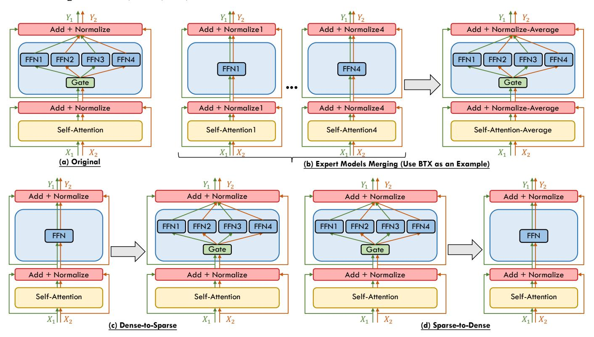

# *4.3.3 Transformer Block*

The integration of MoPE with the Transformer architecture has received substantial attention in recent research. This approach involves creating two groups of experts: one for the attention mechanism, and another for the FFN within the Transformer block. Each group is regulated by its gating mechanism to control the activation of the experts. As exhibited in Figure [6\(](#page-13-1)c), the forward process under the MoPE framework integrated with the Transformer block can be denoted as:

$$y = \text{LayerNorm}(\mathbf{x}' + \text{FFN}^{MoE}(\mathbf{x}')),$$
 (15)

$$\mathbf{x}' = \text{LayerNorm}(SA^{MoE}(\mathbf{x}) + \mathbf{x}).$$
 (16)

MoV [40] is one of the notable attempts that combine MoPE with the Transformer block to pursue parameter efficiency. Utilizing the PEFT method, (IA)3 [188], MoV introduces tunable vectors that re-scale the Key and Value modules in the attention mechanism, as well as the activation within the FFN. By substituting conventional experts with (IA)3 vectors and updating only these lightweight experts and their corresponding gating during fine-tuning, MoV significantly reduces the computational burden associated with gradient calculations and lessens the memory footprint required for model storage. Similarly, MoLORA [40] employs multiple LoRA experts to the attention and FFN blocks, outperforming the standard LoRA approach. UniPELT [115] proposed a hybrid framework that integrates three representative PEFT methods as experts, namely Adapter [190], Prefixtuning [191], and LoRA [172]. Prefix-tuning is a method that freezes the base model and optimizes the continuous task-specific vectors prepended to the input of the attention. Within the UniPELT framework, LoRA matrices are applied to the weight matrices of Query and Key in the attention mechanism, Prefix vectors are added to the Key and Value modules, and the Adapter block is inserted after the FFN layer. UniPELT leverages different gating mechanisms to dynamically activate the experts, efficiently finding the approaches that best suit the given task.

Further broadening the scope of the LoRA-MoE framework, Omni-SMoLA [41] extends the MoPE with three sets of LoRA experts, each tailored to handle text tokens, visual tokens, and multimodal tokens, respectively. The specialization enables the architecture to enhance performance across various vision-and-language tasks. In the context of MoPE research, the number of experts emerges as a critical hyperparameter influencing downstream task performance [40], [46]. Additionally, the use of many experts may lead to redundancy [192]. MoLA [116] is one of the pioneering work that explores the expert allocation issue. It proposes a LoRA-MoE framework with a Layer-wise Expert Allocation, which enables the flexible employment of varying numbers of experts across different layers. The expert allocation strategy proposed by MoLA further improves the effectiveness of the LoRA-MoE framework. In the specialized field of medical applications, MOELoRA [117] tackles the challenges of task variety and high adaptation cost. It integrates LoRA experts and task-motivated gate functions into the attention and FFN of each layer. The gating utilizes task identity to modulate expert contributions, creating unique parameter sets tailored to individual tasks. The design of MOELoRA combines the strengths of both MoE and LoRA, strengthening LLM's capability in medical domains. Liu et al. [118] design a novel framework, named Intuition-MoR1E, which leverages the inherent semantic clustering of instances to emulate cognitive processes in the human brain for multitasking purposes. This framework provides implicit guidance to the gating mechanism, thereby enhancing feature allocation. Furthermore, they introduce a cutting-edge rank-1 expert architecture. This architecture advances beyond the conventional 1-1 mapping of two weight matrices  $W_{up}^{i}$  and  $W_{down}^{i}$  in LoRA expert composition, facilitating a flexible combination of any  $W_{up}^i$  with any  $W_{down}^j$  to form an expert. They implement MoE in the transformer blocks, specifically

targeting the Query, Key, Value, and FFN modules. Xu *et al.* [119] present Multiple-Tasks Embedded LoRA (MeteoRA), a scalable and efficient framework that embeds multiple task-specific LoRA adapters into the base LLM using a full-mode MoE architecture. This framework incorporates custom GPU kernel operators to accelerate LoRA computation while maintaining memory overhead.

#### 4.3.4 Every Layer

There has been considerable interest in incorporating MoPE into fundamental components such as the attention, FFN, and Transformer block. Existing work often approaches the attention mechanism and FFN independently, employing distinct gating mechanisms to modulate them separately. Rather than treating these elements isolated, there is a new direction that considers the Transformer layer as an integrated whole. This shift in perspective allows for the application of the MoPE framework to the entire Transformer layer, capturing the combined dynamics of the attention and FFN within a unified approach. As illustrated in Figure 6(d), the forward process under the MoPE framework integrated with every layer is as follows:

$$y = \text{LayerNorm}(\mathbf{x}' + \text{FFN}(\mathbf{x}')) + \sum_{i=1}^{n} \mathbf{x} \Delta \mathbf{W}_{i}^{layer} \cdot G^{layer}(\mathbf{x})_{i},$$
(17)

$$\mathbf{x}' = \text{LayerNorm}(SA(\mathbf{x}) + \mathbf{x}),$$
 (18)

where  $\Delta \mathbf{W}^{layer}$  and  $G^{layer}(\mathbf{x})$  is the parameter-efficient expert and gating function applied to the entire layer, respectively.

In this context, the approach presented by MoLE [46] provides innovative insights. MoLE identifies that various layers within LoRA exhibit unique features. In response to this finding, MoLE pursues to enhance the composition effect of trained LoRAs by dynamically adjusting the layer-specific weights according to the desired objective. This is achieved by integrating a set of trained LoRAs and a gating function into each layer. MoLE treats each layer of trained LoRAs as an individual expert and only trains the gating to learn the optimal composition weights for a specified domain. This dynamic linear composition strategy significantly extends the versatility of LoRA, enabling its application across a broader spectrum of practical scenarios.

#### 4.4 Training & Inference Scheme

The architectural advancements of Mixture-of-Experts (MoE) models have been complemented by extensive research into training and inference schemes, with the objective of optimizing both computational efficiency and model quality.

Original Training & Inference Scheme. Initial training methodologies, as established in seminal works [6], [24], [25], [34], [35], involve constructing an MoE model and training it from scratch, with inference directly following the model configurations of training.

The advent of MoE models has introduced novel paradigms for training and inference, enabling a flexible approach that synergizes the strengths of dense and sparse models while mitigating their respective weaknesses. As depicted in Figure [7,](#page-16-0) we divide the emerging schemes into three distinct categories: Dense-to-Sparse, which entails initiating with dense model training and progressively transitioning to a sparse MoE configuration [\[47\]](#page-24-1), [\[60\]](#page-24-14), [\[62\]](#page-24-16), [\[65\]](#page-24-19), [\[104\]](#page-25-19), [\[120\]](#page-25-35), [\[121\]](#page-25-36), [\[122\]](#page-25-37); Sparse-to-Dense, which involves degrading a sparse MoE model to a dense form that is more conducive to hardware implementation for inference [\[50\]](#page-24-4), [\[51\]](#page-24-5), [\[125\]](#page-25-40); and Expert Models Merging, a process of integrating multiple pretrained dense expert models into a unified MoE model [\[52\]](#page-24-6), [\[127\]](#page-25-42), [\[128\]](#page-26-11).

### *4.4.1 Dense-to-Sparse*

To mitigate the training overhead associated with vision MoE transformer models, the Residual Mixture-of-Experts (RMoE) approach [\[120\]](#page-25-35) commences with training a dense, non-MoE model on the upstream task, followed by an efficient fine-tuning stage to transition into a MoE model. This process reveals that directly inheriting expert weights from a pretrained non-MoE model's FFN can lead to suboptimal performance, necessitating an alignment between the MoE and FFN outputs during the fine-tuning phase. Similarly, Dua *et al.* [\[121\]](#page-25-36) advocate for initially training a dense model, subsequently introducing sparsity by incorporating a randomly initialized gating module, and further training the model's feed-forward layers under sparsity conditions—specifically, by updating the weights locally within each compute node rather than averaging gradients across nodes.

Nie *et al.* [\[60\]](#page-24-14) present EvoMoE, an efficient end-to-end MoE training framework. EvoMoE decouples the joint learning of experts and the sparse gate, emphasizing the acquisition of foundational knowledge through a single expert at the inception of training. Subsequently, it spawns multiple diverse experts and advances the diversification of experts by training with the novel Dense-to-Sparse gate (DTS-Gate). The DTS-Gate initially operates as a dense activation of all experts, then progressively and adaptively constricting to route tokens to a reduced number of experts. A similar strategy is employed in the development of the MoE-LLaVA [\[104\]](#page-25-19) large vision-language model, which commences with a dense model, subsequently multiplies the feed-forward network (FFN) to create expert initializations, and proceeds to train exclusively the MoE layers, while keeping the remaining model components static.

Komatsuzaki *et al.* [\[47\]](#page-24-1) highlight the efficiency of sparse models in terms of quality and computational cost, yet acknowledge their significant data requirements and the expense of training from scratch at scale. To address this, they introduce a scheme termed "sparse upcycling," which leverages pre-existing training investments by initializing a sparsely activated MoE model from a pretrained dense checkpoint. This involves transferring all parameters—and optionally their associated optimizer states—from the original checkpoint, with the exception of the MoE gating network parameters, which are not present in the dense model. Notably, the new MoE layers are populated with identical copies of the original dense model's FFN layers, and the gating mechanism weights are initialized randomly. A critical obstacle in model upcycling is the initial performance decrease resulting from structural modifications to a trained network. To mitigate this performance regression

during upcycling, the researchers propose normalizing the gating scores for each input token to 1, which are used to combine the outputs of multiple experts. This approach is grounded in the notion that, in the dense model, each token was processed by a singular "expert" FFN. While this normalization proved beneficial for upcycled vision models, it was found to be detrimental to the performance of upcycled language models. In the first introduction of sparse MoE by [\[24\]](#page-23-22), the softmax function was applied to the selected top-k gating values, which normalizes the combination gating scores to 1, formulated as softmax(TopK(g(x; Θ), k)). However, subsequent LLMs [\[25\]](#page-23-23), [\[34\]](#page-23-32), [\[36\]](#page-23-34) with MoE have evolved to apply the softmax function across all potential gating values before isolating the top-k subset, formulated as TopK(softmax(g(x; Θ)), k).

Building upon the sparse upcycling technique [\[47\]](#page-24-1), the Skywork-MoE model [\[65\]](#page-24-19) leverages the foundational architecture of its pre-developed Skywork-13B model [\[193\]](#page-27-23), adopting its dense checkpoints as a foundation for initial states. Their empirical evidence indicates that the decision between sparse upcycling and training from scratch should be informed by both the performance of available dense checkpoints and the MoE-specific training resources, as models trained from scratch consistently surpass their upcycled counterparts in performance. The study observes a decline in average expert similarity throughout the training of upcycled MoEs, suggesting a diversification of experts emerges during the process. Importantly, the Skywork-MoE analysis reveals that models with greater expert similarity tend to underperform, establishing expert similarity as a potential diagnostic tool during MoE training for upcycled models. Conversely, the expert similarity in models trained from scratch remains minimal, implying that non-uniform expert initialization promotes diversification.

Pan *et al.* [\[62\]](#page-24-16) posit that the parameter inefficiency observed in MoE models stems from conventional sparse training methodologies, where only a selected group of experts is engaged and refined for each input token. To counteract this, they introduce a hybrid framework for MoE models, denoted as DS-MoE, which integrates dense training (activating all the experts) with sparse inference (sparse expert activation) to achieve higher computation and parameter efficiency. Notably, DS-MoE maintains activation for all self-attention experts (MoA [\[80\]](#page-24-34)) during inference but selectively activates FFN experts, reflecting the observation that self-attention layers manifest considerably less sparsity compared to FFN layers.

Chen *et al.* [\[122\]](#page-25-37) introduce SMoE-Dropout, an innovative plug-and-play training framework, which initially modularizes the FFN into a sequence of smaller FFNs then employs a random policy parameterized by fixed weights to route token to k experts with the largest response. Progressively, the framework activates an increasing number of experts, preventing overfitting to the amounts of used network capacity during training. MoEfication [\[48\]](#page-24-2) investigates various strategies for expert construction in T5 models, including random splitting, parameter clustering, and building co-activation graphs. MoEBERT [\[123\]](#page-25-38) implements an importance-based method for adapting FFNs into experts within BERT models. LLaMA-MoE [\[49\]](#page-24-3) conducts an extensive examination of different expert construction

Fig. 7. Schematic representation of training and inference schemes related to MoE. It provides an abstracted view of model transition, without focusing specific model states during training or inference. Subfigure (a) depicts the original scheme without architectural transformation. Subfigure (b) depicts the merging of distinct expert models, exemplified by BTX [52]. Subfigure (c) depicts the transition from a dense model to a sparse model. Subfigure (d) depicts the inverse process, where a sparse model is converted to a dense model.

methods, ultimately proposing a straightforward random division approach that partitions the parameters of FFNs into non-overlapping experts. Emergent MoEs (EMoE) [124] splits certain FFN layers of the original model into MoE layers with clustering-based experts construction and avg-k gating, which ameliorates the parameter updating during fine-tuning and can even be abandoned afterward to preserve the original model architecture.

#### 4.4.2 Sparse-to-Dense

Switch Transformer [34] studies the distillation of large sparse models into smaller dense counterparts to achieve parameter efficiency for deployment. The study reports that initializing the corresponding weights of dense model from non-expert layers of MoE model modestly enhances performance, facilitated by the consistent dimension of nonexpert layers. Furthermore, an improvement in distillation is observed when employing a mixture of 0.25 for the teacher probabilities and 0.75 for the ground truth label. Leveraging both methods, the distillation preserves approximately 30% of the sparse model's quality gains using only about 5% of the parameters. Similarly, Xue et al. [50] address the challenges of overfitting, deployment difficulty, and hardware constraints associated with sparse MoE models. Drawing inspiration from human learning paradigms, they propose a new concept referred to as 'knowledge integration' aimed at creating a dense student model (OneS) that encapsulates the expertise of a sparse MoE model. Their framework first implements knowledge gathering, explored through a variety of methods such as summation, averaging, topk Knowledge Gathering, and their Singular Value Decomposition Knowledge Gathering. Then, they refine the dense student model by knowledge distillation to mitigate noise introduced by the knowledge gathering. The OneS model retains 61.7% of the MoE's benefits on ImageNet and 88.2% on NLP datasets. Further investigations into MoE model distillation are also conducted by other researchers [64], [76].

Chen et al. [51] highlight the challenges associated with deploying MoE models on resource-constrained platforms, such as cloud or mobile environments. Observing that only a fraction of experts contribute significantly to MoE finetuning and inference, they propose a method for the progressive elimination of non-essential experts. This approach retains the advantages of MoE while simplifying the model into a single-expert dense structure for the target downstream task. Similarly, ModuleFormer [71] applies a comparable pruning technique, removing task-unrelated experts for a lightweight deployment. Huang et al. [125] separate the training and inference stages for Vision Transformers (ViTs). They substitute certain FFNs in the ViT with customdesigned, efficient MoEs during training. These MoEs assign tokens to experts using a random uniform partition and incorporate Experts Weights Averaging (EWA) on these MoEs at the end of each iteration. After training, the MoEs are converted back to FFNs through averaging of expert weights, thus reverting the model to its original dense ViT for inference. He et al. [126] propose a unified framework for MoE model compression, encompassing two strategies: Expert Slimming, which compresses individual experts via pruning and quantization, and Expert Trimming, which

structurally removes unimportant experts.

## *4.4.3 Expert Models Merging*

Li *et al.* [\[127\]](#page-25-42) introduce the Branch-Train-Merge (BTM) algorithm, a method for the communication-efficient training of language models (LMs). BTM independently trains a set of expert LMs (ELMs), each tailored to a specific domain within the training corpus, such as scientific or legal text. These ELMs, which operate without shared parameters, can be ensembled or parameter-averaged at inference to coalesce into a singular LM. Expanding on this concept, Sukhbaatar *et al.* [\[52\]](#page-24-6) present Branch-Train-MiX (BTX), designed to combine the strengths of BTM and Mixture-of-Experts while addressing their respective limitations. BTX maintains separate training for multiple expert LLMs, akin to BTM, but subsequently integrates these experts within a unified MoE model. Specifically, it consolidates the FFNs from all ELMs into a singular MoE module at each layer, with a gating network determining the appropriate FFN expert for each token. Other components, such as the selfattention layers from ELMs, are merged by averaging their weights. The resulting model then undergoes MoE finetuning on all the combined data to enable the gate to effectively mix the FFN experts.

Wang *et al.* [\[128\]](#page-26-11) point out that while the emergence of Foundation Models made it easier to obtain expert models tailored to specific tasks, the heterogeneity of data at test time necessitates more than a single expert. Accordingly, they explore the Fusion of Experts (FoE) challenge, which aims to integrate outputs from expert models that provide diverse but complementary insights into the data distribution, formulating it as an instance of supervised learning.

