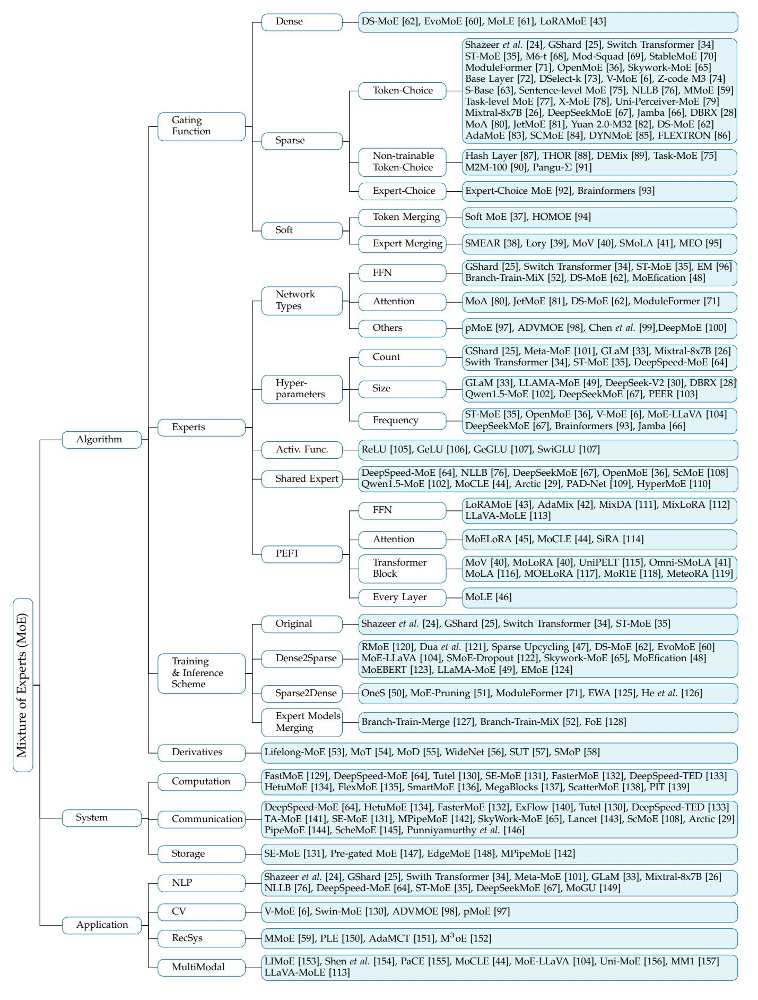

# 4 ALGORITHM DESIGN OF MIXTURE OF EXPERTS

#### 4.1 Gating Function

The gating function (also known as the routing function or router), which stands as a fundamental component of all the MoE architectures, orchestrates the engagement of expert computations and the combination of their respective outputs. We categorize this mechanism into three distinct types Based on the processing methodologies of each input, we categorize the gating mechanism into three distinct types: sparse, which activates a subset of experts; dense, which activates all experts; and soft, which encompasses fully-differentiable approaches including input token merging and expert merging.

## 4.1.1 Sparse

The sparse gating functions activate a selected subset of experts for processing each individual input token, which can be considered as a form of conditional computation [163], [164], [165]. The gating functions have been studied extensively, which may be trained by various forms of reinforcement learning and back-propagation, making binary or sparse and continuous, stochastic or deterministic gating decisions [20], [63], [166], [167], [168]. Shazeer et al. [24] pioneered a differentiable heuristic with auxiliary load balancing losses, in which the outputs from expert computations are weighted by their selection probabilities. This introduces a differentiable aspect to the gating process, thereby facilitating the derivation of gradients that can guide the gating function's optimization. This paradigm has subsequently become predominant in the realm of MoE research. Due to its selection of experts for each input token, this method can be recognized as a gating function with token choice.

**Token-Choice Gating.** Shazeer et al. [24] posited the necessity of gating inputs to the top-k experts, with k > 1, to enhance the efficacy of MoE. The rationale behind this approach is that by simultaneously consulting multiple experts for a given input, the network can effectively weigh and integrate their respective contributions, thereby improving performance. To accommodate the scalability to thousands of experts within a MoE layer, they employ a two-level hierarchical MoE to reduce the branching factor in the context of a large expert count. Subsequent research has largely affirmed that increasing the value of k enhances performance, which has led to the widespread adoption of this top-k strategy with k > 1. Notwithstanding, the Switch Transformer model [34] has shown that a top-1 gating strategy (as illustrated in Figure 4 (a)) can also yield competitive results, a finding that has been substantiated and adopted by later studies [63]. Furthermore, M6-t [68] proposed a novel variation of the top-1 gating called expert prototyping, which organizes experts into k groups and then applies top-1 gating in each group. Their experimental results show the training and downstream perplexity of a 16-layer model in order of best to worst: expert prototyping with 4 top-1 gating, 1 top-4 gating, 1 top-16 gating, 1 top-1 gating.

**Auxiliary Loss for Token-Choice Gating.** Token-choice gating algorithms frequently incorporate an auxiliary loss during training to promote equitable token distribution across experts. Table 1 shows prevalent auxiliary loss functions leveraged in the field. Shazeer *et al.* [24] quantify the importance of an expert in relation to a training batch via the

Fig. 3. Taxonomy of Mixture of Experts (MoE).

TABLE 1

Overview of diverse auxiliary loss functions and their typical coefficient configurations. The originators introducing each auxiliary loss is highlighted as **bolded reference**, followed by references that adopts the same approach. Studies that have modified the original formulation are indicated with underlined reference.

| Reference                                                                                                                                | Auxiliary Loss         | Coefficient                          |
|------------------------------------------------------------------------------------------------------------------------------------------|------------------------|--------------------------------------|
| Shazeer et al. [24], V-MoE [6]                                                                                                           | Limportance + Lload | = 0.1, wload = 0.1 wimportance |
| GShard [25], Switch-T [34], GLaM [33], Mixtral-8x7B [26], DBRX [28], Jamba [66], DeepSeekMoE [67], DeepSeek-V2 [30], Skywork-MoE [65] | Laux                   | = 0.01 waux                       |
| ST-MoE [35], OpenMoE [36], MoA [80], JetMoE [81]                                                                                         | Laux + Lz           | = 0.01, wz = 0.001 waux        |
| Mod-Squad [69], Moduleformer [71], DS-MoE [62]                                                                                           | LM I                   | = 0.001 wM I                      |

batchwise sum of the gate values for that expert, defined as

Importance(
$$\mathcal{B}$$
) =  $\sum_{x \in \mathcal{B}} \mathcal{G}(\mathbf{x}; \mathbf{\Theta})$ . (9)

Furthermore, they introduce an additional loss Limportance, which is defined as the square of the coefficient of variation of the set of importance values, and can be formulated as

$$\mathcal{L}_{importance} = CV(Importance(\mathcal{B}))^2.$$
 (10)

This loss is multiplied by a manually adjusted scaling factor wimportance, and then integrated into the overall loss function for the model, encouraging all experts to have equal importance. Although Limportance promotes balance in importance, it does not guarantee an even distribution of training examples among experts, which can lead to execution inefficiencies in distributed computing environments. To address this, they introduce a second loss Lload, which employs a smooth estimator of the number of examples assigned to each expert for a batch of inputs, thereby facilitating gradient backpropagation. Simplifying the above design, GShard [\[25\]](#page-23-23) defines a new differentiable auxiliary loss Laux using a differentiable approximation (the dot-product of mean gates and mean gating decisions per expert). This is equivalent to Lload−balancing in Equations [\(6\)](#page-2-2)–[\(8\)](#page-2-3), as detailed in Section [2.2.](#page-2-4) Switch Transformers [\[34\]](#page-23-32) and many other subsequent studies [\[26\]](#page-23-24), [\[28\]](#page-23-26), [\[33\]](#page-23-31), [\[66\]](#page-24-20) have embraced this Laux design, and enhancements [\[30\]](#page-23-28), [\[65\]](#page-24-19), [\[67\]](#page-24-21) have been made to cater to diverse requirements. Nevertheless, ST-MoE [\[35\]](#page-23-33) identified limitations with Laux, particularly at larger scales, leading to unreliable training outcomes. To enhance training stability without compromising quality, the z-loss Lz is integrated, defined as

$$\mathcal{L}_z = \frac{1}{T} \sum_{x \in \mathcal{B}} (\log \sum_{i=1}^N e^{x_i})^2,$$
 (11)

which functions by penalizing large logits entering the gating network. Since this loss encourages absolute magnitude of values to be smaller, roundoff errors are reduced, which can be quite impactful for exponential functions such as gating. Additionally, Mod-Squad [\[69\]](#page-24-23) posits the difficulty of training multi-task models under such an expert-balancing loss, which may inadvertently force experts to set parameters on conflicting tasks or hinder the potential synergies from parameter sharing across complementary tasks. Instead, it proposes to maximize the mutual information (MI) between experts and tasks to build task-expert alignment, which is accomplished through LMI. Differently, Module-Former [\[71\]](#page-24-25) proposes to maximize the Mutual Information between experts and tokens. Furthermore, DS-MoE [\[62\]](#page-24-16) extends the application of LMI, calibrating different weightings wMI, in Mixture-of-Attention (MoA, as illustrated in Figure [5](#page-9-0) (a)) and FFN MoE modules of different size models. Although existing research has introduced many different gating functions and auxiliary losses, the methods proposed by GShard [\[25\]](#page-23-23) remain the predominant choice in industry [\[26\]](#page-23-24), [\[28\]](#page-23-26), [\[33\]](#page-23-31), [\[66\]](#page-24-20), [\[67\]](#page-24-21).

**Expert Capacity for Token-Choice Gating.** In conjunction with load balancing via auxiliary loss, GShard [\[25\]](#page-23-23) incorporates an expert capacity limit, defining a threshold for the number of tokens an expert can process. This can lead to token overflow, where excess tokens are not processed by the designated expert. GShard also proposes a random routing mechanism that selects a secondary expert with a probability proportional to its weight, under the intuition that the contribution of a secondary expert can be negligible, given that the output is a weighted average and the secondary weight is typically small. For the task of image classification with Vision Transformer (ViT) models, Riquelme *et al.* [\[6\]](#page-23-4) enhance the top-k gating strategy with Batch Prioritized Routing (BPR), which assigns priority based on higher gating scores rather than the sequence order of tokens. Zoph *et al.* [\[35\]](#page-23-33) have demonstrated the efficacy of BPR in the context of MoE language models. Kim *et al.* [\[74\]](#page-24-28) suggest randomizing token prioritization within sequences to mitigate routing bias towards early-positioned tokens. OpenMoE [\[36\]](#page-23-34) provides a comprehensive analysis of gating mechanisms, highlighting the "Drop-towards-the-End" phenomenon whereby tokens later in a sequence are at greater risk of being dropped due to experts reaching their maximum capacity limits, an issue that is exacerbated in instruction-tuning datasets. Moreover, OpenMoE identifies a tendency within MoE systems to route tokens based on token-level semantic similarities, leading to "Contextindependent Specialization". Additionally, this token ID routing specialization is established early in pretraining and remains largely fixed, resulting in a consistent pattern of token processing by the same experts throughout training, a phenomenon referred to as "Early Routing Learning".

**Other Advancements on Token-Choice Gating.** Despite the implementation of gating heuristics and auxiliary expert-balancing loss functions aimed at achieving a balanced workload distribution among experts, the issue of load imbalance persists as a prevalent challenge within

Fig. 4. The illustration of various gating functions employed in MoE models, including (a) sparse MoE with top-1 gating [\[34\]](#page-23-32), (b) BASE layers [\[72\]](#page-24-26), (c) the combination of grouped domain mapping and random gating [\[91\]](#page-25-7), (d) expert-choice gating [\[92\]](#page-25-8), (e) attention router [\[82\]](#page-24-36), and (f) soft MoE with expert merging [\[38\]](#page-23-36).

MoE architectures. To solve it, the Balanced Assignment of Sparse Experts (BASE) layer, as conceptualized by Lewis *et al.* [\[72\]](#page-24-26) and illustrated in Figure [4](#page-6-0) (b), re-envisions the token-to-expert allocation process by casting it as a linear assignment problem, aiming to maximize the token-expert affinities under the constraints that each expert is assigned an equal quantity of tokens. Subsequently, Clark *et al.* [\[63\]](#page-24-17) introduce a variant of the BASE layer, termed S-BASE, using an optimal transport formulation. Additionally, they devise a reinforcement learning based gating algorithm employing top-1 routing, with the reward function defined as the negative cross-entropy of the predicted token. The discrete optimization of gating function can lead to convergence and statistical performance issues when training with gradientbased methods. To address these issues, Hazimeh *et al.* [\[73\]](#page-24-27) introduce DSelect-k, which is a smooth version of the top-k gating algorithm that improves over standard top-k gating. This method constitutes a refined version of the top-k gating algorithm, featuring enhanced smoothness properties that yield improvements over the conventional top-k gating approach. Kudugunta *et al.* [\[75\]](#page-24-29) diverge from the prevalent token-level gating strategies by introducing a sentence-level gating mechanism. This approach involves generating a sentence representation by averaging the tokens within a sequence and subsequently routing it to an expert. Chi *et al.* [\[78\]](#page-24-32) observe that prevailing gating mechanisms tend

to push hidden representations clustering around expert centroids, implying a trend toward representation collapse, which in turn harms model performance. To counteract this issue, they project hidden vectors into a lower-dimensional space before gating and implement L2 normalization for both token representations and expert embeddings, thus calculating gating scores within a low-dimensional hypersphere. Cai *et al.* [\[86\]](#page-25-2) identify the difficulty in training the adaptive routers due to gradient vanishing, and introduce a novel strategy involving the training of a Surrogate Model (SM) that predicts LLM's language loss given only router choices. Once trained, the SM is frozen, and the router is subsequently tuned to minimize language loss, relying exclusively on feedback from the SM. Skywork-MoE [\[65\]](#page-24-19) proposes two innovative techniques: gating logit normalization, which improves expert diversification, and adaptive auxiliary loss coefficients, which provides layerspecific adjustment of auxiliary loss coefficients. Yuan 2.0- M32 [\[82\]](#page-24-36) proposes a new router network, Attention Router (as illustrated in Figure [4](#page-6-0) (e)), which implements a more efficient selection of experts and yields an enhancement in model accuracy over classical linear router network. Zeng *et al.* [\[83\]](#page-24-37) posit that the complexity of token feature abstraction may necessitate a variable number of experts to process. In response, they propose AdaMoE, a novel approach that enables token-adaptive gating for MoE, allowing for a

dynamic number of selected experts per token. AdaMoE subtly modifies the standard top-k MoE by incorporating a predetermined set of null experts and increasing the value of k. Importantly, AdaMoE does not mandate a uniform allocation of null experts across tokens but ensures the average engagement of null experts with a load-balancing loss, resulting in an adaptive number of null/true experts used by each token. Dynamic Mixture of Experts (DYNMoE) [\[85\]](#page-25-1) also introduces an innovative gating mechanism that enables individual tokens to automatically determine the number of activated experts via the trainable per-expert thresholds, incorporating an adaptive process that automatically add or remove experts during training. Shi *et al.* [\[84\]](#page-24-38) introduce Self-Contrast Mixtureof-Experts (SCMoE), a training-free strategy that utilizes the contrastive information among different gating strategies to engage unchosen experts during inference.

**Non-trainable Token-Choice Gating.** The dynamic training of gating functions within MoE models is standard practice; however, some research has ventured into the realm of non-trainable token-choice gating mechanisms. The most significant benefit of non-trainable token-choice gating is that no additional gating network parameters are required and the full load balancing can be achieved through specific gating mechanisms. The Hash Layer [\[87\]](#page-25-3) utilizes a random fixed gating approach by hashing the input token, achieving competitive results without the necessity of training the gating network. The load balancing is facilitated by the selection of hash functions prior to training, which can equitably distribute token batches. Zuo *et al.* [\[88\]](#page-25-4) introduces THOR, an algorithm that randomly allocates two experts to each input during training and inference with a consistency regularized loss promoting consistent predictions. Gururangan *et al.* [\[89\]](#page-25-5) propose the DEMix model, which explicitly assigns distinct experts to discrete pretraining domains, with domain matching being employed to select experts corresponding to the training inputs. Given the potential suboptimality of domain categorization and its limited scope in encompassing test-time domains, a single domain expert selection could undermine the model's generalizability. To address this, DEMix adopts a parameter-free probabilistic method that dynamically estimates the domain-weighted mixture at inference. Kudugunta *et al.* [\[75\]](#page-24-29) explore tasklevel gating incorporating prior knowledge tags, and similarly, M2M-100 model [\[90\]](#page-25-6) utilizes explicit language-specific sublayers with deterministically routing input tokens based on their language. Building upon the aforementioned nontrainable gating strategies—random gating and domain mapping—PanGu-P [\[91\]](#page-25-7) presents the Random Routed Experts (RRE) mechanism. As illustrated in Figure [4](#page-6-0) (c), this approach initially routes tokens to a domain-specific expert group, followed by a random selection within that group.

In contrast to explicit language-specific expert selection, NLLB [\[76\]](#page-24-30) leverages trainable gating to manage multilingual machine translation tasks, outperforming the M2M-100 approach [\[90\]](#page-25-6). Addressing task interference in generalist models, Zhu *et al.* [\[79\]](#page-24-33) introduce the Conditional MoE, which augments MoE with trainable gating by integrating conditional information at various levels, such as token-level, context-level, modality-level, task-level, and predefined token attributes. Ye *et al.* [\[77\]](#page-24-31) further investigate the incorporation of trainable gating at task-level MoE. Additionally, STABLEMOE [\[70\]](#page-24-24) identifies a challenge with existing learning-to-route MoE methods: the phenomenon of gating fluctuation. To counter this, STABLEMOE employs a two-stage training process. The first stage focuses on acquiring a balanced and cohesive gating strategy, which is then distilled into a lightweight gate function, decoupled from the backbone model. Subsequently, the second stage leverages the distilled gate for token-to-expert assignments and freezes it to ensure a stable gating strategy throughout further training.

**Expert-Choice Gating.** Zhou *et al.* [\[92\]](#page-25-8) propose an inversion of the conventional token-choice gating paradigm, wherein each expert selects the top-k tokens they will process, as illustrated in Figure [4](#page-6-0) (d). This approach circumvents the necessity for auxiliary load balancing losses during training, ensuring a uniform distribution of tokens across experts. However, this method may result in uneven token coverage, with some tokens potentially being processed by multiple experts or not at all. Despite this, the technique demonstrates strong empirical performance and offers an adaptive computational interpretation where the model can implicitly apply more computation to certain tokens. The effectiveness of expert-choice gating is further validated by Zhou *et al.* in their subsequent Brainformers study [\[93\]](#page-25-9). Additionally, Komatsuzaki *et al.* [\[47\]](#page-24-1) integrate the expert-choice gating strategy within the Vision Transformer and adapt it for the encoder in T5 models, while maintaining token-choice gating for the T5 decoder.

## *4.1.2 Dense*

In Section [2.1,](#page-2-5) we discuss the enduring relevance of dense MoE, which activates all the experts for each input process. This dense paradigm continues to inform current innovations in MoE training and inference methodologies, as elaborated in Section [4.4.1.](#page-15-0) While sparse activation of experts, as a trade-off, may yield computational efficiency gains at the expense of some performance loss when compared to a densely activated MoE with an equivalent number of total parameters [\[62\]](#page-24-16), [\[67\]](#page-24-21), [\[71\]](#page-24-25), it represents a strategic adjustment to balance computational demands with model capability. Notably, dense activation performs well in the context of LoRA-MoE fine-tuning, where the computational overhead of LoRA experts is comparatively low. This approach enables the effective and flexible integration of multiple LoRAs across a variety of downstream tasks. It preserves the generative capabilities of the original pretrained model and maintains the unique characteristics of individual LoRAs for each task [\[43\]](#page-23-41), [\[61\]](#page-24-15).

