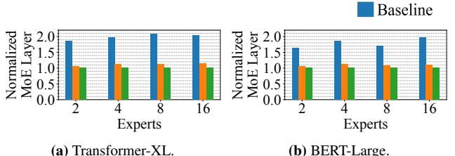
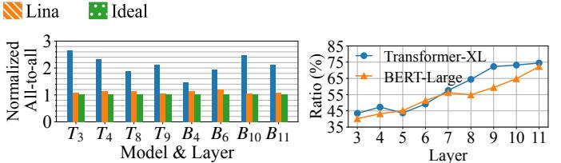

# 7.1 Setup

Testbed setup. Our testbed has four worker nodes. Each node has 4 Ampere A100 GPUs with 40GB memory and is equipped with 100Gbps InfiniBand.

MoE models. We convert three common Transformer-based dense language models to MoE ones for training.

- Transformer-XL [\[20\]](#page-12-13): a 24-layer encoder model.
- BERT2GPT2 [\[49\]](#page-13-13): a 12-layer encoder-decoder model.
- GPT-2 [\[39\]](#page-13-14): a 12-layer decoder model.

Besides, we consider two inference tasks.

- Transformer-XL [\[20\]](#page-12-13): The inference task is text generation with Enwik8 [\[3\]](#page-11-4) test set.
- BERT-Large [\[21\]](#page-12-1): a 12-layer decoder model. The inference task is translation using WMT En-De [\[8\]](#page-11-7) test set.

All FFN layers in these models are converted to MoE layers. We vary the number of experts in an MoE layer from 2, 4, 8, to 16. We adopt top-2 gating in training and top-1 gating in inference following [\[23\]](#page-12-2), i.e. *k* = 2 in training and *k* = 1 in inference

Metrics. We consider four metrics to evaluate Lina.

- Training step time: Time to complete one step of training.
- Inference time: Time to complete one batch of inference.
- All-to-all time: The completion time of all-to-all.
- MoE layer time: Time to complete one MoE layer of computation and communication.

In collecting these metrics we use PyTorch Profiler to obtain CUDA kernel execution time and GPU activities. Training results are averaged over 50 steps after a 10-step warm-up period. Inference results are averaged over the test set. Since the optimization introduced by Lina does not affect the precision

of model parameters, model accuracy is unaffected and we omit its evaluation.

Training configurations. Lina's micro-op communication scheduler adopts a tensor partition size of 30MB, which can minimize the period blocked by all-to-all in most cases. Expert packing is launched at the 10-th step of each training task and is adjusted every four steps.

Inference configurations. Lina's resource scheduler runs on device 0. The path length *l* in popularity estimation is 3; the maximum number of experts packed on a device is 4.

Baselines. We use the vanilla DeepSpeed [\[2\]](#page-11-1) as the Baseline. We also provide a comparison to the open-source version of Tutel [\[7\]](#page-11-2), which performs similarly with DeepSpeed. We enable hierarchical all-to-all for both Lina and DeepSpeed and disable Random Token Dropping [\[50\]](#page-14-4) introduced by Deep-Speed.

### 7.2 Training

We start with Lina's training performance. Note that Lina is evaluated when the expert packing decision is stabilized; all settings here use 2 experts per device as the best strategy except Transformer-XL with 16 experts, which uses 4 experts per device. The number of GPUs is equal to the number of experts per layer in both Baseline and Lina.

### 7.2.1 Overall Performance

Training step time. Figure [10](#page-8-1) shows Lina's speedup in step time over Baseline and Tutel. All other aspects of the models stay the same (e.g. sequence length, hidden states dimension, etc.). Compared to Baseline (DeepSpeed), step time is reduced by an average of 1.37x and 1.47x for the 4- and 16 expert cases, respectively, and by an average of 1.71x and 1.73x for 2- and 8-expert models, respectively. The 2- and 8-expert cases see more significant gains as Lina's packs two experts per device as mentioned before. The 2-expert case thus boils down to pure data parallelism without any all-to-all; the 8-expert models avoid inter-node all-to-all as our servers have 4 GPUs each. Lina's speedup over Tutel is slightly smaller than that of DeepSpeed. Thus in the following we only use DeepSpeed as the Baseline.

MoE layer time. We specifically seek to understand Lina's gain in MoE layers in both the forward and backward pass. As Figures [11](#page-8-1) and [12](#page-8-1) show, similar to step time, the gain in the 2 and 8-expert cases is the largest. The forward and backward pass of MoE layers in the 2-expert case are accelerated by 1.84x and 2.41x, and in the 8-expert case by 1.89x and 2.32x, respectively. Since backward pass in Baseline suffers from the interference of allreduce while the forward pass does not, the improvement in the backward pass is more significant. Average GPU utilization in the MoE layer for 16-expert cases is improved by at least 16% as the period blocked by all-to-all is minimized with Lina.

Figure 14: Training step time speedup over Baseline with different design choices of the communication scheduler. 10MB to 200MB in 16-expert models.

| Expert | Model          | Pipelining Efficiency |                             |   |  |
|--------|----------------|-----------------------|-----------------------------|---|--|
| Empere | Wiode!         | w/o Packing           | w/ Packing (Experts per Dev |   |  |
| 16     | Transformer-XL | 33%                   | 86%                         | 4 |  |
|        | GPT-2          | 36%                   | 85%                         | 2 |  |
|        | BERTGPT2       | 34%                   | 79%                         | 2 |  |

Table 3: Pipelining efficiency comparison with and without expert packing.

**GPU utilization and memory usage.** We measure the average GPU utilization GPU memory usage. We observe an average of 17.6% improvement in GPU utilization due to the efficient scheduling of Lina. Expert packing would lead to usage increase in GPU memory. The peak memory of BERT2GPT2 is increased by 19.5% while Transformer-XL and GPT-2 use up all the memory and apply DRAM-offloading to store the packed expert parameters.

**All-to-all time.** We then zoom in on all-to-all time in backward pass, where Lina prioritizes all-to-all and avoids concurrent execution with allreduce. Expert packing also reduces the all-to-all transfer size. Figure 13 shows an average speedup of 2.21x, 2.39x, and 2.31x in 4-, 8-, and 16-expert cases in all-to-all time, respectively.

We also examine the pipelining efficiency between all-toall and expert computation in Lina. We define the pipelining efficiency to be the fraction of non-idle time in the computation CUDA stream during the all-to-all duration. We calculate the pipelining efficiency of Lina before and after adopting expert packing in Table 3. The average improvement is 2.43x in 16-expert case, which also demonstrates the benefits of expert packing. The expert FFN micro-op time is thus closer to the all-to-all time. We find that two experts per device can achieve the best pipelining efficiency in most cases, justifying our settings mentioned before.

| Expert | Model          | Average GP | GPU Memory Peak Usage(%) |          |      |                 |
|--------|----------------|------------|--------------------------|----------|------|-----------------|
| Expert | Wieder         | Baseline   | Lina                     | Baseline | Lina | DRAM-offloading |
| 16     | Transformer-XL | 66.2       | 83.4                     | 72.1     | 100  | <b>✓</b>        |
|        | GPT2           | 62.3       | 78.2                     | 83.8     | 100  | ✓               |
|        | BERT2GPT2      | 63.5       | 82.5                     | 74.3     | 94.2 | Х               |

**Table 4:** GPU utilization and peak memory usage of 16-expert MoE models. GPU Memory Peak Usage is the ratio between the maximum usage and the total device memory. DRAM-offloading indicates if it is applied.

### 7.2.2 Communication Scheduler

We now present an in-depth analysis of Lina's priority-based micro-op scheduler, aiming to understand the benefit of each design choice. For fairness all experiments here are obtained without expert packing in Lina, i.e. one expert per device. **Tensor partitioning and pipelining.** To justify our design, we incrementally add the key design choices to Baseline and see their corresponding gain: first priority scheduling, then tensor partitioning, and lastly pipelining. Besides, we consider a fixed scheduling strategy where allreduce is always scheduled between pairs of all-to-all operations (i.e. two MoE layers) with tensor fusion enabled in PyTorch's DistributedDataParallel by default (same as Baseline).

Figure 14 shows the step time comparison. We make several interesting observations here. First, using priority brings about 10%–30% gain over Baseline in most cases, with an average of 24%. Priority scheduling in general presents more benefit when more devices and nodes are used in training. The main reason is that all-to-all's slowdown due to sharing bandwidth with allreduce is more severe as training scales out. Second, tensor partitioning significantly improves the benefit of prioritizing all-to-all: step time is reduced over Baseline by 1.36x, 1.36x, 1.41x and 1.42x in 2-, 4-, 8-, and 16-expert cases, respectively on average. On the other hand, pipelining's gain is limited as expected, since expert computation takes much less time than all-to-all without expert packing (recall §4.2). Overall, all three design choices can effectively reduce

(a) Median inference time with Transformer-XL.

**(b)** 95%ile inference time with Transformer-XL.

(c) Median inference time with BERT-Large.

(d) 95%ile inference time with BERT-Large.

Figure 16: Median and tail inference time. We normalize the inference time with the ideal result. The median and tail inference time is the same in Ideal.

all-to-all's completion time.

We also observe that the relative benefit of priority scheduling and tensor partitioning is model-specific: GPT-2 enjoys much more gain from priority compared to tensor partitioning while the other two models do not exhibit such clear pattern. This is likely due to the degree of overlapping of all-to-all and allreduce: most allreduce can fit in between all-to-all operations in GPT-2, and as a result using priority scheduling alone is very beneficial.

Finally, the fixed scheduling strategy leads to the smallest gains in almost all cases. This is because (1) all-to-all still has to fair-share bandwidth with allreduce, and (2) tensors are not partitioned which aggravates the impact of allreduce. This demonstrates again the effectiveness of our design in prioritizing all-to-all with smaller tensors instead of using fixed heuristics that cannot opportunistically maximize efficiency. **Partition size.** We also evaluate the impact of partition size on the communication scheduler. Figure 15 shows the step time of 16-expert models when we gradually increase the partition size from 10MB to 100MB. We find that a partition size beyond 50MB slows down Transformer-XL and BERT2GPT2 compared with 30 MB. As long as the period blocked by allto-all is minimized, step time would be minimum. Therefore, for each model and setting, there are multiple optimal partition sizes. Ideally, the scheduler can more precisely control the operations with a smaller partition size. In practice, small partitions (below 10MB) may cause heavy transmission overhead in each micro-op and degrade the overall performance [37]. Overhead analysis. We provide a brief analysis of the overhead incurred by Lina's communication scheduler. First, the preprocessing and postprocessing, including tensor partitioning and concatenation, take an average 1.02% of the step time. Second, we measure the transmission overhead of micro-ops. We sum up running times of all the communication micro-ops and compare against those without partitioning in Baseline. The average completion time is lengthened by 1.7%.

### 7.3 Inference

We then evaluate Lina's inference performance. Each experiment is repeated five times: two of which measure the end-to-end inference time, and the rest profile the different components with Profiler and collect statistics for overhead

and estimation accuracy. This way the inference time is not affected by the profiling overhead.

#### 7.3.1 Resource Scheduler

**Inference time.** Figure 16 shows the median and 95% inference time of Baseline and Lina. We also present the ideal inference time with a perfectly balanced load across devices in all MoE layers. This is obviously challenging to achieve with real-world requests. Thus we modify the gating network to constantly output a balanced expert selection to obtain this benchmark. We normalize all results to the Ideal value.

Lina's resource scheduler effectively balances the load among devices and achieve inference time close to Ideal. Compared to Baseline, median inference time is reduced by 1.54x and 1.45x for the 4- and 16-expert Transformer-XL, and by 1.36x and 1.46x for the 4- and 16-expert BERT-Large, respectively. The 95%ile inference time is reduced by 1.82x for 16-expert Transformer-XL and 1.68x for 16-expert BERT-Large. The reduction on tail inference time increases with more experts in a layer, because a wider MoE layer is more likely to present more skewed expert popularity, giving more room for Lina to optimize. Lastly, Lina's gap to Ideal can be explained for two reasons other than the overheads. First, Lina cannot perfectly balance load: the least popular experts are randomly placed for example. Second, Lina starts to schedule from the fourth layer.

MoE layer and all-to-all time. With Lina, MoE layer time includes gate computation, phase two of scheduling, two all-to-all, and expert computation; phase one of the scheduling is largely overlapped with computation as explained in §6.2. The 95%ile MoE layer time is reduced by 1.87x and 1.77x in 8- and 16-expert Transformer-XL over Baseline and by 1.58x and 1.81x in 8- and 16-expert BERT-Large as in Figure 17. We also extract all-to-all time, which is a direct indicator of whether Lina balances load across devices effectively. We present the tail all-to-all time reduction of different layers in Figure 18. The average and maximum improvements are 1.96x and 2.50x over Baseline. These results confirm that Lina effectively balances the load of each device and all-to-all transfer size of each link.

**Two-phase scheduling.** We then evaluate the effectiveness of our resource scheduler's design. We consider separately

Figure 17: 95%ile completion time of MoE layer.

| Model          | Path Norm. Inference Time Length Median 95%ile |      | Fine-tuning (%) | Estimation Accuracy (%) |      |
|----------------|---------------------------------------------------|------|-----------------|----------------------------|------|
|                | 1                                                 | 1.41 | 1.32            | 76.5                       | 31.6 |
| Transformer-XL | 3                                                 | 1.16 | 1.04            | 25.7                       | 60.4 |
|                | 6                                                 | 1.19 | 1.11            | 22.5                       | 71.4 |
|                | 1                                                 | 1.34 | 1.35            | 71.3                       | 28.3 |
| BERT-Large     | 3                                                 | 1.07 | 1.04            | 32.2                       | 63.5 |
|                | 6                                                 | 1.00 | 1.11            | 27.1                       | 66.0 |

**Table 5:** Lina's performance using different path lengths during estimation. Both models have 16 experts per layer. Inference time is normalized to Ideal.

Lina without estimation and without fine-tuning in order to understand their individual gains. Lina w/o estimation refers to scheduling using the actual routing decision computed by the gating network.

In Figure 16, we present the comparison of inference time for all schemes. Without estimation the median inference time is worsened by 24.0% and 18.6% for 16-expert Transformer-XL and BERT-Large in Lina. The scheduler works after the gating network and blocks all-to-all with the following computation until it completes. Thus the scheduling overhead manifests at each MoE layer, overweighing the additional gains brought by accurate popularity information. The tail inference time is less affected compared to the median, but still suffers without estimation.

Without fine-tuning, tail inference time is prolonged by 26.7% and 33.1% for 16-expert Transformer-XL and BERT-Large. This suggests that fine-tuning also plays an indispensable role when the estimation shows a large difference from the actual routing decision. For example, if the top-1 expert in the actual routing decision is estimated as an unpopular one packed with others, the Moe layer time would even be worse than Baseline. More discussions are presented in §7.3.2. The importance of fine-tuning depends heavily on estimation accuracy and number of expert in MoE layer.

Overhead analysis. We dissect the overhead of the resource scheduler, by considering the scheduling times of phase one and phase two separately. The scheduling time for both phases averages at  $\sim$ 6.2ms since they share the same logic and coordination workflow. Yet, the overhead of phase one is largely overlapped with model computation. Though overhead of phase two with re-scheduling is more salient, it only kicks in for 23% of the cases on average, and is smaller than the idle time incurred by skewed expert popularity. The overhead of phase two without fine-tuning is merely 1.45ms.

**Figure 18:** All-to-all time in 16-expert MoE.**Figure 19:** Estimation accuracy of *T* is Transformer-XL and *B* is BERT-Large. 16-expert MoE.

| Task        | Dataset           | Model   | Norm. 95%ile Inference Time | Estimation Accuracy |
|-------------|-------------------|---------|-----------------------------|---------------------|
| Sentiment   | IMDB Reviews [34] | BERT    | 1.08                        | 64.4%               |
| Analysis    | Twitter [35]      |         | 1.11                        | 62.3%               |
| Translation | WMT French [8]    | T5 [40] | 1.04                        | 68.8%               |
| (English)   | WMT Russian [8]   |         | 1.08                        | 62.5%               |

**Table 6:** Lina's performance on different tasks and datasets. Inference time is normalized to Ideal. The path length is set to 3.

#### 7.3.2 Popularity Estimation

We now analyze Lina's popularity estimation method.

Estimation accuracy. We first examine the estimation accuracy across MoE layers. We resort to the same definition used in Lina's phase two scheduling: if the top-2 (recall k = 1 in inference) estimated experts are identical to the actual routing decision, we consider the estimation accurate. Figure 19 shows the accuracy for every MoE layer in two inference tasks. Overall, estimation accuracy is 58.41% and 54.16% for Transformer-XL and BERT-Large, respectively. The estimation accuracy is higher in the latter layers of the model, which is consistent with our observation in Figure 9. We also compare the complete popularity rankings given by the estimation to better understand its accuracy. Using 1000 random batches of the Transformer-XL model, we observe that errors usually happen at experts with a similar popularity. An average of 3.67 experts out of the estimation are incorrectly ordered. Therefore, the fine-tuning only requires little adjustment to the experts packed together. The effectiveness of Lina's estimation can be justified.

Sample path length. We also investigate the impact of sample path length l. The longer the sample path of expert selection is for making an estimation, the more accurate the result is. Table 5 shows Lina's performance degrades with l=1, in terms of inference time, estimation accuracy, and the occurrence of phase two fine-tuning, compared with the default length of 3. Longer paths can elevate the estimation accuracy and further reduce the number of times of Lina's fine-tuning. However, due to the problem of a slower start, the reduction of inference time is not as noteworthy as the estimation accuracy. For a path length of 6, Lina shows a similar median and tail result as the performance with a path length of 3.

Generalizability. We proceed to evaluate how well Lina's popularity estimation approach can be generalized to different tasks. Table 6 shows the estimation accuracy of four tasks with different datasets. The 95%ile inference time can achieve at most 1.04x of the Ideal inference time and the estimation accuracy is at least 62.3%. Lina's estimation method relies on the patterns obtained from training stage. Therefore, it is

tailored to each specific task and proves to be an effective approach to capturing the expert popularity prior.

### 8 Discussion

Parallelism in training. With the increasing scale of language models, the adoption of pipeline and tensor parallelisms has become essential [\[46\]](#page-13-19). Pipeline parallelism involves the use of blocking send and receive operations to transmit intermediate activations, while tensor parallelism utilizes blocking all-reduce operations to combine tensor partitions. Extensive research has been conducted on coordinating communication operations for dense models [\[7,](#page-11-2) [27,](#page-12-15) [52\]](#page-14-5). Lina focuses on sparsely-activated MoE with data and expert parallelism, which are orthogonal to existing work.

Estimation of expert popularity. The current estimation approach used by Lina relies on data collection during the training stage. While fine-tuning can assist in improving efficient expert placement decisions, an estimation method with improved accuracy and confidence would further reduce inference time. One potential approach is to leverage machine learning techniques to train a compact yet powerful model that can predict the expert selected by each token in every MoE layer ahead of time, when the requests are received.

