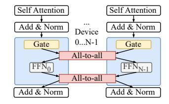
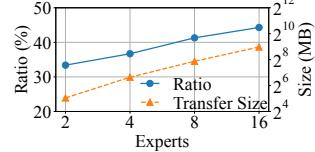
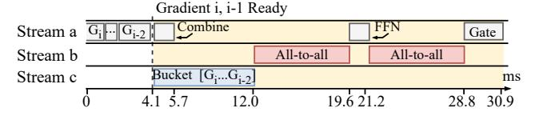
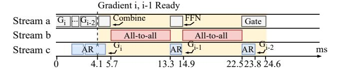

# 2.1 A Primer on MoE

Mixture-of-Experts (MoE) has been adapted to different types of DNN models , and exhibits great potential in improving the

(a) There are four experts and the gate selects two experts.

(b) Distributed MoE. Data parallelism and expert parallelism are used.

Figure 1: MoE layer in Transformer-based models.

performance of language models in particular. GShard [\[31\]](#page-13-7) and Switch Transformer [\[23\]](#page-12-2) are two seminal works on scaling Transformer-based language models with MoE layers. We focus on MoE in Transformer-based models in this work.

Transformer-based models normally use an MoE layer to replace the feed-forward network (FFN) layer. An MoE layer consists of multiple FFNs each serving as an *expert*, and a gating network (Figure [1a\)](#page-1-1). Every expert is a fully-connected two-layer network using ReLU activation but with different parameters. The gating network takes in the embedding vector of each token and multiplies them with its trainable matrix. Based on the results, it dispatches the token to a small number of experts (usually one or two). The final output of the MoE layer is the weighted sum of outputs from the selected expert(s). The sparsity nature of MoE improves the model scaling in size without increasing the training cost and naturally leads to a dynamically-changing model graph.

Load balancing loss. In MoE training, an auxiliary loss is introduced to evaluate the token distribution among the experts [\[23\]](#page-12-2). The objective is to achieve a uniform distribution of tokens across the experts, thereby preventing an excessive concentration of tokens in a single expert. By minimizing this loss term, we encourage but do not enforce the gating network to produce a perfectly balanced token distribution.

The standard practice is to calculate the auxiliary loss of each MoE layer and sum them with the training loss using an appropriate weight. Previous research has demonstrated the effectiveness of this approach [\[16](#page-12-10)[,33,](#page-13-4)[45\]](#page-13-9). However, it should be noted that achieving a perfectly balanced distribution, where the auxiliary loss converges to zero, is challenging [\[18,](#page-12-11) [53\]](#page-14-2). During MoE inference, the trained gating network is utilized to dispatch tokens to the experts based on their respective embeddings. This process is solely driven by the characteristics of the token embeddings.

Hybrid parallelism in distributed MoE. Training and serving MoE models in a distributed manner are necessary due to the tremendous compute requirement of large-scale language models [\[12\]](#page-12-12). For efficiency, both data parallelism and MoEspecific *expert parallelism* (as a form of model parallelism) are applied [\[23,](#page-12-2)[31\]](#page-13-7). Existing MoE systems [\[2,](#page-11-1)[7,](#page-11-2)[10,](#page-12-8)[23,](#page-12-2)[31,](#page-13-7)[43\]](#page-13-6) allocate one unique compute device (e.g., GPU) for each expert in expert parallelism. An all-to-all communication is then needed to send tokens to their experts selected by the gating network, and another all-to-all is needed to send tokens back

| # Experts | Model            | Training (ms) |       | Inference (ms) |       |  |
|-----------|------------------|---------------|-------|----------------|-------|--|
| GPUs      | #Layers & Params | All-to-all    | Ratio | All-to-all     | Ratio |  |
|           | 12L + 117M       | 259           | 36.7% | 73             | 27.4% |  |
| 4         | 24L + 233M       | 589           | 35.4% | 103            | 26.2% |  |
|           | 36L + 349M       | 979           | 38.2% | 153            | 28.3% |  |
|           | 12L + 419M       | 333           | 39.5% | 102            | 32.5% |  |
| 16        | 24L + 838M       | 715           | 37.6% | 177            | 31.7% |  |
|           | 36L + 1.2B       | 1145          | 36.8% | 243            | 27.4% |  |

**Table 1:** The completion time of all-to-all and its ratio in training and inference task of Transformer-XL [20] in different number of experts per layer. Training and inference have the same batch size here. Each FFN layer is replaced with MoE and the number of experts is equal to the number of GPUs similar to the common practice [23]. A100 GPUs with 40GB memory and 100Gb/s InfiniBand are used. We use the MoE implementation in DeepSpeed.

to the device they belong to in data parallelism to finish the rest of the forward pass as shown in Figure 1b.

### 2.2 Bottleneck Analysis

Much prior work has identified that the introduction of all-to-all in MoE causes performance inefficiency in Transformer-based models [7, 41, 54]. We extract the completion time of all-to-all operations in both training and inference in our GPU cluster as shown in Table 1. All our experiments in this section use the same testbed and settings. Overall, all-to-all takes an average of 34.1% — a significant fraction of the step time. Interestingly, though the bottleneck brought by all-to-all is universal in both MoE training and inference, the causes differ. In the following, we motivate our work by analyzing how all-to-all affects the efficiency of training and inference, respectively.

Synchronous all-to-all with large data transfer. The common characteristic shared by MoE training and inference is all-to-all's large data transfer. All-to-all is an irreplaceable synchronous component to handle the data exchange among devices in MoE layer. Each MoE layer has two all-to-all operations to send the tokens to the experts and then restore the position of tokens, as introduced in §2.1. The data transfers in the two all-to-all operations have the same size because the expert's FFN architecture ensures that its input data size is the same as the output data size. Figure 2 shows an empirical timeline view of the forward pass of MoE model in our cluster. All-to-all takes 74.9% of the end-to-end running time of one MoE layer. Expert FFN computation and the combine operation follow when all-to-all operation completes. MoE training and inference suffer from such inefficiency consistently. GPU is mostly idle during this period: We use the PyTorch Profiler [6] to profile the GPU activities for 20 steps in each experiment in Table 1, and find that the average GPU SM efficiency during all-to-all is 3.7%. Besides, the data transfer size grows linearly with the number of experts. Figure 4 presents the empirical evidence of all-to-all's transfer size as the number of experts grows from 2 to 16 (128). With the increasing number of experts, the time taken by all-to-all grows from 33.4% to 44.5% of the step time.

**Figure 2:** Timeline of forward pass an MoE layer. We simplify the presentation by bundling GPU kernels here: The computation kernels are grouped by their roles in the MoE layer into Gate, FFN and Combine. The Combine operation involves reshaping the tensors and computing the weighted output. The timeline is taken from a sample run of the 419M-parameter model in Table 1.

**Figure 3:** CDF of how much all-toall is prolonged when it overlaps with allreduce operation. We mark the median and average slowdown factors.

**Figure 4:** The proportion of all-to-all's completion time over training step time when the number of experts grows. Dashed line plots the data size in one all-to-all operation.

### Problem in training: Prolonged all-to-all with allreduce.

The unique challenge in MoE training is that applying the hybrid parallelism creates a particularly severe impact to allto-all in backward pass. Non-MoE layers in data parallelism need allreduce to aggregate the gradients, while expert parallelism requires all-to-all to exchange tokens to compute expert gradients. Since the two operations control their own process groups independently, two dedicated CUDA streams are launched concurrently. This is demonstrated in Figure 5 with the timeline of backward pass in a sample run of MoE training. As the two operations overlap, they contend for the network bandwidth and their completion times are severely prolonged. To make matters worse, we find that the slowdown factor varies significantly. We collect the completion times of 1,500 all-to-all operations in backward pass on our testbed and plot the CDF of the slowdown factor they endure with allreduce in Figure 3. Observe that the median slowdown is over 1.83x and the worst is 4.14x.

**Problem in inference: Skewed expert popularity.** The main cause of all-to-all being the bottleneck in MoE inference is the skewed expert popularity. The token-to-expert distribution in inference is purely workload-driven, and we empirically find that the expert popularity is highly skewed in sharp contrast to training. We sample the expert popularity of the same MoE model in training and inference in Figure 6. In training, the distribution is nearly the same across all experts after hundreds of steps due to the use of load balancing loss. In inference, however, the most popular expert receives 4.02x and 5.56x tokens of the least popular ones in 4-expert and 16-expert inference tasks. With the same network and computation capacity, devices hosting popular experts take much longer to perform expert computation. In this experiment, the maximum idle time of the least popular expert is 29.4% of the inference time of that batch. Thus, within one batch, tokens to the less occupied experts have to wait for others to complete on the more popular experts, degrading the all-to-all perfor-

**Figure 5:** Timeline of backward propagating an MoE layer under hybrid parallelism. The first all-to-all is prolonged by the allreduce operation in Stream b. The shadowed part is its original completion time.

**Figure 6:** Sampled expert popularity. The distribution is computed as the ratio between the number of tokens received by the expert and total number of tokens in one batch. We use the Enwik8 test set [3] for evaluation.

mance significantly. Further, under uniform expert-device allocation, devices hosting popular experts have more tokens using their links for all-to-all, while the links of other devices are underutilized.

### 3 Design Overview

Lina is designed to accelerate all-to-all in distributed MoE. It attacks both the bandwidth contention with allreduce in training, as well as the straggler with unbalanced all-to-all bandwidth in inference. We focus specifically on MoE implementations that leverage both data and expert parallelism.

MoE training. We aim to improve the *bandwidth* of all-to-all in order to reduce the blocking period of the computation operations. Our key idea here is to *prioritize all-to-all* so it does not fair-share bandwidth with concurrent allreduce (§4). This is achieved using tensor-partitioning. We partition all-to-all and allreduce tensors into small chunks, each of which then forms a *micro-op*. Lina schedules an allreduce micro-op only when there is no all-to-all waiting or ongoing so that all-to-all is guaranteed the full network bandwidth during its lifetime. Without prior information, tensor-partitioning and micro-ops can ensure that in most cases all-to-all can launch immediately and allreduce is not deferred excessively.

**MoE inference.** We propose to dynamically adjust the device allocation for experts based on the *expert popularity*, so that is not all-to-all is not delayed by the trailing tokens, and its bandwidth utilization across links is balanced (§5). We exploit the expert selection pattern across adjacent layers to estimate the expert popularity. Based upon the estimation, Lina performs scheduling at each layer to allocates proportionally more devices for popular experts and pack unpopular ones to fewer devices, and coordinate all-to-all correspondingly.

### 4 Prioritizing All-to-All Training

We have shown that all-to-all is slowed down significantly if it overlaps with allreduce in the backward pass in MoE training. Lina partitions the communication operations into small micro-ops and schedule them strategically in order to prioritize all-to-all without impeding allreduce and the computation process. We introduce the design challenges in §4.1. In §4.2, we present Lina's communication scheduler that uses tensor partitioning and pipelining to improve the training efficiency.

### 4.1 Design Challenge

Intuitively, Lina can prioritize all-to-all and avoid concurrent execution with allreduce with strict priority scheduling. All-to-all is always dispatched first if both are present in the queue, and subsequent operations have to wait until the running one finish to make sure allreduce does not share the bandwidth.

It turns out that simply prioritizing all-to-all is not as efficient as one may expect. For work-conservation, when an allreduce arrives first, it should be launched immediately. The problem is when an all-to-all arrives later, though ideally one would preempt the allreduce due to priority scheduling, this is not possible in current multi-GPU communication libraries such as NCCL [4]. The communication primitives are highly optimized and upon being called, their complete transmission strategies are settled and pushed to the CUDA streams. There is no control knob inside each primitive to adjust how it shares resources (e.g. CUDA cores, network bandwidth) with others. Thus, as the example in Figure 7b shows (based on testbed experiments), naively prioritizing all-to-all actually leads to a longer completion time for the first all-to-all and training step time compared to the baseline in Figure 7a.

A potential solution is to obtain the arrival time and running time of the upcoming all-to-all and allreduce, and orchestrate them accordingly to maximize the efficiency. Assuming we know that the allreduce for gradient i can complete before all-to-all and the completion time of gradient i-1's all reduce is shorter than FFN computation. Then we can schedule gradient i-1's all reduce to the gap between the two all-to-all operations at 13.3ms as depicted in Figure 7d. Obtaining the precise knowledge of arrival and running times is, however, a daunting task. ML frameworks such as PyTorch fuse gradients into buckets based on a user-defined bucket size to optimize allreduce efficiency. Yet in large Transformer-based models, gradient sizes are also large; since bucketing is done on the gradient boundary, the actual bucket size for allreduce varies wildly [5]. Moreover, the implementation details of all reduce make it difficult to acquire a reliable running time estimate as prior work has found out [19].

The other design choice is to blindly defer allreduce until an even number of all-to-all finish as there should be a larger gap between the backward pass of two MoE layers relative to FFN's backward computation. Figure 7c shows the best

(a) Baseline. Shadowed all-to-all and allreduce are their completion times without concurrent operations. Computing the entire MoE layer's gradients ends at 29.0ms.

(b) Naively prioritizing all-to-all without concurrent transmission can lead to worse results; computing the MoE layer's gradients ends at 30.9ms. The completion time is profiled. Theoretically, the completion time should be the same as Figure 7a.

(c) Deferring allreduce to after the second all-to-all leads to better training efficiency; computing the MoE layer's gradients ends at 24.6ms.

(d) Scheduling results if the arrival time and running time of communication operations are known a priori. The allreduce completes much faster than (c).

**Figure 7:** Backward pass of MoE training. The yellow background is the period of computing the gradients of the MoE layer. Stream a is responsible for the computation process and streams b and c are for communication. This timeline is extracted from a real run of the 419M-parameter benchmark model in Table 1.

scheduling result based on the baseline in Figure 7a. In this case, allreduce can be launched when the second all-to-all finishes and completes before the first all-to-all of the next MoE layer (not shown in the figure). Yet, in other (worse) cases, allreduce may still block the all-to-all of the upcoming MoE layer if it takes relatively longer. In the extreme case, no allreduce can be launched until all four all-to-all operations of the current step finish. Since devices have to wait for allreduce before moving onto the optimization phase, this incurs more delay and is undesirable for wait-free backward pass [51].

### 4.2 Tensor Partitioning and Micro-Ops

To resolve the above challenges, we propose tensor partitioning that breaks down a communication operation into microops, which can be easily prioritized with high efficiency.

**Tensor partitioning.** Unlike tensor bucketing which fuses multiple gradients for an allreduce, Lina partitions each gradient tensor into equal-sized small chunks and executes in-

(a) Prioritize all-to-all and partition allreduce tensors. Instead of bucketing gradients, we partition gradient *i* into three chunks when it is computed.

**(b)** Tensor partitioning for all-to-all and pipeline the FFN computation.

**Figure 8:** We show the scheduling results from Figure 7a with tensor partitioning. All-to-all and allreduce micro-ops are of the same size.

dividual allreduce *micro-ops* independently. This brings two advantages. First, it resolves the varying bucket size problem for allreduce since each micro-op is uniform in size now. Second, micro-ops naturally make better use of bandwidth [36] without causing too much delay to allreduce under priority scheduling. Consider the same setup from Figure 7a, in Figure 8a we partition gradients into five chunks. Before the first all-to-all arrives, Lina launches three allreduce microops; after the first all-to-all ends, it starts another micro-op to opportunistically make use of the expert computation time. Compared to the scheduling result without micro-ops in Figure 7c, all reduce for gradient i-2 now completes 6.6ms or 21.7% faster without prolonging all-to-all. Tensor partitioning does incur overhead due to the partition and concatenation operations before and after an allreduce, but it is mild: the overall overhead in Figure 8a's case is 764us. §7.2.2 has more details of the overhead analysis.

**Pipelining micro-ops.** Intuitively, we can also partition all-to-all which provides an opportunity to pipeline the expert FFN and further reduce the time that computation is blocked. Specifically, we can pipeline the expert computation and all-to-all micro-ops (Figure 8b). Since the FFN computation is in token granularity, the expert can start computing with a subset of the tokens after one all-to-all micro-op. With pipelining, we can eliminate the FFN time which is 1.6ms in this example.

Expert packing. Ideally, the FFN and all-to-all micro-ops should take a similar time so that both compute capacity and network bandwidth are fully utilized without any bubbles in the pipeline. However, we notice that a single FFN micro-op takes much less time than its corresponding all-to-all micro-op (Figure 8b). In Lina, we consider packing multiple experts on each device whenever possible to maximize the pipelining efficiency. Lina adopts the following approach: starting with one expert per device, it iteratively increases the number of experts per device in powers of two, until the FFN computation exceeds that of the all-to-all micro-op. In case of GPU memory shortage, we adopt DRAM-offloading [42] to transfer expert parameters that are not currently in use to host

memory.

### **Scheduling Resources in Inference**

Recall in §2.2, we have shown empirically that skewed expert popularity leads to unbalanced processing times across tokens of the same batch in MoE inference, which delays all-to-all and causes imbalanced bandwidth for it severely. The root cause lies in the data granularity mismatch between the expert and the attention layers in the model: an expert processes individual tokens, but the attention layer processes an entire sequence as a whole. Our design question is thus: How can we ensure that each token within the same batch experiences the same end-to-end completion time no matter its expert selection result? We will first discuss the challenge of achieving this through dynamic resource scheduling (§5.1), and then present our design that exploits the unique token-level expert selection pattern to address the challenge in §5.2.

#### 5.1 **Design Challenge**

To cope with skewed expert popularity, intuitively one must accordingly adjust the resource allocation for experts. This adjustment also needs to be done for each input sequence as the expert popularity distribution varies across sequences. An immediate question is: how can we know the expert popularity distribution, before the input is processed by the gating network?

This question is challenging for two reasons. First, even for a given batch of input, expert popularity varies across MoE layers of the model. We collect the expert popularity of different MoE layers for 1000 batches of input requests. Table 2 shows the top-4 popular experts of two 12-expert inference tasks: text generation and translation. Observe that each MoE layer of the same task (model) has completely different popular experts. This also suggests that dynamic resource scheduling has to be done before each MoE layer in order to be effective. Moreover, scheduling resources according to the actual expert selection results, as some might be thinking, incurs delay in collecting information, making scheduling decisions, and coordinating the all-to-all amongst all experts with respect to the new expert-device mapping, all of which are blocking operations and are performed at each layer. This is far from optimal (as will be shown in §7.3.1). Thus, we need to know as much as possible the expert popularity before the gating network selects experts in each layer, so these overheads can be largely overlapped with MoE computation.

