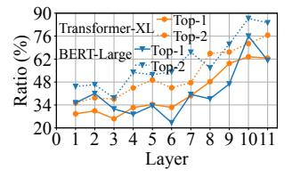

# Popularity based Scheduling

Lina tackles the design challenge by exploiting the tokenlevel expert selection pattern which we empirically establish now. Building upon this, we design a resource scheduler that

| Model& Dataset            | Layer | Top-4 |   |    |    |
|---------------------------|-------|-------|---|----|----|
| E C 3/1                   | 3     | 9     | 4 | 5  | 10 |
| Transformer-XL            | 4     | 5     | 7 | 8  | 10 |
| & Enwik8                  | 8     | 9     | 2 | 3  | 13 |
| (Text generation)         | 12    | 4     | 5 | 15 | 8  |
| DEDT LORGO                | 6     | 7     | 6 | 10 | 1  |
| BERT-Large & WMT En-De | 8     | 10    | 6 | 2  | 15 |
|                           | 10    | 9     | 4 | 11 | 8  |
| (Translation)             | 12    | 1     | 8 | 10 | 14 |

sampled MoE layer of two MoE mod-

Figure 9: Ratio of tokens that select **Table 2:** Top-4 popular experts in one of the top-k experts in layer i+ 1 given that they have selected the same expert in layer i.

replicates popular experts on proportionally more devices in order to better balance the workload.

Pattern in expert selection. Experts in MoE models are trained to specialize in different types of input. We find that a token's expert selection demonstrates a pattern across the MoE layers. Tokens that have selected the same expert in layer i tend to select the same expert again in layer i + 1. We trace the expert selection of sampled tokens. For each group of tokens that have selected the same expert in layer i, we calculate the ratio of them that in the next layer also select one of the same top-k experts ranked locally among the same group. Figure 9 plots this ratio averaged over token groups in two 12-layer MoE models. We see 41.94% tokens exhibit this pattern when k is 1 and 54.59% when k is 2, and deeper layers see more tokens with this pattern.

This observation makes intuition sense. The gating network has a simple architecture, and their routing or expert selection decision is made (largely) based on relatively simple features, such as the parts of speech of a word (noun, verb, etc.), and the meaning of the word (number, time, etc.) [32]. These features are fixed for each token. Meanwhile, experts focus on the local syntax information of each token rather than the cross-dependency within a sequence. For all these reasons, similar tokens naturally tend to be processed by the same or similar experts in each layer.

Estimating expert popularity. Though this pattern may not be sufficient to predict a particular token's expert selection accurately, it provides enough clues for us to estimate the overall expert popularity for a given batch. Specifically, Lina's estimation approach works as follows. In the profiling stage, we collect the expert selection results of all tokens when the load balancing loss is minimized and becomes stable. We then group tokens that select the same experts from layer i-l to layer i, which represent a unique sample path of experts used. For each sample path j, we compute the expert popularity distribution  $\Psi_i^{i+1}$  for layer i+1. Here l is the path length to control the accuracy-cost tradeoff in profiling: a larger path length leads to more accurate estimation for layer i + 1 at the expense of higher data collection and computation costs.

Then based on the profiled distributions  $\{\Psi\}$ , Lina can estimate the next layer's expert selection distribution for each sample path of experts traversed by a token in inference (starting from the l-th layer of the model). In each layer i, for a sample path i, we pick the top-k expert(s) of the subsequent layer from  $\Psi_j^{i+1}$  and use their probabilities  $\{P_j^{i+1}(e)\}$  to represent expert popularity for resource scheduling, where e denotes an expert. The reason why we only consider top-k experts is that they demand the most resources, and the remaining experts have low popularity (Figure 9). Note that this estimation happens before any MoE layer computation takes place.

**Two-phase scheduling.** During inference, Lina dynamically conducts layer-wise resource scheduling in two phases.

The first phase happens right after the expert popularity estimation at each MoE layer, when Lina relies on the estimation to replicate popular experts on more devices and pack unpopular ones onto fewer devices. Specifically, the total number of devices for expert e is determined by:

$$n_e = N \times \sum_{t=1}^{N_t} P_{j(t)}^{i+1}(e) / N_t, \tag{1}$$

That is, for the current batch of input with  $N_t$  tokens, using estimation from each token t's sample path j(t) up to layer i, the overall popularity of expert e is estimated as  $\sum_{t=1}^{N_t} P_{j(t)}^{i+1}(e)/N_t$  for layer i+1 accounting for all tokens. This requires the same proportion of devices assuming the expert parallelism degree is 1 (i.e. the number of devices equals the number of experts). For experts with the estimation  $n_e$ , we adopt the first-fit-decreasing heuristic to pack them into the empty devices so the total devices used are minimized. It is possible that some experts, being extremely unpopular (for this batch), are not amongst the top-k list of any tokens and thus do not have their  $n_e$  estimation. They are assigned evenly to the remaining free devices if any; otherwise are randomly assigned to a device.

In phase two, Lina fine-tunes the estimation-based scheduling decision after the gating network selects the actual experts. It checks if the selection result deviates significantly from the estimation, by comparing the overall top-2k experts. If the two lists are identical, no fine-tuning is needed and inference continues. Otherwise, the scheduler re-computes the resource allocation with the actual expert popularity now available following the same logic in phase 1. The fine-tuning phase does incur delay to collect the gating outputs and check against the estimation, which is necessary to deal with inaccurate estimation that turns out to be much more detrimental to performance, if left unchecked (§7.3).

### 6 Implementation

We implement Lina on DeepSpeed MoE and PyTorch using C++ and Python. PyTorch 1.10, CUDA 11, and NCCL 2.10 are used. We modify PyTorch's implementation of distributed training to support Lina in DeepSpeed. The implementation has  $\sim$ 7500 LoC.

### 6.1 Training

Lina's communication scheduler for training is deployed on all devices and runs a single thread. Since the communication scheduling is purely local in scope, no coordination is needed across the scheduler instances on different devices.

Communication scheduler. Each scheduler instance maintains a priority queue to schedule the micro-ops. The micro-op size is passed in as a hyperparameter. Lina uses the built-in APIs chunk and cat in LibTorch to partition the data in the token dimension. We avoid putting chunks from different gradients into the same micro-op to simplify the subsequent concatenation operation. Moreover, the scheduler stops launching allreduce micro-ops if the combining computation in backward pass, since this implies all-to-all is imminent. We pipeline all-to-all micro-op in the MoE layer. FFN is ready to start right after each all-to-all micro-op.

Expert packing coordinator. We embed a packing controller in the MoE model and it runs a single thread. Expert packing is dynamically adjusted after 10 training steps. In the forward pass, the controller records the completion times of all-to-all and FFN micro-ops. When FFN micro-ops are shorter than all-to-all, the controller starts to pack experts. First, we initialize the new process groups. Second, the controller inserts a one-time synchronous all-to-all to exchange expert parameters between packed devices that would be invoked at the upcoming iteration. Finally, multi-stream parallel execution is adopted for both forward and backward passes when more than one expert are hosted on a device.

#### 6.2 Inference

Resource scheduler. The inference scheduler runs on a dedicated thread on device 0 of the cluster and manages resource scheduling. Each device saves the weights of all experts in their host DRAM and the collected layer-wise expert popularity distribution using multiple unordered\_map, one for each layer. If GPU memory is in shortage, a device only loads one expert and the profiled distribution of one layer at a time.

In phase one of scheduling, all relevant communication happens by piggybacking the information on the regular all-to-all to reduce overheads. For each MoE layer, each device appends the popularity estimation to the first all-to-all for device 0. The scheduler computes the new expert-device mapping and instructs each device which expert and how many to host via the second all-to-all. We also include necessary information to coordinate all-to-all of the next layer, including the list of devices with the same expert, and how many to-kens each replica should handle to balance the load. Devices then swap in the expert weights for the next layer. All these procedures are pipelined with model computation.

In phase two, each device updates the actual expert popularity in a separate NCCL send to the scheduler. If no fine-tuning is required, the scheduler broadcasts a resume signal. This

only creates a negligible overhead as the transfer size is tiny. Otherwise, Lina broadcasts the fine-tuned expert-device mapping. The model computation is blocked during phase two until the scheduler's command is received.

All-to-all coordination. In inference, Lina uses all-to-all with an unequal split. That is, the transfer size to each device in all-to-all does not need to be the same. Using unequal split all-to-all can save the overhead of initializing multiple process groups. A placeholder data pointer is passed to all-to-all if no tokens are directed to a certain device.

Expert packing. Expert computation is sequential on devices hosting multiple experts. Each device loads the experts one at a time to perform computation and move on to the next packed expert. In this manner, Lina avoids placing extra strain on the GPU memory. The second all-to-all is launched when the computation for all packed experts is completed. We set a maximum number of experts per device to control the overhead of swapping the weights.

