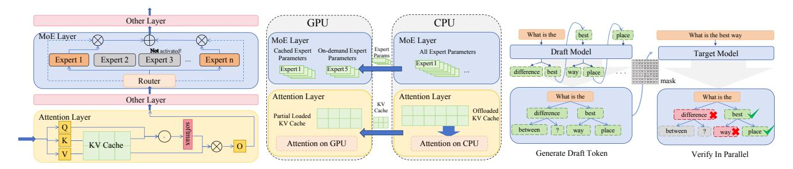
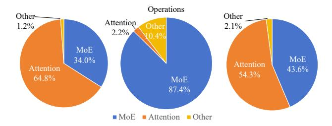

# 2 Background

#### 2.1 Mixture of Experts (MoE) Models

The Mixture of Experts (MoE) [\[27\]](#page-12-5) architecture has been widely adopted by recent state-of-the-art models such as Qwen [\[23\]](#page-12-0), Gemini [\[11\]](#page-11-0), deepseek [\[10\]](#page-11-1), mixtral [\[16\]](#page-11-2) and LLaMA [\[21\]](#page-11-3). As shown in Figure [1\(](#page-2-1)a), MoE models mainly include following components:

- Attention Layer: Attention mechanism is a core component of transformer-based architectures, enabling the model to weigh the relevance of different input tokens when generating outputs. In inference, especially for decoding stage, the attention operation is dominated by the access of the KV cache, which stores the key and value pairs for all previous tokens.
- MoE Layer: The MoE layer replaces the standard FFN with a mixture of experts, allowing the model to dynamically select a subset of experts for each input token. Though the theoretical computation of the MoE layer is similar to the standard FFN, it reduces the arithmetic intensity, i.e., the ratio of computation to memory access, due to the sparse activation of experts.
- Other Layers: Besides the attention and MoE layers, the model also includes other standard transformer components such as layer normalization, residual connections,

Figure 1. MoE model, offloading, and speculative decoding.

**Figure 2.** Proportion of cost of three kinds of layers.

and embedding layers. These components are essential for the overall functionality of the model but typically have a smaller impact on memory and computation compared to the attention and MoE layers.

Figure 2 demonstrates the proportion of memory and computation cost of the three kinds of layers in the Mixtral-8x7B model when running the APPS dataset on an A30 GPU with 250 GB of CPU memory. We observe that the KV cache and weight of experts dominate the memory consumption as well as the memory access cost of MoE models. Regarding computation operations, the MoE layer dominates while the attention layer is negligible. This divergence in memory and computation characteristics leads to different offloading strategies for MoE layers and attention layers as we will discuss in next section.

#### 2.2 Offloading techniques

Traditional tensor-based offloading. In the age of traditional transformer-based LLMs (using FFN instead of MoE), researchers have proposed various offloading techniques [4, 25, 28] to address the memory limitations of GPU. One of the representative works is FlexGen [28], which considers the partitioning of the tensors and organizes the order of the memory access to minimize the transfer cost. This becomes a standard offloading technique for LLMs, which can be applied to MoE models as well, while SpecMoEOff also adopts this technique.

**Offloading for MoE layers.** When shifting the focus from FFN to MoE layers, the sparse activation of experts introduces new challenges and opportunities for offloading. One

branch of approach is to exploit the sparsity of expert activations by only loading and caching the weights of the activated experts, thereby reducing the memory footprint and transfer cost. This works for small batch size, especially for batch size 1, as the activated experts are typically a small subset of the total experts. However, the small batch size results in low GPU utilization, as loading one expert can only process one or a few inputs, suffering from the transfer cost bottleneck. Another branch of approach combats the sparsity of MoE layers by increasing the batch size, which allows the GPU to process multiple inputs simultaneously after loading the expert weights into the HBM. One representative work is MoE-Lightning [6], which processes a larger batch size once the expert weights are loaded into the HBM. However, as will be demonstrated in Section 3, the transfer cost of MoE-Lightning still dominates the performance under the realistic settings, as the CPU DRAM size may still limit the batch size.

Offloading for KV cache. KV cache and its corresponding attention computation are also critical components in MoE models, which are both memory consuming and memoryaccess intensive. Several works [17, 28] aim to leverage the external memory, e.g., DRAM or disk storage, to maintain the KV cache, thereby reducing the memory footprint of MoE models. When KV cache is required, the offloaded KV cache will be loaded back to the GPU HBM for attention computation. Despite saving the memory footprint, several works [1] further propose CPU-based attention computation, as CPU has lower arithmetic intensity (Peak FLOPs / Peak Bandwidth) compared to GPU, which is suitable for the memorybound attention computation. Again, MoE-Lightning [6] adopts both techniques, i.e., offloading the KV cache to the CPU DRAM and performing the attention computation on the CPU, to reduce the HBM footprint and corresponding transfer cost, as well as to improve the CPU utilization.

Our target scenario: CPU-GPU cooperated offloading. We also notice that some recent works [25] further explore the SSD/disk, memory pool, cloud storage, and other external memory resources to offload the MoE models. However, as will be investigated in Section 3, the transfer cost dominates the performance of MoE offloading even with the

DRAM as external memory. Therefore, we focus on the CPU DRAM as the external memory and further explore the CPU computation.

## 2.3 Speculative Decoding

To aid the insufficient GPU utilization in LLM inference, speculative decoding [31] has been proposed to improve the parallelism and reduce the memory access of KV cache in large language models.

As shown in Figure 1(c), speculative decoding consists of two main components: the draft model and the target model. In the draft phase, a lightweight draft model will be iteratively called to generate a sequence [18]/tree [7] of draft tokens, which are then passed to the target model for verification. If the tokens are organized as a tree structure, an additional mask will be passed to the target model to represent the relationship between the draft tokens maintained as a sequence. In the verification phase, the original large language model, denoted as the target model, will verify the correctness of the draft tokens in one forward pass, which increases the parallelism and reduces the memory access of KV cache for verification of draft tokens.

Among various speculative decoding methods [7, 18, 19, 29], EAGLE [19] is a representative work that employs light-weight draft models to generate draft tokens. EAGLE leverages the hidden state of the original target LLM as input and designs a one layer traditional transformer including an attention layer and an FFN as the draft model. In this paper, SpecMoEOff adopts the EAGLE framework to implement speculative decoding for demonstrating the effectiveness of speculative decoding in MoE offloading scenarios, while SpecMoEOff can be easily extended to other speculative decoding methods.

