# SYMI: Efficient Mixture-of-Experts Training via Model and Optimizer State Decoupling

Athinagoras Skiadopoulos *Stanford University* askiad@stanford.edu

Mark Zhao *University of Colorado Boulder* myzhao@colorado.edu

Swapnil Gandhi *Stanford University & NVIDIA* gandhis@stanford.edu

Thomas Norrie<sup>∗</sup> *OpenAI* tnorrie@openai.com

Shrijeet Mukherjee<sup>∗</sup> *NVIDIA* shrijeetm@nvidia.com

Christos Kozyrakis *Stanford University & NVIDIA* kozyraki@stanford.edu

## Abstract

Mixture-of-Experts (MoE) models have become a widelyadopted solution to continue scaling model sizes without a corresponding linear increase in compute. During MoE model training, each input token is dynamically routed to a subset of experts – sparsely-activated feed-forward networks – within each transformer layer. The distribution of tokens assigned to each expert varies widely and rapidly over the course of training. To handle the wide load imbalance across experts, current systems are forced to either drop tokens assigned to popular experts, degrading convergence, or frequently rebalance resources allocated to each expert based on popularity, incurring high state migration overheads.

To break this performance-accuracy tradeoff, we introduce SYMI, an adaptive MoE training system. The key insight of SYMI is to decouple the placement of expert parameters from their large optimizer state. SYMI statically partitions the optimizer of each expert across all training nodes. Meanwhile, SYMI dynamically adjusts the placement of expert parameters by repurposing existing weight updates, avoiding migration overheads. In doing so, SYMI right-sizes the GPU resources allocated to each expert, on a *per-iteration* basis, with minimal overhead. Compared to state-of-the-art MoE training systems, DeepSpeed and FlexMoE, SYMI is able to achieve a 30.5% and 25.9% faster time-to-convergence, respectively.

## 1 Introduction

Recent breakthroughs in large language models (LLMs) have been largely unlocked by *massively scaling* their size, i.e., the number of parameters in the model [\[22\]](#page-13-0). State-of-the-art foundation models now consist of hundreds of billions to trillions of parameters [\[1,](#page-12-0) [5,](#page-12-1) [13,](#page-12-2) [26,](#page-13-1) [31,](#page-13-2) [38,](#page-13-3) [50,](#page-14-0) [56,](#page-14-1) [57,](#page-14-2) [62,](#page-15-0) [63\]](#page-15-1). Training such models already requires several weeks of compute on systems with thousands of GPUs – further scaling model size without architectural improvements is unsustainable.

Sparse architectures, which selectively activate parameters, are rapidly growing in popularity due to their compute efficiency. Most frontier models today, including GPT4 [\[38\]](#page-13-3), Llama 4 [\[31\]](#page-13-2), Gemini 2.5 [\[13\]](#page-12-2), Grok-1 [\[62\]](#page-15-0), Qwen3 [\[63\]](#page-15-1), and DeepSeek-R1 [\[14\]](#page-12-3) use the Mixture-of-Experts (MoE) architecture [\[11\]](#page-12-4). MoE models decouple parameter scaling from compute scaling by using each input token to train only a subset of parameters per layer (i.e., experts). Recent MoE models feature 8 to 512 experts per layer [\[9,](#page-12-5) [10,](#page-12-6) [18,](#page-12-7) [19,](#page-12-8) [26,](#page-13-1) [31,](#page-13-2) [44,](#page-14-3) [45\]](#page-14-4). Increasing the number of experts enables model size scaling with sublinear increase in compute demands.

To train MoE models, a learned router dynamically assigns input tokens to experts in each iteration. The distribution of tokens assigned to experts is highly dynamic, varying *widely* and *rapidly* across training iterations. As shown in Figure [2](#page-2-0) ([§2.1\)](#page-1-0), the number of tokens routed to each expert can fluctuate by over 16× in as few as 3 iterations. Thus, MoE training introduces a provisioning challenge. Letting experts process their full token load increases iteration latency, as popular experts become bottlenecks while less popular experts remain idle. Conversely, capping each expert's token processing capacity degrades convergence, as popular experts must drop excess tokens [\[11,](#page-12-4) [18,](#page-12-7) [64,](#page-15-2) [72,](#page-15-3) [73\]](#page-15-4). A non-uniform but static provisioning among experts is insufficient as expert popularity varies widely during training.

To break this *performance-accuracy tradeoff*, an ideal system would replicate experts non-uniformly and *adaptively* to their *dynamic popularity*. This would minimize token drops for better convergence without performance penalty. However, adaptive expert replication introduces major system challenges. Expert rebalancing incurs the heavy overhead of transferring expert parameters and optimizer states across GPUs. As a result, current systems that support adaptive expert replication limit rebalancing frequency, e.g., every 50-100 iterations [\[35,](#page-13-4) [65,](#page-15-5) [66\]](#page-15-6), thereby limiting the performance and accuracy benefits of adaptive replication.

The optimizer state in particular is massive. For example, the Adam optimizer of an 8B model consumes 96.6GB (excluding gradients) [\[29\]](#page-13-5), exceeding an H100's HBM [\[6\]](#page-12-9). In

<sup>∗</sup>Work done while at Enfabrica.

modern MoE models, individual experts often surpass this 8B mark [1, 9, 10, 31, 62, 71, 72]. In the trillion-parameter regime, experts scale further, commensurately amplifying the per-expert optimizer footprint. Consequently, optimizer sharding and/or offloading for both the dense and sparse model components are widely used and essential for training large models [26,47,48,54,68,70]. Our work is situated within this context of optimizer sharding for large MoE models.

In this paper, we show that expert replication can be rebalanced on every iteration without extra data movement compared to normal training. Our key insight is to decouple the adaptively-replicated expert parameters from their optimizer state. We realize this insight in a system called SYMI to achieve efficient and frequent adaptive expert replication. SYMI evenly and statically partitions each expert's optimizer state across host memory, independently from the replication scheme of expert parameters in GPU memory. SYMI never relocates the optimizer state but adjusts experts' replication proportionally to their popularity on a per-iteration basis. SYMI reshuffles expert weights by repurposing existing communication during the optimizer pass. Whether a GPU receives the updated weights of a previous or a newly assigned expert, data volume is the same. Hence, SYMI does not introduce any extra data movement during expert rebalancing.

SYMI's adaptive replication exhibits new communication patterns transferring gradients and weights between dynamic experts and the static optimizer. We introduce new collectives to rebalance experts, replacing existing communication performed in static systems. While the overall communication volume remains invariant, SYMI alters expert-to-optimizer locality. SYMI's collectives reduce communication cost by implementing locality-enhanced expert placement (favoring placement of same-class expert replicas within the same rank), and load-balanced gradient aggregation (avoiding bottlenecks during gradient communication to the optimizer). SYMI then materializes each iteration's expert placement by dynamically adjusting the ranks receiving the updated optimizer weights.

We implemented SYMI on top of DeepSpeed, demonstrating 30.5% and 25.9% faster convergence compared to DeepSpeed and coarse-grained adaptive expert replication solutions, respectively. These gains stem from SYMI dropping 43%–69% fewer tokens than compared systems, while incurring no additional overhead relative to DeepSpeed. In contrast, existing adaptive expert replication methods increase iteration latency by  $2.46\times-4.10\times$  during rebalancing.

### 2 Background and Motivation

### <span id="page-1-0"></span>2.1 Mixture-of-Experts

**MoE Architecture.** To enable continued parameter scaling without a corresponding increase in compute requirements, many modern LLMs [1, 13, 26, 31, 38, 62] rely on an MoE architecture. As shown in Figure 1, MoE architectures are

<span id="page-1-1"></span>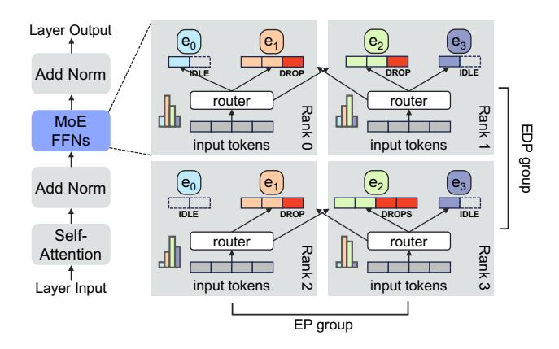

Figure 1: Overview of an MoE layer and expert parallelism.

built upon a traditional Transformer architecture [58], except that the traditional dense feed-forward network (FFN) in each layer is replaced with a number of *experts*. Each expert has the same dimensions as the original FFN, but is trained independently, increasing the total number of trainable parameters of the model. Each layer routes each input token to a subset of experts, allowing each expert to specialize for a distinct portion of the input space [11]. Modern LLMs rely on a large and increasing number of experts, ranging from 8 to upwards of 512 of experts per layer [9, 10, 18, 19, 26, 31, 44, 45].

As shown in Figure 1, each MoE layer selects the expert(s) to activate for each token via a learned *router* or *gate network*. The router receives the input token embeddings from the layer's attention block and selects the Top-k experts for each token. The selected experts are activated and process their assigned tokens. Notably, for k = 1 (each token is routed to a single expert), the sparsely-activated MoE model performs similar number of FLOPS per token compared to the respective dense model.

**Expert Parallelism.** To avoid the memory overhead of allocating a copy of every expert on every rank, systems use expert parallelism [11, 23, 51]. As illustrated in Figure 1, expert parallelism distributes experts across ranks (i.e., GPUs). Each rank hosts a fixed number of *expert slots*, and each slot is assigned an *expert classs*. The set of ranks hosting the different expert classes form an expert parallel (EP) partition. Scaling out, each expert class is replicated an equal number of times with expert data parallelism (EDP) [55]. We refer to the sum of all replicas as *expert instances*.

Because expert instances are distributed across ranks within each EP partition, two all-to-all collective communications are needed in the forward pass to scatter input tokens and gather expert outputs, and two all-to-all collectives are needed in the backward pass to scatter and gather gradients. Furthermore, an all-reduce collective is needed within each EDP partition in the backward pass to synchronize gradients across expert instances of the same expert class, as with data parallelism.

Dynamic Expert Activation. The router dynamically as-

<span id="page-2-0"></span>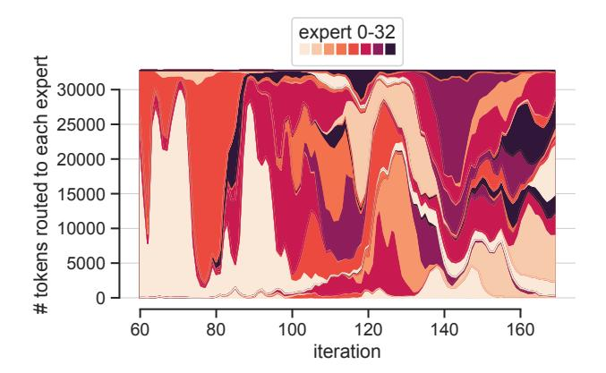

Figure 2: A single layer's expert popularity distribution during the training of GPT-Small (125M) extended with 32 experts. The distribution shifts dramatically within very few iterations.

<span id="page-2-1"></span>Table 1: The convergence-latency tradeoff for different expert capacities. Shown is GPT-Small (125M) extended with 32 experts per layer, ran in a 16 GPU cluster.

| Expert<br>Capacity | Avg. Token<br>Survival (%) | Iters to<br>Target Loss | Forward Pass<br>Latency (ms) |
|--------------------|----------------------------|-------------------------|------------------------------|
| ×1                 | 44.90                      | 618                     | 455.41                       |
| ×2                 | 65.56                      | 527                     | 506.77                       |
| ×4                 | 74.91                      | 478                     | 571.42                       |

signs tokens to expert classes on each iteration. As shown in Figure [2,](#page-2-0) the token distribution across experts can be both *highly skewed* – different expert classes receive disproportionately more tokens, and *highly dynamic* – varying significantly, even within a few iterations [\[11,](#page-12-4) [16,](#page-12-10) [18,](#page-12-7) [25](#page-13-7)[–27,](#page-13-8) [35,](#page-13-4) [59,](#page-15-11) [61,](#page-15-12) [66\]](#page-15-6). Figure [2](#page-2-0) shows cases where expert token load fluctuates by over 16× within only 3 iterations (e.g., iterations 72-75).

The Convergence-Latency Tradeoff: In traditional expert parallelism with uniform replication, popular experts become latency bottlenecks [\[16,](#page-12-10) [35,](#page-13-4) [66\]](#page-15-6). Specifically, devices hosting popular experts delay iteration completion as they process more tokens while other devices idle. Additionally, devices with popular experts become a bottleneck in the all-to-all collectives, receiving more tokens and sending more activations.

To manage this load imbalance, the standard practice in today's MoE systems is setting an expert *capacity*, which defines the maximum number of tokens each expert class can process [\[11\]](#page-12-4). Tokens that exceed this expert capacity are dropped, improving system latency. However, dropping tokens results in slower convergence and model quality degradation [\[3,](#page-12-11)[11,](#page-12-4)[18,](#page-12-7)[64,](#page-15-2)[72,](#page-15-3)[73\]](#page-15-4). Table [1](#page-2-1) demonstrates this tradeoff: reducing expert capacity yields ∼20% latency improvement, especially critical for modern AI systems that train models over thousands of GPUs. However, higher capacity increases

the token survival rate (by ∼30 percentage points) which is shown to be directly correlated with convergence speed. Consequently, MoE training systems have an intrinsic tradeoff between model convergence and system performance.

On top of expert capacity, a number of techniques have been introduced to alleviate the token load imbalance [\[12,](#page-12-12) [23,](#page-13-6) [60,](#page-15-13) [72\]](#page-15-3). For example, an auxiliary load-balancing loss is commonly applied to penalize uneven expert utilization, thereby reducing token drops and latency. Its coefficient, however, requires careful tuning. High auxiliary loss involvement harms convergence; it can overwhelm the main loss objective and steer experts towards sub-optimal specialization [\[8,](#page-12-13) [11,](#page-12-4) [15,](#page-12-14) [35,](#page-13-4) [37,](#page-13-9) [60,](#page-15-13) [72,](#page-15-3) [73\]](#page-15-4), further highlighting the convergence-latency tradeoff.

## <span id="page-2-3"></span>2.2 Adaptive Expert Replication

Dynamic, Load-Aware Expert Replication. The root cause of the convergence-latency tradeoff is that expert replication is uniform and static, while expert popularity is skewed and dynamic. An adaptive expert replication strategy can address this issue by adjusting each expert's replication degree dynamically, in proportion to their popularity. In the ideal case where replication precisely matches popularity, tokens can be routed to their assigned expert classes with minimum iteration latency and minimum drop rate. Popular expert classes receive sufficient replicas to handle their token load without extra overhead or token drops, while less popular expert classes are allocated fewer replicas to avoid idle time.

Rebalancing Cost. Unfortunately, adaptive expert replication comes with major system challenges. Every expert rebalancing produces high overhead due to a blocking shuffle required to redistribute the expert's state across ranks. Specifically, assigning a new expert to a slot requires moving both the expert's weights (2B per parameter) and *optimizer state* (16B per parameter)[1](#page-2-2) [\[47\]](#page-14-5) across GPUs. For example, for a typical model dimension of 12288 as in GPT3-175B [\[2,](#page-12-15) [34\]](#page-13-10), and a state-of-the-art 400 Gbps GPU-to-GPU InfiniBand interconnect, rebalancing a *single* expert within a *single* layer would require transferring 3.375GB of model weights and 27GB of optimizer state [\[47\]](#page-14-5), incurring a latency of 0.0675s and 0.54s, respectively. Moving a single expert's optimizer in particular is on par with typical iteration latencies of 1s [\[34\]](#page-13-10). Given the highly dynamic nature of expert popularity, frequently rebalancing experts to align with shifting popularities incurs overheads impractical for current systems.

Current Approaches. Modern MoE frameworks employ adhoc solutions to sidestep this challenge. Existing adaptive expert replication systems rebalance experts infrequently based on hard-coded thresholds, use heuristics, and rebalance only a subset of experts per update [\[35,](#page-13-4) [65,](#page-15-5) [66\]](#page-15-6). FlexMoE [\[35\]](#page-13-4) triggers expert rebalancing based on a predefined popularity skewness threshold (equivalent to every 50-100 iterations)

<span id="page-2-2"></span><sup>1</sup>We assume fp16/fp32 mixed precision training with the Adam optimizer.

<span id="page-3-0"></span>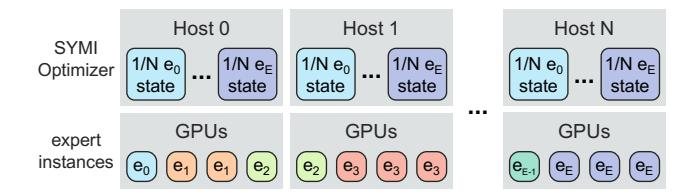

Figure 3: SYMI decouples the model and optimizer state placement. Expert replication is non-uniform and dynamic, while each expert's optimizer remains static, uniformly sharded across all hosts.

and iteratively shifts by one replica the most and least popular experts until another cost-based threshold is crossed.

These approaches cannot handle the frequent variation in expert distributions shown in Figure 2, causing them to leave accuracy and performance benefits on the table as with static replication mechanisms. An ideal system should enable *fine-grained adaptive replication*, at each iteration, while doing so *efficiently*, without overheads from moving expert state.

### <span id="page-3-4"></span>3 SYMI Design

### 3.1 Key Insight

The key challenge in dynamically and frequently rebalancing experts is managing the overhead of moving expert weights, and more critically, the large optimizer state – traditionally tied to its corresponding weights. We design SYMI to eliminate this overhead entirely.

Our key insight is to **decouple the experts optimizer state from expert instances**, allowing the optimizer offloading, sharding, and placement to be independent of the replication and placement of its corresponding expert instance(s). As shown in Figure 3, SYMI offloads<sup>2</sup> and statically shards the optimizer state for each expert uniformly across all nodes, regardless of expert placement. Meanwhile, SYMI replicates experts non-uniformly and dynamically, right-sizing replication according to popularity.

No-overhead adaptive replication. In contrast to existing adaptive replication solutions, SYMI never moves the optimizer state. This avoids the immense cost of migrating optimizer state with each rebalancing. While optimizer state is static, model state (expert instances) is dynamic. At the end of each iteration, the optimizer always needs to perform necessary communication to move the updated expert weights to their corresponding instances in GPUs. SYMI makes the critical observation that this data movement volume is invariant, regardless of the actual data content corresponding to different expert assignments. The optimizer can choose to transfer to any given expert slot either the updated weights of

<span id="page-3-2"></span>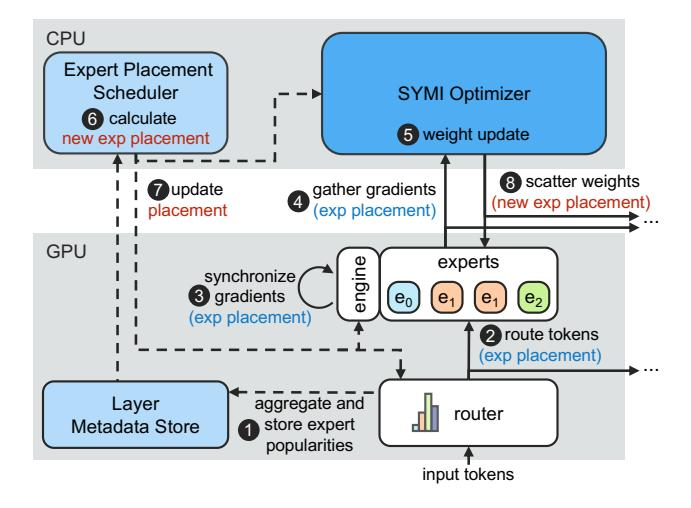

Figure 4: SYMI design block diagram. Showing data (solid lines) and metadata (dashed lines) flow in a single rank through a training iteration.

the previously assigned expert or those of a newly assigned one. As a result, SYMI enables shuffling into a new, arbitrary expert placement after each optimizer step, without requiring any additional data movement.

Continuous adaptive replication. SYMI replicates experts proportionally to their popularity, thus minimizing token drops and improving model convergence. In traditional expert parallelism, all experts are allocated the same number of replicas. As explained in §2.1, this uniform allocation forces popular experts to drop excess tokens once their capacity is exceeded, slowing down convergence.

SYMI, by contrast, enables experts' replication to quickly follow their dynamic popularity. Having eliminated data movement overheads during expert rebalancing, SYMI can update the expert placement on *every iteration*. SYMI reliably predicts expert popularity by mimicking the previous iteration's demand, and proportionally adjusts replication degrees. This allows popular experts to scale their effective capacity without a latency penalty, dramatically reducing token drops and accelerating convergence. SYMI's fine-grained, constraint-free strategy is far simpler, yet much more effective than coarser-grain predictive/heuristic-based schemes.

#### 3.2 SYMI Design Overview

Figure 4 shows SYMI's block diagram and enumerates the steps executed throughout an entire training iteration. We show a single MoE layer in a single rank (i.e., GPU)<sup>3</sup>, and the process is repeated for all other layers and ranks. The attention and normalization components are omitted; SYMI focuses

<span id="page-3-1"></span><sup>&</sup>lt;sup>2</sup>Offloading the optimizer cleanly separates static from dynamic components in SYMI. Still, our design principles are independent of the memory tier where the optimizer is placed (see Section 6).

<span id="page-3-3"></span><sup>&</sup>lt;sup>3</sup>Our design operates at the level of full expert instances, and techniques that split instances across ranks (e.g., tensor parallelism) are orthogonal to our approach, as discussed in Section 6. For simplicity of presentation here, we assume that each rank contains whole experts.

only on the expert MLPs and does not change the rest of the Transformer layer as it is handled by current systems like DeepSpeed [\[45\]](#page-14-4). Specifically, SYMI introduces a set of core components that include the SYMI *Optimizer*, which manages communication and expert updates, the *Expert Placement Scheduler*, responsible for dynamic expert assignment, and a *Layer Metadata Store* that tracks expert popularity. SYMI also extends the existing expert *router* and runtime *engine* to support dynamic expert replication.

Figure [4](#page-3-2) illustrates how these components operate over a full training iteration. During the *forward pass*, SYMI gathers expert popularity statistics and distributes tokens to the current (non-uniform) expert placement. During the *backward pass*, SYMI synchronizes expert gradients across each expert class's replicas. Finally, SYMI's *optimizer step* gathers expert gradients, calculates the next iteration's expert placement, and performs rebalancing by distributing the updated weights according to the new placement.

Forward pass: Within each layer, the router takes in as input the batch token embeddings from the local attention block. The router assigns tokens to expert classes, independently of their replication. 1 We extend the router to aggregate the number of tokens assigned to each expert class, via an allreduce collective across all ranks. The tensors participating in the all-reduce are small, containing only a single element for each expert class, so the overhead of the collective is negligible as shown in [§5.3.](#page-10-1) SYMI stores the resulting globallyconsistent expert popularity in the Layer Metadata Store, to be later used by the Expert Placement Scheduler. 2 The router maps tokens to expert classes, as usual. SYMI then loadbalances the tokens for a given expert class across its replicated instances. Because SYMI replicates experts instances (i.e., the total capacity of each expert class) proportional to demand, SYMI minimizes drops and improves convergence.

Backward pass: 3 During the backward pass, the runtime engine (e.g., DeepSpeed) performs an all-reduce step to synchronize expert gradients. While this all-reduce exists in current engines, SYMI changes the ranks that contain instances for each expert class on a per-iteration basis. Thus, SYMI introduces a new locality-enhanced all-reduce implementation (Section [4\)](#page-6-0) to efficiently synchronize gradients across the dynamic communication groups.

Optimizer step: SYMI's Optimizer manages the decoupled optimizer state for all expert instances. The SYMI Optimizer is offloaded to host memory and is uniformly partitioned for all experts across all nodes. We prove this strategy is latencyoptimal in Appendix [A.1\)](#page-16-0). 4 The SYMI Optimizer in each node gathers its corresponding gradient partitions, 5 and uses them to perform the optimizer step and produce the updated weights (as in baseline systems). 6 Meanwhile, the Expert Placement Scheduler ([§3.4\)](#page-6-1) collects this iteration's expert distribution from the Layer Metadata Store and calculates

<span id="page-4-1"></span>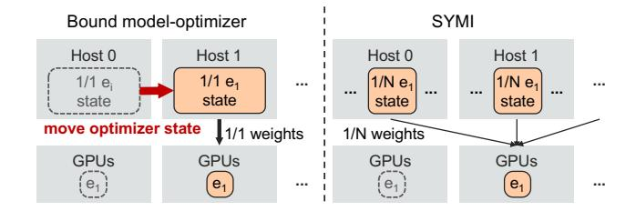

Figure 5: Current systems (left) bind optimizer state to expert instances, requiring costly optimizer state migration during expert rebalancing. SYMI (right) keeps the optimizer static and eliminates this overhead.

the expert instance allocation for the next iteration[4](#page-4-0) . 7 SYMI updates the SYMI Optimizer, runtime engine, and router with the new expert placement. 8 The SYMI Optimizer finally sends the updated expert weights to slots according to the new, rebalanced schedule.

We next prove that our collective communication requires no additional data movement and has equivalent communication cost compared to the equivalent steps 3 , 4 and 8 of baseline static systems.

## <span id="page-4-2"></span>3.3 No-overhead Adaptive Replication

Current systems co-locate model and optimizer (partitioned or not) state. The optimizer state accounts for the majority of an expert's memory footprint ([§2.2:](#page-2-3) 8× more than model weights). Consequently, current adaptive expert replication solutions suffer from significant communication overhead moving optimizer state together with its respective expert's weights. This overhead becomes especially problematic given the need to continuously rebalance expert instances.

As shown in Figure [5,](#page-4-1) SYMI avoids this overhead entirely. SYMI develops a clean separation between *static optimizer state in host memory* and *dynamic expert weights in accelerators*. Similar to ZeRO-1 [\[46\]](#page-14-10), SYMI offloads optimizer state to host memory. However, unlike ZeRO, SYMI decouples the offloaded optimizer from expert instance placement; SYMI uniformly partitions each expert's optimizer across all *N* nodes, and changes the expert class assigned to each GPU expert slot on every iteration.

Our design successfully eliminates the optimizer migration overhead. The remaining challenge is to avoid introducing overhead when relocating experts. SYMI's insight is to *perform rebalancing by leveraging existing data movement*, rather than introducing additional communication to shuffle weights across GPUs. In particular, the SYMI Optimizer disregards the previous placement after the optimizer step, and materializes the new expert placement by transferring the updated weights to each expert slot according to the next iteration's rebalanced schedule.

<span id="page-4-0"></span><sup>4</sup> In practice, step 6 may execute earlier, even right after step 1.

In total, the communication needed to rebalance expert state can be split in two phases. The *Grad Communication Phase* synchronizes and collects expert gradients from expert instances to the SYMI Optimizer, based on the previous expert placement. The *Weight Communication Phase* distributes the updated expert weights from the SYMI Optimizer to expert slots based on the new expert placement.

To show that SYMI introduces no overheads, we compute (I) the total optimizer state footprint, (II) the total data IO in each phase, and (III) the communication cost of each phase using SYMI and a baseline design with static expert replication and offloaded optimizer like DeepSpeed [55]. In the baseline static design, each expert is replicated a constant number of times, and the corresponding optimizer state is uniformly sharded across the nodes hosting that expert.

<span id="page-5-1"></span>

| N                | # nodes in the training cluster                   |
|------------------|---------------------------------------------------|
| $\boldsymbol{E}$ | # expert classes                                  |
| S                | # expert slots per rank                           |
| r                | # expert replicas (static baseline)               |
| $r_i$            | # expert replicas for expert $e_i$ (SYMI)         |
| $BW_{pci}$       | local GPU-CPU interconnect (e.g., PCIe) bandwidth |
| $BW_{net}$       | cross-node GPU-GPU network (e.g., IB) bandwidth   |
| G                | gradients data size for one expert instance       |
| W                | weights data size for one expert instance         |
| O                | optimizer state data size for one expert class    |
| M                | total optimizer memory footprint                  |
| $D_{G/W}$        | total data transferred in each phase              |
| $T_{G/W}$        | communication cost per rank in each phase         |
|                  |                                                   |

Table 2: Variable Definitions

We use the notation<sup>5</sup> in Table 2. Notice that the total number of expert instances in the system are:

$$rE = sN$$
, for the static baseline (1)

$$\sum_{e:} r_i = sN, \text{ for SYMI}$$
 (2)

To illustrate scale, we often accompany the equations with a representative example extending a GPT3-175B model (G = W = 3.375GB and O = 27GB) [2] with E = 64 experts [26], trained in a cluster with N = 2048, s = 2,  $BW_{pci} = 64\text{GB/s}$ ,  $BW_{net} = 400\text{Gbps}$  [6].

(I) Optimizer Memory Footprint We compare the total memory footprint of the SYMI Optimizer to the static baseline. The static baseline partitions the optimizer of each expert r-ways, following expert data parallelism. SYMI partitions the optimizer of each expert across all N nodes.

Both designs have the same memory footprint:

$$M^{static} = E \frac{1}{r}rO = EO$$
  
 $M^{SYMI} = E \frac{1}{N}NO = EO$ 

which is  $\sim$ 1.7TB per layer, equally distributed over the host memory of the cluster.

(II) **Data Transferred** We compute the total data involved in communication, regardless of the collective implementation (e.g. different all-reduce algorithms).

For the *Grad Communication Phase*, for all experts each optimizer partition needs as input the corresponding gradient shard, synchronized across all expert replicas: for each expert  $(e_i)$ , all expert replicas  $(r_i)$  participate in exchanging their gradients shards  $(\frac{G}{\#partitions})$  corresponding to each optimizer partition (#partitions).

For the Weight Communication Phase, each expert instance needs to receive the concatenation of all weight shards: each expert  $(e_i)$ , receives the full partitioned weights  $(\#partitions \times \frac{G}{\#partitions})$  in each replica  $(r_i)$ .

The above are formulated as:

$$D_{G}^{static} = Er \frac{G}{r} r = rEG \stackrel{(1)}{==} sNG$$

$$D_{W}^{static} = Er \frac{W}{r} r = rEW \stackrel{(1)}{==} sNW$$

$$D_{G}^{SYMI} = \sum_{e_{i}} r_{i} \frac{G}{N} N \stackrel{(2)}{==} sNG$$

$$D_{W}^{SYMI} = \sum_{e_{i}} N \frac{W}{N} r_{i} \stackrel{(2)}{==} sNW$$

showing that an equal volume of data (27TB total, involving all nodes and all networks) is moved on every iteration in both SYMI and the static baseline.

(III) Communication Cost At this point, we have proved that SYMI communicates the same volume of data as static expert replication. However, the locality of the optimizer state and expert slots differ in our design. We next show that this introduces negligible communication overhead.

In the *Grad Communication Phase*, each rank collects the synchronized (reduced) expert gradient shards corresponding to the local optimizer partitions via the backend network, and then transfers these gradient shards to host memory via the CPU-GPU interconnect (e.g., PCIe).

Similarly, in the *Weight Communication Phase*, the expert optimizer lands the updated weight shards in GPU HBM via PCIe, and then transfers the weight shards to any corresponding remote expert replicas through the backend network.

<span id="page-5-0"></span><sup>&</sup>lt;sup>5</sup>For simplicity, this model assumes that each node contains a single GPU rank with *s* expert slots. This translates to *s* total slots across a node's NVLink-connected GPUs, with experts possibly sharded via tensor parallelism.

The full computations are provided in Appendix A.2, and the resulting expressions are summarized below:

$$\begin{split} T_G^{static} &= \frac{E}{N} \frac{G}{BW_{pci}} + \frac{sN - E}{N} \frac{G}{BW_{net}} \\ T_W^{static} &= \frac{E}{N} \frac{W}{BW_{pci}} + \frac{sN - E}{N} \frac{W}{BW_{net}} \\ T_G^{\text{SYMI}} &= \frac{E}{N} \frac{G}{BW_{pci}} + \frac{sN - s}{N} \frac{G}{BW_{net}} \\ T_W^{\text{SYMI}} &= \frac{E}{N} \frac{W}{BW_{pci}} + \frac{sN - s}{N} \frac{W}{BW_{net}} \end{split}$$

We compare the resulting formulas and find that SYMI presents only marginally more communication cost (due to the reduced expert-optimizer locality). This small increase is equal to  $\frac{\Delta T}{T^{static}} = \frac{E-s}{sN-E(1-\frac{BW_{net}}{BW_{net}})}$ .

In practice, this extra communication overhead between the static baseline and SYMI is negligible. In our example, SYMI would incur only 1.52% extra communication cost per iteration (~0.273s vs ~0.269s total communication). In summary, SYMI enables experts to be efficiently rebalanced at a per-iteration granularity.

## <span id="page-6-1"></span>3.4 Expert Placement Manipulation

As discussed in Section 2.1, current systems impose a fixed capacity limit on the number of tokens that can be routed to each expert class. Expert capacity aims to avoid long iterations and idle resources due to the high variance in expert popularity. However, this causes dropped tokens, which harms training convergence.

Expert capacity in current systems is defined as:

$$\operatorname{capacity}(e_i) = \operatorname{capacity\_factor} \times \frac{\operatorname{tokens\_per\_batch}}{E}$$

$$\underbrace{\overset{(1)}{=}}_{\text{capacity\_factor}} \times \frac{\operatorname{tokens\_per\_batch}}{sN} \times r$$

$$\underbrace{\overset{(1)}{=}}_{\text{slot\_capacity}} \times r$$

Setting the capacity\_factor to 1.0 results in the lowest iteration latency, but also the highest drop rate.

Conversely, SYMI allows experts to be replicated non-uniformly, effectively scaling each expert class's total capacity by the dynamic number of its assigned replicas ( $r_i$ ):

$$capacity^{SYMI}(e_i) = slot\_capacity \times r_i$$

If each expert's replication degree is proportional to its popularity (barring rounding errors), tokens can be routed to their assigned expert classes with minimum drop rate and minimum iteration latency. Popular expert classes have enough instances to serve all their assigned tokens without token drops

or extra latency. In this ideal scenario, the capacity\_factor is irrelevant.

However, the system can precisely capture each iteration's expert popularity only after the router assignment. The cost of reshuffling experts between expert assignment and token routing would be prohibitive. Thus, SYMI relies only on past popularity information and materializes the expert placement in the previous iteration, avoiding this cost.

Specifically, after the router assignment, SYMI invokes an all-reduce collective to aggregate the number of tokens assigned to each expert class. The resulting array of sums represents the current iteration's expert popularity. SYMI stores the popularity array into the local rank's Layer Metadata Store. The Expert Placement Scheduler retrieves its desired input information from the Layer Metadata Store, and produces the expert placement schedule for the next iteration. The overhead of those added components is negligible (see §5.3).

The Expert Placement Scheduler can leverage any historical popularity information to derive the next iteration's placement. In this paper, we chose the simple, yet very effective policy; expert placement mimics the previous iteration's popularity. As discussed in §2.1, expert popularity can shift dramatically within as few as 3 iterations, highlighting the need for per-iteration rebalancing. At the same time, expert popularity distributions are smooth enough so that the previous iteration serves as a reliable proxy for the next. In our evaluation, we demonstrate that our policy is sufficient for replication to accurately match popularity, enabling SYMI to drop 43%-64% fewer tokens than systems that rebalance experts on 10-100 iteration intervals (§5.2).

The Expert Placement Scheduler computes how expert instances are distributed across devices in each iteration. The scheduler assigns replicas to experts in proportion to their captured popularity, assigning at least one instance per expert so that all experts remain reachable. The scheduler then places the assigned instances *contiguously across slots*, favoring placement of same-class experts within the same rank. The full algorithm is provided in Appendix A.3. The Expert Placement Scheduler runs locally on every rank. Because the Expert Placement Scheduler's algorithm is deterministic, the only control-flow coordination needed between ranks is to aggregate the input expert popularities.

#### <span id="page-6-0"></span>4 SYMI Collective Communication

We implemented SYMI on top of DeepSpeed [48]. This section presents SYMI's collective communication mechanisms that enable the per-iteration adaptive replication described in Section 3. We show how SYMI synchronizes gradients across instances of the same expert class (§4.1), while efficiently managing distributed communication groups (§4.2). We then present how SYMI collects the gradients (§4.3) and distributes the updated weights to expert slots (§4.4).

<span id="page-7-4"></span>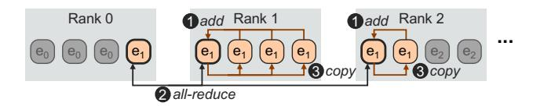

Figure 6: SYMI extends the all-reduce implementation allowing intra-rank expert replication.

#### <span id="page-7-0"></span>4.1 Intra+Inter Rank All-Reduce

In principle, a partitioned optimizer synchronizes gradients with communication size of  $\frac{(r-1)G}{r}$  (as in ZeRO-2 [49]). This is a reduce-scatter collective – the first half of an all-reduce. In practice, existing frameworks perform the full all-reduce collective across the r data-parallel partitions with communication size of  $2\frac{(r-1)G}{r}$ .

Existing all-reduce collective implementations synchronize tensors across different ranks, but not within them [7, 41], preventing experts from being freely allocated to expert slots. Each expert can only be replicated across different ranks up to N times, instead of up to sN allowing multiple instances of the same expert class on the same device. This constraint makes expert scheduling complicated and often leads to sub-optimal schedules. We have empirically found that this constraint can increase token drops by up to 20%.

SYMI proposes a novel all-reduce implementation that allows simultaneously both inter- and intra- rank expert data parallelism, removing replication restrictions. Figure 6 illustrates how our proposal manages experts replicated both within and across ranks. 1 For a given expert class, each rank elects a slot representative and the remaining expert slots within the rank add their tensors to the representative. 2 Then, an inter-rank all-reduce is applied only across each rank's representative slots. 3 Finally, the representative slot in each rank normalizes and copies the all-reduced gradients to the remaining slots, completing the all-reduce.

Besides enabling arbitrary expert placement schedules, our all-reduce implementation synchronizes instances of each expert class with less inter-node network traffic compared to schedules that would have to spread equally-as-many instances across different ranks. SYMI leverages this property in full; the Expert Placement Scheduler (§3.4) assigns expert instances contiguously first across slots within a rank and then across ranks.

#### <span id="page-7-1"></span>4.2 Communication Group Management

As replication patterns evolve, the required all-reduce communication in the backward pass may involve a varying set of ranks for each given expert. NCCL mandates that collective operations occur over all ranks in explicitly defined communication groups [42]. Consequently, dynamic replication requires creating a new communication group for each

expert, at each layer, potentially on every iteration. This operation includes blocking, single-threaded synchronization and may take more than 1,000 seconds in large clusters (e.g., N = 2048) [21]. To address this prohibitive overhead, SYMI pre-registers all necessary communication groups at initialization time. To avoid registering all possible  $2^N$  rank combinations, we leverage that the Expert Placement Scheduler (§3.4) assigns experts contiguously across ranks. Thus, we only register groups of consecutive ranks, requiring SYMI to only manage  $\frac{N(N-1)}{2}$  groups. This allows us to reuse the same pre-initialized groups across different experts and layers, ensuring zero group-creation overhead during training.

#### <span id="page-7-2"></span>4.3 Gradient Communication Load-Balance

Once gradient synchronization is complete, the SYMI Optimizer on each rank proceeds to update its state by fetching its corresponding gradient partitions. To coordinate this transfer efficiently, SYMI selects a unique expert instance as the source for each expert class's gradient shard. To minimize communication cost, SYMI prioritizes local expert—optimizer transfers whenever possible, whereas remote transfers are distributed in a round-robin fashion across available expert replicas to avoid network contention and hotspots. The full gradient collection algorithm is provided in Appendix A.4.

## <span id="page-7-3"></span>4.4 New Expert Placement Materialization

Finally, the SYMI Optimizer computes the updated weights and distributes them to expert slots according to the next iteration's expert placement. SYMI implements both the gradient collection (§4.3) and the weight update with batch point-to-point communication [43]. SYMI identifies the participating send/receive ranks and issues a batch\_isend\_irecv operation across all experts.

#### 5 Evaluation

**Experimental Setup.** We compare SYMI to two state-of-the-art baselines. DeepSpeed [48] represents the state-of-the-art *static* baseline, which does not perform any adaptive replication. We also compare against the state-of-the-art *adaptive replication* baseline, FlexMoE [35]. We ran experiments on an Azure cluster with 16 NC24ads-v4 instances. Each instance contains an NVIDIA A100 80GB GPU with a 32 GB/s PCIe 4.0 interconnect and a 100Gbps ConnectX-5 NIC.

All systems set the capacity\_factor to 1.0, the auxiliary loss coefficient to  $10^{-5}$ , and use Top-k=1 routing with 16 expert classes and 4 expert slots per GPU, totaling 64 expert instances for every layer. DeepSpeed allocates an equal number of expert instances (4) for each expert class, distributed across different ranks as DeepSpeed does not support intrarank expert data parallelism. For all systems, we set the tensor and pipeline parallelism degrees to 1, as these strategies are

<span id="page-8-1"></span>Table 3: Total training time (in minutes) to reach target loss.

| DeepSpeed | FlexMoE-100 | FlexMoE-50 | FlexMoE-10 | Symi   |
|-----------|-------------|------------|------------|--------|
| 147.84    | 145.42      | 141.60     | 138.61     | 102.68 |

orthogonal to our design. For non-expert components, we use a data parallelism degree of 16 to match the world size [34]. We configured DeepSpeed with ZeRO-1 (i.e., optimizer offloaded to CPU DRAM and evenly sharded across the nodes containing instances of the same expert). SYMI partitions the optimizer of all experts uniformly across all ranks.

Since FlexMoE does not have an open source implementation, we implemented FlexMoE's expert scheduling policy over SYMI. As in the original implementation, our FlexMoE implementation ties each expert's full optimizer state to its expert instances. Since the optimizer must remain local to its expert, during rebalancing the entire optimizer state is transferred to nodes that did not previously host that expert. To explore the accuracy and latency tradeoff between different FlexMoE rebalancing strategies, we followed the rebalancing frequencies reported in the original paper [35] and triggered rebalancing every i = 10, 50, or 100 iterations.

We used a standard GPT architecture [2], with three base-model sizes; GPT- Small, Medium, and Large, with 125M, 350M, and 760M parameters, respectively. We are training on the MMLU dataset [17]. We set sequence length to 512 and global batch size to 64.

#### <span id="page-8-3"></span>**5.1** Time to Convergence

Time-to-convergence represents the end-to-end metric that measures how fast we can train a model to some target loss. Time-to-convergence directly relates to the cost of training as well. Table 3 shows the time-to-convergence needed to reach a target loss value of 4.0, training a GPT-Small (125M) parameter model. SYMI is able to improve the time-to-convergence by 30.5% compared to DeepSpeed. While FlexMoE with high rebalancing frequency is able to converge faster than DeepSpeed, SYMI is still faster by 25.9% to 29.4%. This result is a combination of SYMI's improved convergence performance (fewer iterations to target loss) and system performance (lower iteration latency). Next, we separately analyze these two components.

### <span id="page-8-0"></span>**5.2** Convergence Evaluation

Figure 7 shows the training loss of all systems over the course of 2,000 training iterations. SYMI achieves significantly faster convergence than DeepSpeed throughout training, regardless of the target loss. For instance, to reach a target loss of 4.0, SYMI requires 28.5% fewer iterations than DeepSpeed. Also, to reach the same loss SYMI requires 15.6% and 12.1% fewer

<span id="page-8-2"></span>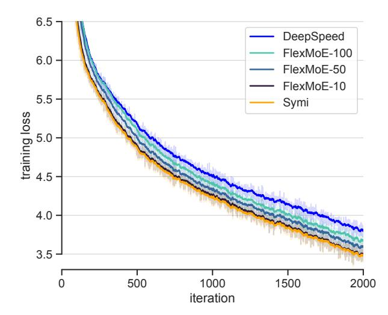

Figure 7: GPT-Small training loss for SYMI, DeepSpeed, and FlexMoE with different rebalancing intervals. SYMI achieves faster convergence than static replication systems like DeepSpeed and coarse-grained adaptive replication solutions.

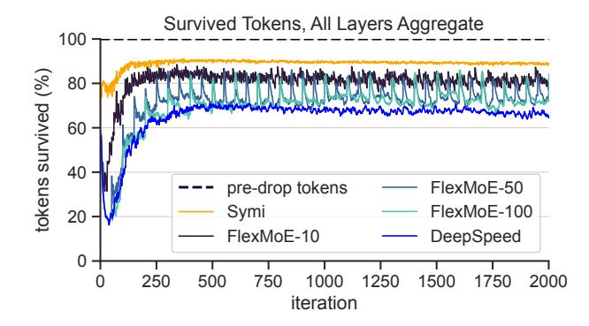

Figure 8: Percentage of survived tokens across iterations. Static expert replication suffers from token drops, while infrequent rebalancing cannot adjust well to the dynamic expert activation distribution.

iterations compared to FlexMoE with low (FlexMoE-100) and medium rebalancing frequencies (FlexMoE-50), respectively. When FlexMoE rebalances every 10 iterations, it requires the same number of iterations to converge as SYMI. However, FlexMoE-10's improved convergence comes at the cost of a significant increase of per-iteration latency (see §5.3).

To better understand these results, Figure 8 shows the fraction of survived (i.e., not dropped) tokens over the course of training. These results validate two key assumptions. First, increasing the *frequency* of adaptive replication directly translates to fewer dropped tokens. In total, SYMI dropped 69%, 64%, 62% and 43% fewer tokens over the course of training compared to DeepSpeed, FlexMoE-100, FlexMoE-50, and FlexMoE-10, respectively. Secondly, combined with the

<span id="page-9-0"></span>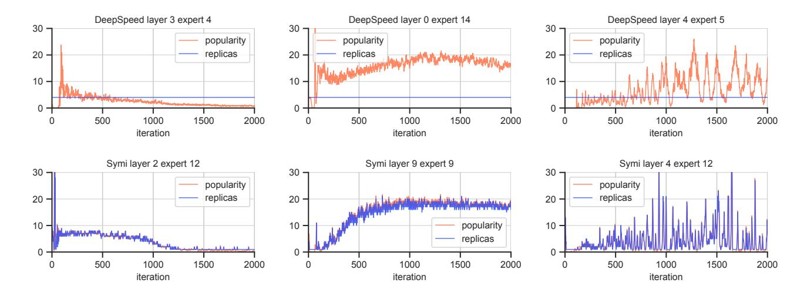

Figure 9: Normalized expert popularity (orange) vs expert replication degree (blue) across different experts in different layers. While DeepSpeed allocates a fixed number of expert instances per expert class, SYMI adjusts replication proportionally to expert popularity. SYMI 's scheduling policy adapts replication effectively to changing demand – whether experts lose popularity (left), gain popularity (center), or exhibit highly spiky distributions (right).

<span id="page-9-1"></span>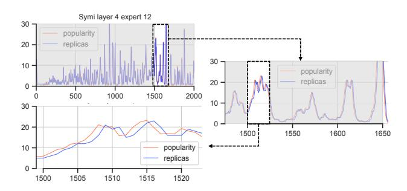

Figure 10: Zooming in the expert popularity vs expert replication plot. SYMI's scheduler assigns replicas based on the popularity observed in the previous iteration. This strategy is a good proxy even for very spiky popularity distributions.

results shown in Figure 7, we observe that dropping fewer tokens allows experts to learn better in each training iteration, directly improving convergence rate on a per-iteration basis. Thus, Figure 8 shows that rebalancing as often as possible directly improves convergence.

To further understand why more frequent rebalancing drops fewer tokens, Figure 9 compares expert popularity and expert replication for different experts across training. The top and bottom rows refer to different experts for DeepSpeed and SYMI, respectively. Meanwhile, the three columns show different commonly observed expert behavior patterns: shrinking popularity, growing popularity, and highly variable popularity. In the case of DeepSpeed, it is overwhelmingly common that expert popularity largely diverges from the constant expert replication factor. In particular, the middle column shows how very popular experts (as shown in Figure 2) result in highly-imbalanced replication. This leads to a large amount

<span id="page-9-2"></span>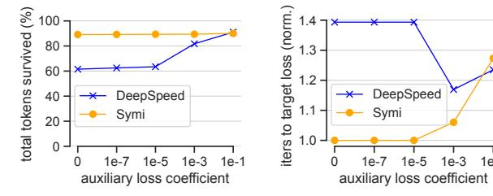

Figure 11: Percentage of total survived tokens (left), and normalized iterations needed to reach a target loss (right) for different auxiliary load-balancing loss coefficients. In contrast to SYMI, DeepSpeed relies on auxiliary loss involvement to achieve low drop rates and faster convergence.

of dropped tokens, and as a result, slower convergence. Meanwhile, the bottom row shows how SYMI is able to adaptively change the replication factor of each expert, under all dynamic behaviors, based on the expert's popularity.

SYMI's expert replication strategy is effective under varied popularity distributions. Recall that SYMI's Expert Placement Scheduler uses the popularity distribution of the previous iteration. To validate the efficacy of this technique, Figure 10 shows a zoomed-in view of the expert popularity and corresponding expert replication during a particularly spiky training interval. Even in this domain, using the previous iteration as a proxy manages to closely match the expert's dynamic popularity.

Adjusting the auxiliary load-balancing loss can help reduce token drops but harms convergence (§2.1). In Figure 11, we study DeepSpeed's and SYMI's behavior under different auxiliary loss coefficients. DeepSpeed requires a high auxiliary

<span id="page-10-2"></span>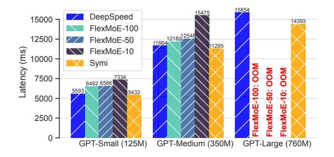

Figure 12: Average iteration latency on different GPT models. SYMI outperforms both the FlexMoE baselines and Deep-Speed. For FlexMoE, average iteration latency increases with rebalancing frequency.

loss coefficient to avoid excessive drops of  ${\sim}40\%$  in aggregate. While the lower drop rate helps with convergence, the high auxiliary loss coefficient interferes with the loss objective and with expert routing and bounds the overall benefits in convergence speed. In contrast, the adaptive expert replication allows SYMI to maintain low token drops of  ${\sim}10\%$  in aggregate regardless of the coefficient value. SYMI converges fast for all but the very high coefficient values. Overall, SYMI removes the need to carefully tune the auxiliary loss to tradeoff convergence speed and system performance, turning it into a quality knob rather than a system necessity.

In summary, these results show that expert popularity changes rapidly, on a per-iteration basis (Figures 9 and 10). Increasing the frequency at which expert placements are adapted according to this shifting popularity is essential to avoiding dropped tokens (Figure 8). By avoiding these token drops, training systems can drastically improve the convergence rate (Figure 7). SYMI adapts expert placements at a *per-iteration* frequency, maximizing the convergence benefits of adaptive replication.

## <span id="page-10-1"></span>5.3 Iteration Latency Evaluation

We validate in practice that SYMI introduces no latency overheads to perform per-iteration adaptive replication. Figure 12 shows the average iteration latency achieved by all systems across the three GPT models. SYMI adds no communication overheads over the static DeepSpeed baseline. In fact, it slightly improves iteration latency by 2.8%, 3.2%, and 9.3% for GPT- Small, Medium, and Large, respectively. In contrast, FlexMoE exhibits increasing average iteration latency with higher rebalancing frequencies. This is the reason we report end-to-end training times for GPT-Small in §5.1. Also, Flex-MoE terminates with an out-of-memory error on GPT-Large as transferring optimizer state requires temporary co-locating current and future state in a given slot.

Figure 13 breaks down each system's latency. For FlexMoE,

<span id="page-10-3"></span>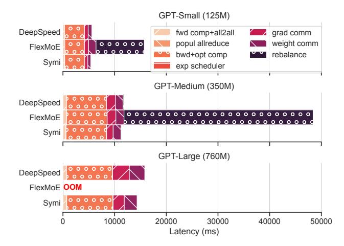

Figure 13: Latency breakdown to the different components of the training iteration. For FlexMoE, we break down iterations where rebalancing occurs. SYMI's newly introduced components add negligible overhead, while in FlexMoE iteration latency spikes.

we show the average breakdown of a rebalancing iteration. DeepSpeed never rebalances and SYMI rebalances on every iteration. SYMI's iteration latency improvement over DeepSpeed is attributed to the observed lower communication cost, resulting from our collectives implementation (Section 4). Additionally, SYMI's new components – expert popularity all-reduce, expert placement scheduler, metadata update during rebalancing – introduce negligible overhead, aggregating to only 1.06%, 0.82%, and 0.70% of the total iteration time for the 125M, 350M, and 760M models, respectively.

Conversely, FlexMoE incurs substantial overhead from optimizer state movement, increasing its rebalancing iterations' latency by  $2.46\times-4.10\times$ . While FlexMoE-10 achieved competitive convergence performance to SYMI, frequent rebalancing leads to FlexMoE-10 having  $\sim\!35\%$  higher average iteration latency than SYMI. FlexMoE-50/100 amortize overheads across non-rebalancing iterations. Yet, FlexMoE-50/100 still exhibit higher average iteration latency than SYMI, added to the fact that their infrequent rebalancing strategy compromises convergence.

### <span id="page-10-0"></span>6 Discussion

Is SYMI compatible with different offload/parallelism frameworks? Our design is compatible with, and can benefit from different offloading and parallelism techniques applied to either experts or the optimizer. While this work uses ZeRO-1 [49], ZeRO-2/3 are fully applicable. Experts sharded via tensor parallelism/expert-sharding parallelism [39,55,67] are treated as a single logical expert. In pipeline parallelism [4,33], the optimizer of each layer is uniformly sharded

across the ranks of the corresponding pipeline stage. Scheduling policies that reduce the exposed communication of different forms of parallelism (Section [7\)](#page-11-0) can be orthogonally applied to our work. More broadly, our design decouples model weights from optimizer state but imposes no constraints on how each is internally treated.

Is optimizer offload mandatory? No. It is a design choice to cleanly separate static components (optimizer state in host DRAM) from dynamic ones (expert weights in GPU HBM). Offloading state enables usage of model sizes in excess of the storage capacity of the compute complexes. Our design logically decouples optimizer placement from expert instances but imposes no constraints on where the optimizer must physically reside. In different implementations, the optimizer may be sharded uniformly across accelerator memory (see Appendix [A.5\)](#page-17-1) or may even be stored in disaggregated memory.

Is SYMI compatible with other replication strategies? The recent LLama 4 [\[31\]](#page-13-2) and DeepSeek-V3 [\[26\]](#page-13-1) models use a combination of shared and routed experts. SYMI is applicable to such systems where it would optimize placement for the routed experts. In general, SYMI alleviates the system bottlenecks in expert placement, allowing AI experts to innovate in learning algorithms without systems limitations. While we find replicating based on the previous iteration's popularity effective, SYMI's dynamic replication policy is flexible. The expert scheduler may incorporate prediction, historical statistics, or even disregard popularity alltogether and replicate experts based on expected dataset characteristics.

Is the current hardware architecture optimal for MoE? We observed high utilization of the host-to-accelerator path via PCIe and then over the backend network. As optimizer state scales with model size [\[3,](#page-12-11) [47\]](#page-14-5), offloading the optimizer becomes necessary, resulting in increased memoryto-accelerator communication volume and jitter from host memory fetches. A high-bandwidth and potentially tiered GPU-to-remote-memory interconnect can accelerate MoE systems like SYMI.

## <span id="page-11-0"></span>7 Related Work

SmartMoE [\[66\]](#page-15-6) co-locates popular and unpopular experts in the same GPU, and decides on dynamic rebalancing using a pre-calculated pool of potential expert placements and online dynamic programming. It does not change the replication of experts and suffers from overheads that prevent arbitrary and frequent expert rebalancing. SmartMoE is also not applicable to models where the size of an expert crosses the boundaries of HBM. FasterMoE [\[16\]](#page-12-10) instead replicates popular experts to all devices, but requires an additional broadcast after determining the routing decision, introducing latency overheads. MoESys [\[65\]](#page-15-5) dynamically routes experts using hierarchical storage, but also relies on thresholds to balance data transfer costs before applying its mechanisms. FlexMoE [\[35\]](#page-13-4) builds upon the notion of adaptive replication found in FasterMoE

by *selectively* replicating experts across GPUs according to their popularity distribution.

Expert choice routing [\[72\]](#page-15-3) flips MoE routing so each expert selects its top tokens for better load balance, but is prone to token loss and is not directly applicable to autoregressive decoding. DeepSeek's auxiliary-loss-free load balancing [\[60\]](#page-15-13) injects load-based biases directly into router scores instead of altering the loss function. It uses a tunable update rate and a complementary sequence-wise balance loss to avoid extreme imbalances [\[26\]](#page-13-1). Using auxiliary loss or auxiliary-loss-free load balancing is orthogonal to SYMI. MegaBlocks [\[12\]](#page-12-12) unifies variable expert workloads into block-sparse GPU kernels to eliminate drops, but only applies to experts that can fit concurrently in HBM. MegaBlocks is compatible with, and can benefit SYMI in the intra-device expert domain.

Tutel [\[18\]](#page-12-7) leverages data and tensor parallelism for MoE training. HetuMoE [\[36\]](#page-13-14) supports MoE training on top of the Hetu framework [\[32\]](#page-13-15). Janus [\[27\]](#page-13-8) fetches experts to each GPU as opposed to broadcasting data. The DeepSpeed [\[45,](#page-14-4) [48\]](#page-14-6) training framework leverages ZeRO [\[46,](#page-14-10) [47,](#page-14-5) [49\]](#page-14-11) techniques to shard and offload each expert's optimizer state across its EDP group. DeepSpeed does not support adaptive replication.

Recent works, orthogonal to ours, such as ScheMoE [\[53\]](#page-14-15), Parm [\[39\]](#page-13-12), and CCFuser [\[59\]](#page-15-11), introduce improved collective communication kernels to address the overheads of the all-toall communication required between experts. Others, such as Lina [\[25\]](#page-13-7), PipeMoE [\[52\]](#page-14-16), APTMoE [\[61\]](#page-15-12), HiDup [\[67\]](#page-15-14), FS-MoE [\[40\]](#page-14-17), and Lancet [\[20\]](#page-13-16), improve expert sharding and scheduling strategies to better hide communication between experts. MPMoE [\[69\]](#page-15-15) improves GPU memory efficiency by better managing activations and temporary buffers. Hexa-MoE [\[30\]](#page-13-17) optimizes for heterogeneous hardware.

Numerous projects have explored improvements to the expert gating algorithm in MoE models. GShard [\[23\]](#page-13-6) and Switch Transformers [\[11\]](#page-12-4) require a per-expert capacity that drops excess tokens for a given expert, lowering model quality. BASE Layers [\[24\]](#page-13-18) introduces a linear assignment formulation to improve load balancing between experts. NetMoE [\[28\]](#page-13-19) uses an ILP to improve the placement of training samples to reduce all-to-all communication requirements.

## 8 Conclusion

We presented SYMI, an MoE training framework that adaptively replicates expert instances based on training load, on a per-iteration basis. SYMI's key insight is to decouple each expert's parameters from its optimizer state, allowing SYMI to dynamically adjust the placement of each expert with minimal overhead. We implemented SYMI on top of DeepSpeed, introducing new components that track expert popularity, schedule expert placements, and communicate across expert instances. SYMI achieves 25.9%-30.5% faster convergence time on GPT compared to DeepSpeed and FlexMoE.

## Acknowledgments

We thank the anonymous reviewers and our shepherd, T. S. Eugene Ng, whose comments have greatly helped improve this paper. This research was partly supported by the Stanford Platform Lab and its affiliates, and by ACE, one of the seven centers in JUMP 2.0, a Semiconductor Research Corporation (SRC) program sponsored by DARPA. Athinagoras Skiadopoulos was partially supported by a Stanford Graduate Fellowship.

## References

- <span id="page-12-0"></span>[1] Mistral AI. Mixstral: Cheaper, better, faster, stronger. [https://mistral.ai/news/mixtral-8x22b,](https://mistral.ai/news/mixtral-8x22b) 2024.
- <span id="page-12-15"></span>[2] Tom Brown, Benjamin Mann, Nick Ryder, Melanie Subbiah, Jared D Kaplan, Prafulla Dhariwal, Arvind Neelakantan, Pranav Shyam, Girish Sastry, Amanda Askell, et al. Language models are few-shot learners. *Advances in neural information processing systems*, 2020.
- <span id="page-12-11"></span>[3] Weilin Cai, Juyong Jiang, Fan Wang, Jing Tang, Sunghun Kim, and Jiayi Huang. A survey on mixture of experts in large language models. *IEEE Transactions on Knowledge and Data Engineering*, 2025.
- <span id="page-12-18"></span>[4] Xin Chen, Hengheng Zhang, Xiaotao Gu, Kaifeng Bi, Lingxi Xie, and Qi Tian. Pipeline moe: A flexible moe implementation with pipeline parallelism. *arXiv preprint arXiv:2304.11414*, 2023.
- <span id="page-12-1"></span>[5] Aakanksha Chowdhery, Sharan Narang, Jacob Devlin, Maarten Bosma, Gaurav Mishra, Adam Roberts, Paul Barham, Hyung Won Chung, Charles Sutton, Sebastian Gehrmann, et al. Palm: Scaling language modeling with pathways. *Journal of Machine Learning Research*, 2023.
- <span id="page-12-9"></span>[6] NVIDIA Corporation. Nvidia h100 tensor core gpu. [https://www.nvidia.com/en-us/data-center/h100,](https://www.nvidia.com/en-us/data-center/h100) 2024.
- <span id="page-12-16"></span>[7] NVIDIA Corporation. Nvidia collective communications library (nccl). [https://developer.nvidia.com/nccl,](https://developer.nvidia.com/nccl) 2025.
- <span id="page-12-13"></span>[8] Damai Dai, Chengqi Deng, Chenggang Zhao, RX Xu, Huazuo Gao, Deli Chen, Jiashi Li, Wangding Zeng, Xingkai Yu, Yu Wu, et al. Deepseekmoe: Towards ultimate expert specialization in mixture-of-experts language models. *arXiv preprint arXiv:2401.06066*, 2024.
- <span id="page-12-5"></span>[9] Databricks. Introducing dbrx: A new state-of-the-art open llm. [https://www.databricks.com/blog/introducing](https://www.databricks.com/blog/introducing-dbrx-new-state-art-open-llm )[dbrx-new-state-art-open-llm,](https://www.databricks.com/blog/introducing-dbrx-new-state-art-open-llm ) 2024.

- <span id="page-12-6"></span>[10] Nan Du, Yanping Huang, Andrew M Dai, Simon Tong, Dmitry Lepikhin, Yuanzhong Xu, Maxim Krikun, Yanqi Zhou, Adams Wei Yu, Orhan Firat, et al. Glam: Efficient scaling of language models with mixture-of-experts. In *International Conference on Machine Learning*, 2022.
- <span id="page-12-4"></span>[11] William Fedus, Barret Zoph, and Noam Shazeer. Switch transformers: Scaling to trillion parameter models with simple and efficient sparsity. *The Journal of Machine Learning Research*, 2022.
- <span id="page-12-12"></span>[12] Trevor Gale, Deepak Narayanan, Cliff Young, and Matei Zaharia. Megablocks: Efficient sparse training with mixture-of-experts. In *Proceedings of Machine Learning and Systems*, 2023.
- <span id="page-12-2"></span>[13] Google. Gemini 2.5: Our most intelligent ai model. [https://blog.google/technology/google-deepmind/](https://blog.google/technology/google-deepmind/gemini-model-thinking-updates-march-2025) [gemini-model-thinking-updates-march-2025,](https://blog.google/technology/google-deepmind/gemini-model-thinking-updates-march-2025) 2025.
- <span id="page-12-3"></span>[14] Daya Guo, Dejian Yang, Haowei Zhang, Junxiao Song, Ruoyu Zhang, Runxin Xu, Qihao Zhu, Shirong Ma, Peiyi Wang, Xiao Bi, et al. Deepseek-r1: Incentivizing reasoning capability in llms via reinforcement learning. *arXiv preprint arXiv:2501.12948*, 2025.
- <span id="page-12-14"></span>[15] Hongcan Guo, Haolang Lu, Guoshun Nan, Bolun Chu, Jialin Zhuang, Yuan Yang, Wenhao Che, Sicong Leng, Qimei Cui, and Xudong Jiang. Advancing expert specialization for better moe. *arXiv preprint arXiv:2505.22323*, 2025.
- <span id="page-12-10"></span>[16] Jiaao He, Jidong Zhai, Tiago Antunes, Haojie Wang, Fuwen Luo, Shangfeng Shi, and Qin Li. Fastermoe: modeling and optimizing training of large-scale dynamic pre-trained models. In *Proceedings of the 27th ACM SIGPLAN Symposium on Principles and Practice of Parallel Programming*, 2022.
- <span id="page-12-17"></span>[17] Dan Hendrycks, Collin Burns, Steven Basart, Andy Zou, Mantas Mazeika, Dawn Song, and Jacob Steinhardt. Measuring massive multitask language understanding. *arXiv preprint arXiv:2009.03300*, 2020.
- <span id="page-12-7"></span>[18] Changho Hwang, Wei Cui, Yifan Xiong, Ziyue Yang, Ze Liu, Han Hu, Zilong Wang, Rafael Salas, Jithin Jose, Prabhat Ram, et al. Tutel: Adaptive mixture-of-experts at scale. *Proceedings of Machine Learning and Systems*, 2023.
- <span id="page-12-8"></span>[19] Albert Q Jiang, Alexandre Sablayrolles, Antoine Roux, Arthur Mensch, Blanche Savary, Chris Bamford, Devendra Singh Chaplot, Diego de las Casas, Emma Bou Hanna, Florian Bressand, et al. Mixtral of experts. *arXiv preprint arXiv:2401.04088*, 2024.

- <span id="page-13-16"></span>[20] Chenyu Jiang, Ye Tian, Zhen Jia, Shuai Zheng, Chuan Wu, and Yida Wang. Lancet: Accelerating mixtureof-experts training via whole graph computationcommunication overlapping. *Proceedings of Machine Learning and Systems*, 2024.
- <span id="page-13-11"></span>[21] Ziheng Jiang, Haibin Lin, Yinmin Zhong, Qi Huang, Yangrui Chen, Zhi Zhang, Yanghua Peng, Xiang Li, Cong Xie, Shibiao Nong, et al. Megascale: Scaling large language model training to more than 10,000 gpus. In *21st USENIX Symposium on Networked Systems Design and Implementation*, 2024.
- <span id="page-13-0"></span>[22] Jared Kaplan, Sam McCandlish, Tom Henighan, Tom B Brown, Benjamin Chess, Rewon Child, Scott Gray, Alec Radford, Jeffrey Wu, and Dario Amodei. Scaling laws for neural language models. *arXiv preprint arXiv:2001.08361*, 2020.
- <span id="page-13-6"></span>[23] Dmitry Lepikhin, HyoukJoong Lee, Yuanzhong Xu, Dehao Chen, Orhan Firat, Yanping Huang, Maxim Krikun, Noam Shazeer, and Zhifeng Chen. Gshard: Scaling giant models with conditional computation and automatic sharding. *arXiv preprint arXiv:2006.16668*, 2020.
- <span id="page-13-18"></span>[24] Mike Lewis, Shruti Bhosale, Tim Dettmers, Naman Goyal, and Luke Zettlemoyer. Base layers: Simplifying training of large, sparse models. In *International Conference on Machine Learning*, 2021.
- <span id="page-13-7"></span>[25] Jiamin Li, Yimin Jiang, Yibo Zhu, Cong Wang, and Hong Xu. Accelerating distributed MoE training and inference with lina. In *2023 USENIX Annual Technical Conference*, 2023.
- <span id="page-13-1"></span>[26] Aixin Liu, Bei Feng, Bing Xue, Bingxuan Wang, Bochao Wu, Chengda Lu, Chenggang Zhao, Chengqi Deng, Chenyu Zhang, Chong Ruan, et al. Deepseek-v3 technical report. *arXiv preprint arXiv:2412.19437*, 2024.
- <span id="page-13-8"></span>[27] Juncai Liu, Jessie Hui Wang, and Yimin Jiang. Janus: A unified distributed training framework for sparse mixture-of-experts models. In *Proceedings of the ACM SIGCOMM 2023 Conference*, 2023.
- <span id="page-13-19"></span>[28] Xinyi Liu, Yujie Wang, Fangcheng Fu, Xupeng Miao, Shenhan Zhu, Xiaonan Nie, and Bin CUI. Netmoe: Accelerating moe training through dynamic sample placement. In *The Thirteenth International Conference on Learning Representations*, 2025.
- <span id="page-13-5"></span>[29] Qijun Luo, Hengxu Yu, and Xiao Li. Badam: A memory efficient full parameter optimization method for large language models. In *Advances in Neural Information Processing Systems*, 2024.

- <span id="page-13-17"></span>[30] Shuqing Luo, Jie Peng, Pingzhi Li, Hanrui Wang, and Tianlong Chen. Hexa-moe: Efficient and heterogeneousaware training for mixture-of-experts. *arXiv preprint arXiv:2411.01288*, 2025.
- <span id="page-13-2"></span>[31] Meta. The llama 4 herd: The beginning of a new era of natively multimodal ai innovation. [https://ai.meta.com/](https://ai.meta.com/blog/llama-4-multimodal-intelligence) [blog/llama-4-multimodal-intelligence,](https://ai.meta.com/blog/llama-4-multimodal-intelligence) 2025.
- <span id="page-13-15"></span>[32] Xupeng Miao, Xiaonan Nie, Hailin Zhang, Tong Zhao, and Bin Cui. Hetu: A highly efficient automatic parallel distributed deep learning system. *Science China. Information Sciences*, 2022.
- <span id="page-13-13"></span>[33] Deepak Narayanan, Aaron Harlap, Amar Phanishayee, Vivek Seshadri, Nikhil R Devanur, Gregory R Ganger, Phillip B Gibbons, and Matei Zaharia. Pipedream: Generalized pipeline parallelism for dnn training. In *Proceedings of the 27th ACM symposium on operating systems principles*, 2019.
- <span id="page-13-10"></span>[34] Deepak Narayanan, Mohammad Shoeybi, Jared Casper, Patrick LeGresley, Mostofa Patwary, Vijay Korthikanti, Dmitri Vainbrand, Prethvi Kashinkunti, Julie Bernauer, Bryan Catanzaro, et al. Efficient large-scale language model training on gpu clusters using megatron-lm. In *Proceedings of the International Conference for High Performance Computing, Networking, Storage and Analysis*, 2021.
- <span id="page-13-4"></span>[35] Xiaonan Nie, Xupeng Miao, Zilong Wang, Zichao Yang, Jilong Xue, Lingxiao Ma, Gang Cao, and Bin Cui. Flexmoe: Scaling large-scale sparse pre-trained model training via dynamic device placement. *Proceedings of the ACM on Management of Data*, 2023.
- <span id="page-13-14"></span>[36] Xiaonan Nie, Pinxue Zhao, Xupeng Miao, Tong Zhao, and Bin Cui. Hetumoe: An efficient trillion-scale mixture-of-expert distributed training system. *arXiv preprint arXiv:2203.14685*, 2022.
- <span id="page-13-9"></span>[37] Nabil Omi, Siddhartha Sen, and Ali Farhadi. Load balancing mixture of experts with similarity preserving routers. *arXiv preprint arXiv:2506.14038*, 2025.
- <span id="page-13-3"></span>[38] OpenAI, Josh Achiam, Steven Adler, Sandhini Agarwal, Lama Ahmad, Ilge Akkaya, Florencia Leoni Aleman, Diogo Almeida, Janko Altenschmidt, Sam Altman, Shyamal Anadkat, Red Avila, Igor Babuschkin, Suchir Balaji, et al. GPT-4 technical report. *arXiv preprint arXiv:2303.08774*, 2023.
- <span id="page-13-12"></span>[39] Xinglin Pan, Wenxiang Lin, Shaohuai Shi, Xiaowen Chu, Weinong Sun, and Bo Li. Parm: Efficient training of large sparsely-activated models with dedicated schedules. In *IEEE Conference on Computer Communications*, 2024.

- <span id="page-14-17"></span>[40] Xinglin Pan, Wenxiang Lin, Lin Zhang, Shaohuai Shi, Zhenheng Tang, Rui Wang, Bo Li, and Xiaowen Chu. Fsmoe: A flexible and scalable training system for sparse mixture-of-experts models. In *Proceedings of the 30th ACM International Conference on Architectural Support for Programming Languages and Operating Systems*, 2025.
- <span id="page-14-12"></span>[41] Adam Paszke, Sam Gross, Francisco Massa, Adam Lerer, James Bradbury, Gregory Chanan, Trevor Killeen, Zeming Lin, Natalia Gimelshein, Luca Antiga, et al. Pytorch: An imperative style, high-performance deep learning library. *Advances in neural information processing systems*, 2019.
- <span id="page-14-13"></span>[42] PyTorch. Pytorch documentation: Distributed communication package - torch.distributed: Groups. [https:](https://pytorch.org/docs/stable/distributed.html#groups) [//pytorch.org/docs/stable/distributed.html#groups,](https://pytorch.org/docs/stable/distributed.html#groups) 2025.
- <span id="page-14-14"></span>[43] PyTorch. Pytorch documentation: Distributed communication package - torch.distributed: Point-to-point communication. [https://pytorch.org/docs/stable/distributed.](https://pytorch.org/docs/stable/distributed.html#point-to-point-communication) [html#point-to-point-communication,](https://pytorch.org/docs/stable/distributed.html#point-to-point-communication) 2025.
- <span id="page-14-3"></span>[44] QwenTeam. Qwen3-next: Towards ultimate training and inference efficiency. [https://qwen.ai/blog?id=](https://qwen.ai/blog?id=e34c4305036ce60d55a0791b170337c2b70ae51d&from=home.latest-research-list) [e34c4305036ce60d55a0791b170337c2b70ae51d&from=](https://qwen.ai/blog?id=e34c4305036ce60d55a0791b170337c2b70ae51d&from=home.latest-research-list) [home.latest-research-list,](https://qwen.ai/blog?id=e34c4305036ce60d55a0791b170337c2b70ae51d&from=home.latest-research-list) 2025.
- <span id="page-14-4"></span>[45] Samyam Rajbhandari, Conglong Li, Zhewei Yao, Minjia Zhang, Reza Yazdani Aminabadi, Ammar Ahmad Awan, Jeff Rasley, and Yuxiong He. DeepSpeed-MoE: Advancing mixture-of-experts inference and training to power next-generation AI scale. In *Proceedings of the 39th International Conference on Machine Learning*, 2022.
- <span id="page-14-10"></span>[46] Samyam Rajbhandari, Jeff Rasley, Olatunji Ruwase, and Yuxiong He. Zero: Memory optimizations toward training trillion parameter models. In *Proceedings of the International Conference for High Performance Computing, Networking, Storage and Analysis*, 2020.
- <span id="page-14-5"></span>[47] Samyam Rajbhandari, Olatunji Ruwase, Jeff Rasley, Shaden Smith, and Yuxiong He. Zero-infinity: breaking the gpu memory wall for extreme scale deep learning. In *Proceedings of the International Conference for High Performance Computing, Networking, Storage and Analysis*, 2021.
- <span id="page-14-6"></span>[48] Jeff Rasley, Samyam Rajbhandari, Olatunji Ruwase, and Yuxiong He. Deepspeed: System optimizations enable training deep learning models with over 100 billion parameters. In *Proceedings of the 26th ACM SIGKDD international conference on knowledge discovery & data mining*, 2020.

- <span id="page-14-11"></span>[49] Jie Ren, Samyam Rajbhandari, Reza Yazdani Aminabadi, Olatunji Ruwase, Shuangyan Yang, Minjia Zhang, Dong Li, and Yuxiong He. ZeRO-Offload: Democratizing Billion-Scale model training. In *2021 USENIX Annual Technical Conference*, 2021.
- <span id="page-14-0"></span>[50] Xiaozhe Ren, Pingyi Zhou, Xinfan Meng, Xinjing Huang, Yadao Wang, Weichao Wang, Pengfei Li, Xiaoda Zhang, Alexander Podolskiy, Grigory Arshinov, et al. Pangu-Σ: Towards trillion parameter language model with sparse heterogeneous computing. *arXiv preprint arXiv:2303.10845*, 2023.
- <span id="page-14-8"></span>[51] Noam Shazeer, Azalia Mirhoseini, Krzysztof Maziarz, Andy Davis, Quoc Le, Geoffrey Hinton, and Jeff Dean. Outrageously large neural networks: The sparsely-gated mixture-of-experts layer. *arXiv preprint arXiv:1701.06538*, 2017.
- <span id="page-14-16"></span>[52] Shaohuai Shi, Xinglin Pan, Xiaowen Chu, and Bo Li. Pipemoe: Accelerating mixture-of-experts through adaptive pipelining. In *IEEE Conference on Computer Communications*, 2023.
- <span id="page-14-15"></span>[53] Shaohuai Shi, Xinglin Pan, Qiang Wang, Chengjian Liu, Xiaozhe Ren, Zhongzhe Hu, Yu Yang, Bo Li, and Xiaowen Chu. Schemoe: An extensible mixture-of-experts distributed training system with tasks scheduling. In *Proceedings of the Nineteenth European Conference on Computer Systems*, 2024.
- <span id="page-14-7"></span>[54] Arjun Singh, Nikhil Pandey, Anup Shirgaonkar, Pavan Manoj, and Vijay Aski. A study of optimizations for fine-tuning large language models. *arXiv preprint arXiv:2406.02290*, 2024.
- <span id="page-14-9"></span>[55] Siddharth Singh, Olatunji Ruwase, Ammar Ahmad Awan, Samyam Rajbhandari, Yuxiong He, and Abhinav Bhatele. A hybrid tensor-expert-data parallelism approach to optimize mixture-of-experts training. In *Proceedings of the 37th International Conference on Supercomputing*, 2023.
- <span id="page-14-1"></span>[56] Shaden Smith, Mostofa Patwary, Brandon Norick, Patrick LeGresley, Samyam Rajbhandari, Jared Casper, Zhun Liu, Shrimai Prabhumoye, George Zerveas, Vijay Korthikanti, et al. Using deepspeed and megatron to train megatron-turing nlg 530b, a large-scale generative language model. *arXiv preprint arXiv:2201.11990*, 2022.
- <span id="page-14-2"></span>[57] Snowflake. Snowflake arctic: The best llm for enterprise ai: Efficiently intelligent, truly open. [https://www.snowflake.com/en/blog/arctic-open](https://www.snowflake.com/en/blog/arctic-open-efficient-foundation-language-models-snowflake/)[efficient-foundation-language-models-snowflake/,](https://www.snowflake.com/en/blog/arctic-open-efficient-foundation-language-models-snowflake/) 2024.

- <span id="page-15-10"></span>[58] Ashish Vaswani, Noam Shazeer, Niki Parmar, Jakob Uszkoreit, Llion Jones, Aidan N Gomez, Ł ukasz Kaiser, and Illia Polosukhin. Attention is all you need. In *Advances in Neural Information Processing Systems*, 2017.
- <span id="page-15-11"></span>[59] Hulin Wang, Yaqi Xia, Donglin Yang, Xiaobo Zhou, and Dazhao Cheng. Harnessing inter-gpu shared memory for seamless moe communication-computation fusion. In *Proceedings of the 30th ACM SIGPLAN Annual Symposium on Principles and Practice of Parallel Programming*, 2025.
- <span id="page-15-13"></span>[60] Lean Wang, Huazuo Gao, Chenggang Zhao, Xu Sun, and Damai Dai. Auxiliary-loss-free load balancing strategy for mixture-of-experts. *arXiv preprint arXiv:2408.15664*, 2024.
- <span id="page-15-12"></span>[61] Yuanxin Wei, Jiangsu Du, Jiazhi Jiang, Xiao Shi, Xianwei Zhang, Dan Huang, Nong Xiao, and Yutong Lu. Aptmoe: Affinity-aware pipeline tuning for moe models on bandwidth-constrained gpu nodes. In *Proceedings of the International Conference for High Performance Computing, Networking, Storage, and Analysis*, 2024.
- <span id="page-15-0"></span>[62] xAI. Grok-1. [https://github.com/xai-org/grok-1,](https://github.com/xai-org/grok-1) 2025.
- <span id="page-15-1"></span>[63] An Yang, Anfeng Li, Baosong Yang, Beichen Zhang, Binyuan Hui, Bo Zheng, Bowen Yu, Chang Gao, Chengen Huang, Chenxu Lv, et al. Qwen3 technical report. *arXiv preprint arXiv:2505.09388*, 2025.
- <span id="page-15-2"></span>[64] An Yang, Junyang Lin, Rui Men, Chang Zhou, Le Jiang, Xianyan Jia, Ang Wang, Jie Zhang, Jiamang Wang, Yong Li, Di Zhang, Wei Lin, Lin Qu, Jingren Zhou, and Hongxia Yang. M6-T: Exploring sparse expert models and beyond. *arXiv preprint arXiv:2105.15082*, 2021.
- <span id="page-15-5"></span>[65] Dianhai Yu, Liang Shen, Hongxiang Hao, Weibao Gong, Huachao Wu, Jiang Bian, Lirong Dai, and Haoyi Xiong. Moesys: A distributed and efficient mixture-of-experts training and inference system for internet services. *IEEE Transactions on Services Computing*, 2024.
- <span id="page-15-6"></span>[66] Mingshu Zhai, Jiaao He, Zixuan Ma, Zan Zong, Runqing Zhang, and Jidong Zhai. Smartmoe: Efficiently training sparsely-activated models through combining offline and online parallelization. In *2023 USENIX Annual Technical Conference*, 2023.
- <span id="page-15-14"></span>[67] Shiwei Zhang, Lansong Diao, Chuan Wu, Siyu Wang, and Wei Lin. Accelerating large-scale distributed neural network training with spmd parallelism. In *Proceedings of the 13th Symposium on Cloud Computing*, 2022.
- <span id="page-15-8"></span>[68] Susan Zhang, Stephen Roller, Naman Goyal, Mikel Artetxe, Moya Chen, Shuohui Chen, Christopher Dewan, Mona Diab, Xian Li, Xi Victoria Lin, et al. Opt:

- Open pre-trained transformer language models. *arXiv preprint arXiv:2205.01068*, 2022.
- <span id="page-15-15"></span>[69] Zheng Zhang, Yaqi Xia, Hulin Wang, Donglin Yang, Chuang Hu, Xiaobo Zhou, and Dazhao Cheng. Mpmoe: Memory efficient moe for pre-trained models with adaptive pipeline parallelism. *IEEE Transactions on Parallel and Distributed Systems*, 2024.
- <span id="page-15-9"></span>[70] Yanli Zhao, Andrew Gu, Rohan Varma, Liang Luo, Chien-Chin Huang, Min Xu, Less Wright, Hamid Shojanazeri, Myle Ott, Sam Shleifer, et al. Pytorch fsdp: Experiences on scaling fully sharded data parallel. *Proceedings of the VLDB Endowment, Vol. 16, No. 12*, 2023.
- <span id="page-15-7"></span>[71] Yanqi Zhou, Nan Du, Yanping Huang, Daiyi Peng, Chang Lan, Da Huang, Siamak Shakeri, David So, Andrew M Dai, Yifeng Lu, et al. Brainformers: Trading simplicity for efficiency. In *International Conference on Machine Learning*, 2023.
- <span id="page-15-3"></span>[72] Yanqi Zhou, Tao Lei, Hanxiao Liu, Nan Du, Yanping Huang, Vincent Zhao, Andrew M Dai, Quoc V Le, James Laudon, et al. Mixture-of-experts with expert choice routing. *Advances in Neural Information Processing Systems*, 2022.
- <span id="page-15-4"></span>[73] Barret Zoph, Irwan Bello, Sameer Kumar, Nan Du, Yanping Huang, Jeff Dean, Noam Shazeer, and William Fedus. ST-MoE: Designing stable and transferable sparse expert models. *arXiv preprint arXiv:2202.08906*, 2022.

## A Appendix

We use the following notation:

| N          | # nodes in the training cluster                   |
|------------|---------------------------------------------------|
| E          | # expert classes                                  |
| S          | # expert slots per rank                           |
| r          | # expert replicas (static baseline)               |
| $r_i$      | # expert replicas for expert $e_i$ (SYMI)         |
| $BW_{pci}$ | local GPU-CPU interconnect (e.g., PCIe) bandwidth |
| $BW_{net}$ | cross-node GPU-GPU network (e.g., IB) bandwidth   |
| G          | gradients data size for one expert instance       |
| W          | weights data size for one expert instance         |
| $T_{G/W}$  | communication cost per rank in each phase         |

Table 4: Variable Definitions

## <span id="page-16-0"></span>A.1 Optimal Optimizer Partitioning Strategy

This appendix proves that partitioning the SYMI optimizer uniformly across all nodes is the most efficient partitioning strategy, given no control over the expert popularity distribution. Indeed, we could split the training cluster into k groups, evenly partitioning the optimizer of  $\frac{E}{k}$  experts in each  $\frac{N}{k}$ -node group.

For all experts in the group  $(\frac{E}{k})$ , the weight/gradient shards  $(\frac{X}{N/k})$  are transferred over PCIe  $(\frac{1}{BW_{pci}})$ . For all experts instances corresponding to classes outside the group  $(\sum_{e_i \in g} (r_i - r_{i|local}))$ , their gradient/weight shards  $(\frac{X}{N/k})$  need to be gathered/updated over the network  $(\frac{1}{BW_{net}})$ .

For a rank in some group g, the communication cost of either X = G, W would be:

$$T_X^{k-part} = E/k \frac{X}{N/k} \frac{1}{BW_{pci}} + \frac{X}{N/k} \sum_{e_i \in g} (r_i - r_{i|local}) \frac{1}{BW_{net}}$$

$$\leq \frac{E}{N} \frac{X}{BW_{pci}} + k \frac{(sN - s)}{N} \frac{X}{BW_{net}}$$

which varies among the k groups and the  $\leq$  approaches equality for groups containing very popular experts. The resulting total communication cost, dominated by the highest demand group, increases with k. SYMI (k=1) manages to resolve this expensive imbalance as it achieves constant, low communication overhead regardless of expert distribution.

## <span id="page-16-1"></span>A.2 SYMI and Static Expert Replication Communication Cost

This appendix provides the computation of the formulas presented in §3.3 (III)

In the static baseline, each expert slot in a rank (s) communicates and averages the gradient shards ( $\frac{G}{r}$ ) of the corresponding expert's remote replicas (r-1) over the network ( $\frac{1}{BW_{net}}$ ). The optimizer then transfers each slot's (s) averaged gradient shard ( $\frac{G}{r}$ ) over PCIe ( $\frac{1}{BW_{pci}}$ ). After the optimizer step, the updated weights follow the reverse direction:

$$\begin{split} T_G^{static} &= T_{G|net}^{static} + T_{G|local}^{static} \\ &= s \frac{(r-1)G}{r} \frac{1}{BW_{net}} + s \frac{G}{r} \frac{1}{BW_{pci}} \\ &\stackrel{(1)}{=} sG \left( (1 - \frac{E}{sN}) \frac{1}{BW_{net}} + \frac{E}{sN} \frac{1}{BW_{pci}} \right) \\ &= \frac{sN - E}{N} \frac{G}{BW_{net}} + \frac{E}{N} \frac{G}{BW_{pci}} \\ T_W^{static} &= T_{W|local}^{static} + T_{W|net}^{static} \\ &= s \frac{W}{r} \frac{1}{BW_{pci}} + s \frac{(r-1)W}{r} \frac{1}{BW_{net}} \\ &\stackrel{(1)}{=} sW \left( \frac{E}{sN} \frac{1}{BW_{pci}} + (1 - \frac{E}{sN}) \frac{1}{BW_{net}} \right) \\ &= \frac{E}{N} \frac{W}{BW_{pci}} + \frac{sN - E}{N} \frac{W}{BW_{net}} \end{split}$$

In SYMI, each rank needs to communicate and average the gradient shards for the globally partitioned optimizer  $(\frac{G}{N})$  of all experts'  $(e_i)$  remote replicas  $(r_i - r_{i|local})$  over the network  $(\frac{1}{BW_{net}})$ . The optimizer then transfers all experts' (E) averaged gradient shards  $(\frac{G}{N})$  over PCIe  $(\frac{1}{BW_{pci}})$ . The updated weights also follow the reverse direction in this case. In total:

$$\begin{split} T_G^{\text{SYMI}} &= T_{G|net}^{\text{SYMI}} + T_{G|local}^{\text{SYMI}} \\ &= \frac{G}{N} \sum_{e_i} (r_i - r_{i|local}) \frac{1}{BW_{net}} + E \frac{G}{N} \frac{1}{BW_{pci}} \\ &\stackrel{(2)}{=} \frac{G}{N} (sN - s) \frac{1}{BW_{net}} + E \frac{G}{N} \frac{1}{BW_{pci}} \\ &= \frac{sN - s}{N} \frac{G}{BW_{net}} + \frac{E}{N} \frac{G}{BW_{pci}} \\ T_W^{\text{SYMI}} &= T_{W|local}^{\text{SYMI}} + T_{W|net}^{\text{SYMI}} \\ &= E \frac{W}{N} \frac{1}{BW_{pci}} + \frac{W}{N} \sum_{e_i} (r_i - r_{i|local}) \frac{1}{BW_{net}} \\ &\stackrel{(2)}{=} E \frac{W}{N} \frac{1}{BW_{pci}} + \frac{W}{N} (sN - s) \frac{1}{BW_{net}} \\ &= \frac{E}{N} \frac{W}{BW_{pci}} + \frac{sN - s}{N} \frac{W}{BW_{net}} \end{split}$$

### <span id="page-16-2"></span>A.3 SYMI's Expert Placement Algorithm

#### **Algorithm 1** The Expert Placement Scheduler's algorithm.

```
def compute placement(popularity, E=exp classes,
         G=world size, S=slots per rank):
   # initial assignment of instance counts
   goal = (popularity / sum(popularity)) * G * S
   exp counts = maximum(goal, [1] * E)
   exp counts = floor(exp counts)
   # rounding correction
   diff = exp counts - goal
   while sum(exp counts) > G * S:
      i = argmax(diff)
      if exp_counts[i] > 1:
         exp_counts[i] -= 1
      diff[i] -= 1
   while sum(exp counts) < G * S:
      i = argmin(diff)
      exp\_counts[i] += 1
      diff[i] += 1
   # assign experts contiguously
   exp_placement = []
   for exp, count in enumerate(exp counts):
      exp placement += [exp] * count
   return exp placement
```

<span id="page-17-2"></span>This appendix shows how the Expert Placement Scheduler assigns experts to slots. Algorithm 1 first normalizes the captured expert popularity to the total number of expert slots in the system. The normalized popularity values are assigned as number of instances to experts, with a minimum of one instance so that all experts remain reachable. The assigned counts are rounded down, followed by a correction step to ensure that total instances match the available expert slots. Algorithm 1 returns an array of expert assignments with same expert classes being contiguous. The resulting expert placement favors placement of same-class expert instances within the same rank.

#### <span id="page-17-0"></span>A.4 SYMI's Gradient Collection Algorithm

This appendix shows how the SYMI Optimizer assigns ranks during the gradient collection communication. Algorithm 2 assigns a single source rank to a given expert and optimizer destination rank. The get\_source function prioritizes local communication if the expert is local to the optimizer. Otherwise, get\_source round-robins across different expert instances to avoid communication bottlenecks.

#### <span id="page-17-1"></span>A.5 SYMI With Non-Offloaded Optimizer

This appendix shows that SYMI operates with similar benefits when the optimizer is not offloaded, but sharded across HBM memory. In a static system, each expert is replicated a fixed number of times and its optimizer state is uniformly sharded across the HBM of devices hosting that expert. In SYMI, the

#### **Algorithm 2** SYMI Optimizer's grad collection algorithm.

```
def get source(exp id, rank):
   if rank in exp_to_rank_map[exp_id]:
      return rank
   candidates = sorted(exp to rank map[exp id])
   idx = rank % len(candidates)
   return candidates[idx]
def collect_grads():
   # recv/send comm tuples: (rank, partition)
   for exp id in all experts:
      recv grads[exp id] = (get source(
            exp id, self.rank), self.rank)
   for slot, exp_id in local_expert_map.items():
      send grads[exp id] = []
      for dst in all ranks:
         if get source(exp id, dst) == self.rank:
            send_grads[exp_id].append((dst, dst))
   set comm tuples(recv grads, send grads)
```

<span id="page-17-3"></span>optimizer of all experts is statically and uniformly sharded across the whole HBM domain, while expert instances rebalance dynamically.

To get the equivalent communication cost, we need to set  $BW_{pci} \rightarrow \infty$  at the equations in A.2, giving us:

$$T_G^{static} = \frac{sN - E}{N} \frac{G}{BW_{net}}$$
 $T_W^{static} = \frac{sN - E}{N} \frac{W}{BW_{net}}$ 
 $T_G^{SYMI} = \frac{sN - s}{N} \frac{G}{BW_{net}}$ 
 $T_W^{SYMI} = \frac{sN - s}{N} \frac{W}{BW_{net}}$ 

As in § 3.3, we find the shift in locality increases the communication cost only marginally:

$$\frac{\Delta T}{T^{static}} = \frac{E - s}{sN - E}$$

which corresponds to just 1.54% in our system example.