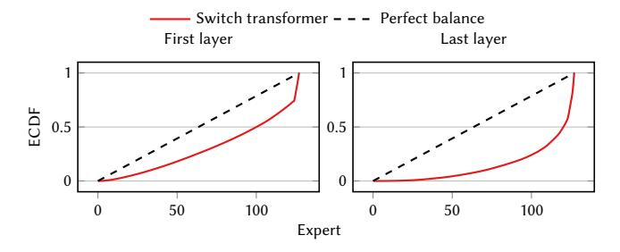

# Accelerating MoE Model Inference with Expert Sharding

Oana Balmau McGill University Canada, Montreal

André Loureiro Espírito Santo EPFL

Lausanne, Switzerland

Anne-Marie Kermarrec EPFL Lausanne, Switzerland

Martijn de Vos EPFL

Lausanne, Switzerland

Rafael Pires EPFL

Lausanne, Switzerland

Milos Vujasinovic EPFL

Lausanne, Switzerland

## Abstract

Mixture of experts (MoE) models achieve state-of-the-art results in language modeling but suffer from inefficient hardware utilization due to imbalanced token routing and communication overhead. While prior work has focused on optimizing MoE training and decoder architectures, inference for encoder-based MoE models in a multi-GPU with expert parallelism setting remains underexplored. We introduce MoEShard, an inference system that achieves perfect load balancing through tensor sharding of MoE experts. Unlike existing approaches that rely on heuristic capacity factors or drop tokens, MoEShard evenly distributes computation across GPUs and ensures full token retention, maximizing utilization regardless of routing skewness. We achieve this through a strategic row- and column-wise decomposition of expert matrices. This reduces idle time and avoids bottlenecks caused by imbalanced expert assignments. Furthermore, MoEShard minimizes kernel launches by fusing decomposed expert computations, further improving throughput. We evaluate MoEShard against DeepSpeed on encoderbased architectures, demonstrating speedups of up to 6.4× in time to first token (TTFT). Our results show that when properly applied to experts, tensor sharding is a viable and effective strategy for efficient MoE inference.

## CCS Concepts: • Computing methodologies→Distributed computing methodologies; Machine learning.

Keywords: mixture of experts inference, expert sharding, distributed machine learning, large language models

Permission to make digital or hard copies of all or part of this work for personal or classroom use is granted without fee provided that copies are not made or distributed for profit or commercial advantage and that copies bear this notice and the full citation on the first page. Copyrights for components of this work owned by others than the author(s) must be honored. Abstracting with credit is permitted. To copy otherwise, or republish, to post on servers or to redistribute to lists, requires prior specific permission and/or a fee. Request permissions from permissions@acm.org. EuroMLSys '25, March 30-April 3 2025, Rotterdam, Netherlands

© 2025 Copyright held by the owner/author(s). Publication rights licensed to ACM.

ACM ISBN 979-8-4007-1538-9/2025/03 <https://doi.org/10.1145/3721146.3721938>

#### ACM Reference Format:

Oana Balmau, Anne-Marie Kermarrec, Rafael Pires, André Loureiro Espírito Santo, Martijn de Vos, and Milos Vujasinovic. 2025. Accelerating MoE Model Inference with Expert Sharding. In The 5th Workshop on Machine Learning and Systems (EuroMLSys '25), March 30-April 3 2025, Rotterdam, Netherlands. ACM, New York, NY, USA, [8](#page-7-0) pages. <https://doi.org/10.1145/3721146.3721938>

## 1 Introduction

Scaling the size of machine learning (ML) models has been a successful strategy to build generative large language models (LLMs) [\[1,](#page-6-0) [2\]](#page-6-1). These models are increasingly used in numerous domains such as healthcare and industry, and are becoming integral to modern society [\[3\]](#page-6-2). However, scaling these models introduces computational challenges and raises concerns about energy consumption and sustainability [\[4\]](#page-6-3).

Conditional computation techniques can reduce the computational overhead during inference [\[5\]](#page-6-4). Mixture of experts (MoE) models implement conditional computation by replacing the feed-forward network in a transformer block by multiple smaller experts. Only a subset of experts (typically one or two) is activated per token input during inference. A routing mechanism decides to which experts a particular token is forwarded. This approach allows MoE models to scale more efficiently than dense models. However, these MoE models have a significant memory footprint. For example, the Switch-Base encoder-decoder model with 256 experts requires 54.63 GiB of memory, whereas the activated parameters of that model for one single token only requires 1.11 GiB. Since a single graphics processing unit (GPU) often lacks the memory to store all experts, MoE inference systems typically employ expert parallelism where each GPU holds a subset of experts [\[6\]](#page-6-5).

While training MoE models has received much attention in recent work [\[7](#page-6-6)[–9\]](#page-6-7), inference optimization remains underexplored. A key challenge in MoE inference with expert parallelism is the imbalance in workload distribution across GPUs [\[10–](#page-6-8)[12\]](#page-6-9). Although routing mechanisms are trained to distribute tokens evenly among experts, in practice, some experts receive a disproportionate share of tokens, leading to uneven computational loads. Moreover, this imbalance changes across different batches. This results in some GPUs

Figure 1. ECDF of token distribution per expert for the first and last layer, for a Switch transformer.

idling while others remain fully utilized, increasing overall inference latency. The end-to-end duration of inference is dictated by the GPU with the most computational load (e.g., most tokens assigned), meaning that any load imbalance directly translates into inefficiencies in system throughput.

We empirically show this imbalance in Figure [1.](#page-1-0) We show an ECDF of token distribution per expert for the first and last layer of a Switch encoder-only model with 128 experts. Particularly for the last layer, there are significant differences in the load on different experts. For the last layer, 14 experts do not receive any token, whereas the most busy expert receives 3105 tokens.

Existing MoE inference systems attempt to mitigate token imbalance through various strategies. A common approach is to employ capacity factors (CFs), which limits the number of tokens assigned to each expert [\[10\]](#page-6-8). However, this method often results in token dropping, which degrades model accuracy. Other methods, such as expert replication, distribute copies of overburdened experts and tokens across multiple GPUs to balance the load [\[13,](#page-6-10) [14\]](#page-6-11). While this alleviates some imbalance, it also requires profiling solutions and introduces additional overhead. Thus, efficiently achieving a balanced workload across GPUs running MoE models remains an open challenge.

This paper proposes MoEShard, an inference system that achieves perfect load balancing for MoE models by applying tensor sharding (TS) to experts. In contrast to existing work, experts are not replicated, and no profiling is required. Instead, our key insight is that the structure of the expert models and the associated computation is easily parallelizable across GPUs. We, therefore, take advantage of the structure of the MoE expert computation, which consists of a multiplication of two matrices. This operation can be efficiently sharded (the first matrix column-wise, the second row-wise) so that each GPU holds a shard of each of the matrices for all experts. Sharding like this achieves perfect load balancing as all the tokens can be processed in parallel for each batch. Our work thus takes a novel way of looking at the load imbalance problem, in contrast to other approaches that alleviate load imbalance by replicating experts over multiple GPUs or redirecting tokens to different GPUs.

Our experiments compare MoEShard against DeepSpeed, a state-of-the-art framework for distributed training and inference of large ML models. MoEShard achieves up to 6.4× speedups in terms of time-to-first-token (TTFT) and these speedups increase as the batch size grows.

This paper makes the following contributions.

- We introduce MoEShard, a MoE inference solution with perfect load balancing (Section [3\)](#page-2-0). MoEShard achieves this by evenly distributing the expert computation across multiple GPUs. We minimize the computational overhead by grouping and fusing kernels.
- We implement MoEShard and conduct experiments, comparing the TTFT latency of MoEShard against that of DeepSpeed (Section [4\)](#page-4-0). Our experimental results show that MoEShard results in significantly lower TTFT compared to DeepSpeed and is a feasible approach to speed up MoE model inference in tokenimbalanced scenarios.

