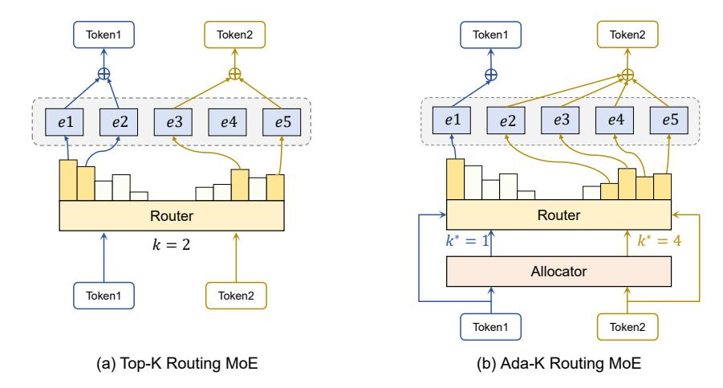
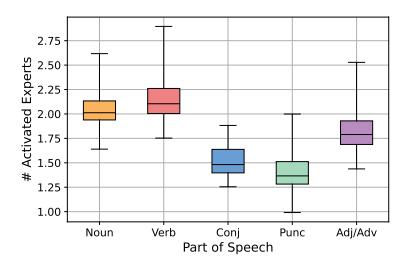
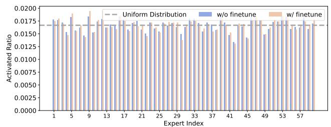

# 2 RELATED WORK

### 2.1 MIXTURE-OF-EXPERTS

The sparse Mixture-of-Experts (MoE) layer, which includes a predetermined number of experts and a routing network, is initially introduced to enhance the capacity of deep neural networks for NLP tasks in LSTM models [\(Shazeer et al., 2017a\)](#page-13-6). This architecture is later extended to Transformers [\(Lepikhin et al., 2020\)](#page-12-5) and adapted for computer vision [\(Riquelme et al., 2021;](#page-12-6) [Daxberger et al.,](#page-10-4) [2023\)](#page-10-4), gaining popularity due to its robust scaling properties [\(Du et al., 2022b;](#page-11-7) [Clark et al., 2022\)](#page-10-5). In the MoE framework, extensive research has focused on refining routing algorithms [\(Hazimeh et al.,](#page-11-8) [2021;](#page-11-8) [Lewis et al., 2021b;](#page-12-7) [Roller et al., 2021;](#page-12-8) [Zhou et al., 2022\)](#page-13-7). Approaches range from random routing [\(Zuo et al., 2021\)](#page-13-8) and activating all experts via weighted averages [\(Eigen et al., 2013\)](#page-11-2), to

Figure 1: Comparison of Top-K and Ada-K routing strategies for MoE: (a) In Top-K routing, each token consistently selects a fixed number of k experts based on predefined model configuration. (b) In Ada-K routing, each token dynamically activates a customized number of experts via our newly introduced learnable allocator module.

selectively engaging a single or multiple experts (Fedus et al., 2022b; Du et al., 2022b). However, they universally deploy a fixed number of experts, irrespective of the differing complexities of input tokens (Lepikhin et al., 2020; Fedus et al., 2022b). In our study, we introduce a parameter-efficient and data-efficient training framework that introduces lightweight learnable modules, *i.e.* allocators. These allocators seamlessly work with routers to dynamically assign expert resources across individual tokens. Our framework markedly reduces computational costs while achieving improved performance compared to the baseline models.

#### 2.2 REINFORCEMENT LEARNING IN LLMS

Recent advancements in Large Language Models (LLMs) have been significantly influenced by Reinforcement Learning (RL). For instance, the Reinforcement Learning from Human Feedback (RLHF) approach has demonstrated efficacy in aligning LLMs with human-centric values and preferences (Bai et al., 2022; Ouyang et al., 2022; Cheng et al., 2024). This method involves training a reward model (RM) that encapsulates human preferences and subsequently refining LLMs based on the reward signals generated by the RM. Additionally, some studies (Lee et al., 2023; Xu et al., 2023; Yue et al., 2024) have investigated the LLM-centric multimodal representation learning, utilizing RL to improve the alignment between the semantic spaces of LLMs and visual concepts. Typically, they often leverage the Proximal Policy Optimization (PPO) algorithm (Stiennon et al., 2020; Nakano et al., 2021) to perform parameter optimization. In this work, we present a novel PPO-based training framework tailored for MoE, a widely-used architecture in modern LLMs. This plug-and-play framework seamlessly integrates with MoE models and its variants. We execute end-to-end agents training via RL, with these agents tasked with resource scheduling for expert activation, thereby significantly enhancing the inference efficiency.

### 3 METHOD

#### 3.1 PRELIMINARY

We first provide a concise overview of the sparse Top-K routing MoE model. Structurally, an MoE layer substitutes the feed-forward network (FFN) sub-block of the original Transformer layer with an expert network comprising N experts  $E = \{e_1, e_2, ..., e_N\}$ . For each token  $x_i$  in the input sequence X, the activation probabilities for each expert are determined via a router layer W:

$$\mathcal{P}(x_i) = \text{Softmax}(W \cdot x_i) \tag{1}$$

with  $W \in \mathbb{R}^{C \times N}$  being a lightweight, trainable projection matrix. Top-K routing MoE employs a routing strategy where the k experts with the highest weights in  $\mathcal{P}(x_i)$  are selected. The weights of the chosen experts are then normalized, while that of the remaining experts are set to zero, indicating

their inactivity:

$$g(x_i) = \frac{\mathcal{P}(x_i)}{\sum_{j \in TopK(\mathbf{P})} P_j} \cdot \mathbf{1}_{i \in TopK(\mathbf{P})}$$
 (2)

where  $\mathbf{1}_{i \in TopK(\mathbf{P})}$  is an indicator function that is 1 if  $i \in TopK(\mathbf{P})$  and 0 otherwise. The final output, derived from  $g(x_i)$ , is a weighted average of the k chosen experts:

$$MoE(x_i) = \sum_{n=1}^{N} g_n(x_i) \cdot e_n(x_i)$$
(3)

### 3.2 Ada-K Routing

In this section, we introduce the proposed Ada-K routing framework outlined in Figure 1. It enhances the conventional Top-K routing by incorporating a novel component called allocator. The allocator works synergistically with the original router to dynamically perform expert allocation for each token  $x_i$ . Structurally, the allocator is a lightweight, trainable linear layer, similar to the router, and is responsible for determining the optimal number of experts  $k^*$  for each token. The allocator takes  $x_i$  as the input and then produces a probability distribution over the possible number of experts:

$$\mathcal{P}_{alloc}(x_i) = \text{Softmax}(W_{alloc} \cdot x_i) \tag{4}$$

Based on this distribution,  $k^*$  is obtained through a non-differentiable sampling operation.

$$k^* \sim \mathcal{P}_{alloc}(x_i)$$
 (5)

Subsequently,  $k^*$  and  $x_i$  are passed to the router, which then activates the top  $k^*$  experts to produce the weighted representations as described in Sec 3.1. However, direct optimization for these allocators via backpropagation is precluded due to the non-differentiable nature of the sampling operation during the forward pass. To address this challenge, we propose a RL-based optimization framework, which will be detailed in the following section.

#### 3.3 Learning Strategy

In our proposed framework, the entire training is specifically tailored to the newly introduced allocators, with the original LLM maintained in a frozen state to preserve its inherent capabilities.

The training objective is to enhance both performance and efficiency, which can be decomposed into optimizing linguistic capabilities and minimizing the average number of activated experts. Regarding linguistic capabilities, we design a PPO loss, which circumvents the need for differentiable action sampling. Regarding the activated expert counts, we incorporate a regularization loss to minimize the expectation value of the allocator's output distribution.

**PPO Loss.** In the setting of RL, the allocator of l-th layer is considered as an *agent* with a policy  $\pi$  parameterized by  $\theta_l$ . We introduce a warm-start strategy to initialize  $\theta_l$ , which will be discussed later. The representation of  $x_i$  at l-th layer is regarded as the *state*  $s_l$ . The number of activated experts  $\hat{c}_l$ , determined through sampling, serves as the *action* taken under policy  $\pi_{\theta_l}$ , i.e.,  $\hat{c}_l \sim \pi_{\theta_l}(\cdot|s_l)$ . The objective is to maximize the expected return  $\mathbb{E}[\sum_{l=1}^L \gamma^{l-1} R(\hat{c}_l, s_l)]$  over the policy  $\pi$ , where  $\gamma$  serves as the discounted factor,  $\gamma \in (0,1]$ , and L represents the number of layers in the model. We define the reward as follows:

$$R(\hat{c}_l, s_l) = \log \mathcal{P}(x_i | x_1, \dots, x_{i-1}) \cdot \mathbf{1}_{l=L}$$

$$\tag{6}$$

where only the allocator at the last layer receives the log likelihood as the reward. In other words, the expected return could be simplified as  $\mathbb{E}[\gamma^{L-1}\log\mathcal{P}(x_i|x_1,\ldots,x_{i-1})]$ . Through the reward defined in this way, maximizing the expected return is equivalent to minimizing caption loss in NLP. We employ the PPO algorithm (Stiennon et al., 2020; Nakano et al., 2021) to optimize the policy within the trust region for stable training. The RL loss function is formulated as follows:

$$\mathcal{L}^{RL}(\theta) = -\mathbb{E}_{l}\left[\min\left(r(\theta_{l})A_{l}, \operatorname{clip}\left(r(\theta_{l}), 1 - \epsilon, 1 + \epsilon\right)A_{l}\right)\right] \tag{7}$$

where  $\epsilon$  is a hyperparameter and clip function is introduced to constrain values within a specified range. The importance sampling ratio  $r(\theta_l)$  is formulated as follows:

$$r(\theta_l) = \pi_{\theta_l}(\hat{c}_l|s_l) / \pi_{\theta_l^{\text{old}}}(\hat{c}_l|s_l)$$
(8)

where  $\theta_l^{\text{old}}$  is the policy parameters before update. In standard PPO algorithm, it needs another value function to compute the advantage, which requires additional network and computations. Alternatively, we apply the form of advantage function in *reinforce with baseline* algorithm (Sutton & Barto, 2018) formulated in Eq.(9), where the baseline is employed to reduce variance theoretically:

$$A_l(\hat{c}_l, s_l) = \sum_{m=l}^{L} \gamma^{m-l} \left[ R(\hat{c}_m, s_m) - R(c_m^*, s_m^*) \right] = \gamma^{L-l} \left[ R(\hat{c}_L, s_L) - R(c_L^*, s_L^*) \right]$$
(9)

The superscript \* denotes the baseline, which is define as default Top-K routing. There is no need of gradients for action  $\hat{c}_l$ , reward  $R(\hat{c}_l,s_l)$ , advantage  $A(\hat{c}_l,s_l)$ , and old sampling probability  $\pi_{\theta_l^{\text{old}}}(\hat{c}_l|s_l)$ , only latest sampling probability  $\pi_{\theta_l}(\hat{c}_l|s_l)$  needs to calculate gradient in training loss.

**Activation Regularization Loss.** The regularization loss reduces the activated expert counts by optimizing the expectation of the distribution produced by every allocator:

$$\mathcal{L}^{reg}(\theta) = \frac{1}{L} \sum_{l=1}^{L} \sum_{n=1}^{N} n \cdot \mathcal{P}_{\theta_l}(n)$$
 (10)

The final loss is a combination of the PPO loss and regularization loss, where  $\lambda$  is a hyper-parameter to control the reduction degree of the activated expert counts.

$$\mathcal{L}(\theta) = \mathcal{L}^{RL}(\theta) + \lambda \mathcal{L}^{reg}(\theta) \tag{11}$$

Warm Start. Given the large decision space encompassing all expert counts, allocators require an effective parameter initialization to mitigate instability and inefficiency caused by arbitrary or incorrect choices. In this paper, we propose a warm-start approach "P-Warm" to pre-train the allocators. This pre-training process utilizes the nucleus sampling (Holtzman et al., 2019) (i.e., Top-P) to generate pseudo-labels. Specifically, we first choose the minimal subset of experts whose cumulative probability, as determined by the original router, surpasses the threshold p. As illustrated in the Eq.(12), for a given token  $x_i$ , the number of experts within the subset is denoted by  $n_i(p)$ :

$$n_i(p) = \underset{k \in \{1...,N\}}{\operatorname{argmin}} \sum_{j < =k} \mathcal{P}_{i,j}^{\downarrow} \ge p \tag{12}$$

where  $\mathcal{P}_{i,j}^{\downarrow}$  represents the probability distribution arranged in descending order. For each baseline, we compute the average expert counts across different p values using a moderate amount of token set T. The p value whose average counts is closest to the default activation value is then selected.

$$p^* = \underset{p}{\operatorname{argmin}} \left| \frac{1}{T} \sum_{i=1}^{T} n_i(p) - k \right|. \tag{13}$$

Finally, for every token  $x_j$  in the training dataset, we utilize  $n_j(p^*)$  as pseudo labels to facilitate the warm start training of the allocators.

#### 4 EXPERIMENTS

#### 4.1 IMPLEMENTATION DETAILS

Model Settings. We verify the effectiveness and universality of our proposed training framework on four prevailing MoE based LLMs, *i.e.* Mixtral-8x22B (Jiang et al., 2024), Mixtral-8x7B (Jiang et al., 2024), DeepSeek-MoE-16B (Dai et al., 2024) and Qwen1.5-MoE-A2.7B (Team). The architectural details of the four baseline models are presented in Table 1. Mixtral-8x7B and Mixtral-8x22B utilize a standard Top-K

Model Settings. We verify the effective- Table 1: Architecture details of four baseline models.

| Config                           | Mixtral 8x22B | Mixtral 8x7B | DeepSeek MoE-16B | Qwen1.5 MoE-A2.7B |
|----------------------------------|------------------|-----------------|---------------------|----------------------|
| Top-K                            | 2                | 2               | 6                   | 4                    |
| Shared Experts                   | 0                | 0               | 2                   | 4                    |
| Routed Experts                   | 8                | 8               | 64                  | 60                   |
| MoE Layers                       | 56               | 32              | 27                  | 24                   |
| Activated Params Total Params | 39.0B 140.6B  | 12.9B 46.7B  | 2.8B 16.4B       | 2.7B 14.3B        |

routing strategy for all experts. Additionally, DeepSeek-MoE-16B and Qwen1.5-MoE-A2.7B classify experts into shared and routed categories. Each token inherently activates all shared experts and selects the Top-K experts from the routed categories. Ada-K is applicable to any routing-based expert module. Besides, we keep the shared experts when present.

Benchmark and Evaluation Details. Following previous works (Touvron et al., 2023b; Le Scao et al., 2023; Li et al., 2023; Black et al., 2022), we employ the lm-evaluation-harness (Gao et al., 2021) to evaluate our model. This tool serves as the backend for the HuggingFace Open LLM Leaderboard (Beeching et al., 2023). Our model is assessed on 6 key benchmarks aligned with Open LLM Leaderboard. We firstly examine the model's accuracy across various benchmarks. Then, we evaluate the computational cost with four metrics: average activated expert counts per token (Act), activation reduction rate (Rate), total floating point operations (FLOPs), and inference time speedup (Speedup). "Rate" is calculated as  $(1-Act/k)\times 100\%$ , where k represents the default activation value. "Speedup" is the cumulative total across six benchmarks and "FLOPs" is measured by one single sample with a length of 256. Refer to Appendix for additional details.

**Training Details.** We adopt AdamW (Loshchilov & Hutter, 2017) as the optimizer. All baseline models are trained for one epoch using a consistent set of 10k samples. The batch size and learning rate is set to 64 and 1e-3, respectively. We leverage 2 PPO epochs for reinforcement learning. For all four baseline models, we uniformly set  $\lambda$  as 3e-3. This ratio prioritizes ensuring a suf-

Table 2: Training overhead of four baseline models.

| Baseline Model    | Total Params | Trainable Params | Training Hours |
|-------------------|-----------------|---------------------|-------------------|
| Mixtral-8x22B     | 140.6B          | 2.75M               | 7.92h             |
| Mixtral-8x7B      | 46.7B           | 1.05M               | 4.96h             |
| DeepSeek-MoE-16B  | 16.4B           | 3.54M               | 1.79h             |
| Qwen1.5-MoE-A2.7B | 14.3B           | 2.95M               | 1.58h             |

ficient reduction rate, while guarantee a performance advantage over the original model. The training overhead for is relatively efficient. As shown in Table 2, the trainable parameters for all baseline models are on the scale of 1M, which is negligible compared to the total parameters. Additionally, we present the training hours for the four baseline models. We employ 16 NVIDIA A800 GPUs to train Mixtral 8x22B, whereas each of the other three utilizes 8 NVIDIA A800 GPUs. The training time for all baseline models is limited to 8 hours. Further details can be found in the Appendix.

#### 4.2 Performance Evaluation

Table 3: Performance for four baseline models across six benchmarks. Results using default Top-K routing and our method are highlighted in brown and blue, respectively. Each arrow and its associated numeric annotation indicate the performance disparity with the default Top-K baseline.

| Method         |       |       |       | Accurac | y     |       |                     |       | Co     | mputation |               |
|----------------|-------|-------|-------|---------|-------|-------|---------------------|-------|--------|-----------|---------------|
| 1/10/11/04     | ARC-C | Hella | MMLU  | GSM     | Truth | Wino  | Average             | Act ↓ | Rate ↑ | FLOPs ↓   | Speedup ↑     |
| Mixtral-8x22B  |       |       |       |         |       |       |                     |       |        |           |               |
| Top-K $(k=1)$  | 66.22 | 85.43 | 73.15 | 70.96   | 61.54 | 82.77 | 73.35 \$\15.80\$    | 1.00  | 50.0%  | 11.38T    | 1.39×         |
| Top-K $(k=2)$  | 72.70 | 89.08 | 77.77 | 82.03   | 68.14 | 85.16 | 79.15               | 2.00  | 0.0%   | 20.04T    | 1.00×         |
| Ada-K          | 73.57 | 89.76 | 78.22 | 82.98   | 69.97 | 85.02 | 79.92 ↑0.77         | 1.31  | 34.4%  | 14.08T    | 1.31×         |
| Mixtral-8x7B   |       |       |       |         |       |       |                     |       |        |           |               |
| Top-K $(k=1)$  | 60.41 | 83.13 | 64.71 | 40.71   | 34.67 | 75.77 | 59.90 \$\psi_7.68\$ | 1.00  | 50.0%  | 3.68T     | 1.35×         |
| Top-K $(k=2)$  | 66.72 | 86.48 | 70.39 | 58.38   | 41.25 | 82.24 | 67.58               | 2.00  | 0.0%   | 6.56T     | 1.00×         |
| Ada-K          | 68.49 | 87.23 | 70.40 | 58.61   | 42.85 | 81.45 | 68.19 ↑0.61         | 1.40  | 30.0%  | 4.42T     | 1.28×         |
| Qwen1.5-MoE-A  | 2.7B  |       |       |         |       |       |                     |       |        |           |               |
| Top-K $(k=2)$  | 51.88 | 77.99 | 59.20 | 14.21   | 38.87 | 70.11 | 52.04 \(\pi\)2.39   | 2.00  | 50.0 % | 0.88T     | 1.25×         |
| Top-K $(k=3)$  | 52.78 | 78.69 | 60.65 | 14.78   | 40.96 | 72.20 | 53.34 \1.09         | 3.00  | 25.0 % | 1.00T     | $1.14 \times$ |
| Top-K $(k=4)$  | 54.69 | 79.45 | 61.30 | 15.62   | 42.50 | 73.00 | 54.43               | 4.00  | 0.0%   | 1.23T     | 1.00×         |
| Ada-K          | 54.41 | 79.65 | 60.99 | 21.21   | 41.96 | 72.53 | 55.13 ↑0.70         | 2.58  | 35.5%  | 0.92T     | 1.22×         |
| DeepSeek-MoE-1 | 16B   |       |       |         |       |       |                     |       |        |           |               |
| Top-K $(k=3)$  | 51.37 | 78.33 | 40.11 | 12.59   | 30.16 | 72.22 | 47.46 \(\psi_2.45\) | 3.00  | 50.0%  | 0.96T     | 1.27×         |
| Top-K $(k=4)$  | 52.73 | 79.44 | 43.04 | 14.86   | 30.34 | 72.88 | 48.87 \$\psi_1.04\$ | 4.00  | 33.3%  | 1.08T     | 1.18×         |
| Top-K $(k=5)$  | 52.39 | 79.71 | 44.00 | 15.30   | 30.92 | 73.72 | 49.34 \ \ 0.57      | 5.00  | 16.7%  | 1.20T     | $1.08 \times$ |
| Top-K $(k=6)$  | 52.22 | 79.84 | 44.72 | 16.45   | 31.07 | 75.14 | 49.91               | 6.00  | 0.0%   | 1.36T     | 1.00×         |
| Ada-K          | 53.44 | 80.24 | 44.98 | 16.86   | 31.83 | 75.92 | 50.55 ↑0.64         | 3.61  | 40.0%  | 1.00T     | 1.24×         |

For the four baselines, the relevant accuracy and computation metrics (detailed in Sec 4.1) are reported in Table 3. Additionally, we present the metrics of the baseline models under a lower Top-K activation level (e.g., k=1 for Mixtral-8x7B) as a supplementary comparison. The implementation of Ada-K routing leads to a significant and consistent improvement in accuracy across all baselines compared to the default settings. This enhancement is particularly noteworthy, as models employing Ada-K routing not only achieve these accuracy gains but also reduce FLOPs by over 25% and accelerate inference by more than 20%, demonstrating a compelling balance between performance and efficiency. We believe these results arises from a more effective expert resource allocation.

#### 4.3 ABLATION STUDY

In this section, we perform a comprehensive ablation analysis of the proposed training framework. It should be noted that the conclusions are consistent across four baseline models. However, due to space limitations, we uniformly present the numerical results based on Qwen1.5-MoE-A2.7B.

Trade-off between performance and activation reduction rate. We first investigate the trade-off between the activation reduction rate and model performance. As detailed in Sec 4.1, the results in Table 3 are based on a fixed value of  $\lambda$  (i.e., 3e-3) in Equation 11. Actually, Ada-K could facilitates a more flexible balance between accuracy and computational efficiency through it. By varying  $\lambda$ , we generate 15 data points to construct the trade-off curve illustrated in Figure 2. The trade-off point in the figure correspond to Table 3. Analysis reveals that, prior to the trade-off point, accuracy declines gradually with increasing activation reduction. However, beyond this point, the rate of decline accelerates sharply. Importantly, our method consistently surpasses the default Top-K model until the activation

55.5

55.0

54.5

54.5

55.0

54.5

55.0

54.5

55.0

54.5

55.0

54.5

55.0

54.5

55.0

54.5

55.0

54.5

55.0

54.5

54.0

52.5

65.0

54.0

52.5

60.0

60.0

60.0

Activation Reduction Rate

Figure 2: Trade-off curve between performance and activation reduction rate.

reduction rate reaches approximately 44%. Compared to traditional Top-K routing, Ada-K provides both adjustable flexibility and a more effective balance between performance and efficiency.

Effect of dynamic routing. To the best of our knowledge, Ada-K is the first learnable dynamic expert allocation strategy. In this section, we aim to explore and validate the advantages of this pure dynamic paradigm. Actually, as shown in Table 3, at comparable activation reduction rates, baseline models with lower Top-K activation levels exhibit a significant performance gap when compared to Ada-K routing. To adapt these baseline models, which have reduced numbers of active experts, to their new activation patterns, we fine-tune their routers using the same 10K dataset as Ada-K. This process effectively imparts a pseudo-dynamic quality to the static Top-K routing. Additionally, some prior works (e.g., MoE-D (Huang et al., 2024) and D2DMoE (Piórczyński et al., 2023) achieve quasidynamic routing through fixed thresholds. They determine the activation of each expert by comparing the routers' output against these thresholds. We

Table 4: Ablation study about the dynamic routing. The results of default Top-K routing and our method are highlighted in brown and blue, respectively.

| Route                                        | Tuned | Acc                                       | Rate           |
|----------------------------------------------|-------|-------------------------------------------|----------------|
| Top-K $(k = 2)$                              | ×     | 52.54 \(\pm\)1.89 52.85 \(\pm\)1.58    | 50.0% 50.0% |
| Тор-К $(k=3)$                                | ×     | 53.34 \1.09 53.44 \1.09                | 25.0% 25.0% |
| Тор-К $(k=4)$                                | ×     | 54.43 53.89 \underset{0.54}            | 0.0% 0.0%   |
| MoED $(p = 0.3)$ MoED $(p = 0.4)$         | /     | 53.45 \(\pi_{0.98}\) 53.60 \(\pi_{0.83}\) | 32.4% 28.6% |
| D2D ( $\tau = 0.1$ ) D2D ( $\tau = 0.2$ ) | /     | 53.73 \u00e40.70 53.64 \u00e40.79      | 27.8% 31.5% |
| Ada-K                                        | ✓     | 55.13 ↑0.70                               | 35.5%          |

also include these methods in our comparison by reproducing them using their official code. The results in Table 4 suggest that improving the adaptability of static routing leads to modest performance gains relative to the original baselines. Additionally, threshold-based routing demonstrates a slight advantage over static routing. However, these methods still fall significantly short compared to Ada-K, highlighting the critical need for a dynamic and efficient expert allocation strategy.

Effect of activation regularization. In this section, we explore different schemes for reducing expert activations. The related results are reported in Table 5. Since the expectation of each allocator's output distribution is differentiable, it allows for direct optimization via backpropagation (row "As Loss"). So we choose it as the default method. Alternatively, combining the language modeling likelihood and the activate expert count of each token to form a reward presents another viable strategy (row "As Reward"). It introduces a reward-level trade-off

Table 5: Ablation study about the activation regularization methods. The results of default Top-K routing and our method are highlighted in brown and blue, respectively.

| Method    | Acc         | Act  | Rate  |
|-----------|-------------|------|-------|
| Original  | 54.43       | 4.00 | 0.0%  |
| As Reward | 54.64 ↑0.21 | 2.56 | 36.0% |
| As Loss   | 55.13 ↑0.70 | 2.58 | 35.5% |

where all training objectives are uniformly optimized through the PPO loss. For fair comparison, we employ the same training data and ensure consistent activation reduction rates. The results indicate that direct optimization of expectations yields marginally better performance than treating them as rewards. However, the difference is not significant. It highlights the effectiveness and robustness of Ada-K routing training.

Effect of training data. In this section, we examine the impacts of varying training data, *i.e.* pretrain and supervised fine-tuning (SFT) data. For fairness, each data type comprises 10k samples sourced from prominent open-source corpus. We report the training results in Table 6. The results indicate that the training is not sensitive to the data domain. It achieves comparable performance across two data settings, demonstrating both the effectiveness and robustness of Ada-K routing training. We detail the collection and organization processes for two types of data in the Appendix.

Effect of warm up strategy. In this section, we conduct an ablation study on different warm start strategies. The results are reported in Table 7. If no warm-up strategy is employed, the allocators are initialized randomly (the second row). The K-Warm strategy involves pretraining the allocators to consistently output k. For P-Warm, as detailed in Sec 3.3, pseudo-labels are generated using a specific p value. The findings indicate that both the K-Warm and P-Warm strategies obviously surpass the performance of the default baseline, whereas the random strategy shows only comparable performance. It is largely due to the pre-training mitigates the sampling arbitrariness caused by random initialization,

Table 6: Ablation study about the training data type. The results of default Top-K routing and our method are highlighted in brown and blue, respectively.

| Data Type | Acc         | Act  | Rate  |
|-----------|-------------|------|-------|
| Original  | 54.43       | 4.00 | 0.0%  |
| Pretrain  | 55.78 ↑1.35 | 2.68 | 33.0% |
| SFT       | 55.13 ↑0.70 | 2.58 | 35.5% |

Table 7: Ablation study about the warm up strategy. The results of default Top-K routing and our method are highlighted in brown and blue.

| Strategy         | Acc                        | Act          | Rate           |
|------------------|----------------------------|--------------|----------------|
| Original         | 54.43                      | 4.00         | 0.0%           |
|                  | 54.18 \ \( 0.25 \)         | 2.88         | 28.0%          |
| K-Warm P-Warm | 54.97 ↑0.54 55.13 ↑0.70 | 2.60 2.58 | 35.0% 35.5% |

facilitating the learning of more optimal strategies. Additionally, the more flexible warmup strategy *P-Warm* yields marginally improved performances compared to the static *K-Warm*.

#### 4.4 VISUALIZATION AND ANALYSIS

In this section, we provide a detailed analysis and visualization of the policies learned by the agents (*i.e.*, allocators) after training with Ada-K routing. Due to space limitations, we uniformly present the numerical results based on Qwen1.5-MoE-A2.7B.

Expert resource allocation is more adaptive. We initially analyze the probability distribution of activated expert counts per token:  $\mathcal{P}(k) = \frac{r(k)}{\sum_{n=1}^N r(n)}$ , where r(k) represents the number of tokens activating k experts. The results for each benchmark are illustrated in Figure 3 using a logarithmic scale for enhanced clarity. The analysis reveals: (1) The decision space available to trained allocators ranges from 1 to the total number of experts, ensuring adaptive resource allocation. (2) The training effectively reduces the activation levels of the majority of tokens to approximately 2 or 3. Concurrently, around 10% of essential tokens are identified and subjected to enhanced processing by engaging more than the default number of experts. (3) The expert activation distribution differs across benchmarks, demonstrating that the trained allocators are capable of adapting to diverse domains and devise customized solutions accordingly.

Middle layers tend to activate more experts. As illustrated in Figure 4, variations in layer depth consistently impact average expert activations across multiple benchmarks. Specifically, both the shallow and deep layers utilize fewer experts, whereas the intermediate layers employ a higher number of experts. We hypothesize that this can be attributed to the varying complexities at different stages of processing. Shallow layers mainly engage in basic feature extraction, e.g. recognizing simple syntactic patterns and semantic elements, which might generally necessitates minimal specialized knowledge and thus reduces the requirement for experts. Conversely, middle layers might play a pivotal role in more intricate tasks, including the integration of basic features into sophisticated

Figure 3: Probability distribution curves of expert activations per token across six benchmarks.

Figure 4: Curves of expert activations per layer across six benchmarks.

representations, ambiguity resolution, and the comprehension of contextual nuances. These tasks could likely benefit from a diverse array of specialized inputs, possibly necessitating a larger pool of experts to enhance the processing robustness. In contrast, deep layers might primarily concentrate on refining these integrated features and finalizing the output, mainly involving the application and optimizing of processed information, which can typically be achieved with fewer experts.

Content words tend to activate more experts. To evaluate the impact of token attributes, we statistically analyze both part-of-speech (POS) and expert activations for a total of 51 million tokens across six benchmarks. To reduce variability due to randomness, our analysis only includes tokens that occur more than 1,000 times within these corpora. POS tagging is performed using the NLTK toolkit (Bird, 2006). We calculate average activations for prevalent POS categories, namely nouns, verbs, conjunctions, adjectives/adverbs, and punctuation. The findings presented in Figure 5 suggest that enhanced expert resource tends to concentrate on verbs and nouns, which are central to syntactic construction and convey clear semantic meanings. In contrast, the expert activations on elements with weaker semantic content, e.g. special symbols and conjunctions, are relatively less. This conclusion largely substantiates the intuitive basis for our research motivation. The strategies learned by the agents (i.e., allocators) tend to allocate more expert resources to tokens rich in semantic information, allowing for thorough modeling. Conversely, tokens with weaker semantics require only minimal expert resources for effective representation. This more rational resource allocation strategy benefits both semantic understanding and computational efficiency.

**Load balance is maintained.** In this section, we investigate whether the previously established expert load balance of the default Top-K model is maintained after fine-tuning with our Ada-K routing. Intuitively, since the router that determines expert allocation remains frozen throughout the training process, our framework is anticipated to minimally disturb the original load balance. We assess the activation probability of each expert across six benchmarks, as illustrated in Figure 6. The results demonstrate that the load on each expert remains nearly unchanged before and after training, preserving a nearly uniform distribution.

number per token across different parts of speech.

Figure 5: Average expert activation Figure 6: Distribution curves of expert workloads before and after Ada-K fine-tuning. The gray horizontal line represents the uniform distribution of expert activations.

Table 8: Average activated experts and accuracy delta across tasks of varying difficulty levels. ∆Acc represents the absolute performance improvement compared to default Top-K routing.

| Benchmarks | Act  | ∆Acc  |
|------------|------|-------|
| ARC-E      | 2.23 | -0.40 |
| ARC-C      | 2.84 | +0.12 |
| Collection | 2.58 | +0.70 |
| BBH        | 3.43 | +5.54 |

Table 9: The relationship between the ratio of layers equipped with the allocator to all layers and the corresponding metrics. The results with default setting are highlighted in blue .

| Ratio | Training Params | Training Time | Acc   | FLOPs |
|-------|--------------------|------------------|-------|-------|
| 0.125 | 0.37M              | 1.54h            | 54.98 | 1.19T |
| 0.25  | 0.74M              | 1.55h            | 55.06 | 1.14T |
| 0.5   | 1.48M              | 1.56h            | 55.15 | 1.04T |
| 1.00  | 2.95M              | 1.58h            | 55.13 | 0.92T |

*Hard tasks tend to activate more experts.* As shown in Table [8,](#page-9-0) we examine the effect of task difficulty on activated expert counts across both intra-benchmark and inter-benchmark dimensions. For both dimensions, we report the average number of activated experts and the performance gains (relative to the default Top-K setting) of our method. For intra-benchmark dimension, we leverage ARC, a multiple-choice question-answering dataset consisting of science exam questions for grades 3 to 9, we analyze two levels of task difficulty, namely Easy (E) and Challenge (C). For inter-benchmark dimension, we compare the commonly used six benchmarks (detailed in Sec [4.1\)](#page-5-1) with BBH (BIG-Bench Hard) [\(Suzgun et al., 2022\)](#page-13-13). BBH comprises 23 demanding tasks that require sophisticated cognitive skills such as multi-hop reasoning, causal inference, and logical deduction, markedly exceeding the difficulty of the collection of six benchmarks. The results indicate that model with Ada-K routing activates more experts on harder tasks (*i.e.*, 2.23 *vs.* 2.84 for intra-benchmark and 2.58 *vs.* 3.43 for inter-benchmark).

Furthermore, we discover that the model with Ada-K excels at handling challenging tasks. Specifically, for the intra-benchmark dimension, our method demonstrates a moderate performance loss compared to the baseline with Top-K routing in ARC-E. However, when the task difficulty is increased to ARC-C, the model with Ada-K exhibits a performance advantage. Similar conclusions are even more evident in the inter-benchmark dimension. This indicates that, when faced with highly complex tasks, the flexibility of Ada-K in concentrating expert resources on key tokens enables more effective modeling of the tasks, leading to improved adaptability.

*Equipped more layers with allocator yields better performance.* In this section, we investigate the impact of varying allocator deployment ratios. By default, we integrate an allocator at each layer of the baseline models. The relevant results are presented in Table [9.](#page-9-0) All selected layers are sampled at equal intervals across the model. Our findings indicate that, due to the lightweight nature of the allocators, even when all layers are equipped with them, the number of trainable parameters remains minimal, resulting in only a negligible increase in time overhead. Moreover, while this effect does not significantly impact accuracy in benchmark evaluations, equipping more layers with an allocator clearly reduces computational overhead. Consequently, deploying allocators on a per-layer basis emerges as the optimal choice, as it enables a more refined expert allocation strategy at each layer, facilitating the scheduling of expert computations throughout the model.

