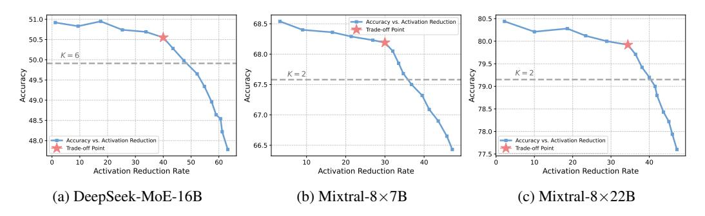

# REFERENCES

- Yuntao Bai, Andy Jones, Kamal Ndousse, Amanda Askell, Anna Chen, Nova DasSarma, Dawn Drain, Stanislav Fort, Deep Ganguli, Tom Henighan, et al. Training a helpful and harmless assistant with reinforcement learning from human feedback. *arXiv preprint arXiv:2204.05862*, 2022.
- Edward Beeching, Clémentine Fourrier, Nathan Habib, Sheon Han, Nathan Lambert, Nazneen Rajani, Omar Sanseviero, Lewis Tunstall, and Thomas Wolf. Open llm leaderboard. [https:](https://huggingface.co/spaces/HuggingFaceH4/open_llm_leaderboard) [//huggingface.co/spaces/HuggingFaceH4/open\\_llm\\_leaderboard](https://huggingface.co/spaces/HuggingFaceH4/open_llm_leaderboard), 2023.
- Steven Bird. Nltk: the natural language toolkit. In *Proceedings of the COLING/ACL 2006 Interactive Presentation Sessions*, pp. 69–72, 2006.
- Sid Black, Stella Biderman, Eric Hallahan, Quentin Anthony, Leo Gao, Laurence Golding, Horace He, Connor Leahy, Kyle McDonell, Jason Phang, et al. Gpt-neox-20b: An open-source autoregressive language model. *arXiv preprint arXiv:2204.06745*, 2022.
- Tom Brown, Benjamin Mann, Nick Ryder, Melanie Subbiah, Jared D Kaplan, Prafulla Dhariwal, Arvind Neelakantan, Pranav Shyam, Girish Sastry, Amanda Askell, et al. Language models are few-shot learners. *Advances in neural information processing systems*, 33:1877–1901, 2020a.
- Tom Brown, Benjamin Mann, Nick Ryder, Melanie Subbiah, Jared D Kaplan, Prafulla Dhariwal, Arvind Neelakantan, Pranav Shyam, Girish Sastry, Amanda Askell, et al. Language models are few-shot learners. *Advances in neural information processing systems*, 33:1877–1901, 2020b.
- Jie Cheng, Gang Xiong, Xingyuan Dai, Qinghai Miao, Yisheng Lv, and Fei-Yue Wang. Rime: Robust preference-based reinforcement learning with noisy preferences. *arXiv preprint arXiv:2402.17257*, 2024.
- Wei-Lin Chiang, Zhuohan Li, Zi Lin, Ying Sheng, Zhanghao Wu, Hao Zhang, Lianmin Zheng, Siyuan Zhuang, Yonghao Zhuang, Joseph E Gonzalez, et al. Vicuna: An open-source chatbot impressing gpt-4 with 90%\* chatgpt quality. *See https://vicuna. lmsys. org (accessed 14 April 2023)*, 2023.
- Aidan Clark, Diego de Las Casas, Aurelia Guy, Arthur Mensch, Michela Paganini, Jordan Hoffmann, Bogdan Damoc, Blake Hechtman, Trevor Cai, Sebastian Borgeaud, et al. Unified scaling laws for routed language models. In *International conference on machine learning*, pp. 4057–4086. PMLR, 2022.
- Peter Clark, Isaac Cowhey, Oren Etzioni, Tushar Khot, Ashish Sabharwal, Carissa Schoenick, and Oyvind Tafjord. Think you have solved question answering? try arc, the ai2 reasoning challenge. *arXiv preprint arXiv:1803.05457*, 2018.
- Karl Cobbe, Vineet Kosaraju, Mohammad Bavarian, Mark Chen, Heewoo Jun, Lukasz Kaiser, Matthias Plappert, Jerry Tworek, Jacob Hilton, Reiichiro Nakano, et al. Training verifiers to solve math word problems. *arXiv preprint arXiv:2110.14168*, 2021.
- Damai Dai, Chengqi Deng, Chenggang Zhao, RX Xu, Huazuo Gao, Deli Chen, Jiashi Li, Wangding Zeng, Xingkai Yu, Y Wu, et al. Deepseekmoe: Towards ultimate expert specialization in mixtureof-experts language models. *arXiv preprint arXiv:2401.06066*, 2024.
- Erik Daxberger, Floris Weers, Bowen Zhang, Tom Gunter, Ruoming Pang, Marcin Eichner, Michael Emmersberger, Yinfei Yang, Alexander Toshev, and Xianzhi Du. Mobile v-moes: Scaling down vision transformers via sparse mixture-of-experts. *arXiv preprint arXiv:2309.04354*, 2023.

- Nan Du, Yanping Huang, Andrew M. Dai, Simon Tong, Dmitry Lepikhin, Yuanzhong Xu, Maxim Krikun, Yanqi Zhou, Adams Wei Yu, Orhan Firat, Barret Zoph, Liam Fedus, Maarten P. Bosma, Zongwei Zhou, Tao Wang, Yu Emma Wang, Kellie Webster, Marie Pellat, Kevin Robinson, Kathleen S. Meier-Hellstern, Toju Duke, Lucas Dixon, Kun Zhang, Quoc V. Le, Yonghui Wu, Zhifeng Chen, and Claire Cui. Glam: Efficient scaling of language models with mixture-of-experts. In Kamalika Chaudhuri, Stefanie Jegelka, Le Song, Csaba Szepesvári, Gang Niu, and Sivan Sabato (eds.), *International Conference on Machine Learning, ICML 2022, 17-23 July 2022, Baltimore, Maryland, USA*, volume 162 of *Proceedings of Machine Learning Research*, pp. 5547–5569. PMLR, 2022a. URL <https://proceedings.mlr.press/v162/du22c.html>.
- Nan Du, Yanping Huang, Andrew M Dai, Simon Tong, Dmitry Lepikhin, Yuanzhong Xu, Maxim Krikun, Yanqi Zhou, Adams Wei Yu, Orhan Firat, et al. Glam: Efficient scaling of language models with mixture-of-experts. In *International Conference on Machine Learning*, pp. 5547–5569. PMLR, 2022b.
- David Eigen, Marc'Aurelio Ranzato, and Ilya Sutskever. Learning factored representations in a deep mixture of experts. *arXiv preprint arXiv:1312.4314*, 2013.
- William Fedus, Barret Zoph, and Noam Shazeer. Switch transformers: Scaling to trillion parameter models with simple and efficient sparsity. *J. Mach. Learn. Res.*, 23:120:1–120:39, 2022a. URL <http://jmlr.org/papers/v23/21-0998.html>.
- William Fedus, Barret Zoph, and Noam Shazeer. Switch transformers: Scaling to trillion parameter models with simple and efficient sparsity. *Journal of Machine Learning Research*, 23(120):1–39, 2022b.
- Leo Gao, Jonathan Tow, Stella Biderman, Sid Black, Anthony DiPofi, Charles Foster, Laurence Golding, Jeffrey Hsu, Kyle McDonell, Niklas Muennighoff, Jason Phang, Laria Reynolds, Eric Tang, Anish Thite, Ben Wang, Kevin Wang, and Andy Zou. A framework for few-shot language model evaluation, September 2021. URL <https://doi.org/10.5281/zenodo.5371628>.
- Kelvin Guu, Kenton Lee, Zora Tung, Panupong Pasupat, and Mingwei Chang. Retrieval augmented language model pre-training. In *International conference on machine learning*, pp. 3929–3938. PMLR, 2020.
- Hussein Hazimeh, Zhe Zhao, Aakanksha Chowdhery, Maheswaran Sathiamoorthy, Yihua Chen, Rahul Mazumder, Lichan Hong, and Ed Chi. Dselect-k: Differentiable selection in the mixture of experts with applications to multi-task learning. *Advances in Neural Information Processing Systems*, 34:29335–29347, 2021.
- Dan Hendrycks, Collin Burns, Steven Basart, Andy Zou, Mantas Mazeika, Dawn Song, and Jacob Steinhardt. Measuring massive multitask language understanding. *arXiv preprint arXiv:2009.03300*, 2020.
- Ari Holtzman, Jan Buys, Li Du, Maxwell Forbes, and Yejin Choi. The curious case of neural text degeneration. *arXiv preprint arXiv:1904.09751*, 2019.
- Quzhe Huang, Zhenwei An, Nan Zhuang, Mingxu Tao, Chen Zhang, Yang Jin, Kun Xu, Liwei Chen, Songfang Huang, and Yansong Feng. Harder tasks need more experts: Dynamic routing in moe models. *arXiv preprint arXiv:2403.07652*, 2024.
- Robert A Jacobs, Michael I Jordan, Steven J Nowlan, and Geoffrey E Hinton. Adaptive mixtures of local experts. *Neural computation*, 3(1):79–87, 1991.
- Albert Q Jiang, Alexandre Sablayrolles, Antoine Roux, Arthur Mensch, Blanche Savary, Chris Bamford, Devendra Singh Chaplot, Diego de las Casas, Emma Bou Hanna, Florian Bressand, et al. Mixtral of experts. *arXiv preprint arXiv:2401.04088*, 2024.
- Jared Kaplan, Sam McCandlish, Tom Henighan, Tom B Brown, Benjamin Chess, Rewon Child, Scott Gray, Alec Radford, Jeffrey Wu, and Dario Amodei. Scaling laws for neural language models. *arXiv preprint arXiv:2001.08361*, 2020.

- Teven Le Scao, Angela Fan, Christopher Akiki, Ellie Pavlick, Suzana Ilic, Daniel Hesslow, Roman ´ Castagné, Alexandra Sasha Luccioni, François Yvon, Matthias Gallé, et al. Bloom: A 176bparameter open-access multilingual language model. 2023.
- Kimin Lee, Hao Liu, Moonkyung Ryu, Olivia Watkins, Yuqing Du, Craig Boutilier, Pieter Abbeel, Mohammad Ghavamzadeh, and Shixiang Shane Gu. Aligning text-to-image models using human feedback. *arXiv preprint arXiv:2302.12192*, 2023.
- Dmitry Lepikhin, HyoukJoong Lee, Yuanzhong Xu, Dehao Chen, Orhan Firat, Yanping Huang, Maxim Krikun, Noam Shazeer, and Zhifeng Chen. Gshard: Scaling giant models with conditional computation and automatic sharding. *arXiv preprint arXiv:2006.16668*, 2020.
- Mike Lewis, Shruti Bhosale, Tim Dettmers, Naman Goyal, and Luke Zettlemoyer. BASE layers: Simplifying training of large, sparse models. In Marina Meila and Tong Zhang (eds.), *Proceedings of the 38th International Conference on Machine Learning, ICML 2021, 18-24 July 2021, Virtual Event*, volume 139 of *Proceedings of Machine Learning Research*, pp. 6265–6274. PMLR, 2021a. URL <http://proceedings.mlr.press/v139/lewis21a.html>.
- Mike Lewis, Shruti Bhosale, Tim Dettmers, Naman Goyal, and Luke Zettlemoyer. Base layers: Simplifying training of large, sparse models. In *International Conference on Machine Learning*, pp. 6265–6274. PMLR, 2021b.
- Raymond Li, Loubna Ben Allal, Yangtian Zi, Niklas Muennighoff, Denis Kocetkov, Chenghao Mou, Marc Marone, Christopher Akiki, Jia Li, Jenny Chim, et al. Starcoder: may the source be with you! *arXiv preprint arXiv:2305.06161*, 2023.
- Stephanie Lin, Jacob Hilton, and Owain Evans. Truthfulqa: Measuring how models mimic human falsehoods. *arXiv preprint arXiv:2109.07958*, 2021.
- Ilya Loshchilov and Frank Hutter. Decoupled weight decay regularization. *arXiv preprint arXiv:1711.05101*, 2017.
- Reiichiro Nakano, Jacob Hilton, Suchir Balaji, Jeff Wu, Long Ouyang, Christina Kim, Christopher Hesse, Shantanu Jain, Vineet Kosaraju, William Saunders, et al. Webgpt: Browser-assisted question-answering with human feedback. *arXiv preprint arXiv:2112.09332*, 2021.
- Long Ouyang, Jeffrey Wu, Xu Jiang, Diogo Almeida, Carroll Wainwright, Pamela Mishkin, Chong Zhang, Sandhini Agarwal, Katarina Slama, Alex Ray, et al. Training language models to follow instructions with human feedback. *Advances in Neural Information Processing Systems*, 35: 27730–27744, 2022.
- Mikołaj Piórczynski, Filip Szatkowski, Klaudia Bałazy, and Bartosz Wójcik. Exploiting transformer ´ activation sparsity with dynamic inference. *arXiv preprint arXiv:2310.04361*, 2023.
- Colin Raffel, Noam Shazeer, Adam Roberts, Katherine Lee, Sharan Narang, Michael Matena, Yanqi Zhou, Wei Li, and Peter J Liu. Exploring the limits of transfer learning with a unified text-to-text transformer. *The Journal of Machine Learning Research*, 21(1):5485–5551, 2020.
- Carlos Riquelme, Joan Puigcerver, Basil Mustafa, Maxim Neumann, Rodolphe Jenatton, André Susano Pinto, Daniel Keysers, and Neil Houlsby. Scaling vision with sparse mixture of experts. *Advances in Neural Information Processing Systems*, 34:8583–8595, 2021.
- Anna Rogers, Olga Kovaleva, and Anna Rumshisky. A primer in bertology: What we know about how bert works. *Transactions of the Association for Computational Linguistics*, 8:842–866, 2021.
- Stephen Roller, Sainbayar Sukhbaatar, Jason Weston, et al. Hash layers for large sparse models. *Advances in Neural Information Processing Systems*, 34:17555–17566, 2021.
- Keisuke Sakaguchi, Ronan Le Bras, Chandra Bhagavatula, and Yejin Choi. Winogrande: An adversarial winograd schema challenge at scale. *Communications of the ACM*, 64(9):99–106, 2021.
- Timo Schick and Hinrich Schütze. Exploiting cloze questions for few shot text classification and natural language inference. *arXiv preprint arXiv:2001.07676*, 2020.

- Noam Shazeer, Azalia Mirhoseini, Krzysztof Maziarz, Andy Davis, Quoc Le, Geoffrey Hinton, and Jeff Dean. Outrageously large neural networks: The sparsely-gated mixture-of-experts layer. *arXiv preprint arXiv:1701.06538*, 2017a.
- Noam Shazeer, Azalia Mirhoseini, Krzysztof Maziarz, Andy Davis, Quoc V. Le, Geoffrey E. Hinton, and Jeff Dean. Outrageously large neural networks: The sparsely-gated mixture-of-experts layer. In *5th International Conference on Learning Representations, ICLR 2017, Toulon, France, April 24-26, 2017, Conference Track Proceedings*. OpenReview.net, 2017b. URL [https://](https://openreview.net/forum?id=B1ckMDqlg) [openreview.net/forum?id=B1ckMDqlg](https://openreview.net/forum?id=B1ckMDqlg).
- Nisan Stiennon, Long Ouyang, Jeffrey Wu, Daniel Ziegler, Ryan Lowe, Chelsea Voss, Alec Radford, Dario Amodei, and Paul F Christiano. Learning to summarize with human feedback. *Advances in Neural Information Processing Systems*, 33:3008–3021, 2020.
- Richard S Sutton and Andrew G Barto. *Reinforcement learning: An introduction*. MIT press, 2018.
- Mirac Suzgun, Nathan Scales, Nathanael Schärli, Sebastian Gehrmann, Yi Tay, Hyung Won Chung, Aakanksha Chowdhery, Quoc V Le, Ed H Chi, Denny Zhou, et al. Challenging big-bench tasks and whether chain-of-thought can solve them. *arXiv preprint arXiv:2210.09261*, 2022.
- Rohan Taori, Ishaan Gulrajani, Tianyi Zhang, Yann Dubois, Xuechen Li, Carlos Guestrin, Percy Liang, and Tatsunori B Hashimoto. Alpaca: A strong, replicable instruction-following model. *Stanford Center for Research on Foundation Models. https://crfm. stanford. edu/2023/03/13/alpaca. html*, 3(6):7, 2023.
- Qwen Team. Qwen1.5-moe: Matching 7b model performance with 1/3 activated parameters. [https:](https://qwenlm.github.io/blog/qwen-moe/) [//qwenlm.github.io/blog/qwen-moe/](https://qwenlm.github.io/blog/qwen-moe/). Accessed: 2024-03-28.
- Hugo Touvron, Thibaut Lavril, Gautier Izacard, Xavier Martinet, Marie-Anne Lachaux, Timothée Lacroix, Baptiste Rozière, Naman Goyal, Eric Hambro, Faisal Azhar, et al. Llama: Open and efficient foundation language models. *arXiv preprint arXiv:2302.13971*, 2023a.
- Hugo Touvron, Louis Martin, Kevin Stone, Peter Albert, Amjad Almahairi, Yasmine Babaei, Nikolay Bashlykov, Soumya Batra, Prajjwal Bhargava, Shruti Bhosale, et al. Llama 2: Open foundation and fine-tuned chat models. *arXiv preprint arXiv:2307.09288*, 2023b.
- Ashish Vaswani, Noam Shazeer, Niki Parmar, Jakob Uszkoreit, Llion Jones, Aidan N Gomez, Łukasz Kaiser, and Illia Polosukhin. Attention is all you need. *Advances in neural information processing systems*, 30, 2017.
- Jiazheng Xu, Xiao Liu, Yuchen Wu, Yuxuan Tong, Qinkai Li, Ming Ding, Jie Tang, and Yuxiao Dong. Imagereward: Learning and evaluating human preferences for text-to-image generation. *arXiv preprint arXiv:2304.05977*, 2023.
- Tongtian Yue, Jie Cheng, Longteng Guo, Xingyuan Dai, Zijia Zhao, Xingjian He, Gang Xiong, Yisheng Lv, and Jing Liu. Sc-tune: Unleashing self-consistent referential comprehension in large vision language models. *arXiv preprint arXiv:2403.13263*, 2024.
- Rowan Zellers, Ari Holtzman, Yonatan Bisk, Ali Farhadi, and Yejin Choi. Hellaswag: Can a machine really finish your sentence? *arXiv preprint arXiv:1905.07830*, 2019.
- Yanqi Zhou, Tao Lei, Hanxiao Liu, Nan Du, Yanping Huang, Vincent Zhao, Andrew M Dai, Quoc V Le, James Laudon, et al. Mixture-of-experts with expert choice routing. *Advances in Neural Information Processing Systems*, 35:7103–7114, 2022.
- Barret Zoph, Irwan Bello, Sameer Kumar, Nan Du, Yanping Huang, Jeff Dean, Noam Shazeer, and William Fedus. St-moe: Designing stable and transferable sparse expert models. *arXiv preprint arXiv:2202.08906*, 2022.
- Simiao Zuo, Xiaodong Liu, Jian Jiao, Young Jin Kim, Hany Hassan, Ruofei Zhang, Tuo Zhao, and Jianfeng Gao. Taming sparsely activated transformer with stochastic experts. *arXiv preprint arXiv:2110.04260*, 2021.

#### A EVALUATION BENCHMARKS

Following previous works (Team; Jiang et al., 2024; Dai et al., 2024), we assess models across six standard benchmarks utilizing the Eleuther AI Language Model Evaluation Harness, a comprehensive framework designed to evaluate generative language models on a diverse array of tasks. These tasks include AI2 Reasoning Challenge (ARC-C) (Clark et al., 2018), HellaSwag (Hella) (Zellers et al., 2019), MMLU (Hendrycks et al., 2020), TruthfulQA (Truth) (Lin et al., 2021), Winogrande (Wino) (Sakaguchi et al., 2021) and GSM8K (GSM) (Cobbe et al., 2021). In these evaluations, higher scores indicate better performance. We selected these benchmarks because they assess a range of reasoning abilities and general knowledge across multiple disciplines in both zero-shot and few-shot scenarios.

Table 10: Details of benchmarks. We follow the setting of HuggingFace Open LLM Leaderboard.

| Benchmark                      | #shots | # Samples | Details                                                                                                                                                      |
|--------------------------------|--------|-----------|--------------------------------------------------------------------------------------------------------------------------------------------------------------|
| ARC-C (Clark et al., 2018)     | 25     | 2.59k     | A set of grade-school science questions.                                                                                                                     |
| HellaS (Zellers et al., 2019)  | 10     | 70k       | A test of commonsense inference, which is easy for humans but challenging for SOTA models.                                                                   |
| MMLU (Hendrycks et al., 2020)  | 5      | 14.9k     | A test to measure a text model's multitask accuracy. The test covers 57 tasks including elementary mathematics, US history, computer science, law, and more. |
| GSM8K (Cobbe et al., 2021)     | 5      | 8.5k      | Diverse grade school math word problems to measure a model's ability to solve multi-step mathematical reasoning problems.                                    |
| TruthQA (Lin et al., 2021)     | 0      | 0.8k      | A test to measure a model's propensity to reproduce falsehoods commonly found online.                                                                        |
| WinoG (Sakaguchi et al., 2021) | 5      | 44k       | An adversarial and difficult Winograd benchmark at scale, for commonsense reasoning.                                                                         |

#### **B** IMPLEMENTATION DETAILS

In this section, we detail the training protocols of the proposed framework. The specific hyperparameter configurations for training are reported in Table 11. These protocols are applicable to all the baseline models, utilizing 8 A800-80G GPUs. Throughout all training phases, we consistently conduct a single epoch to prevent overfitting. The batch size per GPU is set at 8. Gradient checkpointing is activated for both training phases to enhance memory efficiency.

Table 11: Additional training details.

| Configuration       | Fine-tu    | ning     |
|---------------------|------------|----------|
| Configuration       | Warm-Start | PPO      |
| Optimizer           | AdamW      | AdamW    |
| Base LR             | 1e-3       | 1e-3     |
| Precision           | bf16       | bf16     |
| Weight Decay        | 0.1        | 0.1      |
| Batch Size          | 64         | 64       |
| LR Decay Schedule   | cosine     | constant |
| Gradient Checkpoint | True       | True     |
| Training Epochs     | 1          | 1        |
| Max Length          | 2048       | 2048     |
| Threshold p         | 0.3        | _        |
| Regularization Coef | _          | 3e-3     |
| PPO Epoch           | _          | 2        |

#### C CHOICE OF $\lambda$

In this section, we present the trade-off curves obtained by scanning  $\lambda$  for the remaining three baseline models. The patterns observed are similar: as the compression rate increases, the accuracy initially decreases gradually, but the rate of decline accelerates thereafter. We uniformly select  $\lambda = 3 \times 10^{-3}$  as the optimal balance point across all models.

#### D TRAINING CURVES

In this section, we present the advantage and loss curves of four baseline models during training, which are calculated according to Eq.(9) and Eq.(11), respectively. Generally, a consistent trend

Figure 7: Trade-off curve between perfor- mance and activation reduction rate for other three baseline models.

across all four MoE models is observed: a gradual decrease in loss and an increase in advantage over the course of training. This suggests that the models effectively explored and adopted more optimal strategies, leading to higher rewards.

Figure 8: Loss and advantage curves for four baseline models

### E TRAINING DATA

Table 12: Datasets used for training. We collect data from various sources to empower the model with a broad spectrum of linguistic capabilities. We ensure that all datasets are publicly available in the community.

| Usage                  | Source                                                                                | #Sample |
|------------------------|---------------------------------------------------------------------------------------|---------|
| Supervised Fine-tuning | Alpaca GPT4, UltraChat 200k, LIMA, OpenPlatypus CodeAlpaca 20k, Wiki QA, MathInstruct | 10.2k   |
| Pretrain               | Wiki Demo, RedPajama V2, Wikipedia, StarCoder                                         | 10.1k   |

In this section, we introduce the data utilized in our training. For default setting, we employ a dataset comprising 10k randomly sampled from mainstream public supervised fine-tuning datasets. Additionally, the sources of the pretrain corpora used in the ablation experiments are also reported in Table [12.](#page-15-0) All these data are widely employed in the training of prevalent LLMs [\(Touvron et al.,](#page-13-0) [2023a;](#page-13-0) [Taori et al., 2023;](#page-13-15) [Chiang et al., 2023\)](#page-10-1).