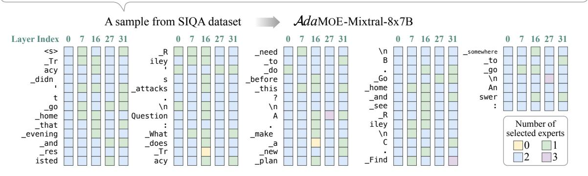
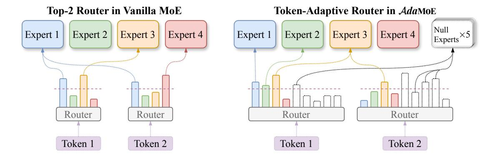
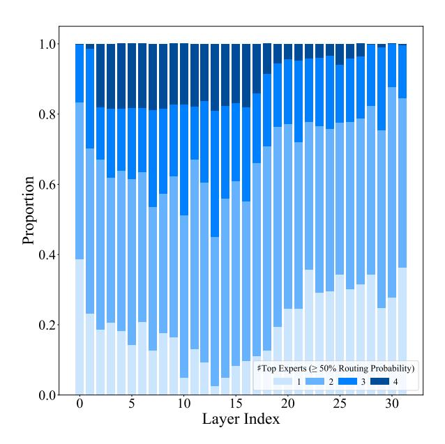
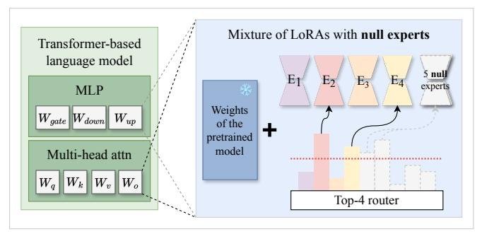
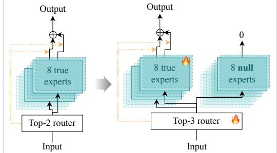
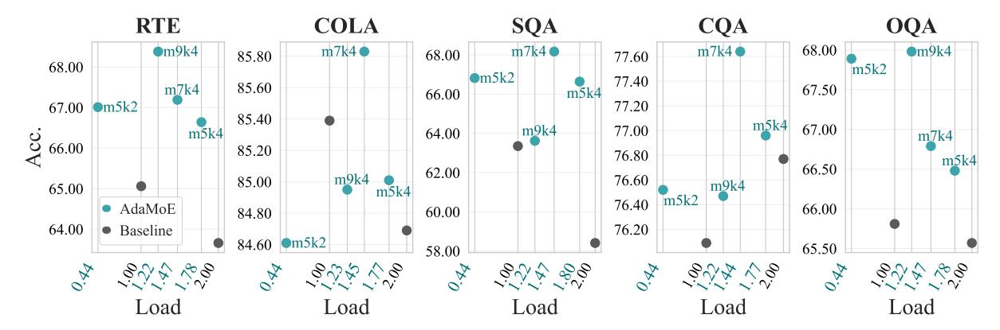

# 1 Introduction

Large language models (LLMs) have exhibited exceptional performance across diverse tasks and do-

mains [\(Touvron et al.,](#page-9-0) [2023;](#page-9-0) [Chiang et al.,](#page-8-0) [2023;](#page-8-0) [Chowdhery et al.,](#page-8-1) [2023;](#page-8-1) [Zhang et al.,](#page-9-1) [2022\)](#page-9-1). Nevertheless, LLMs' efficacy is heavily impacted by the substantial number of parameters they possess, with some high-performing LLMs containing up to 540B parameters [\(Chowdhery et al.,](#page-8-1) [2023\)](#page-8-1). The mixture of experts (MoE) mechanism [\(Shazeer](#page-9-2) [et al.,](#page-9-2) [2017\)](#page-9-2) offers a compelling way to enhance model capability without a corresponding increase in computational overhead. Recent research further underscores the merits of MoE, vividly demonstrating its potential to support production-level applications [\(Jiang et al.,](#page-8-2) [2024;](#page-8-2) [Qwen,](#page-9-3) [2024\)](#page-9-3).

MoE operates on the core assumption that a (small) subset of experts is sufficient to handle a single token effectively. MoE-LLMs, with Mixtral [\(Jiang et al.,](#page-8-2) [2024\)](#page-8-2) and DeepSeekMoE [\(Dai](#page-8-3) [et al.,](#page-8-3) [2024\)](#page-8-3) as popular examples, often replace the feed-forward network (FFN) in the model with a set of FFN experts. A token-level router is introduced to sparsely activate the experts for various tokens, so the computational cost is constrained to a low level. We can also build experts with parameterefficient fine-tuning (PEFT) modules [\(Hu et al.,](#page-8-4) [2021;](#page-8-4) [Liu et al.,](#page-9-4) [2022\)](#page-9-4) like LoRA, giving rise to Mo-LoRA approaches [\(Zadouri et al.,](#page-9-5) [2023\)](#page-9-5).

MoE routinely routes each token to a fixed amount of experts, typically the k ones with top routing probabilities. However, not all tokens require the same number of experts for feature abstraction. Intuitively, the semantic tokens deserve a higher concentration of experts, while others with less significant meaning can be processed more swiftly. Lifting the top-k routing constraint can help make the most of limited resources and unleash the potential of the model. To achieve this, MoE with expert choice routing [\(Zhou et al.,](#page-9-6) [2022\)](#page-9-6) performs expert-level routing, where each expert chooses a fixed number of tokens for processing and different tokens could be processed by different numbers of experts. Yet, an unacceptable drawback

\*Equal contribution.

†Corresponding authors.

<rs> Tracy didn't go home that evening and resisted Riley's attacks.\nQuestion: What does Tracy need to do before this?\nA. make a new plan\nB. Go home and see Riley\nC. Find somewhere to go\nAnswer:

Figure 1: The number of selected experts for various tokens in an  $\mathcal{A}da$ MoE variant of Mixtral-8x7b. As shown, after applying  $\mathcal{A}da$ MoE, the model possesses the ability to perform token-adaptive routing. Also note that some tokens only require 1 expert for feature abstraction, which offers the opportunity for inference acceleration.

is that it is not suited to casual language modeling due to the reliance on future tokens for the top-*k* token selection (Zhou et al., 2022).

This work introduces  $\mathcal{A}da$ MoE, a novel method designed to achieve token-level adaptive routing in MoE, allowing different tokens to select varying numbers of experts. An illustrative example is presented in Figure 1. AdaMoE requires minimal changes to the vanilla MoE with top-k routing by incorporating a fixed number of null experts into the expert set. These null experts do not consume any computational resources. By increasing the value of k, more experts can be activated. To encourage the average usage rate of the null experts, AdaMoE minimizes a load balancing loss. This leads to an adaptive number of null experts and true experts being employed by each token. Notably, AdaMoE shares similarities with existing MoE with expert choice routing while also enabling straightforward causal language modeling.

AdaMoE is easy to implement and can be applied to both pre-trained regular LLMs and MoE-LLMs for supervised fine-tuning. For the former, we experiment on Llama2-7B (Touvron et al., 2023) by introducing LoRA experts and corresponding routers to the model. For the latter, we experiment on Mixtral-8x7B (Jiang et al., 2024) by augmenting the original router with extra weights for the null experts. The results underscore the effectiveness of AdaMoE's token-adaptive mechanism in enhancing both computational efficiency and model performance. For example, when fine-tuning Llama2-7B, AdaMoE achieves much higher accuracy across almost all evaluated datasets. Moreover, when fine-tuning Mixtral-8x7B with

AdaMoE on ARC-Challenge (Clark et al., 2018), we observed a 14.5% reduction in total FLOPs, accompanied by a 1.69% increase in accuracy.

#### 2 Related Works

#### 2.1 Mixture of Experts

Mixture of Experts (MoE) (Jacobs et al., 1991; Shazeer et al., 2017) is an efficient scaling technique that allows for larger model sizes with less computation, resulting in enhanced performance. MoE models can be trained and used for inference more efficiently compared to dense models, requiring substantially fewer computational resources. Due to these advantages, pioneering works (Jiang et al., 2024; Dai et al., 2024) have applied MoE to transformer-based language models and demonstrated their superiority. Typically, they replace the feed-forward network (FFN) in each layer of the model with a routing function and multiple FFNs, referred to as experts, with only a subset of these experts being activated at any time. We refer to these models, which combine MoE and large language models (LLMs), as MoE-LLMs.

In addition to MoE-LLMs, fine-tuning techniques have also seen significant advancements. Pre-trained LLMs are often fine-tuned for downstream tasks. However, as models increase in size, full fine-tuning becomes increasingly computationally expensive (Brown et al., 2020; Chang et al., 2024). LoRA (Hu et al., 2021) addresses this challenge by providing an effective fine-tuning methodology for scenarios with constrained computational resources. LoRA freezes model weights and injects trainable rank decomposition matrices, thereby modifying the behavior of dense linear layers with-

Figure 2: Comparison of Routing Mechanisms: vanilla MoE v.s.  $\mathcal{A}da$ MoE. Left: In vanilla MoE, each token selects the top 2 experts based on the routing probabilities. Right:  $\mathcal{A}da$ MoE introduces an additional set of *null experts* and makes each token select the top 4 experts, which can include both the true and null experts. For example, token 1 selects three true experts, while token 2 selects only one true expert. Despite this variation, the average number of true experts selected per token remains two, maintaining parity with the vanilla method.

out substantially changing the original model parameters (Lester et al., 2021; An et al., 2022). Recent studies (Zadouri et al., 2023; Liu et al., 2023; Dou et al., 2023) convincingly show that integrating LoRA with MoE offers a promising approach for achieving high performance with minimal parameter updates. Methods like MixLoRA (Li et al., 2024), MoLE (Wu et al., 2023), and Lo-RAMoE (Dou et al., 2023) combine MoE with LoRA by learning multiple pairs of low-rank matrices, known as LoRA experts, and use a router to compute the probabilities of each expert for the inputs. MoLA (Gao et al., 2024) explores the relationship between the number of LoRA experts and the depth of model layers. For consistency and convenience, we will refer to these methods collectively as Mo-LoRA in the following text.

#### 2.2 Routing Strategies

The early MoE architecture utilized gate units as the router to select experts for each token (Shazeer et al., 2017; Lepikhin et al., 2020). Following the success of the Switch Transformer (Fedus et al., 2022) in large-scale pre-training, MoE received increased attention, leading to the development of more advanced routing algorithms. For example, BASE Layers (Lewis et al., 2021) use a linear assignment problem to maximize token-expert affinities while ensuring each expert receives an equal number of tokens. Hash layers (Roller et al., 2021) employ hashing techniques on input tokens to allocate different sets of weights. A different approach, Expert-Choice Routing (Zhou et al., 2022), allows experts to select their preferred tokens, achiev-

ing a more balanced expert load and better costeffectiveness. Furthermore, DeepMind's Mixtureof-Depths (MoD) (Raposo et al., 2024) introduces a router to determine the necessity of computation for each input token at each layer.

#### 3 Method

In this section, we introduce  $\mathcal{A}da$ MoE, which incorporates null experts to allow for more flexible and efficient expert selection for various tokens. An illustrative comparison between vanilla MoE and  $\mathcal{A}da$ MoE is presented in Figure 2.

#### 3.1 Preliminary on MoE

MoE has been widely applied in two scenarios for large language models: MoE-LLMs (Jiang et al., 2024; Dai et al., 2024) and Mo-LoRA (Dou et al., 2023; Gao et al., 2024; Li et al., 2024) , as briefly introduced in Section 2. The core component of both is the MoE layer, which consists of n specialized experts  $E_i: \mathbb{R}^{d_{in}} \to \mathbb{R}^{d_{out}}, i=1,\ldots,n$  and a router  $G: \mathbb{R}^{d_{in}} \to \mathbb{R}^n$ . The experts often have the same parameterization, such as feed-forward neural networks (FFNs) in MoE-LLMs or LoRA modules in Mo-LoRA. The router usually activates the k (k < n) experts with the highest routing probabilities (i.e., the top-k experts) and distributes input tokens to corresponding experts.

Given an input token  $x \in \mathbb{R}^{d_{in}}$ , the routing process works as:

$$G(x) \in \mathbb{R}^n := \operatorname{Softmax} \left( \operatorname{TopK}(x \cdot W_g, k) \right) , (1)$$

where  $W_g \in \mathbb{R}^{d_{in} \times n}$  is the parameter matrix of the router, and  $\text{TopK}(\cdot, k)$  retains only the top-k ele-

ments, setting the rest to  $-\infty$  (so that after Softmax, the corresponding routing probabilities are zero). The output of the MoE layer is then computed as:

$$y \in \mathbb{R}^{d_{out}} := \sum_{i=1}^{n} G(x)_i \cdot E_i(x) . \tag{2}$$

Additionally, an auxiliary loss is applied during the training stage to encourage a balanced load across experts within the same MoE layer (Fedus et al., 2022). Given a batch  $\mathcal{B}$  of tokens, this load balancing loss for a MoE layer is defined as:

$$\ell_{load} := \alpha \cdot n \cdot \sum_{i=1}^{n} f_i \cdot P_i , \qquad (3)$$

where  $\alpha$  is a hyperparameter, and  $f_i$  represents the fraction of tokens dispatched to expert  $E_i$ ,

$$f_i = \frac{1}{|\mathcal{B}|} \sum_{x \in \mathcal{B}} \mathbb{1}\{G(x)_i \neq 0\} ,$$
 (4)

and  $P_i$  denotes the average fraction of the router probability allocated for expert  $E_i$ , i.e.,

$$P_i = \frac{1}{|\mathcal{B}|} \sum_{x \in \mathcal{B}} \text{Softmax} (x \cdot W_g)_i .$$
 (5)

#### 3.2 Drawback of Top-k Router

Almost all traditional MoE methods adopt a top-k routing strategy for expert selection (Fedus et al., 2022; Lepikhin et al., 2020; Jiang et al., 2024). Therefore, each token passes through exactly k experts and occupies the same amount of computation. We first question the rationality of the fixed top-k routing with the following studies.

Concretely, the SocialIQA dataset (Sap et al., 2019) is fed into Mixtral-8x7B (Jiang et al., 2024), which employs a top-2 routing strategy for expert selection. We record the routing distribution for all tokens in each MoE layer of the model. To evaluate the sharpness of the routing distribution, we count the number of top experts whose cumulative routing probabilities exceed 50% and according to this, all tokens can be divided into four categories. The proportions of the tokens are displayed in Figure 3.

As shown, the proportions of tokens within different counts show substantial variation. Namely, the sharpness of the routing distribution varies significantly. A considerable number of tokens have highly uneven routing distributions. Some tokens tend towards a single expert, while a significant proportion of tokens distribute attention to more than

Figure 3: Proportions of the number of top experts with cumulative routing probabilities exceeding 50% for tokens in the SocialIQA dataset. Each bar represents the proportion of different counts of tokens at the corresponding MoE layer in Mixtral-8x7B.

2 experts. These observations imply that the traditional fixed top-k routing strategy, which selects the same number of experts for each token, may not be optimal. This is also implied by the argument in MoD (Raposo et al., 2024) that some tokens may not need to pass through all MoE layers.

### 3.3 Null Experts for Token-Adaptive Router

 $\mathcal{A}da$ MoE achieves token-adaptive expert selection by incorporating *null experts*, which are defined as an empty operation requiring zero FLOPs to process the token feature. In the context of LLMs, common operations satisfying this requirement include a constant zero mapping and an identity mapping (we take the zero mappings null expert as the default choice in the following just for simplicity). Consequently, an  $\mathcal{A}da$ MoE layer includes n+m experts, where  $\{E_i\}_{i=1}^n$  are true experts and  $\{E_i\}_{i=n+1}^{n+m}$  are null experts, and a top-k router  $G: \mathbb{R}^d \to \mathbb{R}^{n+m}$ , which functions the same as the vanilla MoE router except for its output dimension.

**Token-level adaptive routing.** The router still performs fixed top-k selection but with k larger than in vanilla MoE. When null experts are chosen, no additional computation occurs due to their definition. Consequently, the number of true experts selected varies for different tokens.

**Prespecified expert load.** We can adjust the number of null experts according to the compute

Figure 4: Left: Adding null experts to Mo-LoRA. Right: Adding null experts to the MoE layer of MoE-LLMs.

budget, and then reinforce the usage of null experts with a load balancing loss (see Section [3.4\)](#page-4-0). This way, the load of true experts (or the overall FLOPs) can be easily adjusted to an appropriate degree.

Autoregressive task suitability. Expert-choice routing [\(Zhou et al.,](#page-9-6) [2022\)](#page-9-6) also allows varying numbers of experts for different tokens but struggles with autoregressive text generation since it requires considering both past and future tokens. In contrast, our token-choice method avoids this issue.

Bypassing MoE layers. MoD [\(Raposo et al.,](#page-9-14) [2024\)](#page-9-14) uses expert-choice routing to let tokens bypass some FFN layers, speeding up inference. Similarly, in A*da*MOE, if all selected experts for a token are null experts, the token effectively bypasses the A*da*MOE layer, achieving a similar effect.

### 3.4 More Details

Load balancing loss with null experts. Including null experts in the load balancing loss is necessary to prevent tokens from disproportionately selecting true experts. However, since all null experts are identical in nature, it is unnecessary to balance the load among them. Treating null experts as distinct entities for load balancing can significantly hinder performance, as shown in Table [3.](#page-7-0)

To address this, we modify the load balancing loss in Equation [\(3\)](#page-3-1) as

$$\ell_{null} = \alpha \cdot (n+m) \cdot \sum_{i=1}^{n+m} \tilde{f}_i \cdot P_i , \qquad (6)$$

where

$$\tilde{f}_i = \begin{cases} f_i & \text{if } i \leq n \\ \frac{1}{m} \sum\limits_{j=n+1}^{n+m} f_j & \text{if } i > n \end{cases}.$$

By using an average load among the null experts, we make no distinction between them, which can avoid unnecessary constraints on the router.

Load balancing constraints: from tight to loose. In practice, we anneal the weight α of our load balancing loss to chase a better balanceefficiency trade-off. In particular, we first set a larger α to enforce strict load balancing, ensuring tokens do not disproportionately select true experts, leading to a more even load distribution among all experts. In the latter, we use a smaller α to give tokens greater freedom in choosing experts. The empirical efficacy of doing so is verified in Table [5.](#page-7-1)

Normalization of routing probabilities. In vanilla MoE, TopK(x · Wg, k) is normalized using the Softmax activation function. With null experts, we have two options: 1) normalizing over all selected top-k experts, or 2) normalizing over only the true experts within the top-k ones. We choose the latter to ensure that the weighted average output by the A*da*MOE layer remains consistent with the scale of that from the vanilla MoE layer.

### 3.5 Compatibility with Vanilla (MoE-)LLMs

A*da*MOE is designed to be plug-and-play, able to be seamlessly integrated with pre-trained LLMs and MoE-LLMs, as illustrated in Figure [4.](#page-4-1) Due to resource constraints, we mainly focus on finetuning such models. For fine-tuning regular LLMs with the Mo-LoRA architecture, we need to add a randomly initialized router and multiple LoRA experts to the corresponding module. When applying A*da*MOE to MoE-LLMs, the router's output dimensions are expanded to provide corresponding probabilities for null experts. The parameters for the new dimensions can be derived from the original parameter values. This ensures the expanded router balances the load across all experts, including both true and null experts, at the beginning of the finetuning process. For more specific implementation details, see Section [4.2.1.](#page-6-0) To fine-tune A*da*MOE, we need to adjust the router and experts to meet our token-adaptive routing strategy and follow the

Figure 5: Performance comparison across five datasets: RTE, COLA, SQA, CQA, and OQA. The baseline is fine-tuned Llama2-7B using the vanilla Mo-LoRA method with top-1/top-2 routing. Acc. represents accuracy, and Load represents the average number of experts used per Mo-LoRA module or  $\mathcal{A}da$ MoE layer.  $\mathcal{A}da$ MoE use different configurations: m5k2 (5 null experts, top-2 selection), m9k4, m7k4 and m5k4. As shown,  $\mathcal{A}da$ MoE achieves higher accuracy across almost all datasets compared to the baseline. The exact accuracy values can be found in Table 7.

detailed modifications outlined in Section 3.4 to achieve adaptive routing.

### 4 Experiments

In this section, we demonstrate the superior performance of  $\mathcal{A}da$ MoE across various benchmarks, particularly in reducing expert load and enhancing task performance through its token-adaptive routing strategy. We first apply our method to regular LLMs with the Mo-LoRA architecture (Section 4.1). Then apply it to traditional MoE-LLMs (Section 4.2). Additionally, We also include extensive ablation studies to provide further insights into our approach's effectiveness.

#### 4.1 Application to Regular LLMs

#### 4.1.1 Experiments Setup

Model and datasets. We select Llama2-7B (Touvron et al., 2023) as our base model due to its strong performance and popularity within the AI community. To validate the effectiveness of our method, we evaluate it on two distinct task types using five widely recognized datasets. The first task focuses on semantic understanding, for which we use two datasets from the renowned GLUE Benchmark (Wang et al., 2018): Recognizing Textual Entailment (RTE) and the Corpus of Linguistic Acceptability (COLA). The second task involves commonsense reasoning and includes the following datasets: ScienceQA (SQA) (Lu et al., 2022), CommonsenseQA (CQA) (Talmor et al., 2018), and OpenBookQA (OQA) (Mihaylov et al., 2018).

Baseline and implementation details. To high-

light our method's significance, we use the typical Mo-LoRA method as the baseline for comparison. For each MoE/AdaMoE layer, we set n = 4 (4 true experts). For the baseline, we set k = 1, 2 for the top-k routing strategy, which are the most common choices. For our AdaMoE, we selected various configurations for k (the number of top-k experts) and m (the number of null experts). We use AdamW (Loshchilov and Hutter, 2017) as the optimizer with a learning rate of 3e-4. The rank of each LoRA expert is set to 8, and the initialization of the LoRA modules follows the original LoRA implementation (Hu et al., 2021). For each LLM layer, we applied LoRA to  $(W_a, W_k, W_v, W_o)$  in the selfattention modules and  $(W_{aate}, W_{down}, W_{up})$  in the MLP modules. We trained on each dataset for 2 epochs, using 3 random seeds, and averaged the results to obtain the final performance metrics.

#### 4.1.2 Experiments Results

The results are shown in Figure 5. We use accuracy as the main metric to evaluate the model's performance  $^1$ . It is evident that  $\mathcal{A}da$ MoE achieves higher accuracy across almost all datasets compared to the traditional baseline. For instance, on the RTE and OQA datasets, all configurations of  $\mathcal{A}da$ MoE surpass the baseline in accuracy. This trend continues across the other datasets, demonstrating the robustness and effectiveness of  $\mathcal{A}da$ MoE in achieving better performance with more adaptive expert utilization.

&lt;sup>1LoRA expert load has minimal impact on total FLOPs; therefore, it is not considered a primary evaluation metric.

|                         | Metric  | WINO  | HELLA | PIQA  | SIQA  | OQA   | ARC-C | Avg.  |
|-------------------------|---------|-------|-------|-------|-------|-------|-------|-------|
| Original Mixtral-8x7B   | Acc.    | 55.96 | 53.62 | 68.06 | 64.59 | 65.40 | 83.73 | 65.23 |
| Fine-tuned Mixtral-8x7B | Acc.    | 80.43 | 84.10 | 90.48 | 76.36 | 89.00 | 87.46 | 84.64 |
|                         | Acc.    | 81.93 | 85.50 | 90.32 | 76.97 | 88.20 | 89.15 | 85.35 |
| $\mathcal{A}da$ MoE     | %FLOPs↓ | 14.99 | 14.10 | 18.07 | 16.31 | 13.22 | 14.55 | 15.21 |
|                         | Load    | 1.66  | 1.68  | 1.59  | 1.63  | 1.70  | 1.67  | 1.66  |

Table 1: Comparison of performance and computational efficiency across six datasets: WINO, HELLA, PIQA, SIQA, OQA and ARC-C. Metrics include Acc. (accuracy), %FLOPs↓ (percentage of FLOPs reduction by AdaMoE compared to the baselines), and Load (the average number of experts used per MoE/AdaMoE layer). The baselines are original/fine-tuned Mixtral-8x7B, both using the top-2 routing strategy (Load = 2.00). AdaMoE not only reduces FLOPs but also achieves better accuracy across most datasets compared to the fine-tuned Mixtral-8x7B with LoRA.

#### 4.2 Application to MoE-LLMs

#### 4.2.1 Experiments Setup

Model and datasets. We use Mixtral-8x7B (Jiang et al., 2024) as the base model, where each MoE layer has 8 FFN experts and a top-2 router. We selected six well-known datasets from different categories for our experiments: WinoGrande (WINO) (Sakaguchi et al., 2021) for coreference resolution, Hellaswag (HELLA) (Zellers et al., 2019), PIQA (Bisk et al., 2020), and SIQA (Sap et al., 2019) for commonsense reasoning, Open-BookQA (OQA) (Mihaylov et al., 2018) for reading comprehension, and ARC-Challenge (ARC-C) (Clark et al., 2018) for science examination.

**Baseline and implementation details.** Due to the substantial resources required for pre-training, we focus on fine-tuning. To save memory, we use 4bit quantization and the QLoRA method (Dettmers et al., 2024). The LoRA target modules for the baseline are gate, w1, w2, and w3. For our AdaMoE, we modify this architecture as described in Section 3.5. Specifically, we add null experts to each MoE layer, and the router expands its output dimension to assign probabilities to all experts. To simplify the modification, we define an additional module, gate2, whose parameters can be derived from gate. 2 Together, gate and gate2 form the router that assigns weights to all experts. Thus, the LoRA target modules for our method are gate, gate2, w1, w2, and w3. The rank of the LoRA module is set to 8, and the learning rate is 5e-5. Due to the tendency of MoE-LLMs to overfit during fine-tuning, we use 1000 samples for training on each dataset and train for 2 epochs. In the 2

epochs, we set different values of  $\alpha$  in Equation (6) to  $\alpha_1 = 0.02$ ,  $\alpha_2 = 0.0001$ , as described in Section 3.4. All evaluations are conducted using Open-Compass (Contributors, 2023) to assess accuracy.

### 4.2.2 Experiment Results

In this section, we present the results for the configuration with m=8 and k=3 (i.e., 8 null experts and top-3 expert selection), as shown in Table 1. Additional results are in Section 4.3 and Table 8.

**Accuracy.** AdaMoE outperforms the baseline on WinoGrande, HellaSwag, SIQA, and ARC-Challenge. Although the baseline slightly surpasses AdaMoE on PIQA and OpenBookQA, AdaMoE achieves a higher average accuracy.

**FLOPs.** FFNs account for the majority of the FLOPs during inference. This issue is exacerbated in Mixtral-8x7B, which replaces the FFN with a set of 8 FFNs and selects the top-2 during each inference step. This greatly increases the computational load. *Ada*MoE significantly reduces FLOPs across all datasets, achieving an average reduction of 15.21% compared to the baseline. This demonstrates that *Ada*MoE is more computationally efficient while maintaining competitive performance.

**Load.** The Load metric indicates the average number of experts used per MoE/AdaMoE layer. The baseline method has a Load of 2. In contrast, AdaMoE achieves a lower average Load of 1.66, indicating more efficient utilization of experts.

Overall, the results confirm the effectiveness of the token-adaptive mechanism in improving both computational efficiency and model performance.

#### 4.3 Ablation

In this section, we provide results for various m and k, beyond the single configuration shown in Section 4.2. We also present ablation studies for

&lt;sup>2For instance, if gate2 has an output dimension of 16, meaning there are 16 null experts, the parameters of gate2 can be copied from gate in two segments.

|      | Baseline |       | AdaMOE |       |       |       |       |       |       |       |  |
|------|----------|-------|--------|-------|-------|-------|-------|-------|-------|-------|--|
| m, k | 0, 2     | 8, 3  | 16, 4  | 32, 4 | 32, 5 | 32, 6 | 40, 6 | 40, 7 | 40, 8 | 48, 8 |  |
| Acc. | 76.36    | 76.97 | 76.92  | 66.27 | 72.93 | 76.46 | 69.86 | 76.05 | 77.23 | 74.67 |  |
| Load | 2.00     | 1.63  | 1.66   | 0.77  | 1.05  | 1.54  | 1.01  | 1.49  | 1.64  | 1.48  |  |

Table 2: Performance of different m and k combinations on the SIQA dataset. The Baseline represents fine-tuned Mixtral-8x7B using LoRA method, with a Load of 2. Bold values indicate accuracy higher than the baseline.

|       | RTE   |      | COLA  |      | SQA   |      | OQA   |      |        | SIQA  |      |
|-------|-------|------|-------|------|-------|------|-------|------|--------|-------|------|
|       | Acc.  | Load | Acc.  | Load | Acc.  | Load | Acc.  | Load | Option | Acc.  | Load |
| ℓbal  | 56.68 | 1.77 | 83.68 | 1.77 | 65.65 | 1.78 | 69.80 | 1.76 | 1)     | 80.19 | 1.50 |
| ℓnull | 67.51 | 1.77 | 85.01 | 1.77 | 66.64 | 1.80 | 71.40 | 1.77 | 2)     | 81.27 | 1.54 |

Table 3: Comparison of accuracy and load on four datasets using load balancing loss with and without balancing among null experts. ℓbal represents the loss with load balancing constraints among null experts, and ℓnull represents the loss without these constraints. Bold values indicate higher accuracy.

Table 4: 1) Normalizing all selected top-k experts, and 2) normalizing only the true experts within the top-k.

A*da*MOE, corresponding to Section [3.4.](#page-4-0) Additional ablation experiments can be found in Appendix [A.](#page-10-0)

More results for Section [4.2.](#page-6-1) We tested different combinations of m and k on the SIQA dataset, with results shown in Table [2.](#page-7-2) Compared to the m = 8, k = 3 configuration in Section [4.2,](#page-6-1) A*da*MOE can further reduce the expert load (FLOPs) while maintaining competitive performance. For example, with m = 32, k = 6, the expert load is 1.54 (79.57% of baseline FLOPs), yet accuracy remains higher than the baseline. There are also accuracy differences among configurations with similar loads. For instance, m = 40, k = 7 and m = 48, k = 8 have nearly identical loads but differ in accuracy. This discrepancy highlights areas for further exploration in future research.

Load balancing loss with null experts. To verify the effectiveness of the modified load balancing loss introduced in Equation [\(6\)](#page-4-3), we selected two datasets from each of the semantic understanding and commonsense reasoning tasks. The results, illustrated in Table [3,](#page-7-0) show that lifting the load balancing constraints among null experts significantly improves the performance of the fine-tuned model on the RTE, COLA, SQA, and OQA datasets.

Load balancing constraints: from tight to loose. The effectiveness of the annealing training process described in Section [3.4](#page-4-0) is validated in Table [5.](#page-7-1) The tight load balancing constraints in the first epoch effectively control the expert load in A*da*MOE, meeting our expectations. The loose con-

|    |          | WINO  |      | SIQA  |      |
|----|----------|-------|------|-------|------|
|    |          | Acc.  | Load | Acc.  | Load |
| α1 | Baseline | 78.14 | 2.00 | 75.38 | 2.00 |
|    | AdaMOE   | 76.24 | 1.65 | 75.90 | 1.62 |
| α2 | Baseline | 80.43 | 2.00 | 76.36 | 2.00 |
|    | AdaMOE   | 81.93 | 1.66 | 76.97 | 1.63 |

Table 5: Performance for finetuning Mixtral-8x7B with A*da*MOE on the WINO and SIQA datasets for two epochs with α1 = 0.02 and α2 = 0.0001.

straints in the second epoch allow tokens greater freedom in selecting experts, thereby enhancing performance with almost no increase in expert load. For example, on the WINO dataset, the accuracy increased by 5.69% compared to the result after epoch 1, with almost no increase in expert load.

Normalization of routing probabilities. We tried the two options mentioned in Section [3.4](#page-4-0) on the SIQA dataset, and the results are shown in Table [4.](#page-7-0) As we can see, option 2) is a superior choice, showing a significant improvement in accuracy , with only a minor change in expert load.

