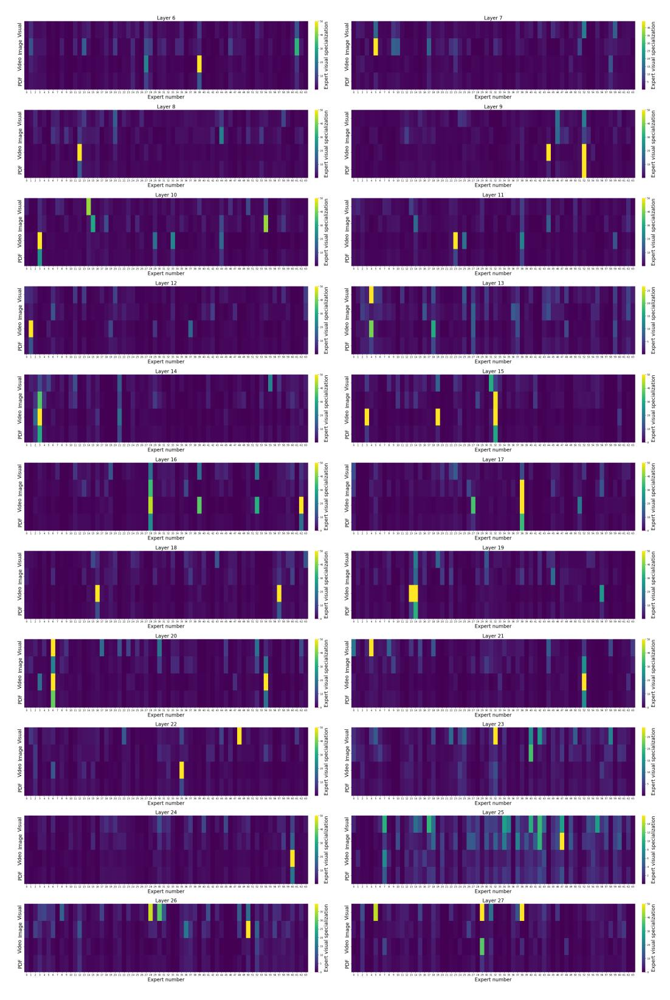
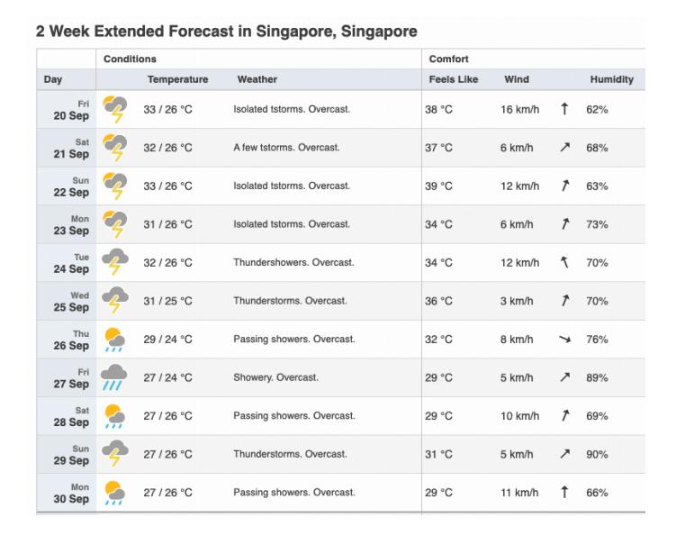

# **3 Training**

In this section, we delineate our 4-stage training pipeline. In each stage, the model aims to learn new capabilities while maintaining those acquired previously. We perform evaluation during each stage to ensure that such goal is achieved in a data-efficient and computeefficient way.

### **3.1 Language Pre-training**

The first stage pre-trains the MoE decoder with a large amount of curated language data converted into discrete text tokens, using a next-token prediction loss, which enables the MoE to learn general knowledge about the world. The context window length is 8K tokens.

**Language Data.** Our language pre-training data contains 6.4T tokens in total, curated from a variety of data sources containing knowledge until May 2024. We de-duplicate the data at different granularities and perform rigorous quality filtering, using a combination of rulebased approach and model-based quality classifiers. To enhance model's in-context learning capability, we employ data clustering and pack similar data in the same sequence during training, akin to the approach in [Shi et al.](#page-23-11) [\[2023\]](#page-23-11). However, their original method is less scalable and likely to generate numerous long-tail structures when processing trillions of tokens. Instead, we utilize a minimum spanning tree algorithm for language data clustering, which resulted in a noticeable performance gain.

### **3.2 Multimodal Pre-training**

The second stage pre-trains the MoE decoder and the visual encoder with a mixture of language and multimodal data, using the same next-token prediction loss. This stage aims to enable the model with broad multimodal understanding abilities, while maintaining or even improving its language understanding. To this end, the language data contains a high-quality subset of 1T tokens, covering topics including code, reasoning, and knowledge. The multimodal data contains 400B tokens from a diverse set of sources, which can be categorized into four major categories below.

**Interleaved image-text web data.** We extract and filter web pages from Common Crawl. The filtering process first removes web pages with low image or text quality. Then, it deduplicate images, and removes web pages where the images and the text have low overall CLIP score [\[Radford et al.,](#page-23-12) [2021\]](#page-23-12). Additionally, we adjust the position of the images in the sequence, by moving an image to the front of a sentence if the sentence has higher CLIP score and is in front of the image. In total, we curate 190B interleaved image-text tokens.

**Synthetic image captions.** Alt texts directly extracted for web images are generally short, less descriptive, and noisy. It has been shown in previous work that synthetic data at scale can improve multimodal pre-training [\[Li et al.,](#page-23-13) [2022\]](#page-23-13). We thus synthesize image captions using a small model which has learned to generate longer and more descriptive image captions by re-writing the alt texts. We create synthetic captions for 300M images in the LAION-400M dataset [Schuhmann et al.](#page-23-14) [\[2021\]](#page-23-14), resulting in a total of 70B multimodal tokens.

**Document transcriptions and QA.** To improve the model's capability of understanding text-heavy images, we transcribe document images into texts using public OCR methods. We also render images using plain text, chart json or table/equation latex code. In order to enhance the model's ability to not only transcribe text but also understand its meaning, we use a language model to create synthetic question-answering pairs. In total, our multimodal document data contains 102B tokens.

**Video captions and QA.** We collect 4.4M videos of varying lengths from a diverse range of sources. We train a model to generate frame-level dense descriptions for the videos. Then, we use a language model to generate question-answering pairs and video summarizations

| Model               | #Params           | LongVi | ideoBench | Vide   | eoMME    | MMLongBench-Doc |      |  |
|---------------------|-------------------|--------|-----------|--------|----------|-----------------|------|--|
| Wiodei              | activated (total) | test   | val       | w subs | w/o subs | acc             | f1   |  |
| Open-source         |                   |        |           |        |          |                 |      |  |
| Aria                | 3.9B (25.3B)      | 65.3   | 63.0      | 72.1   | 67.6     | 28.3            | 24.6 |  |
| Qwen2-VL-7B         | 7B                | 56.8   | 55.6      | 69.0   | 63.3     | 21.3            | 22.7 |  |
| Idefics2            | 8B                | 49.4   | 49.7      | -      | -        | 7.0             | 6.8  |  |
| MiniCPM-V-2.6       | 8B                | 55.7   | 54.9      | 63.7   | 60.9     | 11.5            | 11.6 |  |
| Llama3.2-11B        | 11B               | 45.7   | 45.5      | 49.5   | 46.0     | 13.8            | 11.3 |  |
| Pixtral-12B         | 12B               | 47.4   | 44.9      | 47.5   | 40.7     | 6.4             | 6.0  |  |
| InternVL-Chat-V1.5  | 26B               | 51.7   | 51.2      | 52.4   | 50.7     | 14.6            | 13.0 |  |
| InternVL2-40B       | 40B               | 60.6   | 59.3      | 62.4   | 61.2     | 18.2            | 17.9 |  |
| LLaVA-OneVision-72B | 72B               | 63.2   | 61.3      | 69.6   | 66.3     | -               | -    |  |
| Qwen2-VL-72B        | 72B               | 61.7   | 60.4      | 77.8   | 71.2     | 33.3            | 35.7 |  |
| Proprietar          | y                 |        |           |        |          |                 |      |  |
| Gemini-1.5-Flash    | -                 | 62.6   | 61.4      | 75.0   | 60.3     | 27.0            | 21.3 |  |
| Gemini-1.5-Pro      | -                 | 64.4   | 64.0      | 81.3   | 75.0     | 28.2            | 20.6 |  |
| GPT-40 mini         | -                 | 58.8   | 56.5      | 68.9   | 64.8     | 29.0            | 28.6 |  |
| GPT-40              | -                 | 66.7   | 66.7      | 77.2   | 71.9     | 42.9            | 44.9 |  |

<span id="page-4-0"></span>Table 3: Evaluation of long-context multimodal understanding on videos and documents. Results of competing models are collected from verified official leaderboards or reruned with official settings.

based on the dense video descriptions. In total, our video data contains 35B tokens. We select samples within 8K length for multimodal pre-training.

### 3.3 Multimodal Long-Context Pre-training

In this stage, we pre-train on long sequences to extend the model's context window to 64K tokens. Language long-sequence data is selected from the pre-train data source. Multimodal long-sequence data contains long videos, long documents and synthetic long sequences constructed from short multimodal data. In particular, we concatenate a sequence of independent images as input, and concatenate their image descriptions as target. This stage consumes 12B language tokens and 21B multimodal tokens, where 69% of the 33B tokens are long sequences. We increase the RoPE base frequency hyperparameter from 100K to 5M.

After this stage, the model perfectly solves the needle-in-a-haystack task [Kamradt, 2023] for up to 64K context window. It also demonstrates substantial performance improvement on long video understanding and long multimodal document understanding tasks.

#### 3.4 Multimodal Post-training

The final post-training stage anneals the learning rate to converge the model. The learning focuses on improving the model's question-answering and instruction-following capabilities, using a mixture of high-quality open-source datasets and human-annotated datasets, covering domains including multimodal, code, math, and reasoning. This stage digests 20B tokens in total.

#### 4 Evaluation and Analysis

#### 4.1 Benchmark Results

In Table 1, we compare ARIA against leading open models of similar scale and proprietary models across a variety of established benchmarks. In Table 3 and Table 4, we examine the long-context multimodal understanding and instruction following capability, respectively. Based on the evaluation result, we highlight the following key observations.

ARIA is the best-in-class open multimodal native model, showing clear advantages over Pixtral-12B and Llama3.2-11B across a wide range of multimodal, language, and coding tasks.

ARIA is competitive against proprietary models on various multimodal tasks, including document understanding, chart reading, scene text recognition, and video understanding.

|                        | ARIA | Vision<br>Phi-3 | Qwen2-VL-7B | Idefics2 | Pixtral-12B | InternVL-Chat-v1.5 | LLaVA-NeXT-34B | M-V-2.5<br>MiniCP | mini-1.0-Pro<br>Ge | Reka-Core | Claude-3-Sonnet | GPT-4o |
|------------------------|------|-----------------|-------------|----------|-------------|--------------------|----------------|-------------------|--------------------|-----------|-----------------|--------|
| MIA-Bench (Multimodal) | 8.76 | 7.60            | 8.07        | 5.14     | 8.43        | 7.54               | 7.56           | 7.63              | 7.06               | 7.70      | 7.94            | 8.86   |
| MT-Bench (Language)    | 8.53 | 6.27            | 6.41        | -        | 7.68        | -                  | -              | -                 | -                  | -         | -               | -      |

<span id="page-5-1"></span>Table 4: Evaluation of instruction following capabilities. Results of competing models are copied from [Qian et al.](#page-23-15) [\[2024\]](#page-23-15) for MIA-Bench and [Mixtral](#page-23-0) [\[2024\]](#page-23-0) for MT-Bench.

**ARIA excels in long-context multimodal understanding.** Real-world multimodal data is complex by nature and often involves long sequences of interleaved vision-language input, such as videos with subtitles or multi-page documents. ARIA excels in understanding such data, significantly outperforming open models such as Qwen2-VL-7B [\[Bai et al.,](#page-22-4) [2023\]](#page-22-4) and LLaVA-OneVision-72B [\[Li et al.,](#page-22-10) [2024\]](#page-22-10). Compared to proprietary models, ARIA outperforms GPT-4o mini in long video understanding [\[Wu et al.,](#page-23-16) [2024\]](#page-23-16), and is superior to Gemini-1.5- Flash in long document understanding, making ARIA a preferable choice for processing long multimodal data in a compute-efficient and time-efficient manner.

**ARIA has strong instruction following capabilities**, outperforming other open models on both multimodal and language-only benchmarks. See Section [4.3](#page-7-0) for qualitative examples.

### <span id="page-5-0"></span>**4.2 Expert Modality Specialization**

We analyze the expert activation behavior across all layers in ARIA MoE after the multimodal pre-training stage. We use multimodal data from three domains for analysis: natural image, video, and PDF-format image. For each expert, we first compute its activation rate for both visual tokens and text tokens, denoted as R<sup>v</sup> and Rt. R<sup>v</sup> refers to the number of visual tokens that activates the expert divided by the total number of visual tokens processed by all experts of that layer, and R<sup>t</sup> refers to the same meaning for text tokens. Then we compute the ratio Rv/Rt, which represents the expert's level of visual specialization. A higher visual specialization suggests that the expert is more frequently activated by visual tokens compared to text tokens.

Figure [1](#page-6-0) shows a visualization of the expert visual specialization value (capped at 50). It is observed that a number of visual-specialized experts exist in most layers. Furthermore, multiple layers (layer 4, 5, 14, 15, 16, 17, 20) have a single visual expert specialized in all three visual domains. This analysis shows that despite its modality-generic architecture, our MoE learns effective expert utilization during pre-training.




<span id="page-6-0"></span>Figure 1: Visualization of expert specialization in each MoE layer.

### <span id="page-7-0"></span>**4.3 Qualitative Analysis**

### **4.3.1 Multimodal Native Reasoning with Vision, Language, Coding Capabilities**

### **ARIA Example - Weather Forecast Information Extraction**

**User** Organize the highest temperature, lowest temperature, and humidity for all even dates into a table.

Write a python code to draw a line chart for the temperatures, and a bar chart for the humidity. Use red and green colors for the temperatures, and use blue color for the humidity.



### **ARIA** Table of values for even dates:

| Day    | Highest Temperature (°C) | Lowest Temperature (°C) | Humidity (%) |
|--------|--------------------------|-------------------------|--------------|
| 20 Sep | 33                       | 26                      | 62           |
| 22 Sep | 33                       | 26                      | 63           |
| 24 Sep | 32                       | 26                      | 70           |
| 26 Sep | 29                       | 24                      | 76           |
| 28 Sep | 27                       | 26                      | 69           |
| 30 Sep | 27                       | 26                      | 66           |

```
import matplotlib.pyplot as plt
# Data for even dates
days = ['20 Sep', '22 Sep', '24 Sep', '26 Sep', '28 Sep', '30 Sep']
high_temps = [33, 33, 32, 29, 27, 27]
low_temps = [26, 26, 26, 24, 26, 26]
humidity = [62, 63, 70, 76, 69, 66]
# Line chart for temperatures
plt.figure(figsize=(14, 6))
plt.subplot(1, 2, 1)
plt.plot(days, high_temps, 'r-', label='Highest Temperature', marker='o')
plt.plot(days, low_temps, 'g-', label='Lowest Temperature', marker='o')
plt.xlabel('Days')
plt.ylabel('Temperature (
                         ◦C)')
plt.title('Temperature Variation')
plt.legend()
plt.grid(True)
```

#### **ARIA Example - Weather Forecast Information Extraction**

### **ARIA** (continued)

```
# Bar chart for humidity
plt.subplot(1, 2, 2)
plt.bar(days, humidity, color='blue', alpha=0.7)
plt.xlabel('Days')
plt.ylabel('Humidity (%)')
plt.title('Humidity')
plt.ylim(0, 100)
plt.grid(axis='y')
plt.tight_layout()
plt.show()
```

### **Result** Figures generated by the code provided by ARIA is shown as below.


### **ARIA Example - Financial Report Analysis**

**User** How does the company's profit margin change from year 2020 to 2021? What factors cause such changes? Answer step by step.

| millions, except number of shares which are reflec | ted in th   |                                       |      |                          |     |            |
|----------------------------------------------------|-------------|---------------------------------------|------|--------------------------|-----|------------|
|                                                    | teu iii tii | ousands a                             | nd p | oer share a              | mou | ints)      |
|                                                    |             |                                       |      |                          |     |            |
|                                                    | Years ended |                                       |      |                          |     |            |
|                                                    | Sep         | September 25, September 26, 2021 2020 |      | September 28,<br>2019    |     |            |
|                                                    | _           | 2021                                  | _    | 2020                     | _   | 2010       |
|                                                    | \$          | 297,392                               | \$   | 220,747                  | \$  | 213,883    |
|                                                    |             | 68,425                                |      | 53,768                   |     | 46,291     |
| sales                                              |             | 365,817                               |      | 274,515                  |     | 260,174    |
|                                                    |             |                                       |      |                          |     |            |
|                                                    |             |                                       |      |                          |     |            |
|                                                    |             | 192,266                               |      | 151,286                  |     | 144,996    |
|                                                    |             | 20,715                                |      | 18,273                   |     | 16,786     |
| t of sales                                         |             | 212,981                               | _    | 169,559                  |     | 161,782    |
| s margin                                           |             | 152,836                               |      | 104,956                  |     | 98,392     |
| penses:                                            |             |                                       |      |                          |     |            |
| and development                                    |             | 21,914                                |      | 18,752                   |     | 16,217     |
| eneral and administrative                          |             | 21,973                                |      | 19,916                   |     | 18,245     |
| I operating expenses                               |             | 43,887                                | Ξ    | 38,668                   | Ξ   | 34,462     |
| ome                                                |             | 108,949                               |      | 66,288                   |     | 63,930     |
| /(expense), net                                    |             | 258                                   |      | 803                      |     | 1.807      |
| e provision for income taxes                       | _           | 109,207                               | _    | 67,091                   | _   | 65,737     |
| ncome taxes                                        |             | 14,527                                |      | 9,680                    |     | 10,481     |
|                                                    | \$          | 94,680                                | \$   | 57,411                   | \$  | 55,256     |
| share:                                             |             |                                       |      |                          |     |            |
|                                                    | \$          | 5.67                                  | \$   | 3.31                     | \$  | 2.99       |
|                                                    | \$          | 5.61                                  | \$   | 3.28                     | \$  | 2.97       |
| in computing earnings per share:                   |             |                                       |      |                          |     |            |
| an companing carrings per siture.                  |             | 16 701 272                            |      | 17 352 119               |     | 18,471,336 |
|                                                    |             | 16,701,272<br>16,864,919              |      | 17,352,119<br>17,528,214 |     | 1:         |

**ARIA** To determine how the company's profit margin changed from 2020 to 2021, we need to follow these steps:

#### 1. **Calculate the profit margins for both years:**

