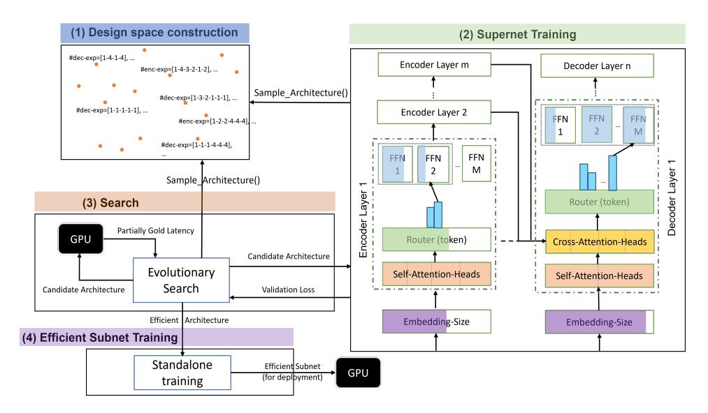

# 1 Introduction

Sparsely activated models like the Mixture-of-Experts (MoE) [\(Fedus et al.,](#page-9-0) [2022b\)](#page-9-0) perform conditional computation in which only a subset of the weights of the network are activated per input. Selective compute allows us to design neural networks with a large number of model parameters, without significant increase in the computational cost. With increased capacity, these sparse models have demonstrated state-of-the-art performance in natural language tasks such as neural machine

translation (NMT) [\(Kim et al.,](#page-9-1) [2021;](#page-9-1) [Kudugunta](#page-10-0) [et al.,](#page-10-0) [2021;](#page-10-0) [Zuo et al.,](#page-11-0) [2022\)](#page-11-0).

MoE architectures require several design choices: *(a) Expert placement:* Identifying Transformer layers for introducing expert sub-networks. *(b) Number of experts:* How many experts to place in different layers? *(c) Expert FFN size*: What should be the feedforward network (FFN) size for each expert? Given the large search space of potential architectures and the exorbitant computational cost of training and evaluating them, existing approaches manually design MoE architectures from a highly-restricted homogeneous space. For instance, they use the same number of experts of the same capacity in different layers and make ad-hoc decisions like introducing experts in every other layer [\(Fedus et al.,](#page-9-0) [2022b;](#page-9-0) [Kim et al.,](#page-9-1) [2021;](#page-9-1) [Zuo](#page-11-0) [et al.,](#page-11-0) [2022;](#page-11-0) [Du et al.,](#page-9-2) [2022;](#page-9-2) [Artetxe et al.,](#page-9-3) [2021\)](#page-9-3) or every four layers [\(Zoph et al.,](#page-11-1) [2022\)](#page-11-1).

While these MoE's support conditional computation, homogeneity (specifically, fixed-size experts) results in the same amount (albeit different subsets) of weights to be applied to each input. We hypothesize that this is not an optimal solution and that we can reduce the number of experts (in some layers) to reduce communication cost, and the size (of some experts) to reduce computation cost resulting in reduction in model size, FLOPs and latency without much quality degradation.

This naturally extends MoEs to be adaptive compute models (similar to work on early exit [\(Schuster](#page-10-1) [et al.,](#page-10-1) [2022\)](#page-10-1)) where different amounts of computations are used for different inputs. The adaptivity comes naturally from the routing decisions which would send tokens to experts of different sizes.

The above observations are depicted in Table [1,](#page-2-0) which shows demonstrative examples of manually designed MoE's vs. those designed by our AutoMoE framework. We compare these architectures against various computational metrics (e.g., latency, FLOPs, active MoE parameters), archi-

∗Correspondence to {ganeshjwhr@gmail.com, subhabrata.mukherjee@microsoft.com}.

Figure 1: AutoMoE Framework. (1) Heterogeneous MoE with variable dimensions for dense Transformer blocks and sparsely activated expert modules. (2) Supernet training by sampling subnetworks from search space and training them by sharing common weights with Supernet. (3) Evolutionary search to find efficient architectures by (a) sampling MoE subnetworks from the search space; (b) using latency measured in the target device; and (c) performance estimation from Supernet as feedback for iterative optimization via crossover and mutation. (4) Efficient MoE subnetwork(s) from evolutionary search is trained on downstream task.

tectural configurations and task performance. For the most efficient configuration (last row in the table), AutoMoE reduces the number of decoder layers, compensating for the capacity with increased experts in the bottom layer, and places most of the experts in the encoder. Overall AutoMoE introduces the following components and contributions:

- *Heterogeneous design with adaptive computation* for MoEs with variable number, size and placement of experts in both encoders and decoders.
- Extends *Supernet training* and evolutionary search from prior work on dense Transformers to new search space of sparse MoE's. This combines all possible MoE sub-architectures in a single graph; jointly training them via weightsharing; and searching for optimal one with best possible performance on a downstream task satisfying a user-specified computational constraint.
- Experiments on NMT benchmarks demonstrate AutoMoE-designed MoE's to obtain 4× inference speedup on CPU and equal FLOPs reduction over manually designed Transformers, with parity in BLEU with dense Transformer and within 1 BLEU point of MoE SwitchTransformer. Further, it outperforms NAS methods in the dense search space (e.g., 1.3× and 2.4× FLOPs reduction and inference speedup over HAT [\(Wang et al.,](#page-10-2) [2020\)](#page-10-2) and Evolved Transformer [\(So et al.,](#page-10-3) [2019\)](#page-10-3)).

