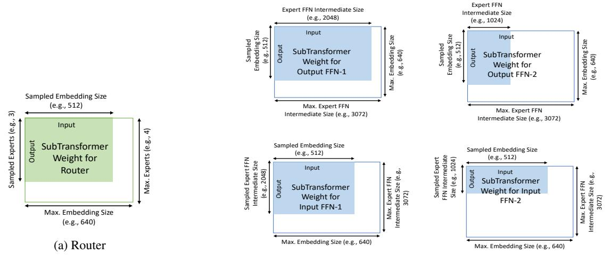

# 3 Designing Heterogeneous Mixture-of-Experts

We now present the components of AutoMoE framework (illustrated in Figure [1\)](#page-1-0) for designing efficient MoE's under computational constraints.

## 3.1 Heterogeneous MoE Search Space

Existing MoE approaches restrict their design space by considering uniform distribution of size and number of experts placed in different Transformer layers. For instance, the standard MoE design [\(Fedus et al.,](#page-9-0) [2022b\)](#page-9-0) for an L-layer Transformer with M experts placed in alternate layers have only two possible configurations viz., {1-M-1-· · · }, {M-1-M- · · ·}. (a) Our design space allows *variable number of experts* in each layer resulting in ML possible configurations. (b) Furthermore, our design space also allows *variable expert size*, e.g., by modulating the width of the feedforward (FFN) subnetworks for different experts. Considering N possible FFN dimensions for each expert results in NML possible configurations for designing the expert space. (c) Finally, given the autoregressive nature of tasks like neural machine translation, the inference cost is dominated by the decoder [\(Ka](#page-9-10)[sai et al.,](#page-9-10) [2021\)](#page-9-10). For instance, for token-based MoE, decoders take 200× the time per step compared to encoders at peak throughput [\(Kudugunta](#page-10-0) [et al.,](#page-10-0) [2021\)](#page-10-0). Therefore, we further consider *variable number of decoder layers* along with the above choices for expert placement and expert capacity. *To the best of our knowledge, our work is the first to study such a flexible and exhaustive design space for MoE architectures*.

In addition to heterogeneous experts, we allow flexible design for non-expert Transformer modules like the number of attention heads, hidden size and intermediate feedforward dimensions. This heterogeneous design of non-MoE, i.e., dense Transformer modules, has been explored in prior works such as HAT [\(Wang et al.,](#page-10-2) [2020\)](#page-10-2) for generation

| Attributes                             | AutoMoE              | Transformer Base / Big |
|----------------------------------------|----------------------|------------------------|
| Encoder-Embedding-Size                 | {512, 640}           | 512 / 1024             |
| Decoder-Embedding-Size                 | {512, 640}           | 512 / 1024             |
| #Encoder-Layers                        | {6}                  | 6                      |
| #Decoder-Layers                        | {1, 2, 3, 4, 5, 6}   | 6                      |
| Encoder-QKV-Dim                        | {512}                | 512 / 1024             |
| Decoder-QKV-Dim                        | {512}                | 512 / 1024             |
| #Encoder-Self-Att-Heads (PL)           | {4, 8}               | 8 / 16                 |
| #Decoder-Self-Att-Heads (PL)           | {4, 8}               | 8 / 16                 |
| #Decoder-Cross-Att-Heads (PL)          | {4, 8}               | 8 / 16                 |
| #Decoder-Arbitrary-Att (PL)            | {-1, 1, 2}           | -1                     |
| Encoder-FFN-Intermediate-Size (PL, PE) | {1024, 2048, 3072}   | 2048 / 4096            |
| Decoder-FFN-Intermediate-Size (PL, PE) | {1024, 2048, 3072}   | 2048 / 4096            |
| #Encoder-Experts (PL)                  | $\{1, 2, \cdots M\}$ | -                      |
| #Decoder-Experts (PL)                  | $\{1, 2, \cdots M\}$ | -                      |

Table 2: Search space of AutoMoE compared to manually configured Transformer Base / Big. 'PL' and 'PE' refer to per layer and per expert search dimensions. Decoder arbitrary attn. searches last k encoder layers to attend for each decoder layer. FFN size varies across layers and experts. M denotes maximum experts per layer.

tasks like NMT, and AutoDistil (Xu et al., 2022a) for understanding tasks like those in the GLUE benchmark (Wang et al., 2018). Table 2 shows our search space. We demonstrate our heterogeneous MoE search to perform better than both manual and NAS-searched architectures in the dense space.

### 3.2 Supernet Training for MoE

AutoMoE leverages the idea of Supernet training from prior works (Cai et al., 2020; Xu et al., 2022a; Wang et al., 2020) in Neural Architecture Search that were developed for standard non-MoE architectures. We extend Supernet training to the search space for MoE's by incorporating experts, gating and routing protocols. Typically, a Supernet consists of thousands of subnetworks that are all jointly trained via weight-sharing. The Supernet for AutoMoE is the largest sparsely activated MoE in the search space. It consists of the maximum number of experts (M) placed in every layer of the Transformer in both encoder and decoder. Each expert FFN has the maximum intermediate hidden size in the search space. Similar principles apply to the non-expert dense modules initialized with corresponding full dimension.

The Supernet is trained with the following steps: (i) sample a candidate architecture randomly from the search space (Guo et al., 2020); (ii) train the sampled architecture by extracting the common portion of weights from different layers in the Supernet (i.e., by weight sharing) for one training step on the task; (iii) repeat steps (i) and (ii) until the training budget is exhausted. Once the Supernet training converges, we can obtain a quick accuracy estimate for a candidate architecture (i.e. subnetwork) by extracting its shared weights from the Supernet and evaluating on the validation set.

The key challenge here is to build weight sharing

techniques for MoE components, which include: (i) router: a neural network that is trained to route each token (of 'embedding size') in an incoming example to exactly one expert (out of M experts) for top-1 routing; (ii) FFN expert: a standard Transformer FFN block that has unique weights and is learned independently. AutoMoE's expert layers follow the Switch Transformer (Fedus et al., 2022b) specification. For subnetwork extraction from the Supernet, AutoMoE extracts front rows and front columns of the Supernet's router weight matrix, corresponding to the subnet design. For example, consider the Supernet's router to be designed for 4 experts and 640 embedding size with the shape of the router weight matrix as  $4 \times 640$ . Consider a sampled subnet during Supernet training to consist of 3 < 4 experts and 512 < 640 embedding size with the subnet's router matrix as  $3 \times 512$ . To populate this matrix, we extract the first 3 rows and first 512 columns from the Supernet's weight matrix (as illustrated in Figure 2 (a)). Such a weight sharing technique allows us to design hetegogeneous MoE architectures with varying number of experts in each Transformer layer.

AutoMoE also extracts front rows and front columns from the weight matrices of each FFN expert from the Supernet, corresponding to the subnet design. For the previous example, assume the intermediate FFN size of each expert in the Supernet to be 3072 (shape of weight matrix for first FFN layer is  $3072 \times 640$  and second FFN layer is  $640 \times 3072$ ). Assume the sampled subnet to be designed for 2 experts with intermediate FFN size of one expert to be 2048 while the other to be 1024. For the first expert, the weight matrices of the subnet of shape  $2048 \times 512$  (Input) and  $512 \times 2048$  (Output) are extracted from the first 2048 rows, 512 columns (Input) and first 512 rows, 2048 columns

(b) Experts (e.g., 2 FFN experts)

Figure 2: Weight sharing in the MoE Supernet for sparsely activated expert modules.

(Output) of the corresponding Supernet weights. For the second expert, the weight matrices of shape 1024 × 512 (Input) and 512 × 1024 (Output) are extracted from the first 1024 rows, 512 columns (Input) and first 512 rows, 1024 columns (Output) of the corresponding Supernet weights. This example is illustrated in Figure [2](#page-4-0) (b). The subnet extraction technique does not extract weights from the third and fourth experts of the Supernet as the subnet is designed to have only two experts (not shown in the figure). Such a weight sharing technique allows us to design architectures with varying intermediate FFN size for each expert. Additional techniques for improving expert capacity such as stacking FFNs, and techniques for improving Supernet performance with sandwich sampling [\(Yu](#page-11-5) [et al.,](#page-11-5) [2019\)](#page-11-5), inplace knowledge distillation [\(Yu](#page-11-5) [et al.,](#page-11-5) [2019\)](#page-11-5), gradient conflict reduction [\(Gong](#page-9-13) [et al.,](#page-9-13) [2022\)](#page-9-13) are left for future work.

