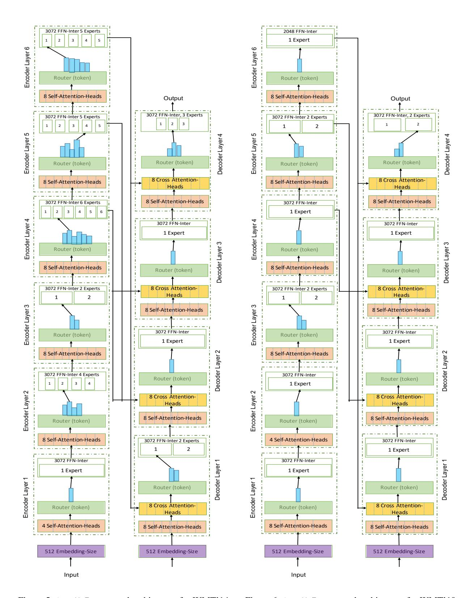

# Acknowledgements

MAM acknowledges support from Canada Research Chairs (CRC), the Natural Sciences and Engineering Research Council of Canada (NSERC; RGPIN-2018-04267), Canadian Foundation for Innovation (CFI; 37771), and Digital Research Alliance of Canada.[2](#page-9-15) Lakshmanan's research was supported in part by a grant from NSERC (Canada).

## References

- <span id="page-9-3"></span>Mikel Artetxe, Shruti Bhosale, Naman Goyal, Todor Mihaylov, Myle Ott, Sam Shleifer, Xi Victoria Lin, Jingfei Du, Srinivasan Iyer, Ramakanth Pasunuru, Giri Anantharaman, Xian Li, Shuohui Chen, Halil Akin, Mandeep Baines, Louis Martin, Xing Zhou, Punit Singh Koura, Brian O'Horo, Jeff Wang, Luke Zettlemoyer, Mona T. Diab, Zornitsa Kozareva, and Ves Stoyanov. 2021. [Efficient large scale lan](http://arxiv.org/abs/2112.10684)[guage modeling with mixtures of experts.](http://arxiv.org/abs/2112.10684) *CoRR*, abs/2112.10684.
- <span id="page-9-6"></span>Tom Brown, Benjamin Mann, Nick Ryder, Melanie Subbiah, Jared D Kaplan, Prafulla Dhariwal, Arvind Neelakantan, Pranav Shyam, Girish Sastry, Amanda Askell, Sandhini Agarwal, Ariel Herbert-Voss, Gretchen Krueger, Tom Henighan, Rewon Child, Aditya Ramesh, Daniel Ziegler, Jeffrey Wu, Clemens Winter, Chris Hesse, Mark Chen, Eric Sigler, Mateusz Litwin, Scott Gray, Benjamin Chess, Jack Clark, Christopher Berner, Sam McCandlish, Alec Radford, Ilya Sutskever, and Dario Amodei. 2020. [Language models are few-shot learners.](https://proceedings.neurips.cc/paper/2020/file/1457c0d6bfcb4967418bfb8ac142f64a-Paper.pdf) In *Advances in Neural Information Processing Systems*, volume 33, pages 1877–1901. Curran Associates, Inc.
- <span id="page-9-11"></span>Han Cai, Chuang Gan, Tianzhe Wang, Zhekai Zhang, and Song Han. 2020. [Once for all: Train one network](https://arxiv.org/pdf/1908.09791.pdf) [and specialize it for efficient deployment.](https://arxiv.org/pdf/1908.09791.pdf) In *International Conference on Learning Representations*.
- <span id="page-9-5"></span>Jacob Devlin, Ming-Wei Chang, Kenton Lee, and Kristina Toutanova. 2019. [BERT: Pre-training of](https://doi.org/10.18653/v1/N19-1423) [deep bidirectional transformers for language under](https://doi.org/10.18653/v1/N19-1423)[standing.](https://doi.org/10.18653/v1/N19-1423) In *Proceedings of the 2019 Conference of the North American Chapter of the Association for Computational Linguistics: Human Language Technologies, Volume 1 (Long and Short Papers)*, pages 4171–4186, Minneapolis, Minnesota. Association for Computational Linguistics.
- <span id="page-9-8"></span>Chenhe Dong, Guangrun Wang, Hang Xu, Jiefeng Peng, Xiaozhe Ren, and Xiaodan Liang. 2021. [Efficient-](https://doi.org/10.18653/v1/2021.findings-emnlp.123)[BERT: Progressively searching multilayer percep](https://doi.org/10.18653/v1/2021.findings-emnlp.123)[tron via warm-up knowledge distillation.](https://doi.org/10.18653/v1/2021.findings-emnlp.123) In *Findings of the Association for Computational Linguistics: EMNLP 2021*, pages 1424–1437, Punta Cana, Dominican Republic. Association for Computational Linguistics.
- <span id="page-9-2"></span>Nan Du, Yanping Huang, Andrew M Dai, Simon Tong, Dmitry Lepikhin, Yuanzhong Xu, Maxim Krikun, Yanqi Zhou, Adams Wei Yu, Orhan Firat, Barret Zoph, Liam Fedus, Maarten P Bosma, Zongwei Zhou, Tao Wang, Emma Wang, Kellie Webster, Marie Pellat, Kevin Robinson, Kathleen Meier-Hellstern, Toju Duke, Lucas Dixon, Kun Zhang, Quoc Le, Yonghui

- Wu, Zhifeng Chen, and Claire Cui. 2022. [GLaM:](https://proceedings.mlr.press/v162/du22c.html) [Efficient scaling of language models with mixture](https://proceedings.mlr.press/v162/du22c.html)[of-experts.](https://proceedings.mlr.press/v162/du22c.html) In *Proceedings of the 39th International Conference on Machine Learning*, volume 162 of *Proceedings of Machine Learning Research*, pages 5547–5569. PMLR.
- <span id="page-9-4"></span>William Fedus, Jeff Dean, and Barret Zoph. 2022a. [A](https://doi.org/10.48550/ARXIV.2209.01667) [review of sparse expert models in deep learning.](https://doi.org/10.48550/ARXIV.2209.01667)
- <span id="page-9-0"></span>William Fedus, Barret Zoph, and Noam Shazeer. 2022b. [Switch transformers: Scaling to trillion parameter](http://jmlr.org/papers/v23/21-0998.html) [models with simple and efficient sparsity.](http://jmlr.org/papers/v23/21-0998.html) *Journal of Machine Learning Research*, 23(120):1–39.
- <span id="page-9-7"></span>Jiahui Gao, Hang Xu, Han Shi, Xiaozhe Ren, Philip L. H. Yu, Xiaodan Liang, Xin Jiang, and Zhenguo Li. 2022. [Autobert-zero: Evolving BERT backbone](https://ojs.aaai.org/index.php/AAAI/article/view/21311) [from scratch.](https://ojs.aaai.org/index.php/AAAI/article/view/21311) In *Thirty-Sixth AAAI Conference on Artificial Intelligence, AAAI 2022, Thirty-Fourth Conference on Innovative Applications of Artificial Intelligence, IAAI 2022, The Twelveth Symposium on Educational Advances in Artificial Intelligence, EAAI 2022 Virtual Event, February 22 - March 1, 2022*, pages 10663–10671. AAAI Press.
- <span id="page-9-13"></span>Chengyue Gong, Dilin Wang, Meng Li, Xinlei Chen, Zhicheng Yan, Yuandong Tian, qiang liu, and Vikas Chandra. 2022. [NASVit: Neural architecture search](https://openreview.net/forum?id=Qaw16njk6L) [for efficient vision transformers with gradient conflict](https://openreview.net/forum?id=Qaw16njk6L) [aware supernet training.](https://openreview.net/forum?id=Qaw16njk6L) In *International Conference on Learning Representations*.
- <span id="page-9-12"></span>Zichao Guo, Xiangyu Zhang, Haoyuan Mu, Wen Heng, Zechun Liu, Yichen Wei, and Jian Sun. 2020. [Single](https://doi.org/10.1007/978-3-030-58517-4_32) [path one-shot neural architecture search with uni](https://doi.org/10.1007/978-3-030-58517-4_32)[form sampling.](https://doi.org/10.1007/978-3-030-58517-4_32) In *Computer Vision - ECCV 2020 - 16th European Conference, Glasgow, UK, August 23- 28, 2020, Proceedings, Part XVI*, volume 12361 of *Lecture Notes in Computer Science*, pages 544–560. Springer.
- <span id="page-9-14"></span>Weizhe Hua, Zihang Dai, Hanxiao Liu, and Quoc Le. 2022. Transformer quality in linear time. In *Proceedings of the 39th International Conference on Machine Learning*, volume 162 of *Proceedings of Machine Learning Research*, pages 9099–9117. PMLR.
- <span id="page-9-9"></span>Mojan Javaheripi, Shital Shah, Subhabrata Mukherjee, Tomasz L. Religa, Caio C. T. Mendes, Gustavo H. de Rosa, Sebastien Bubeck, Farinaz Koushanfar, and Debadeepta Dey. 2022. [Litetransformersearch:](https://doi.org/10.48550/ARXIV.2203.02094) [Training-free on-device search for efficient autore](https://doi.org/10.48550/ARXIV.2203.02094)[gressive language models.](https://doi.org/10.48550/ARXIV.2203.02094)
- <span id="page-9-10"></span>Jungo Kasai, Nikolaos Pappas, Hao Peng, James Cross, and Noah Smith. 2021. [Deep encoder, shallow](https://openreview.net/forum?id=KpfasTaLUpq) [decoder: Reevaluating non-autoregressive machine](https://openreview.net/forum?id=KpfasTaLUpq) [translation.](https://openreview.net/forum?id=KpfasTaLUpq) In *International Conference on Learning Representations*.
- <span id="page-9-1"></span>Young Jin Kim, Ammar Ahmad Awan, Alexandre Muzio, Andrés Felipe Cruz-Salinas, Liyang Lu, Amr Hendy, Samyam Rajbhandari, Yuxiong He, and

<span id="page-9-15"></span><sup>2</sup> <https://alliancecan.ca>

- Hany Hassan Awadalla. 2021. [Scalable and effi](http://arxiv.org/abs/2109.10465)[cient moe training for multitask multilingual models.](http://arxiv.org/abs/2109.10465) *CoRR*, abs/2109.10465.
- <span id="page-10-0"></span>Sneha Kudugunta, Yanping Huang, Ankur Bapna, Maxim Krikun, Dmitry Lepikhin, Minh-Thang Luong, and Orhan Firat. 2021. [Beyond distillation:](https://doi.org/10.18653/v1/2021.findings-emnlp.304) [Task-level mixture-of-experts for efficient inference.](https://doi.org/10.18653/v1/2021.findings-emnlp.304) In *Findings of the Association for Computational Linguistics: EMNLP 2021*, pages 3577–3599, Punta Cana, Dominican Republic. Association for Computational Linguistics.
- <span id="page-10-5"></span>Dmitry Lepikhin, HyoukJoong Lee, Yuanzhong Xu, Dehao Chen, Orhan Firat, Yanping Huang, Maxim Krikun, Noam Shazeer, and Zhifeng Chen. 2020. [Gshard: Scaling giant models with conditional](http://arxiv.org/abs/2006.16668) [computation and automatic sharding.](http://arxiv.org/abs/2006.16668) *CoRR*, abs/2006.16668.
- <span id="page-10-6"></span>Mike Lewis, Shruti Bhosale, Tim Dettmers, Naman Goyal, and Luke Zettlemoyer. 2021. [Base layers:](https://proceedings.mlr.press/v139/lewis21a.html) [Simplifying training of large, sparse models.](https://proceedings.mlr.press/v139/lewis21a.html) In *Proceedings of the 38th International Conference on Machine Learning*, volume 139 of *Proceedings of Machine Learning Research*, pages 6265–6274. PMLR.
- <span id="page-10-17"></span>Hanxiao Liu, Zihang Dai, David So, and Quoc V Le. 2021. [Pay attention to mlps.](https://proceedings.neurips.cc/paper/2021/file/4cc05b35c2f937c5bd9e7d41d3686fff-Paper.pdf) In *Advances in Neural Information Processing Systems*, volume 34, pages 9204–9215. Curran Associates, Inc.
- <span id="page-10-8"></span>Rui Liu, Young Jin Kim, Alexandre Muzio, and Hany Hassan. 2022. [Gating dropout: Communication](https://proceedings.mlr.press/v162/liu22g.html)[efficient regularization for sparsely activated trans](https://proceedings.mlr.press/v162/liu22g.html)[formers.](https://proceedings.mlr.press/v162/liu22g.html) In *Proceedings of the 39th International Conference on Machine Learning*, volume 162 of *Proceedings of Machine Learning Research*, pages 13782–13792. PMLR.
- <span id="page-10-16"></span>Myle Ott, Sergey Edunov, Alexei Baevski, Angela Fan, Sam Gross, Nathan Ng, David Grangier, and Michael Auli. 2019. [fairseq: A fast, extensible toolkit for](https://doi.org/10.18653/v1/N19-4009) [sequence modeling.](https://doi.org/10.18653/v1/N19-4009) In *Proceedings of the 2019 Conference of the North American Chapter of the Association for Computational Linguistics (Demonstrations)*, pages 48–53, Minneapolis, Minnesota. Association for Computational Linguistics.
- <span id="page-10-14"></span>Kishore Papineni, Salim Roukos, Todd Ward, and Wei-Jing Zhu. 2002. [Bleu: a method for automatic evalu](https://doi.org/10.3115/1073083.1073135)[ation of machine translation.](https://doi.org/10.3115/1073083.1073135) In *Proceedings of the 40th Annual Meeting of the Association for Computational Linguistics*, pages 311–318, Philadelphia, Pennsylvania, USA. Association for Computational Linguistics.
- <span id="page-10-9"></span>Samyam Rajbhandari, Conglong Li, Zhewei Yao, Minjia Zhang, Reza Yazdani Aminabadi, Ammar Ahmad Awan, Jeff Rasley, and Yuxiong He. 2022. [DeepSpeed-MoE: Advancing mixture-of-experts in](https://proceedings.mlr.press/v162/rajbhandari22a.html)[ference and training to power next-generation AI](https://proceedings.mlr.press/v162/rajbhandari22a.html) [scale.](https://proceedings.mlr.press/v162/rajbhandari22a.html) In *Proceedings of the 39th International Conference on Machine Learning*, volume 162 of

- *Proceedings of Machine Learning Research*, pages 18332–18346. PMLR.
- <span id="page-10-7"></span>Stephen Roller, Sainbayar Sukhbaatar, Arthur Szlam, and Jason E Weston. 2021. [Hash layers for large](https://openreview.net/forum?id=lMgDDWb1ULW) [sparse models.](https://openreview.net/forum?id=lMgDDWb1ULW) In *Advances in Neural Information Processing Systems*.
- <span id="page-10-1"></span>Tal Schuster, Adam Fisch, Jai Gupta, Mostafa Dehghani, Dara Bahri, Vinh Q. Tran, Yi Tay, and Donald Metzler. 2022. [Confident adaptive language modeling.](https://doi.org/10.48550/ARXIV.2207.07061)
- <span id="page-10-4"></span>Noam Shazeer, \*Azalia Mirhoseini, \*Krzysztof Maziarz, Andy Davis, Quoc Le, Geoffrey Hinton, and Jeff Dean. 2017. [Outrageously large neural net](https://openreview.net/forum?id=B1ckMDqlg)[works: The sparsely-gated mixture-of-experts layer.](https://openreview.net/forum?id=B1ckMDqlg) In *International Conference on Learning Representations*.
- <span id="page-10-3"></span>David So, Quoc Le, and Chen Liang. 2019. [The evolved](https://proceedings.mlr.press/v97/so19a.html) [transformer.](https://proceedings.mlr.press/v97/so19a.html) In *Proceedings of the 36th International Conference on Machine Learning*, volume 97 of *Proceedings of Machine Learning Research*, pages 5877– 5886. PMLR.
- <span id="page-10-12"></span>David So, Wojciech Manke, Hanxiao Liu, Zihang Dai, ´ Noam Shazeer, and Quoc V Le. 2021. [Searching](https://proceedings.neurips.cc/paper/2021/file/2f3c6a4cd8af177f6456e7e51a916ff3-Paper.pdf) [for efficient transformers for language modeling.](https://proceedings.neurips.cc/paper/2021/file/2f3c6a4cd8af177f6456e7e51a916ff3-Paper.pdf) In *Advances in Neural Information Processing Systems*, volume 34, pages 6010–6022. Curran Associates, Inc.
- <span id="page-10-15"></span>Ashish Vaswani, Noam Shazeer, Niki Parmar, Jakob Uszkoreit, Llion Jones, Aidan N Gomez, Ł ukasz Kaiser, and Illia Polosukhin. 2017. [Attention is all](https://proceedings.neurips.cc/paper/2017/file/3f5ee243547dee91fbd053c1c4a845aa-Paper.pdf) [you need.](https://proceedings.neurips.cc/paper/2017/file/3f5ee243547dee91fbd053c1c4a845aa-Paper.pdf) In *Advances in Neural Information Processing Systems*, volume 30. Curran Associates, Inc.
- <span id="page-10-13"></span>Alex Wang, Amanpreet Singh, Julian Michael, Felix Hill, Omer Levy, and Samuel Bowman. 2018. [GLUE:](https://doi.org/10.18653/v1/W18-5446) [A multi-task benchmark and analysis platform for nat](https://doi.org/10.18653/v1/W18-5446)[ural language understanding.](https://doi.org/10.18653/v1/W18-5446) In *Proceedings of the 2018 EMNLP Workshop BlackboxNLP: Analyzing and Interpreting Neural Networks for NLP*, pages 353–355, Brussels, Belgium. Association for Computational Linguistics.
- <span id="page-10-2"></span>Hanrui Wang, Zhanghao Wu, Zhijian Liu, Han Cai, Ligeng Zhu, Chuang Gan, and Song Han. 2020. [HAT:](https://doi.org/10.18653/v1/2020.acl-main.686) [Hardware-aware transformers for efficient natural](https://doi.org/10.18653/v1/2020.acl-main.686) [language processing.](https://doi.org/10.18653/v1/2020.acl-main.686) In *Proceedings of the 58th Annual Meeting of the Association for Computational Linguistics*, pages 7675–7688, Online. Association for Computational Linguistics.
- <span id="page-10-11"></span>Dongkuan Xu, Subhabrata (Subho) Mukherjee, Xiaodong Liu, Debadeepta Dey, Wenhui Wang, Xiang Zhang, Ahmed H. Awadallah, and Jianfeng Gao. 2022a. [Autodistil: Few-shot task-agnostic neural ar](https://arxiv.org/abs/2201.08539)[chitecture search for distilling large language models.](https://arxiv.org/abs/2201.08539) *ArXiv*.
- <span id="page-10-10"></span>Jin Xu, Xu Tan, Renqian Luo, Kaitao Song, Jian Li, Tao Qin, and Tie-Yan Liu. 2021. [Nas-bert: Task-agnostic](https://doi.org/10.1145/3447548.3467262) [and adaptive-size bert compression with neural ar](https://doi.org/10.1145/3447548.3467262)[chitecture search.](https://doi.org/10.1145/3447548.3467262) In *Proceedings of the 27th ACM*

SIGKDD Conference on Knowledge Discovery & Data Mining, KDD '21, page 1933–1943, New York, NY, USA. Association for Computing Machinery.

<span id="page-11-4"></span>Jin Xu, Xu Tan, Kaitao Song, Renqian Luo, Yichong Leng, Tao Qin, Tie-Yan Liu, and Jian Li. 2022b. Analyzing and mitigating interference in neural architecture search. In *Proceedings of the 39th International Conference on Machine Learning*, volume 162 of *Proceedings of Machine Learning Research*, pages 24646–24662. PMLR.

<span id="page-11-3"></span>Yichun Yin, Cheng Chen, Lifeng Shang, Xin Jiang, Xiao Chen, and Qun Liu. 2021. AutoTinyBERT: Automatic hyper-parameter optimization for efficient pre-trained language models. In *Proceedings of the 59th Annual Meeting of the Association for Computational Linguistics and the 11th International Joint Conference on Natural Language Processing (Volume 1: Long Papers)*, pages 5146–5157, Online. Association for Computational Linguistics.

<span id="page-11-5"></span>Jiahui Yu, Linjie Yang, Ning Xu, Jianchao Yang, and Thomas Huang. 2019. Slimmable neural networks. In *International Conference on Learning Representations*.

<span id="page-11-2"></span>Seniha Esen Yuksel, Joseph N. Wilson, and Paul D. Gader. 2012. Twenty years of mixture of experts. *IEEE Transactions on Neural Networks and Learning Systems*, 23(8):1177–1193.

<span id="page-11-1"></span>Barret Zoph, Irwan Bello, Sameer Kumar, Nan Du, Yanping Huang, Jeff Dean, Noam Shazeer, and William Fedus. 2022. St-moe: Designing stable and transferable sparse expert models.

<span id="page-11-0"></span>Simiao Zuo, Xiaodong Liu, Jian Jiao, Young Jin Kim, Hany Hassan, Ruofei Zhang, Jianfeng Gao, and Tuo Zhao. 2022. Taming sparsely activated transformer with stochastic experts. In *International Conference on Learning Representations*.

#### A Appendix

#### A.1 Full Architecture Design

Figure 4, 5 and 6 present the full architecture design of pareto-efficient architectures generated by AutoMoE.

### A.2 Evolutionary Search - Stability

We study the initialization effects on the stability of the pareto front outputted by the evolutionary search for HAT. Table 8 displays sampled (direct) BLEU and latency of the models in the pareto front for different seeds on the WMT'14 En-Fr task. The differences in the latency and BLEU across seeds are mostly marginal. This result highlights that the pareto front outputted by the evolutionary search is largely stable for HAT.

<span id="page-11-6"></span>

Figure 4: AutoMoE-generated architecture for WMT'14 En-De.

<span id="page-12-0"></span>

| Supernet / Pareto Front |      | Model 1 |       | Model 2 |       | Model 3 |       |
|-------------------------|------|---------|-------|---------|-------|---------|-------|
|                         | Seed | Latency | BLEU  | Latency | BLEU  | Latency | BLEU  |
| HAT (SPOS)              | 1    | 96.39   | 38.94 | 176.44  | 39.26 | 187.53  | 39.16 |
| HAT (SPOS)              | 2    | 98.91   | 38.96 | 159.87  | 39.20 | 192.11  | 39.09 |
| HAT (SPOS)              | 3    | 100.15  | 38.96 | 158.67  | 39.24 | 189.53  | 39.16 |

Table 8: Stability of the evolutionary search w.r.t. different seeds on the WMT'14 En-Fr task. Search quality is measured in terms of latency and sampled (direct) supernet performance (BLEU) of the models in the pareto front.

## A.3 Evolutionary Search - Algorithm

We present the pseudo code of the evolutionary search algorithm proposed by HAT in Algorithm [1.](#page-13-0) This algorithm is also adopted by AutoMoE.

### <span id="page-13-0"></span>Algorithm 1 Evolutionary search algorithm for Neural architecture search.

Input: supernet, latency-predictor, num-iterations, num-population, num-parents, num-mutations, num-crossover, mutate-prob, latency-constraint

Output: best-architecture

```
1: popu \leftarrow num-population random samples from the search space
2: for iter \leftarrow 1 to num-iterations do
       cur-parents \leftarrow top 'num-parents' architectures from popu by supernet's validation loss
4:
       cur-mutate-popu = {}
 5:
       for mi ← 1 to num-mutations do
           cur-mutate-gene \leftarrow mutate a random example from popu with mutation probability
   mutate-prob
7:
           if cur-mutate-gene satisfies latency-constraint via latency-predictor then
8:
               cur-mutate-popu = cur-mutate-popu ∪ cur-mutate-gene
9:
       cur-crossover-popu = {}
10:
       \mathbf{for}\ ci \leftarrow 1\ \mathsf{to}\ \mathsf{num\text{-}crossover}\ \mathbf{do}
11:
           cur-crossover-gene \leftarrow crossover two random examples from popu
12:
           if cur-crossover-gene satisfies latency-constraint via latency-predictor then
               cur-crossover-popu = cur-crossover-popu ∪ cur-crossover-gene
13:
       popu = \text{cur-parents} \cup \text{cur-mutate-popu} \cup \text{cur-crossover-popu}
15: return top architecture from popu by supernet's validation loss
```

<span id="page-14-1"></span><span id="page-14-0"></span>

Figure 5: AutoMoE-generated architecture for WMT'14 En-Fr.

Figure 6: AutoMoE-generated architecture for WMT'19 En-De.

## ACL 2023 Responsible NLP Checklist

| A |        | For every submission:                                                                                                                                                                                                                                                                                                                                                                                                                                                                           |
|---|--------|-------------------------------------------------------------------------------------------------------------------------------------------------------------------------------------------------------------------------------------------------------------------------------------------------------------------------------------------------------------------------------------------------------------------------------------------------------------------------------------------------|
|   | ✓<br>7 | A1. Did you describe the limitations of your work?                                                                                                                                                                                                                                                                                                                                                                                                                                              |
|   |        | A2. Did you discuss any potential risks of your work?<br>Not applicable. Left blank.                                                                                                                                                                                                                                                                                                                                                                                                            |
|   | ✓<br>1 | A3. Do the abstract and introduction summarize the paper's main claims?                                                                                                                                                                                                                                                                                                                                                                                                                         |
|   | ✗      | A4. Have you used AI writing assistants when working on this paper?<br>Left blank.                                                                                                                                                                                                                                                                                                                                                                                                              |
| B | ✓      | Did you use or create scientific artifacts?                                                                                                                                                                                                                                                                                                                                                                                                                                                     |
|   |        | Abstract                                                                                                                                                                                                                                                                                                                                                                                                                                                                                        |
|   | ✓      | B1. Did you cite the creators of artifacts you used?<br>Abstract                                                                                                                                                                                                                                                                                                                                                                                                                                |
|   |        | B2. Did you discuss the license or terms for use and / or distribution of any artifacts?<br>Not applicable. Left blank.                                                                                                                                                                                                                                                                                                                                                                         |
|   |        | B3. Did you discuss if your use of existing artifact(s) was consistent with their intended use, provided<br>that it was specified? For the artifacts you create, do you specify intended use and whether that is<br>compatible with the original access conditions (in particular, derivatives of data accessed for research<br>purposes should not be used outside of research contexts)?<br>Not applicable. Left blank.                                                                       |
|   |        | B4. Did you discuss the steps taken to check whether the data that was collected / used contains any<br>information that names or uniquely identifies individual people or offensive content, and the steps<br>taken to protect / anonymize it?<br>Not applicable. Left blank.                                                                                                                                                                                                                  |
|   |        | B5. Did you provide documentation of the artifacts, e.g., coverage of domains, languages, and<br>linguistic phenomena, demographic groups represented, etc.?<br>Not applicable. Left blank.                                                                                                                                                                                                                                                                                                     |
|   | ✓<br>4 | B6. Did you report relevant statistics like the number of examples, details of train / test / dev splits,<br>etc. for the data that you used / created? Even for commonly-used benchmark datasets, include the<br>number of examples in train / validation / test splits, as these provide necessary context for a reader<br>to understand experimental results. For example, small differences in accuracy on large test sets may<br>be significant, while on small test sets they may not be. |
| C | ✓      | Did you run computational experiments?                                                                                                                                                                                                                                                                                                                                                                                                                                                          |
|   | 5      |                                                                                                                                                                                                                                                                                                                                                                                                                                                                                                 |
|   | ✓<br>5 | C1. Did you report the number of parameters in the models used, the total computational budget<br>(e.g., GPU hours), and computing infrastructure used?                                                                                                                                                                                                                                                                                                                                         |

*The Responsible NLP Checklist used at [ACL 2023](https://2023.aclweb.org/) is adopted from [NAACL 2022,](https://2022.naacl.org/blog/responsible-nlp-research-checklist/) with the addition of a [question on AI writing](https://2023.aclweb.org/blog/ACL-2023-policy/) [assistance.](https://2023.aclweb.org/blog/ACL-2023-policy/)*

| ✓ | C2.<br>Did you discuss the experimental setup, including hyperparameter search and best-found<br>hyperparameter values?<br>5                                                                                                                                       |
|---|--------------------------------------------------------------------------------------------------------------------------------------------------------------------------------------------------------------------------------------------------------------------|
| ✓ | C3. Did you report descriptive statistics about your results (e.g., error bars around results, summary<br>statistics from sets of experiments), and is it transparent whether you are reporting the max, mean,<br>etc. or just a single run?<br>5                  |
| ✓ | C4. If you used existing packages (e.g., for preprocessing, for normalization, or for evaluation), did<br>you report the implementation, model, and parameter settings used (e.g., NLTK, Spacy, ROUGE,<br>etc.)?<br>4                                              |
| D | ✗<br>Did you use human annotators (e.g., crowdworkers) or research with human participants?                                                                                                                                                                        |
|   | Left blank.                                                                                                                                                                                                                                                        |
|   | D1. Did you report the full text of instructions given to participants, including e.g., screenshots,<br>disclaimers of any risks to participants or annotators, etc.?<br>No response.                                                                              |
|   | D2. Did you report information about how you recruited (e.g., crowdsourcing platform, students)<br>and paid participants, and discuss if such payment is adequate given the participants' demographic<br>(e.g., country of residence)?<br>No response.             |
|   | D3.<br>Did you discuss whether and how consent was obtained from people whose data you're<br>using/curating?<br>For example, if you collected data via crowdsourcing, did your instructions to<br>crowdworkers explain how the data would be used?<br>No response. |
|   | D4. Was the data collection protocol approved (or determined exempt) by an ethics review board?<br>No response.                                                                                                                                                    |
|   | D5. Did you report the basic demographic and geographic characteristics of the annotator population<br>that is the source of the data?<br>No response.                                                                                                             |