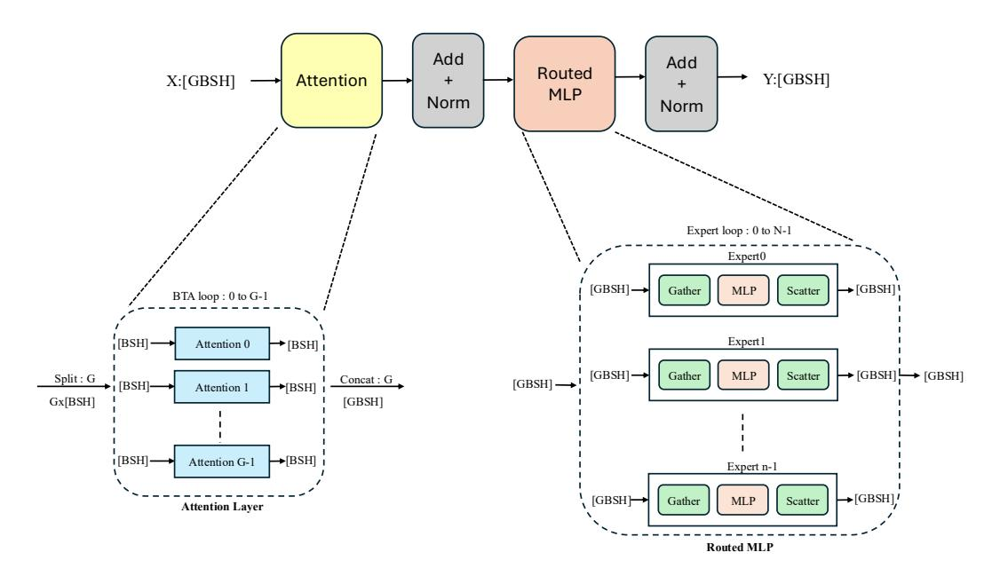
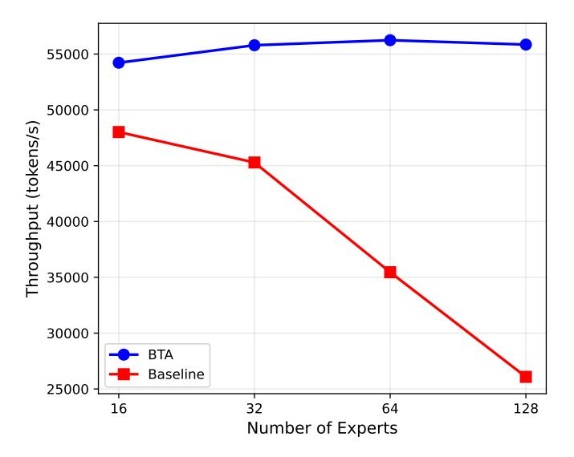
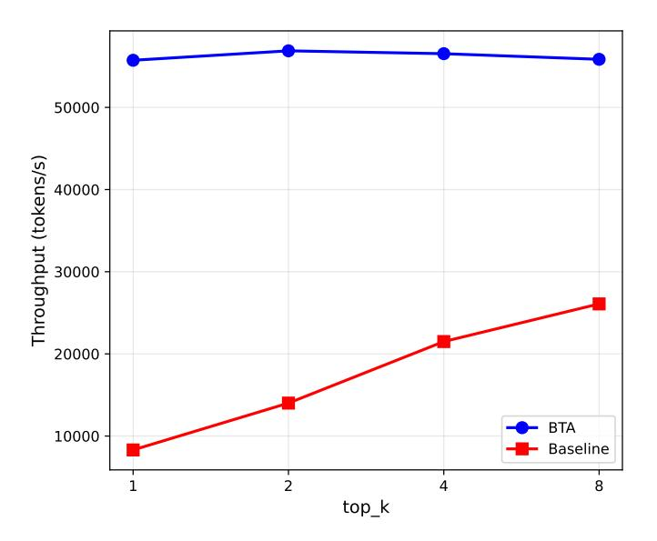

# Batch Tiling on Attention: Efficient Mixture of Experts Training on Wafer-Scale Processors

[Daria Soboleva](https://orcid.org/0009-0003-2654-3767) Cerebras Sunnyvale, CA, USA daria.soboleva@cerebras.net

[Sangamesh Ragate](https://orcid.org/0009-0008-9189-2310) Cerebras Sunnyvale, CA, USA sangamesh@cerebras.net

[Etienne Goffinet](https://orcid.org/0000-0002-0120-0392) Cerebras Abu Dabi, United Arab Emirates Etienne.Goffinet@cerebras.net

[Elif Albuz](https://orcid.org/0009-0006-9203-0611) Cerebras Sunnyvale, CA, USA Elif.Albuz@cerebras.net

[Hui Zeng](https://orcid.org/0009-0006-9719-309X) Cerebras Sunnyvale, CA, USA hui@cerebras.net

[Natalia Vassilieva](https://orcid.org/0009-0003-1038-1572) Cerebras Sunnyvale, CA, USA natalia@cerebras.net

## Abstract

Mixture of Experts (MoE) models face significant computational bottlenecks on wafer-scale processors due to conflicting batch size requirements between attention and MLP layers. While attention mechanisms demand smaller batch sizes due to memory constraints, routable MLP layers require larger batches to achieve optimal compute density on massively parallel architectures.

We introduce Batch Tiling on Attention (BTA), a novel approach that decouples batch processing across different stages of MoE computation by applying dynamic tiling specifically on the attention mechanism's batch dimension. Our method processes attention operations at reduced batch size through tiled computation, then concatenates outputs to form a larger batch size e = · for subsequent MLP operations, where is a positive integer.

This strategy addresses memory limitations in attention blocks while maximizing hardware utilization in expert layers. We demonstrate BTA's effectiveness on the Cerebras wafer-scale engines using Qwen3-like models, achieving up to 5× improvements in performance at higher sparsity levels compared to conventional uniform batching approaches. Unlike existing solutions such as FlashAttention and expert parallelism designed for GPU architectures, BTA specifically targets the unique computational characteristics of wafer-scale processors.

## CCS Concepts

- Computing methodologies → Machine learning; Artificial intelligence; Natural language processing; Distributed algorithms;
- Hardware → Application-specific VLSI designs.

## Keywords

mixture of experts, deep learning, training efficiency, wafer-scale processors

#### ACM Reference Format:

Daria Soboleva, Etienne Goffinet, Hui Zeng, Sangamesh Ragate, Elif Albuz, and Natalia Vassilieva. 2025. Batch Tiling on Attention: Efficient Mixture

[This work is licensed under a Creative Commons Attribution 4.0 International License.](https://creativecommons.org/licenses/by/4.0) SC Workshops '25, St Louis, MO, USA

© 2025 Copyright held by the owner/author(s). ACM ISBN 979-8-4007-1871-7/25/11 <https://doi.org/10.1145/3731599.3767407>

of Experts Training on Wafer-Scale Processors. In Workshops of the International Conference for High Performance Computing, Networking, Storage and Analysis (SC Workshops '25), November 16–21, 2025, St Louis, MO, USA. ACM, New York, NY, USA, [5](#page-4-0) pages.<https://doi.org/10.1145/3731599.3767407>

## 1 Introduction

Mixture-of-Experts (MoE) scaling has matured across TPU and GPU stacks, where expert parallelism (EP) routes each token to a small, activated subset of experts, growing capacity sub-linearly with compute. TPU-scale results such as GShard established EP's viability with compiler-integrated collectives, while Switch Transformer simplified gating to top\_k = 1, cutting routing/communication per token and stabilizing training at trillion-parameter scale [\[8,](#page-3-0) [16\]](#page-3-1).

Expert parallelism (EP) improves Model FLOPs Utilization (MFU) by distributing experts across devices and consolidating routed tokens into large per-expert kernels; these gains are further amplified in hybrid setups that combine EP with data, tensor/model, and pipeline parallelism to keep kernels large and hide communication. Modern compilers and runtimes—spanning production systems and research stacks—optimize these mappings by automating partitioning and collective scheduling, often yielding plans competitive with expert hand-tuned strategies [\[1,](#page-3-2) [4,](#page-3-3) [9,](#page-3-4) [12,](#page-3-5) [17,](#page-3-6) [18,](#page-3-7) [21,](#page-3-8) [24,](#page-3-9) [25\]](#page-3-10).

Beyond communication efficiency, prior work tackles scheduling and placement with specific mechanisms: ScMoE redesigns the MoE block to overlap communication and compute almost fully; FasterMoE models congestion and dynamically schedules routes; Luffy reduces routed volume via sequence migration and token condensation; ScheMoE adds an extensible scheduler and pipelined All-to-All (Pipe-A2A) that overlaps intra- and inter-node exchanges; and MoETuner optimizes expert placement to cut tail latency [\[2,](#page-3-11) [3,](#page-3-12) [10,](#page-3-13) [11,](#page-3-14) [20\]](#page-3-15). Heterogeneous and inference-focused lines (e.g., HeterMoE's zebra-parallel specialization; expert slicing, which splits one expert across multiple devices; and CPU↔GPU expert transfers/pre-gated prefetch) broaden EP's reach across hardware and memory hierarchies [\[6,](#page-3-16) [13,](#page-3-17) [14,](#page-3-18) [22\]](#page-3-19).

Wafer-scale Cerebras CSX systems change the bottleneck profile (Figure [4\)](#page-4-1). On CSX, abundant on-wafer bandwidth and nearcompute SRAM reduce off-chip traffic, but the two MoE phases pull batching in opposite directions: (i) attention is activation/IO bound with large KV/softmax intermediates that cap feasible micro-batch size; (ii) expert MLPs require large effective batches to maintain compute density given sparse activation. GPU-centric remedies –

Figure 1: Batch Tiling on Attention (BTA) for Mixture-of-Experts architecture [7, 19]. The BTA layer partitions input tokens into G independent groups, reducing memory requirements and enabling smaller batch sizes. The subsequent routed MLP layer operates with larger batch sizes to achieve optimal compute density, decoupling batch size constraints between attention and MoE components.

better collectives, overlap (e.g., ScMoE), and placement/scheduling (e.g., ScheMoE/MoETuner) do not resolve this cross-phase *batch interface* conflict.

Even optimal attention kernels (e.g., FlashAttention) reduce I/O traffic but do not relax the peak-activation constraint that ultimately caps the attention batch size [5].

The result is a persistent utilization gap: raising batch improves experts but breaks attention memory; lowering batch satisfies attention but starves experts.

We propose **Batch Tiling on Attention (BTA)**, a phase-aware method that *decouples the batch-size requirements of attention and experts on wafer-scale*. BTA executes attention over activation-safe tiles, then *elastically re-batches* tokens before the expert phase to raise compute density and balance expert load. Unlike communication-only optimizations or placement adjustments, BTA changes *how many* tokens each phase processes at once (small for attention, large for experts), directly addressing the attention-memory vs. expert-density tension [2, 10, 12, 20, 22].

#### Contributions.

- Novel Asymmetric Batching Strategy (BTA). Decouples batch-size requirements between attention and MLP layers in MoE architectures.
- Memory-Efficient Attention Processing. Tiles attention over smaller tensor chunks, reducing their peak activation memory and preventing OOMs.
- Increased Compute Density for Experts. Re-batching routed tokens enables larger effective batches, improving experts' compute efficiency.

- Improved Load Balancing. Larger batches enable more balanced expert utilization across the wafer.
- Wafer-Scale Optimization. BTA targets unique constraints of wafer-scale processors, addressing a different bottleneck than GPU network optimizations.

#### 2 Method

Our approach asymmetrically decouples batch size requirements between attention and MLP layers. Attention requires smaller batch sizes due to quadratic memory scaling with sequence length [15], while routed MLPs demand larger batches for optimal compute density.

## 2.1 Algorithm Design

Overview. BTA introduces a batch-tiling loop around attention while keeping the rest of the block unchanged. We reshape the global batch  $\widetilde{B}$  into G tiles of size B so that the attention phase runs on (B,S,H) slices that satisfy the activation-memory budget, and the MoE phase then consumes the re-concatenated  $(\widetilde{B},S,H)$  tensor to preserve expert compute density.

*Shapes and symbols.* For an input tensor  $X \in \mathbb{R}^{G \times B \times S \times H}$ :

- *G* batch tiling factor (number of attention tiles).
- B per-tile batch size chosen to meet the attention peakmemory cap.
- \( \widetilde{B} = G \times B Concatenated batch size for each expert network to press.
- *S* sequence length.

• H – hidden size ( $H = n_h \cdot d_h$ , with  $n_h$  attention heads, perhead dimension  $d_h$ ).

## Algorithm 1 Batch Tiling on Attention

- 1: **Input:**  $X \in \mathbb{R}^{G \times B \times S \times H}$
- 2: Output:  $Y \in \mathbb{R}^{G \times B \times S \times H}$
- 3: **for** i = 1 to G **do**
- 4:  $X_i = X[i, :, :, :]$  {tile extraction}
- 5:  $Y_i = Attention(X_i)$
- 6:  $Y[i,:,:] = Y_i$  {tile concatenation}
- 7: end for

Router and re-batching interface. Tilings only affect attention. After concatenation, we compute routing on the  $\widetilde{B}$ -sized tensor and distribute tokens by expert assignment, as is standard in MoE designs. Experts then run large, well-packed matmuls, and their outputs are aggregated back. This change of the batch interface—small for attention, large for experts—is the key to BTA.

Computational decoupling (summary).

- **Attention layer:** operates on batch size *B*, respecting memory constraints.
- MLP layer: processes  $\widetilde{B} = G \cdot B$  sequences, maximizing compute density.

Since MLP layers dominate computation, optimizing their batch size has disproportionate impact on performance, without modifying the transformer architecture.

## 3 Experiments

We evaluate BTA on Cerebras CS-2 using Qwen3-30B-A3B [23] as the base MoE. The model follows a modern Transformer backbone—GQA attention, RoPE, pre-norm RMSNorm, and SwiGLU MLPs—with fine-grained MoE routing (no shared experts). We control sparsity with two knobs: the total number of experts and the number of activated experts per token top\_k.

Figures 2 and 3 report throughput as we vary expert count and top\_k. With conventional batching (baseline, G=1), throughput declines as sparsity increases—whether from larger expert counts or smaller top\_k. With BTA (G>1, tuned per configuration), throughput remains essentially flat across all tested settings, eliminating this degradation.

#### 4 Conclusion

Conventional batching suffers from severe throughput degradation as we increase sparsity level in the MoE networks, with performance dropping by up to 5× at higher sparsity levels. This happens because sparse expert activations create computations imbalance between attention and expert layers. MLP layers subdivide the batch size, reducing their compute density, while attention layers become activation memory bound as we inrease their batch size. Thus we cannot grow the batch size for the overall network to improve experts compute density. BTA addresses this fundamental computational bottleneck in MoE training on wafer-scale processors. By decoupling batch size requirements, BTA satisfies memory limits in attention layers while improving compute density in MLP

Figure 2: Throughput scaling with expert count at top\_k = 8. The baseline (G=1) shows progressively lower throughput as the number of experts increases, while BTA (G tuned per configuration) maintains nearly flat throughput up to 128 experts.

Figure 3: Throughput scaling with top\_k at 128 experts. BTA (G>1, tuned per configuration) sustains performance even at small top\_k, while the baseline (G=1) suffers significant degradation.

layers. Experiments demonstrate that BTA recovers throughput degradation from conventional uniform batching. Future work includes exploring configurations beyond Qwen3 and combining BTA with complementary approaches such as expert parallelism.

## References

- [1] 2025. Megatron-Core: GPU-Optimized Parallelism Library for Large-Scale Model Training. NVIDIA Developer Documentation and Library. [https://docs.nvidia.](https://docs.nvidia.com/megatron-core/developer-guide/latest/api-guide/moe.html) [com/megatron-core/developer-guide/latest/api-guide/moe.html](https://docs.nvidia.com/megatron-core/developer-guide/latest/api-guide/moe.html) Supports MoE expert parallelism alongside tensor, data, pipeline, sequence, and context parallelism.
- [2] Weilin Cai, Juyong Jiang, Le Qin, Junwei Cui, Sunghun Kim, and Jiayi Huang. 2024. Shortcut-connected expert parallelism for accelerating mixture-of-experts. arXiv preprint arXiv:2404.05019 (2024).
- [3] Fahao Chen, Peng Li, Zicong Hong, Zhou Su, and Song Guo. 2025. Communication-Efficient Sparsely-Activated Model Training via Sequence Migration and Token Condensation. IEEE Transactions on Networking (2025).
- [4] Brian Chu, Mihir Patel, Less Wright, Vitaliy Chiley, Evan Racah, Wanchao Liang, Iris Zhang, and Andrew Gu. 2024. Training MoEs at Scale with PyTorch. PyTorch Blog.<https://pytorch.org/blog/training-moes/> Accessed: 2025-08-22.
- [5] Tri Dao, Dan Fu, Stefano Ermon, Atri Rudra, and Christopher Ré. 2022. Flashattention: Fast and memory-efficient exact attention with io-awareness. Advances in neural information processing systems 35 (2022), 16344–16359.
- [6] DeepSpeed Team. 2025. Getting Started with DeepSpeed-MoE for Inferencing Large-Scale MoE Models. DeepSpeed / Microsoft. [https://www.deepspeed.ai/](https://www.deepspeed.ai/tutorials/mixture-of-experts-inference/) [tutorials/mixture-of-experts-inference/](https://www.deepspeed.ai/tutorials/mixture-of-experts-inference/) Tutorial.
- [7] William Fedus, Barret Zoph, and Noam Shazeer. 2021. Switch Transformers: Scaling to Trillion Parameter Models with Simple and Efficient Sparsity. arXiv[:arXiv:2101.03961](https://arxiv.org/abs/arXiv:2101.03961)
- [8] William Fedus, Barret Zoph, and Noam Shazeer. 2022. Switch transformers: Scaling to trillion parameter models with simple and efficient sparsity. Journal of Machine Learning Research 23, 120 (2022), 1–39.
- [9] Trevor Gale, Deepak Narayanan, Cliff Young, and Matei Zaharia. 2023. Megablocks: Efficient sparse training with mixture-of-experts. Proceedings of Machine Learning and Systems 5 (2023), 288–304.
- [10] Seokjin Go and Divya Mahajan. 2025. Moetuner: Optimized mixture of expert serving with balanced expert placement and token routing. arXiv preprint arXiv:2502.06643 (2025).
- [11] Jiaao He, Jidong Zhai, Tiago Antunes, Haojie Wang, Fuwen Luo, Shangfeng Shi, and Qin Li. 2022. Fastermoe: modeling and optimizing training of large-scale dynamic pre-trained models. In Proceedings of the 27th ACM SIGPLAN Symposium on Principles and Practice of Parallel Programming. 120–134.
- [12] Changho Hwang, Wei Cui, Yifan Xiong, Ziyue Yang, Ze Liu, Han Hu, Zilong Wang, Rafael Salas, Jithin Jose, Prabhat Ram, et al. 2023. Tutel: Adaptive mixture-ofexperts at scale. Proceedings of Machine Learning and Systems 5 (2023), 269–287.
- [13] Ranggi Hwang, Jianyu Wei, Shijie Cao, Changho Hwang, Xiaohu Tang, Ting Cao, and Mao Yang. 2024. Pre-gated moe: An algorithm-system co-design for fast and scalable mixture-of-expert inference. In 2024 ACM/IEEE 51st Annual International Symposium on Computer Architecture (ISCA). IEEE, 1018–1031.
- [14] Yechan Kim, Hwijoon Lim, and Dongsu Han. 2024. Scaling beyond the GPU memory limit for large mixture-of-experts model training. In Forty-first International Conference on Machine Learning.
- [15] Vijay Korthikanti, Jared Casper, Sangkug Lym, Lawrence McAfee, Michael Andersch, Mohammad Shoeybi, and Bryan Catanzaro. 2022. Reducing Activation Recomputation in Large Transformer Models. arXiv[:arXiv:2205.05198](https://arxiv.org/abs/arXiv:2205.05198)
- [16] Dmitry Lepikhin, HyoukJoong Lee, Yuanzhong Xu, Dehao Chen, Orhan Firat, Yanping Huang, Maxim Krikun, Noam Shazeer, and Zhifeng Chen. 2020. Gshard: Scaling giant models with conditional computation and automatic sharding. arXiv preprint arXiv:2006.16668 (2020).
- [17] Shenggui Li, Hongxin Liu, Zhengda Bian, Jiarui Fang, Haichen Huang, Yuliang Liu, Boxiang Wang, and Yang You. 2023. Colossal-ai: A unified deep learning system for large-scale parallel training. In Proceedings of the 52nd International Conference on Parallel Processing. 766–775.
- [18] Samyam Rajbhandari, Conglong Li, Zhewei Yao, Minjia Zhang, Reza Yazdani Aminabadi, Ammar Ahmad Awan, Jeff Rasley, and Yuxiong He. 2022. Deepspeed-moe: Advancing mixture-of-experts inference and training to power next-generation ai scale. In International conference on machine learning. PMLR, 18332–18346.
- [19] Noam Shazeer, Azalia Mirhoseini, Krzysztof Maziarz, Andy Davis, Quoc Le, Geoffrey Hinton, and Jeff Dean. 2017. Outrageously Large Neural Networks: The Sparsely-Gated Mixture-of-Experts Layer. arXiv[:arXiv:1701.06538](https://arxiv.org/abs/arXiv:1701.06538)
- [20] Shaohuai Shi, Xinglin Pan, Qiang Wang, Chengjian Liu, Xiaozhe Ren, Zhongzhe Hu, Yu Yang, Bo Li, and Xiaowen Chu. 2024. Schemoe: An extensible mixture-ofexperts distributed training system with tasks scheduling. In Proceedings of the Nineteenth European Conference on Computer Systems. 236–249.
- [21] Siddharth Singh, Olatunji Ruwase, Ammar Ahmad Awan, Samyam Rajbhandari, Yuxiong He, and Abhinav Bhatele. 2023. A hybrid tensor-expert-data parallelism approach to optimize mixture-of-experts training. In Proceedings of the 37th International Conference on Supercomputing. 203–214.
- [22] Yongji Wu, Xueshen Liu, Shuowei Jin, Ceyu Xu, Feng Qian, Z Morley Mao, Matthew Lentz, Danyang Zhuo, and Ion Stoica. 2025. Hetermoe: Efficient training of mixture-of-experts models on heterogeneous gpus. arXiv preprint arXiv:2504.03871 (2025).

- [23] An Yang, Anfeng Li, Baosong Yang, et al. 2025. Qwen3 Technical Report. arXiv[:arXiv:2505.09388](https://arxiv.org/abs/arXiv:2505.09388)
- [24] Mingshu Zhai, Jiaao He, Zixuan Ma, Zan Zong, Runqing Zhang, and Jidong Zhai. 2023. {SmartMoE}: Efficiently training {Sparsely-Activated} models through combining offline and online parallelization. In 2023 USENIX Annual Technical Conference (USENIX ATC 23). 961–975.
- [25] Lianmin Zheng, Zhuohan Li, Hao Zhang, Yonghao Zhuang, Zhifeng Chen, Yanping Huang, Yida Wang, Yuanzhong Xu, Danyang Zhuo, Eric P Xing, et al. 2022. Alpa: Automating inter-and {Intra-Operator} parallelism for distributed deep learning. In 16th USENIX Symposium on Operating Systems Design and Implementation (OSDI 22). 559–578.

