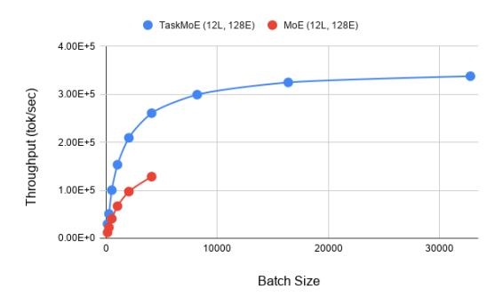

# 4.4 Comparison of Extracting Task MoE Models to Distillation

While in Section 4.3 we compared the throughput of task-level MoE and token-level MoE models, it is common practice for large models to be distilled to smaller student models suitable for deployment.

We distill our token-level MoE baseline to Transformer-Base student models with the same architecture as the multlingual dense baseline discussed in 4.1. As done in (Fedus et al., 2021), we initialize the student model with non-expert weights of the teacher model. We distill the model with the source sides of the WMT parallel data used while training the original teacher model. We do this for several language pairs across different language families and resource sizes - EnFr, FrEn, DeEn, EnDe, EnRo, RoEn, EnHi and HiEn. Additional training details are provided in the Appendix A.1.

In Table 2, we compare the BLEU scores of our best performing Task MoE models to distillation of our Token MoE baseline into models with similar inference cost (shown in Figure 2). We see that distillation consistently underperforms our best-performing Task MoE model - distillation from Token MoE achieves an average BLEU score of

26.9, while our best-performing Task MoE model has an average BLEU score of 29.0 (+2.1 BLEU) for these language pairs. We note that while distilling our sparse MoE model, only 32.25% of gains over dense multilingual baselines are preserved. This is in line with the distillation results discussed in (Fedus et al., 2021).

#### 5 Scaling up to 200 Language Pairs

We now scale our results up to a larger internal dataset with over 200 language pairs, while also scaling the number of parameters to beyond 10 billion weights. In addition, we look more closely at the gating decisions made by these sparse models and discuss their implications.

#### 5.1 Experimental Setup

**Data:** We use an in-house training corpus generated by crawling and extracting parallel sentences from the web (Uszkoreit et al., 2010). This dataset has 204 direct language pairs (102 languages to and from English), with a total of 25 billion sentence pairs. This dataset covers a diverse range of domains and languages, and is quite noisy. There is also a heavy imbalance when it comes to the number of examples available per language pair, ranging between 104 and 109 sentence pairs. In order to record gating decisions while controlling for semantics, we created a multi-way aligned evaluation set containing nearly 3k sentence pairs for all languages.1

**Model:** We use the 473M Transformer Big (Vaswani et al., 2017) architecture (or modified versions of it in the case of sparse models) as described by (Chen et al., 2018) for this set of experiments. Similar to Section 4.1, we (1) share all parameters across language pairs including softmax layer

&lt;sup>1Each sentence in our evaluation set is semantically identical across all other languages.

(a) Performance of different routing strategies on *Xx-En* language pairs.

(b) Performance of different routing strategies on *En-Xx* language pairs.

Figure 3: Comparing the performance of different routing strategies for Mixture-of-Experts (MoE) models on a massively multilingual dataset – We compare routing experts by tokens, and tasks (using either language pairs or target languages). Given that routing by token on the encoder and routing by task on the decoder performed the best on WMT (Table [1\)](#page-4-1), we use those settings for the scaled up 128 expert models we compare. We split the comparison of results into (a) *Xx-En* language pairs and (b) *En-Xx* language pairs. The languages on the x-axis are sorted left-to-right in descending order of resource size. Best seen in color. Note that the token-level MoE has 6.5B parameters in the decoders while our task-level MoE has only 200M.

and input/output word embeddings, (2) pre-pend a <2xx> token to the source sentence to indicate the target language and (3) use a Sentence Piece Model [\(Kudo and Richardson,](#page-10-15) [2018\)](#page-10-15) with 64k tokens vocabulary shared on both the encoder and decoder side.We followed the training and architecture as shown in [Lepikhin et al.](#page-10-1) [\(2020\)](#page-10-1).[2](#page-6-1)

### 5.2 Results

We compare Task-level MoEs and Token-level MoEs to their bilingual and multilingual baselines in Figure 2. We train 128 expert MoE models with routing in these settings: (1) Routing by token on both the encoder and decoder, (2) Routing by token on the encoder and by target language on the decoder and (3) Routing by token on the encoder and by language pair on the decoder.

We find that these scaled up sparse models perform better than their dense baselines, with hybrid task-level routing performing slightly better on *En-Xx* language pairs and pure token-level routing performing slightly better on *Xx-En* language pairs. We hypothesize that for the *Xx-En* tasks, not explicitly dividing expert parameters by tasks on the decoder results in better transfer, thus explaining the better performance of token-level routing. This suggests that a hybrid strategy that partially restricts access to experts based on task-boundaries, while still permitting routing by tokens, might provide the right balance between efficiency and quality.

We also note that while both forms of routing have 13B parameters (6.5B on decoder) at train time, token level routing only on the decoder uses only 200M parameters at inference time, in addition to the practical considerations discussed in Section [3.1.](#page-2-1) We provide aggregate BLEU scores in Appendix [A.6](#page-12-0) and parameter count breakdowns in Appendix [A.5.](#page-12-1) In addition, we take a closer look at routing decisions made for different languages by the model in Section [5.4.](#page-7-0)

### 5.3 Comparison of Throughput on Massive Models

Similar to Section [4.3,](#page-4-3) we compare Task-level MoEs with Token-level MoEs in terms of throughput across different batch sizes in Figure [4.](#page-7-1) We decode the WMT14 English-German test set with our TaskMoE model and with the baseline Token-MoE model on 128 Cloud TPU V3 cores. We find that our Task-MoE model has 2.6 times higher peak throughput while using 32.34 times less decoder parameters (201M vs 6.5B). Moreover, our Task-MoE model has minimal communication overhead compared to decoding with Token-MoE (0.2% versus 36% of step time).

2As opposed to displaying BLEU scores for each language pair, we place the baselines on the x-axis at zero and report the ∆BLEU trendline of each model we consider. In order to set these bilingual baselines, we train Neural Machine Translation models for each language pair (e.g. a single model for Germanto-English), tuned depending on the available training data for

that given language We tuned batch-size and different values of regularization methods (e.g. dropout) in a Transformer-Big or Transformer-Base layout, for high or low-resourced languages respectively.

Figure 4: Inference cost analysis: We measure the throughput of our Task-MoE model and baseline Token-MoE model across batch sizes and see that the peak throughput of Task-MoE is 2.6 times higher.

#### 5.4 A Closer Look at the Routing Decisions

Now, we analyze the routing decisions made in token-level MoE models to further motivate our investigation. We take a token-level MoE model trained on the massively multilingual dataset and decode these models on the multiway test-sets, while logging routing decisions for every token. We plot the top expert distributions of several tasks with different scripts and language families in Figure [5.](#page-8-0) For clarity, and because these two groups of languages behave differently in a multilingual setting, we split the gating decisions into those for *Xx-En* and *En-Xx* language pairs. In the encoder (Figure 5a), tokens from all tasks (*Xx-En*) seem to prefer the same set of few experts slightly over the others. On the other hand, in the decoder (Figure 5b) each task seems to have a slight preference for a few experts over the others. Moreover, the set of experts appears to be similar for related languages. For example, English-Spanish and English-Catalan (two Romance Languages) have similar expert distributions and so do English-Russian and English-Ukranian (two Slavic Languages). In the Appendix [A.7,](#page-12-2) we provide expert distribution plots for other layers of this model. In addition, we provide expert distributions of the MoE model that routes tokens by target language discussed in Section [3.](#page-6-2)

Our analysis suggest that, when using tokenlevel routing, task-level decisions emerge naturally in the decoder, providing additional motivation for our proposed routing strategies.

## 6 Related Work

Conditional Computation: Conditional computation [\(Bengio et al.,](#page-9-11) [2015\)](#page-9-11), or routing examples through the neural network by activating only a

sub-network of the network depending on the input has seen success in large scale natural language processing (NLP) ([\(Shazeer et al.,](#page-10-2) [2017;](#page-10-2) [Lepikhin](#page-10-1) [et al.,](#page-10-1) [2020;](#page-10-1) [Bapna et al.,](#page-9-12) [2019\)](#page-9-12)) and computer vision ([\(Yang et al.,](#page-11-6) [2019\)](#page-11-6)) tasks. A variety of strategies can be used to route examples such as learning a function on the input [\(Shazeer et al.,](#page-10-2) [2017;](#page-10-2) [Lep](#page-10-1)[ikhin et al.,](#page-10-1) [2020\)](#page-10-1), computational budget [\(Bapna](#page-9-12) [et al.,](#page-9-12) [2019;](#page-9-12) [Elbayad et al.,](#page-9-13) [2019\)](#page-9-13) or simplifying the expert allocation and training regimen [\(Lewis](#page-10-17) [et al.,](#page-10-17) [2021;](#page-10-17) [Fedus et al.,](#page-9-6) [2021\)](#page-9-6).

Multi-task Learning Multi-task Learning improves model performance across all tasks trained on due to regularization and positive transfer between related tasks [\(Caruana,](#page-9-14) [1997\)](#page-9-14). Here, subnetworks are be activated depending on the task to which the input belongs - some of these parameters may be shared. This approach has seen success in a variety of domains such as classification, recommender systems and NLP ([\(Ma et al.,](#page-10-18) [2019,](#page-10-18) [2018;](#page-10-19) [Clark et al.,](#page-9-15) [2019;](#page-9-15) [Collobert and Weston,](#page-9-16) [2008;](#page-9-16) [Ruder et al.,](#page-10-20) [2019;](#page-10-20) [Tan et al.,](#page-10-7) [2019\)](#page-10-7)). Like our work, some of these models have been designed with inference benefits in mind ([\(Ma et al.,](#page-10-18) [2019\)](#page-10-18)). In this work we focus on multi-task learning in the case of Multilingual NMT.

Multi-task learning for Multilingual NMT Models: Multi-task learning in multilingual models has been well-studied: while complete parameter sharing is simple and works well ([\(Johnson](#page-9-10) [et al.,](#page-9-10) [2017\)](#page-9-10)), an optimal strategy for sharing parameters and possibly having languages-specific parameters would maximize transfer while minimizing interference [\(Hokamp et al.,](#page-9-17) [2019\)](#page-9-17). Strategies involve allocating language specific hidden states, attention modules, decoders or additional specialized layers ([\(Hokamp et al.,](#page-9-17) [2019;](#page-9-17) [Wang](#page-10-21) [et al.,](#page-10-21) [2018;](#page-10-21) [Gu et al.,](#page-9-18) [2018;](#page-9-18) [Bapna et al.,](#page-9-12) [2019\)](#page-9-12)). In addition some strategies involve grouping parameters by language group [\(Fan et al.,](#page-9-19) [2020;](#page-9-19) [Tan et al.,](#page-10-7) [2019\)](#page-10-7). Compared to these works, our approach to parameter sharing is designed to scale models without impacting inference efficiency (as opposed to simply adding language-specific capacity) while still enjoying the benefits of scaling. Most similar to our work in terms of the inference utility is proposed by [\(Li et al.,](#page-10-22) [2020\)](#page-10-22) where discrete latent variables used to learn language specific layer combinations, whereas in our study we focus on improving inference efficiency of mixture of expert

(b) Gating decisions of the last layer of the decoder for En-Xx language pairs.

Figure 5: We record the gating decisions of our MoE model trained on internal data on a multiway parallel dataset. The darker a cell, corresponding to, say en-sr and the 37th expert, the more the expert is used. In (a) the encoder, tokens from all tasks (*Xx-En*) seem to prefer the same set of few experts slightly over the others; while in (b) the decoder each task (*En-Xx*) seems to slightly prefer a few experts over the other. Moreover, the set of experts appears to be similar for related languages. For example, English-Spanish and English-Catalan (two Romance Languages) have similar expert distributions and so do English-Russian and English-Ukranian (two Slavic Languages).

models at scale.

