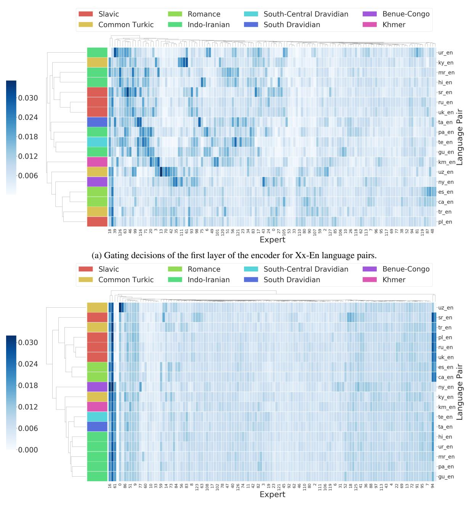
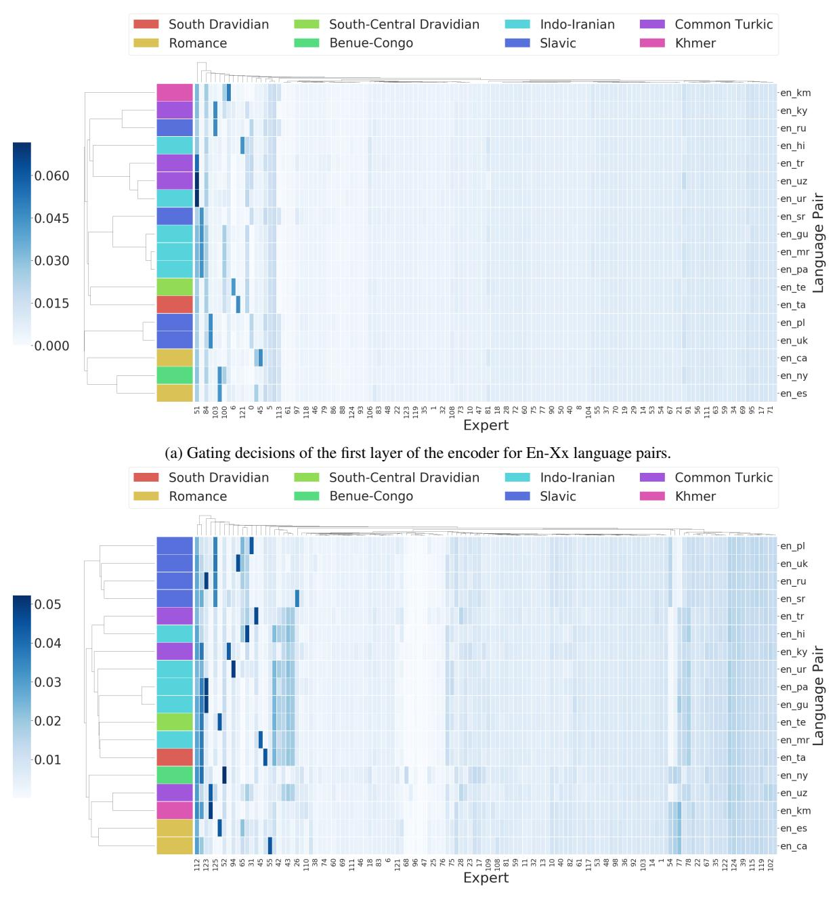

# 7 Conclusions

In this work we discussed more inference friendly algorithms for routing examples in multilingual Sparse Mixture-of-Experts models by making use of task boundaries. We empirically demonstrated that this new algorithm performs as well as, or better than, conventional token-based routing algorithms on two different datasets: a multilingual WMT setup covering 30 language pairs and a large internal dataset covering 200 language pairs, in terms of machine translation quality evaluated with BLEU. By carefully comparing inference throughput across different routing approaches and distilled models, we demonstrated the superiority of

task-based routing algorithms over either serving a token-based MoE model as-is (in terms of peak throughput) and over distilling a large MoE model into a smaller dense model (in terms of BLEU).

We conclude by highlighting that algorithms that are more inference friendly while retaining the quality gains of MoE models are a promising direction for future exploration, motivating research on *inference efficiency* for large models. Although we studied some hybrid routing strategies where encoder and decoder networks utilize different routing schemes, we believe that future research on more granular routing hybrids or hierarchical variants will deliver more gains and advance our understanding of large scale, sparsely gated, massively multi-task networks.

#### 8 Acknowledgements

We would like to thank Wolfgang Macherey, Yuanzhong Xu and Macduff Richard Hughes for their helpful feedback on the draft. We would also like to thank the Google Translate and Google Brain teams for their useful input and discussions, and the entire GShard development team for their foundational contributions to this project. In addition, we thank the anonymous reviewers for their insightful comments.

#### References

- Naveen Arivazhagan, Ankur Bapna, Orhan Firat, Dmitry Lepikhin, Melvin Johnson, Maxim Krikun, Mia Xu Chen, Yuan Cao, George Foster, Colin Cherry, Wolfgang Macherey, Zhifeng Chen, and Yonghui Wu. 2019. [Massively multilingual neural](http://arxiv.org/abs/1907.05019) [machine translation in the wild: Findings and chal](http://arxiv.org/abs/1907.05019)[lenges.](http://arxiv.org/abs/1907.05019)
- Timothy T Baldwin and J Kevin Ford. 1988. Transfer of training: A review and directions for future research. *Personnel psychology*, 41(1):63–105.
- Ankur Bapna, Naveen Arivazhagan, and Orhan Firat. 2019. Simple, scalable adaptation for neural machine translation. *arXiv preprint arXiv:1909.08478*.
- Emmanuel Bengio, Pierre-Luc Bacon, Joelle Pineau, and Doina Precup. 2015. Conditional computation in neural networks for faster models. *arXiv preprint arXiv:1511.06297*.
- Nikolay Bogoychev and Rico Sennrich. 2019. [Domain,](http://arxiv.org/abs/1911.03362) [translationese and noise in synthetic data for neural](http://arxiv.org/abs/1911.03362) [machine translation.](http://arxiv.org/abs/1911.03362)
- Tom B Brown, Benjamin Mann, Nick Ryder, Melanie Subbiah, Jared Kaplan, Prafulla Dhariwal, Arvind Neelakantan, Pranav Shyam, Girish Sastry, Amanda Askell, et al. 2020. Language models are few-shot learners. *arXiv preprint arXiv:2005.14165*.
- Rich Caruana. 1997. Multitask learning. *Machine learning*, 28(1):41–75.
- Mia Xu Chen, Orhan Firat, Ankur Bapna, Melvin Johnson, Wolfgang Macherey, George Foster, Llion Jones, Mike Schuster, Noam Shazeer, Niki Parmar, Ashish Vaswani, Jakob Uszkoreit, Lukasz Kaiser, Zhifeng Chen, Yonghui Wu, and Macduff Hughes. 2018. [The best of both worlds: Combining recent](http://www.aclweb.org/anthology/P18-1008) [advances in neural machine translation.](http://www.aclweb.org/anthology/P18-1008) In *Proceedings of the 56th Annual Meeting of the Association for Computational Linguistics (Volume 1: Long Papers)*, pages 76–86, Melbourne, Australia. Association for Computational Linguistics.
- Yu Cheng, Duo Wang, Pan Zhou, and Tao Zhang. 2017. A survey of model compression and acceleration for deep neural networks. *arXiv preprint arXiv:1710.09282*.

- Kevin Clark, Minh-Thang Luong, Urvashi Khandelwal, Christopher D Manning, and Quoc V Le. 2019. Bam! born-again multi-task networks for natural language understanding. *arXiv preprint arXiv:1907.04829*.
- Ronan Collobert and Jason Weston. 2008. A unified architecture for natural language processing: Deep neural networks with multitask learning. In *Proceedings of the 25th international conference on Machine learning*, pages 160–167.
- Maha Elbayad, Jiatao Gu, Edouard Grave, and Michael Auli. 2019. Depth-adaptive transformer. *arXiv preprint arXiv:1910.10073*.
- Angela Fan, Shruti Bhosale, Holger Schwenk, Zhiyi Ma, Ahmed El-Kishky, Siddharth Goyal, Mandeep Baines, Onur Celebi, Guillaume Wenzek, Vishrav Chaudhary, et al. 2020. Beyond english-centric multilingual machine translation. *arXiv preprint arXiv:2010.11125*.
- William Fedus, Barret Zoph, and Noam Shazeer. 2021. [Switch transformers: Scaling to trillion parameter](http://arxiv.org/abs/2101.03961) [models with simple and efficient sparsity.](http://arxiv.org/abs/2101.03961) *CoRR*, abs/2101.03961.
- Markus Freitag, Isaac Caswell, and Scott Roy. 2019. [APE at scale and its implications on MT evaluation](https://doi.org/10.18653/v1/W19-5204) [biases.](https://doi.org/10.18653/v1/W19-5204) In *Proceedings of the Fourth Conference on Machine Translation (Volume 1: Research Papers)*, pages 34–44, Florence, Italy. Association for Computational Linguistics.
- Jiatao Gu, Hany Hassan, Jacob Devlin, and Victor OK Li. 2018. Universal neural machine translation for extremely low resource languages. *arXiv preprint arXiv:1802.05368*.
- Geoffrey Hinton, Oriol Vinyals, and Jeff Dean. 2015. Distilling the knowledge in a neural network. *arXiv preprint arXiv:1503.02531*.
- Chris Hokamp, John Glover, and Demian Gholipour. 2019. Evaluating the supervised and zero-shot performance of multi-lingual translation models. *arXiv preprint arXiv:1906.09675*.
- Yanping Huang, Youlong Cheng, Ankur Bapna, Orhan Firat, Dehao Chen, Mia Chen, HyoukJoong Lee, Jiquan Ngiam, Quoc V Le, Yonghui Wu, et al. 2019. Gpipe: Efficient training of giant neural networks using pipeline parallelism. In *Advances in neural information processing systems*, pages 103–112.
- Melvin Johnson, Mike Schuster, Quoc V Le, Maxim Krikun, Yonghui Wu, Zhifeng Chen, Nikhil Thorat, Fernanda Viégas, Martin Wattenberg, Greg Corrado, et al. 2017. Google's multilingual neural machine translation system: Enabling zero-shot translation. *Transactions of the Association for Computational Linguistics*, 5:339–351.

- Jungo Kasai, Nikolaos Pappas, Hao Peng, James Cross, and Noah A Smith. 2020. Deep encoder, shallow decoder: Reevaluating the speed-quality tradeoff in machine translation. *arXiv preprint arXiv:2006.10369*.
- Yoon Kim and Alexander M. Rush. 2016. [Sequence](https://doi.org/10.18653/v1/D16-1139)[level knowledge distillation.](https://doi.org/10.18653/v1/D16-1139) In *Proceedings of the 2016 Conference on Empirical Methods in Natural Language Processing*, pages 1317–1327, Austin, Texas. Association for Computational Linguistics.
- Xiang Kong, Adithya Renduchintala, James Cross, Yuqing Tang, Jiatao Gu, and Xian Li. 2021. Multilingual neural machine translation with deep encoder and multiple shallow decoders. In *Proceedings of the 16th Conference of the European Chapter of the Association for Computational Linguistics: Main Volume*, pages 1613–1624.
- Taku Kudo and John Richardson. 2018. Sentencepiece: A simple and language independent subword tokenizer and detokenizer for neural text processing. *arXiv preprint arXiv:1808.06226*.
- Sneha Reddy Kudugunta, Ankur Bapna, Isaac Caswell, Naveen Arivazhagan, and Orhan Firat. 2019. Investigating multilingual nmt representations at scale. *arXiv preprint arXiv:1909.02197*.
- Dmitry Lepikhin, HyoukJoong Lee, Yuanzhong Xu, Dehao Chen, Orhan Firat, Yanping Huang, Maxim Krikun, Noam Shazeer, and Zhifeng Chen. 2020. Gshard: Scaling giant models with conditional computation and automatic sharding. *arXiv preprint arXiv:2006.16668*.
- Mike Lewis, Shruti Bhosale, Tim Dettmers, Naman Goyal, and Luke Zettlemoyer. 2021. [BASE layers:](http://arxiv.org/abs/2103.16716) [Simplifying training of large, sparse models.](http://arxiv.org/abs/2103.16716) *CoRR*, abs/2103.16716.
- Xian Li, Asa Cooper Stickland, Yuqing Tang, and Xiang Kong. 2020. Deep transformers with latent depth. *arXiv preprint arXiv:2009.13102*.
- Jiaqi Ma, Zhe Zhao, Jilin Chen, Ang Li, Lichan Hong, and Ed H Chi. 2019. Snr: Sub-network routing for flexible parameter sharing in multi-task learning. In *Proceedings of the AAAI Conference on Artificial Intelligence*, volume 33, pages 216–223.
- Jiaqi Ma, Zhe Zhao, Xinyang Yi, Jilin Chen, Lichan Hong, and Ed H Chi. 2018. Modeling task relationships in multi-task learning with multi-gate mixture-of-experts. In *Proceedings of the 24th ACM SIGKDD International Conference on Knowledge Discovery & Data Mining*, pages 1930–1939.
- Robert Östling and Jörg Tiedemann. 2016. Continuous multilinguality with language vectors. *arXiv preprint arXiv:1612.07486*.
- Matt Post. 2018. [A call for clarity in reporting BLEU](https://www.aclweb.org/anthology/W18-6319) [scores.](https://www.aclweb.org/anthology/W18-6319) In *Proceedings of the Third Conference on*

- *Machine Translation: Research Papers*, pages 186– 191, Belgium, Brussels. Association for Computational Linguistics.
- Colin Raffel, Noam Shazeer, Adam Roberts, Katherine Lee, Sharan Narang, Michael Matena, Yanqi Zhou, Wei Li, and Peter J Liu. 2019. Exploring the limits of transfer learning with a unified text-to-text transformer. *arXiv preprint arXiv:1910.10683*.
- Maksim Riabinin and Anton Gusev. 2020. Learning@ home: Crowdsourced training of large neural networks using decentralized mixture-of-experts. *arXiv preprint arXiv:2002.04013*.
- Sebastian Ruder, Joachim Bingel, Isabelle Augenstein, and Anders Søgaard. 2019. Latent multi-task architecture learning. In *Proceedings of the AAAI Conference on Artificial Intelligence*, volume 33, pages 4822–4829.
- Noam Shazeer, Azalia Mirhoseini, Krzysztof Maziarz, Andy Davis, Quoc Le, Geoffrey Hinton, and Jeff Dean. 2017. Outrageously large neural networks: The sparsely-gated mixture-of-experts layer. *arXiv preprint arXiv:1701.06538*.
- Noam Shazeer and Mitchell Stern. 2018. Adafactor: Adaptive learning rates with sublinear memory cost. *arXiv preprint arXiv:1804.04235*.
- Aditya Siddhant, Ankur Bapna, Yuan Cao, Orhan Firat, Mia Chen, Sneha Kudugunta, Naveen Arivazhagan, and Yonghui Wu. 2020. Leveraging monolingual data with self-supervision for multilingual neural machine translation. *arXiv preprint arXiv:2005.04816*.
- Xu Tan, Yi Ren, Di He, Tao Qin, Zhou Zhao, and Tie-Yan Liu. 2019. Multilingual neural machine translation with knowledge distillation. *arXiv preprint arXiv:1902.10461*.
- Jörg Tiedemann. 2018. Emerging language spaces learned from massively multilingual corpora. *arXiv preprint arXiv:1802.00273*.
- Jakob Uszkoreit, Jay M Ponte, Ashok C Popat, and Moshe Dubiner. 2010. Large scale parallel document mining for machine translation. In *Proceedings of the 23rd International Conference on Computational Linguistics*, pages 1101–1109. Association for Computational Linguistics.
- Ashish Vaswani, Noam Shazeer, Niki Parmar, Jakob Uszkoreit, Llion Jones, Aidan N Gomez, Łukasz Kaiser, and Illia Polosukhin. 2017. Attention is all you need. In *Advances in Neural Information Processing Systems*, pages 5998–6008.
- Yining Wang, Jiajun Zhang, Feifei Zhai, Jingfang Xu, and Chengqing Zong. 2018. Three strategies to improve one-to-many multilingual translation. In *Proceedings of the 2018 Conference on Empirical Methods in Natural Language Processing*, pages 2955– 2960.

Shijie Wu and Mark Dredze. 2019. Beto, bentz, becas: The surprising cross-lingual effectiveness of bert. *arXiv preprint arXiv:1904.09077*.

Brandon Yang, Gabriel Bender, Quoc V Le, and Jiquan Ngiam. 2019. Condconv: Conditionally parameterized convolutions for efficient inference. In *Advances in Neural Information Processing Systems*, pages 1307–1318.

Biao Zhang, Ankur Bapna, Rico Sennrich, and Orhan Firat. 2021. [Share or not? learning to schedule](https://openreview.net/forum?id=Wj4ODo0uyCF) [language-specific capacity for multilingual transla](https://openreview.net/forum?id=Wj4ODo0uyCF)[tion.](https://openreview.net/forum?id=Wj4ODo0uyCF) In *International Conference on Learning Representations*.

Biao Zhang, Philip Williams, Ivan Titov, and Rico Sennrich. 2020. Improving massively multilingual neural machine translation and zero-shot translation. *arXiv preprint arXiv:2004.11867*.

#### A Appendix

#### A.1 WMT Model and Training Details

For our experiments, we use the Transformer Base model in [\(Chen et al.,](#page-9-2) [2018\)](#page-9-2), The sole difference is that we use a 64k vocabulary: our model therefore contains 142M parameters. For multilingual models, we share all parameters across language pairs including softmax layer in input/output word embeddings.

We use a 64k token vocabulary formed using a Sentence Piece Model [\(Kudo and Richardson,](#page-10-15) [2018\)](#page-10-15). The vocabulary is shared on both the encoder and decoder side. To learn a joint SPM model given our imbalanced dataset, we followed the temperature based sampling strategy with a temperature of T = 5.

Finally, our models are optimized using the Adafactor optimizer [\(Shazeer and Stern,](#page-10-13) [2018\)](#page-10-13) with momentum factorization and a per-parameter norm clipping threshold of 1.0. We followed a learning rate of of 3.0, with 40K warm-up steps for the schedule, which is decayed with the inverse square root of the number of training steps after warm-up. BLEU scores presented in this paper are calculated using SacreBLEU [\(Post,](#page-10-14) [2018\)](#page-10-14) on the WMT test sets. [3](#page-11-7)

For distillation, training and model details are identical apart from a reduced learning rate of 0.2.

### A.2 WMT Dataset Details

In Table [3](#page-19-0) we provide the training set details for the WMT [4](#page-11-8) setup we use [\(Siddhant et al.,](#page-10-12) [2020\)](#page-10-12). We provide the data sizes and WMT years of the Train, Dev and Test sets we use.

## A.3 Individual WMT BLEU Scores

Bilingual baselines: We first train Transformer Base and Big models on each language pair. The results are in Table [4.](#page-19-1)

In Tables 5 and 6 we provide individual BLEU scores of the models discussed in Table [1.](#page-4-1)

### A.4 Detailed Breakdown of Parameter Counts on WMT

Table 7 describes the parameter counts of different parts of the Transformers compared in Table [1.](#page-4-1)

3 BLEU+case.mixed+lang.<sl>-<tl>+ numrefs.1+smooth.exp+tok.<tok>+version .1.3.0 , where sl is the source language, tl is the target language and tok = zh if tl = zh and intl otherwise.

4<http://www.statmt.org/wmt20/>

### A.5 Detailed Breakdown of Parameter Counts

In Table 8 we describe the parameter counts of different parts of the Transformers discussed in Section [5.](#page-5-0)

#### A.6 Results on Large MoE Model

In Table 9 we provide aggregate BLEU scores for the results in Figure [3.](#page-6-2)

## A.7 Gating Decisions for task-level and token-level MoEs

In this section, we show the top expert distributions of different layers of the position-wise MoE model discussed in Section [5.4](#page-7-0) in Figures 6, 7, 8 and 9.

We also show expert distributions on MoE model routing by target language from EnX that was introduced in Section [5.2](#page-6-0) in Figures 10 and 11. We omit results on XEn language pairs because they belong to the same task in the context of this model.

(b) Gating decisions of the last layer of the encoder for Xx-En language pairs.

Figure 6: Gating decisions of the encoder of the position-wise MoE model on Xx-En language pairs, trained on internal data on a multiway parallel dataset. In this diagram, the darker a cell, corresponding to, say en-sr and the 37th expert, the more the expert is used. In both the last layer of the encoder and decoder, the tokens from each language are fairly well distributed across experts. In (a) the first layer of the encoder, there does not seem to be any major pattern in the expert distribution whereas in (b) the last layer of the encoder, tokens from all tasks (*Xx-En*) seem to prefer the same set of few experts slightly over the others.

(b) Gating decisions of the last layer of the decoder for Xx-En language pairs.

Figure 7: Gating decisions of the decoder of the position-wise MoE model on Xx-En language pairs, trained on internal data on a multiway parallel dataset. In this diagram, the darker a cell, corresponding to, say en-sr and the 37th expert, the more the expert is used. In both the first and last layer of the decoder, the tokens from each language are fairly well distributed across experts. In fact, tokens from all tasks (*Xx-En*) seem to prefer the same set of few experts slightly over the others.

(b) Gating decisions of the last layer of the encoder for En-Xx language pairs.

Figure 8: Gating decisions of the encoder of the position-wise MoE model on En-Xx language pairs, trained on internal data on a multiway parallel dataset. In this diagram, the darker a cell, corresponding to, say en-sr and the 37th expert, the more the expert is used. In both the first and last layer of the encoder, the tokens from each language are fairly well distributed across experts. Each task (*En-Xx*) seems to slightly prefer a few experts over the other.

(b) Gating decisions of the last layer of the decoder for En-Xx language pairs.

Figure 9: Gating decisions of the decoder of the position-wise MoE model on En-Xx language pairs, trained on internal data on a multiway parallel dataset. In this diagram, the darker a cell, corresponding to, say en-sr and the 37th expert, the more the expert is used. In both the first and last layer of the decoder, the tokens from each language are fairly well distributed across experts. Each task (*En-Xx*) seems to slightly prefer a few experts over the other. Moreover, the set of experts appears to be similar for related languages. For example, English-Spanish and English-Catalan (two Romance Languages) have similar expert distributions and so do English-Russian and English-Ukranian (two Slavic Languages).

(b) Gating decisions of the last layer of the encoder for En-Xx language pairs.

Figure 10: Gating decisions of the encoder of the target language-wise MoE model on En-Xx language pairs, trained on internal data on a multiway parallel dataset. In this diagram, the darker a cell, corresponding to, say en-sr and the 37th expert, the more the expert is used. The encoder behaves similarly to that of the position-wise model: in both the first and last layer of the encoder, the tokens from each language are fairly well distributed across experts. Each task (*En-Xx*) seems to slightly prefer a few experts over the other.

(b) Gating decisions of the last layer of the decoder for En-Xx language pairs.

Figure 11: Gating decisions of the decoder of the target language-wise MoE model on En-Xx language pairs, trained on internal data on a multiway parallel dataset. In this diagram, the darker a cell, corresponding to, say en-sr and the 37th expert, the more the expert is used. There seems to be some amount of expert sharing on a linguistic basis: en-ur, en-te and en-ta (two Dravidian Languages and an Indo-Iranian language) and en-tr, en-uz and en-uk (two Turkic languages and a Slavic language) share an expert. On the other hand, en-es and en-ca (two Romance languages) have different experts.

| Language |        | Data Sources |        | #        | Samples |      |
|----------|--------|--------------|--------|----------|---------|------|
| Pair     | Train  | Dev          | Test   | Train    | Dev     | Test |
| cs→en    | WMT'19 | WMT'17       | WMT'18 | 64336053 | 3005    | 2983 |
| fr→en    | WMT'15 | WMT'13       | WMT'14 | 40449146 | 3000    | 3003 |
| ru→en    | WMT'19 | WMT'18       | WMT'19 | 38492126 | 3000    | 2000 |
| zh→en    | WMT'19 | WMT'18       | WMT'19 | 25986436 | 3981    | 2000 |
| es→en    | WMT'13 | WMT'13       | WMT'13 | 15182374 | 3004    | 3000 |
| fi→en    | WMT'19 | WMT'18       | WMT'19 | 6587448  | 3000    | 1996 |
| de→en    | WMT'14 | WMT'13       | WMT'14 | 4508785  | 3000    | 3003 |
| et→en    | WMT'18 | WMT'18       | WMT'18 | 2175873  | 2000    | 2000 |
| lv→en    | WMT'17 | WMT'17       | WMT'17 | 637599   | 2003    | 2001 |
| lt→en    | WMT'19 | WMT'19       | WMT'19 | 635146   | 2000    | 1000 |
| ro→en    | WMT'16 | WMT'16       | WMT'16 | 610320   | 1999    | 1999 |
| hi→en    | WMT'14 | WMT'14       | WMT'14 | 313748   | 520     | 2507 |
| kk→en    | WMT'19 | WMT'19       | WMT'19 | 222424   | 2066    | 1000 |
| tr→en    | WMT'18 | WMT'17       | WMT'18 | 205756   | 3007    | 3000 |
| gu→en    | WMT'19 | WMT'19       | WMT'19 | 155798   | 1998    | 1016 |
| en→cs    | WMT'19 | WMT'17       | WMT'18 | 64336053 | 3005    | 2983 |
| en→fr    | WMT'15 | WMT'13       | WMT'14 | 40449146 | 3000    | 3003 |
| en→ru    | WMT'19 | WMT'18       | WMT'19 | 38492126 | 3000    | 2000 |
| en→zh    | WMT'19 | WMT'18       | WMT'19 | 25986436 | 3981    | 2000 |
| en→es    | WMT'13 | WMT'13       | WMT'13 | 15182374 | 3004    | 3000 |
| en→fi    | WMT'19 | WMT'18       | WMT'19 | 6587448  | 3000    | 1996 |
| en→de    | WMT'14 | WMT'13       | WMT'14 | 4508785  | 3000    | 3003 |
| en→et    | WMT'18 | WMT'18       | WMT'18 | 2175873  | 2000    | 2000 |
| en→lv    | WMT'17 | WMT'17       | WMT'17 | 637599   | 2003    | 2001 |
| en→lt    | WMT'19 | WMT'19       | WMT'19 | 635146   | 2000    | 1000 |
| en→ro    | WMT'16 | WMT'16       | WMT'16 | 610320   | 1999    | 1999 |
| en→hi    | WMT'14 | WMT'14       | WMT'14 | 313748   | 520     | 2507 |
| en→kk    | WMT'19 | WMT'19       | WMT'19 | 222424   | 2066    | 1000 |
| en→tr    | WMT'18 | WMT'17       | WMT'18 | 205756   | 3007    | 3000 |
| en→gu    | WMT'19 | WMT'19       | WMT'19 | 155798   | 1998    | 1016 |
| fr→de    | WMT'19 | WMT'13       | WMT'13 | 9824476  | 1512    | 1701 |
| de→fr    | WMT'19 | WMT'13       | WMT'13 | 9824476  | 1512    | 1701 |

Table 3: Data sources and number of samples for the parallel data in our corpus. Please note that we don't use parallel data in Fr-De for any of the experiments in the paper.

| xx                     | cs   | fr   | ru   | zh   | es   | fi   | de   | et   | lv   | lt   | ro   | hi  | kk   | tr   | gu  |
|------------------------|------|------|------|------|------|------|------|------|------|------|------|-----|------|------|-----|
| Any-to-English (xx→en) | 31.3 | 37.2 | 36.0 | 21.7 | 32.7 | 27.3 | 31.7 | 23.1 | 15.0 | 21.3 | 30.1 | 8.5 | 11.5 | 15.9 | 1.0 |
| English-to-Any (en→xx) | 23.8 | 41.3 | 26.4 | 31.3 | 31.1 | 18.1 | 29.9 | 18.2 | 14.2 | 11.5 | 23.4 | 4.5 | 1.9  | 13.6 | 0.6 |

Table 4: Bilingual baselines. xx refers to language in the column header. [\(Siddhant et al.,](#page-10-12) [2020\)](#page-10-12)

| Svotem                         | Routing Granularity | ranularity    |       |       |       |       |       |       |       | Ţ     | BLEU  |       |       |       |       |       |       |       |       |
|--------------------------------|---------------------|---------------|-------|-------|-------|-------|-------|-------|-------|-------|-------|-------|-------|-------|-------|-------|-------|-------|-------|
| System                         |                     |               | AVG   | xx2en | en2xx | HRL   | LRL   | cs_en | en_cs | fr_en | en_fr | ru_en | en_ru | zh_en | en_zh | es_en | en_es | de_fr | fr_de |
| Multilingual Transformer-Base  | ı                   |               | 20.03 | 23.69 | 17.5  | 23.25 | 15.88 | 27.2  | 18.1  | 34.1  | 36.1  | 31.7  | 21.1  | 18.9  | 17.2  | 31.3  | 29.2  | 17.4  | 5.5   |
| Multilingual Transformer-Big   |                     | ,             | 23.84 | 26.10 | 22.03 | 27.69 | 18.89 | 31.03 | 23.24 | 37.75 | 40.43 | 35.2  | 25.09 | 20.02 | 25.99 | 33.45 | 32.27 | 20.07 | 20.98 |
| Sentence-level MoE – 32 expert | Sentence            | Sentence      | 19.88 | 24.05 | 16.83 | 22.56 | 14.14 | 27.6  | 18.7  | 34.4  | 36.5  | 32.7  | 15.1  | 20.4  | 7.2   | 31.3  | 30.1  | 13.6  | 9.1   |
| Token-level MoE – 32 experts   | Token               | Token         | 22.58 | 24.91 | 20.35 | 27.49 | 16.28 | 29.8  | 21.8  | 36.4  | 40.1  | 34.6  | 25.7  | 19.9  | 23.7  | 33.9  | 32.8  | 23.9  | 19.9  |
|                                | Language Pair       | Language Pair | 22.04 | 25.43 | 19.5  | 25.57 | 17.5  | 26.8  | 21.7  | 35.4  | 39.2  | 33    | 21    | 22.1  | 17.9  | 32.4  | 32.1  | 12.2  | 19.1  |
|                                | Target              | Target        | 22.88 | 25.63 | 20.19 | 27.21 | 17.3  | 29.1  | 21.7  | 36.1  | 40.2  | 33.8  | 24.7  | 21.9  | 24.8  | 32.6  | 33.1  | 25.8  | 18.8  |
| Took lovel Mot 22 avacants     | Language Pair       | Token         | 22.45 | 25.58 | 20.34 | 26.85 | 16.79 | 30.3  | 21.5  | 36.7  | 40.3  | 34.8  | 25.1  | 21    | 25.9  | 33.6  | 32.4  | 12.9  | 16.6  |
| iask-jevel MOE – 32 experts    | Target              | Token         | 22.33 | 24.47 | 20.44 | 26.82 | 16.55 | 29.4  | 22    | 35.3  | 39.7  | 33.8  | 25.2  | 21    | 26.2  | 32.4  | 32.7  | 22.2  | 18.6  |
|                                | Token               | Language Pair | 23.03 | 26.16 | 20.28 | 27.23 | 17.62 | 30.1  | 23.2  | 37.5  | 39.5  | 35.5  | 21.9  | 21.7  | 15.7  | 34.5  | 33.5  | 20.1  | 20.1  |
|                                | Token               | Target        | 23.62 | 25.95 | 21.09 | 28.48 | 17.37 | 30.5  | 22.5  | 37.1  | 39.9  | 35.4  | 25.6  | 21.4  | 27    | 34.3  | 33.5  | 27.7  | 22.4  |

Table 5: Part 1 of the table with individual BLEU scores for Table1

| Strotom                        | Routing Granularity | ranularity    |             |               |       |       |       |       |       |       | BLEU | EU    |       |       |       |       |       |       |       |       |       |       |
|--------------------------------|---------------------|---------------|-------------|---------------|-------|-------|-------|-------|-------|-------|------|-------|-------|-------|-------|-------|-------|-------|-------|-------|-------|-------|
| 3) stem                        |                     |               | uə_u        | i_en en_fi de | en    | -     | et_en | _     |       | en_lv |      | en_lt | ro_en | en_ro | hi_en | en_hi | kk_en | en_kk | tr_en | en_tr | gu_en | en_gu |
| Multilingual Transformer-Base  |                     |               | 23.9        | 17            |       | H     |       | 16.1  | 17.2  | 14.9  |      | 11.4  | 33.4  | 23.9  | 19.2  | 10.4  | 13.5  | 2.5   | 20.9  | 17.5  | 7.8   | 5.1   |
| Multilingual Transformer-Big   | ,                   |               | 27.89 20.83 |               | 30.72 | 27.37 | 28.49 | 17.59 | 20.32 | 17.76 | 26.1 | 26.1  | 35.84 | 26.83 | 20.87 | 14.61 | 10.4  | 5.23  | 22.69 | 19.44 | 10.68 | 7.67  |
| Sentence-level MoE – 32 expert | Sentence            | Sentence 23.5 | 17.2        | 29.4          | 21.8  |       |       | 17.9  | 14.7  | 24.6  | 11.6 | 33.6  | 24.8  | 20.5  | 12.2  | 14    | 2.9   | 21.4  | 17.9  | 7.4   | 6.3   |       |
| Token-level MoE – 32 experts   | Token               | Token         | 27.3        | 20.2          | 31.2  | 26.7  | 27    | 19.9  | 18.7  | 17    | 23.7 | 13.9  | 33.7  | 26.5  | 8.61  | 11.5  | 8.5   | 2.4   | 20.3  | 18    | 8.8   | 5.1   |
|                                | Language Pair       | Language Pair | 25.2        | 20.1          | 31.3  | 56.9  | 24.7  | 19.2  | 18.4  | 16.3  | 25.1 | 13.6  | 34.8  | 25.7  | 22.5  | 13.1  | 15    | 2.4   | 23.4  | 18.2  | 11.4  | 5.1   |
|                                | Target              | Target        | 25.6        | 19.5          | 30.7  | 8.92  | 24.8  | 19.8  | 18.4  | 15.7  | 25.9 | 13.6  | 34.9  | 25.8  | 21.7  | 12.3  | 15.5  | 2.4   | 22.5  | 17.7  | 11    | 4.8   |
| Tools Lorred Mod 32 greater    | Language Pair       | Token         | 26.7        | 20            | 32.2  | 56.9  | 8.97  | 19.6  | 18.9  | 16.3  | 25.1 | 13.3  | 34.2  | 25.8  | 21.1  | 12.6  | 12.6  | 2.3   | 21.7  | 18.4  | ∞     | 4.7   |
| Task-level MOE = 32 experts    | Target              | Token         | 23.7        | 8.61          | 30.7  | 26.1  | 24.1  | 19.9  | 18    | 16.5  | 24.4 | 13.6  | 33.1  | 26.1  | 20    | 12.7  | 12.7  | 5.9   | 21.1  | 18.2  | 7.4   | S     |
|                                | Token               | Language Pair | 27.8        | 21.1          | 32.3  | 27    | 27.6  | 21    | 19.8  | 17.2  | 56   | 14.6  | 36.4  | 26.8  | 20.4  | 14.2  | 12.3  | 3.3   | 21.5  | 19.4  | 6     | 5.8   |
|                                | Token               | Target        | 27.9        | 20.5          | 32    | 27.1  | 27.3  | 20.5  | 19.4  | 17.6  | 25.9 | 14.4  | 36.2  | 56.6  | 20.1  | 13.3  | 11.6  | 3     | 21.2  | 19.2  | 6     | 5.7   |

Table 6: Part 2 of the table with individual BLEU scores for Table1

| Cyclom                         | Routing Granularit | ranularity    |            | No. of   | No. of Parameters | S    |        | Effective | n(params) | Effective n(params) at inference time |
|--------------------------------|--------------------|---------------|------------|----------|-------------------|------|--------|-----------|-----------|---------------------------------------|
| System                         | Encoder            | Decoder       | Vocabulary | Encoder  | Decoder           |      | Total  | Encoder   | Decoder   | Total                                 |
| Multilingual Transformer-Base  | ı                  | 1             | 33M        | 19M      | 25M               | 65M  | 142M   | 19M       | 25M       | 142M                                  |
| Token-level MoE – 32 experts   | Token              | Token         |            |          |                   |      |        | 214M      | 221M      | 533M                                  |
| Sentence-level MoE – 32 expert | Sentence           | Sentence      |            |          |                   |      |        | 214M      | 221M      | 533M                                  |
|                                | Language Pair      | Language Pair |            |          |                   |      |        | 25M       | 32M       | 155M                                  |
|                                | Target             | Target        | 2274       | 2144     | 77176             | 1127 | 5227A  | 25M       | 32M       | 155M                                  |
| Tools long Mot                 | Language Pair      | Token         | MICC       | 7 14 IVI | WI 777            | MICO | JAICCC | 214M      | 25M       | 338M                                  |
| iask-level Mod – 32 expelts    | Target             | Token         |            |          |                   |      |        | 214M      | 25M       | 338M                                  |
|                                | Token              | Language Pair |            |          |                   |      |        | 19M       | 221M      | 338M                                  |
|                                | Token              | Target        |            |          |                   |      |        | 19M       | 221M      | 338M                                  |

Table 7: We break down the parameter counts of the models we compare in Section 4.2 by components.

| Syctom                        | Routing ( | Routing Granularity |            | No. of Parameters | ameters         |         | Effectiv | ve n(param    | Effective n(params) at inference time |       |
|-------------------------------|-----------|---------------------|------------|-------------------|-----------------|---------|----------|---------------|---------------------------------------|-------|
|                               | Encoder   | Encoder Decoder     | Vocabulary | Encoder           | Encoder Decoder | Softmax | Total    | Fotal Encoder | Decoder                               | Total |
| Multilingual Transformer-Big  |           | 1                   |            | 126M              | 151M            |         | 473M     | 126M          | 151M                                  | 473M  |
| Token-level MoE – 128 experts | Token     | Token               | 1427       | 6.5B              | 6.5B            | 12114   | 13B      | 6.5B          | 6.5B                                  | 13.3B |
| Task-level MoE – 128 experts  | Token     | Language            | IMICO      | 6.5B              | 6.5B            | IMICI   | 13B      | 6.5B          | 201M                                  | 6.9B  |
| Task-level MoE – 128 experts  | Token     | Target              |            | 6.5B              | 6.5B            |         | 13B      | 6.5B          | 201M                                  | 6.9B  |

Table 8: We break down the parameter counts of the models we compare in Section 5.2 by components.

| Suctom                        | Routing ( | Routing Granularity |       |       |       |               |              | BLEU         |               |              |              |
|-------------------------------|-----------|---------------------|-------|-------|-------|---------------|--------------|--------------|---------------|--------------|--------------|
| System                        | Encoder   | Encoder Decoder     | AVG   | En-X  | X-En  | High-25 (EnX) | Mid 52 (EnX) | Low 25 (Enx) | High-25 (XEn) | Mid 52 (XEn) | Low 25 (XEn) |
| Multilingual Transformer-Big  |           | 1                   | 24.49 | 18.61 | 30.37 | 28.03         | 16.9         | 12.75        | 33.84         | 30.23        | 26.96        |
| Token-level MoE – 128 experts | Token     | Token               | 28.37 | 20.51 | 36.26 | 30.99         | 18.94        | 13.33        | 40.14         | 36.74        | 31.03        |
| Task-level MoE – 128 experts  | Token     | Language            | 28.09 | 20.66 | 35.52 | 31.21         | 19.17        | 13.28        | 39.69         | 36.42        | 29.16        |
| Task-level MoE – 128 experts  | Token     | Target              | 27.83 | 20.76 | 34.90 | 31.05         | 19.23        | 13.68        | 38.88         | 35.28        | 29.93        |

Table 9: We summarize the results in Figure 3 on scaled up 128 expert MoE models. Here, *High-25* means the average BLEU of the 25 highest resource languages, *Low-25* means the average BLEU of the remaining 52 languages.