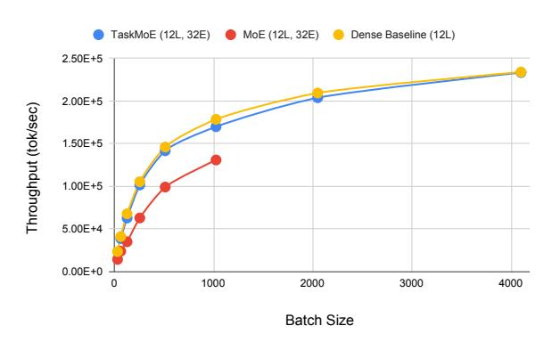

# 4.3 Comparison of Throughput of Sparse Models

Figure 2: **Inference cost analysis:** We measure the throughput of our Task-MoE model, baseline Transformer-Base model and baseline Token-MoE model across batch sizes and see that the peak throughput of Task-MoE (and Transformer-Base) is 1.87 times higher than that of Token-MoE.

We further compare Task-level MoEs with Token-level MoEs in terms of throughput across different batch sizes in Figure 2. We measure this by decoding the WMT14 English-German test set with our TaskMoE model and with the baseline TokenMoE model on 32 Cloud TPU V3 cores.

| System                        | Routing | Granularity | Throughput          |         |      |      |      | BLEU |      |      |      |      |
|-------------------------------|---------|-------------|---------------------|---------|------|------|------|------|------|------|------|------|
| System                        | Encoder | Decoder     | Peak tokens/s       | Average | EnFr | FrEn | EnDe | DeEn | EnRo | RoEn | EnHi | HiEn |
| Bilingual Baselines           | -       | -           | $2.3 \times 10^{5}$ | 24.3    | 38.1 | 35.5 | 26.4 | 27.4 | 23.7 | 30.1 | 4.5  | 8.5  |
| Multilingual Transformer-Base | -       | -           | $2.3 \times 10^{5}$ | 25.9    | 36.1 | 34.1 | 22.0 | 28.6 | 23.9 | 33.4 | 10.4 | 19.2 |
| Task-level MoE – 32 experts   | Token   | Target      | $2.3 \times 10^{5}$ | 29.0    | 39.9 | 37.1 | 27.1 | 32.0 | 26.6 | 36.2 | 13.3 | 20.1 |
| Token-level MoE – 32 experts  | Token   | Token       | $1.3 \times 10^{5}$ | 28.2    | 40.1 | 36.4 | 26.7 | 31.2 | 26.5 | 33.7 | 11.5 | 19.8 |
| Distillation (from Token MoE) | -       | -           | $2.3 \times 10^{5}$ | 26.9    | 37.3 | 33.2 | 25.1 | 29.3 | 24.6 | 34.6 | 13.9 | 17.6 |

Table 2: **Comparing Distillation to Task-MoE:** We compare our best performing Task-MoE model to Distilling a Token MoE model to Transformer-Base and a version with 2x the width for several language pairs. We see that distillation consistently underperforms our best-performing Task MoE model - distillation from Token MoE achieves an average BLEU score of 26.9, while our best-performing Task MoE model has an average BLEU score of 29.0 (+2.1 BLEU) for these language pairs.

We find that our Task-MoE model has 1.87 times higher peak throughput while using 3.75 times less decoder parameters (142M vs 533M). Moreover, our Task-MoE model has minimal communication overhead compared to decoding with Token-MoE (0.0% versus 26.9% of step time).

We note that the inference time of the tokenbased MoE model is dominated by the decoder, with the decoders taking 200x the time per step than the encoders at peak throughput. Therefore, the inference cost of task-level routing on decoder only is roughly equivalent to that on both the encoder and decoder.

