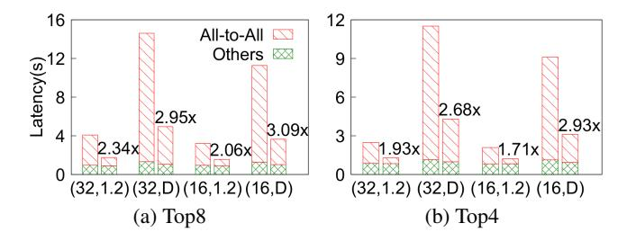

# Comparison on All-to-All Optimized System

Finally, we investigate if BigMac's model structure can bring benefits further on systems which have already optimized the All-to-All bottleneck of MoE from systems perspectives. For training, we evaluate on Tutel and for in-

Figure 6: Training time breakdown on Tutel. For each group, labels (ep, f) refer to the corresponding EP degree and the expert capacity factor f, where f=*D* refers to the dynamic capacity factor adaption. For each group, the left bar is the result of GPT-Fine-Grained, and the right bar corresponds to GPT-BigMac.

Figure 7: Inference throughput comparison between GPT-Fine-Grained and GPT-BigMac on Tutel with f=1.2. The numbers under x-axis represents different prompt lengths.

ference, we evaluate on Tutel and DeepSpeed-Inference. We evaluate GPT-Fine-Grained and GPT-BigMac, using the GPT3-Medium as the base model, with different expert parallelism degrees and top k values. In Tutel, we adopt the 2DH All-to-All communication technique and set the overlapping degree as 4 to hide communications with expert computations. In addition, Tutel supports dynamic capacity factor adaption, which avoids token dropping while reducing token padding. We measure with a fixed factor (f=1.2) and the dynamic capacity factor adaption (f=∞), respectively. Training Latency on Tutel. Figure 6 shows the train-

ing speedups of GPT-BigMac, compared with GPT-Fine-Grained under Top8/Top4 routing, and we show the results with fixed capacity factor (f=1.2) and dynamic capacity factor (f=∞), respectively. We can see that BigMac has significant speedups ranging from 1.71× to 3.09× in all the cases, and BigMac shows greater advantages in Top8 routing and dynamic capacity setting, since both larger top k and larger capacity indicate more data transmission.

| Generation Length | 1     | 2     | 5     | 10    |
|-------------------|-------|-------|-------|-------|
| ep=16,Top8        | 3.11× | 2.89× | 2.41× | 1.99× |
| ep=16,Top4        | 2.81× | 2.50× | 2.03× | 1.62× |

Table 9: Inference throughput speedup of GPT-BigMac on DeepSpeed-Inference under different generation lengths.

Inference Throughput on Tutel. We summarize the inference throughput of GPT-Fine-Grained and GPT-BigMac on Tutel for different prompt lengths in Figure 7. GPT-BigMac consistently outperforms GPT-Fine-Grained by 1.67-1.87×, under different top k value and expert parallelism degrees. This implies that with system optimizations enabled by Tutel, BigMac can still maintain a high throughput over different prompt lengths.

Inference Throughput on DeepSpeed-Inference. We next compare the inference throughput of GPT-Fine-Grained and GPT-BigMac on DeepSpeed-Inference for different generation lengths. Table 9 shows the speedup of inference throughput under the prompt length of 128. The results show that on DeepSeepd-Inference, which involves techniques including KV cache management, GPT-BigMac consistently outperforms GPT-Fine-Grained by 1.62-3.11× over different generation lengths.

