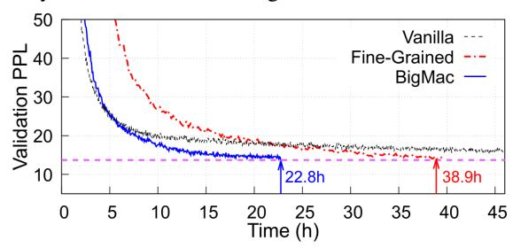

# Introduction

Increasing the size of Transformer-based large language models (LLMs) can continuously improve downstream application performance. Such a phenomenon, known as the scaling law, has been demonstrated by the auto-regressive dense models such as GPT-series (OpenAI et al. 2024) and Llama-series (Dubey et al. 2024). However, this comes at the price of higher computing complexity and more resource consumption. Fortunately, the Mixture-of-Experts (MoE)

Figure 1: Convergence result comparison of MoE models with three structures. GPT-Fine-Grained takes 38.9 hours to reach the target perplexity of 13.69, while GPT-BigMac spends only 22.8 hours (1.7× faster). GPT-Vanilla fails to converge to the target perplexity under time budget.

technique, capable of expanding the model size tens or even hundreds of times without significantly increasing the computation, is widely used in various emerging huge models, such as GShard (Lepikhin et al. 2020), GLaM (Du et al. 2022), Switch Transformer (Fedus, Zoph, and Shazeer 2022), and Mixtral (Jiang et al. 2024), each of which consists of hundreds of billion parameters or even beyond.

Recently, DeepSeekMoE (Dai et al. 2024), a fine-grained and more parameter-efficient MoE structure, has been proposed. Compared to conventional MoE models, for the same model size, DeepSeekMoE has significantly more experts per MoE layer and fewer parameters per expert. It was demonstrated that such a new structure can achieve comparable or even better results than conventional MoE models with much less time complexity and hence it is adopted by many later released models, such as Qwen2 (Yang et al. 2024) and DeepSeek-v2 (DeepSeek-AI et al. 2024).

However, the MoE faces a serious All-to-All communication bottleneck during both training and inference. This is mainly because of the underlying expert parallelism (EP) strategy, which assigns experts to several hardware accelerators to avoid out-of-memory errors or improve efficiency (Fedus, Zoph, and Shazeer 2022). As a result, for each MoE layer, two All-to-All communication steps are introduced for dispatching tokens to their best-fit experts, which may be stored in the other accelerators and then gathering the results back before proceeding to the next layer.

\*Zewen and Shengnan equally contributed to this work.

Figure 2: The MoE layers of different structures. Here, N represents the number of experts in the Vanilla MoE model and ACT represents the activation function like ReLU.  $W_{\downarrow}$  and  $W_{\uparrow}$  represent the descending and ascending projection matrix of an expert, respectively.  $W'_{\downarrow}$  and  $W'_{\uparrow}$  represent the projection matrices introduced in BigMac.

Recent studies have already found that the All-to-All communication is a key issue leading to the low efficiency of MoE model training and inference (Hu et al. 2024). Even worse, this bottleneck will be more pronounced in the finegrained MoE structure, which generally requires to activate more experts to ensure performance.

In this paper, we propose a novel efficient MoE structure, named BigMac, which is also fine-grained but can greatly reduce the All-to-All communication overhead. Note that existing fine-grained MoE models adopt the communicatedescend-ascend-communicate (CDAC) manner, performing the All-to-All at a high dimension, leading to a heavy communication overhead. In contrast, BigMac designs an efficient descend-communicate-communicate-ascend (DCCA) manner, which is capable of performing the All-to-All communication at a very low dimension. Furthermore, to adapt to DCCA, we further re-design the structure of the small expert in BigMac, ensuring the complexity of each single expert for the overall performance of the whole model. Specifically, each expert in BigMac is composed of an ascending projection and a descending projection with an activation in between, which is the opposite of fine-grained MoE models.

Briefly, we make the following contributions:

- We propose a novel MoE structure named BigMac, which can greatly improve the efficiency of MoE models for both training and inference. In addition, BigMac no longer suffers from problems such as the limited expert capacity and limited top\_k, which are common restrictions in the existing MoE structures.
- We design a descend-communicate-communicate-ascend (DCCA) strategy to ensure that the communication is always executed at the very low dimension, hence the communication overhead is greatly reduced. To guarantee the computing efficiency, BigMac adopts the idea of fine-grained MoE models, namely, each MoE layer is composed of a large number of small experts, while the structure of each small expert is re-designed to adapt to the DCCA strategy.
- We pre-train the MoE models with different MoE structures and show that BigMac converges faster than the other structures (shown in Figure 1). The results on mul-

tiple downstream tasks show that BigMac can achieve comparable or better performance against other baselines using the same amount of resources. Moreover, evaluations on state-of-the-art distributed training / inference frameworks, including Megatron, Tutel, and DeepSpeed-Inference, show that BigMac can significantly mitigate the communication overhead, reducing the end-to-end latency by up to  $3.09\times$  for training and increasing the throughput by up to  $3.11\times$  for inference.

#### **Related Work and Motivation**

Fine-grained MoE. Starting from GShard (Lepikhin et al. 2020), the Mixture-of-Experts (MoE) technology has been applied to the Transformer architecture, allowing for a significant increase in the number of parameters with only a sub-linear increase in computational resources. As illustrated in Figure 2a, the dense Feed-Forward Network (FFN) modules in Transformer are replaced with MoE sub-layers, each consisting of multiple parallel experts. The number of experts activated by each token is defined as top\_k. However, it is challenging for these conventional MoE models to exploit expert specialization, since they are based on the top-1 or top-2 routing strategies with the coarse-grained expert activation. To address this issue, a new fine-grained MoE architecture is proposed in DeepSeekMoE (Dai et al. 2024). To improve expert specialization, DeepSeekMoE maintains the same number of parameters as the conventional MoE models, while splitting experts into finer granularity and choosing a higher top\_k for token distribution. Such an architecture with a large number of smaller experts has been adopted by DeepSeek-V2 (DeepSeek-AI et al. 2024) and Qwen2-57B-A14B (Yang et al. 2024), demonstrating better model quality and computation efficiency than the conventional ones with a small number of large experts.

Nevertheless, this fine-grained MoE architecture faces a severe communication problem for its training and inference tasks, due to the following reasons. First of all, to improve computation efficiency and cope with the single hardware accelerator's memory limit, the common practice is to leverage Expert Parallelism (EP) for assigning experts to different accelerators (Fedus, Zoph, and Shazeer 2022). Second,

| Expert Config top k/#experts | Training (ms) A2A | Ratio | Inference (ms) A2A Ratio |       |  |
|---------------------------------|----------------------|-------|--------------------------------|-------|--|
| 1 / 64                          | 336.9                | 59.9% | 94.9                           | 51.2% |  |
| 2 / 64                          | 535.6                | 71.3% | 132.9                          | 65.2% |  |
| 4 / 64                          | 1,089.5              | 84.1% | 268.7                          | 79.2% |  |
| 6 / 64                          | 1,692.8              | 89.1% | 457.0                          | 86.5% |  |
| 8 / 64                          | 2,383.4              | 91.8% | 696.5                          | 90.6% |  |

Table 1: The All-to-All latency and its ratio in training and inference task of MoE models with small experts across varioustop k. The evaluation is conducted under the expert parallelism degree as 32 on 32 devices. The All-to-All duration increases by 7.1x and 7.3x when top k is 8, corresponding to proportions of 91.8% and 90.6%.

EP requires injecting two costly All-to-All communication operations per MoE layer for distributing tokens to various experts and also gathering results for proceeding the computation to the next layer (green boxes in Figure 2b). Third, the All-to-All communication already accounts for a large portion of the overall training or inference time, while its overhead as well as time ratio increases with the top k value. Table 1 shows the All-to-All time costs and time ratios of a fine-grained MoE model with 64 experts per layer and various top k choices for training and inference jobs. When top k is 1, the All-to-All overhead respectively contributes to 59.9% and 51.2% of the end-to-end time in training and inference. However, when top k is 8, the All-to-All duration increases by 7.1× and 7.3×, almost dominating the entire training and inference tasks, with proportions increasing to an astonishing 91.8% and 90.6%, respectively. In conclusion, considering that in the future new MoE models, it is very likely that their experts will become smaller and more numerous and the value of top k will be larger, the optimization of All-to-All communication becomes urgent.

System-wise Optimizations. Fortunately, there have been a few initial attempts in the systems community to improve the scheduling of EP-enabled parallel training or inference. For instance, Lina (Li et al. 2023) leverages a fine-grained scheduling strategy to avoid bandwidth contention between All-to-All communication and All-Reduce communication. Tutel (Hwang et al. 2023) schedules transmission jobs in a network topology-aware fashion to make full use of the intra-node and inter-node network bandwidth. Furthermore, FasterMoE (He et al. 2022) and Tutel partition the input tokens into small chunks and overlap All-to-All communication with FFN computation in each expert. However, these efforts are designed for conventional MoE models, and when acting on fine-grained ones, their effect will be quite limited. This is mainly due to the fact that the amount of computation per expert is drastically reduced in the fine-grained MoE model, yet the amount of communication dominates the entire pipeline, and thus the space for bandwidth optimization and overlap optimization becomes very small.

Communication Volume Reduction. To address the communication bottleneck that is difficult to resolve at the system level, some have begun advocating data compression

| Notation | Description                       |
|----------|-----------------------------------|
| b        | global batch size                 |
| s        | sequence length                   |
| h        | hidden dimension                  |
| h f      | FFN intermediate hidden dimension |
| e        | number of experts                 |
| top k    | number of experts to route to     |
| f        | expert capacity factor            |
| ep       | expert parallelism degree         |
| tp       | tensor parallelism degree         |
| r        | downscaling factor                |

Table 2: Description of the notations used in this paper.

techniques. For instance, ScheMoE (Shi et al. 2024) applies the ZFP compression algorithm (Lindstrom 2014) to tokens before transmission and indicates that such a compression technique can significantly reduce the All-to-All communication overhead and accelerate MoE training. However, such lossy MoE structure-agnostic compression schemes can lead to a decline in model quality, making them unsuitable for downstream tasks with high precision requirements. Furthermore, the extra compression and decompression steps can bring non-negligible computational overhead. Therefore, there is an urgent need for a new fine-grained MoE architecture from an algorithmic perspective with the following advantages: 1) significantly reducing data volumes transferred in All-to-All communication; 2) maintaining the same model quality; and 3) avoiding extra computation overhead, comparing to the state-of-the-art fine-grained MoE structures, as well as some of the above optimizations.

