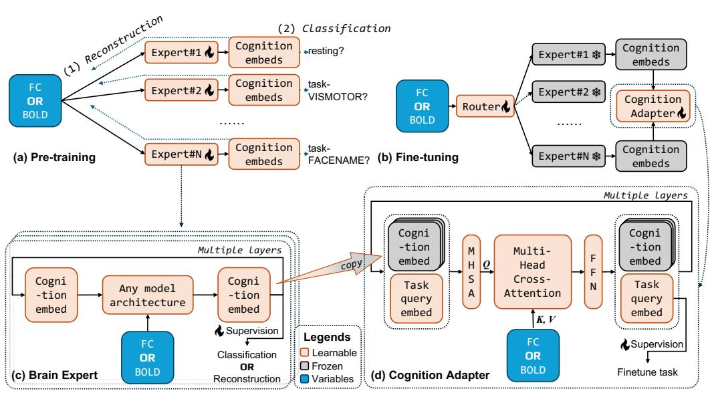
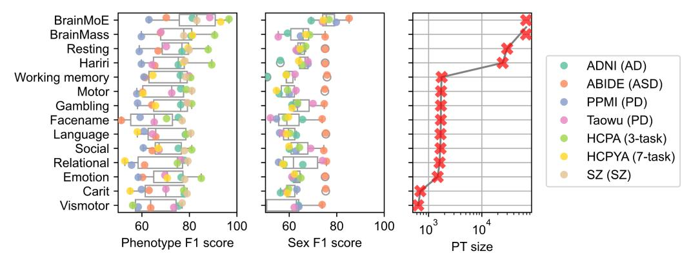
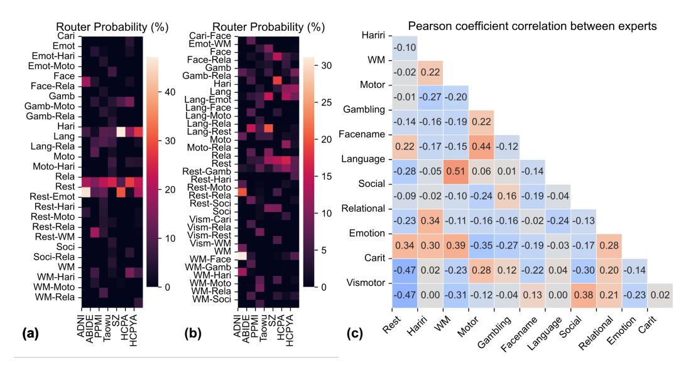

# 2 Preliminaries

Brain foundation models To the best of our knowledge, BrainLM [\[23\]](#page-11-0) represents the first brain foundation model. It applied Masked Autoencoding (MAE) to BOLD signals reconstruction. However, densely filling the entire fMRI time series can impair the model's capacity to differentiate between noise and meaningful signals. Prior work [\[3\]](#page-10-7) has demonstrated that masked pretraining in generative frameworks such as MAE often yields suboptimal results in off-the-shelf evaluations, such as linear probing. Similarly, BrainJEPA [\[11\]](#page-10-2) introduces an alternative architecture employing a distinct JEPA-based masking strategy, addressing BrainLM's limitations by drawing on insights from I-JEPA [\[3\]](#page-10-7). Although BrainJEPA reports superior performance relative to linear probing, it does not explicitly incorporate pre-training with tasking fMRI. BrainMass [\[34\]](#page-12-0) used a larger pre-training dataset (see Appendix) and a matching objective between pseudo FC matrices as a novel framework. Whilst, it used sololy the resting fMRI and overlooked more than 38k tasking fMRI in the dataset.

Resting- and tasking-state fMRI Neuroimaging data contains brain activity reflecting the interaction between functional fluctuations and human behavior. Studies controlled subjects in a resting or explicit tasking state during the data acquisition to offer distinct, complementary perspectives on brain function [\[36\]](#page-12-5). Large-scale studies [\[29,](#page-12-1) [5,](#page-10-3) [20\]](#page-11-2) are observed to collect at least one tasking state in addition to the resting state, while brain foundation models mainly pre-train on the portion under the resting state, overlooking half or more data in the datasets. The intuitive method of mixing all data together may compromise the underlying heterogeneity between different states. Fig. [2](#page-2-0) shows that the improvement gained from pre-training with 38k more data containing 11 overlooked cognitive states is marginal on four downstream classifications: ABIDE is 2-class classification for Autism diagnosis, PPMI is 4-class for staged Parkinson's disease, HCPA is 4-class, and HCPYA is 7-class for human behavior recognition. In contrast, BrainMoE can bring an impressive performance enhancement by stratifying and adapting cognitive states. Note that ABIDE and PPMI are preprocessed by the pipeline of [\[33\]](#page-12-6), which is different from our pipeline (see Appendix) for HCPs and UKB datasets. Furthermore, BrainMass and BrainJEPA reconstruct FC and BOLD latent features, respectively.

Figure 3: Framework of BrainMoE. (a) **Pre-training** has two options: (1) Previous models train with a reconstruction objective, where samples used for BrainMoE pre-training are stratified by cognitive states. (2) A new architecture of cognition classification can be set as the objective via cross-entropy between embeddings and cognitive states. (b) **Fine-tuning** a router for the expert selection and a cognition adapter for the combination of frozen experts. (c) **Brain expert** is adaptable to any model architecture, learning feature representation from either FC or BOLD signal, where the vector of latent feature before the final predictive layer is used as a cognition embedding. (d) **Cognition adapter** is a Transformer decoder, where MHSA stands for multi-head self-attention, and FFN is a feedforward network.

These primary results demonstrate empirical and clear evidence to support the motivation to stratify data according to cognitive states for multiple experts and learn joint cognition embeddings.

#### 3 Methods

BrainMoE is designed to work with arbitrary brain foundation models as experts and to cooperate with a router and an adapter for fine-tuning on the downstream. Assume the input, BOLD or FC, is denoted by  $\mathbf{X} \in \mathbb{R}^{M \times C_{in}}$  with M regions of the brain atlas and  $C_{in}$  channels of input vector. Target of brain experts is to produce cognition embeddings,  $\mathbf{Z}$ . For the router and adapter, it is to predict  $\mathbf{Y}$  for downstream applications given pre-trained experts.

#### 3.1 Framework

The framework of BrainMoE is separated into two stages as shown in Fig. 3 (a) pre-training and (b) fine-tuning, where N experts, denoted by  $f(\cdot):\mathbb{R}^{M\times C_{in}}\to\mathbb{R}^{C_{hid}}$  with  $C_{hid}$  the hidden channel number, learn from large-scale datasets containing subjects explicitly tasking on N cognition-related behaviors to produce a variety of cognition embeddings, and fine-tune a router for expert weights  $\mathbf{P}\in\mathbb{R}^N$ , for selecting top-k ( $k\in[1,N]$ ) experts, and a cognition adapter for predicting downstream tasks based on cognition embeddings. Following the observed performance that relies on input type, preprocessing pipeline, and model architecture, BrainMoE has a framework suitable to experts with no requirement for data type and architecture.

## 3.2 Expert pre-training

In Fig. 3 (a), two objectives can be used to pre-train the brain expert, the reconstruction and the classification. (1) The pre-training of existing brain foundation models is reconstructing latent feature of input, FC or BOLD, from its masked version via a bottleneck or transformer encoder architecture. We utilized BrainMass or BrainJEPA as candidates of brain experts. The latent feature is produced by

existing architectures as the cognition embedding, denoted by  $\mathbf{Z} \in \mathbb{R}^{C_{hid}}$ . Each expert is pre-trained with the data that has the same cognitive state.

$$\mathbf{Z} := f(\mathbf{X}) = \arg\min_{\mathbf{Z}} ||\mathbf{Z} - g(\mathbf{X})||^2, \tag{1}$$

where g is the target network. As shown in Fig. 3 (c), the brain expert can be any architecture that produces a latent feature representation, which is frozen and copied for the downstream. The pre-training objective is not restrict to the reconstruction or a new classification for cognitive states.

In Fig. 3 (a) (2), we propose a new pre-training objective, cognitive state classification, to explicitly learn from the cross-entropy between the latent feature and the cognitive state,  $CELoss(\rho(\mathbf{Z}), \mathbf{Y}_{cog})$ , where  $\rho: \mathbb{R}^{C_{hid}} \to \mathbb{R}^1$  is a linear layer, and  $\mathbf{Y}_{cog}$  is the binary label of a cognitive state. The architecture for this expert is the same as the cognition adapter introduced in the next section.

#### 3.3 Cognition adapter fine-tuning

The architecture of the cognition adapter is designed as a Transformer decoder shown in Fig. 3 (d). The purpose of this adapter is to adapt multiple experts from a stratified feature representation based on cognitive states to a downstream application, a classification task in this work.

Assume that the token vectors shown in dashed rectangle in Fig. 3 (d) is denoted by  $\bar{\mathbf{Z}} \in \mathbb{R}^{(k+P) \times C_{hid}}$ , where P is the class number in the downstream application. Note that  $\bar{\mathbf{Z}}_{:k} := \mathbf{Z} \odot \mathbf{P}$  representing the top-k cognition embeddings from experts and  $\bar{\mathbf{Z}}_{k:(k+P)}$  denotes randomly initialized task query embeddings. It is also a cognition classifier without  $\bar{\mathbf{Z}}_{:k}$ . Then, as demonstrated in the architecture, a layer of the adapter starts at a multi-head self-attention (MHSA),  $\bar{\mathbf{Z}} = \mathrm{Softmax}(QK^T/\sqrt{C_{hid}})V$ , with following definitions

$$Q := \bar{\mathbf{Z}}\bar{\boldsymbol{\alpha}}_h, K := \bar{\mathbf{Z}}\bar{\boldsymbol{\beta}}_h, V := \bar{\mathbf{Z}}\bar{\boldsymbol{\gamma}}_h, \tag{2}$$

where  $\bar{\alpha}_h, \bar{\beta}_h, \bar{\gamma}_h \in \mathbb{R}^{C_{hid} \times C_{hid}}$  are learnable parameters, and h is the head index. Last, a multihead cross-attention brings the information from the raw input to the task embeddings. Suppose  $\mathbf{I} \in \mathbb{R}^{M \times M}$  is FC matrix. Cross-attention between  $\bar{\mathbf{Z}}$  and  $\mathbf{I}$  with alternative definitions

$$Q := \mathbf{I}\hat{\boldsymbol{\alpha}}_h, K := \bar{\mathbf{Z}}\hat{\boldsymbol{\beta}}_h, V := \mathbf{I}\hat{\boldsymbol{\gamma}}_h, \tag{3}$$

where  $\hat{\alpha}_h, \hat{\gamma}_h \in \mathbb{R}^{M \times C_{hid}}, \hat{\beta}_h \in \mathbb{R}^{C_{hid} \times C_{hid}}$  are learnable parameters. FFN denotes a feedforward network constructed by MLP. Note that the bias in linear layers is omitted in this section for clarity. Finally, after multiple layers of the cognition adapter, a linear layer,  $\mathbb{R}^{P \times C_{hid}} \to \mathbb{R}^{P \times 1}$ , takes only the task query and produces the logistic prediction to accomplish fine-tuning on a downstream application.

#### 4 Experiments

We evaluate the proposed BrainMoE on 3 pre-training datasets, including UK Biobank (UKB), HCP Aging (HCPA), and HCP Young Adult (HCPYA), and 7 downstream datasets, including ADNI, ABIDE, PPMI, Taowu, SZ, HCPA, and HCPYA. UKB and two HCPs contain 68,251 scans of brain fMRI from 21,797 subjects under 12 different cognitive states on resting or tasking. Five disease-related datasets contain more than 1,500 subjects under the same resting state but various health status.

To comprehensively evaluate and showcase the performance, we conduct experiments on both randomly initialized and pre-trained models across tasks involving disease, sex, and brain state recognition. Specifically, our study aims to address two key research questions: (**RQ1**) To what extent does BrainMoE improve the prediction performance from the baseline using different expert architectures? (**RQ2**) Which pre-training objectives are the most robust across various downstream applications? Additionally, we provide ablation studies to further support our findings.

**Datasets** We preprocess fMRI and partition brain regions using the AAL atlas [28] for UKB, HCPA, HCPYA, and ADNI. Details can be found in the Appendix. Other datasets are preprocessed by [33]. SZ is an in-house data preprocessed by a third party.

**UK Biobank (HCPA)** dataset [20] is a large-scale dataset with MRI data. There are fMRI (n=51,780) involved in this work. It consists of one resting state and one tasking state that engages cognitive and sensory-motor [13].

Figure 4: The performance of BrainMoE and BrainMass pre-trained with all samples, and n=12 pre-trained individual experts on phenotypic and sex classifications among 7 datasets, where scores lower than 50% are hidden for clarity, and the pre-training (PT) size ranges from 68,251 to 637.

The Lifespan Human Connectome Project Aging (HCPA) dataset [\[5\]](#page-10-3) is instrumental in task recognition research, offering a comprehensive view of the aging process. It includes data from 717 subjects, encompassing fMRI records (n=4,863) with four human behaviors associated with memory, sensory-motor, and the resting state.

The Human Connectome Project Young Adult (HCPYA) dataset [\[29\]](#page-12-1) has tackled key aspects of the neural pathways that underlie brain function and behavior via high-quality neuroimaging data in over 1,100 healthy young adults. It includes data from seven human behaviors associated with various cognitive tasks, e.g., language and working memory.

Alzheimer's Disease Neuroimaging Initiative (ADNI) dataset [\[32\]](#page-12-8) serves as an invaluable resource, featuring a collection of pre-processed fMRI (n=138) and including clinical diagnostic labels. It encompasses a spectrum of cognitive states: Cognitive Normal (CN), Subjective Memory Complaints (SMC), Early-Stage Mild Cognitive Impairment (EMCI), Late-Stage Mild Cognitive Impairment (LMCI), and Alzheimer's Disease (AD). Considering the class unbalance issue, we simplified these categories into two broad groups based on disease severity: we combined CN, SMC, and EMCI into 'CN' group, while LMCI and AD were grouped as the 'AD' group.

Parkinson's Progression Markers Initiative (PPMI) dataset [\[33\]](#page-12-6) presents a substantial collection of data from 209 subjects. It encompasses states of mental health: normal control, scans without evidence of dopaminergic deficit (SWEDD), prodromal, and Parkinson's disease (PD).

Taowu [\[33\]](#page-12-6) is one of the earliest image datasets released for Parkinson's and contains 40 subjects.

Autism Brain Imaging Data Exchange (ABIDE) dataset [\[33\]](#page-12-6) presents data from 1,025 young adults. The initiative aggregated fMRI data collected from laboratories around the world to support the research on Autism Spectrum Disorder (ASD).

Schizophrenia (SZ) is the in-house data that contains 189 subjects. There are 30 converted and 159 nonconverted.

Implementation Following previous works, our experiments are conducted with subject-level cross-validation (CV). The average score and the standard deviation are both listed. To make our results comparable with previous papers, HCPA, HCPYA, and ADNI use a 5-fold CV as same as [\[9,](#page-10-8) [31\]](#page-12-2), while others use 10-fold as same as [\[33\]](#page-12-6). Since HCPs are used for both pre-training and fine-tuning, the training data in the two stages is always from the corresponding CV fold's training set to prevent data leakage. Hyperparameters, e.g., learning rate and hidden channels, can be found in the Appendix.

State-of-the-art (SOTA) brain foundation models, BrainMass [\[34\]](#page-12-0) and BrainJEPA [\[11\]](#page-10-2), are selected as expert architectures along with the new classifier architecture proposed in this work. Note that the original BrainMass fine-tuning utilizes the support vector machine (SVM) that has a lower scale of learnable parameters than others. Therefore, an enhancement of BrainMass is evaluated in this work by replacing SVM with a 2-layer MLP.

Table 1: MoE improvement on phenotypic classification F1 score compared to the baseline, where 30k is pre-trained on resting-state data (n=29,951), and 68k is pre-trained on all data (n=68,251). PT stands for pre-training. Colored text indicates the performance increase/decrease from using 68k.

|                                                                                                                                                                                                                                                                                                                                                                                                                                                                                                                                                                                                                                                                                                                                                                                                                                                                                                                                                                                                                                                                                                                                                                                                                                                                                                                                                                                                                                                                                                                                                                                                                                                                                                                                                                                                                                                                                                                                                                                                                                                                                                                              |                     |                                  | BrainMass           |                        |                          |                                  | BrainJEPA                  |                        |
|------------------------------------------------------------------------------------------------------------------------------------------------------------------------------------------------------------------------------------------------------------------------------------------------------------------------------------------------------------------------------------------------------------------------------------------------------------------------------------------------------------------------------------------------------------------------------------------------------------------------------------------------------------------------------------------------------------------------------------------------------------------------------------------------------------------------------------------------------------------------------------------------------------------------------------------------------------------------------------------------------------------------------------------------------------------------------------------------------------------------------------------------------------------------------------------------------------------------------------------------------------------------------------------------------------------------------------------------------------------------------------------------------------------------------------------------------------------------------------------------------------------------------------------------------------------------------------------------------------------------------------------------------------------------------------------------------------------------------------------------------------------------------------------------------------------------------------------------------------------------------------------------------------------------------------------------------------------------------------------------------------------------------------------------------------------------------------------------------------------------------|---------------------|----------------------------------|---------------------|------------------------|--------------------------|----------------------------------|----------------------------|------------------------|
| Predictor                                                                                                                                                                                                                                                                                                                                                                                                                                                                                                                                                                                                                                                                                                                                                                                                                                                                                                                                                                                                                                                                                                                                                                                                                                                                                                                                                                                                                                                                                                                                                                                                                                                                                                                                                                                                                                                                                                                                                                                                                                                                                                                    | SVM                 | SVM                              | MLP                 | MLP                    | BrainMoE                 | ViT                              | ViT                        | BrainMoE               |
| PT#                                                                                                                                                                                                                                                                                                                                                                                                                                                                                                                                                                                                                                                                                                                                                                                                                                                                                                                                                                                                                                                                                                                                                                                                                                                                                                                                                                                                                                                                                                                                                                                                                                                                                                                                                                                                                                                                                                                                                                                                                                                                                                                          | 30k                 | 68k                              | 30k                 | 68k                    | 68k                      | 30k                              | 68k                        | 68k                    |
| ADNI                                                                                                                                                                                                                                                                                                                                                                                                                                                                                                                                                                                                                                                                                                                                                                                                                                                                                                                                                                                                                                                                                                                                                                                                                                                                                                                                                                                                                                                                                                                                                                                                                                                                                                                                                                                                                                                                                                                                                                                                                                                                                                                         | $75.32_{\pm 7.06}$  | $75.32_{\pm 7.06}$               | $76.86_{\pm 7.26}$  | 80.70 ±7.85 | 81.23 ±11.00  | 74.16 ±8.55           | $74.16_{\pm 8.55}$         | 77.11 ±6.64 |
| ЬAD                                                                                                                                                                                                                                                                                                                                                                                                                                                                                                                                                                                                                                                                                                                                                                                                                                                                                                                                                                                                                                                                                                                                                                                                                                                                                                                                                                                                                                                                                                                                                                                                                                                                                                                                                                                                                                                                                                                                                                                                                                                                                                                          |                     | 0.00                             |                     | 3.84 ↑                 | 4.37 ↑                   |                                  | 0.00                       | <b>2.95</b> ↑          |
| <b>ABIDE</b>                                                                                                                                                                                                                                                                                                                                                                                                                                                                                                                                                                                                                                                                                                                                                                                                                                                                                                                                                                                                                                                                                                                                                                                                                                                                                                                                                                                                                                                                                                                                                                                                                                                                                                                                                                                                                                                                                                                                                                                                                                                                                                                 | $62.31_{\pm 1.95}$  | $64.12_{\pm 2.31}$               | $66.81_{\pm 4.18}$  | $67.81_{\pm 3.91}$     | $70.26_{\pm 3.40}$       | $36.25_{\pm 6.93}$               | $39.82_{\pm 3.91}$         | $54.55_{\pm 9.89}$     |
| <b>↓</b> ASD                                                                                                                                                                                                                                                                                                                                                                                                                                                                                                                                                                                                                                                                                                                                                                                                                                                                                                                                                                                                                                                                                                                                                                                                                                                                                                                                                                                                                                                                                                                                                                                                                                                                                                                                                                                                                                                                                                                                                                                                                                                                                                                 |                     | 1.81 ↑                           |                     | 1.00 ↑                 | $\textbf{3.45} \uparrow$ |                                  | 3.77 ↑                     | $18.30\uparrow$        |
| PPMI                                                                                                                                                                                                                                                                                                                                                                                                                                                                                                                                                                                                                                                                                                                                                                                                                                                                                                                                                                                                                                                                                                                                                                                                                                                                                                                                                                                                                                                                                                                                                                                                                                                                                                                                                                                                                                                                                                                                                                                                                                                                                                                         | $54.87_{\pm 15.76}$ | $56.52 {\scriptstyle \pm 14.86}$ | $58.90_{\pm 14.29}$ | $59.77_{\pm 14.22}$    | $62.97_{\pm 13.94}$      | $38.69_{\pm 13.91}$              | $38.69_{\pm 13.91}$        | $60.49_{\pm 11.59}$    |
| →PD (sta                                                                                                                                                                                                                                                                                                                                                                                                                                                                                                                                                                                                                                                                                                                                                                                                                                                                                                                                                                                                                                                                                                                                                                                                                                                                                                                                                                                                                                                                                                                                                                                                                                                                                                                                                                                                                                                                                                                                                                                                                                                                                                                     | iged)               | 1.65 ↑                           |                     | 0.87 ↑                 | <b>4.07</b> ↑            |                                  | 0.00                       | <b>21.80</b> ↑         |
| Taowu                                                                                                                                                                                                                                                                                                                                                                                                                                                                                                                                                                                                                                                                                                                                                                                                                                                                                                                                                                                                                                                                                                                                                                                                                                                                                                                                                                                                                                                                                                                                                                                                                                                                                                                                                                                                                                                                                                                                                                                                                                                                                                                        | $58.33_{\pm 34.78}$ | $65.67_{\pm 20.55}$              | $70.29_{\pm 17.97}$ | $68.00_{\pm 21.46}$    | $88.57_{\pm 12.51}$      | $36.08_{\pm 26.38}$              | $36.94_{\pm 20.98}$        | $79.86_{\pm 14.46}$    |
| →PD (bii                                                                                                                                                                                                                                                                                                                                                                                                                                                                                                                                                                                                                                                                                                                                                                                                                                                                                                                                                                                                                                                                                                                                                                                                                                                                                                                                                                                                                                                                                                                                                                                                                                                                                                                                                                                                                                                                                                                                                                                                                                                                                                                     | nary)               | <b>7.34</b> ↑                    |                     | <b>2.29</b> ↓          | <b>18.28</b> ↑           |                                  | 0.86 ↑                     | <b>43.78</b> ↑         |
| SZ                                                                                                                                                                                                                                                                                                                                                                                                                                                                                                                                                                                                                                                                                                                                                                                                                                                                                                                                                                                                                                                                                                                                                                                                                                                                                                                                                                                                                                                                                                                                                                                                                                                                                                                                                                                                                                                                                                                                                                                                                                                                                                                           | $76.95_{\pm 9.01}$  | $76.95_{\pm 9.01}$               | $79.85_{\pm 8.69}$  | $77.63_{\pm 8.56}$     | $83.10_{\pm 11.33}$      | $76.98_{\pm 9.00}$               | $78.97_{\pm 9.79}$         | $82.86_{\pm 9.19}$     |
| Schizo   Schizo   Schizo   Schizo  Schizo  Schizo  Schizo  Schizo  Schizo  Schizo  Schizo  Schizo  Schizo  Schizo  Schizo  Schizo  Schizo  Schizo  Schizo  Schizo  Schizo  Schizo  Schizo  Schizo  Schizo  Schizo  Schizo  Schizo  Schizo  Schizo  Schizo  Schizo  Schizo  Schizo  Schizo  Schizo  Schizo  Schizo  Schizo  Schizo  Schizo  Schizo  Schizo  Schizo  Schizo  Schizo  Schizo  Schizo  Schizo  Schizo  Schizo  Schizo  Schizo  Schizo  Schizo  Schizo  Schizo  Schizo  Schizo  Schizo  Schizo  Schizo  Schizo  Schizo  Schizo  Schizo  Schizo  Schizo  Schizo  Schizo  Schizo  Schizo  Schizo  Schizo  Schizo  Schizo  Schizo  Schizo  Schizo  Schizo  Schizo  Schizo  Schizo  Schizo  Schizo  Schizo  Schizo  Schizo  Schizo  Schizo  Schizo  Schizo  Schizo  Schizo  Schizo  Schizo  Schizo  Schizo  Schizo  Schizo  Schizo  Schizo  Schizo  Schizo  Schizo  Schizo  Schizo  Schizo  Schizo  Schizo  Schizo  Schizo  Schizo  Schizo  Schizo  Schizo  Schizo  Schizo  Schizo  Schizo  Schizo  Schizo  Schizo  Schizo  Schizo  Schizo  Schizo  Schizo  Schizo  Schizo  Schizo  Schizo  Schizo  Schizo  Schizo  Schizo  Schizo  Schizo  Schizo  Schizo  Schizo  Schizo  Schizo  Schizo  Schizo  Schizo  Schizo  Schizo  Schizo  Schizo  Schizo  Schizo  Schizo  Schizo  Schizo  Schizo  Schizo  Schizo  Schizo  Schizo  Schizo  Schizo  Schizo  Schizo  Schizo  Schizo  Schizo  Schizo  Schizo  Schizo  Schizo  Schizo  Schizo  Schizo  Schizo  Schizo  Schizo  Schizo  Schizo  Schizo  Schizo  Schizo  Schizo  Schizo  Schizo  Schizo  Schizo  Schizo  Schizo  Schizo  Schizo  Schizo  Schizo  Schizo  Schizo  Schizo  Schizo  Schizo  Schizo  Schizo  Schizo  Schizo  Schizo  Schizo  Schizo  Schizo  Schizo  Schizo  Schizo  Schizo  Schizo  Schizo  Schizo  Schizo  Schizo  Schizo  Schizo  Schizo  Schizo  Schizo  Schizo  Schizo  Schizo  Schizo  Schizo  Schizo  Schizo  Schizo  Schizo  Schizo  Schizo  Schizo  Schizo  Schizo  Schizo  Schizo  Schizo  Schizo  Schizo  Schizo  Schizo  Schizo  Schizo  Schizo  Schizo  Schizo  Schizo  Schizo  Schizo  Schizo  Schizo  Schizo  Schizo  Schizo  Schizo  S | phrenia             | 0.00                             |                     | <b>2.22</b> ↓          | <b>3.25</b> ↑            |                                  | 1.99 ↑                     | <b>5.88</b> ↑          |
| HCPA                                                                                                                                                                                                                                                                                                                                                                                                                                                                                                                                                                                                                                                                                                                                                                                                                                                                                                                                                                                                                                                                                                                                                                                                                                                                                                                                                                                                                                                                                                                                                                                                                                                                                                                                                                                                                                                                                                                                                                                                                                                                                                                         | $85.16_{\pm0.41}$   | $89.73_{\pm 0.58}$               | $87.91_{\pm0.48}$   | $90.63_{\pm 0.74}$     | $96.67_{\pm 0.77}$       | $59.54_{\pm 15.47}$              | $53.12_{\pm 14.19}$        | $81.74_{\pm 0.51}$     |
|                                                                                                                                                                                                                                                                                                                                                                                                                                                                                                                                                                                                                                                                                                                                                                                                                                                                                                                                                                                                                                                                                                                                                                                                                                                                                                                                                                                                                                                                                                                                                                                                                                                                                                                                                                                                                                                                                                                                                                                                                                                                                                                              | rest                | <b>4.57</b> ↑                    |                     | <b>2.72</b> ↑          | <b>8.76</b> ↑            |                                  | $\textbf{6.42} \downarrow$ | <b>22.20</b> ↑         |
| <b>HCPYA</b>                                                                                                                                                                                                                                                                                                                                                                                                                                                                                                                                                                                                                                                                                                                                                                                                                                                                                                                                                                                                                                                                                                                                                                                                                                                                                                                                                                                                                                                                                                                                                                                                                                                                                                                                                                                                                                                                                                                                                                                                                                                                                                                 | $77.51_{\pm 2.42}$  | $80.87_{\pm 1.77}$               | $79.40_{\pm 1.78}$  | $81.27_{\pm 1.27}$     | $93.19_{\pm 0.72}$       | $50.68 {\scriptstyle \pm 25.20}$ | $56.10_{\pm 29.16}$        | $74.59_{\pm 3.79}$     |
| <b></b> →7-task                                                                                                                                                                                                                                                                                                                                                                                                                                                                                                                                                                                                                                                                                                                                                                                                                                                                                                                                                                                                                                                                                                                                                                                                                                                                                                                                                                                                                                                                                                                                                                                                                                                                                                                                                                                                                                                                                                                                                                                                                                                                                                              |                     | 3.36 ↑                           |                     | 1.87 ↑                 | <b>13.79</b> ↑           |                                  | <b>5.42</b> ↑              | 23.91 ↑                |

#### 4.1 RQ1: MoE vs baselines

The average F1 scores of BrainMoE and BrainMass pretrained with all samples, and n=12 individual experts per cognitive state on phenotypic and sex classifications among 7 datasets are shown in Fig. 4. Previous studies have demonstrated good PT data scalability with resting-state fMRI data. However, according to Fig. 4, there are consistently existing task-specific experts (e.g., language for AD, working memory for PD) outperforming Resting experts, confirming that task-state fMRI contains valuable information for brain modeling. Conclusively, BrainMoE holds the best performance compared to all experts across 7 datasets. This supports that the utilization of cognitive embeddings from BrainMoE leads to more robustness of brain modeling than naively training a single task of fMRI.

In Table 1, we summarize the impact of BrainMoE on downstream phenotypic classification, reporting improvements in the F1 score relative to non–MoE baselines for disease and human behavior recognition. Across all tasks (ADNI, ABIDE, PPMI, Taowu, SZ, HCPA, HCPYA), intuitively expanding pre-training data from 30k to 68k yields modest gains, even negative gains, for both BrainMass with SVM and MLP, e.g. ABIDE BrainMass SVM: +1.81 F1 and SZ BrainMass MLP: -2.22 F1, and BrainJEPA with Vision Transformer (ViT), e.g., HCPA BrainJEPA: -6.42 F1. In contrast, introducing our BrainMoE with the proposed cognition adapter on top of the 68k pre-trained backbone amplifies these gains substantially: phenotypic F1 score uplifts range from +3.25 F1 (SZ Schizophrenia) to +43.78 F1 (Taowu PD), and it consistently brings a positive effect. Even BrainJEPA baselines that do not gain F1 improvement from more data on HCPA and HCPYA benefit from BrainMoE, albeit to a lesser extent (e.g., HCPYA: +3.04 F1). Notably, the largest relative benefit appears on smaller cohorts, e.g., Taowu (*n*=40), where BrainMoE achieves +18.28 and +43.76 F1 over 68k BrainMass and BrainJEPA baselines.

Table 2 reports analogous results for sex classification. Worse than phenotypic classification, increasing pre-training size delivers small, commonly no improvements for BrainMass and BrainJEPA using SVM, MLP, and ViT, where 11 out of 18 experiments have dropped F1 scores in red text. In contrast, BrainMoE recovers and exceeds prior performance. It consistently demonstrates F1 score gains, except for BrainJEPA on ABIDE. It is worth noting that the most dramatic uplift appears on the smallest dataset (Taowu, n=40), where BrainMoE increases F1 by +43.76 on BrainJEPA.

Overall, the above results demonstrate that (1) a large scale pre-training without stratifying cognitive states improves downstream performance modestly (sometimes negatively), and (2) the proposed BrainMoE framework produces substantial gains, especially on downstream applications with a limited sample size.

Table 2: MoE improvement on sex classification F1 score compared to the baseline, where the sample size of the downstream dataset is indicated. PT stands for pre-training.

|                        |                        |                                     | BrainMass           |                                                                     |                                            |                     | BrainJEPA                           |                                      |
|------------------------|------------------------|-------------------------------------|---------------------|---------------------------------------------------------------------|--------------------------------------------|---------------------|-------------------------------------|--------------------------------------|
| Predictor PT #      | SVM 30k             | SVM 68k                          | MLP 30k          | MLP 68k                                                          | BrainMoE 68k                            | ViT 30k          | ViT 68k                          | BrainMoE 68k                      |
| ADNI                   | 48.60 ±6.55 | _                                   |                     | 59.30 ±13.05 <b>5.52</b> ↓                            |                                            |                     |                                     |                                      |
|                        |                        |                                     |                     | $75.12_{\pm 6.32}$                                                  |                                            |                     |                                     |                                      |
| PPMI <i>⇒n</i> =209 | $52.03_{\pm 14.16}$    | $56.58_{\pm 12.28}$                 | $63.32_{\pm 14.96}$ | $64.73_{\pm 14.12}$                                                 | $79.81_{\pm 8.46}$                         | $46.23_{\pm 9.00}$  | $46.23_{\pm 9.00}$                  | $67.57_{\pm 7.24}$                   |
| Taowu                  | $46.24_{\pm 23.96}$    | $46.24_{\pm 23.96}$                 | $62.86_{\pm 28.20}$ | $55.38_{\pm 20.93}$                                                 | $74.00_{\pm 27.79}$                        | $46.24_{\pm 23.97}$ | $51.67_{\pm 21.12}$                 | $290.00_{\pm 12.96}$                 |
|                        | $66.20_{\pm 1.58}$     | $68.25_{\pm 1.70} \\ 2.05 \uparrow$ | $66.93_{\pm0.63}$   | 7.48 $\downarrow$ 68.58 $\pm$ 0.99 1.65 $\uparrow$ 66.98 $\pm$ 3.30 | 76.76 $_{\pm 0.93}$ <b>9.83</b> $\uparrow$ | $40.32_{\pm 4.07}$  | $40.32_{\pm 4.07} \\ \textbf{0.00}$ | 44.24 ±7.01 <b>3.92</b> ↑ |
|                        |                        |                                     |                     | 2.41 ↑                                                              |                                            | _                   |                                     | 3.04 ↑                               |

Figure 5: The distribution of dominating expert combinations of (a) late fusion MoE and (b) BrainMoE shows the router preference, where the first 4 letters of cognitive state are used as abbreviation. (c) The correlation between cognition embeddings of experts shows expert diversity.

#### 4.2 RQ2: Pre-training objectives

As described in Sec 3, the BrainMoE framework has no requirement for data type and architecture. This property results in various pre-training objectives for the brain expert: FC reconstruction (FC recon.), BOLD reconstruction (BOLD recon.), and cognitive state classification (Cog. Classif.). To demonstrate which objectives are the most robust, we evaluated three objectives and an all-in-one BrainMoE on 7 downstream datasets in Table 3 and 4.

Briefly, FC reconstruction and all-in-one BrainMoE show the best robustness. They always rank in the first two places for phenotypic (Table 3) and sex classification (Table 4) across all downstream datasets, except for the smallest dataset Taowu (n=40). Unlike BrainMoE has the cognition adapter to implicitly utilize expert embeddings, the late fusion explicitly combines expert predictions, therefore cannot handle the unbalance issue. We can observe in Table 3 that FC reconstruction shows the most first rank, 4 out of 7 datasets, and all-in-one has the most first place, 4 out of 7, in Table 4. Although top-k selected experts in all-in-one BrainMoE contain experts in FC reconstruction, the self-attention in the cognition adapter mixes information between all types of pre-training objectives, yielding dropped and boosted performance for phenotypic and sex classification, respectively.

Table 3: MoE performance on phenotypic classification F1 score using three types of expert pretrained with three objectives, along with an all-in-one MoE mixing all types of experts, where LF is Late Fusion, Ex. # denotes expert number. Bold is the first rank and underline is the second.

|               |    | Ex. # ADNI | ABIDE | PPMI | Taowu                                                                 | SZ | HCPA       | HCPYA                   |
|---------------|----|------------|-------|------|-----------------------------------------------------------------------|----|------------|-------------------------|
| Baseline      |    |            |       |      |                                                                       |    |            |                         |
| BrainMass     | 1  | 80.70˘7.85 |       |      | 67.81˘3.91 59.77˘14.22 68.00˘21.46 77.63˘8.56                         |    | 90.63˘0.74 | 81.27˘1.27              |
| BrainJEPA     | 1  | 74.16˘8.55 |       |      | 39.82˘3.91 38.69˘13.91 36.94˘20.98 78.97˘9.79                         |    |            | 53.12˘14.19 56.10˘29.16 |
| LF-MoE        | 12 |            |       |      | 73.33˘10.87 69.89˘3.06 61.11˘15.29 91.24˘11.72 76.95˘9.50             |    | 94.96˘2.64 | 88.58˘3.39              |
| BrainMoE      |    |            |       |      |                                                                       |    |            |                         |
| FC recon.     | 12 |            |       |      | 81.23˘11.00 70.26˘3.40 62.97˘13.94 88.57˘12.51 83.10˘11.33 96.67˘0.77 |    |            | 93.19˘0.72              |
| BOLD recon.   | 12 | 77.11˘6.64 |       |      | 54.55˘9.89 60.49˘11.59 79.86˘14.46 82.86˘9.19                         |    | 81.74˘0.51 | 74.59˘3.79              |
| Cog. classif. | 12 |            |       |      | 79.70˘10.28 68.65˘3.81 59.23˘14.65 90.48˘14.64 83.36˘10.08 96.28˘0.70 |    |            | 95.81˘0.48              |
| All-in-one    | 36 |            |       |      | 79.73˘10.60 69.13˘4.08 60.76˘14.85 85.93˘18.32 83.91˘8.07             |    | 96.66˘0.94 | 96.81˘0.41              |

Table 4: MoE performance on sex classification F1 score using three types of expert pre-trained with three objectives, along with an all-in-one MoE mixing all types of experts. Bold is the first rank and underline is the second.

|                                                                     | Ex. #                | ADNI                                                 | ABIDE                                                | PPMI                                                 | Taowu                                                    | HCPA                                                 | HCPYA                                                |
|---------------------------------------------------------------------|----------------------|------------------------------------------------------|------------------------------------------------------|------------------------------------------------------|----------------------------------------------------------|------------------------------------------------------|------------------------------------------------------|
| Baseline BrainMass BrainJEPA                                  | 1 1               | 59.30˘13.05 36.42˘8.22                            | 75.12˘6.32 78.08˘5.84                             | 64.73˘14.12 46.23˘9.00                            | 55.38˘20.93 51.67˘21.12                               | 68.58˘0.99 40.32˘4.07                             | 66.98˘3.30 40.20˘4.22                             |
| BrainMoE FC recon. BOLD recon. Cog. classif. All-in-one | 12 12 12 36 | 69.22˘5.26 62.98˘7.76 65.75˘7.61 70.72˘7.58 | 85.21˘3.77 78.08˘6.15 82.82˘5.11 82.85˘5.91 | 79.81˘8.46 67.57˘7.24 79.07˘7.28 82.80˘5.65 | 74.00˘27.79 90.00˘12.96 72.22˘25.17 75.29˘30.56 | 76.76˘0.93 44.24˘7.01 75.65˘1.26 78.34˘2.18 | 74.36˘4.43 43.24˘8.19 75.18˘1.15 77.67˘1.54 |

#### 4.3 Rounter and expert analysis

The preference of routers in late fusion MoE and BrainMoE is shown in Fig. [5](#page-7-1) (a) and (b), respectively, where the percentage indicates how many samples have a combination of experts with dominating router logits (ě N ). Clearly, BrainMoE has diverse and similar dominating combinations for heterogeneous and homogeneous applications, respectively. The combinations are mainly dual, and datasets with the same task share similar pattern (i.e., cognitive state for HCPA and HCPYA, and PD for PPMI and Taowu). In contrast, late fusion consistently has single dominating expert due to data scale diversity, e.g., Rest (n=29,971), which implies that the routers trained by BrainMoE learned more neuroscientific knowledge than the late fusion. Furthermore, the investigation on expert embeddings is shown in Fig. [5](#page-7-1) (c). The absolute value of correlation is mostly less than 0.5, indicating experts are not in conflict or redundant to each other.

