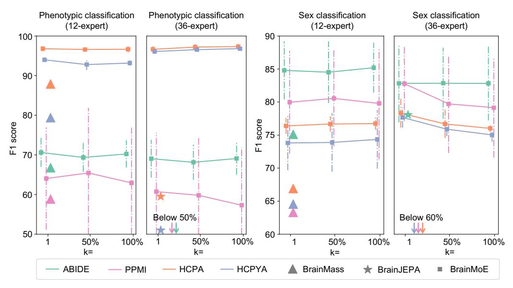

# 4.4 More applications

The age regression across 6 datasets has been evaluated for the best baseline, 68k version of BrainMass, and BrainMoE, as listed in Table [5.](#page-8-2) We

Table 5: Age regression performance compared to the baseline, where the sample size of the downstream dataset is indicated, and unit is year.

| MSE | ADNI | ABIDE | PPMI | Taowu                                                                        | HCPA | HCPYA |
|-----|------|-------|------|------------------------------------------------------------------------------|------|-------|
|     |      |       |      | BrainMass36.28˘19.83 36.77˘17.2 33.09˘21.87 38.10˘28.33 22.66˘7.51 5.46˘2.69 |      |       |
|     |      |       |      | BrainMoE 36.27˘10.23 4.86˘2.67 29.89˘8.39 30.72˘12.25 10.56˘2.86 3.45˘1.08   |      |       |

can observe the performance of BrainMoE is the best, where the improvement is especially significant for ABIDE (n=1,025, 6-58 yrs) with MSE 36.77 ÝÑ 4.86. This empirical evidence further supports the robustness of BrainMoE.

Multimodal applications of cognitive state, sex classifications, and age regression in an fMRI-EEG dataset [\[27\]](#page-11-11) are listed in Table [6.](#page-8-3) There are 388 fMRI-EEG pairs from 22 healthy subjects under 8 cognitive states (ageP[23,51], F:M=1:1). BrainMoE is evaluated here with n=1 pre-

Table 6: BrainMoE applies on a multimodal dataset, NATVIEW [\[27\]](#page-11-11).

| NATVIEW       | 8-task (F1)Sex (F1)                                                                                                                     | Age (MSE) |
|---------------|-----------------------------------------------------------------------------------------------------------------------------------------|-----------|
| CBraMod (EEG) | BrainMass (fMRI) 67.66˘5.74 63.67˘5.16 8.05˘5.58 68.71˘1.46 65.39˘2.33 8.26˘5.97 BrainMoE (13 Ex.)68.73˘3.72 65.47˘5.38 7.99˘5.53 |           |

Figure 6: Impact of altering k on downstream classification performance. Mean F1 scores with standard deviation are reported for four downstream datasets under three expert-selection regimes (top-1, top 50%, and all experts). Colors represent different datasets.

trained CBraMod [30] expert plus n=12 cognition classifier experts (Shaefer 400 version). Results from a 5-fold CV show the best performance by multimodal BrainMoE.

#### 4.5 Ablations

**Top-**k We alter k in BrainMoE to strictly limit how many top experts can be selected for downstream applications. We evaluated k=1, k=50%, and k=100% with 12 and 36 experts on four datasets with relatively larger sample sizes in Fig. 6, where 12-expert BrainMoE uses BrainMass as the expert architecture. From the left two panels, it is obvious that increasing k has a slight difference for all phenotypic tasks, except for HCPA. In the right two panels, we can observe that sex classification benefits less from a larger k. Overall, expert scaling in BrainMoE yields clear benefits for complex, data-scarce phenotypic tasks, with most gains achieved by employing top half of the experts. Beyond this, adding experts delivers diminishing returns. In contrast, for the simpler binary sex classification task, especially with a large expert pool, additional experts do not meaningfully improve performance and may introduce redundancy or overfitting. Thus, tailoring the number of active experts to task complexity and dataset size is key for efficient MoE deployment.

#### 5 Conclusion

In conclusion, we propose a new framework of the brain foundation model, BrainMoE, to pre-train with overlooked tasking-state fMRI for robust downstream applications. We observe that existing brain foundation models learn from fMRI derived from a narrow range of cognitive states, while there are 11 available cognitive states as subjects performing explicit tasks in large scale datasets. Furthermore, we showcase that (i) the straightforward utilization of data with rich human behavioral variables by pre-training with all data and (ii) the late fusion MoE both improve performance marginally. Aiming at these challenges, BrainMoE pre-trains each expert on a portion of the datasets with the same cognitive state among 12 different states for a robust brain foundation model. We design a scalable cognition adapter to mix brain experts for downstream fine-tuning so that BrainMoE can handle orthogonal cognition embeddings and be robust on the boutique downstream datasets. With sufficient 68,251 pre-training fMRI scans among UKB and HCP with 12 different cognitive states, BrainMoE has shown impressive performance boosting on a variety of applications, including sex, age prediction, human behavior recognition, multimodal applications, and early diagnosis of various brain diseases. The promising results demonstrated on eight datasets from three different pipelines indicate great potential to facilitate current neuroimaging applications in clinical routines.

