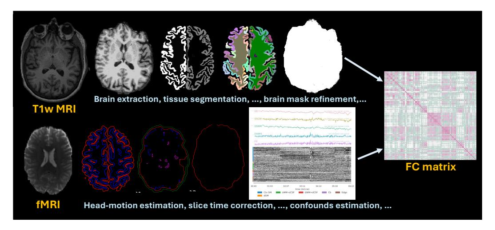

# A Accessibility

Public data is accessible via internet (UKB2, HCPA3, HCPYA4, ADNI5. PPMI, ABIDE, and Taowu can be found here6). The licenses to obtain those data can also be accessed on the websites. The codes and data split settings can be acquired via this code repository7.

## **B** Data preprocessing

The neuroimage processing used for ADNI, UKB, HCPYA, and HCPA consists of the following major steps: (1) We segment the T1-weighted image into white matter, gray matter, and cerebral spinal fluid using FSL software [16]. (2) On top of the tissue segmentation in Fig. 7, we parcellate the cortical surface of fMRI into cortical regions according to the atlas as a regional signal of time-series in Fig. 7, where FC, in the end, is the Pearson correlation coefficient between regional time-series.

Figure 7: General workflows for processing T1-weighted image (T1w MRI) and functional MRI (fMRI). The output is shown at the right, including the brain network of FC.

## C Computing environments and hyperparameters

The experiments are done on a Linux system with one NVIDIA RTX 6000 Ada. Batch size and learning rate are set as 128 and 1e-4, respectively. The maximum epoch is set as 200 and  $C_{hid}=2048$ . Training will be early stopped if accuracy keeps dropping in 50 epochs.

## D Comparison between previous works

We list the comparison of experimental datasets between previous works in Table 7.

