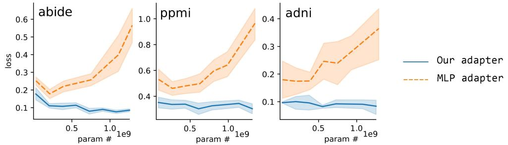
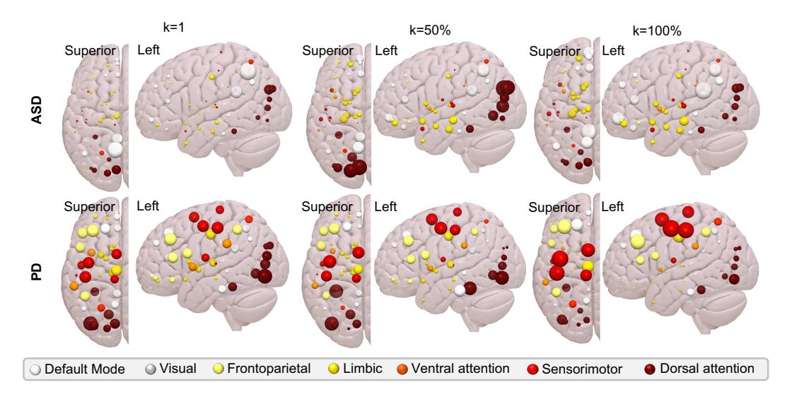

# G Scalability analysis

MLP as a universal predictive head is used in related works for the MoE adapter. Fig. 8 is the comparison between MLP and the proposed cognition adapter with different amounts of learnable parameters.

## **H** Visualization

The attention weights conducted by BrainMoE with different k is visualized in Fig. 9. We can observe: (1) Advanced by the cognition adaptor, BrainMoE agrees with current neuroscience knowledge since it mainly attends to DAN and DMN for ASD [12, 21], SMN and FPN for PD [7]. (2) Differences are slight across enlarged k, indicating that the router produces consistent expert weights.

Figure 8: The scalability of the MLP adapter and our adapter on disease prediction, where the y-axis is the fine-tuning loss.

Figure 9: Visualization of attention weights by FC reconstruction BrainMoE.