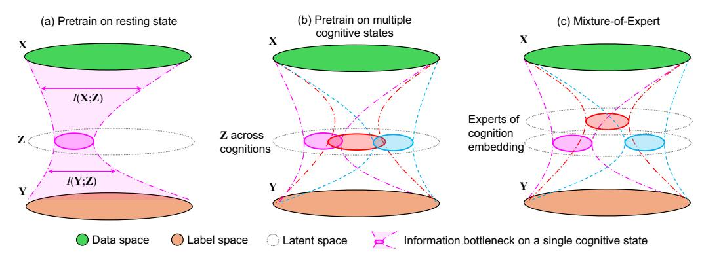
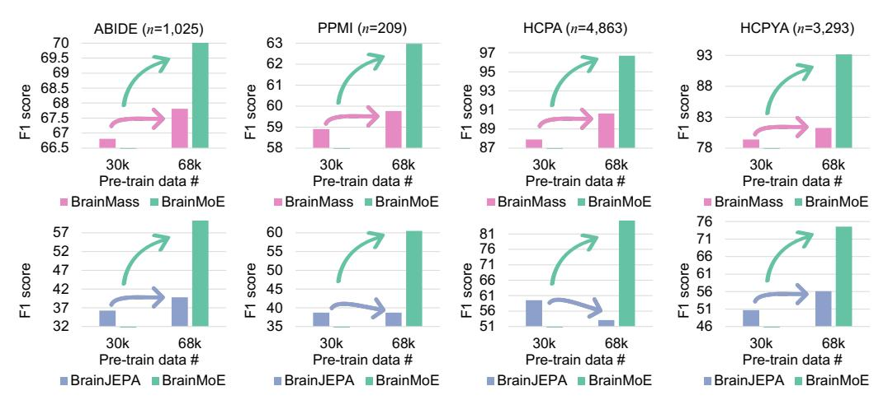

# 1 Introduction

Like foundation models for other topics, brain foundation models aim to learn feature representation fundamentally from large-scale data of neuroimaging. Functional Magnetic Resonance Imaging (fMRI) of the brain, as it offers insight into the relationship between functional fluctuations and human behavior [\[1\]](#page-10-0), is critical to discovering the enigma of human cognition and promoting clinical applications. Blood-Oxygen-Level Dependent (BOLD) signal in fMRI measures neuronal activity. Such raw signals are preprocessed as timeseries of regional mean or the functional connectivity (FC) by coefficient correlation for analysis with high Signal-to-Noise Ratio (SNR) [\[6\]](#page-10-1). While the exploration of brain foundation model has expanded to various masking strategies for either (latent) BOLD or FC reconstruction [\[23,](#page-11-0) [11,](#page-10-2) [34\]](#page-12-0), previous works formulating this problem as transferring

˚Corresponding author.

Figure 1: Motivation of BrainMoE through the lens of the information bottleneck theory. (a) Feature representation learning makes an information bottleneck between data and label space, where X denotes data, Z denotes latent feature representation, Y is the label of data, and Ip¨; ¨q is the mutual information. (b) A model pre-trained on multiple cognitive states may compromise the underlying heterogeneity between different states, where Z cannot be optimal for all states. (c) The mixture of brain experts dedicated to diverse cognitive states leads to a joint cognition embedding so that the downstream applications can be advanced by stratified pre-training on rich behavioral tasks.

self-regressive methodologies from natural language and image to neuroimaging ignored the intercorrelation between non-imaging phenotypes [\[14\]](#page-11-1). Furthermore, they are restricted by a narrow range of one or two cognitive states, e.g., the resting state, causing samples with behaviors other than resting to be overlooked. Due to the lack of explicit designs to utilize the complete brain fMRI dataset with respect to neuroscience knowledge, a mixture of brain experts is proposed towards a robust brain foundation model in this work.

UK Biobank (UKB) [\[20\]](#page-11-2) and two Human Connectome Projects (HCP) [\[29,](#page-12-1) [5\]](#page-10-3) that contain healthy subjects 22 to 100 years of age are mainly used as pre-training datasets since they have a large scale. Previously, most subjects in resting state among UKB and HCP were included in BrainMass [\[34\]](#page-12-0) and BrainJEPA [\[11\]](#page-10-2). While BrainLM [\[23\]](#page-11-0) involved an additional tasking state in UKB, its performance has shown worse than others. Even though BrainMass has collected the most available published resting fMRI data on the OpenNeuro platform [\[22\]](#page-11-3), ten available cognitive states in HCP datasets were ignored. It is intuitive to train a single model with all available data. However, as shown in Fig. [1](#page-1-0) (a) and (b), simply pre-training with all cognitive states results in a single model being suboptimal to samples with different cognitive states, e.g., the red information bottleneck established by mutual information is suboptimal in the latent space where cognition related behaviors are variable. In fact, a single model is observed to compromise the underlying heterogeneity between cognitive states derived from diverse neural circuits stimulated by different behaviors [\[25\]](#page-11-4). This issue necessitates mixing experts specialized in different cognitive states, as shown in Fig. [1](#page-1-0) (c), where each expert produces the cognition embedding, that is, a feature representation stratified by cognitive states.

On the other hand, tremendous efforts have been made to benchmark generally purposed models [\[8,](#page-10-4) [24,](#page-11-5) [10\]](#page-10-5) and brain-dedicated architectures [\[19,](#page-11-6) [17,](#page-11-7) [4,](#page-10-6) [31\]](#page-12-2) on brain fMRI data. A common observation on the results is that performance is diverse using BOLD or FC as the model input for different datasets, leading to related brain fMRI analysis works being categorized by types of input: (1) BOLD foundation models [\[23,](#page-11-0) [11\]](#page-10-2) and (2) FC foundation models [\[15,](#page-11-8) [34\]](#page-12-0). Nevertheless, this reduces the adaptability of previous brain foundation models for datasets that fit better with a type of input differentiated from the pre-training stage. Mixture-of-experts (MoE) cooperating with router and adapter [\[35,](#page-12-3) [37\]](#page-12-4) has demonstrated great potential for multimodal, referring to BOLD and FC in our data, and multitask, referring to multiple cognitive states. Therefore, a novel cognition adapter is proposed to facilitate BrainMoE as a robust brain foundation model learning from various cognitive states. Although adapters in MoE for language and vision fields are using small architecture like a multilayer perceptron (MLP) [\[18\]](#page-11-9), a high scalability of the cognition adapter can ensure the transformation from cognition embeddings to objectives. Given that MLP is not scalable (see Appendix), a Transformer decoder is utilized for adapting BrainMoE to downstream applications.

To this end, this work has three contributions: (1) We propose BrainMoE, an MoE framework for brain fMRI data that towards high robustness for downstream tasks with different pipelines and limited sample size. (2) A cognition adapter is designed to adapt embeddings from experts pre-trained

Figure 2: Increasing the scale of pre-training data of a brain foundation model leads to a marginal or negative performance boost due to 11 overlooked cognitive states. Four columns are four downstream applications, where ABIDE and PPMI are disease recognition, and HCPA and HCPYA are human behavior recognition. Two rows are two expert architectures, where BrainMass uses FC and BrainJEPA uses BOLD.

with various cognitive states, regardless of the input type, for finetuning. (3) Two existing brain foundation models pre-trained in self-supervised manners and one cognition classifier pre-trained in a supervised manner are both evaluated as experts in BrainMoE, where experts pre-train on 68,251 fMRI scans among UKB and HCPs and fine-tune on various applications, including sex prediction, human behavior recognition, and disease early diagnosis of Autism, Parkinson's disease, Alzheimer's disease, and Schizophrenia among seven datasets.

