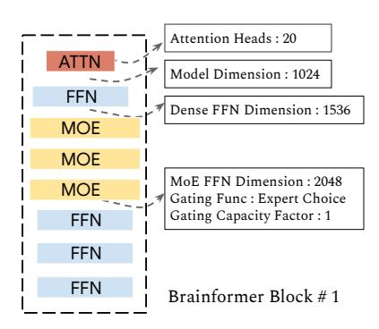

# 4. Token-based Routing Versus Expert-based Routing

While there are various routing methods in existing MoE literature, we primarily focus on two classes of routing: token-based routing and expert-based routing, to illustrate the idea that routing strategy can change the optimal model architecture when sparsely activated layers are introduced.

As an example, in Figure 6, the rows and columns contain un-normalized scores computed for four tokens and four experts. Each value is produced by the dot product of the token embedding and the expert embedding. Once the token-to-expert affinity scores are generated, there are a few ways to decide which experts each token should be routed to. In token-based routing, the model routes to the top-k experts for each token, while in an expert-based routing, the experts choose top-k tokens. More particularly, we follow the top-2 gating approach used in GShard (Lepikhin et al., 2021) and GLaM (Du et al., 2022) as top-2 has demonstrated stronger empirical performance than top-1 gating. For the expert-based gating, we follow the Expert Choice gating (Zhou et al., 2022) where perfect load balance is achieved with heterogeneous parameter allocation.

There are various ways of generating the token-to-expert affinity scores. One possible way is to create a trainable gating matrix  $W_g$  that projects the input feature space to a token-to-expert score. The score should be normalized either along the token dimension or the expert dimension. To avoid causal leakage in decoding mode, we suggest normalizing along the expert dimension for both token-based routing and expert-based routing.

#### 5. Evaluation

**Setup:** Table 2 summarizes the hyperparameter settings of different baseline MoE models. In the baseline MoE GLaM (Du et al., 2022) model, we interleave transformer blocks with regular dense FFNs and transformer blocks with sparsely gated FFNs (MoE layer). As a reference point, we also include the respective dense model configurations with

Table 2: Sizes and architectures of baseline dense models and MoE (GLaM) models. Models are grouped by the number of activated parameters per token.

| Model            | Type         | $n_{\rm params}$ | $n_{\rm act-params}$ | L  | M     | Н      | $n_{\rm heads}$ | $d_{\rm head}$ | E       |
|------------------|--------------|------------------|----------------------|----|-------|--------|-----------------|----------------|---------|
| 0.1B 0.1B/32E | Dense MoE | 130M 1.9B     | 130M 145M         | 12 | 768   | 3,072  | 12              | 64             | - 32 |
| 1.7B 1.7B/64E | Dense MoE | 1.7B 27B      | 1.700B 1.879B     | 24 | 2,048 | 8,192  | 16              | 128            | - 64 |
| 8B 8B/64E     | Dense MoE | 8.7B 143B     | 8.7B 9.8B         | 32 | 4,096 | 16,384 | 32              | 128            | - 64 |

Figure 7: (a) Pre-training perplexity comparison for 100M32E (100M parameters per expert, 32 experts). Search-w-top2 is the model found by using neural architecture search but with fixed top-2 token-based gating. (b) Training perplexity comparison for 8B64E (8B parameters per experts, 64 experts). Expert Choice is the GLaM architecture with expert-based gating function.

comparable numbers of activated parameters per-token during inference in the table. With a similar number of activated parameters as a 0.1B dense model, 0.1B/32E represents the sparse model with every other transformer layer replaced by a 32-expert MoE layer. While  $n_{\rm params}$  is the total number of trainable parameters,  $n_{\rm act-params}$  represents the number of activated parameters per token.  $n_{\rm act-params}$  roughly approximates the computational expensive of a model. L is the total number of Transformer layers, M is the model dimension, H is the hidden dimension after the projection in each transformer layer,  $n_{\rm heads}$  is the number of attention heads, and  $d_{\rm head}$  is the hidden dimension of each attention head. We train and evaluate our Brainformer models and baseline models on 64 Cloud TPU-V4 chips, except for models at the 8B-scale which take 512 Cloud TPU-V4 chips to train.

**Dataset:** We use the high-quality dataset from GLaM of 1.6 trillion tokens that are representative of a wide range of natural language use cases. This dataset consists of a high-

quality filtered subset of webpages that are combined with smaller corpora of books, Wikipedia pages, conversations, forums, and news to create the final dataset. A more detailed description of the dataset including the data and mixture weights can be found in the GLaM paper (Du et al., 2022).

**Model Training:** We train a few decoder-only models using the searched best Brainformer blocks and related baselines. Brainformer-1 and Brainformer-2 are two selected best models. With limited computational resources, we only scale Brainformer-1 to 1B and 8B scales. Our model training follows the setup of GLaM where a maximum sequence length of 1024 tokens is used. We use an Adafactor optimizer (Shazeer & Stern, 2018) with first-moment decay  $\beta_1 = 0$  and second-moment decay  $\beta_2 = 0.99$ . The learning rate is kept constant for the first 10K training steps, then is decayed with an inverse square root schedule. We use the SentencePiece subword tokenizer with a vocabulary of size of 256K. The 100M-scale models and 1B-scale models

Table 3: Training efficiency comparison. Brainformer models have better training convergence and faster step times, compared to GLaM, fixed gating search, and expert-based gating but with fixed architecture. Brainformer-1 and Brainformer-2 are two selected best models. With limited computational resources, we only scale Brainformer-1 to 1B and 8B scales.

| Model               | Total Params | Activated Params | Train Steps | Steps/Sec | PPLX           |
|---------------------|--------------|------------------|-------------|-----------|----------------|
| 100M32E             |              |                  |             |           |                |
| GLaM                | 1B           | 145M             | 0.5M        | 1.92      | 2.73 +/- 0.002 |
| Search-w-Top2       | 1.87B        | 210M             | 0.5M        | 2.03      | 2.67 +/- 0.005 |
| Brainformer-1       | 3.19B        | 156M             | 0.5M        | 2.03      | 2.57 +/- 0.003 |
| Brainformer-2       | 3.33B        | 266M             | 0.5M        | 2.16      | 2.59 +/- 0.005 |
| 1B64E               |              |                  |             |           |                |
| GLaM                | 27B          | 1.88B            | 1.0M        | 1.23      | 2.25 +/- 0.004 |
| Search-w-Top2       | 27B          | 3.05B            | 1.0M        | 1.27      | 2.21 +/- 0.003 |
| Brainformer-1       | 30B          | 1.38B            | 1.0M        | 2.00      | 2.25 +/- 0.002 |
| Brainformer-2       | 52B          | 1.31B            | 1.0M        | 1.76      | 2.23 +/- 0.001 |
| 8B64E               |              |                  |             |           |                |
| GLaM                | 143B         | 9.8B             | 1.5M        | 0.39      | 2.12 +/- 0.002 |
| Expert-based Gating | 143B         | 9.8B             | 1.5M        | 0.50      | 2.03 +/- 0.005 |
| Brainformer-1       | 158B         | 7.4B             | 1.5M        | 1.96      | 1.99 +/- 0.002 |

are trained with 64 TPU V4 chips, while the largest model (8B/64E) evaluated is trained on 512 TPU V4 chips. We don't use any dropout during training because the training corpus is large enough that each sample is only encountered once.

Model Evaluation: We mainly focus on two types of downstream evaluation: 1) Fine-tuning performance on 11 selected classification tasks from the GLUE and SuperGLUE benchmarks [\(Wang et al., 2018;](#page-10-13) [2019\)](#page-10-14). 2) We evaluate oneshot performance with five language generation tasks focused on question answering.

#### 5.1. Training Convergence

In this section, we evaluate Brainformer top models with related baselines including 1) Top-2 gating based model architecture search (Search-w-Top2) and 2) GLaM [\(Du et al.,](#page-8-2) [2022\)](#page-8-2), a manually crafted architecture with fixed top-2 gating. Providing the flexibility of tuning the gating function and network architecture significantly improves pre-training efficiency. As shown in table [3,](#page-6-0) our searched best Brainformer models outperform the baselines in terms of computational cost (activated parameters), training step time (steps/sec), and training perplexity (PPLX) for fixed training steps. When scaled to 8B64E, Brainformer converges to lower perplexity and is more than 5x faster in step time and 2x faster in training convergence using the same hardware configuration (512 Cloud TPU-V4 chips). With a fixed 600B training tokens, Brainformer is much more accurate than the baselines at 8B scale.

#### 5.2. Finetuning Results

We pretrain the models for a total fixed wall clock time as the baseline GLaM model. We then finetune the models with eleven selected GLUE and SuperGLUE classification tasks. At two different scales, 100M64E and 1B64E, Brainformers outperform the baseline GLaM model by a significant margin of 2-4% average score. The fine-tuning results in table [4](#page-7-0) indicates that Brainformer not only excels at training convergence but also generalizes well to downstream tasks.

#### 5.3. Fewshot Results

Aligned with prior work in fewshot in-context learning, we compare Brainformer oneshot performance on five selected generative tasks in table [5:](#page-7-1) Natural Questions [\(Kwiatkowski](#page-9-20) [et al., 2019\)](#page-9-20), TriviaQA [\(Joshi et al., 2017\)](#page-9-21), Web Questions [\(Berant et al., 2013\)](#page-8-8), Squadv2 [\(Rajpurkar et al., 2018\)](#page-10-15), and Lambada [\(Paperno et al., 2016\)](#page-9-22), with a sparse model GLaM and a dense model Primer [\(So et al., 2021\)](#page-10-16) of similar activated memory size. Brainformer outperforms Primer and GLaM by a large margin on all the tasks except Nqs being slightly worse than GLaM. GLaM yields competitive scores while being 2x slower than Brainformer.

## 6. Discussion

#### 6.1. Visualizing a Brainformer Block

In this section, fig. [9](#page-7-2) provides a visualization of a Brainformer architecture block. Unlike a conventional transformer block, where there is only an attention layer and a dense feed-forward layer, a Brainformer block contains 8 sub-layers. The Brianformer block is repeated 3 times, 6

Table 4: Finetuning Results on GLUE/superGLUE: Brainformers at 100M and 1B significantly outperform GLaM counterparts, yielding over 3% gains in overall scores.

| Size    | Model         | BoolQ | CB    | CoLA  | MNLI  | MRPC  | QNLI  |
|---------|---------------|-------|-------|-------|-------|-------|-------|
|         | GLaM          | 0.791 | 0.859 | 0.818 | 0.849 | 0.833 | 0.901 |
| 100M64E | Brainformer-1 | 0.812 | 0.922 | 0.828 | 0.855 | 0.870 | 0.907 |
|         | GLaM          | 0.829 | 0.938 | 0.831 | 0.860 | 0.857 | 0.919 |
| 1B64E   | Brainformer-1 | 0.859 | 0.938 | 0.863 | 0.896 | 0.875 | 0.938 |
| Size    | Model         | QQP   | RTE   | SST2  | WiC   | WNLI  | AVG   |
|         | GLaM          | 0.907 | 0.808 | 0.952 | 0.687 | 0.609 | 0.819 |
| 100M64E | Brainformer-1 | 0.812 | 0.840 | 0.952 | 0.702 | 0.635 | 0.840 |
| 1B64E   | GLaM          | 0.911 | 0.816 | 0.945 | 0.711 | 0.547 | 0.833 |
|         | Brainformer-1 | 0.917 | 0.899 | 0.972 | 0.720 | 0.719 | 0.873 |

Table 5: Oneshot evaluation on five important generative tasks. All models are trained with 200B training tokens.

| Model                       | Nqs  | Triviaqa | Webqa | Squadv2 | Lambada | Steps/Sec |
|-----------------------------|------|----------|-------|---------|---------|-----------|
| GLaM 1B64E                  | 9.14 | 41.8     | 10.8  | 46.2    | 25.2    | 0.55      |
| Primer 1B (So et al., 2021) | 4.82 | 24.7     | 6.50  | 49.2    | 22.6    | 1.50      |
| Brainformer 1B64E           | 8.23 | 43.4     | 12.0  | 49.5    | 25.7    | 1.37      |

times, and 8 times respectively in the 100M, 1B, and 8B scale. In a vanilla transformer model, a dense FFN layer has an optimized expansion ratio of 4, which results in a hidden dimension 4x wider than the model dimension. In the optimized Brainformer block 1 and 2, the search algorithm picks a slightly larger model dimension of 1024 (as compared to 768) and a smaller expansion factor in the dense FFNs and MoE layers (as compared to 3072). This is a reasonable optimization, as MoE layers effectively widen the network with more experts. In the MoE layers, the search algorithm picks the expert choice gating function [\(Zhou et al., 2022\)](#page-10-5) with a capacity factor of one in Brainformer block 1, resulting in a very sparse network in which each token can be routed to a single expert on average. Being much faster in step time, block 1 takes more training steps, thus training data to achieve good quality. Therefore, we also picked another strong candidate, Brainformer block 2, in which a larger capacity factor in the MoE layers is selected. Block 2 is lightly slower in step time, but takes fewer training steps to get good accuracy, thus is more data efficient.

#### 6.2. Can We Simplify?

We did an ablation study on block simplification. A very natural question to ask is whether we can simplify the architecture block. In exploring the answer to this question we were able to extrapolate some patterns. We find that the ratio of different layer types is critical to model quality: replacing a layer with a different layer results in degraded quality. However, the network is relatively insensitive to

layer order, such that swapping any two layers would not affect performance much. For example, to create a simplified pattern, we can interleave the dense FFNs and MoE layers or simply creating contiguous layers of the same type.

Figure 8: Brainformer Block # 1

Figure 9: Brainformer Block # 2

## 7. Conclusion

Using an evolutionary search algorithm, we have developed and evaluated a complex architecture block, named Brainformer, that consists of a diverse sequence of layers, including a sparsely gated feed-forward layer. Along with the new block, we also propose evaluating using a fixed training time search, which enables fair comparisons across model families. Brainformer demonstrates up to 2× faster training convergence and 5× faster step time compared to its GLaM counterpart. In downstream task evaluation, Brainformer also demonstrates a 3% higher SuperGLUE score with finetuning compared to GLaM, and greatly outperforms Primer on oneshot evaluation for five generative tasks.

## 8. Limitations

In terms of research scope, our empirical results are primarily on NLP domain, thoroughly on a wide range of NLU and NLG tasks. However, we leave it to future work to apply Brainformer to computer vision.

When adopting Brainformer targeting different hardware platforms, there can be potential intricacies. For example, edge devices can impose strict hardware constraints that restricts the expression of Brainformer models. A practical way is to run model training and quality evaluation on faster accelerators such as GPUs or TPUs while simulating the step time for the target hardware or using a learnt performance model to predict the inference speed on the target hardware. Another issue is some fundamental operators might not be supported on a device lacking sufficient on-chip memories. For example, global pooling is not supported on edge TPU. But that can be out of scope for this paper, as Brainformer aims to construct a compute-efficient model architecture out of feasible operators.

Another limitation can be large resource consumption. In the Brainformer search, we used 512 TPU v4 for a week to arrive at the best solutions. However, worth mentioning that we are working at a much large model scale and this will be mitigated when we use a smaller model size and smaller number of experts in the MoE layers. Also, the search identified better model architecture within as early as 500 trials. Practically, the resource consumption can be small if we only need to identify better but suboptimal models.

## References

Berant, J., Chou, A., Frostig, R., and Liang, P. Semantic parsing on Freebase from question-answer pairs. In *Proceedings of the 2013 Conference on Empirical Methods in Natural Language Processing*, pp. 1533–1544, Seattle, Washington, USA, October 2013. Association for Com-

- putational Linguistics. URL [https://www.aclweb.](https://www.aclweb.org/anthology/D13-1160) [org/anthology/D13-1160](https://www.aclweb.org/anthology/D13-1160).
- Brown, T., Mann, B., Ryder, N., Subbiah, M., Kaplan, J. D., Dhariwal, P., Neelakantan, A., Shyam, P., Sastry, G., Askell, A., Agarwal, S., Herbert-Voss, A., Krueger, G., Henighan, T., Child, R., Ramesh, A., Ziegler, D., Wu, J., Winter, C., Hesse, C., Chen, M., Sigler, E., Litwin, M., Gray, S., Chess, B., Clark, J., Berner, C., McCandlish, S., Radford, A., Sutskever, I., and Amodei, D. Language models are few-shot learners. In Larochelle, H., Ranzato, M., Hadsell, R., Balcan, M. F., and Lin, H. (eds.), *Advances in Neural Information Processing Systems*, volume 33, pp. 1877–1901. Curran Associates, Inc., 2020a. URL [https://proceedings.](https://proceedings.neurips.cc/paper/2020/file/1457c0d6bfcb4967418bfb8ac142f64a-Paper.pdf) [neurips.cc/paper/2020/file/](https://proceedings.neurips.cc/paper/2020/file/1457c0d6bfcb4967418bfb8ac142f64a-Paper.pdf) [1457c0d6bfcb4967418bfb8ac142f64a-Paper](https://proceedings.neurips.cc/paper/2020/file/1457c0d6bfcb4967418bfb8ac142f64a-Paper.pdf). [pdf](https://proceedings.neurips.cc/paper/2020/file/1457c0d6bfcb4967418bfb8ac142f64a-Paper.pdf).
- Brown, T., Mann, B., Ryder, N., Subbiah, M., Kaplan, J. D., Dhariwal, P., Neelakantan, A., Shyam, P., Sastry, G., Askell, A., et al. Language models are few-shot learners. *Advances in neural information processing systems*, 33: 1877–1901, 2020b.
- Cho, K. and Bengio, Y. Exponentially increasing the capacity-to-computation ratio for conditional computation in deep learning. *arXiv preprint arXiv:1406.7362*, 2014.
- Choromanski, K., Likhosherstov, V., Dohan, D., Song, X., Gane, A., Sarlos, T., Hawkins, P., Davis, J., Mohiuddin, A., Kaiser, L., et al. Rethinking attention with performers. *arXiv preprint arXiv:2009.14794*, 2020.
- Chowdhery, A., Narang, S., Devlin, J., Bosma, M., Mishra, G., Roberts, A., Barham, P., Chung, H. W., Sutton, C., Gehrmann, S., et al. Palm: Scaling language modeling with pathways. *arXiv preprint arXiv:2204.02311*, 2022.
- Dai, A. M. and Le, Q. V. Semi-supervised sequence learning. In Cortes, C., Lawrence, N., Lee, D., Sugiyama, M., and Garnett, R. (eds.), *Advances in Neural Information Processing Systems*, volume 28. Curran Associates, Inc., 2015. URL [https://proceedings.](https://proceedings.neurips.cc/paper/2015/file/7137debd45ae4d0ab9aa953017286b20-Paper.pdf) [neurips.cc/paper/2015/file/](https://proceedings.neurips.cc/paper/2015/file/7137debd45ae4d0ab9aa953017286b20-Paper.pdf) [7137debd45ae4d0ab9aa953017286b20-Paper](https://proceedings.neurips.cc/paper/2015/file/7137debd45ae4d0ab9aa953017286b20-Paper.pdf). [pdf](https://proceedings.neurips.cc/paper/2015/file/7137debd45ae4d0ab9aa953017286b20-Paper.pdf).
- Dai, Z., Liu, H., Le, Q. V., and Tan, M. CoAtNet: Marrying convolution and attention for all data sizes. In *Advances in Neural Information Processing Systems*, 2021.
- Du, N., Huang, Y., Dai, A. M., Tong, S., Lepikhin, D., Xu, Y., Krikun, M., Zhou, Y., Yu, A. W., Firat, O., et al. Glam: Efficient scaling of language models with mixture-ofexperts. In *International Conference on Machine Learning*, pp. 5547–5569. PMLR, 2022.

- Dua, D., Bhosale, S., Goswami, V., Cross, J., Lewis, M., and Fan, A. Tricks for training sparse translation models. *arXiv preprint arXiv:2110.08246*, 2021.
- Fedus, W., Zoph, B., and Shazeer, N. Switch transformers: Scaling to trillion parameter models with simple and efficient sparsity, 2021.
- Ghiasi, G., Lin, T.-Y., and Le, Q. V. Nas-fpn: Learning scalable feature pyramid architecture for object detection. In *Proceedings of the IEEE/CVF conference on computer vision and pattern recognition*, pp. 7036–7045, 2019.
- Gross, S., Ranzato, M., and Szlam, A. Hard mixtures of experts for large scale weakly supervised vision. In *Proceedings of the IEEE Conference on Computer Vision and Pattern Recognition*, pp. 6865–6873, 2017.
- He, K., Zhang, X., Ren, S., and Sun, J. Deep residual learning for image recognition. In *Proceedings of the IEEE conference on computer vision and pattern recognition*, pp. 770–778, 2016a.
- He, K., Zhang, X., Ren, S., and Sun, J. Identity mappings in deep residual networks. In *European conference on computer vision*, pp. 630–645. Springer, 2016b.
- Hoffmann, J., Borgeaud, S., Mensch, A., Buchatskaya, E., Cai, T., Rutherford, E., Casas, D. d. L., Hendricks, L. A., Welbl, J., Clark, A., et al. Training compute-optimal large language models. *arXiv preprint arXiv:2203.15556*, 2022.
- Hua, W., Dai, Z., Liu, H., and Le, Q. Transformer quality in linear time. In *International Conference on Machine Learning*, pp. 9099–9117. PMLR, 2022.
- Jaszczur, S., Chowdhery, A., Mohiuddin, A., Kaiser, L., Gajewski, W., Michalewski, H., and Kanerva, J. Sparse is enough in scaling transformers. *Advances in Neural Information Processing Systems*, 34:9895–9907, 2021.
- Joshi, M., Choi, E., Weld, D. S., and Zettlemoyer, L. Triviaqa: A large scale distantly supervised challenge dataset for reading comprehension. In *Proceedings of the 55th Annual Meeting of the Association for Computational Linguistics*, Vancouver, Canada, July 2017. Association for Computational Linguistics.
- Kaplan, J., McCandlish, S., Henighan, T., Brown, T. B., Chess, B., Child, R., Gray, S., Radford, A., Wu, J., and Amodei, D. Scaling laws for neural language models. *arXiv preprint arXiv:2001.08361*, 2020.
- Kwiatkowski, T., Palomaki, J., Redfield, O., Collins, M., Parikh, A., Alberti, C., Epstein, D., Polosukhin, I., Kelcey, M., Devlin, J., Lee, K., Toutanova, K. N., Jones, L., Chang, M.-W., Dai, A., Uszkoreit, J., Le, Q., and

- Petrov, S. Natural questions: a benchmark for question answering research. *Transactions of the Association of Computational Linguistics*, 2019.
- Lepikhin, D., Lee, H., Xu, Y., Chen, D., Firat, O., Huang, Y., Krikun, M., Shazeer, N., and Chen, Z. GShard: Scaling giant models with conditional computation and automatic sharding. In *International Conference on Learning Representations*, 2021.
- Lewis, M., Bhosale, S., Dettmers, T., Goyal, N., and Zettlemoyer, L. Base layers: Simplifying training of large, sparse models. In *International Conference on Machine Learning*, pp. 6265–6274. PMLR, 2021.
- Lin, M., Fu, J., and Bengio, Y. Conditional computation for continual learning. *arXiv preprint arXiv:1906.06635*, 2019.
- Liu, H., Dai, Z., So, D., and Le, Q. V. Pay attention to mlps. *Advances in Neural Information Processing Systems*, 34: 9204–9215, 2021.
- Mikolov, T., Karafiát, M., Burget, L., Cernocky, J., and ` Khudanpur, S. Recurrent neural network based language model. In *Interspeech*, volume 2, pp. 1045–1048. Makuhari, 2010.
- Paperno, D., Kruszewski, G., Lazaridou, A., Pham, Q. N., Bernardi, R., Pezzelle, S., Baroni, M., Boleda, G., and Fernández, R. The lambada dataset: Word prediction requiring a broad discourse context, 2016. URL [https:](https://arxiv.org/abs/1606.06031) [//arxiv.org/abs/1606.06031](https://arxiv.org/abs/1606.06031).
- Press, O., Smith, N. A., and Levy, O. Improving transformer models by reordering their sublayers. *arXiv preprint arXiv:1911.03864*, 2019.
- Puigcerver, J., Riquelme, C., Mustafa, B., Renggli, C., Pinto, A. S., Gelly, S., Keysers, D., and Houlsby, N. Scalable transfer learning with expert models. *arXiv preprint arXiv:2009.13239*, 2020.
- Radford, A., Narasimhan, K., Salimans, T., and Sutskever, I. Improving language understanding by generative pretraining. 2018.
- Rae, J. W., Borgeaud, S., Cai, T., Millican, K., Hoffmann, J., Song, F., Aslanides, J., Henderson, S., Ring, R., Young, S., et al. Scaling language models: Methods, analysis & insights from training gopher. *arXiv preprint arXiv:2112.11446*, 2021.
- Raffel, C., Shazeer, N., Roberts, A., Lee, K., Narang, S., Matena, M., Zhou, Y., Li, W., Liu, P. J., et al. Exploring the limits of transfer learning with a unified text-to-text transformer. *J. Mach. Learn. Res.*, 21(140):1–67, 2020.

- Rajpurkar, P., Jia, R., and Liang, P. Know what you don't know: Unanswerable questions for squad, 2018. URL <https://arxiv.org/abs/1806.03822>.
- Roller, S., Sukhbaatar, S., Weston, J., et al. Hash layers for large sparse models. *Advances in Neural Information Processing Systems*, 34:17555–17566, 2021.
- Shazeer, N. and Stern, M. Adafactor: Adaptive learning rates with sublinear memory cost. In *International Conference on Machine Learning*, pp. 4596–4604. PMLR, 2018.
- Shazeer, N., Mirhoseini, A., Maziarz, K., Davis, A., Le, Q., Hinton, G., and Dean, J. Outrageously large neural networks: The sparsely-gated mixture-of-experts layer. *arXiv preprint arXiv:1701.06538*, 2017.
- Shoeybi, M., Patwary, M., Puri, R., LeGresley, P., Casper, J., and Catanzaro, B. Megatron-lm: Training multibillion parameter language models using model parallelism. *arXiv preprint arXiv:1909.08053*, 2019.
- So, D., Manke, W., Liu, H., Dai, Z., Shazeer, N., and Le, ´ Q. V. Searching for efficient transformers for language modeling. *Advances in Neural Information Processing Systems*, 34:6010–6022, 2021.
- Sutskever, I., Martens, J., and Hinton, G. E. Generating text with recurrent neural networks. In *ICML*, 2011.
- Tan, M. and Le, Q. Efficientnet: Rethinking model scaling for convolutional neural networks. In *International conference on machine learning*, pp. 6105–6114. PMLR, 2019.
- Tay, Y., Bahri, D., Metzler, D., Juan, D.-C., Zhao, Z., and Zheng, C. Synthesizer: Rethinking self-attention for transformer models. In *International conference on machine learning*, pp. 10183–10192. PMLR, 2021.
- Tolstikhin, I. O., Houlsby, N., Kolesnikov, A., Beyer, L., Zhai, X., Unterthiner, T., Yung, J., Steiner, A., Keysers, D., Uszkoreit, J., et al. Mlp-mixer: An all-mlp architecture for vision. *Advances in Neural Information Processing Systems*, 34:24261–24272, 2021.
- Vaswani, A., Shazeer, N., Parmar, N., Uszkoreit, J., Jones, L., Gomez, A. N., Kaiser, Ł., and Polosukhin, I. Attention is all you need. *Advances in neural information processing systems*, 30, 2017.
- Wang, A., Singh, A., Michael, J., Hill, F., Levy, O., and Bowman, S. R. Glue: A multi-task benchmark and analysis platform for natural language understanding. *arXiv preprint arXiv:1804.07461*, 2018.

- Wang, A., Pruksachatkun, Y., Nangia, N., Singh, A., Michael, J., Hill, F., Levy, O., and Bowman, S. Superglue: A stickier benchmark for general-purpose language understanding systems. *Advances in neural information processing systems*, 32, 2019.
- Wang, S., Li, B. Z., Khabsa, M., Fang, H., and Ma, H. Linformer: Self-attention with linear complexity. *arXiv preprint arXiv:2006.04768*, 2020.
- Wu, L., Liu, M., Chen, Y., Chen, D., Dai, X., and Yuan, L. Residual mixture of experts. *arXiv preprint arXiv:2204.09636*, 2022.
- Zhou, Y., Lei, T., Liu, H., Du, N., Huang, Y., Zhao, V., Dai, A., Chen, Z., Le, Q., and Laudon, J. Mixture-ofexperts with expert choice routing, 2022. URL [https:](https://arxiv.org/abs/2202.09368) [//arxiv.org/abs/2202.09368](https://arxiv.org/abs/2202.09368).
- Zuo, S., Liu, X., Jiao, J., Kim, Y. J., Hassan, H., Zhang, R., Zhao, T., and Gao, J. Taming sparsely activated transformer with stochastic experts. *arXiv preprint arXiv:2110.04260*, 2021.

## A. You *can* have an appendix here.

You can have as much text here as you want. The main body must be at most 8 pages long. For the final version, one more page can be added. If you want, you can use an appendix like this one, even using the one-column format.