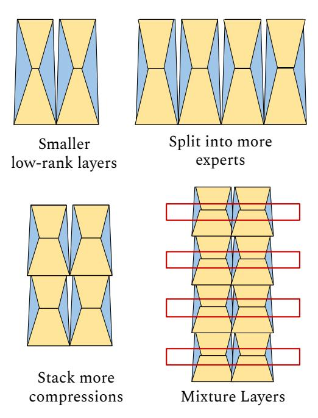
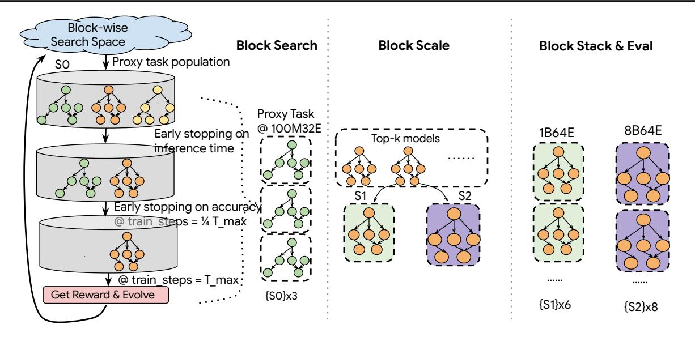
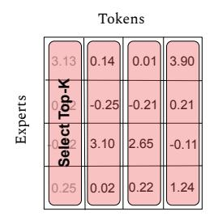

## **Brainformers: Trading Simplicity for Efficiency**

Yanqi Zhou <sup>1</sup> Nan Du <sup>1</sup> Yanping Huang <sup>1</sup> Daiyi Peng <sup>1</sup> Chang Lan <sup>1</sup> Da Huang <sup>1</sup> Siamak Shakeri <sup>1</sup> David So <sup>1</sup> Andrew Dai <sup>1</sup> Yifeng Lu <sup>1</sup> Zhifeng Chen <sup>1</sup> Quoc Le <sup>1</sup> Claire Cui <sup>1</sup> James Laudon <sup>1</sup> Jeff Dean <sup>1</sup>

#### **Abstract**

Transformers are central to recent successes in natural language processing and computer vision. Transformers have a mostly uniform backbone where layers alternate between feed-forward and self-attention in order to build a deep network. Here we investigate this design choice and find that more complex blocks that have different permutations of layer primitives can be more efficient. Using this insight, we develop a complex block, named Brainformer, that consists of a diverse sets of layers such as sparsely gated feed-forward layers, dense feed-forward layers, attention layers, and various forms of layer normalization and activation functions. Brainformer consistently outperforms the state-of-the-art dense and sparse Transformers, in terms of both quality and efficiency. A Brainformer model with 8 billion activated parameters per token demonstrates 2× faster training convergence and  $5 \times$  faster step time compared to its GLaM counterpart. In downstream task evaluation, Brainformer also demonstrates a 3% higher SuperGLUE score with fine-tuning compared to GLaM with a similar number of activated parameters. Finally, Brainformer largely outperforms a Primer dense model derived with NAS with similar computation per token on fewshot evaluations.

### 1. Introduction

In recent years, large neural networks derived from from the Transformer architecture (Vaswani et al., 2017) have demonstrated superior results on language understanding and generative tasks. Many improvements on Transformer variants have come from scaling the size of models (Raffel et al., 2020; Brown et al., 2020a; Shoeybi et al., 2019; Chowdhery et al., 2022), scaling the training tokens (Hoff-

Proceedings of the 40<sup>th</sup> International Conference on Machine Learning, Honolulu, Hawaii, USA. PMLR 202, 2023. Copyright 2023 by the author(s).

<span id="page-0-0"></span>

Figure 1: Brainformer Vs. GLaM in Scaling. Brainformer improves model quality at much faster training step time.

mann et al., 2022; Shoeybi et al., 2019), better training data quality (Du et al., 2022), and sparsely activated model architectures (Du et al., 2022; Lepikhin et al., 2021; Roller et al., 2021; Lewis et al., 2021).

Among the efficient transformer language models (Wang et al., 2020; Choromanski et al., 2020; Tay et al., 2021; Hua et al., 2022), there is a focus on improving attention-layer efficiency using low-rank approaches or approximations. However, recent work has also identified that dense feedforward layers constitute most of the computational cost for common sequence lengths ( $\leq 2048$ ), particularly when the model is large (Du et al., 2022; Zhou et al., 2022). To further improve compute efficiency such as total FLOPs used during training to reach convergence, sparsely gated Mixture-of-Experts (Lepikhin et al., 2021; Fedus et al., 2021; Du et al., 2022; Zhou et al., 2022; Roller et al., 2021; Lewis et al., 2021; Jaszczur et al., 2021) have become prevalent, giving the model a larger overall capacity to improve quality while holding computational cost fixed. Sparsely activated models not only reduce the computational cost, but also have better specialization by training different experts on different data distributions through the use of a routing function without reducing the effective training time for each expert. The MoE architectures in this line of work are based on uniform transformer blocks or interleaving dense and sparse layers (Du et al., 2022) and a fixed top-k routing.

<sup>&</sup>lt;sup>1</sup>Google Deepmind. Correspondence to: Yanqi Zhou <yanqiz@google.com>.

<span id="page-1-0"></span>

Figure 2: High-level Comparison with Related Work. 'a': attention, 'f': feed-forward, 'g': sparsely gated feed-forward. GLaM interleaves dense transformer blocks with sparse transformer blocks. Brainformer reduces the frequency of attention and changes layer widths together with layer types.

Resonating with the layer-wise architecture stacking in EfficientNet (Tan & Le, 2019) and layer reordering in the sandwich transformer (Press et al., 2019), we propose a non-uniform architecture with sparsity where there is no strict layer interleaving as in the vanilla transformer in fig. 2. We trade off architecture regularity by allowing the search space to compose different sub-layers in different orders. For better scaling, we introduce sparsity in the search space with a sparsely gated feed-forward layer (MoE layer) coupled with different gating mechanisms.

We find that optimizing the architecture, sparsity, and routing mechanism in sparse layers is critical to achieve near-perfect log-scale scaling in quality. Figure 1 shows that Brainformer scales much better than GLaM (manually crafted sparse transformer). Brainformer consistently improves training perplexity while keeps example rate almost constant when increasing model capacity, however, GLaM has a much worse example rate when scaled up.

We only treat the MoE layer as a general method to sparsify the model. In practice, any conditional computation method can be blended in. We apply a simple evolutionary search to discover many attributes, such as the best way to interleave layers and layer capacities, when to fuse layers, and when to specialize layers with MoE modules. For ease of scaling, we propose a block-wise sub-layer grouping, such that stacking a variable number of blocks produces models of different scales, as illustrated in Stackable Brainformer in fig. 2. As our results in Section 5 show, this approach has proven effective in our evaluation at multiple model scales.

#### 2. Related Work

**Large Language Models:** Language models have demonstrated strong performance for many natural language pro-

cessing tasks (Mikolov et al., 2010; Sutskever et al., 2011; Dai & Le, 2015). Scaling up model capacity and number of training tokens has shown huge success in enhancing the performance of computer vision architectures (He et al., 2016a;b; Ghiasi et al., 2019; Dai et al., 2021) as well as neural language models (Radford et al., 2018; Brown et al., 2020b; Kaplan et al., 2020; Raffel et al., 2020; Shoeybi et al., 2019; Hoffmann et al., 2022).

Sparsely Activated Models: Conditional computation effectively increases the capacity of a deep neural network without increasing the total amount of computation, by activating certain parameters and computation on demand, based off the input token or sequence (Cho & Bengio, 2014; Puigcerver et al., 2020; Lin et al., 2019). The gating decisions may be binary or sparse and continuous, stochastic or deterministic. In a multi-device setting, sparsely-gated MoE (Shazeer et al., 2017) demonstrates massive improvements in model capacity, training time, or model quality with gating. Various MoE architectures including Switch Transformer (Fedus et al., 2021) and GLaM (Du et al., 2022) have been proposed. They adopt a token-based gating where an auxiliary loss is imposed to counter load imbalance issues. Recently, more advanced gating functions are devised to ameliorate load imbalance, improve speed, and downstream generalization (Roller et al., 2021; Dua et al., 2021; Zuo et al., 2021; Gross et al., 2017; Zhou et al., 2022; Jaszczur et al., 2021).

**Non-uniform Architectures:** EfficientNet represents one of the very early non-uniform architectures that leverages layer heterogeneity to achieve SoTA. Instead of searching for a new operator or a new block of operators, EfficientNet focuses on optimizing the layer compound coefficients to scale the model effectively. This heterogeneity leads to a model more than 8× smaller and more than 6× faster on inference (Tan & Le, 2019). Sandwich Transformer promotes a non-interleaved, non-uniform architecture for language modeling tasks. However, the sandwich reordering pattern does not guarantee performance gains across every task. Residual MoE (Wu et al., 2022) factorized the weights into an input-independent core and an input-dependent residual, thus achieves comparable results with the upper-bound MoE training while only introducing minor additional training cost than the lower-bound non-MoE training. In this work, we take inspiration from the earlier work but further improve scaling and generalization via automatic model discoveries.

#### <span id="page-1-1"></span>3. Method

#### 3.1. Deriving Our Model Components

There are various forms of computation factorization that can lead to lower computation cost or faster computation without penalizing model quality. As indicated in fig. 3, low-rank and multi-expert layers are two major methods for factorizing a matrix multiplication, both of which reduces FLOPs by half while not sacrificing model capacity. When devising an efficient neural network, as indicated in fig. 4, low-rank and multi-expert can be combined and stacked to achieve more interesting model architectures that are computationally efficient. Finally, by also coupling a temporal mixture layer (e.g. attention (Vaswani et al., 2017), gMLP (Liu et al., 2021) or MLP mixer (Tolstikhin et al., 2021)) which captures the causal relations between tokens, the network becomes a multi-expert transformer variant.

<span id="page-2-0"></span>

Figure 3: Two methods of matrix factorization: Low-rank and Multi-branch.

However, constructing an efficient network does not require conforming to the uniformity of the model architecture as illustrated in the last figure of fig. 4. By carefully selecting layer types and layer interleaving, as well as other hyperparameters layers, we could achieve higher quality, training efficiency, as well as better scaling. This leads our exploration towards a more training-efficient architecture by adopting low-rank and multi-expert compression methods with coarse-grain sparsity.

#### 3.2. Block-wise Architecture

We largely take inspiration from the layer-wise compound scaling in EfficientNet (Tan & Le, 2019). For the easiness of scaling, We construct a block-wise search space where the restriction of uniformly stacking layers is removed. Instead, we create a generic layer as a function  $Y_i = \mathcal{F}_i(X_i), \mathcal{F}_i \in \{\mathcal{F}_{\rm attn}, \mathcal{F}_{\rm moe}, \mathcal{F}_{\rm ffn}\}$  where  $\mathcal{F}_i$  is an operator selected from the operation set consisting of self attention, sparsely gated feed-forward (MoE), and dense feed-forward sub-layers as depicted in eq. (3). Input  $X_i$  has a tensor shape of  $\{B, L, H\}$  and  $H \in \{\frac{3}{4}, 1, \frac{3}{2}\} \times H_{\rm model\_dim}$ 

<span id="page-2-1"></span>

Figure 4: Evolving matrix factorization into transformerstyled model architecture.

where B is the batch size, L is the sequence length, and H is a tunable model dimension. The intuition behind tuning model dimension is to enable more flexible network topologies with various factorization methods as described in section 3.1. For example, we could instantiate a model with wider hidden dimensions or a model with experts but each expert being narrow.

Unlike a traditional simple, uniform transformer block, a Brainformer block is a complex block  $\mathcal{N}$  that can be represented by a list of composed layers in eq. (1):

<span id="page-2-2"></span>
$$\mathcal{N} = \mathcal{F}_k \odot ... \odot \mathcal{F}_2 \odot \mathcal{F}_1(X_1) = \bigcup_{j=1...k} \mathcal{F}_j(X_1)$$
 (1)

We can stack an arbitrary number of Brainformer blocks to create a target model. The search objective is to find an optimal layer architecture  $\mathcal{F}_i$ , and model scaling multipliers for multiple model inner dimensions that minimizes the perplexity. Table 1 summarizes the search space in a Brainformer architecture.

Figure 5 and Algorithm 1 illustrate the two phases that we use to discover compute-efficient Brainformer models. During the search, a regularized evolutionary search algorithm samples block architectures from the search space and trains the sampled architectures using a proxy training. In a proxy training task, a small 100M32E architecture is instantiated by stacking the sampled block three times. This matches the number of layers in a baseline GLaM architecture. We apply early stopping during the proxy training, where un-

<span id="page-3-1"></span>

Figure 5: Block-wise architecture search and stacking.

<span id="page-3-0"></span>Table 1: Search Space Table: Fattn is a self-attention layer, Fmoe is a sparsely gated FFN layer, and Fffn is a regular dense FFN layer. The baseline is a 100M 12-layer dense transformer model with Hmodel\_dim = 768.

| Search Item            | Search Space              |
|------------------------|---------------------------|
| Layer Type (Fi)        | Fattn, Fmoe, Fffn         |
| Model Dim. (d)         | 512, 768, 1024            |
| MoE Hidden Dim. (dmoe) | 1536, 2048, 3072, 4096    |
| FFN Hidden Dim. (dffn) | 1536, 2048, 3072, 4096    |
| Attention Heads. (h)   | 12, 16, 20                |
| Gating Func. (g)       | Top-2, Expert Choice      |
| Capacity Factor (c)    | 1, 2, 3, 4                |
| Activation Func. (a)   | Gated Re/GeLU, ReLU, GeLU |

promising models are pruned early due to the violation of inference time constraint or perplexity constraint at 25% of the maximum training steps, compared to the baseline GLaM architecture.

At the end of evolution, top-k block architectures with the highest rewards are evaluated at multiple target scales. In our evaluation, we first scale the model dimension and hidden dimension 2x and 4x, following the scaling factors presented in GLaM, to create block S1 and S2 targeting 1B and 8B model scale. Then we stack block S1 and S2 respectively to create 1B64E and 8B64E model variants. N in Algorithm [1](#page-3-2) can be determined mathematically according to the target total activated parameters. Our final evaluations are based on comparisons with baseline architectures at multiple scales.

#### <span id="page-3-2"></span>Algorithm 1 Brainformer Block Search

Require: A Block-wise architecture search space B. An evolutionary search algorithm with population size p.

```
1: for t = 1 to T0 do
 2: for B
           (i)
             in SamplePopulation(B, p) do
 3: G
         (i) ← StackThreeTimes(B
                                  (i)
                                    )
 4: if EarlyStopping(G
                          (i)
                            ) then
 5: R(i) = −1
 6: else
 7: Ai
             , T
                i ← Train(G
                           (i)
                              , Tmax)
 8: R(i) ← f(Ai
                       , T
                          i
                          )
 9: end if
10: end for
11: end for
12: Gtopk ← TopK({G(i)
                       , R(i)})
13: for G
        (i)
           in Gtopk do
14: G
       (i) ← ScaleModelDim(G
                              (i)
                                 )
15: G
       (i) ← StackNTimes(G
                            (i)
                              )
16: Ai
        , T
           i ← Train(G
                       (i)
                         )
17: end for
```

#### 3.3. Fair Comparisons Across Model Architectures

Prior NLP model scaling studies [\(Raffel et al., 2020;](#page-9-0) [Rad](#page-9-12)[ford et al., 2018;](#page-9-12) [Brown et al., 2020b;](#page-8-6) [Rae et al., 2021\)](#page-9-19) typically explore quality scaling with fixed model capacity and training steps/tokens. For example, a scaling plot typically fixes training steps/tokens while varying the model parameters. However, when training a model, users typically have a fixed budget and can trade-off training time, compute resources, and quality to stay within that budget. If what we care about is computational cost and training

<span id="page-4-4"></span>


Figure 6: Token-based routing vs. Expert-based routing.

convergence time, then comparing model qualities while fixing total parameters is not fair, particularly when comparing across model architectures and model families. For example, it may discriminate against models with more total parameters that consume fewer computational FLOPs, such as sparsely activated models. The GLaM paper (Du et al., 2022) addresses this by conducting a scaling study on activated memory (which approximates the computational cost), rather than the total parameter size, on a fixed number of training tokens. However, comparing models with a fixed amount of training tokens may still also not be fair as some smaller models can benefit more from additional training data and outperform a bigger model with the same total training cost (e.g. GPU hours, TPU hours, etc.). The Chinchilla paper (Hoffmann et al., 2022) is the first to suggest compute-efficient scaling, which varies both model capacity and training tokens at a fixed computational cost. Resonating with compute-efficient model scaling, we further take model architectural change into consideration during the search for efficient model architectures with better training convergence and inference time. More particularly, we compare across models with a fixed training cost and model inference time, which allows the search algorithm to trade off between model capacity and training tokens.

#### 3.4. Training Time Constrained Search

We fix the wall clock time for each search trial which encourages models with faster training convergence being discovered. The objective is to find model architectures that yield higher accuracy with a fixed training budget (number of chips times training hours). In an evolution search, a controller minimizes the pre-training validation cross-entropy loss in eq. (2) while meeting an inference time constraint in eq. (5). The block architecture is defined around a 100M vanilla transformer architecture, as illustrated in Table 2. Each trial is trained with a fixed wall clock time so that faster models can be compensated with more training steps. We empirically find that fixing training wall clock time while meeting a inference time constraint yields models with faster training convergence and higher quality.

$$\min_{\mathcal{F}_{1:k},d,d_{\text{moe}},d_{ffn},h,g,c,a} \mathcal{L}(\mathcal{N}(\mathcal{F}_{1:k},d,d_{\text{moe}},d_{ffn},h,g,c,a))$$

<span id="page-4-2"></span><span id="page-4-1"></span>
$$\mathcal{F}_{i} = \begin{cases}
\mathcal{F}_{i}^{d,h,a}, & \text{if } \mathcal{F}_{i} = \mathcal{F}_{attn} \\
\mathcal{F}_{i}^{d,d_{ffn},a}, & \text{else if } \mathcal{F}_{i} = \mathcal{F}_{ffn} \\
\mathcal{F}_{i}^{d,d_{\text{moe}},g,c,a}, & \text{otherwise } \mathcal{F}_{i} = \mathcal{F}_{\text{moe}}
\end{cases}$$
(3)

s.t. 
$$\mathcal{N}(\mathcal{F}_{1:k}, d, d_{\text{moe}}, d_{ff}, h, g, c, a) = \bigcup_{i=1...k} \mathcal{F}_i(X_1)$$
(4)

<span id="page-4-3"></span>Step Time(
$$\mathcal{N}$$
) < baseline step time (5)

