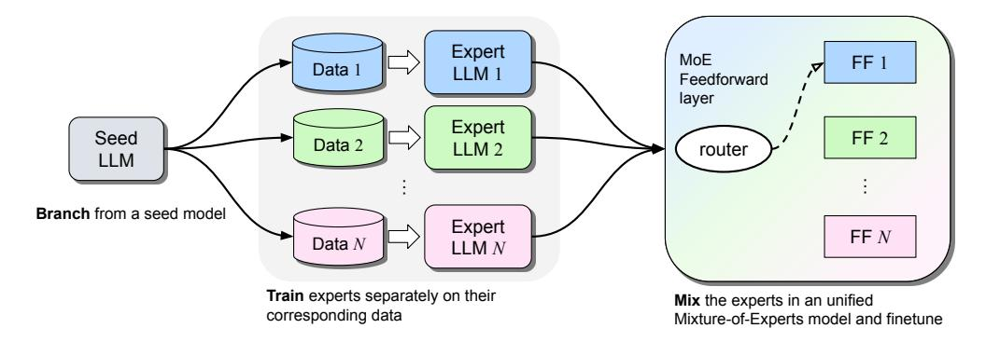
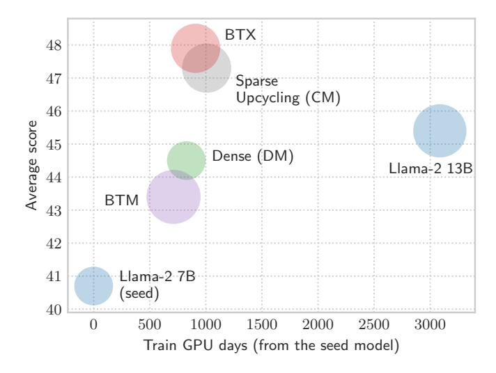
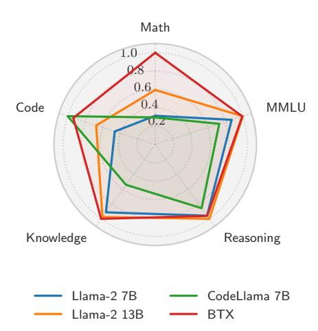
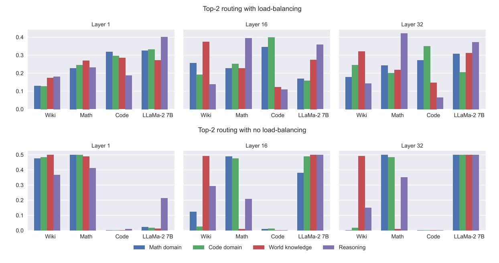

# Branch-Train-MiX: Mixing Expert LLMs into a Mixture-of-Experts LLM

Sainbayar Sukhbaatar, Olga Golovneva, Vasu Sharma, Hu Xu, Xi Victoria Lin, Baptiste Rozière, Jacob Kahn, Daniel Li, Wen-tau Yih, Jason Weston, Xian Li

FAIR at Meta

We investigate efficient methods for training Large Language Models (LLMs) to possess capabilities in multiple specialized domains, such as coding, math reasoning and world knowledge. Our method, named Branch-Train-MiX (BTX), starts from a seed model, which is branched to train experts in embarrassingly parallel fashion with high throughput and reduced communication cost. After individual experts are asynchronously trained, BTX brings together their feedforward parameters as experts in Mixture-of-Expert (MoE) layers and averages the remaining parameters, followed by an MoE-finetuning stage to learn token-level routing. BTX generalizes two special cases, the Branch-Train-Merge method, which does not have the MoE finetuning stage to learn routing, and sparse upcycling, which omits the stage of training experts asynchronously. Compared to alternative approaches, BTX achieves the best accuracy-efficiency tradeoff.

Date: March 13, 2024

Correspondence: {sainbar,xianl}@meta.com

## 1 Introduction

In recent years, Large Language Models (LLMs) have shown impressive performance in a wide-range of tasks [\(Brown et al.,](#page-12-0) [2020;](#page-12-0) [Touvron et al.,](#page-14-0) [2023;](#page-14-0) [Achiam et al.,](#page-12-1) [2023\)](#page-12-1), including code generation [\(Li et al.,](#page-13-0) [2022b;](#page-13-0) [Rozière et al.,](#page-14-1) [2023\)](#page-14-1), solving math problems [\(Azerbayev et al.,](#page-12-2) [2023\)](#page-12-2), multilinguality [\(Zhao et al.,](#page-14-2) [2024\)](#page-14-2), etc. Training such LLMs requires a large amount of compute and data, exceeding thousands of GPUs and trillions of tokens. The training parallelization is typically done by maintaining multiple copies of the model on different GPUs and keeping them synchronized after each weight update. The cost of this frequent communication is the main bottleneck in scaling the training to more GPUs. Besides this issue, synchronized training is more vulnerable to hardware failures as a single failed GPU can cause the whole training to halt [\(Zhang et al.,](#page-14-3) [2022;](#page-14-3) [Gemini Team,](#page-12-3) [2023\)](#page-12-3).

Recent work by [Li et al.](#page-13-1) [\(2022a\)](#page-13-1) proposed the Branch-Train-Merge (BTM) method for embarrassingly parallel training of LLMs without any synchronization for improving the throughput of pretraining. It starts by creating multiple copies of a seed LLM, then separately training each copy on different subsets of data. This results in multiple independent LLMs that do not share any parameters and each LLM is an expert specializing in its own data distribution, such as knowledge domains, languages or even modalities. At test time, an input prompt is classified into one or more of the domains, and then the final outputs are formed from the corresponding expert models which are combined to predict the next token. While this approach makes training more efficient, its main drawback is the lack of a unified single model making it impossible to do further supervised finetuning (SFT) or reinforcement learning from human feedback (RLHF) finetuning [\(Ouyang et al.,](#page-13-2) [2022\)](#page-13-2), both of which can boost performance further, and are crucial steps in building aligned LLMs.

A separate line of work for reducing the computational footprint of LLMs is the Mixture-of-Experts (MoE) approach [\(Jacobs et al.,](#page-13-3) [1991;](#page-13-3) [Shazeer et al.,](#page-14-4) [2017\)](#page-14-4), where only a subset of parameteters are active at any given time. In particular, MoE is applied to the feedforward sublayer of Transformers [\(Fedus et al.,](#page-12-4) [2022;](#page-12-4) [Roller et al.,](#page-14-5) [2021;](#page-14-5) [Lewis et al.,](#page-13-4) [2021\)](#page-13-4), allowing the total number of parameters to grow without additional computation. LLMs scaled in this way have shown impressive performance on downstream tasks [\(Jiang](#page-13-5) [et al.,](#page-13-5) [2024;](#page-13-5) [Xue et al.,](#page-14-6) [2024\)](#page-14-6). Unlike Branch-Train-Merge, Mixture-of-Experts are often trained in a fully

Figure 1 The Branch-Train-MiX (BTX) method has three steps: 1) branch from a pretrained seed LLM by making multiple copies of it; 2) train those copies separately on different subsets of data to obtain expert LLMs; 3) mix those expert LLMs by combining them into a single LLM using mixture-of-experts feedforward (FF) layers, and finetuning the overall unified model.

synchronized fashion, and the communication cost increases with the number of experts due to all-to-all communication.

In this paper, we aim for the best of both worlds, combining the advantages of Branch-Train-Merge and Mixture-of-Experts, while mitigating their disadvantages. We achieve this by training multiple expert LLMs separately as in the Branch-Train-Merge method, but subsequently combine those experts into a single model using an MoE architecture. More specifically, the feedforward sublayers from all the expert LLMs are brought together into a single MoE module at each layer, and a router network selects which feedforward expert to use at every token. We merge other modules of the expert LLMs, including self-attention layers, by simply averaging their weights. Then the resulting model is MoE-finetuned on all the combined data by continuing training, so that the router can learn to mix the expert feedforward (FF) modules. Figure 1 shows an overview of this method, which we call Branch-Train-MiX (BTX).

The main advantage of BTX compared to MoE is that expert training is embarrassingly parallel and asynchronous, reducing communication cost and increasing training throughput. Compared to Branch-Train-Merge, the final BTX model is a unified neural network that can be finetuned or used like any other standard LLM. The final BTX model will not significantly increase inference FLOPs compared to the seed model since it is sparsely activated, despite having a much larger number of parameters.

We conduct our experiments using Llama-2 7B (Touvron et al., 2023) as a seed model and train expert LLMs on different subsets of data corresponding to the domains of math, code and Wikipedia. With the original Llama-2 7B weights added as a fourth expert, we finetune the combined MoE model for a relatively short period compared to the pretraining process. The resulting BTX model brings significant improvements over the seed model on tasks across various domains, especially bridging the gap with specialized models on math and code related tasks, while retaining performance on the original capabilities where specialized models suffer from catastrophic forgetting. BTX outperforms BTM on all tasks demonstrating the benefits of learnt routing through MoE finetuning. Compared to purely MoE training such as sparse upcycling, BTX is more compute efficient with higher training throughput and more balanced performance across tasks in different domains.

#### 2 Related Work

Asynchronous parallel training Reducing communication between training workers for computational efficiency is a major topic of study for training deep learning systems. Zhang et al. (2015) introduced a method that allows model instances on different workers to diverge from each other, thus eliminating the constant need of synchronization. Instead, the workers are loosely synchronized to master weights using elastic averaging from time to time. A more recent work by Douillard et al. (2023) showed that less frequent synchronization of diverged workers by averaging their weight changes and applying Nesterov momentum works well in practice

for training LLMs. The Branch-Train-Merge method [\(Li et al.,](#page-13-1) [2022a;](#page-13-1) [Gururangan et al.,](#page-13-6) [2023\)](#page-13-6) takes parallel training to the extreme by running multiple training processes completely independently. Each training process uses specific domain data, thus the corresponding model becomes an expert in that domain. Finally, the output distributions of those expert models are averaged to make a next token prediction. Which experts to average is decided by classifying the input into one or more of the domains. [Wortsman et al.](#page-14-8) [\(2022\)](#page-14-8) showed simply averaging parameters of separately trained models improves performance, but the models only differed in their hyperparameters.

Mixture-of-Experts MoE is used to scale deep networks in [Shazeer et al.](#page-14-4) [\(2017\)](#page-14-4) using a simple Top-K routing scheme. Since the routing decisions are discrete and thus cannot be trained by gradient descent, various training methods have been explored for the Transformer architecture [\(Fedus et al.,](#page-12-4) [2022;](#page-12-4) [Lewis et al.,](#page-13-4) [2021\)](#page-13-4). Surprisingly [Roller et al.](#page-14-5) [\(2021\)](#page-14-5) showed that even a fixed routing scheme without any learning works well, if the routing is done via a random mapping based on input tokens. In larger scale experiments with recent LLMs, [Jiang et al.](#page-13-5) [\(2024\)](#page-13-5) demonstrated that the MoE approach can match the performance of dense LLM counterparts using a much smaller number of active parameters. A study by [Dai et al.](#page-12-6) [\(2024\)](#page-12-6) showed the advantage of more fine-grained experts, as well as having a shared expert that always stay active. More similar to our work, [Gururangan et al.](#page-13-7) [\(2021\)](#page-13-7) makes experts in feedforward layers specialize to specific domains using a domain-conditioned fixed routing, but it lacks the asynchronous training of our approach.

Continual learning Our method relates to continual learning [\(Awasthi and Sarawagi,](#page-12-7) [2019\)](#page-12-7) because domain experts are trained on datasets with different distributions from the initial data used for training the seed model, which is implemented by continued training after branching. Specifically, our approach is related to parameter isolation methods [\(Lange et al.,](#page-13-8) [2019\)](#page-13-8) as we have different parameters for different domains. [Aljundi et al.](#page-12-8) [\(2016\)](#page-12-8) also creates a new copy of a model to train on each domain. [Rusu et al.](#page-14-9) [\(2016\)](#page-14-9) adds a new model with a new domain, but connects it to the previous models so the previously learned features can be used. [Rozière et al.](#page-14-1) [\(2023\)](#page-14-1) showed continual training of a seed LLM on a specific domain of code can produce a strong domain expert model, and this converges much faster than starting from scratch. For training a math expert, starting from a code expert rather than a general LLM was shown to be more beneficial [\(Shao](#page-14-10) [et al.,](#page-14-10) [2024;](#page-14-10) [Azerbayev et al.,](#page-12-2) [2023\)](#page-12-2).

## 3 Branch-Train-MiX

Given an existing LLM M which has been pretrained on a large corpora covering a wide variety of topics, we aim to improve its performance on N areas of expertise. This is achieved by continued pretraining with corresponding training datasets D := {D1, . . . , DN }, each related to a specific knowledge domain such as math, code, etc. The proposed method contains three stages: Branch, Train, and MiX.

#### 3.1 Branch & Train: Embarrassingly Parallel Expert Training

Initializing from the seed model M, we train N expert LLMs {M1, . . . ,MN }, with each model Mi being trained on the corresponding dataset Di in the same manner as during pretraining, using the usual language modeling objective. Since each expert model Mi can be trained in complete separation from the others, the whole training process becomes N-way embarrassingly parallel. This training paradigm has several benefits in large-scale distributed training. It allows linear scaling of overall training throughput when scaling up the size of compute, while joint training often faces uncertain performance from increasing batch size. It has lower all-to-all communication cost. It is also more resilient, as a single training failure will only affect one of the N training processes instead of halting the entire training.

After all the expert training is finished, we will end up with N different LLMs, with each specializing in a specific distribution. At this point, the Branch-Train-Merge method [\(Li et al.,](#page-13-1) [2022a;](#page-13-1) [Gururangan et al.,](#page-13-6) [2023\)](#page-13-6) uses these domain experts as is, choosing which expert to use by determining which domain the input belongs to at inference time. Usually multiple experts are chosen, and their final output distributions are simply averaged to generate the next token. Our BTX approach, in contrast, merges these domain experts back into a single LLM that is finetuned further, as we will describe in the next section.

#### 3.2 MiX: Combining Separate Experts to be a Mixture-of-Experts

We employ a Mixture-of-Experts approach to combine the domain expert models  $\mathcal{M}_i$ . However, instead of using the classical procedure of mixing the final outputs from  $\mathcal{M}_i$ , we do a more fine-grained mixing by performing MoE within each layer of a Transformer. In particular, we combine the different feedforward sublayers from the domain experts into a single MoE sublayer. If  $\mathrm{FF}_i^l(x)$  is the feedforward sublayer at the l-th layer of the i-th domain expert  $\mathcal{M}_i$ , then the combined MoE layer for input representation x at layer l will compute:

$$\mathrm{FF}_{\mathrm{MoE}}^{l}(x) = \sum_{i=1}^{N} g_{i}(W_{l}x)\mathrm{FF}_{i}^{l}(x).$$

Here  $W_l$  is a linear transformation and g is a routing function, which usually has sparse output and hence switches on only some experts. Since we can skip computing  $FF_i^l(x)$  if the corresponding router output is zero, the actual computation of  $FF_{\text{MoE}}^l(x)$  will be much more efficient than computing all domain experts. However, routing decisions can change from token to token, so one input sequence can employ all the domain expert FF layers if needed, even when only a few are accessed at any given token. In our experiments, we use Top-k (k=2) routing where  $g(W_l x) = \text{SoftMax}(\text{TopK}(W_l x))$ , unless otherwise stated.

For the self-attention sublayers, we combine the different domain experts by simply averaging their weights. The motivation behind this is the assumption that the self-attention layers are less domain specialized than the feedforward layers. We do the same averaging for the remaining parameters (embeddings, etc.) as well.

Note that the only new parameters we introduce are the router's transformation parameters  $W_l$ , which are negligible in size compared to the rest of the network. Nevertheless, those new parameters need to be finetuned, so the router can make optimal decisions in selecting which domain  $FF_i$  to use. In addition, functuning is helpful because the self-attention weights are constructed by averaging, and are likely not optimal. Overall, the entire system has not been optimized for working together at all in the embarrassingly parallel training framework, but our hypothesis is that even a small amount of combined finetuning might make large improvements.

#### 3.3 Variations

We also experimented with several variations of our method.

Load balancing A common problem with MoE is the emergence of dead experts, which do not get activated by the router at all. Common routing methods like Top-k are unlikely to escape from such a situation because a dead expert is never in the top-k selection, and therefore never receives a training signal. Load balancing offers a simple solution by adding an extra loss term that encourages the experts to be utilized equally. We use a loss term similar to (Fedus et al., 2022):

$$\mathcal{L}_{\text{LB}} = \alpha N \sum_{i=1}^{N} u_i p_i$$
 where  $u_i = \frac{1}{|\mathcal{B}|} \sum_{x \in \mathcal{B}} g_i(W_l x)$  and  $p_i = \frac{1}{|\mathcal{B}|} \sum_{x \in \mathcal{B}} \text{SoftMax}_i(W_l x)$ .

Here  $\mathcal{B}$  is the current data batch, and  $\alpha$  is a hyperparameter. This loss is computed in each layer and added to the NLL loss.

Routing method Besides Top-k routing, we also experiment with other routing methods:

- Switch: It is a Top-1 routing method proposed by Fedus et al. (2022).
- Soft routing: We use softmax as the routing function g, so all experts are activated both during training and inference. While it is likely to provide the best performance, it comes at the expense of increased compute.
- Sample Top-1: We use the gumbel softmax (Jang et al., 2016) for g. At training time, we generate a soft sample from the gumbel softmax, but zero out all its values except the largest one. Then we compute only one expert corresponding to this largest value, omitting the other expert computations.

At inference time, we simply do hard sampling. We anneal the temperature to a sharp distribution at the end of training to gradually reduce the discrepancy between training and inference.

Splitting Experts The number of modules in the MoE layer matches the number of domains we train on, since each module corresponds to one domain. However, we can increase the number of modules in a simple way by splitting each domain FF sublayer into multiple chunks. Given N domains and an FF activation size of dFF, we split each FF layer into C chunks with a dimension of dFF/C. As a result, the final MoE layer will have MC modules.

Blending Experts Instead of directly initializing MoE experts from domain experts in a one-to-one way, we also try including all domains in each MoE expert. The motivation behind this is an observation that MoE experts trained in a standard way do not show domain specialization, but rather are activated uniformly across different domains [\(Jiang et al.,](#page-13-5) [2024\)](#page-13-5). In contrast, our domain experts are specialized to a specific domain through their training data. To break this domain specialization, we split each domain expert's FF layers into N chunks and then merge the n-th chunks from all domains to build the n-th MoE expert. This way, each MoE expert contains the same amount of parameters from all domains.

## 4 Experiments

#### 4.1 Experimental Setup

We base our experiments on the setup used for Llama-2 pretraining [\(Touvron et al.,](#page-14-0) [2023\)](#page-14-0). In particular, we use the Llama-2 7B model as our seed model.

#### 4.1.1 BTX Training

We use the pretrained Llama-2 [\(Touvron et al.,](#page-14-0) [2023\)](#page-14-0) with 7B parameters as our seed model. After making three copies of the seed model Llama-2 7B, we continue training them on the following domain datasets to derive three domain experts:

- Math: The same data sources and mixture used in Llemma [\(Azerbayev et al.,](#page-12-2) [2023\)](#page-12-2) model training. To be comparable to Llemma, we train on the same amount of data as well, i.e. 48k steps with 201B tokens in total.
- Code: The same data sources and mixture of code data used in CodeLlama pretraining [\(Rozière](#page-14-1) [et al.,](#page-14-1) [2023\)](#page-14-1). The code expert LLM is trained for 50k steps with 210B tokens in total to be comparable with the math expert.
- Wikipedia: Wikipedia documents extracted between June to August 2022. The data was preprocessed to remove hyperlinks, comments and other formatting boilerplate. Since this is a smaller dataset, we train a total of 42B tokens.

While we can proceed with only these three domain experts, we also include the original seed LLM as a "generalist" expert so that its general knowledge is transferred to the final model. Thus we mix these four expert models into a single MoE model as described in [Section 3.2.](#page-2-0) Then we finetune this MoE model on all the data sources used to train the four experts (including the original Llama-2 7B pretraining data for the generalist expert) and train for another 80B tokens. The detailed sampling ratio across datasets in each domain as well as across the domains is described in [Appendix A.](#page-15-0) For BTX with default Top-2 routing, we use load balancing with α = 0.01, unless otherwise stated. For the Sample Top-1 routing, we use the temperature annealing schedule τ=max(0.5, −rt) from [Jang et al.](#page-13-9) [\(2016\)](#page-13-9) with r = 1e − 4 where t is the number of training steps. For the first layer only, we used soft-routing instead. Since the Sample Top-1 training is more efficient than Top-2, with the same compute budget it can train 160B tokens.

#### 4.1.2 Baselines

We compare to the following baselines:

|                  | Math  |      |               | Code |                      |              | General knowledge |  |  |
|------------------|-------|------|---------------|------|----------------------|--------------|-------------------|--|--|
|                  | GSM8K | MATH | Human Eval | MBPP | Natural Questions | Trivia QA | MMLU              |  |  |
| Llama-2 7B       | 14.7  | 2.5  | 12.8          | 20.8 | 16.4                 | 58.5         | 46.1              |  |  |
| Math expert      | 39.5  | 18.8 | 25.0          | 33.6 | 14.4                 | 37.1         | 52.0              |  |  |
| Code expert      | 12.0  | 4.0  | 31.7          | 40.2 | 11.5                 | 29.9         | 39.6              |  |  |
| Wikipedia expert | 11.7  | 3.1  | 11.0          | 15.2 | 21.8                 | 57.2         | 43.1              |  |  |

Table 1 Individual domain expert LLM performance on representative tasks, compared to the seed model Llama-2 7B. As expected, the code and math experts excel at their corresponding domain tasks. The Wikipedia expert performs better on Natural Questions, but the math expert has the best score on MMLU. This could be because MMLU contains many math subjects and math training is shown to help on this task [\(Shao et al.,](#page-14-10) [2024\)](#page-14-10).

- Llama-2: We compare to the original Llama-2 7B that we use as a seed model, as well as Llama-2 13B.
- Dense: Instead of training separate LLMs on different domain datasets, the dense baseline continues to train the seed LLM with all the data. We use exactly the same training data as BTX, first training on the new domain-specific data used in the experts training stage, followed by the same data mixture that includes the Llama-2 pretraining data in the MoE finetuning stage. We call this comparison data-matching (DM).
- Sparse upcycling: This baseline [\(Komatsuzaki et al.,](#page-13-10) [2022\)](#page-13-10) initializes a MoE model from the seed model by making 4 identical copies of the feedforward module as experts. We use the Top-2 router with randomly initialized Wi parameters. In addition to training a data matching baseline with the same data as is used in BTX and the dense baseline, we also train a sparse upcycling baseline with the same amount of GPU-days, i.e. compute-matching (CM), using the MoE finetuning data mixture throughout training. This is equivalent to a special case of BTX which does not contain embarrassingly parallel expert training.
- Branch-Train-Merge (BTM): This baseline [\(Li et al.,](#page-13-1) [2022a\)](#page-13-1) uses the same expert LLMs as BTX (including the original seed model) but uses them directly without building a MoE model. For a given context (input), it selects Top-k expert LLMs based on the similarity between the context and experts' training data. Following the efficient inference method used in [Gururangan et al.](#page-13-6) [\(2023\)](#page-13-6), both context and experts' training data are embedded via tf-idf. Top-k experts are selected based on cosine similarity to the mean tf-idf embedding of each expert.
- CodeLlama 7B: A language model specializing in code [\(Rozière et al.,](#page-14-1) [2023\)](#page-14-1) by continued training of the same seed model Llama-2 7B on code data. It also has other features such as long-context and infilling.
- Llemma 7B: A language model specializing in mathematics [\(Azerbayev et al.,](#page-12-2) [2023\)](#page-12-2) by continued training of CodeLlama 7B on math data.

We use the same optimization hyperparameters for training of the baselines, expert models and MoE models. We use the AdamW optimizer with weight decay 0.1, and anneal the learning rate to the peak of 1e − 4 with 100 steps of warmup, and decay to 10% of the peak with a cosine schedule. We use a batch size of 4M tokens with a sequence length of 4096.

### 4.1.3 Evaluation

For evaluation, we use the zero- and few-shot performance on multiple benchmarks that test different skills:

- Math: we report the average performance on GSM8K (8 shot) [\(Cobbe et al.,](#page-12-9) [2021\)](#page-12-9) and MATH (4 shot) [\(Hendrycks et al.,](#page-13-11) [2021b\)](#page-13-11) for math reasoning.
- Code: we report the average performance of HumanEval (0 shot) [\(Chen et al.,](#page-12-10) [2021\)](#page-12-10) and MBPP (3 shot) [\(Austin et al.,](#page-12-11) [2021\)](#page-12-11) for code generation.

|                              | Math | Code | Knowledge | Reasoning           | MMLU | Average |
|------------------------------|------|------|-----------|---------------------|------|---------|
| Specialized LLMs             |      |      |           |                     |      |         |
| CodeLlama 7B                 | 8.1  | 36.3 | 22.2      | 56.6                | 38.6 | 37.9    |
| Llemma 7B                    | 28.0 | 33.5 | 17.2      | 38.8                | 33.5 | 32.1    |
| Generalist LLMs              |      |      |           |                     |      |         |
| Llama-2 7B                   | 8.6  | 16.8 | 37.4      | 63.3                | 46.1 | 40.7    |
| Llama-2 13B                  | 16.3 | 24.5 | 40.0      | $\boldsymbol{66.1}$ | 52.8 | 45.4    |
| Dense (DM)                   | 18.3 | 25.8 | 39.6      | 63.3                | 49.8 | 44.5    |
| Sparse upcycling (DM), Top-2 | 28.1 | 34.7 | 34.0      | 62.3                | 51.1 | 46.3    |
| BTM, Top-1                   | 21.3 | 36.4 | 26.5      | 61.0                | 44.3 | 43.1    |
| BTM, Top-2                   | 21.5 | 36.6 | 26.9      | 61.2                | 44.3 | 43.4    |
| BTX, Sample Top-1            | 26.4 | 31.5 | 40.1      | 63.7                | 53.2 | 47.3    |
| BTX, Top-2                   | 27.4 | 34.0 | 41.0      | 63.5                | 52.5 | 47.9    |

**Table 2** Aggregated performance of BTX compared against various baselines, including both generalist and specialized pretrained models, tested on various capabilities aggregated across popular benchmarks. Dense, sparse upcycling, BTM and BTX are trained on exactly the same amount and mixture of data with the exception that BTM does not have the finetuning stage.

- World knowledge: we report the average performance of Natural Questions (5 shot)(Kwiatkowski et al., 2019) and TriviaQA (5 shot) (Joshi et al., 2017).
- Reasoning: we report the average 0-shot performance of ARC-Easy and ARC-Challenge (Clark et al., 2018), SIQA (Sap et al., 2019), PIQA (Bisk et al., 2020) and WinoGrande (Sakaguchi et al., 2021).
- General: we report performance on MMLU (5 shot) (Hendrycks et al., 2021a) which covers multiple domains.

#### 4.2 Main Results

#### 4.2.1 Overall Performance

Domain experts excel at their respective tasks. We first analyze how expert LLMs specialize to specific domains. Results are summarized in Table 1. As expected, individual expert LLMs achieve the best performance in their respective domain, where the math and code domains see especially large improvements. In addition, there are several interesting observations. We see that the math expert training improved its code performance as well, indicating a close relation of these domains. However, such single-domain continued training also suffers from catastrophic forgetting with significant performance drops on some tasks in other domains. For example, the math and code expert are much worse on TriviaQA than the seed model.

BTX improves all tasks where experts specialize. Table 2 and Figure 2 (right) show aggregated performance across multiple domains. More detailed per-task results are reported in Table 8 in the Appendix. Compared to the seed model Llama-2 7B, BTX models (both Sample Top-1 and Top-2 corresponding to different number of active parameters) improve on all expert domains, such as math, coding and world knowledge without regressing on other tasks such as commonsense reasoning. BTX with Top-2 experts (our default) also approaches the best performance of the specialized models Llemma 7B and Codellama 7B in the math and coding domains, while drastically improving over those models on domains that are not their speciality such as world knowledge and commonsense reasoning. Compared to alternative data-matching (DM) methods for continued pretraining such as dense and sparse upcycling, BTX achieves better performance on average with small gaps in the math and coding domains. BTX outperforms BTM by a large margin on average indicating that MoE finetuning to learn token-level routing is beneficial. Overall, the results demonstrate that BTX is a more compute efficient method for continued pretraining which is robust to task interference from multi-task learning. BTX also outperforms Llama-2 13B on all tasks except reasoning, even though Llama-2 13B uses significantly more training compute and has slightly more active parameters.

We further compare BTX with the sparse upcycling baseline in the compute-matching (CM) scenario. Both

Figure 2 Left: The average performance vs training budget of BTX compared to various baselines, with different active parameters at inference time indicated by circle size. All the models except Llama-2 13B are trained starting from Llama-2 7B using the datasets described in [Section 4.1.1.](#page-4-0) The X-axis shows the total training compute starting from the seed model measured in GPU days[1](#page-7-1) , and the Y-axis is the average score over all the tasks (as computed in [Table 2\)](#page-6-0). The BTX models outperform the baselines that started from the same seed model, as well as Llama-2 13B. Right: The normalized performance over different domains where the scores are divided by the highest one. We see large improvements for BTX in code (which matches the specialized model) and math tasks compared to the seed model Llama-2 7B, even outperforming the Llama-2 13B model.

|                       | MoE  | Training compute time (days) | Total compute #tokens Math Code Knowledge Reasoning MMLU Average (GPU-days) | (B) |      |      |      |      |      |      |
|-----------------------|------|---------------------------------|--------------------------------------------------------------------------------|-----|------|------|------|------|------|------|
| BTX                   | 23%  | 7.8                             | 926.1                                                                          | 533 | 27.4 | 34.0 | 41.0 | 63.5 | 52.5 | 47.9 |
| Sparse upcycling (CM) | 100% | 7.9                             | 1007.1                                                                         | 252 | 28.2 | 30.7 | 41.3 | 62.9 | 52.1 | 47.3 |

Table 3 Comparison between BTX and Sparse upcycling with compute-matching (CM), which is a special case of BTX without the expert training stage as is shown by the first column that 100% of compute is spent on MoE training. We also report total training time, compute and number of training tokens. Comparing both performance on individual domains as well as the average, we can see that BTX has more balanced performance, in addition to higher throughput.

train on the same data mixture during the MoE stage, but differ in terms of the percent of compute spent on MoE training. While sparse cycling performs close behind BTX, the parallel training of experts increases the training throughput of BTX, as is shown in [Table 3.](#page-7-2) As a result, BTX can train with more than 2× the data than pure MoE given the same training compute budget, and achieves slightly higher average performance across all domains.

#### 4.2.2 Better compute-performance tradeoff

We compare BTX with baselines in terms of compute efficiency in [Figure 2](#page-7-0) (left). The X-axis shows the total training compute starting from the seed model measured in GPU days, which includes the domain expert training and finetuning of the MoE model. The Y-axis measures the overall performance reported in [Table 2.](#page-6-0)

Better performance than dense and BTM. Despite that the MoE training stage uses a fraction of the total training budget in pretraining (for example, Llama-2 pretraining uses 2T tokens), BTX brings steep improvements on general capabilities compared to alternative continued pretraining approaches such as multi-task learning of the dense model and Branch-Train-Merge.

1The GPU days of Llama-2 13B is an approximate measurement, calculated by doubling the training compute of a 7B model trained with the same amount of pretraining data (according to [Touvron et al.](#page-14-0) [\(2023\)](#page-14-0) Table 2). Since Llama-2 13B is not trained from the seed model, we simply report their difference in GPU days.

| Routing method | Active par         | rameters (B) | MoE Finetune | Average |  |
|----------------|--------------------|--------------|--------------|---------|--|
|                | Training Inference |              | tokens (B)   | score   |  |
| Switch Top-1   | 6.7                | 6.7          | 10           | 24.7    |  |
| Sample Top-1   | 6.7                | 6.7          | 10           | 33.0    |  |
| Top-2          | 11.1               | 11.1         | 10           | 34.6    |  |
| Soft routing   | 19.7               | 19.7         | 10           | 35.8    |  |
| Sample Top-1   | 6.7                | 6.7          | 40           | 35.3    |  |
| Top-2          | 11.1               | 11.1         | 40           | 35.9    |  |
| Soft routing   | 19.7               | 19.7         | 40           | 37.3    |  |
| Sample Top-1   | 6.7                | 6.7          | 160          | 36.9    |  |
| Top-2          | 11.1               | 11.1         | 80           | 37.3    |  |

**Table 4** Ablations on different routing methods during BTX training. Average score is based on performance on representative tasks including GSM8K, HumanEval, Natural Questions, ARC Challenge and MMLU.

|                           | GSM8K | Human Eval | Natural Questions | ARC Challenge | MMLU | Average Score |
|---------------------------|-------|---------------|----------------------|------------------|------|------------------|
| BTX                       | 29.8  | 27.4          | 23.0                 | 43.4             | 50.0 | 34.7             |
| no load-balancing (LB)    | 34.6  | 19.5          | 23.2                 | 44.4             | 51.6 | 34.6             |
| no LB & freeze experts    | 34.8  | 18.3          | 24.1                 | 44.9             | 51.4 | 34.7             |
| blending experts          | 13.9  | 17.1          | 9.9                  | 34.1             | 36.2 | 22.2             |
| split experts, top-2 of 8 | 22.0  | 20.1          | 16.8                 | 39.1             | 41.8 | 28.0             |
| split experts, top-4 of 8 | 29.6  | 26.8          | 22.9                 | 44.0             | 49.4 | 34.5             |

**Table 5** Ablations on different BTX training strategies. All variants are initialized from the same experts and trained for a total of 10B tokens during MoE finetuning.

More efficient than sparse upcycling. As a special case of BTX, sparse upcycling without expert training outperforms dense and BTM but not BTX, given the same or larger compute budget. The compute efficiency gains of BTX are from the embarrassingly parallel training of experts before MoE finetuning.

In terms of the active number of parameters (shown as circle sizes in 2 (left)), the MoE models are similar to the Llama-2 13B model. BTX uses less than half of the additional training compute compared to Llama-2 13B, but demonstrates improved performance on expert domains (math, code, and knowledge) and achieves better overall performance. This indicates that BTX's training is more effective for the late stage of pretraining than using the same training protocol throughout the entire of pretraining.

#### 4.3 Ablations & Analysis

#### 4.3.1 Ablations of BTX training

First, we compare the different routing methods with varying amount of active parameters for different amounts of finetuning. For fair comparison, load balancing is not used in any of them. Results are shown in Table 4. For Switch routing, we set its capacity factor to 1.5 (a hard limit after which routed tokens will be dropped). We found the Switch router to be subpar in average performance. The soft routing performs the best, but that is expected since it lacks sparsity and has the highest number of active parameters. Overall, the Top-2 routing gives us a good balance between performance and efficiency.

We also ablate additional design choices of BTX, with results summarized in Table 5. We found that MoE training without load balancing performs worse on the coding task (HumanEval), but has higher math (GSM8k) accuracy. The routing analysis in the next section will give more insight into this trade-off. Next, freezing the feedforward modules initialized from each expert, and only training the rest of the MoE model has little impact on performance across all tasks. This suggests that individual experts already gained sufficient domain knowledge during the branch-train stage, while the mix (MoE finetuning) stage mainly trains the

Figure 3 BTX routing decisions of the tokens at various layers to different experts (Wiki, Math, Code, LLaMa-2 7B) for different downstream tasks. The tasks are aggregated by domain: Code (Human Eval, MBPP), Math (GSM8K, MATH), World knowledge (Natural Questions, TriviaQA), and Reasoning (ARC-Easy, ARC-Challenge, SIQA, PIQA, and WinoGrande). We observe that Top-2 routing with load balancing (top) ensures a more uniform distribution of the load between experts compared to Top-2 without load balancing (bottom).

other parameters such as averaged weights in the self-attention and the router transformations  $W_i$ .

We also test our blending and splitting techniques described in Section 3.3. The performance across all tasks dropped when experts are mixed, suggesting that domain FF layers cannot be mixed in this way. Splitting each domain FF into C = 2 chunks to obtain 8 modules in the MoE layer also does not improve performance, even if Top-4 routing is used to match the active number of parameters.

#### 4.3.2 Routing Analysis

To gain an in-depth understanding of the performance of BTX, we run model evaluations on downstream tasks and examine the routing decisions among the experts. The results are summarized in Figure 3, and we also report detailed ablation results for different BTX setups in Appendix C. Compared to other routing methods, Top-2 routing with load balancing ensures a more uniform distribution of the load between experts. Analyzing the token probability distributions, we observe a shift towards low probability scores across all experts with load balancing, especially closer to the final layers of the model, which contributes to the fair routing. Interestingly, all models without load balance heavily rely on the Math expert, with a low overall contribution from other experts, especially the Code expert. A dead Code expert comes "back to life" with load balancing introduced in training. In fact, it not only becomes visible, but becomes the dominant expert in the math and code domains.

Examples of the routing decisions for Top-2 with load balancing can be found in the Table 6. Overall across math domain tasks, tokens are often routed to the Code and Llama-2 7B experts. If we look at a more detailed token distribution (Appendix C, Figure 6), we find that the GSM8K task prefers Code and Llama-2 experts, while the MATH task relies more on the in-domain Math expert. We hypothesise that this happens because the GSM8K dataset consists of grade school math problems that require common sense knowledge and basic arithmetic operations. Both the Code and World knowledge tasks mostly route to the in-domain Code and Wikipedia experts respectively. As observed earlier in Section 4.3.1, when load balancing is introduced, there are improvements in coding tasks but degradation in math tasks, which can be explained with these changes in domain expert routing. The reasoning tasks in contrast exhibit similar behaviour, and rely equally

| GSM8K      | Q: Janet's ducks lay 16 eggs per day. She eats three for breakfast every morning and bakes muffins for her friends every day with four. She sells the remainder at the farmers' market daily for \$2 per fresh duck egg. How much in dollars does she make every day at the farmers' market?  A: Janet's ducks lay 16 eggs per day. She eats three for breakfast every morning. So she has 16 - 3 = 13 eggs left. She bakes muffins for her friends every day with 4. So she has 13 - 4 = 9 eggs left. She sells the remainder at the farmers' market daily for \$2 per fresh duck egg. So she has $9 * 2 = 18$ dollars. The answer is 18. |
|------------|--------------------------------------------------------------------------------------------------------------------------------------------------------------------------------------------------------------------------------------------------------------------------------------------------------------------------------------------------------------------------------------------------------------------------------------------------------------------------------------------------------------------------------------------------------------------------------------------------------------------------------------------|
|            | Q: from typing import List                                                                                                                                                                                                                                                                                                                                                                                                                                                                                                                                                                                                                 |
| Human Eval | def has_close_elements(numbers: List[float], threshold: float)-> bool:  """ Check if in given list of numbers, are any two numbers closer to each other than given threshold.  > > has_close_elements([1.0, 2.0, 3.0], 0.5)  False  > > > has_close_elements([1.0, 2.8, 3.0, 4.0, 5.0, 2.0], 0.3)  True  """  A: for i in range(len(numbers) - 1):  for j in range( $i + 1$ , len(numbers)): \nif abs(numbers[i] - numbers[j]) < threshold:  return True  return False                                                                                                                                                                     |
| Natural    | Q: who got the first nobel prize in physics                                                                                                                                                                                                                                                                                                                                                                                                                                                                                                                                                                                                |
|            | A: Max Planck                                                                                                                                                                                                                                                                                                                                                                                                                                                                                                                                                                                                                              |

Table 6 Examples of the token routing decisions for the Top-2 routing with load balancing in the math (GSM8K), code (Human Eval), and knowledge (Natural Questions) domains. Tokens highlighted are routed to the following experts: Wikipedia and LLaMa-2 7B, Math and LLaMa-2 7B, Code and LLaMa-2 7B, Math and Code, Wikipedia and Math, Wikipedia and Code. Tokens that were routed to the in-domain expert are underlined.

on Math and generalist LLM's expertise.

#### 5 Conclusion

Task

Question and generation

We introduced Branch-Train-MiX (BTX), a simple continued pretraining method to improve an LLM's capabilities. It trains multiple copies of a seed LLM to specialize in multiple domains in an asynchronous and parallel fashion and later merges them back into a single Mixture-of-Experts (MoE) model via finetuning. While the initial parallel training stage brings higher training throughput and scalability, the second MoE finetuning stage makes the final LLM more performant. Our experiments suggest that a generalist LLM's performance can be boosted by continued training on datasets with specialized knowledge and skills using our method. We find that the BTX approach is more compute efficient than training a larger generalist LLM or several separately specialized LLMs. These insights can inform how to allocate compute in late pretraining to achieve a strong generalist model.

#### 6 Limitations & Future Work

Although our experimental results on BTX are promising, we have not fully explored its potential in this paper. Due to compute limitations, we only experimented with three domains and four experts in this paper. Training on more domains such as using unsupervised domain discovery (Gururangan et al., 2023) should amplify the benefit of the parallelization of experts training. Having more experts will also make the final MoE model more efficient because the number of active experts can remain the same while its overall capacity increases. In our experiments, we used a simple implementation of MoE and did not optimize it using more complex techniques such as placing different experts on different GPUs to run them in parallel. Such an efficient MoE implementation could shorten the training time of BTX, and the sparse upcycling baseline as well.

Compared to BTM, BTX provides an approach to finetune the combined experts, which can be directly applied in instruction finetuning or RLHF procedures. However, we leave that for future work as we focused on the pretraining stage in this paper.

The question of whether experts in MoE are better off specializing in specific domains or not is an interesting one that is worth further investigation. Our approach explicitly tied experts to certain domains, but such specialization does not seem to emerge naturally during MoE training [\(Jiang et al.,](#page-13-5) [2024\)](#page-13-5). We observed that some experts are used more in their corresponding domain tasks, showing that their domain specialization partially remains even after the MoE finetuning.

We only compared BTX to two of its special variants, i.e. BTM with 100% compute allocated to expert training and 0% on MoE finetuning, and sparse upcycling with 0% compute allocated to expert training and 100% on MoE finetuning. Future work could perform a thorough sweep of the compute allocation ratio between expert training and MoE training. Also, we did not perform experiments with different data mixtures for MoE finetuning other than uniform sampling.

## 7 Acknowledgements

We thank Margaret Li, Kushal Tirumala, Luke Zettlemoyer, Artidoro Pagnoni, Suchin Gururangan, Mike Lewis and Emily Dinan for their discussion and feedback, and Andrew Cohen and Arun Babu for their help with the training implementation.

## References

- Josh Achiam, Steven Adler, Sandhini Agarwal, Lama Ahmad, Ilge Akkaya, Florencia Leoni Aleman, Diogo Almeida, Janko Altenschmidt, Sam Altman, Shyamal Anadkat, et al. Gpt-4 technical report. arXiv preprint arXiv:2303.08774, 2023.
- Rahaf Aljundi, Punarjay Chakravarty, and Tinne Tuytelaars. Expert gate: Lifelong learning with a network of experts. 2017 IEEE Conference on Computer Vision and Pattern Recognition (CVPR), pages 7120–7129, 2016. <https://api.semanticscholar.org/CorpusID:914027>.
- Jacob Austin, Augustus Odena, Maxwell Nye, Maarten Bosma, Henryk Michalewski, David Dohan, Ellen Jiang, Carrie J. Cai, Michael Terry, Quoc V. Le, and Charles Sutton. Program synthesis with large language models. ArXiv, abs/2108.07732, 2021. <https://api.semanticscholar.org/CorpusID:237142385>.
- Abhijeet Awasthi and Sunita Sarawagi. Continual learning with neural networks: A review. In Proceedings of the ACM India Joint International Conference on Data Science and Management of Data, pages 362–365, 2019.
- Zhangir Azerbayev, Hailey Schoelkopf, Keiran Paster, Marco Dos Santos, Stephen McAleer, Albert Q. Jiang, Jia Deng, Stella Biderman, and Sean Welleck. Llemma: An open language model for mathematics. ArXiv, abs/2310.10631, 2023. <https://api.semanticscholar.org/CorpusID:264172303>.
- Yonatan Bisk, Rowan Zellers, Jianfeng Gao, Yejin Choi, et al. Piqa: Reasoning about physical commonsense in natural language. In Proceedings of the AAAI conference on artificial intelligence, volume 34, pages 7432–7439, 2020.
- Tom B. Brown, Benjamin Mann, Nick Ryder, Melanie Subbiah, Jared Kaplan, Prafulla Dhariwal, Arvind Neelakantan, Pranav Shyam, Girish Sastry, Amanda Askell, Sandhini Agarwal, Ariel Herbert-Voss, Gretchen Krueger, T. J. Henighan, Rewon Child, Aditya Ramesh, Daniel M. Ziegler, Jeff Wu, Clemens Winter, Christopher Hesse, Mark Chen, Eric Sigler, Mateusz Litwin, Scott Gray, Benjamin Chess, Jack Clark, Christopher Berner, Sam McCandlish, Alec Radford, Ilya Sutskever, and Dario Amodei. Language models are few-shot learners. ArXiv, abs/2005.14165, 2020. <https://api.semanticscholar.org/CorpusID:218971783>.
- Mark Chen, Jerry Tworek, Heewoo Jun, Qiming Yuan, Henrique Ponde, Jared Kaplan, Harrison Edwards, Yura Burda, Nicholas Joseph, Greg Brockman, Alex Ray, Raul Puri, Gretchen Krueger, Michael Petrov, Heidy Khlaaf, Girish Sastry, Pamela Mishkin, Brooke Chan, Scott Gray, Nick Ryder, Mikhail Pavlov, Alethea Power, Lukasz Kaiser, Mohammad Bavarian, Clemens Winter, Philippe Tillet, Felipe Petroski Such, David W. Cummings, Matthias Plappert, Fotios Chantzis, Elizabeth Barnes, Ariel Herbert-Voss, William H. Guss, Alex Nichol, Igor Babuschkin, Suchir Balaji, Shantanu Jain, Andrew Carr, Jan Leike, Joshua Achiam, Vedant Misra, Evan Morikawa, Alec Radford, Matthew M. Knight, Miles Brundage, Mira Murati, Katie Mayer, Peter Welinder, Bob McGrew, Dario Amodei, Sam McCandlish, Ilya Sutskever, and Wojciech Zaremba. Evaluating large language models trained on code. ArXiv, abs/2107.03374, 2021. <https://api.semanticscholar.org/CorpusID:235755472>.
- Peter Clark, Isaac Cowhey, Oren Etzioni, Tushar Khot, Ashish Sabharwal, Carissa Schoenick, and Oyvind Tafjord. Think you have solved question answering? Try ARC, the AI2 reasoning challenge. arXiv preprint arXiv:1803.05457, 2018.
- Karl Cobbe, Vineet Kosaraju, Mohammad Bavarian, Mark Chen, Heewoo Jun, Lukasz Kaiser, Matthias Plappert, Jerry Tworek, Jacob Hilton, Reiichiro Nakano, Christopher Hesse, and John Schulman. Training verifiers to solve math word problems. arXiv preprint arXiv:2110.14168, 2021.
- Damai Dai, Chengqi Deng, Chenggang Zhao, R. X. Xu, Huazuo Gao, Deli Chen, Jiashi Li, Wangding Zeng, Xingkai Yu, Y. Wu, Zhenda Xie, Y. K. Li, Panpan Huang, Fuli Luo, Chong Ruan, Zhifang Sui, and Wenfeng Liang. Deepseekmoe: Towards ultimate expert specialization in mixture-of-experts language models. ArXiv, abs/2401.06066, 2024. <https://api.semanticscholar.org/CorpusID:266933338>.
- Arthur Douillard, Qixuang Feng, Andrei A. Rusu, Rachita Chhaparia, Yani Donchev, Adhiguna Kuncoro, Marc'Aurelio Ranzato, Arthur Szlam, and Jiajun Shen. Diloco: Distributed low-communication training of language models. ArXiv, abs/2311.08105, 2023. <https://api.semanticscholar.org/CorpusID:265158012>.
- William Fedus, Barret Zoph, and Noam Shazeer. Switch transformers: Scaling to trillion parameter models with simple and efficient sparsity. The Journal of Machine Learning Research, 23(1):5232–5270, 2022.
- Gemini Team. Gemini: a family of highly capable multimodal models. arXiv preprint arXiv:2312.11805, 2023. Team, Gemini and Anil, Rohan and Borgeaud, Sebastian and Wu, Yonghui and Alayrac, Jean-Baptiste and Yu, Jiahui and Soricut, Radu and Schalkwyk, Johan and Dai, Andrew M and Hauth, Anja and others.

- Suchin Gururangan, Michael Lewis, Ari Holtzman, Noah A. Smith, and Luke Zettlemoyer. Demix layers: Disentangling domains for modular language modeling. In North American Chapter of the Association for Computational Linguistics, 2021. <https://api.semanticscholar.org/CorpusID:236976189>.
- Suchin Gururangan, Margaret Li, Mike Lewis, Weijia Shi, Tim Althoff, Noah A Smith, and Luke Zettlemoyer. Scaling expert language models with unsupervised domain discovery. arXiv preprint arXiv:2303.14177, 2023.
- Dan Hendrycks, Collin Burns, Steven Basart, Andy Zou, Mantas Mazeika, Dawn Song, and Jacob Steinhardt. Measuring massive multitask language understanding. In 9th International Conference on Learning Representations, ICLR 2021, Virtual Event, Austria, May 3-7, 2021. OpenReview.net, 2021a. <https://openreview.net/forum?id=d7KBjmI3GmQ>.
- Dan Hendrycks, Collin Burns, Saurav Kadavath, Akul Arora, Steven Basart, Eric Tang, Dawn Xiaodong Song, and Jacob Steinhardt. Measuring mathematical problem solving with the math dataset. ArXiv, abs/2103.03874, 2021b. <https://api.semanticscholar.org/CorpusID:232134851>.
- Robert A. Jacobs, Michael I. Jordan, Steven J. Nowlan, and Geoffrey E. Hinton. Adaptive mixtures of local experts. Neural Computation, 3:79–87, 1991. <https://api.semanticscholar.org/CorpusID:572361>.
- Eric Jang, Shixiang Gu, and Ben Poole. Categorical reparameterization with gumbel-softmax. arXiv preprint arXiv:1611.01144, 2016.
- Albert Q. Jiang, Alexandre Sablayrolles, Antoine Roux, Arthur Mensch, Blanche Savary, Chris Bamford, Devendra Singh Chaplot, Diego de Las Casas, Emma Bou Hanna, Florian Bressand, Gianna Lengyel, Guillaume Bour, Guillaume Lample, L'elio Renard Lavaud, Lucile Saulnier, Marie-Anne Lachaux, Pierre Stock, Sandeep Subramanian, Sophia Yang, Szymon Antoniak, Teven Le Scao, Théophile Gervet, Thibaut Lavril, Thomas Wang, Timothée Lacroix, and William El Sayed. Mixtral of experts. ArXiv, abs/2401.04088, 2024. [https://api.semanticscholar.org/CorpusID:](https://api.semanticscholar.org/CorpusID:266844877) [266844877](https://api.semanticscholar.org/CorpusID:266844877).
- Mandar Joshi, Eunsol Choi, Daniel S. Weld, and Luke Zettlemoyer. Triviaqa: A large scale distantly supervised challenge dataset for reading comprehension. ArXiv, abs/1705.03551, 2017. [https://api.semanticscholar.org/CorpusID:](https://api.semanticscholar.org/CorpusID:26501419) [26501419](https://api.semanticscholar.org/CorpusID:26501419).
- Aran Komatsuzaki, Joan Puigcerver, James Lee-Thorp, Carlos Riquelme Ruiz, Basil Mustafa, Joshua Ainslie, Yi Tay, Mostafa Dehghani, and Neil Houlsby. Sparse upcycling: Training mixture-of-experts from dense checkpoints. ArXiv, abs/2212.05055, 2022. <https://api.semanticscholar.org/CorpusID:254535822>.
- Tom Kwiatkowski, Jennimaria Palomaki, Olivia Redfield, Michael Collins, Ankur Parikh, Chris Alberti, Danielle Epstein, Illia Polosukhin, Matthew Kelcey, Jacob Devlin, Kenton Lee, Kristina N. Toutanova, Llion Jones, Ming-Wei Chang, Andrew Dai, Jakob Uszkoreit, Quoc Le, and Slav Petrov. Natural questions: a benchmark for question answering research. Transactions of the Association of Computational Linguistics, 2019.
- Matthias De Lange, Rahaf Aljundi, Marc Masana, Sarah Parisot, Xu Jia, Aleš Leonardis, Gregory G. Slabaugh, and Tinne Tuytelaars. A continual learning survey: Defying forgetting in classification tasks. IEEE Transactions on Pattern Analysis and Machine Intelligence, 44:3366–3385, 2019. [https://api.semanticscholar.org/CorpusID:](https://api.semanticscholar.org/CorpusID:218889912) [218889912](https://api.semanticscholar.org/CorpusID:218889912).
- Mike Lewis, Shruti Bhosale, Tim Dettmers, Naman Goyal, and Luke Zettlemoyer. Base layers: Simplifying training of large, sparse models. In International Conference on Machine Learning, 2021. [https://api.semanticscholar.org/](https://api.semanticscholar.org/CorpusID:232428341) [CorpusID:232428341](https://api.semanticscholar.org/CorpusID:232428341).
- Margaret Li, Suchin Gururangan, Tim Dettmers, Mike Lewis, Tim Althoff, Noah A. Smith, and Luke Zettlemoyer. Branch-train-merge: Embarrassingly parallel training of expert language models. ArXiv, abs/2208.03306, 2022a. <https://api.semanticscholar.org/CorpusID:251371375>.
- Yujia Li, David H. Choi, Junyoung Chung, Nate Kushman, Julian Schrittwieser, Rémi Leblond, Tom, Eccles, James Keeling, Felix Gimeno, Agustin Dal Lago, Thomas Hubert, Peter Choy, Cyprien de, Masson d'Autume, Igor Babuschkin, Xinyun Chen, Po-Sen Huang, Johannes Welbl, Sven Gowal, Alexey, Cherepanov, James Molloy, Daniel Jaymin Mankowitz, Esme Sutherland Robson, Pushmeet Kohli, Nando de, Freitas, Koray Kavukcuoglu, and Oriol Vinyals. Competition-level code generation with alphacode. Science, 378:1092 – 1097, 2022b. [https:](https://api.semanticscholar.org/CorpusID:246527904) [//api.semanticscholar.org/CorpusID:246527904](https://api.semanticscholar.org/CorpusID:246527904).
- Long Ouyang, Jeff Wu, Xu Jiang, Diogo Almeida, Carroll L. Wainwright, Pamela Mishkin, Chong Zhang, Sandhini Agarwal, Katarina Slama, Alex Ray, John Schulman, Jacob Hilton, Fraser Kelton, Luke E. Miller, Maddie Simens, Amanda Askell, Peter Welinder, Paul Francis Christiano, Jan Leike, and Ryan J. Lowe. Training language models to follow instructions with human feedback. ArXiv, abs/2203.02155, 2022. [https://api.semanticscholar.org/CorpusID:](https://api.semanticscholar.org/CorpusID:246426909) [246426909](https://api.semanticscholar.org/CorpusID:246426909).

- Stephen Roller, Sainbayar Sukhbaatar, Arthur Szlam, and Jason Weston. Hash layers for large sparse models. In Neural Information Processing Systems, 2021. <https://api.semanticscholar.org/CorpusID:235367626>.
- Baptiste Rozière, Jonas Gehring, Fabian Gloeckle, Sten Sootla, Itai Gat, Xiaoqing Tan, Yossi Adi, Jingyu Liu, Tal Remez, Jérémy Rapin, Artyom Kozhevnikov, I. Evtimov, Joanna Bitton, Manish P Bhatt, Cristian Cantón Ferrer, Aaron Grattafiori, Wenhan Xiong, Alexandre D'efossez, Jade Copet, Faisal Azhar, Hugo Touvron, Louis Martin, Nicolas Usunier, Thomas Scialom, and Gabriel Synnaeve. Code llama: Open foundation models for code. ArXiv, abs/2308.12950, 2023. <https://api.semanticscholar.org/CorpusID:261100919>.
- Andrei A. Rusu, Neil C. Rabinowitz, Guillaume Desjardins, Hubert Soyer, James Kirkpatrick, Koray Kavukcuoglu, Razvan Pascanu, and Raia Hadsell. Progressive neural networks. ArXiv, abs/1606.04671, 2016. [https://api.](https://api.semanticscholar.org/CorpusID:15350923) [semanticscholar.org/CorpusID:15350923](https://api.semanticscholar.org/CorpusID:15350923).
- Keisuke Sakaguchi, Ronan Le Bras, Chandra Bhagavatula, and Yejin Choi. Winogrande: An adversarial winograd schema challenge at scale. Communications of the ACM, 64(9):99–106, 2021.
- Maarten Sap, Hannah Rashkin, Derek Chen, Ronan LeBras, and Yejin Choi. Socialiqa: Commonsense reasoning about social interactions. arXiv preprint arXiv:1904.09728, 2019.
- Zhihong Shao, Peiyi Wang, Qihao Zhu, R. X. Xu, Jun-Mei Song, Mingchuan Zhang, Y. K. Li, Yu Wu, and Daya Guo. Deepseekmath: Pushing the limits of mathematical reasoning in open language models. ArXiv, abs/2402.03300, 2024. <https://api.semanticscholar.org/CorpusID:267412607>.
- Noam M. Shazeer, Azalia Mirhoseini, Krzysztof Maziarz, Andy Davis, Quoc V. Le, Geoffrey E. Hinton, and Jeff Dean. Outrageously large neural networks: The sparsely-gated mixture-of-experts layer. ArXiv, abs/1701.06538, 2017. <https://api.semanticscholar.org/CorpusID:12462234>.
- Hugo Touvron, Louis Martin, Kevin Stone, Peter Albert, Amjad Almahairi, Yasmine Babaei, Nikolay Bashlykov, Soumya Batra, Prajjwal Bhargava, Shruti Bhosale, Dan Bikel, Lukas Blecher, Cristian Canton Ferrer, Moya Chen, Guillem Cucurull, David Esiobu, Jude Fernandes, Jeremy Fu, Wenyin Fu, Brian Fuller, Cynthia Gao, Vedanuj Goswami, Naman Goyal, Anthony Hartshorn, Saghar Hosseini, Rui Hou, Hakan Inan, Marcin Kardas, Viktor Kerkez, Madian Khabsa, Isabel Kloumann, Artem Korenev, Punit Singh Koura, Marie-Anne Lachaux, Thibaut Lavril, Jenya Lee, Diana Liskovich, Yinghai Lu, Yuning Mao, Xavier Martinet, Todor Mihaylov, Pushkar Mishra, Igor Molybog, Yixin Nie, Andrew Poulton, Jeremy Reizenstein, Rashi Rungta, Kalyan Saladi, Alan Schelten, Ruan Silva, Eric Michael Smith, Ranjan Subramanian, Xiaoqing Ellen Tan, Binh Tang, Ross Taylor, Adina Williams, Jian Xiang Kuan, Puxin Xu, Zheng Yan, Iliyan Zarov, Yuchen Zhang, Angela Fan, Melanie Kambadur, Sharan Narang, Aurelien Rodriguez, Robert Stojnic, Sergey Edunov, and Thomas Scialom. Llama 2: Open foundation and fine-tuned chat models, 2023.
- Mitchell Wortsman, Gabriel Ilharco, Samir Yitzhak Gadre, Rebecca Roelofs, Raphael Gontijo-Lopes, Ari S. Morcos, Hongseok Namkoong, Ali Farhadi, Yair Carmon, Simon Kornblith, and Ludwig Schmidt. Model soups: averaging weights of multiple fine-tuned models improves accuracy without increasing inference time. ArXiv, abs/2203.05482, 2022. <https://api.semanticscholar.org/CorpusID:247362886>.
- Fuzhao Xue, Zian Zheng, Yao Fu, Jinjie Ni, Zangwei Zheng, Wangchunshu Zhou, and Yang You. Openmoe: An early effort on open mixture-of-experts language models. arXiv preprint arXiv:2402.01739, 2024.
- Sixin Zhang, Anna E Choromanska, and Yann LeCun. Deep learning with elastic averaging sgd. In C. Cortes, N. Lawrence, D. Lee, M. Sugiyama, and R. Garnett, editors, Advances in Neural Information Processing Systems, volume 28. Curran Associates, Inc., 2015. [https://proceedings.neurips.cc/paper\\_files/paper/2015/file/](https://proceedings.neurips.cc/paper_files/paper/2015/file/d18f655c3fce66ca401d5f38b48c89af-Paper.pdf) [d18f655c3fce66ca401d5f38b48c89af-Paper.pdf](https://proceedings.neurips.cc/paper_files/paper/2015/file/d18f655c3fce66ca401d5f38b48c89af-Paper.pdf).
- Susan Zhang, Stephen Roller, Naman Goyal, Mikel Artetxe, Moya Chen, Shuohui Chen, Christopher Dewan, Mona T. Diab, Xian Li, Xi Victoria Lin, Todor Mihaylov, Myle Ott, Sam Shleifer, Kurt Shuster, Daniel Simig, Punit Singh Koura, Anjali Sridhar, Tianlu Wang, and Luke Zettlemoyer. Opt: Open pre-trained transformer language models. ArXiv, abs/2205.01068, 2022. <https://api.semanticscholar.org/CorpusID:248496292>.
- Jun Zhao, Zhihao Zhang, Qi Zhang, Tao Gui, and Xuanjing Huang. Llama beyond english: An empirical study on language capability transfer. arXiv preprint arXiv:2401.01055, 2024.

