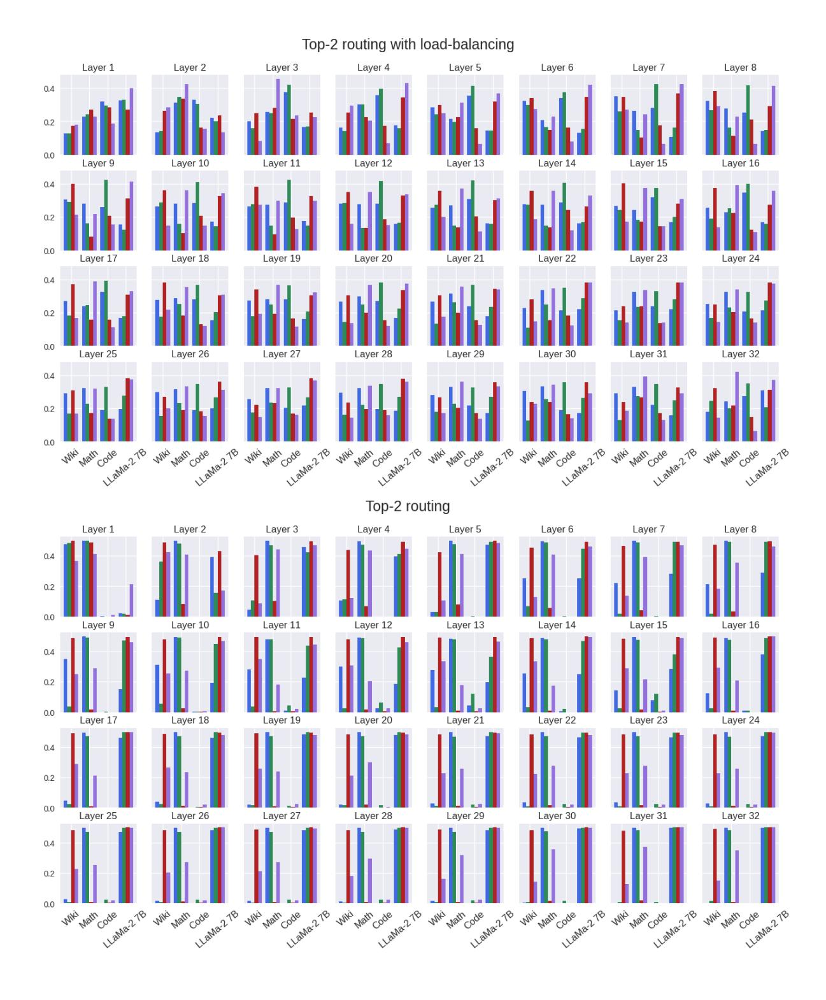
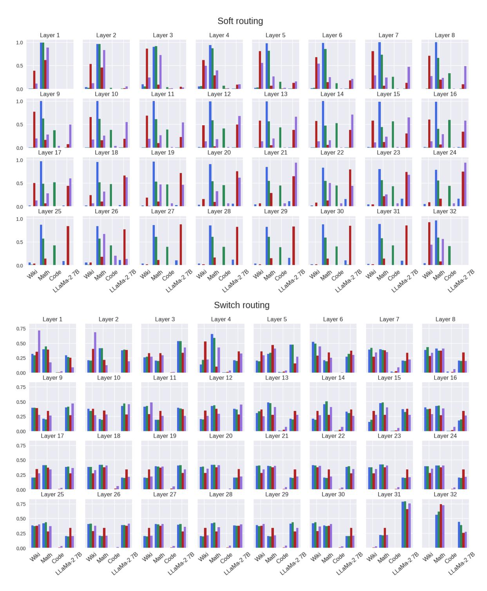
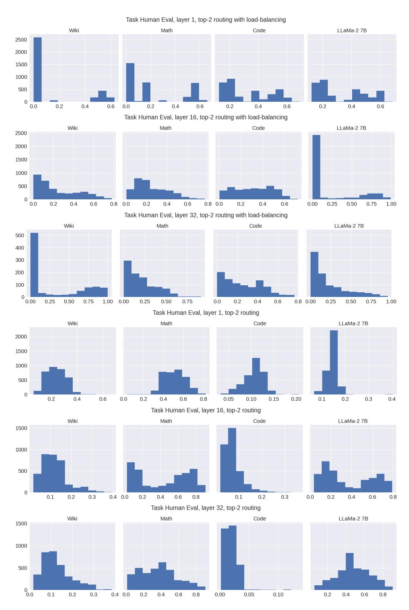
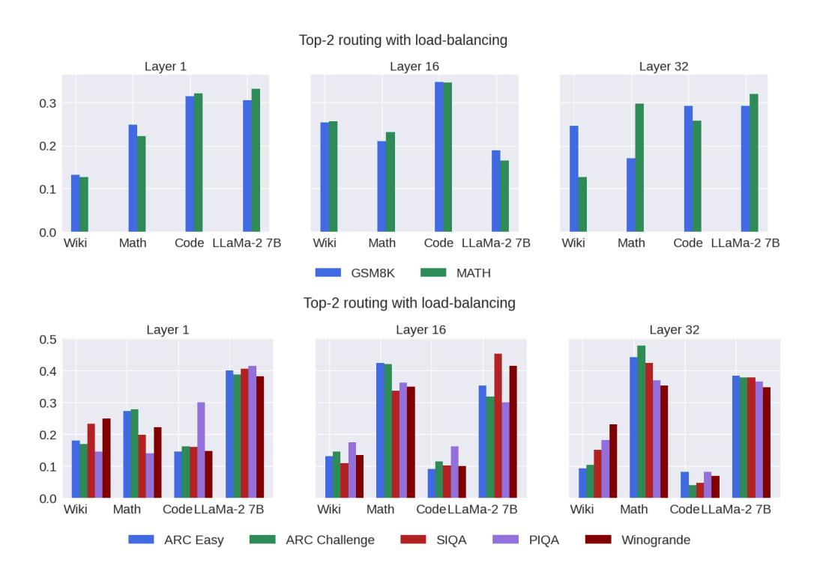

# **Appendix**

### A Data mixture

Table 7 shows the exact data mixture ratios used in training each domain expert. For finetuning the MoE model, we sample datasets that used to train math expert, code expert, wikipedia expert and the original LLAMA-2 7B with probabilities 30.16%, 40.31%, 10.30% and 19.23%.

| Domain     | Dataset                          | Sampling ratio (%) |
|------------|----------------------------------|--------------------|
|            | AlgebraicStack                   | 13.57              |
|            | OpenWebMath                      | 54.27              |
| Math       | Arxiv                            | 27.14              |
|            | Github                           | 2.99               |
|            | Commoncrawl                      | 5.01               |
|            | Code                             | 82.18              |
| Code       | Natural language related to code | 9.90               |
|            | Natural language                 | 6.93               |
| Wilsingdia | Wikipedia                        | 90.91              |
| Wikipedia  | Commoncrawl                      | 9.09               |

Table 7 Data sources and weights for domain experts.

#### **B** Evaluation

We use the same evaluation metrics as is used in Touvron et al. (2023) and Rozière et al. (2023): for code tasks (HumanEval and MBPP) we report pass@1, for math tasks (GSM8k and MATH) and knowledge tasks (Natural Questions and TriviaQA) we report exact match, we report accuracy for MMLU and ARC. We use greedy decoding for all generations. Detailed results on all tasks are reported in Table 8.

|                              | GSM8K | MATH | Human Eval | MBPP | Natural Questions | Trivia QA | ARC-e | ARC-c | Wino | SIQA | PIQA | MMLU |
|------------------------------|-------|------|---------------|------|----------------------|--------------|-------|-------|------|------|------|------|
| Specialized LLMs             |       |      |               |      |                      |              |       |       |      |      |      |      |
| CodeLlama 7B                 | 13.0  | 3.3  | 31.1          | 41.4 | 11.5                 | 32.8         | 67.4  | 34.0  | 62.7 | 46.1 | 72.9 | 38.6 |
| Llemma 7B                    | 39.3  | 16.7 | 25.6          | 41.4 | 9.4                  | 24.9         | 28.7  | 26.8  | 50.1 | 37.3 | 51.0 | 33.5 |
| Generalist LLMs              |       |      |               |      |                      |              |       |       |      |      |      |      |
| Llama-2 7B                   | 14.7  | 2.5  | 12.8          | 20.8 | 16.4                 | 58.5         | 76.4  | 43.8  | 69.2 | 48.3 | 78.8 | 46.1 |
| Llama-2 13B                  | 28.7  | 3.9  | 18.3          | 30.6 | 16.1                 | 63.8         | 77.3  | 49.4  | 73.0 | 50.1 | 80.8 | 52.8 |
| Dense (DM)                   | 26.7  | 9.9  | 20.7          | 30.8 | 24.0                 | 55.3         | 76.7  | 44.5  | 68.9 | 48.3 | 78.2 | 49.8 |
| Sparse upcycling (DM), Top-2 | 37.3  | 18.9 | 29.3          | 40.2 | 18.8                 | 49.2         | 76.3  | 43.4  | 66.4 | 47.3 | 77.9 | 51.1 |
| Sparse upcycling (CM), Top-2 | 40.1  | 16.2 | 26.2          | 35.2 | 24.5                 | 58.2         | 75.6  | 44.7  | 69.1 | 47.1 | 78.0 | 52.1 |
| BTM, Top-1                   | 27.4  | 15.2 | 30.8          | 41.9 | 15.0                 | 38.0         | 72.8  | 38.1  | 68.4 | 47.8 | 77.9 | 44.3 |
| BTM, Top-2                   | 27.7  | 15.3 | 30.6          | 42.6 | 15.3                 | 38.5         | 73.1  | 38.5  | 68.3 | 48.0 | 78.1 | 44.3 |
| BTX, sample Top-1            | 36.9  | 15.8 | 25.6          | 37.4 | 23.7                 | 56.4         | 76.7  | 45.0  | 70.6 | 48.0 | 78.2 | 53.2 |
| BTX, Top-2                   | 37.1  | 17.8 | 28.7          | 39.4 | 24.8                 | 57.1         | 76.9  | 45.6  | 67.9 | 48.7 | 78.7 | 52.5 |

**Table 8** Individual task performance of BTX and baselines.

## C Routing analysis

Layer-by-layer comparison of the routing decision for different router designs and downstream tasks aggregated by task domain is shown in Figure 4. Routing distributions slightly vary in the first few layers, but quickly become indistinguishable from layer to layer. One exception is in Switch routing where Math expert becomes dominant across tasks in the last model layer.

We observe that Code expert is a dominant force in Code domain in Top-2 routing with load balancing. Note the difference with other models where load balancing is not added, and Math expert prevails across domains. We look at Code domain closer and compare routing probability distribution for models with and without load balancing in Figure [5.](#page-19-0) On the bottom three graphs of the picture we can observe a phenomena of the dead expert, where routing probability to Code expert shifted to 0, while with load balancing added, probability distributions across experts look more similar, with slightly higher expectations for the Code expert.

To understand if experts specialize in other domains, we look closer at per-task distribution. Routing decision of the tokens in Math and Reasoning domains are shown in Figure [6.](#page-20-0) We observe that GSM8K task prefers Code and Llama-2 experts, while Math task more relies on in-domain expert. We hypothesise that this happens because GSM8K dataset consists of grade school math word problems that require common sense knowledge and basic arithmetic operations, while Math task requires college-level math knowledge, and more aligned with Math expert's training data. In the Reasoning domain, all tasks exhibit similar behaviour and equally rely on Math and generalist LLM's expertise.

Figure 4 BTX routing decisions of the tokens at various layers to different experts (Wiki, Math, Code, LLaMa-2 7B) for different downstream tasks. The tasks are aggregated by domain: Code (Human Eval, MBPP), Math (GSM8K, MATH), World knowledge (Natural Questions, TriviaQA), and Reasoning (ARC-Easy, ARC-Challenge, SIQA, PIQA, and WinoGrande). We observe that top-2 routing with load balancing ensures more uniform distribution of the load between experts compared to the other routing methods across all layers.

Figure 5 Routing probabilities per expert across different layers for Human Eval task. We compare top-2 routing with (left) and without load balancing (right).

Figure 6 Routing decision of the tokens in Math and Reasoning domains. We observe that GSM8K task prefers Code and Llama-2 experts, while MATH task relies more on in-domain expert. In the Reasoning domain, the load is distributed between Math and Llama-2 7B experts.