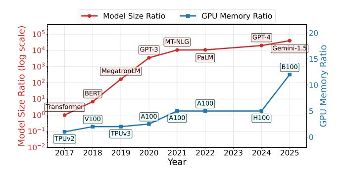
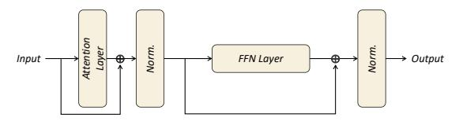
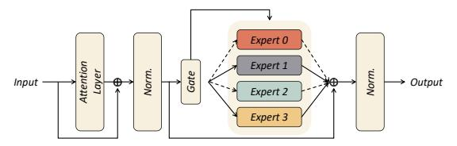

# 1 Introduction

Modern large language models (LLMs) have achieved remarkable capabilities by scaling to hundreds of billions of parameters [4, 23]. However, this scaling presents a significant computational challenge, as training and inferencing

**Figure 1.** Model size is scaling substantially faster than single-accelerator memory (2017–2025). Left (log) axis: relative model size; right axis: relative device memory, illustrating the widening gap.

such dense models are beyond the reach of most organizations [11, 18]. The Mixture-of-Experts (MoE) architecture has emerged as a compelling solution by decoupling model capacity from computational cost [3, 9, 16]. MoE architectures compose sparse layers from a large pool of smaller "expert" networks. For each input token, a gating network dynamically activates only a small subset of these experts, dramatically reducing the floating-point operations (FLOPs) required. This approach has proven effective, underpinning widely-deployed models like Mixtral, QWEN3, and DeepSeek-MoE [1, 4, 11, 20].

Despite their training efficiency, MoE models introduce a critical inference challenge: memory inefficiency. Because the gating network can route a token to *any* expert, the parameters for all experts must reside in high-bandwidth but limited GPU memory [22, 23]. This is true even though only a fraction of experts are active for any given token. As models incorporate more experts, their total parameter count often exceeds single-GPU memory capacity—a problem exacerbated by the widening gap between model size and device memory shown in Figure 1. For instance, Mixtral-8×7B activates only 14 billion parameters per forward pass, yet its full 45 billion parameters require approximately 87 GB of memory for deployment.

1

To deploy these large models on memory-constrained hardware, systems like Zero-Infinity and Accelerate have pioneered parameter offloading, relocating inactive experts to slower, more abundant storage tiers like CPU memory [5, 6, 15]. While this reduces GPU memory pressure, it introduces a severe performance bottleneck: data transfer latency [12, 17]. Loading an expert from CPU memory via PCIe can take tens of milliseconds, whereas the corresponding GPU computation takes only a few. This disparity transforms inference from a compute-bound task to an I/O-bound one, fundamentally limiting throughput.

Recent systems attempt to mitigate this I/O bottleneck with predictive prefetching, which anticipates upcoming expert needs and loads them in the background. However, these strategies face fundamental limitations [13]. Expert selection is context-dependent and difficult to predict accurately. A misprediction forces a synchronous load, incurring the full I/O latency, and potentially negating the benefits of many successful prefetches.

Our approach stems from a crucial empirical observation: experts within large MoE models exhibit substantial functional redundancy. This redundancy, confirmed by prior work showing that MoE models tolerate aggressive pruning (down to 4bits) with minimal quality loss [4], means multiple experts often learn similar functions. This presents an unexplored opportunity: instead of stalling to fetch a missing expert, the system could substitute a functionally similar expert that is already resident in GPU memory. To our knowledge, BuddyMoE is the first to utilize this redundancy to gracefully mitigate prefetch failures.

Expert prefetch misses in large inference models create significant performance bottlenecks. To address this, we present **BuddyMoE**, a novel system that exploits expert redundancy to replace these slow operations with efficient approximations. We formalize this redundancy through the concept of buddy experts: functionally similar experts that are identified via an offline analysis of co-activation patterns and output similarity on a calibration dataset. During inference, BuddyMoE uses a pre-computed lookup table to intercept a failed prefetch. Rather than waiting for a synchronous load from slower memory, it instantly substitutes the required expert with a buddy that is already available on the GPU. This approach yields a substantial reduction in latency for a marginal and often imperceptible impact on model accuracy. This paper details our methods for robust buddy identification and systematically characterizes the resulting performance-accuracy trade-off [10].

Our work makes the following contributions:

 We introduce the novel concept of buddy experts and propose a methodology for identifying functionally similar experts using co-activation frequency and output similarity metrics.

(a) A standard Transformer block with a dense Feed-Forward Network (FFN).

**(b)** An MoE block where the dense FFN is replaced by a pool of sparsely activated experts controlled by a gating network.

**Figure 2.** Architectural comparison between a standard Transformer block (a) and a MoE block (b). The MoE architecture replaces the single, dense FFN with a pool of experts, only a subset of which are activated per token.

- We conduct a comprehensive analysis of the impact of buddy expert substitution on model accuracy, characterizing how this trade-off is influenced by the number of replacements and the sensitivity of different tokens.
- We design and implement BuddyMoE, a runtime system that integrates buddy substitution into the inference pipeline to mitigate prefetch-miss penalties. Our experiments on state-of-the-art MoE models demonstrate that BuddyMoE significantly reduces miss-related latency and improves up to 10% throughput with minimal loss in model quality.

